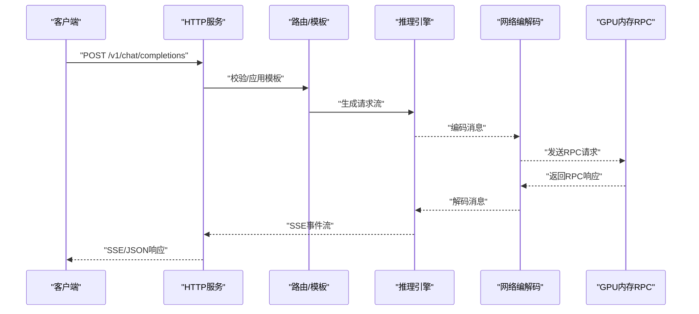
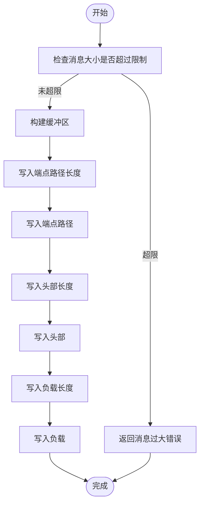
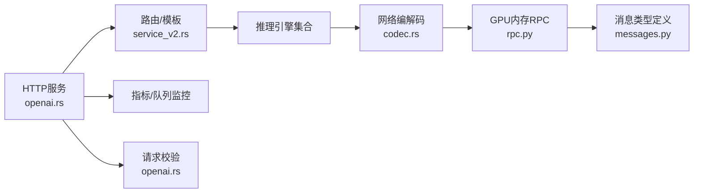

# API参考文档

<cite>
**本文档引用的文件**
- [openai.rs](file://lib/llm/src/http/service/openai.rs)
- [openapi_docs.rs](file://lib/llm/src/http/service/openapi_docs.rs)
- [service_v2.rs](file://lib/llm/src/http/service/service_v2.rs)
- [openai.rs（协议）](file://lib/llm/src/protocols/openai/chat_completions/mod.rs)
- [rpc.py](file://lib/gpu_memory_service/server/rpc.py)
- [messages.py](file://lib/gpu_memory_service/common/protocol/messages.py)
- [codec.rs](file://lib/runtime/src/pipeline/network/codec.rs)
- [two_part.rs](file://lib/runtime/src/pipeline/network/codec/two_part.rs)
- [main.rs（dynamo-run）](file://launch/dynamo-run/src/main.rs)
- [cli.md](file://docs/pages/reference/cli.md)
- [config.rs](file://lib/runtime/src/config.rs)
- [environment_names.rs](file://lib/runtime/src/config/environment_names.rs)
- [lib.rs（配置工具）](file://lib/config/src/lib.rs)
- [openai.rs（错误处理）](file://lib/llm/src/http/service/openai.rs)
- [migration.rs](file://lib/llm/src/migration.rs)
- [Cargo.toml](file://Cargo.toml)
</cite>

## 目录
1. [简介](#简介)
2. [项目结构](#项目结构)
3. [核心组件](#核心组件)
4. [架构总览](#架构总览)
5. [详细组件分析](#详细组件分析)
6. [依赖关系分析](#依赖关系分析)
7. [性能考虑](#性能考虑)
8. [故障排除指南](#故障排除指南)
9. [结论](#结论)
10. [附录](#附录)

## 简介
本文件为Dynamo的完整API参考文档，覆盖以下内容：
- OpenAI兼容API端点：HTTP方法、URL模式、请求/响应模式与认证方式
- 内部RPC接口协议：消息格式、状态管理与错误处理
- CLI命令参考：参数说明、使用示例与配置选项
- 配置参数：含义、默认值与取值范围
- 错误码与异常处理：完整列表与映射规则
- 实际API调用示例、SDK使用指南与集成最佳实践
- 版本兼容性、废弃功能与迁移指南

## 项目结构
Dynamo由多语言模块组成，核心API层位于Rust的lib/llm中，HTTP服务通过OpenAI兼容路由暴露；内部通信采用自定义网络编解码与RPC消息协议；运行时配置通过环境变量与配置文件加载。

```mermaid
graph TB
subgraph "前端接口"
HTTP["HTTP服务<br/>OpenAI兼容路由"]
SSE["SSE流式响应"]
end
subgraph "业务逻辑"
Router["路由与模板解析"]
Metrics["指标收集与队列监控"]
Validation["请求校验"]
end
subgraph "后端引擎"
Engines["推理引擎集合"]
KV["KV缓存与块管理"]
end
subgraph "内部通信"
Codec["TCP/两段消息编解码"]
RPC["GPU内存服务RPC"]
end
HTTP --> Router
Router --> Validation
Router --> Metrics
Validation --> Engines
Engines --> KV
HTTP <- --> SSE
Engines --> Codec
Codec --> RPC
```

**图表来源**
- [service_v2.rs](file://lib/llm/src/http/service/service_v2.rs#L478-L505)
- [openai.rs](file://lib/llm/src/http/service/openai.rs#L281-L324)
- [openapi_docs.rs](file://lib/llm/src/http/service/openapi_docs.rs#L298-L313)

**章节来源**
- [service_v2.rs](file://lib/llm/src/http/service/service_v2.rs#L478-L505)
- [openai.rs](file://lib/llm/src/http/service/openai.rs#L281-L324)
- [openapi_docs.rs](file://lib/llm/src/http/service/openapi_docs.rs#L298-L313)

## 核心组件
- HTTP服务与OpenAI兼容路由：负责接收请求、执行校验、路由到引擎并返回SSE或JSON响应
- 请求验证器：对聊天补全与文本补全的字段进行严格校验，确保与OpenAI语义一致
- 指标与队列监控：跟踪HTTP等待时间、并发与吞吐，支持SSE保活
- 内部编解码：统一的消息头长、负载长与校验和格式，保障跨进程/跨节点传输可靠性
- GPU内存服务RPC：基于消息类型分发的内部RPC，支持锁状态、分配状态、元数据等操作
- CLI工具：dynamo-run提供本地开发与演示，支持HTTP入口、动态命名空间与批处理

**章节来源**
- [openai.rs](file://lib/llm/src/http/service/openai.rs#L281-L324)
- [openai.rs](file://lib/llm/src/http/service/openai.rs#L1036-L1138)
- [codec.rs](file://lib/runtime/src/pipeline/network/codec.rs#L88-L119)
- [rpc.py](file://lib/gpu_memory_service/server/rpc.py#L332-L367)
- [main.rs（dynamo-run）](file://launch/dynamo-run/src/main.rs#L13-L29)

## 架构总览
Dynamo的API层以OpenAI兼容路由为核心，结合请求模板、连接监控与SSE流式输出，形成从HTTP到引擎的完整链路。内部通过两段消息编解码与RPC协议实现高可靠传输。



**图表来源**
- [openai.rs](file://lib/llm/src/http/service/openai.rs#L711-L745)
- [openai.rs](file://lib/llm/src/http/service/openai.rs#L857-L1034)
- [codec.rs](file://lib/runtime/src/pipeline/network/codec.rs#L121-L119)
- [rpc.py](file://lib/gpu_memory_service/server/rpc.py#L332-L367)

## 详细组件分析

### OpenAI兼容HTTP API
- 路由注册：服务启动时注册聊天补全、文本补全、嵌入、图像与响应端点，并可按环境变量覆盖路径
- 认证与头部：支持通过nvext头部进行路由覆盖；请求ID通过分布式追踪上下文或自定义头部注入
- 流式与非流式：统一以流式引擎执行，非流式请求在处理器内折叠为单次响应
- SSE与保活：流式响应通过SSE传输，支持可配置保活间隔
- 健康检查与指标：提供/health、/live、/metrics等辅助端点

端点概览
- 聊天补全
  - 方法：POST
  - 路径：/v1/chat/completions
  - 请求体：聊天消息数组、温度、最大生成长度等
  - 响应：SSE事件流或JSON对象
- 文本补全
  - 方法：POST
  - 路径：/v1/completions
  - 请求体：提示词、参数等
  - 响应：SSE事件流或JSON对象
- 嵌入
  - 方法：POST
  - 路径：/v1/embeddings
  - 请求体：输入文本、模型名等
  - 响应：嵌入向量列表
- 图像
  - 方法：POST
  - 路径：/v1/images
  - 请求体：图像生成参数
  - 响应：图像生成结果
- 响应
  - 方法：POST
  - 路径：/v1/responses
  - 请求体：通用响应请求
  - 响应：SSE事件流或JSON对象
- 模型列表
  - 方法：GET
  - 路径：/v1/models
  - 响应：可用模型列表
- 健康检查
  - 方法：GET
  - 路径：/health
  - 响应：服务健康状态
- 可用性检查
  - 方法：GET
  - 路径：/live
  - 响应：存活状态
- 指标
  - 方法：GET
  - 路径：/metrics
  - 响应：Prometheus指标
- OpenAPI
  - 方法：GET
  - 路径：/openapi.json
  - 响应：OpenAPI规范
- 文档
  - 方法：GET
  - 路径：/docs
  - 响应：API文档页面

请求/响应模式与认证
- 认证：未发现显式API密钥强制要求；可通过nvext头部进行路由控制
- 请求体：遵循OpenAI语义，包含模型名、参数与输入
- 响应体：SSE事件流或JSON对象，错误时返回标准错误结构

错误处理
- 400：请求字段无效或缺失（如messages为空）
- 404：模型不存在
- 400/404：JSON解析失败时转换为400
- 501：不支持的功能（如已弃用的function_call/functions）
- 503：服务就绪但不可用
- 500：内部错误，返回通用错误消息

**章节来源**
- [service_v2.rs](file://lib/llm/src/http/service/service_v2.rs#L478-L505)
- [openapi_docs.rs](file://lib/llm/src/http/service/openapi_docs.rs#L298-L313)
- [openai.rs](file://lib/llm/src/http/service/openai.rs#L281-L324)
- [openai.rs](file://lib/llm/src/http/service/openai.rs#L1036-L1138)
- [openai.rs](file://lib/llm/src/http/service/openai.rs#L95-L207)

### 内部RPC接口（GPU内存服务）
消息类型与协议
- 消息类型：握手、提交、锁状态查询、分配状态查询、分配、导出、获取分配、列出分配、释放、清空、错误、元数据增删查改、状态哈希等
- 编解码：采用msgpack编码，提供encode/decode函数
- 处理流程：根据消息类型分派到对应处理器，部分特殊消息（如CommitRequest、GetLockStateRequest等）有专用分支

状态管理
- 锁状态：读写锁计数、等待写者数量、已提交状态
- 分配状态：分配ID、文件描述符、元数据列表
- 元数据：键值对存储，支持增删查改与列举
- 状态哈希：用于一致性校验


**图表来源**
- [messages.py](file://lib/gpu_memory_service/common/protocol/messages.py#L169-L200)

**章节来源**
- [rpc.py](file://lib/gpu_memory_service/server/rpc.py#L332-L367)
- [messages.py](file://lib/gpu_memory_service/common/protocol/messages.py#L169-L200)

### 网络编解码与消息格式
- TCP消息格式：端点路径长度+路径+头部长度+头部+负载长度+负载
- 两段消息格式：头长度+体长度+校验和+头部+数据，支持校验和（调试模式）与长度限制
- 错误处理：消息过大、解码长度不足等场景返回明确错误



**图表来源**
- [codec.rs](file://lib/runtime/src/pipeline/network/codec.rs#L88-L119)

**章节来源**
- [codec.rs](file://lib/runtime/src/pipeline/network/codec.rs#L88-L119)
- [two_part.rs](file://lib/runtime/src/pipeline/network/codec/two_part.rs#L112-L146)

### CLI命令参考（dynamo-run）
- 基础用法：dynamo-run <模型标识>，支持HTTP入口、文本入口与批处理
- 日志级别：-v启用debug，-vv启用trace；也可设置DYN_LOG
- 分布式系统：支持in=dyn://命名空间/组件/端点与out=auto自动发现
- KV感知路由：--router-mode kv、--kv-overlap-score-weight、--router-temperature、--use-kv-events
- 请求迁移：--migration-limit指定迁移次数
- 引擎选择：默认mistralrs，也可使用echo/mocker；生产建议使用Python封装的引擎

示例
- 启动HTTP服务并访问模型列表与聊天补全
- 使用动态命名空间进行分布式部署
- 启用KV感知路由优化前缀缓存命中

**章节来源**
- [main.rs（dynamo-run）](file://launch/dynamo-run/src/main.rs#L13-L29)
- [cli.md](file://docs/pages/reference/cli.md#L1-L412)

### 配置参数
- 运行时配置优先级：环境变量 > /opt/dynamo/etc/runtime.toml > /opt/dynamo/defaults/runtime.toml
- 关键环境变量前缀：DYN_RUNTIME_、DYN_SYSTEM_
- 示例变量（节选）：日志、线程池、系统端口、健康检查路径、NATS认证等
- 已废弃变量：DYN_SYSTEM_USE_ENDPOINT_HEALTH_STATUS、DYN_SYSTEM_ENABLED（见警告日志）

**章节来源**
- [config.rs](file://lib/runtime/src/config.rs#L222-L331)
- [environment_names.rs](file://lib/runtime/src/config/environment_names.rs#L392-L423)
- [lib.rs（配置工具）](file://lib/config/src/lib.rs#L11-L35)

### 错误码与异常处理
- HTTP错误映射：4xx内部错误统一转为500，422转换为400
- 特定错误：
  - 400：必填字段缺失（如messages为空）、stream_options仅在stream=true时允许
  - 404：模型不存在
  - 501：不支持的功能（如已弃用的function_call/functions）
  - 503：服务未就绪
  - 500：内部错误
- 引擎错误：后端错误通过SSE事件“event:error”传递，或在非流式聚合前检测

**章节来源**
- [openai.rs（错误处理）](file://lib/llm/src/http/service/openai.rs#L95-L207)
- [openai.rs（错误处理）](file://lib/llm/src/http/service/openai.rs#L1036-L1138)

### SDK使用指南与集成最佳实践
- Python绑定：通过dynamo.llm与dynamo.runtime注册组件、注册端点与实现请求处理器
- 模型输入类型：Tokens（预处理）或Text（自处理）
- 模型类型：Chat或Completions
- 用户数据：可携带LoRA等自定义元数据
- 最佳实践：使用SSE进行流式输出；在分布式环境中启用请求取消与迁移；合理设置KV感知路由参数

**章节来源**
- [cli.md](file://docs/pages/reference/cli.md#L324-L402)

### 版本兼容性、废弃功能与迁移指南
- 版本：工作区版本0.9.0
- 废弃变量：DYN_SYSTEM_USE_ENDPOINT_HEALTH_STATUS、DYN_SYSTEM_ENABLED（见运行时配置警告）
- 迁移：请求迁移通过--migration-limit启用，支持在分布式系统中优雅处理节点故障
- 协议演进：内部RPC消息类型稳定，建议通过消息类型映射与错误处理保持向后兼容

**章节来源**
- [Cargo.toml](file://Cargo.toml#L39)
- [config.rs](file://lib/runtime/src/config.rs#L317-L331)
- [migration.rs](file://lib/llm/src/migration.rs#L24-L47)

## 依赖关系分析



**图表来源**
- [openai.rs](file://lib/llm/src/http/service/openai.rs#L281-L324)
- [service_v2.rs](file://lib/llm/src/http/service/service_v2.rs#L478-L505)
- [codec.rs](file://lib/runtime/src/pipeline/network/codec.rs#L88-L119)
- [rpc.py](file://lib/gpu_memory_service/server/rpc.py#L332-L367)
- [messages.py](file://lib/gpu_memory_service/common/protocol/messages.py#L169-L200)

**章节来源**
- [openai.rs](file://lib/llm/src/http/service/openai.rs#L281-L324)
- [service_v2.rs](file://lib/llm/src/http/service/service_v2.rs#L478-L505)
- [codec.rs](file://lib/runtime/src/pipeline/network/codec.rs#L88-L119)
- [rpc.py](file://lib/gpu_memory_service/server/rpc.py#L332-L367)
- [messages.py](file://lib/gpu_memory_service/common/protocol/messages.py#L169-L200)

## 性能考虑
- 流式传输：SSE减少首字节延迟，适合实时对话
- 队列与并发：HTTP队列监控与指标收集有助于容量规划
- 编解码开销：两段消息格式引入校验和与长度检查，调试模式下校验和计算可能带来额外CPU开销
- KV感知路由：通过KV事件或TTL预测维护全局缓存视图，提升前缀缓存命中率

## 故障排除指南
- 422转400：JSON解析失败自动转换为400并返回原始错误消息
- 503服务不可用：服务就绪但未准备完成，稍后重试
- 501不支持：使用了已弃用字段（如function_call/functions），请迁移到新字段
- 客户端断连：HTTP入口下断连会触发下游请求取消，避免资源浪费
- 日志级别：使用-DYN_LOG或-dynamo-run -v/-vv定位问题

**章节来源**
- [openai.rs（错误处理）](file://lib/llm/src/http/service/openai.rs#L224-L246)
- [openai.rs（错误处理）](file://lib/llm/src/http/service/openai.rs#L1036-L1138)
- [cli.md](file://docs/pages/reference/cli.md#L166-L171)

## 结论
Dynamo提供了完整的OpenAI兼容API与内部RPC协议，结合SSE流式传输、分布式路由与指标监控，适用于开发与生产的多场景部署。通过合理的配置与最佳实践，可在保证低延迟的同时获得稳定的吞吐表现。

## 附录
- OpenAI兼容端点清单与请求/响应模式详见“OpenAI兼容HTTP API”
- 内部RPC消息类型与处理流程详见“内部RPC接口（GPU内存服务）”
- CLI参数与示例详见“CLI命令参考（dynamo-run）”
- 配置项与默认值详见“配置参数”
- 错误码与异常处理详见“错误码与异常处理”
- 版本兼容性与迁移指南详见“版本兼容性、废弃功能与迁移指南”