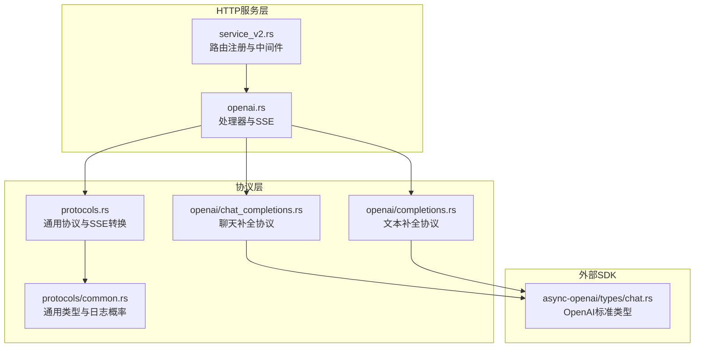
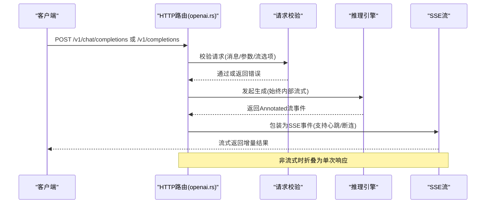
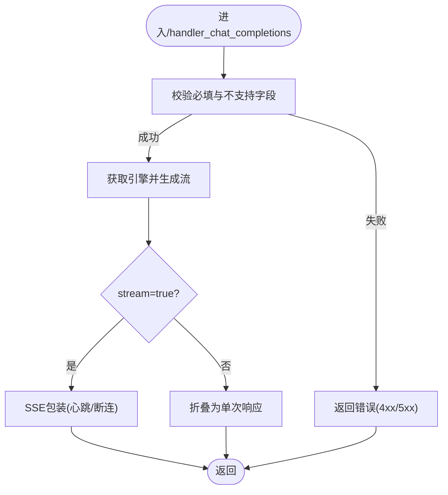
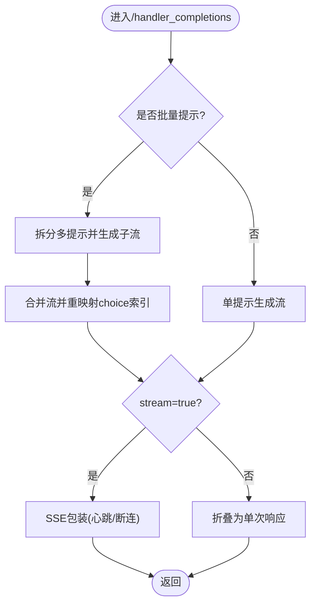
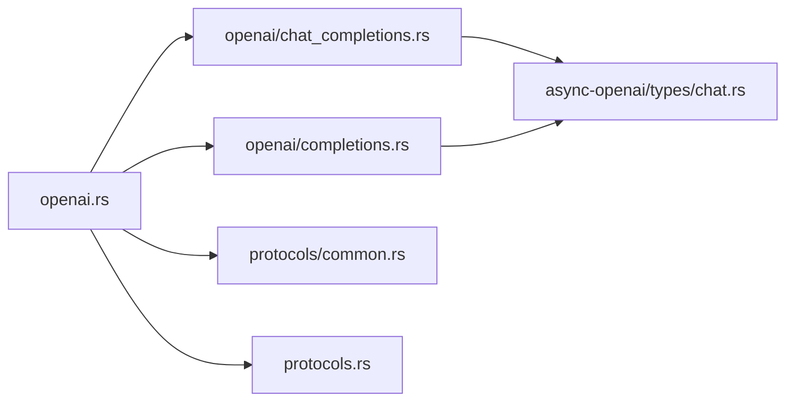

# OpenAI兼容API

<cite>
**本文档引用的文件**
- [lib/llm/src/http/service/openai.rs](file://lib/llm/src/http/service/openai.rs)
- [lib/llm/src/protocols/openai/chat_completions.rs](file://lib/llm/src/protocols/openai/chat_completions.rs)
- [lib/llm/src/protocols/openai/completions.rs](file://lib/llm/src/protocols/openai/completions.rs)
- [lib/llm/src/protocols/common.rs](file://lib/llm/src/protocols/common.rs)
- [lib/llm/src/http/service/service_v2.rs](file://lib/llm/src/http/service/service_v2.rs)
- [lib/llm/src/endpoint_type.rs](file://lib/llm/src/endpoint_type.rs)
- [lib/llm/src/protocols.rs](file://lib/llm/src/protocols.rs)
- [lib/async-openai/src/types/chat.rs](file://lib/async-openai/src/types/chat.rs)
- [examples/deployments/router_standalone_trtllm/api.py](file://examples/deployments/router_standalone_trtllm/api.py)
- [tests/utils/client.py](file://tests/utils/client.py)
</cite>

## 目录
1. [简介](#简介)
2. [项目结构](#项目结构)
3. [核心组件](#核心组件)
4. [架构总览](#架构总览)
5. [详细组件分析](#详细组件分析)
6. [依赖关系分析](#依赖关系分析)
7. [性能考虑](#性能考虑)
8. [故障排除指南](#故障排除指南)
9. [结论](#结论)
10. [附录](#附录)

## 简介
本文件为该代码库中OpenAI兼容API的完整技术文档，重点覆盖以下内容：
- HTTP端点：POST /v1/chat/completions 与 POST /v1/completions 的请求/响应格式与行为
- 聊天补全与文本补全的参数规范（如messages数组、temperature、max_tokens、top_p等）
- JSON Schema定义与字段说明（基于协议层结构）
- 实际调用示例（以curl形式展示不同参数组合）
- 流式响应（SSE）的实现方式与客户端处理要点
- 错误响应格式与HTTP状态码含义
- SDK使用指南与常见集成最佳实践

## 项目结构
该OpenAI兼容API由HTTP服务层、协议层与引擎层组成：
- HTTP服务层负责路由注册、请求校验、流式输出与错误映射
- 协议层定义请求/响应结构（含OpenAI标准字段与扩展字段）
- 引擎层执行推理与生成，返回可序列化的流式事件

图表来源
- [lib/llm/src/http/service/service_v2.rs](file://lib/llm/src/http/service/service_v2.rs#L478-L505)
- [lib/llm/src/http/service/openai.rs](file://lib/llm/src/http/service/openai.rs#L1540-L1587)
- [lib/llm/src/protocols.rs](file://lib/llm/src/protocols.rs#L1-L57)
- [lib/llm/src/protocols/openai/chat_completions.rs](file://lib/llm/src/protocols/openai/chat_completions.rs#L27-L64)
- [lib/llm/src/protocols/openai/completions.rs](file://lib/llm/src/protocols/openai/completions.rs#L27-L45)
- [lib/llm/src/protocols/common.rs](file://lib/llm/src/protocols/common.rs#L491-L522)
- [lib/async-openai/src/types/chat.rs](file://lib/async-openai/src/types/chat.rs#L1115-L1232)

章节来源
- [lib/llm/src/http/service/service_v2.rs](file://lib/llm/src/http/service/service_v2.rs#L478-L505)
- [lib/llm/src/http/service/openai.rs](file://lib/llm/src/http/service/openai.rs#L1540-L1587)
- [lib/llm/src/protocols.rs](file://lib/llm/src/protocols.rs#L1-L57)

## 核心组件
- 路由与端点
  - /v1/chat/completions：聊天补全端点，支持流式与非流式
  - /v1/completions：文本补全端点，支持批量提示与流式/非流式
- 请求/响应协议
  - 聊天补全：NvCreateChatCompletionRequest/NvCreateChatCompletionResponse
  - 文本补全：NvCreateCompletionRequest/NvCreateCompletionResponse
- SSE流式输出
  - 使用Axum的SSE，支持心跳与断连检测
- 错误处理
  - 统一错误体结构，状态码映射（4xx/5xx），JSON校验错误转400

章节来源
- [lib/llm/src/http/service/openai.rs](file://lib/llm/src/http/service/openai.rs#L1540-L1587)
- [lib/llm/src/protocols/openai/chat_completions.rs](file://lib/llm/src/protocols/openai/chat_completions.rs#L27-L82)
- [lib/llm/src/protocols/openai/completions.rs](file://lib/llm/src/protocols/openai/completions.rs#L27-L51)

## 架构总览
下图展示了从HTTP请求到引擎生成再到SSE响应的关键流程。

图表来源
- [lib/llm/src/http/service/openai.rs](file://lib/llm/src/http/service/openai.rs#L857-L1034)
- [lib/llm/src/http/service/openai.rs](file://lib/llm/src/http/service/openai.rs#L281-L476)

章节来源
- [lib/llm/src/http/service/openai.rs](file://lib/llm/src/http/service/openai.rs#L857-L1034)

## 详细组件分析

### HTTP端点与路由
- /v1/chat/completions
  - 方法：POST
  - 路由注册：chat_completions_router
  - 默认路径：/v1/chat/completions
  - 中间件：统一JSON错误处理、请求体大小限制
- /v1/completions
  - 方法：POST
  - 路由注册：completions_router
  - 默认路径：/v1/completions
  - 支持批量提示（多条prompt）与n选择聚合
- /v1/embeddings
  - 方法：POST
  - 默认路径：/v1/embeddings
  - 非流式聚合响应
- /v1/models
  - 方法：GET
  - 默认路径：/v1/models
  - 列出可用模型清单

章节来源
- [lib/llm/src/http/service/openai.rs](file://lib/llm/src/http/service/openai.rs#L1540-L1587)
- [lib/llm/src/http/service/service_v2.rs](file://lib/llm/src/http/service/service_v2.rs#L478-L505)

### 聊天补全：POST /v1/chat/completions
- 请求体字段（节选）
  - model：模型名称
  - messages：消息数组，至少包含一条消息
  - temperature/top_p：采样温度与核采样
  - max_completion_tokens/max_tokens：最大生成长度（优先max_completion_tokens）
  - n：每条提示生成的候选数
  - stream/stream_options：是否流式与流式选项
  - tools/tool_choice/response_format/logprobs/top_logprobs：工具调用、响应格式、日志概率
  - stop：停止词
  - presence_penalty/frequency_penalty：重复惩罚
  - user：用户标识
  - nvext：NVIDIA扩展字段（注解、路由覆盖等）
  - chat_template_args/media_io_kwargs：模板参数与媒体解码参数
- 响应体字段（节选）
  - id/choices/created/model/object/system_fingerprint/usage/nvext
  - 流式响应对象为chat.completion.chunk
- 校验规则
  - messages不能为空
  - stream_options仅在stream=true时允许
  - 不支持的字段会返回501未实现
- 流式处理
  - 内部始终以流式生成，SSE包装；断连检测与心跳配置
- 错误映射
  - JSON解析失败统一转400
  - 参数校验失败400
  - 后端错误通过SSE事件携带

图表来源
- [lib/llm/src/http/service/openai.rs](file://lib/llm/src/http/service/openai.rs#L857-L1034)
- [lib/llm/src/http/service/openai.rs](file://lib/llm/src/http/service/openai.rs#L1061-L1107)

章节来源
- [lib/llm/src/http/service/openai.rs](file://lib/llm/src/http/service/openai.rs#L857-L1034)
- [lib/llm/src/protocols/openai/chat_completions.rs](file://lib/llm/src/protocols/openai/chat_completions.rs#L331-L375)

### 文本补全：POST /v1/completions
- 请求体字段（节选）
  - model：模型名称
  - prompt：支持字符串、字符串数组、整型数组、整型数组的数组
  - max_tokens/temperature/top_p/n/logprobs/stop/presence_penalty/frequency_penalty/user
  - stream/stream_options：同上
  - nvext/metadata：扩展与元数据
- 批量提示
  - 支持多条提示与n选择聚合，内部拆分为多个子流再合并
- 响应体字段（节选）
  - choices（每项包含text/index/finish_reason等）
  - id/object/created/model/system_fingerprint/usage
- 校验规则
  - prompt与prompt_embeds二选一或同时存在（embeddings有大小与格式约束）
  - stream_options仅在stream=true时允许
  - n与temperature交叉校验
- 流式处理
  - 同聊天补全，内部流式，SSE包装

图表来源
- [lib/llm/src/http/service/openai.rs](file://lib/llm/src/http/service/openai.rs#L281-L476)
- [lib/llm/src/http/service/openai.rs](file://lib/llm/src/http/service/openai.rs#L478-L638)
- [lib/llm/src/protocols/openai/completions.rs](file://lib/llm/src/protocols/openai/completions.rs#L82-L113)

章节来源
- [lib/llm/src/http/service/openai.rs](file://lib/llm/src/http/service/openai.rs#L281-L476)
- [lib/llm/src/http/service/openai.rs](file://lib/llm/src/http/service/openai.rs#L478-L638)
- [lib/llm/src/protocols/openai/completions.rs](file://lib/llm/src/protocols/openai/completions.rs#L418-L462)

### JSON Schema与字段说明
- 聊天补全请求（NvCreateChatCompletionRequest）
  - 继承OpenAI标准CreateChatCompletionRequest，扩展common与nvext
  - 关键字段：messages（必填）、model、temperature、top_p、max_completion_tokens、n、stream、tools、tool_choice、response_format、logprobs/top_logprobs、stop、presence_penalty、frequency_penalty、user、nvext、chat_template_args、media_io_kwargs
  - 校验：messages非空、stream_options仅在stream=true时允许、不支持字段返回501
- 文本补全请求（NvCreateCompletionRequest）
  - 继承OpenAI标准CreateCompletionRequest，扩展common与nvext
  - 关键字段：prompt（支持多种格式）、model、max_tokens、temperature、top_p、n、logprobs、stop、presence_penalty、frequency_penalty、best_of、user、nvext、metadata
  - 校验：prompt与prompt_embeds二选一或同时存在，embeddings需满足大小与编码要求，n与temperature交叉校验
- 通用日志概率结构（ChatCompletionTokenLogprob/TopLogprob）
  - token/logprob/bytes/top_logprobs用于logprobs输出

章节来源
- [lib/llm/src/protocols/openai/chat_completions.rs](file://lib/llm/src/protocols/openai/chat_completions.rs#L27-L64)
- [lib/llm/src/protocols/openai/chat_completions.rs](file://lib/llm/src/protocols/openai/chat_completions.rs#L331-L375)
- [lib/llm/src/protocols/openai/completions.rs](file://lib/llm/src/protocols/openai/completions.rs#L27-L45)
- [lib/llm/src/protocols/openai/completions.rs](file://lib/llm/src/protocols/openai/completions.rs#L418-L462)
- [lib/llm/src/protocols/common.rs](file://lib/llm/src/protocols/common.rs#L491-L522)

### 实际调用示例
以下示例展示不同参数组合的效果（以curl形式）：
- 基础聊天补全（非流式）
  - curl -X POST http://localhost:8000/v1/chat/completions -H "Content-Type: application/json" -d '{"model":"meta/llama3-70b","messages":[{"role":"user","content":"你好"}]}'
- 聊天补全（流式）
  - curl -N -X POST http://localhost:8000/v1/chat/completions -H "Content-Type: application/json" -d '{"model":"meta/llama3-70b","messages":[{"role":"user","content":"讲个笑话"}],"stream":true}'
- 文本补全（非流式）
  - curl -X POST http://localhost:8000/v1/completions -H "Content-Type: application/json" -d '{"model":"gpt2","prompt":"今天天气很好","max_tokens":64,"temperature":0.7}'
- 文本补全（流式）
  - curl -N -X POST http://localhost:8000/v1/completions -H "Content-Type: application/json" -d '{"model":"gpt2","prompt":"写一首诗","stream":true}'
- 带工具调用的聊天补全
  - curl -X POST http://localhost:8000/v1/chat/completions -H "Content-Type: application/json" -d '{"model":"meta/llama3-70b","messages":[{"role":"user","content":"帮我查天气"}],"tools":[{"type":"function","function":{"name":"get_weather","description":"获取天气","parameters":{"type":"object","properties":{"city":{"type":"string"}}}}}],"tool_choice":"auto"}'

章节来源
- [examples/deployments/router_standalone_trtllm/api.py](file://examples/deployments/router_standalone_trtllm/api.py#L520-L531)
- [tests/utils/client.py](file://tests/utils/client.py#L79-L118)

### 流式响应（SSE）实现与客户端处理
- 服务器端
  - 使用Axum的SSE，支持keep-alive心跳
  - 断连检测：连接断开时取消后台生成任务
  - 错误事件：后端错误通过事件名为“error”的SSE事件传递
- 客户端建议
  - 使用EventSource或类似机制接收SSE
  - 处理事件名“error”并映射为应用级错误
  - 对于stream_options.include_usage，注意最后可能为空choices的chunk
  - 心跳间隔可根据服务端keep-alive配置调整

章节来源
- [lib/llm/src/http/service/openai.rs](file://lib/llm/src/http/service/openai.rs#L964-L995)
- [lib/llm/src/http/service/openai.rs](file://lib/llm/src/http/service/openai.rs#L1360-L1371)

### 错误响应格式与HTTP状态码
- 统一错误体
  - 字段：message/type/code
  - type来自HTTP状态码的标准原因
- 状态码映射
  - 400：参数校验失败、JSON解析失败（统一转400）
  - 404：模型不存在
  - 400/401/403：认证/授权相关（由上游网关或中间件决定）
  - 409：冲突（如资源忙）
  - 413：请求体过大（受默认45MB限制，可通过环境变量调整）
  - 429：限流
  - 500：内部错误
  - 501：功能未实现（如不支持的字段）
  - 503：服务不可用（就绪检查失败）
- 特殊处理
  - JSON解析失败自动转400
  - 后端错误通过SSE事件“error”传递，不改变HTTP状态码

章节来源
- [lib/llm/src/http/service/openai.rs](file://lib/llm/src/http/service/openai.rs#L80-L207)
- [lib/llm/src/http/service/openai.rs](file://lib/llm/src/http/service/openai.rs#L221-L246)

### SDK使用指南与最佳实践
- 推荐SDK
  - 使用async-openai（Rust）或官方Python SDK对接
  - 保持与OpenAI标准一致的请求字段命名
- 最佳实践
  - 明确设置stream与stream_options，避免歧义
  - 在高并发场景下合理设置超时与重试策略
  - 使用注解（annotations）进行调试与追踪
  - 对日志概率（logprobs/top_logprobs）与工具调用（tools/tool_choice）按需开启
  - 对批量提示（completions）注意n与choices总数限制
- 常见问题
  - messages为空：确保至少包含一条消息
  - stream_options仅在stream=true时有效
  - 不支持的字段会返回501，需移除或替换为等价字段

章节来源
- [lib/llm/src/http/service/openai.rs](file://lib/llm/src/http/service/openai.rs#L1061-L1107)
- [lib/llm/src/protocols/openai/chat_completions.rs](file://lib/llm/src/protocols/openai/chat_completions.rs#L331-L375)
- [lib/llm/src/protocols/openai/completions.rs](file://lib/llm/src/protocols/openai/completions.rs#L418-L462)

## 依赖关系分析
- 组件耦合
  - HTTP服务层依赖协议层的请求/响应结构
  - 协议层依赖OpenAI标准类型与验证器
  - SSE转换器与Annotated事件封装
- 可能的循环依赖
  - 协议模块通过公共类型与SSE转换器间接交互，无直接循环
- 外部依赖
  - Axum（HTTP/SSE）、Serde（序列化）、Tokio（异步）、utoipa/validator（文档与校验）

图表来源
- [lib/llm/src/http/service/openai.rs](file://lib/llm/src/http/service/openai.rs#L1-L80)
- [lib/llm/src/protocols.rs](file://lib/llm/src/protocols.rs#L1-L57)
- [lib/llm/src/protocols/openai/chat_completions.rs](file://lib/llm/src/protocols/openai/chat_completions.rs#L1-L25)
- [lib/llm/src/protocols/openai/completions.rs](file://lib/llm/src/protocols/openai/completions.rs#L1-L25)
- [lib/async-openai/src/types/chat.rs](file://lib/async-openai/src/types/chat.rs#L1115-L1232)

章节来源
- [lib/llm/src/http/service/openai.rs](file://lib/llm/src/http/service/openai.rs#L1-L80)
- [lib/llm/src/protocols.rs](file://lib/llm/src/protocols.rs#L1-L57)

## 性能考虑
- 流式优于非流式：SSE可降低首字延迟，适合实时对话
- 批量提示：completions支持批量与n聚合，注意内存与吞吐平衡
- 心跳与断连：合理设置keep-alive与断连检测，避免无效连接占用
- 超大请求体：默认45MB限制，可通过环境变量调整
- 日志概率：开启logprobs/top_logprobs会增加计算与带宽成本

## 故障排除指南
- 400错误（参数校验失败）
  - 检查messages是否为空、stream_options是否与stream匹配、不支持字段是否移除
- 404错误（模型不存在）
  - 确认模型名称正确且已加载
- 413错误（请求体过大）
  - 减少输入长度或调整环境变量中的体限制
- 500/501错误
  - 500：内部异常，查看服务日志
  - 501：功能未实现，检查字段是否被弃用或不受支持
- SSE无数据
  - 确认客户端正确处理SSE事件，关注“error”事件与心跳

章节来源
- [lib/llm/src/http/service/openai.rs](file://lib/llm/src/http/service/openai.rs#L80-L207)
- [lib/llm/src/http/service/openai.rs](file://lib/llm/src/http/service/openai.rs#L1061-L1107)

## 结论
该OpenAI兼容API在保持与OpenAI标准高度一致的同时，提供了灵活的扩展能力（如注解、工具调用、引导解码等）。通过SSE流式输出与严格的参数校验，既保证了易用性也兼顾了性能与可观测性。建议在生产环境中结合SDK与监控体系，按需启用日志概率与工具调用，并合理配置流式与批处理策略。

## 附录
- 端点一览
  - POST /v1/chat/completions：聊天补全（流式/非流式）
  - POST /v1/completions：文本补全（流式/非流式，支持批量）
  - POST /v1/embeddings：嵌入向量（非流式）
  - GET /v1/models：列出模型
- 关键参数速查
  - 聊天补全：messages、model、temperature、top_p、max_completion_tokens、n、stream、tools、tool_choice、response_format、logprobs、top_logprobs、stop、presence_penalty、frequency_penalty、user、nvext
  - 文本补全：prompt、model、max_tokens、temperature、top_p、n、logprobs、stop、presence_penalty、frequency_penalty、best_of、user、nvext、metadata