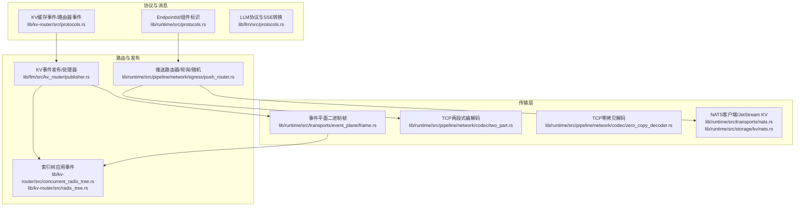
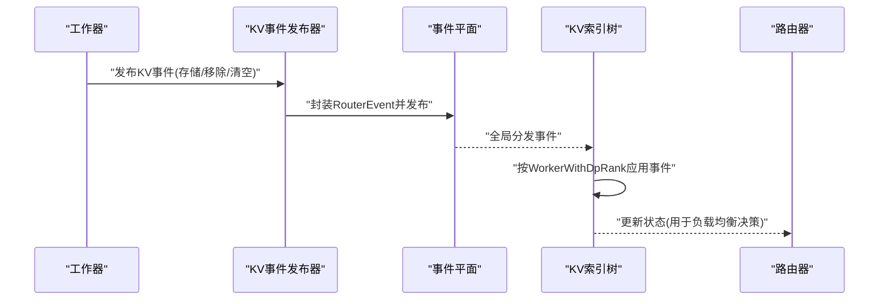
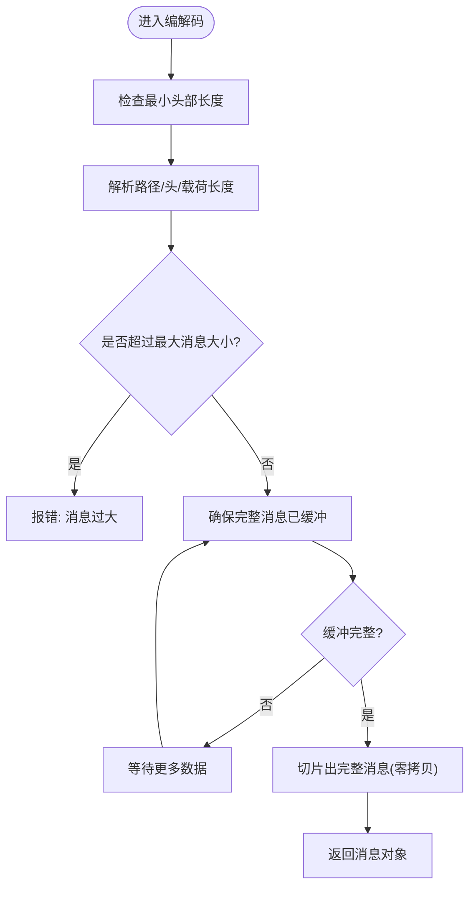
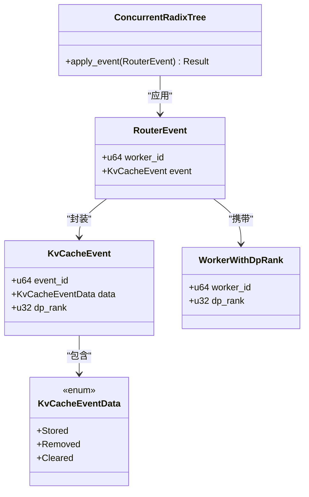
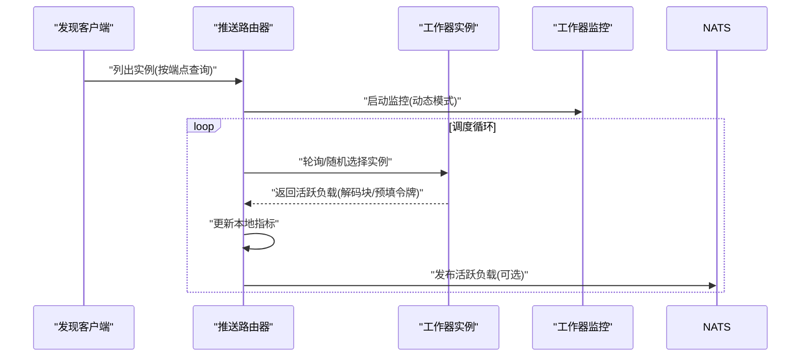
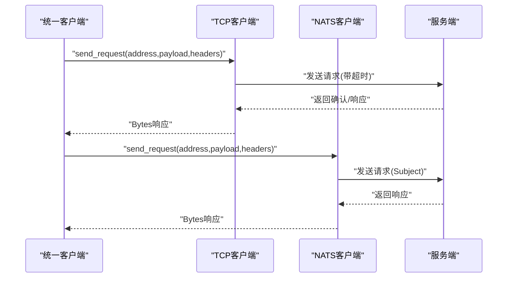
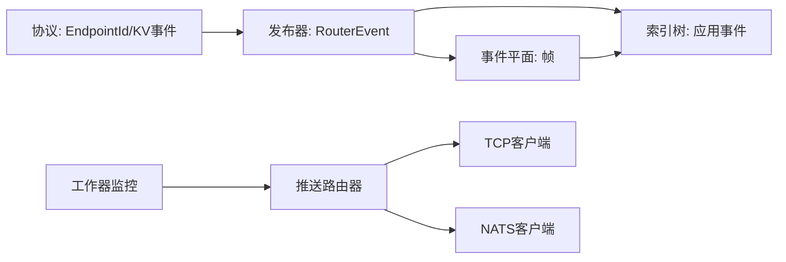

# 内部RPC接口

<cite>
**本文引用的文件**
- [lib/runtime/src/protocols.rs](file://lib/runtime/src/protocols.rs)
- [lib/kv-router/src/protocols.rs](file://lib/kv-router/src/protocols.rs)
- [lib/llm/src/protocols.rs](file://lib/llm/src/protocols.rs)
- [lib/runtime/src/transports/event_plane/frame.rs](file://lib/runtime/src/transports/event_plane/frame.rs)
- [lib/runtime/src/pipeline/network/codec/two_part.rs](file://lib/runtime/src/pipeline/network/codec/two_part.rs)
- [lib/runtime/src/pipeline/network/codec/zero_copy_decoder.rs](file://lib/runtime/src/pipeline/network/codec/zero_copy_decoder.rs)
- [lib/runtime/src/pipeline/network/codec.rs](file://lib/runtime/src/pipeline/network/codec.rs)
- [lib/runtime/src/pipeline/network/egress/tcp_client.rs](file://lib/runtime/src/pipeline/network/egress/tcp_client.rs)
- [lib/runtime/src/pipeline/network/egress/nats_client.rs](file://lib/runtime/src/pipeline/network/egress/nats_client.rs)
- [lib/runtime/src/pipeline/network/egress/push_router.rs](file://lib/runtime/src/pipeline/network/egress/push_router.rs)
- [lib/llm/src/kv_router/publisher.rs](file://lib/llm/src/kv_router/publisher.rs)
- [lib/kv-router/src/concurrent_radix_tree.rs](file://lib/kv-router/src/concurrent_radix_tree.rs)
- [lib/kv-router/src/radix_tree.rs](file://lib/kv-router/src/radix_tree.rs)
- [lib/llm/src/kv_router/sequence.rs](file://lib/llm/src/kv_router/sequence.rs)
- [lib/llm/src/discovery/worker_monitor.rs](file://lib/llm/src/discovery/worker_monitor.rs)
- [lib/runtime/src/transports/nats.rs](file://lib/runtime/src/transports/nats.rs)
- [lib/runtime/src/storage/kv/nats.rs](file://lib/runtime/src/storage/kv/nats.rs)
- [lib/runtime/src/service.rs](file://lib/runtime/src/service.rs)
- [lib/runtime/src/pipeline/network/egress/unified_client.rs](file://lib/runtime/src/pipeline/network/egress/unified_client.rs)
- [lib/runtime/src/pipeline/network/egress/tcp_client.rs](file://lib/runtime/src/pipeline/network/egress/tcp_client.rs)
- [lib/runtime/src/pipeline/network/egress/nats_client.rs](file://lib/runtime/src/pipeline/network/egress/nats_client.rs)
- [lib/runtime/src/transports/etcd/connector.rs](file://lib/runtime/src/transports/etcd/connector.rs)
- [lib/llm/src/http/service/disconnect.rs](file://lib/llm/src/http/service/disconnect.rs)
- [lib/runtime/benches/tcp_codec_perf.rs](file://lib/runtime/benches/tcp_codec_perf.rs)
</cite>

## 目录
1. [简介](#简介)
2. [项目结构](#项目结构)
3. [核心组件](#核心组件)
4. [架构总览](#架构总览)
5. [详细组件分析](#详细组件分析)
6. [依赖关系分析](#依赖关系分析)
7. [性能考量](#性能考量)
8. [故障排查指南](#故障排查指南)
9. [结论](#结论)
10. [附录](#附录)

## 简介
本文件系统化梳理 Dynamo 内部 RPC 接口与组件间通信协议，覆盖请求/响应消息格式、序列化方式、传输层协议、KV 缓存事件协议、工作器注册与负载均衡协议，并给出消息类型定义、字段说明、数据校验规则、版本控制与向后兼容策略、消息交换示例与调试技巧、连接管理与超时设置、错误处理机制以及协议扩展指南。

## 项目结构
- 协议与消息模型集中在运行时与 KV 路由模块中，统一通过 serde 进行序列化，支持 JSON 与二进制编码（如 bincode）。
- 传输层采用多协议适配：TCP（零拷贝解码、两段式帧）、NATS（JetStream KV、服务端点统计）、事件平面二进制帧。
- 工作器注册与负载均衡通过发现查询、路由选择器与监控器实现。

图表来源
- [lib/runtime/src/protocols.rs](file://lib/runtime/src/protocols.rs#L26-L90)
- [lib/kv-router/src/protocols.rs](file://lib/kv-router/src/protocols.rs#L264-L498)
- [lib/runtime/src/transports/event_plane/frame.rs](file://lib/runtime/src/transports/event_plane/frame.rs#L35-L122)
- [lib/runtime/src/pipeline/network/codec/two_part.rs](file://lib/runtime/src/pipeline/network/codec/two_part.rs#L105-L147)
- [lib/runtime/src/pipeline/network/codec/zero_copy_decoder.rs](file://lib/runtime/src/pipeline/network/codec/zero_copy_decoder.rs#L38-L183)
- [lib/runtime/src/transports/nats.rs](file://lib/runtime/src/transports/nats.rs#L1-L966)
- [lib/runtime/src/storage/kv/nats.rs](file://lib/runtime/src/storage/kv/nats.rs#L1-L49)
- [lib/runtime/src/pipeline/network/egress/push_router.rs](file://lib/runtime/src/pipeline/network/egress/push_router.rs#L143-L272)
- [lib/llm/src/kv_router/publisher.rs](file://lib/llm/src/kv_router/publisher.rs#L322-L366)
- [lib/kv-router/src/concurrent_radix_tree.rs](file://lib/kv-router/src/concurrent_radix_tree.rs#L300-L337)
- [lib/kv-router/src/radix_tree.rs](file://lib/kv-router/src/radix_tree.rs#L420-L444)

章节来源
- [lib/runtime/src/protocols.rs](file://lib/runtime/src/protocols.rs#L26-L90)
- [lib/kv-router/src/protocols.rs](file://lib/kv-router/src/protocols.rs#L264-L498)
- [lib/runtime/src/transports/event_plane/frame.rs](file://lib/runtime/src/transports/event_plane/frame.rs#L35-L122)

## 核心组件
- 组件标识与端点解析：EndpointId 提供统一的命名空间/组件/名称三元组解析与显示，支持多种分隔符与默认值。
- KV 缓存事件模型：KvCacheEvent/KvCacheEventData/RouterEvent 定义了存储、移除、清空等事件，支持多模态元数据与序列哈希。
- 事件平面帧：事件传输采用固定 5 字节头（版本+长度），支持版本不匹配与帧大小校验。
- TCP 编解码：两段式帧（头长+体长+校验）与零拷贝解码，支持最大消息大小限制与部分读取。
- 传输适配：NATS 客户端、JetStream KV、服务端点统计；TCP 请求客户端；统一发送接口抽象。
- 路由与负载均衡：轮询/随机/动态模式，结合工作器监控与忙闲检测阈值。
- 发布与索引：事件发布器将事件封装为 RouterEvent 并应用到本地索引与全局分发；索引树按 WorkerWithDpRank 应用事件。

章节来源
- [lib/runtime/src/protocols.rs](file://lib/runtime/src/protocols.rs#L26-L90)
- [lib/kv-router/src/protocols.rs](file://lib/kv-router/src/protocols.rs#L264-L498)
- [lib/runtime/src/transports/event_plane/frame.rs](file://lib/runtime/src/transports/event_plane/frame.rs#L35-L122)
- [lib/runtime/src/pipeline/network/codec/two_part.rs](file://lib/runtime/src/pipeline/network/codec/two_part.rs#L105-L147)
- [lib/runtime/src/pipeline/network/codec/zero_copy_decoder.rs](file://lib/runtime/src/pipeline/network/codec/zero_copy_decoder.rs#L38-L183)
- [lib/runtime/src/pipeline/network/egress/push_router.rs](file://lib/runtime/src/pipeline/network/egress/push_router.rs#L143-L272)
- [lib/llm/src/kv_router/publisher.rs](file://lib/llm/src/kv_router/publisher.rs#L322-L366)
- [lib/kv-router/src/concurrent_radix_tree.rs](file://lib/kv-router/src/concurrent_radix_tree.rs#L300-L337)

## 架构总览
内部 RPC 以“请求平面”和“事件平面”两条通道协同：
- 请求平面：统一通过 TCP/NATS 发送请求，接收确认或响应；支持连接池、健康检查与统计。
- 事件平面：KV 缓存事件通过事件帧在工作器与路由器之间广播，索引树负责去重与一致性维护。

图表来源
- [lib/llm/src/kv_router/publisher.rs](file://lib/llm/src/kv_router/publisher.rs#L322-L366)
- [lib/kv-router/src/concurrent_radix_tree.rs](file://lib/kv-router/src/concurrent_radix_tree.rs#L300-L337)
- [lib/kv-router/src/radix_tree.rs](file://lib/kv-router/src/radix_tree.rs#L420-L444)

## 详细组件分析

### 组件A：请求/响应消息与传输层协议
- 消息格式
  - TCP 两段式帧：头长+体长+校验，支持最大消息大小限制与校验不一致错误。
  - 零拷贝 TCP 解码：仅解析头部与长度，避免复制，按需缓冲完整消息后切片返回。
  - 事件平面帧：固定 5 字节头（版本+长度），支持版本不匹配与帧过长错误。
  - NATS：请求/响应通过 async-nats 客户端，支持 JetStream KV 存取与对象存储。
- 序列化
  - serde JSON 用于 HTTP 与事件平面；bincode 用于分布式握手等场景。
- 传输层
  - TCP：统一客户端接口，支持地址解析、超时配置、连接池与健康检查。
  - NATS：服务端点统计、队列组信息、自定义指标数据。
- 错误处理
  - 不完整帧/版本不支持/帧过大/消息过大/校验不一致/连接关闭等。

图表来源
- [lib/runtime/src/pipeline/network/codec/zero_copy_decoder.rs](file://lib/runtime/src/pipeline/network/codec/zero_copy_decoder.rs#L60-L183)
- [lib/runtime/src/pipeline/network/codec/two_part.rs](file://lib/runtime/src/pipeline/network/codec/two_part.rs#L41-L103)
- [lib/runtime/src/transports/event_plane/frame.rs](file://lib/runtime/src/transports/event_plane/frame.rs#L103-L122)

章节来源
- [lib/runtime/src/pipeline/network/codec/two_part.rs](file://lib/runtime/src/pipeline/network/codec/two_part.rs#L105-L147)
- [lib/runtime/src/pipeline/network/codec/zero_copy_decoder.rs](file://lib/runtime/src/pipeline/network/codec/zero_copy_decoder.rs#L38-L183)
- [lib/runtime/src/transports/event_plane/frame.rs](file://lib/runtime/src/transports/event_plane/frame.rs#L35-L122)
- [lib/runtime/src/pipeline/network/egress/tcp_client.rs](file://lib/runtime/src/pipeline/network/egress/tcp_client.rs#L477-L672)
- [lib/runtime/src/pipeline/network/egress/nats_client.rs](file://lib/runtime/src/pipeline/network/egress/nats_client.rs#L47-L87)

### 组件B：KV缓存事件协议
- 事件类型
  - 存储：父块哈希、块列表（含令牌哈希与多模态额外信息）
  - 移除：块哈希列表
  - 清空：整机清理标记
- 事件封装与分发
  - 将原始事件转换为 RouterEvent，先应用到本地索引，再发布到事件平面。
- 索引树应用
  - 按 WorkerWithDpRank 应用事件，支持批量移除与错误聚合。
- 多模态元数据
  - 支持请求级到块级的偏移映射，保证相同令牌序列但不同多模态内容产生不同哈希。

图表来源
- [lib/kv-router/src/protocols.rs](file://lib/kv-router/src/protocols.rs#L264-L498)
- [lib/kv-router/src/concurrent_radix_tree.rs](file://lib/kv-router/src/concurrent_radix_tree.rs#L300-L337)

章节来源
- [lib/kv-router/src/protocols.rs](file://lib/kv-router/src/protocols.rs#L264-L498)
- [lib/llm/src/kv_router/publisher.rs](file://lib/llm/src/kv_router/publisher.rs#L322-L366)
- [lib/kv-router/src/concurrent_radix_tree.rs](file://lib/kv-router/src/concurrent_radix_tree.rs#L300-L337)
- [lib/kv-router/src/radix_tree.rs](file://lib/kv-router/src/radix_tree.rs#L420-L444)

### 组件C：工作器注册与负载均衡协议
- 注册与发现
  - 通过发现查询获取工作器实例列表，支持端点过滤与实例可用性。
- 负载均衡
  - 轮询/随机/动态模式；支持忙闲阈值与工作器监控。
- 活跃负载上报
  - 工作器上报活跃解码块数与预填令牌数，路由器更新本地指标并可发布到 NATS。
- 健康与退避
  - ETCD 连接器使用指数退避策略，避免频繁重连。

图表来源
- [lib/runtime/src/pipeline/network/egress/push_router.rs](file://lib/runtime/src/pipeline/network/egress/push_router.rs#L143-L272)
- [lib/llm/src/kv_router/sequence.rs](file://lib/llm/src/kv_router/sequence.rs#L1026-L1090)
- [lib/llm/src/discovery/worker_monitor.rs](file://lib/llm/src/discovery/worker_monitor.rs#L481-L502)
- [lib/runtime/src/transports/etcd/connector.rs](file://lib/runtime/src/transports/etcd/connector.rs#L138-L167)

章节来源
- [lib/runtime/src/pipeline/network/egress/push_router.rs](file://lib/runtime/src/pipeline/network/egress/push_router.rs#L143-L272)
- [lib/llm/src/kv_router/sequence.rs](file://lib/llm/src/kv_router/sequence.rs#L1026-L1090)
- [lib/llm/src/discovery/worker_monitor.rs](file://lib/llm/src/discovery/worker_monitor.rs#L481-L502)
- [lib/runtime/src/transports/etcd/connector.rs](file://lib/runtime/src/transports/etcd/connector.rs#L138-L167)

### 组件D：统一RPC客户端与连接管理
- 统一发送接口
  - 支持地址解析（HTTP/TCP/NATS）、请求头传递、超时与错误处理。
- TCP 客户端
  - 地址解析、连接池、健康检查、统计计数。
- NATS 客户端
  - 请求/响应、服务端点统计、队列组信息。
- 连接断开监控
  - 通过 oneshot 通道在任务生命周期结束时发出断开信号，触发上下文取消或优雅关闭。

图表来源
- [lib/runtime/src/pipeline/network/egress/unified_client.rs](file://lib/runtime/src/pipeline/network/egress/unified_client.rs#L74-L79)
- [lib/runtime/src/pipeline/network/egress/tcp_client.rs](file://lib/runtime/src/pipeline/network/egress/tcp_client.rs#L500-L511)
- [lib/runtime/src/pipeline/network/egress/nats_client.rs](file://lib/runtime/src/pipeline/network/egress/nats_client.rs#L47-L55)

章节来源
- [lib/runtime/src/pipeline/network/egress/unified_client.rs](file://lib/runtime/src/pipeline/network/egress/unified_client.rs#L74-L79)
- [lib/runtime/src/pipeline/network/egress/tcp_client.rs](file://lib/runtime/src/pipeline/network/egress/tcp_client.rs#L477-L672)
- [lib/runtime/src/pipeline/network/egress/nats_client.rs](file://lib/runtime/src/pipeline/network/egress/nats_client.rs#L47-L87)
- [lib/llm/src/http/service/disconnect.rs](file://lib/llm/src/http/service/disconnect.rs#L100-L145)

## 依赖关系分析
- 协议层
  - EndpointId 作为跨模块统一标识，被路由、发布器与传输层广泛使用。
  - KV 协议定义事件模型，被发布器与索引树直接消费。
- 传输层
  - TCP 与 NATS 客户端分别满足低延迟与高吞吐场景；事件平面帧独立于业务消息。
- 路由与监控
  - 推送路由器依赖实例列表与监控器；监控器订阅 NATS 主题并更新工作器状态。

图表来源
- [lib/runtime/src/protocols.rs](file://lib/runtime/src/protocols.rs#L26-L90)
- [lib/kv-router/src/protocols.rs](file://lib/kv-router/src/protocols.rs#L264-L498)
- [lib/llm/src/kv_router/publisher.rs](file://lib/llm/src/kv_router/publisher.rs#L322-L366)
- [lib/kv-router/src/concurrent_radix_tree.rs](file://lib/kv-router/src/concurrent_radix_tree.rs#L300-L337)
- [lib/runtime/src/pipeline/network/egress/push_router.rs](file://lib/runtime/src/pipeline/network/egress/push_router.rs#L143-L272)

章节来源
- [lib/runtime/src/protocols.rs](file://lib/runtime/src/protocols.rs#L26-L90)
- [lib/kv-router/src/protocols.rs](file://lib/kv-router/src/protocols.rs#L264-L498)
- [lib/llm/src/kv_router/publisher.rs](file://lib/llm/src/kv_router/publisher.rs#L322-L366)
- [lib/kv-router/src/concurrent_radix_tree.rs](file://lib/kv-router/src/concurrent_radix_tree.rs#L300-L337)
- [lib/runtime/src/pipeline/network/egress/push_router.rs](file://lib/runtime/src/pipeline/network/egress/push_router.rs#L143-L272)

## 性能考量
- 零拷贝解码：减少内存分配与复制，适合高并发请求平面。
- 两段式帧：在调试模式下进行校验，发布模式跳过校验以降低 CPU 开销。
- 最大消息大小限制：防止异常或恶意流量导致内存膨胀。
- TCP 编解码基准测试：提供编码/解码与往返测试，便于性能回归评估。

章节来源
- [lib/runtime/src/pipeline/network/codec/zero_copy_decoder.rs](file://lib/runtime/src/pipeline/network/codec/zero_copy_decoder.rs#L16-L25)
- [lib/runtime/src/pipeline/network/codec/two_part.rs](file://lib/runtime/src/pipeline/network/codec/two_part.rs#L124-L139)
- [lib/runtime/benches/tcp_codec_perf.rs](file://lib/runtime/benches/tcp_codec_perf.rs#L38-L126)

## 故障排查指南
- 帧错误
  - 不完整帧头/不完整载荷、版本不支持、帧过大。
- TCP 错误
  - 消息过大、连接关闭、部分读取。
- NATS 错误
  - 连接失败、服务端点统计缺失、队列组问题。
- 连接断开
  - 使用连接监控句柄在任务生命周期结束时发出断开信号，必要时触发上下文取消。
- 退避重连
  - ETCD 连接器采用指数退避，避免频繁重试。

章节来源
- [lib/runtime/src/transports/event_plane/frame.rs](file://lib/runtime/src/transports/event_plane/frame.rs#L20-L33)
- [lib/runtime/src/pipeline/network/codec/zero_copy_decoder.rs](file://lib/runtime/src/pipeline/network/codec/zero_copy_decoder.rs#L140-L164)
- [lib/runtime/src/pipeline/network/egress/nats_client.rs](file://lib/runtime/src/pipeline/network/egress/nats_client.rs#L47-L87)
- [lib/llm/src/http/service/disconnect.rs](file://lib/llm/src/http/service/disconnect.rs#L100-L145)
- [lib/runtime/src/transports/etcd/connector.rs](file://lib/runtime/src/transports/etcd/connector.rs#L138-L167)

## 结论
本文档从协议、传输、路由与监控四个维度系统化梳理了 Dynamo 内部 RPC 接口，明确了消息格式、序列化方式、版本控制与错误处理策略，并提供了性能优化建议与扩展指南。通过事件平面与请求平面的协同，系统实现了高效、可观测且可扩展的内部通信能力。

## 附录

### 协议版本控制与向后兼容
- 事件平面帧采用版本号字段，不支持的版本直接拒绝。
- 两段式帧在调试模式进行校验，在发布模式跳过校验以提升性能。
- EndpointId 解析对缺省字段提供默认值，保证旧格式兼容。

章节来源
- [lib/runtime/src/transports/event_plane/frame.rs](file://lib/runtime/src/transports/event_plane/frame.rs#L13-L33)
- [lib/runtime/src/pipeline/network/codec/two_part.rs](file://lib/runtime/src/pipeline/network/codec/two_part.rs#L124-L139)
- [lib/runtime/src/protocols.rs](file://lib/runtime/src/protocols.rs#L17-L30)

### 消息类型定义与字段说明
- EndpointId：命名空间/组件/名称三元组，支持多种分隔符与默认值。
- KVCacheEvent：事件唯一 ID、事件数据、数据并行秩。
- RouterEvent：工作器 ID + KVCacheEvent。
- ActiveLoad：工作器活跃解码块数与预填令牌数。
- 两段式消息：头长、体长、校验；零拷贝消息：路径、头、载荷。

章节来源
- [lib/runtime/src/protocols.rs](file://lib/runtime/src/protocols.rs#L26-L90)
- [lib/kv-router/src/protocols.rs](file://lib/kv-router/src/protocols.rs#L264-L498)
- [lib/runtime/src/pipeline/network/codec/two_part.rs](file://lib/runtime/src/pipeline/network/codec/two_part.rs#L156-L224)
- [lib/runtime/src/pipeline/network/codec/zero_copy_decoder.rs](file://lib/runtime/src/pipeline/network/codec/zero_copy_decoder.rs#L196-L289)

### 数据验证规则
- 最大消息大小限制：防止内存溢出。
- 校验和：调试模式启用，发布模式跳过。
- 版本匹配：事件帧版本必须一致。
- 路径长度与头长度：存在范围约束。

章节来源
- [lib/runtime/src/pipeline/network/codec/zero_copy_decoder.rs](file://lib/runtime/src/pipeline/network/codec/zero_copy_decoder.rs#L89-L149)
- [lib/runtime/src/pipeline/network/codec/two_part.rs](file://lib/runtime/src/pipeline/network/codec/two_part.rs#L60-L95)
- [lib/runtime/src/transports/event_plane/frame.rs](file://lib/runtime/src/transports/event_plane/frame.rs#L52-L68)

### 实际消息交换示例与调试技巧
- 示例：工作器发布存储事件 → 本地索引应用 → 全局事件分发 → 路由器更新指标。
- 调试：启用零拷贝解码日志、查看帧头与载荷长度、使用基准测试对比编码/解码性能。

章节来源
- [lib/llm/src/kv_router/publisher.rs](file://lib/llm/src/kv_router/publisher.rs#L322-L366)
- [lib/kv-router/src/concurrent_radix_tree.rs](file://lib/kv-router/src/concurrent_radix_tree.rs#L300-L337)
- [lib/runtime/benches/tcp_codec_perf.rs](file://lib/runtime/benches/tcp_codec_perf.rs#L38-L126)

### 连接管理、超时设置与错误处理
- 连接池与健康检查：TCP 客户端支持连接池与健康状态统计。
- 超时设置：TCP 请求/连接超时可配置。
- NATS 统计：服务端点平均处理时间、错误计数、队列组信息。
- 断开监控：任务生命周期结束时发出断开信号，必要时触发上下文取消。

章节来源
- [lib/runtime/src/pipeline/network/egress/tcp_client.rs](file://lib/runtime/src/pipeline/network/egress/tcp_client.rs#L922-L950)
- [lib/runtime/src/pipeline/network/egress/nats_client.rs](file://lib/runtime/src/pipeline/network/egress/nats_client.rs#L67-L87)
- [lib/runtime/src/service.rs](file://lib/runtime/src/service.rs#L127-L138)
- [lib/llm/src/http/service/disconnect.rs](file://lib/llm/src/http/service/disconnect.rs#L100-L145)

### 协议扩展指南与自定义消息类型实现
- 新增消息类型：在对应模块添加枚举或结构体，确保 serde 可序列化。
- 传输层扩展：新增编解码器时，遵循最大消息大小与校验策略；事件平面帧保持版本字段。
- 发布与路由：新事件需封装为 RouterEvent 并在索引树中实现应用逻辑；路由器需支持新的调度策略或阈值。
- 向后兼容：保留旧字段、提供默认值、版本号演进策略。

章节来源
- [lib/kv-router/src/protocols.rs](file://lib/kv-router/src/protocols.rs#L264-L498)
- [lib/runtime/src/transports/event_plane/frame.rs](file://lib/runtime/src/transports/event_plane/frame.rs#L13-L33)
- [lib/runtime/src/pipeline/network/codec/two_part.rs](file://lib/runtime/src/pipeline/network/codec/two_part.rs#L105-L147)