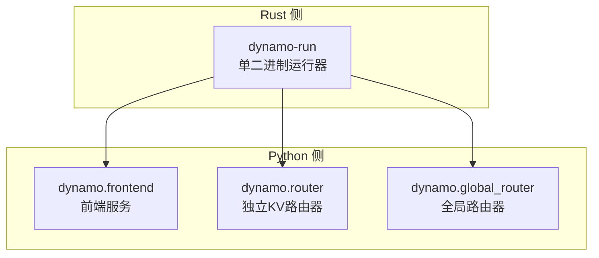
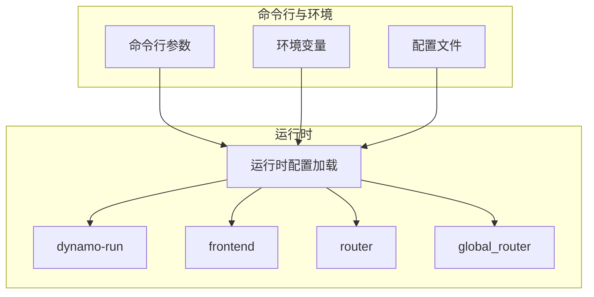
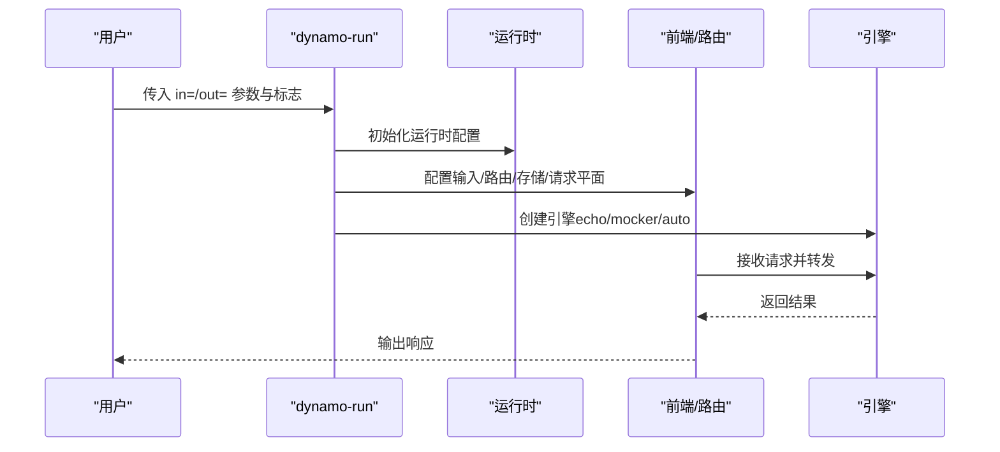
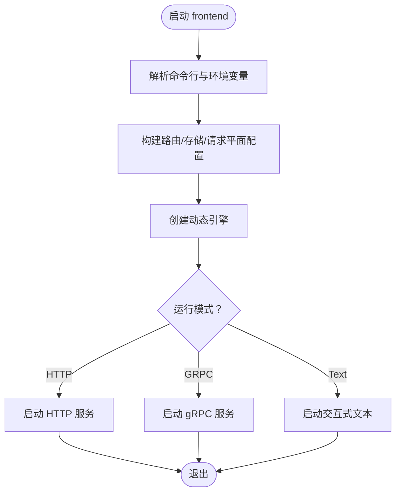
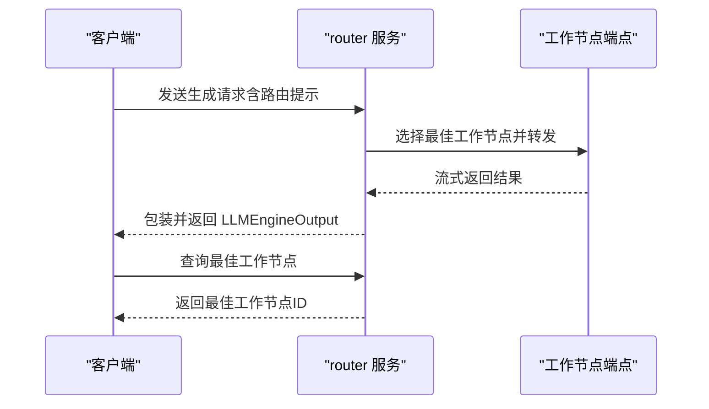
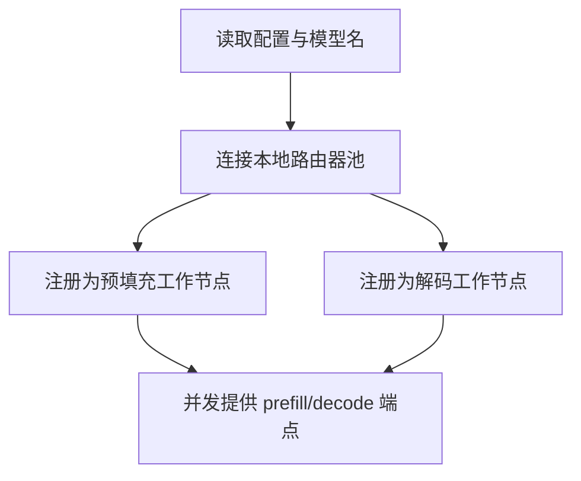
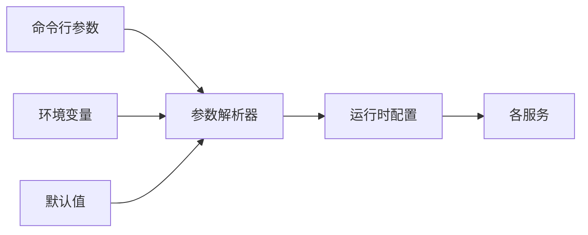

# 命令行接口

<cite>
**本文引用的文件**
- [main.rs](file://launch/dynamo-run/src/main.rs)
- [lib.rs](file://launch/dynamo-run/src/lib.rs)
- [opt.rs](file://launch/dynamo-run/src/opt.rs)
- [flags.rs](file://launch/dynamo-run/src/flags.rs)
- [frontend/main.py](file://components/src/dynamo/frontend/main.py)
- [router/__main__.py](file://components/src/dynamo/router/__main__.py)
- [global_router/__main__.py](file://components/src/dynamo/global_router/__main__.py)
- [common/configuration/utils.py](file://components/src/dynamo/common/configuration/utils.py)
- [runtime/config.rs](file://lib/runtime/src/config.rs)
- [runtime/environment_names.rs](file://lib/runtime/src/config/environment_names.rs)
</cite>

## 目录
1. [简介](#简介)
2. [项目结构](#项目结构)
3. [核心组件](#核心组件)
4. [架构总览](#架构总览)
5. [详细组件分析](#详细组件分析)
6. [依赖分析](#依赖分析)
7. [性能考虑](#性能考虑)
8. [故障排除指南](#故障排除指南)
9. [结论](#结论)
10. [附录](#附录)

## 简介
本文件为 Dynamo 的命令行接口（CLI）完整参考，覆盖以下子命令与入口：
- dynamo-run：单二进制本地运行器，支持多种输入/输出组合与引擎选择
- dynamo.frontend：前端服务，提供 HTTP/OpenAI 兼容接口、自动发现、预处理与路由
- dynamo.router：独立 KV 路由器服务，面向任意后端工作节点进行智能 KV 缓存感知路由
- dynamo.global_router：全局路由器服务，用于分层路由到不同池的本地路由器

内容包括：命令语法、参数清单（必填/可选/默认值/取值范围）、环境变量映射与优先级、配置文件加载顺序、典型工作流、故障排除与常见问题。

## 项目结构
Dynamo 的 CLI 分布在 Rust 与 Python 两套实现中：
- Rust 侧：launch/dynamo-run 提供单二进制运行器，负责解析输入/输出与引擎装配
- Python 侧：components/src/dynamo 下的各模块作为独立服务入口，分别实现 frontend、router、global_router 等功能

**图表来源**
- [main.rs](file://launch/dynamo-run/src/main.rs#L1-L136)
- [frontend/main.py](file://components/src/dynamo/frontend/main.py#L1-L518)
- [router/__main__.py](file://components/src/dynamo/router/__main__.py#L1-L359)
- [global_router/__main__.py](file://components/src/dynamo/global_router/__main__.py#L1-L180)

**章节来源**
- [main.rs](file://launch/dynamo-run/src/main.rs#L1-L136)
- [frontend/main.py](file://components/src/dynamo/frontend/main.py#L1-L518)
- [router/__main__.py](file://components/src/dynamo/router/__main__.py#L1-L359)
- [global_router/__main__.py](file://components/src/dynamo/global_router/__main__.py#L1-L180)

## 核心组件
- dynamo-run：通过命令行参数与环境变量驱动运行时配置，选择输入源（文本/HTTP/动态端点）与输出引擎（echo/mocker/auto），并执行请求处理流程
- dynamo.frontend：启动 HTTP/OpenAI 兼容服务，自动发现后端，执行预处理与路由，支持 KV 路由模式与迁移策略
- dynamo.router：独立服务，面向指定工作节点端点，提供 KV 缓存感知路由与最佳工作节点查询
- dynamo.global_router：注册为预填充/解码双角色，基于网格池选择策略将请求路由至不同命名空间的本地路由器

**章节来源**
- [lib.rs](file://launch/dynamo-run/src/lib.rs#L1-L223)
- [opt.rs](file://launch/dynamo-run/src/opt.rs#L1-L63)
- [flags.rs](file://launch/dynamo-run/src/flags.rs#L1-L238)
- [frontend/main.py](file://components/src/dynamo/frontend/main.py#L1-L518)
- [router/__main__.py](file://components/src/dynamo/router/__main__.py#L1-L359)
- [global_router/__main__.py](file://components/src/dynamo/global_router/__main__.py#L1-L180)

## 架构总览
下图展示 CLI 各组件与运行时的关系，以及参数来源（命令行、环境变量、配置文件）对运行行为的影响。

**图表来源**
- [main.rs](file://launch/dynamo-run/src/main.rs#L31-L61)
- [lib.rs](file://launch/dynamo-run/src/lib.rs#L54-L98)
- [runtime/config.rs](file://lib/runtime/src/config.rs#L306-L313)

**章节来源**
- [main.rs](file://launch/dynamo-run/src/main.rs#L31-L61)
- [lib.rs](file://launch/dynamo-run/src/lib.rs#L54-L98)
- [runtime/config.rs](file://lib/runtime/src/config.rs#L306-L313)

## 详细组件分析

### dynamo-run：单二进制运行器
- 用途：将输入（HTTP/文本/网络）与工作节点（网络/引擎）连接起来，提供本地最小化使用方式
- 输入/输出约定：通过 in= 与 out= 参数指定；支持动态端点路径与自动引擎选择
- 关键参数：
  - 模型位置：位置参数或 --model-path
  - HTTP/TLS：--http-port、--tls-cert-path、--tls-key-path
  - 路由器：--router-mode（round-robin/random/kv）、--kv-overlap-score-weight、--router-temperature、--use-kv-events、--router-replica-sync、--router-track-active-blocks
  - 上下文与块大小：--context-length、--kv-cache-block-size
  - 迁移限制：--migration-limit
  - 存储与请求平面：--store-kv（etcd/file/mem）、--request-plane（nats/http/tcp）
  - 请求模板：--request-template（JSON）
  - 备注：--extra-engine-args 仅 mocker 引擎可用
- 环境变量映射（部分）：DYN_LOG（日志级别）、DYN_RUNTIME_*（线程数等运行时配置）
- 典型用法：
  - 本地最小化：dynamo-run in=http out=echo --http-port 8080
  - 使用模型名/路径：dynamo-run in=text out=mocker <模型名或路径>
  - KV 路由：dynamo-run in=grpc out=auto --router-mode kv --kv-overlap-score-weight 2.0

**图表来源**
- [main.rs](file://launch/dynamo-run/src/main.rs#L63-L135)
- [lib.rs](file://launch/dynamo-run/src/lib.rs#L19-L124)
- [flags.rs](file://launch/dynamo-run/src/flags.rs#L138-L173)

**章节来源**
- [main.rs](file://launch/dynamo-run/src/main.rs#L13-L29)
- [main.rs](file://launch/dynamo-run/src/main.rs#L31-L135)
- [lib.rs](file://launch/dynamo-run/src/lib.rs#L19-L124)
- [opt.rs](file://launch/dynamo-run/src/opt.rs#L6-L62)
- [flags.rs](file://launch/dynamo-run/src/flags.rs#L16-L136)

### dynamo.frontend：前端服务
- 用途：提供 HTTP/OpenAI 兼容接口、自动发现、预处理与路由；支持交互式文本聊天
- 关键参数（节选）：
  - --interactive/-i：交互式文本聊天
  - --http-host/--http-port：HTTP 主机与端口
  - --tls-cert-path/--tls-key-path：TLS 证书与密钥
  - --router-mode：round-robin/random/kv
  - --kv-overlap-score-weight/--router-temperature/--kv-events：KV 路由相关
  - --router-ttl/--router-max-tree-size/--router-prune-target-ratio：无事件模式下的缓存过期与修剪参数
  - --namespace：命名空间限定
  - --router-replica-sync/--router-snapshot-threshold/--router-reset-states：副本同步与快照/重置控制
  - --durable-kv-events：启用 NATS JetStream 的持久化 KV 事件
  - --no-track-active-blocks/--no-assume-kv-reuse/--track-output-blocks：活跃块跟踪与输出块跟踪
  - --router-event-threads：事件处理线程数
  - --enforce-disagg/--migration-limit：强制拆分/迁移限制
  - --active-decode-blocks-threshold/--active-prefill-tokens-threshold/--active-prefill-tokens-threshold-frac：忙碌检测阈值
  - --model-name/--model-path：模型名称与路径
  - --metrics-prefix：指标前缀
  - --kserve-grpc-server/--grpc-metrics-port：KServe gRPC 服务器
  - --store-kv/--request-plane/--event-plane：存储/请求/事件平面
  - --chat-processor：dynamo 或 vllm（实验性）
- 环境变量映射（部分）：DYN_HTTP_HOST、DYN_HTTP_PORT、DYN_ROUTER_MODE、DYN_KV_*、DYN_STORE_KV、DYN_REQUEST_PLANE、DYN_EVENT_PLANE、DYN_METRICS_PREFIX、DYN_ROUTER_EVENT_THREADS 等

**图表来源**
- [frontend/main.py](file://components/src/dynamo/frontend/main.py#L368-L517)

**章节来源**
- [frontend/main.py](file://components/src/dynamo/frontend/main.py#L82-L365)
- [frontend/main.py](file://components/src/dynamo/frontend/main.py#L368-L517)

### dynamo.router：独立 KV 路由器
- 用途：为任意工作节点端点提供 KV 缓存感知路由，支持查询最佳工作节点
- 必需参数：--endpoint（命名空间.组件.端点）
- 关键参数（节选）：
  - --block-size：KV 块大小
  - --kv-overlap-score-weight/--router-temperature：权重与温度
  - --no-kv-events：禁用 KV 事件（采用 TTL/修剪策略）
  - --router-replica-sync：多副本状态同步
  - --router-snapshot-threshold/--router-reset-states：快照阈值与启动重置
  - --no-track-active-blocks/--track-output-blocks：活跃块与输出块跟踪
  - --router-ttl-secs/--router-max-tree-size/--router-prune-target-ratio：无事件模式参数
  - --router-event-threads：事件线程数
- 环境变量映射：DYN_ROUTER_EVENT_THREADS

**图表来源**
- [router/__main__.py](file://components/src/dynamo/router/__main__.py#L80-L153)
- [router/__main__.py](file://components/src/dynamo/router/__main__.py#L270-L350)

**章节来源**
- [router/__main__.py](file://components/src/dynamo/router/__main__.py#L156-L267)
- [router/__main__.py](file://components/src/dynamo/router/__main__.py#L270-L350)

### dynamo.global_router：全局路由器
- 用途：注册为预填充/解码双角色，基于网格池选择策略将请求路由至不同命名空间的本地路由器
- 必需参数：--config（池配置 JSON）、--model-name（模型名）
- 关键参数（节选）：--namespace/--component-name、--default-ttft-target/--default-itl-target
- 工作流程：初始化本地路由器连接 → 注册为预填充/解码工作节点 → 并发提供两个端点

**图表来源**
- [global_router/__main__.py](file://components/src/dynamo/global_router/__main__.py#L91-L171)

**章节来源**
- [global_router/__main__.py](file://components/src/dynamo/global_router/__main__.py#L39-L88)
- [global_router/__main__.py](file://components/src/dynamo/global_router/__main__.py#L91-L171)

## 依赖分析
- 参数来源优先级（从高到低）：命令行参数 > 环境变量 > 默认值
- Python 侧参数与环境变量映射工具：add_argument/env_or_default 支持类型转换与帮助信息构造
- 运行时配置加载顺序（Rust 侧）：环境变量 > /opt/dynamo/etc/runtime.toml > /opt/dynamo/defaults/runtime.toml

**图表来源**
- [common/configuration/utils.py](file://components/src/dynamo/common/configuration/utils.py#L50-L96)
- [runtime/config.rs](file://lib/runtime/src/config.rs#L306-L313)

**章节来源**
- [common/configuration/utils.py](file://components/src/dynamo/common/configuration/utils.py#L13-L47)
- [common/configuration/utils.py](file://components/src/dynamo/common/configuration/utils.py#L50-L96)
- [runtime/config.rs](file://lib/runtime/src/config.rs#L306-L313)

## 性能考虑
- 请求平面选择：--request-plane 可选 nats/http/tcp，默认 tcp；当请求平面为 nats 或启用 KV 事件/副本同步时，需要 NATS
- KV 路由参数调优：--kv-overlap-score-weight、--router-temperature、--router-event-threads 影响路由决策与吞吐
- 事件处理线程：--router-event-threads（或 DYN_ROUTER_EVENT_THREADS）在高并发场景提升事件处理能力
- 线程与阻塞线程：运行时线程数可通过 DYN_RUNTIME_NUM_WORKER_THREADS、DYN_RUNTIME_MAX_BLOCKING_THREADS 控制

**章节来源**
- [frontend/main.py](file://components/src/dynamo/frontend/main.py#L409-L418)
- [router/__main__.py](file://components/src/dynamo/router/__main__.py#L263-L265)
- [runtime/config.rs](file://lib/runtime/src/config.rs#L306-L313)

## 故障排除指南
- TLS 配置错误：--tls-cert-path 与 --tls-key-path 必须成对提供
- 迁移限制越界：--migration-limit 必须在允许范围内
- KV 事件与 TTL 参数：当禁用 --kv-events 时，--router-ttl/--router-max-tree-size/--router-prune-target-ratio 才生效
- 日志级别：dynamo-run 支持 -v（debug）与 -vv（trace），通过 DYN_LOG 设置
- 运行时配置：若设置 DYN_SYSTEM_PORT，仅后端工作节点使用系统指标服务，前端不使用
- 前端指标前缀：--metrics-prefix 可覆盖默认前缀，也可通过 DYN_METRICS_PREFIX 设置

**章节来源**
- [frontend/main.py](file://components/src/dynamo/frontend/main.py#L360-L365)
- [frontend/main.py](file://components/src/dynamo/frontend/main.py#L380-L396)
- [frontend/main.py](file://components/src/dynamo/frontend/main.py#L399-L403)
- [main.rs](file://launch/dynamo-run/src/main.rs#L32-L49)

## 结论
Dynamo 提供统一的 CLI 抽象，覆盖本地快速验证（dynamo-run）与生产级部署（frontend/router/global_router）。通过命令行参数、环境变量与配置文件的组合，用户可以灵活控制运行时行为、路由策略与性能参数。建议在生产环境中结合 KV 事件、副本同步与事件线程参数进行调优，并通过环境变量集中管理敏感配置。

## 附录

### 参数与环境变量对照表（节选）

- dynamo-run
  - --http-port：默认 8000；环境变量：DYN_LOG（日志级别）
  - --router-mode：默认 round-robin；环境变量：无直接映射
  - --kv-overlap-score-weight：默认 1.0；环境变量：无直接映射
  - --router-temperature：默认 0.0；环境变量：无直接映射
  - --use-kv-events：默认 true；环境变量：无直接映射
  - --router-replica-sync：默认 false；环境变量：无直接映射
  - --router-track-active-blocks：默认 true；环境变量：无直接映射
  - --context-length：默认模型最大上下文；环境变量：无直接映射
  - --kv-cache-block-size：默认 16；环境变量：无直接映射
  - --migration-limit：默认 0；环境变量：无直接映射
  - --store-kv：默认 etcd；环境变量：无直接映射
  - --request-plane：默认 tcp；环境变量：无直接映射
  - --last：未使用；环境变量：无直接映射

- dynamo.frontend
  - --http-host：默认 0.0.0.0；环境变量：DYN_HTTP_HOST
  - --http-port：默认 8000；环境变量：DYN_HTTP_PORT
  - --router-mode：默认 round-robin；环境变量：DYN_ROUTER_MODE
  - --kv-overlap-score-weight：默认 1.0；环境变量：DYN_KV_OVERLAP_SCORE_WEIGHT
  - --router-temperature：默认 0.0；环境变量：DYN_ROUTER_TEMPERATURE
  - --kv-events：默认 true；环境变量：DYN_KV_EVENTS
  - --router-ttl：默认 120.0；环境变量：DYN_ROUTER_TTL
  - --router-max-tree-size：默认 2^20；环境变量：DYN_ROUTER_MAX_TREE_SIZE
  - --router-prune-target-ratio：默认 0.8；环境变量：DYN_ROUTER_PRUNE_TARGET_RATIO
  - --namespace：默认 DYN_NAMESPACE；环境变量：DYN_NAMESPACE
  - --router-replica-sync：默认 false；环境变量：无直接映射
  - --router-snapshot-threshold：默认 1000000；环境变量：无直接映射
  - --router-reset-states：默认 false；环境变量：无直接映射
  - --durable-kv-events：默认 false；环境变量：无直接映射
  - --no-track-active-blocks：默认 true；环境变量：无直接映射
  - --no-assume-kv-reuse：默认 true；环境变量：无直接映射
  - --track-output-blocks：默认 false；环境变量：无直接映射
  - --router-event-threads：默认 1；环境变量：DYN_ROUTER_EVENT_THREADS
  - --enforce-disagg：默认 false；环境变量：无直接映射
  - --migration-limit：默认 0；环境变量：无直接映射
  - --active-decode-blocks-threshold：默认 None；环境变量：无直接映射
  - --active-prefill-tokens-threshold：默认 None；环境变量：无直接映射
  - --active-prefill-tokens-threshold-frac：默认 None；环境变量：无直接映射
  - --model-name：默认 None；环境变量：无直接映射
  - --model-path：默认 None；环境变量：无直接映射
  - --metrics-prefix：默认 dynamo_frontend；环境变量：DYN_METRICS_PREFIX
  - --kserve-grpc-server：默认 false；环境变量：无直接映射
  - --grpc-metrics-port：默认 8788；环境变量：无直接映射
  - --store-kv：默认 etcd；环境变量：DYN_STORE_KV
  - --request-plane：默认 tcp；环境变量：DYN_REQUEST_PLANE
  - --event-plane：默认 nats；环境变量：DYN_EVENT_PLANE
  - --chat-processor：默认 dynamo；环境变量：无直接映射

- dynamo.router
  - --endpoint：必需；环境变量：无直接映射
  - --block-size：默认 128；环境变量：无直接映射
  - --kv-overlap-score-weight：默认 1.0；环境变量：无直接映射
  - --router-temperature：默认 0.0；环境变量：无直接映射
  - --no-kv-events：默认 true；环境变量：无直接映射
  - --router-replica-sync：默认 false；环境变量：无直接映射
  - --router-snapshot-threshold：默认 1000000；环境变量：无直接映射
  - --router-reset-states：默认 false；环境变量：无直接映射
  - --no-track-active-blocks：默认 true；环境变量：无直接映射
  - --track-output-blocks：默认 false；环境变量：无直接映射
  - --router-ttl-secs：默认 120.0；环境变量：无直接映射
  - --router-max-tree-size：默认 2^20；环境变量：无直接映射
  - --router-prune-target-ratio：默认 0.8；环境变量：无直接映射
  - --router-event-threads：默认 1；环境变量：DYN_ROUTER_EVENT_THREADS

- dynamo.global_router
  - --config：必需；环境变量：无直接映射
  - --model-name：必需；环境变量：无直接映射
  - --namespace：默认 dynamo；环境变量：DYN_NAMESPACE
  - --component-name：默认 global_router；环境变量：无直接映射
  - --default-ttft-target：默认 None；环境变量：无直接映射
  - --default-itl-target：默认 None；环境变量：无直接映射

**章节来源**
- [flags.rs](file://launch/dynamo-run/src/flags.rs#L16-L136)
- [frontend/main.py](file://components/src/dynamo/frontend/main.py#L118-L365)
- [router/__main__.py](file://components/src/dynamo/router/__main__.py#L156-L267)
- [global_router/__main__.py](file://components/src/dynamo/global_router/__main__.py#L39-L88)

### 配置文件与加载顺序
- 运行时配置（Rust 侧）：按优先级加载，环境变量最高，随后为固定路径文件，最后为默认路径文件
- Python 侧参数：通过 add_argument/env_or_default 将环境变量注入默认值，实现“环境变量优先”的行为

**章节来源**
- [runtime/config.rs](file://lib/runtime/src/config.rs#L306-L313)
- [common/configuration/utils.py](file://components/src/dynamo/common/configuration/utils.py#L13-L47)