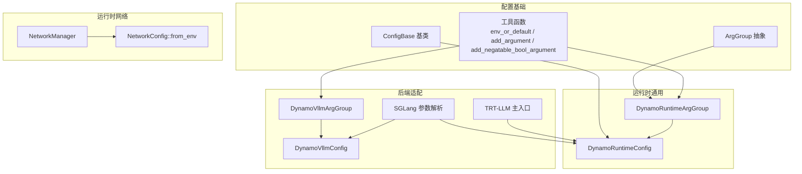
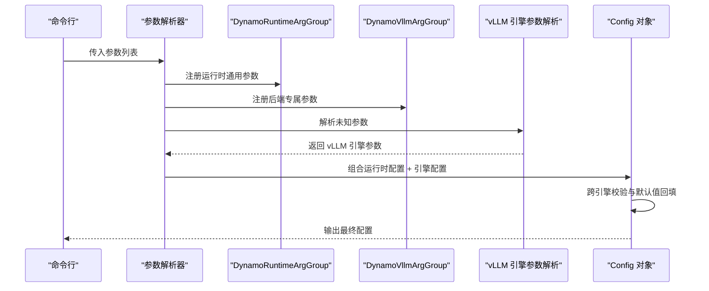
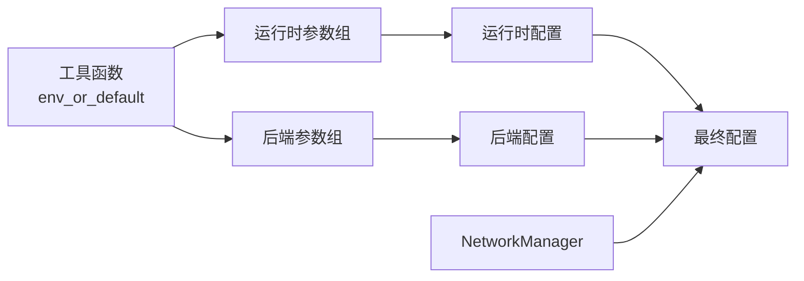
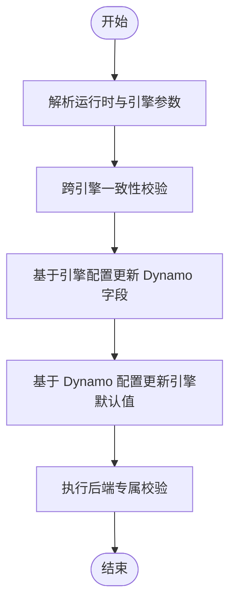

# 配置参数参考

<cite>
**本文引用的文件**
- [components/src/dynamo/common/configuration/__init__.py](file://components/src/dynamo/common/configuration/__init__.py)
- [components/src/dynamo/common/configuration/arg_group.py](file://components/src/dynamo/common/configuration/arg_group.py)
- [components/src/dynamo/common/configuration/config_base.py](file://components/src/dynamo/common/configuration/config_base.py)
- [components/src/dynamo/common/configuration/utils.py](file://components/src/dynamo/common/configuration/utils.py)
- [components/src/dynamo/common/configuration/groups/runtime_args.py](file://components/src/dynamo/common/configuration/groups/runtime_args.py)
- [components/src/dynamo/vllm/args.py](file://components/src/dynamo/vllm/args.py)
- [components/src/dynamo/vllm/backend_args.py](file://components/src/dynamo/vllm/backend_args.py)
- [components/src/dynamo/sglang/args.py](file://components/src/dynamo/sglang/args.py)
- [components/src/dynamo/trtllm/main.py](file://components/src/dynamo/trtllm/main.py)
- [lib/runtime/src/config.rs](file://lib/runtime/src/config.rs)
- [lib/runtime/src/pipeline/network/manager.rs](file://lib/runtime/src/pipeline/network/manager.rs)
- [components/src/dynamo/global_router/pool_selection.py](file://components/src/dynamo/global_router/pool_selection.py)
- [container/README.md](file://container/README.md)
</cite>

## 目录
1. [简介](#简介)
2. [项目结构](#项目结构)
3. [核心组件](#核心组件)
4. [架构总览](#架构总览)
5. [详细组件分析](#详细组件分析)
6. [依赖关系分析](#依赖关系分析)
7. [性能考量](#性能考量)
8. [故障排查指南](#故障排查指南)
9. [结论](#结论)
10. [附录](#附录)

## 简介
本文件为 Dynamo 系统的配置参数完整参考，覆盖环境变量、命令行参数与配置文件参数，按功能模块分类（网络、路由、性能、安全等），并提供类型、默认值、取值范围、影响范围、优先级与继承规则、模板与最佳实践、动态配置与热重载机制说明，以及配置验证与错误诊断方法。

## 项目结构
配置系统采用“领域分组 + 参数工厂”的模块化设计：
- 基础抽象：ArgGroup 抽象接口、ConfigBase 基类、工具函数（环境变量解析、参数注册）
- 运行时通用配置：DynamoRuntimeArgGroup/DynamoRuntimeConfig（命名空间、KV 存储、请求/事件平面、连接器、端点类型等）
- 后端适配层：各后端（vLLM、SGLang、TRT-LLM）在运行时通用配置之上扩展专属参数，并进行跨引擎一致性校验
- 网络与运行时：通过环境变量驱动网络管理器初始化，支持 NATS/JetStream、ZMQ、TCP 等模式

图表来源
- [components/src/dynamo/common/configuration/arg_group.py](file://components/src/dynamo/common/configuration/arg_group.py#L8-L26)
- [components/src/dynamo/common/configuration/config_base.py](file://components/src/dynamo/common/configuration/config_base.py#L6-L38)
- [components/src/dynamo/common/configuration/utils.py](file://components/src/dynamo/common/configuration/utils.py#L13-L145)
- [components/src/dynamo/common/configuration/groups/runtime_args.py](file://components/src/dynamo/common/configuration/groups/runtime_args.py#L14-L133)
- [components/src/dynamo/vllm/backend_args.py](file://components/src/dynamo/vllm/backend_args.py#L15-L289)
- [components/src/dynamo/sglang/args.py](file://components/src/dynamo/sglang/args.py#L308-L606)
- [components/src/dynamo/trtllm/main.py](file://components/src/dynamo/trtllm/main.py#L1-L51)
- [lib/runtime/src/pipeline/network/manager.rs](file://lib/runtime/src/pipeline/network/manager.rs#L161-L182)

章节来源
- [components/src/dynamo/common/configuration/__init__.py](file://components/src/dynamo/common/configuration/__init__.py#L1-L25)
- [components/src/dynamo/common/configuration/arg_group.py](file://components/src/dynamo/common/configuration/arg_group.py#L8-L26)
- [components/src/dynamo/common/configuration/config_base.py](file://components/src/dynamo/common/configuration/config_base.py#L6-L38)
- [components/src/dynamo/common/configuration/utils.py](file://components/src/dynamo/common/configuration/utils.py#L13-L145)

## 核心组件
- ArgGroup：声明式注册 CLI 参数，确保无副作用且与运行时状态解耦
- ConfigBase：从解析结果与类注解默认值构建实例，支持属性顺序无关与默认值注入
- 工具函数：env_or_default 提供类型感知的环境变量解析；add_argument/add_negatable_bool_argument 统一参数注册与帮助信息生成

章节来源
- [components/src/dynamo/common/configuration/arg_group.py](file://components/src/dynamo/common/configuration/arg_group.py#L8-L26)
- [components/src/dynamo/common/configuration/config_base.py](file://components/src/dynamo/common/configuration/config_base.py#L9-L33)
- [components/src/dynamo/common/configuration/utils.py](file://components/src/dynamo/common/configuration/utils.py#L13-L145)

## 架构总览
配置解析流程（以 vLLM 后端为例）：
- 注册运行时通用参数组与后端专属参数组
- 解析未知参数并交由 vLLM 引擎参数解析器
- 跨引擎一致性校验与默认值回填
- 生成最终配置对象

图表来源
- [components/src/dynamo/vllm/args.py](file://components/src/dynamo/vllm/args.py#L76-L127)
- [components/src/dynamo/common/configuration/groups/runtime_args.py](file://components/src/dynamo/common/configuration/groups/runtime_args.py#L36-L133)
- [components/src/dynamo/vllm/backend_args.py](file://components/src/dynamo/vllm/backend_args.py#L15-L289)

## 详细组件分析

### 运行时通用配置（网络/路由/存储/事件）
- 命名空间（namespace）
  - 类型：字符串
  - 默认值：dynamo
  - 环境变量：DYN_NAMESPACE
  - 影响范围：组件发现、端点命名、路由选择
- KV 存储（store_kv）
  - 类型：枚举
  - 取值：etcd、file、mem
  - 默认值：etcd
  - 环境变量：DYN_STORE_KV
  - 影响范围：全局键值存储后端（etcd 使用 ETCD_* 环境变量连接）
- 请求平面（request_plane）
  - 类型：枚举
  - 取值：tcp、nats、http
  - 默认值：tcp
  - 环境变量：DYN_REQUEST_PLANE
  - 影响范围：路由器到工作节点的请求分发通道
- 事件平面（event_plane）
  - 类型：枚举
  - 取值：nats、zmq
  - 默认值：nats
  - 环境变量：DYN_EVENT_PLANE
  - 影响范围：事件发布通道（KV 事件、指标等）
- 连接器（connector）
  - 类型：字符串列表
  - 取值：nixl、lmcache、kvbm、null、none
  - 默认值：["nixl"]
  - 环境变量：DYN_CONNECTOR
  - 影响范围：KV 缓存/传输链路（多连接器可组合）
- 持久化 KV 事件（durable_kv_events）
  - 类型：布尔
  - 默认值：false
  - 环境变量：DYN_DURABLE_KV_EVENTS
  - 影响范围：启用 NATS JetStream 的持久化事件，适用于多副本一致性需求
- 工具/推理解析器（dyn_tool_call_parser、dyn_reasoning_parser）
  - 类型：字符串（可选）
  - 环境变量：DYN_TOOL_CALL_PARSER、DYN_REASONING_PARSER
  - 影响范围：模型输出解析策略
- 自定义 Jinja 模板（custom_jinja_template）
  - 类型：字符串（可选）
  - 环境变量：DYN_CUSTOM_JINJA_TEMPLATE
  - 影响范围：覆盖模型默认聊天模板（与后端预处理器配合）
- 端点类型（endpoint_types）
  - 类型：字符串
  - 默认值：chat,completions
  - 环境变量：DYN_ENDPOINT_TYPES
  - 影响范围：启用的端点集合（如仅补全）
- 配置导出（dump_config_to）
  - 类型：字符串（可选）
  - 环境变量：DYN_DUMP_CONFIG_TO
  - 影响范围：将解析后的配置写入指定文件或标准输出

章节来源
- [components/src/dynamo/common/configuration/groups/runtime_args.py](file://components/src/dynamo/common/configuration/groups/runtime_args.py#L14-L133)

### vLLM 后端专属配置
- 预填充/解码工作节点标记
  - --is-prefill-worker / --is-decode-worker
  - 类型：布尔
  - 环境变量：DYN_VLLM_IS_PREFILL_WORKER、DYN_VLLM_IS_DECODE_WORKER
  - 影响范围：决定组件与端点类型（prefill/backend）
- 使用 vLLM 分词器（use-vllm-tokenizer）
  - 类型：布尔
  - 环境变量：DYN_VLLM_USE_TOKENIZER
  - 影响范围：绕过 Dynamo 预处理，仅保留 chat/completions
- 多模态组件
  - --multimodal-processor、--ec-processor、--multimodal-encode-worker、--multimodal-worker、--multimodal-decode-worker、--multimodal-encode-prefill-worker
  - 类型：布尔
  - 环境变量：DYN_VLLM_MULTIMODAL_PROCESSOR、...、DYN_VLLM_MULTIMODAL_ENCODE_PREFILL_WORKER
  - 影响范围：多模态请求处理路径（图像/视频编码、解码、统一处理）
- vLLM 原生编码器（ECConnector）
  - --vllm-native-encoder-worker、--ec-connector-backend、--ec-storage-path、--ec-extra-config、--ec-consumer-mode
  - 类型：布尔/字符串/JSON
  - 环境变量：DYN_VLLM_NATIVE_ENCODER_WORKER、...、DYN_VLLM_EC_CONSUMER_MODE
  - 影响范围：编码器解耦与共享存储
- vLLM-Omni
  - --omni、--stage-configs-path
  - 类型：布尔/字符串
  - 环境变量：DYN_VLLM_OMNI、DYN_VLLM_STAGE_CONFIGS_PATH
  - 影响范围：多阶段流水线（文本到图像等）
- 睡眠模式级别（sleep-mode-level）
  - 类型：整数
  - 取值：1、2、3
  - 环境变量：DYN_VLLM_SLEEP_MODE_LEVEL
  - 影响范围：权重/显存占用控制

校验规则（节选）：
- 预填充与解码工作节点互斥
- 多模态角色互斥，启用多模态需设置 --enable-multimodal
- ECExampleConnector 需要 --ec-storage-path
- --stage-configs-path 仅在 --omni 下有效

章节来源
- [components/src/dynamo/vllm/backend_args.py](file://components/src/dynamo/vllm/backend_args.py#L15-L289)
- [components/src/dynamo/vllm/args.py](file://components/src/dynamo/vllm/args.py#L130-L302)

### SGLang 后端配置
- 端点（endpoint）
  - 类型：字符串
  - 默认值：基于命名空间与工作节点自动推断
  - 环境变量：无
  - 影响范围：服务端点命名（dyn://namespace.component.endpoint）
- 工具/推理解析器（--dyn-tool-call-parser、--dyn-reasoning-parser）
  - 类型：字符串（可选）
  - 环境变量：DYN_TOOL_CALL_PARSER、DYN_REASONING_PARSER
  - 影响范围：模型输出解析策略
- 自定义 Jinja 模板（--custom-jinja-template）
  - 类型：字符串（可选）
  - 环境变量：DYN_CUSTOM_JINJA_TEMPLATE
  - 影响范围：覆盖模型默认聊天模板
- 端点类型（--dyn-endpoint-types）
  - 类型：字符串
  - 默认值：chat,completions
  - 环境变量：无
  - 影响范围：启用的端点集合
- 使用 SGLang 分词器（--use-sglang-tokenizer）
  - 类型：布尔
  - 环境变量：无
  - 影响范围：绕过 Dynamo 预处理
- 多模态组件（--multimodal-processor、--multimodal-encode-worker、--multimodal-worker）
  - 类型：布尔
  - 环境变量：无
  - 影响范围：多模态请求处理路径
- 嵌入向量工作节点（--embedding-worker）
  - 类型：布尔
  - 环境变量：无
  - 影响范围：嵌入生成端点
- 图像扩散工作节点（--image-diffusion-worker、--image-diffusion-fs-url、--image-diffusion-base-url）
  - 类型：布尔/字符串
  - 环境变量：无、DYN_IMAGE_DIFFUSION_BASE_URL
  - 影响范围：图像生成与存储
- KV 事件与本地索引器（--durable-kv-events）
  - 类型：布尔
  - 环境变量：DYN_DURABLE_KV_EVENTS
  - 影响范围：事件持久化与本地索引器切换

配置文件支持：
- 支持通过 --config 加载 YAML 配置文件
- 支持 --config-key 提取嵌套字典作为当前配置片段
- 与 SGLang 参数合并器集成，兼容新旧 API

章节来源
- [components/src/dynamo/sglang/args.py](file://components/src/dynamo/sglang/args.py#L33-L148)
- [components/src/dynamo/sglang/args.py](file://components/src/dynamo/sglang/args.py#L308-L606)

### TRT-LLM 后端配置
- 日志映射
  - 环境变量：DYN_LOG、DYN_SKIP_TRTLLM_LOG_FORMATTING
  - 影响范围：将 Dynamo 日志级别映射到 TLLM 日志级别
- 运行时初始化
  - 通过 create_runtime 使用 store_kv、request_plane、event_plane、use_kv_events 初始化运行时

章节来源
- [components/src/dynamo/trtllm/main.py](file://components/src/dynamo/trtllm/main.py#L1-L51)

### 全局路由器配置
- 配置加载
  - 从 JSON 文件加载，包含池映射、分辨率等
  - 校验 decode_pool_mapping 行长度与索引范围

章节来源
- [components/src/dynamo/global_router/pool_selection.py](file://components/src/dynamo/global_router/pool_selection.py#L255-L276)

## 依赖关系分析
- 参数注册依赖
  - add_argument/add_negatable_bool_argument 依赖 env_or_default 实现环境变量默认值注入
  - ArgGroup 与 ConfigBase 协作完成参数收集与默认值注入
- 后端适配依赖
  - vLLM/SGLang 在运行时通用配置基础上扩展专属参数，并进行跨引擎一致性校验
- 运行时依赖
  - NetworkManager 通过 NetworkConfig::from_env 从环境变量读取网络配置
  - TRT-LLM 主入口使用运行时通用配置初始化运行时

图表来源
- [components/src/dynamo/common/configuration/utils.py](file://components/src/dynamo/common/configuration/utils.py#L13-L145)
- [components/src/dynamo/common/configuration/groups/runtime_args.py](file://components/src/dynamo/common/configuration/groups/runtime_args.py#L36-L133)
- [components/src/dynamo/vllm/backend_args.py](file://components/src/dynamo/vllm/backend_args.py#L15-L289)
- [lib/runtime/src/pipeline/network/manager.rs](file://lib/runtime/src/pipeline/network/manager.rs#L161-L182)

## 性能考量
- 请求平面
  - tcp 通常具有更低延迟与更高吞吐，适合高性能场景
  - nats/http 提供更灵活的路由与可观测性，但可能引入额外开销
- 事件平面
  - nats 适合高吞吐事件发布；zmq 适合本地低延迟事件
- 连接器
  - 多连接器组合可提升缓存命中率，但会增加链路复杂度
- 多模态与睡眠模式
  - 合理设置睡眠模式级别可在资源受限时降低显存占用
- 网络模式
  - 容器网络模式影响端口共享与性能/安全性权衡

章节来源
- [components/src/dynamo/common/configuration/groups/runtime_args.py](file://components/src/dynamo/common/configuration/groups/runtime_args.py#L60-L73)
- [container/README.md](file://container/README.md#L409-L417)

## 故障排查指南
- 环境变量布尔值解析
  - 支持 true/1/yes/on 与 false/0/no/off，大小写不敏感
  - 无效值将导致解析失败
- 参数冲突与互斥
  - vLLM：预填充/解码工作节点互斥；多模态角色互斥；启用多模态需设置 --enable-multimodal；ECExampleConnector 需要 --ec-storage-path；--stage-configs-path 仅在 --omni 下有效
  - SGLang：自定义 Jinja 模板与使用 SGLang 分词器不可同时启用
- 配置文件加载
  - --config-key 仅支持提取字典类型的嵌套段；非字典将报错
  - 临时文件清理失败会记录警告
- 网络与日志
  - TRT-LLM 日志级别映射失败不影响启动，但可能导致日志级别不符合预期

章节来源
- [lib/runtime/src/config.rs](file://lib/runtime/src/config.rs#L413-L456)
- [components/src/dynamo/vllm/backend_args.py](file://components/src/dynamo/vllm/backend_args.py#L224-L289)
- [components/src/dynamo/sglang/args.py](file://components/src/dynamo/sglang/args.py#L474-L482)
- [components/src/dynamo/sglang/args.py](file://components/src/dynamo/sglang/args.py#L244-L305)
- [components/src/dynamo/trtllm/main.py](file://components/src/dynamo/trtllm/main.py#L10-L18)

## 结论
本参考文档系统梳理了 Dynamo 的配置体系，明确了参数来源、类型、默认值、取值范围与影响范围，并给出了优先级与继承规则、验证与错误诊断方法。建议在生产环境中优先使用配置文件与环境变量统一管理，结合端点类型与连接器策略优化性能与可靠性。

## 附录

### 配置优先级与继承规则
- 命令行参数优先于环境变量，默认值次之
- 运行时通用配置与后端专属配置合并，后端专属配置在通用配置基础上扩展
- 未显式提供的可选字段使用类注解默认值或 None

章节来源
- [components/src/dynamo/common/configuration/config_base.py](file://components/src/dynamo/common/configuration/config_base.py#L9-L33)
- [components/src/dynamo/common/configuration/utils.py](file://components/src/dynamo/common/configuration/utils.py#L50-L96)

### 动态配置更新与热重载机制
- 运行时通用配置
  - 通过环境变量驱动网络管理器初始化（NetworkConfig::from_env），可在进程运行中调整网络相关参数
- 事件平面与本地索引器
  - durable_kv_events 控制事件持久化策略，可在不重启的情况下切换
- 后端特定参数
  - 多模态与端点类型等参数通常在启动时确定；对于需要热更新的参数，建议通过外部配置中心或容器编排平台进行滚动更新

章节来源
- [lib/runtime/src/pipeline/network/manager.rs](file://lib/runtime/src/pipeline/network/manager.rs#L161-L182)
- [components/src/dynamo/common/configuration/groups/runtime_args.py](file://components/src/dynamo/common/configuration/groups/runtime_args.py#L83-L89)

### 配置模板与最佳实践
- vLLM 单节点最小化配置
  - 命名空间：dynamo
  - 请求平面：tcp
  - 事件平面：nats
  - 连接器：nixl
  - 端点类型：chat,completions
- 多模态部署
  - 启用 --enable-multimodal，并根据需求选择具体多模态角色
  - 若使用 ECConnector，请提供共享存储路径
- 生产环境建议
  - 使用持久化 KV 事件（--durable-kv-events）保证多副本一致性
  - 选择 tcp 作为请求平面以获得更低延迟
  - 通过配置文件与环境变量统一管理，避免命令行拼接错误

### 配置验证流程（vLLM）

图表来源
- [components/src/dynamo/vllm/args.py](file://components/src/dynamo/vllm/args.py#L130-L302)