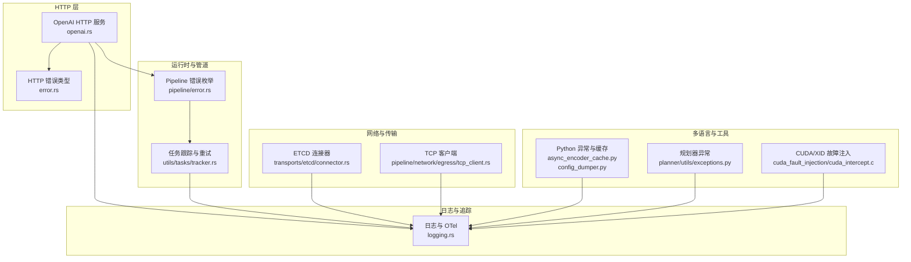
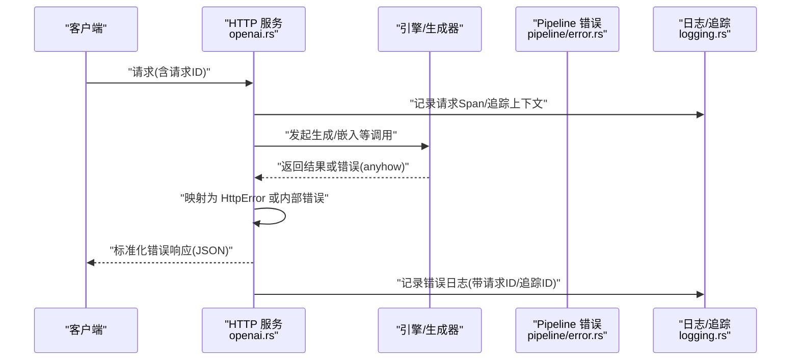
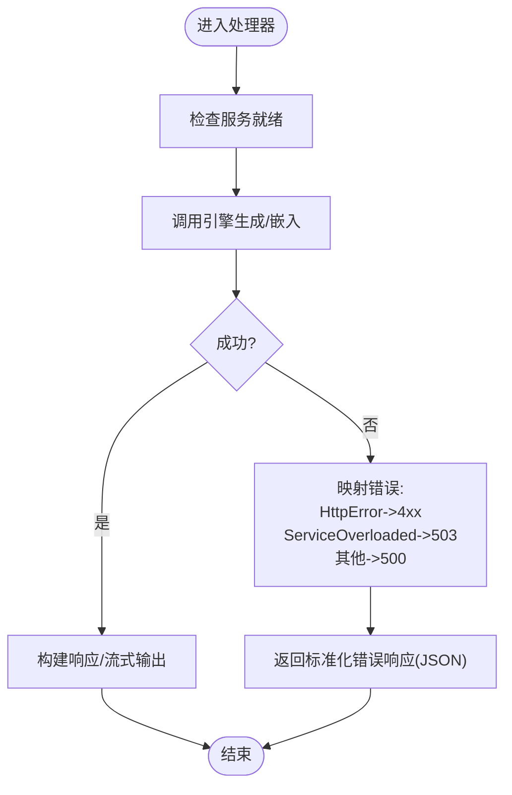
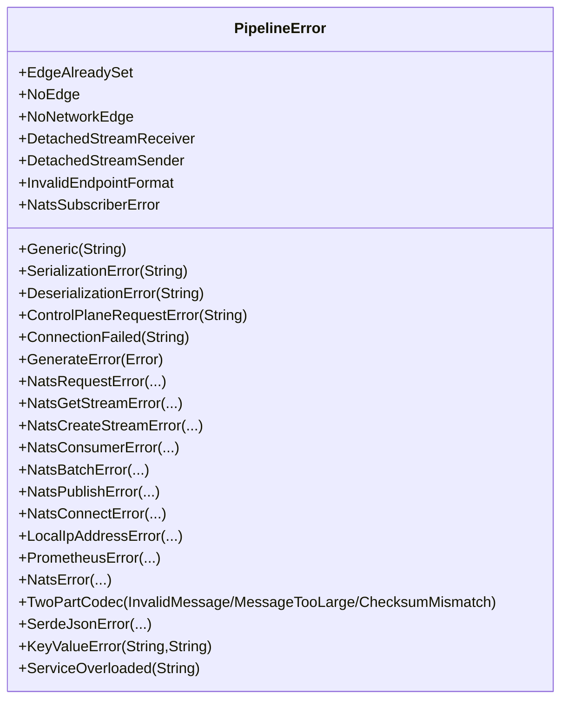
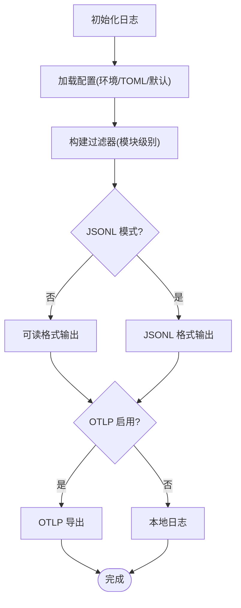
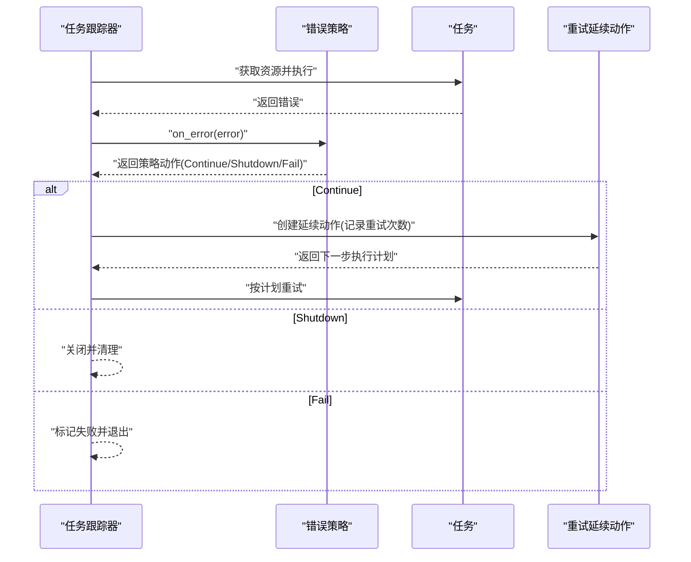
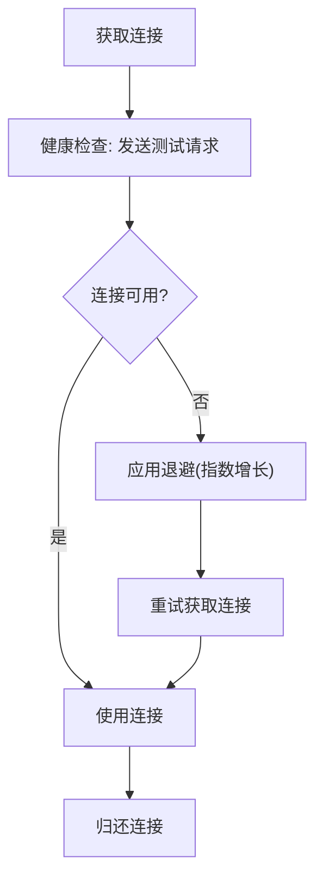
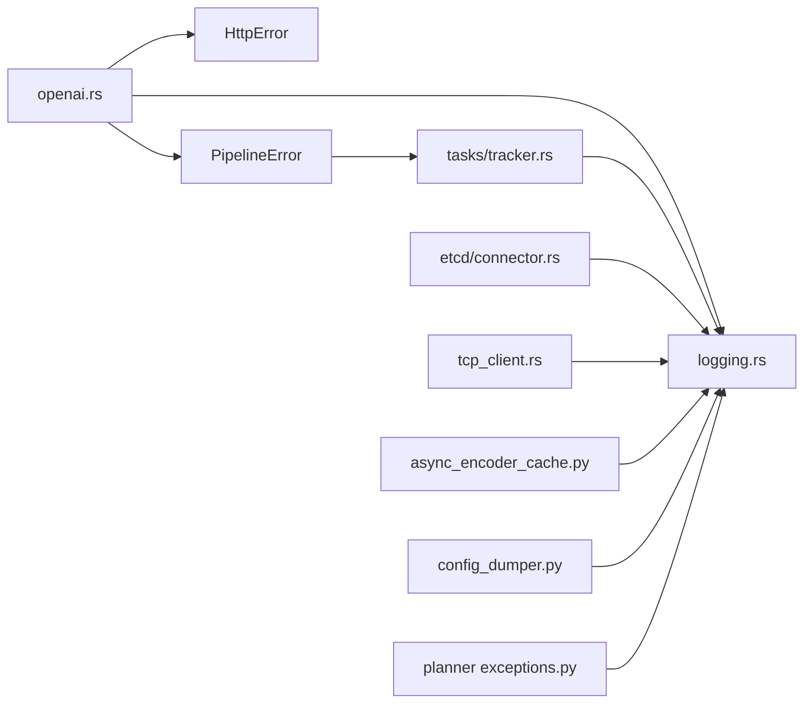

# 错误码与异常

<cite>
**本文引用的文件**
- [lib/llm/src/http/service/openai.rs](file://lib/llm/src/http/service/openai.rs)
- [lib/llm/src/http/service/error.rs](file://lib/llm/src/http/service/error.rs)
- [lib/runtime/src/pipeline/error.rs](file://lib/runtime/src/pipeline/error.rs)
- [lib/runtime/src/logging.rs](file://lib/runtime/src/logging.rs)
- [lib/runtime/src/utils/tasks/tracker.rs](file://lib/runtime/src/utils/tasks/tracker.rs)
- [lib/runtime/src/transports/etcd/connector.rs](file://lib/runtime/src/transports/etcd/connector.rs)
- [lib/runtime/src/pipeline/network/egress/tcp_client.rs](file://lib/runtime/src/pipeline/network/egress/tcp_client.rs)
- [components/src/dynamo/common/multimodal/async_encoder_cache.py](file://components/src/dynamo/common/multimodal/async_encoder_cache.py)
- [components/src/dynamo/common/config_dump/config_dumper.py](file://components/src/dynamo/common/config_dump/config_dumper.py)
- [components/src/dynamo/planner/utils/exceptions.py](file://components/src/dynamo/planner/utils/exceptions.py)
- [tests/fault_tolerance/hardware/fault_injection_service/cuda_fault_injection/cuda_intercept.c](file://tests/fault_tolerance/hardware/fault_injection_service/cuda_fault_injection/cuda_intercept.c)
</cite>

## 目录
1. [简介](#简介)
2. [项目结构](#项目结构)
3. [核心组件](#核心组件)
4. [架构总览](#架构总览)
5. [详细组件分析](#详细组件分析)
6. [依赖关系分析](#依赖关系分析)
7. [性能考量](#性能考量)
8. [故障排查指南](#故障排查指南)
9. [结论](#结论)
10. [附录](#附录)

## 简介
本文件系统化梳理 Dynamo 代码库中的错误码与异常处理机制，覆盖 HTTP 错误码、业务逻辑错误、系统异常与网络错误，提供每类错误的触发条件、响应格式、调试线索、恢复策略与重试机制，并总结客户端错误处理最佳实践与日志级别规范。

## 项目结构
围绕错误与异常的关键模块分布如下：
- HTTP 层：统一错误消息体与中间件转换（如 422 转 400），以及从引擎错误到 HTTP 错误的映射。
- 运行时与管道：定义通用的 PipelineError 枚举与错误扩展，用于跨组件传播。
- 日志与追踪：集中式日志初始化、过滤器配置、JSONL 输出、OpenTelemetry 集成与分布式追踪上下文注入。
- 任务与重试：可取消任务的错误策略、失败率控制与重试延续动作。
- 网络与传输：连接池健康检查、ETCD 连接退避、TCP 客户端请求超时与通道缓冲。
- 多模态与规划器：Python 异常封装与聚合，避免未捕获 Future 异常警告。
- 故障注入：CUDA/XID 错误映射，辅助硬件级故障测试。

**图表来源**
- [lib/llm/src/http/service/openai.rs](file://lib/llm/src/http/service/openai.rs#L80-L246)
- [lib/llm/src/http/service/error.rs](file://lib/llm/src/http/service/error.rs#L1-L15)
- [lib/runtime/src/pipeline/error.rs](file://lib/runtime/src/pipeline/error.rs#L32-L126)
- [lib/runtime/src/logging.rs](file://lib/runtime/src/logging.rs#L106-L133)
- [lib/runtime/src/utils/tasks/tracker.rs](file://lib/runtime/src/utils/tasks/tracker.rs#L1-L200)
- [lib/runtime/src/transports/etcd/connector.rs](file://lib/runtime/src/transports/etcd/connector.rs#L147-L167)
- [lib/runtime/src/pipeline/network/egress/tcp_client.rs](file://lib/runtime/src/pipeline/network/egress/tcp_client.rs#L922-L950)
- [components/src/dynamo/common/multimodal/async_encoder_cache.py](file://components/src/dynamo/common/multimodal/async_encoder_cache.py#L30-L40)
- [components/src/dynamo/common/config_dump/config_dumper.py](file://components/src/dynamo/common/config_dump/config_dumper.py#L98-L115)
- [components/src/dynamo/planner/utils/exceptions.py](file://components/src/dynamo/planner/utils/exceptions.py#L154-L207)
- [tests/fault_tolerance/hardware/fault_injection_service/cuda_fault_injection/cuda_intercept.c](file://tests/fault_tolerance/hardware/fault_injection_service/cuda_fault_injection/cuda_intercept.c#L36-L69)

**章节来源**
- [lib/llm/src/http/service/openai.rs](file://lib/llm/src/http/service/openai.rs#L80-L246)
- [lib/runtime/src/logging.rs](file://lib/runtime/src/logging.rs#L106-L133)

## 核心组件
- HTTP 错误消息与中间件
  - 统一错误响应体包含 message、type（HTTP 原因短语）、code（状态码）。
  - 提供模型不存在、服务不可用、内部错误、未实现等常用错误构造方法。
  - 智能 JSON 错误中间件：将 422 转换为 400，保持 OpenAI 兼容性。
  - 从引擎错误(anyhow)到 HTTP 错误(HttpError)的映射，自动区分服务过载与普通错误。
- HTTP 错误类型
  - HttpError 结构体，携带 code 与 message，便于返回非 500 的业务错误。
- Pipeline 错误
  - 统一的 PipelineError 枚举，涵盖边连接、序列化/反序列化、NATS 请求/发布/订阅/连接、控制面请求、生成错误、服务过载等。
  - 提供错误下探与二选一转换工具，便于上层策略处理。
- 日志与追踪
  - 支持 READABLE 与 JSONL 两种输出模式；默认 READABLE。
  - 可通过环境变量设置全局与模块级日志级别、过滤器、OTLP 导出、本地时区时间戳、ANSI 彩色输出开关、Span 事件开关。
  - 分布式追踪上下文注入/提取，支持 HTTP/TCP/NATS 头部。
- 任务与重试
  - 任务跟踪器支持可取消任务、资源调度、错误策略与重试延续动作。
  - 失败率控制策略（按窗口期最大失败率）与自定义重试动作组合使用。
- 网络与传输
  - ETCD 连接器具备指数退避与剩余时间感知的重连策略。
  - TCP 客户端连接池与短超时配置，确保快速失败与健康检查。
- 多语言与工具
  - Python 多模态异步缓存抑制“Future 未被获取”警告，异常透传给调用方。
  - 配置导出在异常时优雅降级至标准输出。
  - 规划器异常聚合，将多个验证问题一次性抛出。
- 故障注入
  - CUDA/XID 错误映射，支持运行时切换，便于硬件级故障演练。

**章节来源**
- [lib/llm/src/http/service/openai.rs](file://lib/llm/src/http/service/openai.rs#L80-L246)
- [lib/llm/src/http/service/error.rs](file://lib/llm/src/http/service/error.rs#L1-L15)
- [lib/runtime/src/pipeline/error.rs](file://lib/runtime/src/pipeline/error.rs#L32-L126)
- [lib/runtime/src/logging.rs](file://lib/runtime/src/logging.rs#L106-L133)
- [lib/runtime/src/utils/tasks/tracker.rs](file://lib/runtime/src/utils/tasks/tracker.rs#L1-L200)
- [lib/runtime/src/transports/etcd/connector.rs](file://lib/runtime/src/transports/etcd/connector.rs#L147-L167)
- [lib/runtime/src/pipeline/network/egress/tcp_client.rs](file://lib/runtime/src/pipeline/network/egress/tcp_client.rs#L922-L950)
- [components/src/dynamo/common/multimodal/async_encoder_cache.py](file://components/src/dynamo/common/multimodal/async_encoder_cache.py#L30-L40)
- [components/src/dynamo/common/config_dump/config_dumper.py](file://components/src/dynamo/common/config_dump/config_dumper.py#L98-L115)
- [components/src/dynamo/planner/utils/exceptions.py](file://components/src/dynamo/planner/utils/exceptions.py#L154-L207)
- [tests/fault_tolerance/hardware/fault_injection_service/cuda_fault_injection/cuda_intercept.c](file://tests/fault_tolerance/hardware/fault_injection_service/cuda_fault_injection/cuda_intercept.c#L36-L69)

## 架构总览
下图展示错误从引擎到 HTTP 层再到客户端的整体流转路径，以及日志与追踪贯穿全链路的作用。

**图表来源**
- [lib/llm/src/http/service/openai.rs](file://lib/llm/src/http/service/openai.rs#L281-L324)
- [lib/runtime/src/pipeline/error.rs](file://lib/runtime/src/pipeline/error.rs#L32-L126)
- [lib/runtime/src/logging.rs](file://lib/runtime/src/logging.rs#L291-L315)

## 详细组件分析

### HTTP 错误与响应体
- 错误响应体字段
  - message：错误描述
  - type：HTTP 原因短语（如 BadRequest、NotFound、InternalServerError）
  - code：HTTP 状态码
- 常见错误构造
  - 模型不存在：返回 404
  - 服务不可用：返回 503（服务就绪但暂时不可用）
  - 内部错误：返回 500，记录详细错误
  - 未实现：返回 501
  - 从 HttpError 映射：仅允许 4xx（400-499），否则转为 500
  - 从 anyhow 映射：优先识别 PipelineError::ServiceOverloaded 为 503；其他错误转为 500 并记录
- 中间件行为
  - 将 422 转换为 400，保证 OpenAI 兼容性
- 请求 ID 与追踪
  - 优先从分布式追踪上下文/请求头解析或生成 UUID
  - 所有日志与响应均携带请求 ID，便于端到端追踪

**图表来源**
- [lib/llm/src/http/service/openai.rs](file://lib/llm/src/http/service/openai.rs#L281-L324)
- [lib/llm/src/http/service/openai.rs](file://lib/llm/src/http/service/openai.rs#L164-L206)
- [lib/llm/src/http/service/error.rs](file://lib/llm/src/http/service/error.rs#L1-L15)

**章节来源**
- [lib/llm/src/http/service/openai.rs](file://lib/llm/src/http/service/openai.rs#L80-L246)
- [lib/llm/src/http/service/error.rs](file://lib/llm/src/http/service/error.rs#L1-L15)

### Pipeline 错误与错误扩展
- 错误类别
  - 边连接/网络：EdgeAlreadySet、NoEdge、NoNetworkEdge、DetachedStreamReceiver/Sender
  - 序列化/反序列化：SerializationError、DeserializationError
  - NATS：请求/发布/订阅/连接/消费者/批处理/键值桶等错误
  - 控制面与本地：ControlPlaneRequestError、LocalIpAddressError
  - 生成与服务：GenerateError、ServiceOverloaded
- 错误下探
  - 提供 try_into_pipeline_error 与 either_pipeline_error，便于上层策略分流处理

**图表来源**
- [lib/runtime/src/pipeline/error.rs](file://lib/runtime/src/pipeline/error.rs#L32-L126)

**章节来源**
- [lib/runtime/src/pipeline/error.rs](file://lib/runtime/src/pipeline/error.rs#L1-L142)

### 日志与追踪
- 配置来源与优先级
  - 环境变量最高优先级；其次可选 TOML 文件（由环境变量指定路径）；最后内置默认路径。
- 输出模式
  - READABLE（默认）与 JSONL（通过环境变量启用）
- 过滤器
  - 默认对若干高噪声模块设置 error 级别；可通过环境变量或 TOML 覆盖
- OTLP
  - 可开启 OTLP 导出，支持服务名与端点配置
- 分布式追踪
  - 自动注入/提取 traceparent/tracestate/x-request-id/x-dynamo-request-id
  - 支持 HTTP/TCP/NATS 多传输头部
- 时间与时区
  - 支持 UTC 与本地时区；可禁用 ANSI 彩色输出

**图表来源**
- [lib/runtime/src/logging.rs](file://lib/runtime/src/logging.rs#L106-L133)
- [lib/runtime/src/logging.rs](file://lib/runtime/src/logging.rs#L901-L996)

**章节来源**
- [lib/runtime/src/logging.rs](file://lib/runtime/src/logging.rs#L106-L133)
- [lib/runtime/src/logging.rs](file://lib/runtime/src/logging.rs#L901-L996)

### 任务与重试策略
- 任务类型
  - 普通任务：一次性执行，无法重试
  - 可取消任务：接收取消令牌，支持重试闭包
- 错误策略
  - LogOnlyPolicy：仅记录错误
  - 自定义策略：支持返回 Continue/Shutdown/Fail
  - 失败率控制：按时间窗口统计失败率，超过阈值触发 Shutdown
- 重试延续动作
  - RetryContinuation：携带当前重试次数与最大重试上限，支持指数回退等策略

**图表来源**
- [lib/runtime/src/utils/tasks/tracker.rs](file://lib/runtime/src/utils/tasks/tracker.rs#L1-L200)
- [lib/runtime/src/utils/tasks/tracker.rs](file://lib/runtime/src/utils/tasks/tracker.rs#L6294-L6336)

**章节来源**
- [lib/runtime/src/utils/tasks/tracker.rs](file://lib/runtime/src/utils/tasks/tracker.rs#L1-L200)
- [lib/runtime/src/utils/tasks/tracker.rs](file://lib/runtime/src/utils/tasks/tracker.rs#L6294-L6336)

### 网络与传输错误
- ETCD 连接器
  - 采用指数退避，结合剩余时间与最小/最大退避限制，避免过度阻塞
  - 记录退避时长与剩余时间，便于可观测性
- TCP 客户端
  - 短连接/请求超时（秒级），小连接池与通道缓冲，快速失败
  - 健康检查：尝试发送测试请求后归还连接，再次获取以触发重建

**图表来源**
- [lib/runtime/src/transports/etcd/connector.rs](file://lib/runtime/src/transports/etcd/connector.rs#L147-L167)
- [lib/runtime/src/pipeline/network/egress/tcp_client.rs](file://lib/runtime/src/pipeline/network/egress/tcp_client.rs#L922-L950)

**章节来源**
- [lib/runtime/src/transports/etcd/connector.rs](file://lib/runtime/src/transports/etcd/connector.rs#L147-L167)
- [lib/runtime/src/pipeline/network/egress/tcp_client.rs](file://lib/runtime/src/pipeline/network/egress/tcp_client.rs#L922-L950)

### 多语言与工具异常
- Python 多模态异步缓存
  - 注册回调抑制“Future 未被获取”警告，异常仍透传给调用方
- 配置导出
  - 出错时记录异常并降级到标准输出，保证进程不崩溃
- 规划器异常
  - 聚合多个验证错误为单一异常，便于一次性修复

**章节来源**
- [components/src/dynamo/common/multimodal/async_encoder_cache.py](file://components/src/dynamo/common/multimodal/async_encoder_cache.py#L30-L40)
- [components/src/dynamo/common/config_dump/config_dumper.py](file://components/src/dynamo/common/config_dump/config_dumper.py#L98-L115)
- [components/src/dynamo/planner/utils/exceptions.py](file://components/src/dynamo/planner/utils/exceptions.py#L154-L207)

### 故障注入与硬件错误
- CUDA/XID 错误映射
  - 将特定 XID 映射到 CUDA 错误码，支持运行时切换
  - 用于模拟 GPU 设备丢失、ECC 错误、GPU 停止响应、NVLink 错误等场景

**章节来源**
- [tests/fault_tolerance/hardware/fault_injection_service/cuda_fault_injection/cuda_intercept.c](file://tests/fault_tolerance/hardware/fault_injection_service/cuda_fault_injection/cuda_intercept.c#L36-L69)

## 依赖关系分析
- HTTP 层依赖
  - HttpError：用于返回 4xx 业务错误
  - PipelineError：用于识别服务过载等特定错误
  - 日志模块：记录错误与追踪上下文
- 任务与重试依赖
  - PipelineError：作为错误来源之一参与策略决策
  - 日志模块：记录重试与失败事件
- 网络与传输依赖
  - 日志模块：记录连接退避与健康检查结果
- 多语言与工具
  - 日志模块：统一日志格式与级别
  - Python 异常：避免未捕获 Future 警告，保障稳定性

**图表来源**
- [lib/llm/src/http/service/openai.rs](file://lib/llm/src/http/service/openai.rs#L80-L246)
- [lib/llm/src/http/service/error.rs](file://lib/llm/src/http/service/error.rs#L1-L15)
- [lib/runtime/src/pipeline/error.rs](file://lib/runtime/src/pipeline/error.rs#L32-L126)
- [lib/runtime/src/logging.rs](file://lib/runtime/src/logging.rs#L106-L133)
- [lib/runtime/src/utils/tasks/tracker.rs](file://lib/runtime/src/utils/tasks/tracker.rs#L1-L200)
- [lib/runtime/src/transports/etcd/connector.rs](file://lib/runtime/src/transports/etcd/connector.rs#L147-L167)
- [lib/runtime/src/pipeline/network/egress/tcp_client.rs](file://lib/runtime/src/pipeline/network/egress/tcp_client.rs#L922-L950)
- [components/src/dynamo/common/multimodal/async_encoder_cache.py](file://components/src/dynamo/common/multimodal/async_encoder_cache.py#L30-L40)
- [components/src/dynamo/common/config_dump/config_dumper.py](file://components/src/dynamo/common/config_dump/config_dumper.py#L98-L115)
- [components/src/dynamo/planner/utils/exceptions.py](file://components/src/dynamo/planner/utils/exceptions.py#L154-L207)

**章节来源**
- [lib/llm/src/http/service/openai.rs](file://lib/llm/src/http/service/openai.rs#L80-L246)
- [lib/runtime/src/pipeline/error.rs](file://lib/runtime/src/pipeline/error.rs#L32-L126)
- [lib/runtime/src/logging.rs](file://lib/runtime/src/logging.rs#L106-L133)
- [lib/runtime/src/utils/tasks/tracker.rs](file://lib/runtime/src/utils/tasks/tracker.rs#L1-L200)
- [lib/runtime/src/transports/etcd/connector.rs](file://lib/runtime/src/transports/etcd/connector.rs#L147-L167)
- [lib/runtime/src/pipeline/network/egress/tcp_client.rs](file://lib/runtime/src/pipeline/network/egress/tcp_client.rs#L922-L950)
- [components/src/dynamo/common/multimodal/async_encoder_cache.py](file://components/src/dynamo/common/multimodal/async_encoder_cache.py#L30-L40)
- [components/src/dynamo/common/config_dump/config_dumper.py](file://components/src/dynamo/common/config_dump/config_dumper.py#L98-L115)
- [components/src/dynamo/planner/utils/exceptions.py](file://components/src/dynamo/planner/utils/exceptions.py#L154-L207)

## 性能考量
- 快速失败
  - TCP 客户端短超时与小缓冲降低等待时间，提升整体吞吐与延迟稳定性。
- 退避与抖动
  - ETCD 连接器的指数退避与剩余时间感知，避免雪崩效应与资源浪费。
- 日志开销
  - 默认对高噪声模块设置 error 级别，必要时启用 JSONL 以优化解析成本。
- 重试与失败率控制
  - 在可取消任务中谨慎使用重试，结合失败率控制避免放大错误。

[本节为通用指导，无需列出具体文件来源]

## 故障排查指南
- 常见 HTTP 错误定位
  - 400 vs 422：确认是否经过智能中间件转换；查看错误 message 与 code 字段。
  - 404：模型名称拼写或注册问题；检查引擎管理器是否已加载该模型。
  - 409/413/429：上游限流或队列满；结合服务过载错误进行容量评估。
  - 500：内部错误，查看日志中错误堆栈与请求 ID，定位具体处理器。
  - 501：功能未实现；确认客户端特性是否受支持。
  - 503：服务过载或临时不可用；检查 PipelineError::ServiceOverloaded 与资源使用情况。
- 日志与追踪
  - 使用请求 ID 与追踪 ID 在日志中检索全链路事件；确认 traceparent/tracestate 是否正确注入。
  - 开启 JSONL 以便机器解析；必要时调整模块过滤器级别。
- 网络与传输
  - ETCD 连接频繁退避：检查目标集群健康与网络延迟；适当增大退避上限。
  - TCP 请求超时：检查下游响应时间与资源瓶颈；考虑增大超时或减少批量大小。
- Python 异常
  - 多模态缓存异常：确认回调是否正确注册；异常会透传，避免静默失败。
  - 配置导出异常：确保降级到标准输出不影响主流程。
- 规划器异常
  - 验证失败聚合：一次性修复多个错误项，避免重复迭代。
- 硬件故障
  - CUDA/XID 映射：根据 XID 类型定位硬件问题（设备丢失、ECC 错误、GPU 停止响应、NVLink 错误）。

**章节来源**
- [lib/llm/src/http/service/openai.rs](file://lib/llm/src/http/service/openai.rs#L224-L246)
- [lib/runtime/src/logging.rs](file://lib/runtime/src/logging.rs#L106-L133)
- [lib/runtime/src/transports/etcd/connector.rs](file://lib/runtime/src/transports/etcd/connector.rs#L147-L167)
- [lib/runtime/src/pipeline/network/egress/tcp_client.rs](file://lib/runtime/src/pipeline/network/egress/tcp_client.rs#L922-L950)
- [components/src/dynamo/common/multimodal/async_encoder_cache.py](file://components/src/dynamo/common/multimodal/async_encoder_cache.py#L30-L40)
- [components/src/dynamo/common/config_dump/config_dumper.py](file://components/src/dynamo/common/config_dump/config_dumper.py#L98-L115)
- [components/src/dynamo/planner/utils/exceptions.py](file://components/src/dynamo/planner/utils/exceptions.py#L154-L207)
- [tests/fault_tolerance/hardware/fault_injection_service/cuda_fault_injection/cuda_intercept.c](file://tests/fault_tolerance/hardware/fault_injection_service/cuda_fault_injection/cuda_intercept.c#L36-L69)

## 结论
本参考文档系统化梳理了 Dynamo 的错误码与异常处理体系：HTTP 层提供统一错误响应与兼容性中间件；运行时通过 PipelineError 统一错误语义；日志与追踪贯穿全链路；任务与重试策略支持失败率控制与延续动作；网络与传输组件具备快速失败与退避能力；多语言与工具层面确保异常可见且不中断主流程。结合本文提供的排查流程与最佳实践，可在生产环境中稳定地识别、定位与恢复各类错误。

[本节为总结，无需列出具体文件来源]

## 附录
- 客户端错误处理最佳实践
  - 固定重试：对幂等请求使用指数退避与抖动；对非幂等请求避免盲目重试。
  - 优雅降级：在网络错误或服务过载时，回退到缓存或降级模型。
  - 请求 ID 与追踪 ID：在客户端侧记录并上报，便于端到端排障。
  - 错误分类：区分 4xx（客户端参数/权限/模型错误）、5xx（服务内部错误）、503（过载/不可用）。
- 日志级别与报告格式
  - 默认 info；高噪声模块默认 error；可通过环境变量或 TOML 调整。
  - JSONL 模式适合机器解析；可启用本地时区与禁用 ANSI 彩色输出。
- 常见错误快速排查清单
  - 400/404：核对请求参数与模型注册；查看 message 与 code。
  - 429/503：评估并发与资源；观察服务过载指标。
  - 500：查看日志堆栈与请求 ID；定位具体处理器。
  - 网络超时/连接失败：检查下游健康与网络；调整超时与缓冲。
  - Python 异常：确认回调与异常透传；避免未捕获 Future 警告。
  - CUDA/XID：根据映射表定位硬件问题类型。

[本节为通用指导，无需列出具体文件来源]