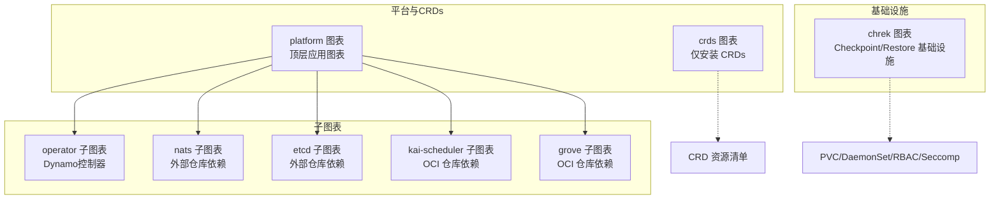
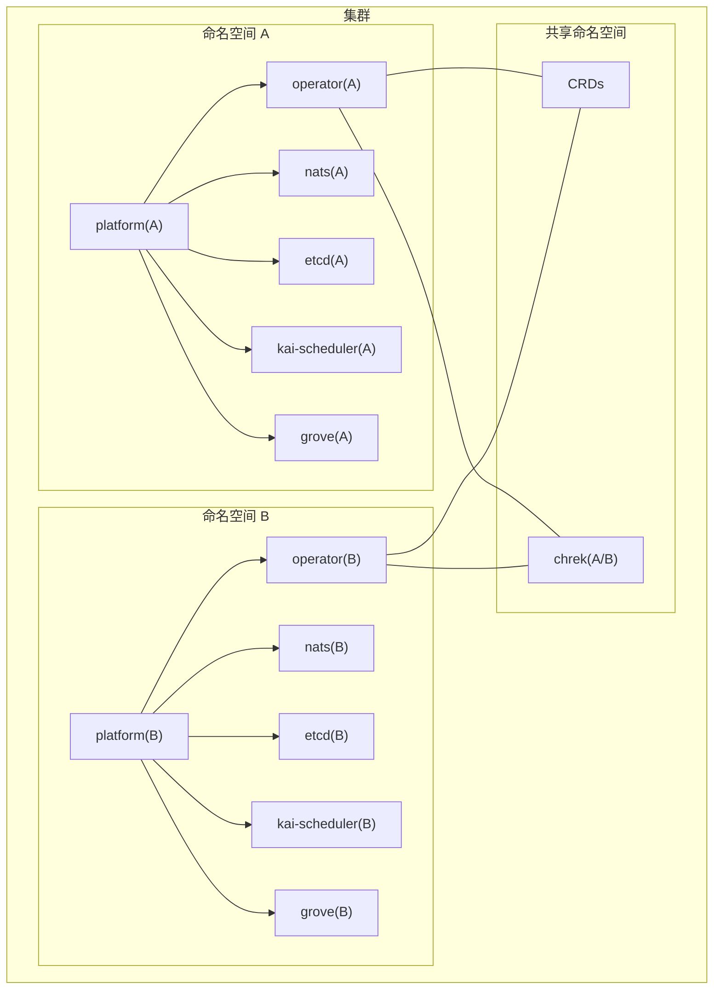
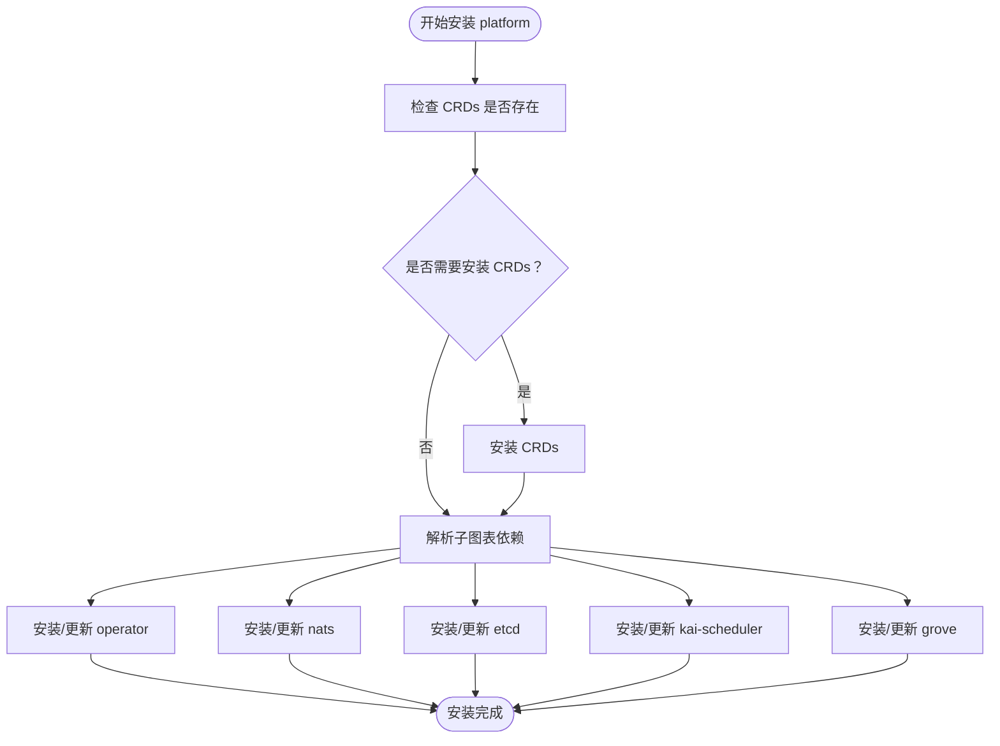
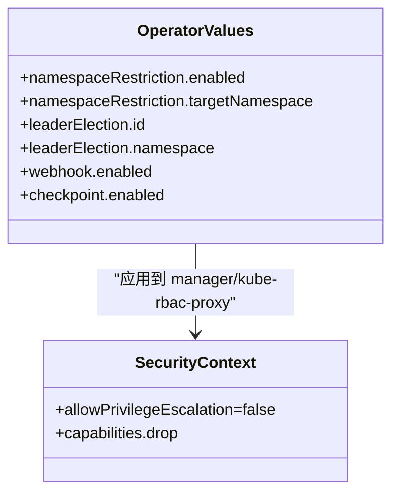
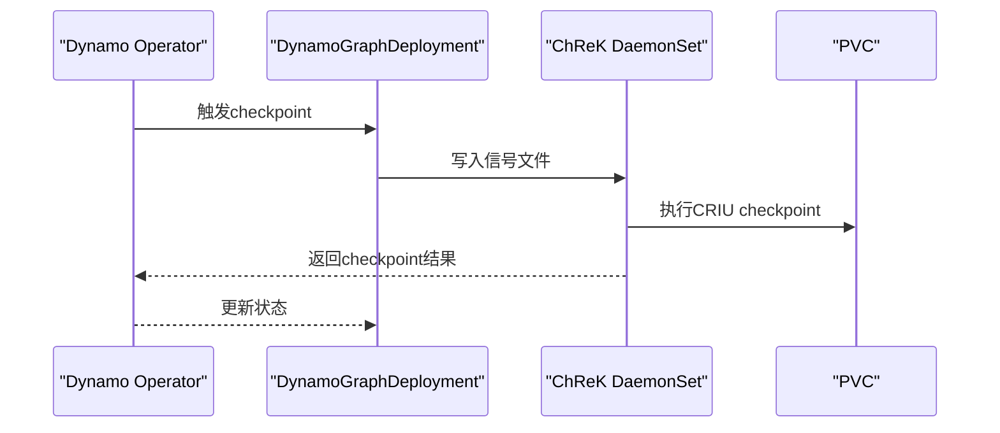
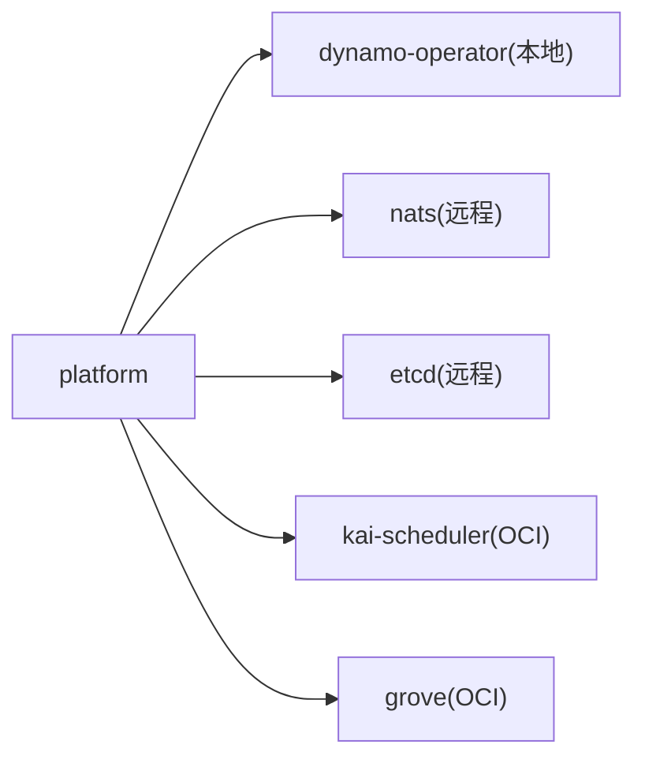

# Helm图表管理

<cite>
**本文引用的文件**
- [deploy/helm/README.md](file://deploy/helm/README.md)
- [deploy/helm/charts/platform/Chart.yaml](file://deploy/helm/charts/platform/Chart.yaml)
- [deploy/helm/charts/platform/README.md](file://deploy/helm/charts/platform/README.md)
- [deploy/helm/charts/platform/values.yaml](file://deploy/helm/charts/platform/values.yaml)
- [deploy/helm/charts/platform/templates/NOTES.txt](file://deploy/helm/charts/platform/templates/NOTES.txt)
- [deploy/helm/charts/platform/templates/kai.yaml](file://deploy/helm/charts/platform/templates/kai.yaml)
- [deploy/helm/charts/platform/components/operator/Chart.yaml](file://deploy/helm/charts/platform/components/operator/Chart.yaml)
- [deploy/helm/charts/platform/components/operator/values.yaml](file://deploy/helm/charts/platform/components/operator/values.yaml)
- [deploy/helm/charts/crds/Chart.yaml](file://deploy/helm/charts/crds/Chart.yaml)
- [deploy/helm/charts/crds/README.md](file://deploy/helm/charts/crds/README.md)
- [deploy/helm/charts/crds/templates/nvidia.com_dynamomodels.yaml](file://deploy/helm/charts/crds/templates/nvidia.com_dynamomodels.yaml)
- [deploy/helm/charts/chrek/Chart.yaml](file://deploy/helm/charts/chrek/Chart.yaml)
- [deploy/helm/charts/chrek/README.md](file://deploy/helm/charts/chrek/README.md)
- [deploy/helm/charts/chrek/values.yaml](file://deploy/helm/charts/chrek/values.yaml)
- [deploy/helm/charts/chrek/templates/_helpers.tpl](file://deploy/helm/charts/chrek/templates/_helpers.tpl)
- [deploy/helm/charts/chrek/templates/configmap.yaml](file://deploy/helm/charts/chrek/templates/configmap.yaml)
- [deploy/helm/charts/chrek/templates/daemonset.yaml](file://deploy/helm/charts/chrek/templates/daemonset.yaml)
- [deploy/helm/charts/chrek/templates/pvc.yaml](file://deploy/helm/charts/chrek/templates/pvc.yaml)
- [deploy/helm/charts/chrek/templates/role.yaml](file://deploy/helm/charts/chrek/templates/role.yaml)
- [deploy/helm/charts/chrek/templates/rolebinding.yaml](file://deploy/helm/charts/chrek/templates/rolebinding.yaml)
- [deploy/helm/charts/chrek/templates/seccomp-configmap.yaml](file://deploy/helm/charts/chrek/templates/seccomp-configmap.yaml)
- [deploy/helm/charts/chrek/templates/serviceaccount.yaml](file://deploy/helm/charts/chrek/templates/serviceaccount.yaml)
</cite>

## 目录
1. [简介](#简介)
2. [项目结构](#项目结构)
3. [核心组件](#核心组件)
4. [架构总览](#架构总览)
5. [详细组件分析](#详细组件分析)
6. [依赖关系分析](#依赖关系分析)
7. [性能与可扩展性](#性能与可扩展性)
8. [故障排查指南](#故障排查指南)
9. [结论](#结论)
10. [附录：操作手册与最佳实践](#附录操作手册与最佳实践)

## 简介
本指南面向Dynamo Kubernetes平台的Helm图表管理，覆盖以下内容：
- 图表目录结构与模板系统
- 值文件（values.yaml）组织与分层合并机制
- 子图表功能与配置项详解：platform、crds、chrek、operator
- 升级、回滚与版本管理策略
- 自定义值文件编写、环境差异化配置与配置验证
- 图表依赖关系、安装顺序与冲突规避
- 批量部署、并行安装与资源清理最佳实践

## 项目结构
Dynamo的Helm图表位于deploy/helm/charts目录下，采用“顶层平台图表 + 子图表”的分层结构：
- platform：完整平台安装包，内置对operator、nats、etcd、kai-scheduler、grove等子图表的依赖管理
- crds：仅安装Dynamo CRDs，便于独立部署或在平台之外使用
- chrek：Checkpoint/Restore基础设施（PVC + DaemonSet + CRIU Agent），用于vLLM后端的快速恢复

**图示来源**
- [deploy/helm/charts/platform/Chart.yaml](file://deploy/helm/charts/platform/Chart.yaml#L24-L46)
- [deploy/helm/charts/crds/Chart.yaml](file://deploy/helm/charts/crds/Chart.yaml#L15-L20)
- [deploy/helm/charts/chrek/Chart.yaml](file://deploy/helm/charts/chrek/Chart.yaml#L15-L27)

**章节来源**
- [deploy/helm/README.md](file://deploy/helm/README.md#L20-L23)
- [deploy/helm/charts/platform/Chart.yaml](file://deploy/helm/charts/platform/Chart.yaml#L15-L46)

## 核心组件
- platform：顶层应用图表，负责编排operator、nats、etcd、kai-scheduler、grove等子图表；提供统一的values.yaml分层配置与条件启用开关
- crds：仅安装CRD资源，无运行时组件，适合在平台之外复用Dynamo API
- chrek：Checkpoint/Restore基础设施，部署PVC、DaemonSet、RBAC与Seccomp配置，支持GPU工作负载的快速迁移/恢复

**章节来源**
- [deploy/helm/charts/platform/README.md](file://deploy/helm/charts/platform/README.md#L24-L33)
- [deploy/helm/charts/crds/README.md](file://deploy/helm/charts/crds/README.md#L18-L20)
- [deploy/helm/charts/chrek/README.md](file://deploy/helm/charts/chrek/README.md#L1-L14)

## 架构总览
platform图表通过dependencies声明子图表，values.yaml中按子图表命名空间组织配置，实现“按需启用、按域隔离”的部署模式。

**图示来源**
- [deploy/helm/charts/platform/Chart.yaml](file://deploy/helm/charts/platform/Chart.yaml#L24-L46)
- [deploy/helm/charts/platform/values.yaml](file://deploy/helm/charts/platform/values.yaml#L19-L48)

## 详细组件分析

### platform 图表
- 作用：打包并编排Dynamo平台所需的核心组件，支持多命名空间、多租户场景
- 关键特性：
  - 条件依赖：通过condition字段控制子图表启用
  - 多租户安全：operator支持集群级与命名空间级两种部署模式，内置冲突检测与自动保护
  - 统一入口：通过values.yaml集中管理各子图表参数
- 安装顺序建议：
  1) 先安装crds（如需独立部署）
  2) 再安装platform（会自动处理子图表依赖）
  3) 如启用checkpoint，先在目标命名空间安装chrek

**图示来源**
- [deploy/helm/charts/platform/Chart.yaml](file://deploy/helm/charts/platform/Chart.yaml#L24-L46)
- [deploy/helm/charts/platform/README.md](file://deploy/helm/charts/platform/README.md#L41-L82)

**章节来源**
- [deploy/helm/charts/platform/Chart.yaml](file://deploy/helm/charts/platform/Chart.yaml#L15-L46)
- [deploy/helm/charts/platform/README.md](file://deploy/helm/charts/platform/README.md#L24-L94)
- [deploy/helm/charts/platform/values.yaml](file://deploy/helm/charts/platform/values.yaml#L19-L778)

### operator 子图表
- 作用：Dynamo Kubernetes控制器，负责CRD资源的生命周期管理与编排
- 配置要点：
  - namespaceRestriction：启用后限制operator作用域，避免跨命名空间冲突
  - leaderElection：集群级部署时需保持id与namespace一致，防止脑裂
  - webhook：默认启用，支持证书自动管理或外部cert-manager集成
  - checkpoint：与chrek配合，需确保storage配置与chrek一致
- 安全与合规：
  - kube-rbac-proxy与manager均设置最小权限容器安全上下文
  - 支持镜像拉取密钥与受限安全上下文

**图示来源**
- [deploy/helm/charts/platform/components/operator/values.yaml](file://deploy/helm/charts/platform/components/operator/values.yaml#L23-L48)
- [deploy/helm/charts/platform/components/operator/values.yaml](file://deploy/helm/charts/platform/components/operator/values.yaml#L78-L82)

**章节来源**
- [deploy/helm/charts/platform/components/operator/Chart.yaml](file://deploy/helm/charts/platform/components/operator/Chart.yaml#L15-L36)
- [deploy/helm/charts/platform/components/operator/values.yaml](file://deploy/helm/charts/platform/components/operator/values.yaml#L19-L283)

### crds 图表
- 作用：仅安装Dynamo CRDs，不包含控制器或数据平面组件
- 使用场景：在平台之外复用Dynamo API，或进行CRD版本升级演练
- 注意：安装前需确认Kubernetes版本兼容性与CRD版本匹配

**章节来源**
- [deploy/helm/charts/crds/Chart.yaml](file://deploy/helm/charts/crds/Chart.yaml#L15-L20)
- [deploy/helm/charts/crds/README.md](file://deploy/helm/charts/crds/README.md#L18-L20)

### chrek 图表
- 作用：Checkpoint/Restore基础设施，为vLLM后端提供GPU工作负载的快速迁移/恢复能力
- 关键组件：
  - PVC：命名空间内隔离的持久化存储
  - DaemonSet：在GPU节点上运行CRIU代理，监听checkpoint信号
  - RBAC：默认使用命名空间范围内的角色绑定，满足PVC访问要求
  - Seccomp：阻止io_uring系统调用，保证CRIU兼容性
- 安全与合规：
  - 恢复阶段需要特权模式，需评估生产安全策略
  - 仅支持vLLM后端（SGLang/TensorRT-LLM计划中）

**图示来源**
- [deploy/helm/charts/chrek/templates/daemonset.yaml](file://deploy/helm/charts/chrek/templates/daemonset.yaml)
- [deploy/helm/charts/chrek/templates/pvc.yaml](file://deploy/helm/charts/chrek/templates/pvc.yaml)
- [deploy/helm/charts/chrek/values.yaml](file://deploy/helm/charts/chrek/values.yaml#L20-L50)

**章节来源**
- [deploy/helm/charts/chrek/Chart.yaml](file://deploy/helm/charts/chrek/Chart.yaml#L15-L33)
- [deploy/helm/charts/chrek/README.md](file://deploy/helm/charts/chrek/README.md#L1-L177)
- [deploy/helm/charts/chrek/values.yaml](file://deploy/helm/charts/chrek/values.yaml#L15-L180)

## 依赖关系分析
- platform依赖关系：
  - dynamo-operator：本地子图表，版本与平台一致
  - nats：来自nats-io官方helm仓库
  - etcd：来自bitnami仓库
  - kai-scheduler：来自ghcr.io/nvidia/kai-scheduler
  - grove：来自ghcr.io/ai-dynamo/grove
- 冲突规避：
  - 平台内置operator冲突检测逻辑，阻止混合部署（集群级与命名空间级同时存在）
  - 通过lease与namespaceSelector降低并发冲突风险

**图示来源**
- [deploy/helm/charts/platform/Chart.yaml](file://deploy/helm/charts/platform/Chart.yaml#L24-L46)

**章节来源**
- [deploy/helm/charts/platform/Chart.yaml](file://deploy/helm/charts/platform/Chart.yaml#L24-L46)
- [deploy/helm/charts/platform/README.md](file://deploy/helm/charts/platform/README.md#L62-L82)

## 性能与可扩展性
- 资源规划：
  - operator：CPU/内存请求与限制已预设，可根据集群规模调整副本数与资源配额
  - nats：JetStream持久化与PVC大小需结合消息吞吐量与峰值内存占用评估
  - etcd：单节点适合开发测试，生产建议HA（3+副本）并开启持久化
- 可观测性：
  - operator默认暴露健康探针与本地Prometheus端口，建议结合集群监控体系
  - nats可选Prometheus导出器与HTTP监控端口
- 网络与安全：
  - operator webhook支持cert-manager自动证书轮转，减少运维负担
  - chrek DaemonSet使用特权模式，需结合企业安全策略评估

[本节为通用指导，无需列出具体文件来源]

## 故障排查指南
- operator冲突问题
  - 症状：安装失败，提示存在其他operator实例
  - 处理：确认当前集群operator类型（集群级/命名空间级），避免混合部署；必要时删除旧实例或调整namespaceRestriction
- chrek无法启动
  - 检查GPU节点标签与runtime class是否正确
  - 查看DaemonSet日志与事件，确认PVC挂载与Seccomp策略
- nats/etcd异常
  - 检查PVC容量与存储类支持度，确认JetStream配置与端口映射
- 平台安装卡住
  - 查看各子图表状态与事件，优先解决阻塞依赖（如CRDs未就绪）

**章节来源**
- [deploy/helm/charts/platform/README.md](file://deploy/helm/charts/platform/README.md#L62-L82)
- [deploy/helm/charts/chrek/README.md](file://deploy/helm/charts/chrek/README.md#L133-L167)

## 结论
Dynamo的Helm图表体系通过“平台图表 + 子图表 + CRDs + ChReK”的组合，提供了从API到基础设施的完整落地方案。遵循本文档的安装顺序、配置策略与最佳实践，可在多租户环境下稳定地部署与演进Dynamo平台。

[本节为总结性内容，无需列出具体文件来源]

## 附录：操作手册与最佳实践

### 目录结构与模板系统
- 模板位置
  - platform：charts/platform/templates/*
  - operator：charts/platform/components/operator/templates/*
  - chrek：charts/chrek/templates/*
- 模板系统
  - 使用Helm内置函数与helpers.tpl进行复用
  - 通过values.yaml的分层合并实现环境差异化配置

**章节来源**
- [deploy/helm/charts/chrek/templates/_helpers.tpl](file://deploy/helm/charts/chrek/templates/_helpers.tpl)
- [deploy/helm/charts/chrek/templates/daemonset.yaml](file://deploy/helm/charts/chrek/templates/daemonset.yaml)
- [deploy/helm/charts/chrek/templates/pvc.yaml](file://deploy/helm/charts/chrek/templates/pvc.yaml)

### 值文件管理与环境差异化
- 分层配置
  - platform/values.yaml按子图表命名空间组织配置，支持全局与子域分层
  - operator/values.yaml包含operator专属参数，如namespaceRestriction、leaderElection、webhook等
  - chrek/values.yaml包含存储、DaemonSet、RBAC、Seccomp等参数
- 环境差异
  - 开发：禁用高可用组件，简化存储与网络
  - 生产：启用HA、持久化、证书管理、严格的RBAC与安全上下文

**章节来源**
- [deploy/helm/charts/platform/values.yaml](file://deploy/helm/charts/platform/values.yaml#L19-L778)
- [deploy/helm/charts/platform/components/operator/values.yaml](file://deploy/helm/charts/platform/components/operator/values.yaml#L19-L283)
- [deploy/helm/charts/chrek/values.yaml](file://deploy/helm/charts/chrek/values.yaml#L15-L180)

### 升级、回滚与版本管理
- 版本策略
  - platform与operator采用相同主版本号，确保兼容性
  - 子图表版本来自上游仓库或OCI仓库，建议锁定版本
- 升级流程
  - dry-run校验变更影响
  - 分步升级：先升级crds，再升级platform，最后升级chrek（如启用）
  - 记录release历史，保留回滚点
- 回滚策略
  - 使用helm rollback回到上一个稳定版本
  - 对于CRD升级，需谨慎评估向后兼容性

**章节来源**
- [deploy/helm/charts/platform/Chart.yaml](file://deploy/helm/charts/platform/Chart.yaml#L24-L46)
- [deploy/helm/charts/platform/README.md](file://deploy/helm/charts/platform/README.md#L182-L191)

### 自定义值文件编写与配置验证
- 编写步骤
  - 基于环境选择基础values（如values-aks-spot.yaml）
  - 仅覆盖差异项，避免全量复制
  - 使用helm lint与helm template --validate进行语法与渲染验证
- 验证方法
  - 渲染输出检查关键资源（Deployment、Service、RBAC）字段
  - 在非生产环境先行灰度验证

**章节来源**
- [deploy/helm/README.md](file://deploy/helm/README.md#L20-L23)

### 安装顺序与冲突解决
- 推荐顺序
  1) 安装crds（如需独立部署）
  2) 安装platform（自动处理子图表依赖）
  3) 如启用checkpoint，安装chrek（每个命名空间独立部署）
- 冲突解决
  - 集群级operator与命名空间级operator不可共存
  - 使用lease与namespaceSelector降低并发冲突

**章节来源**
- [deploy/helm/charts/platform/README.md](file://deploy/helm/charts/platform/README.md#L41-L82)

### 批量部署、并行安装与资源清理
- 批量部署
  - 使用不同命名空间部署多个platform实例，实现多租户隔离
  - 为每个租户单独安装chrek，确保checkpoint资源隔离
- 并行安装
  - 各命名空间间并行安装，但需避免同一命名空间内operator重复部署
- 资源清理
  - 使用helm uninstall卸载release
  - chrek默认不删除PVC，如需清理请手动删除PVC

**章节来源**
- [deploy/helm/charts/chrek/README.md](file://deploy/helm/charts/chrek/README.md#L121-L132)