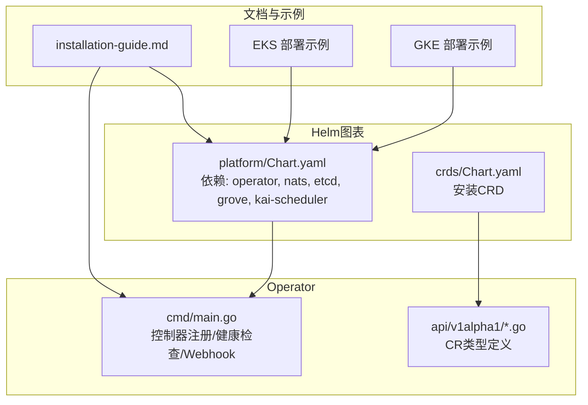
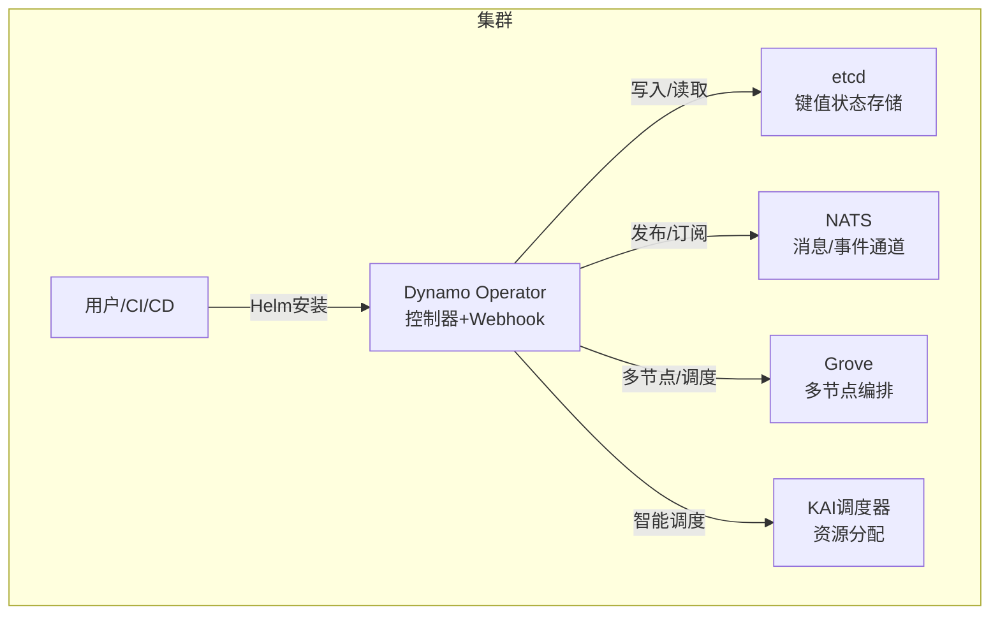
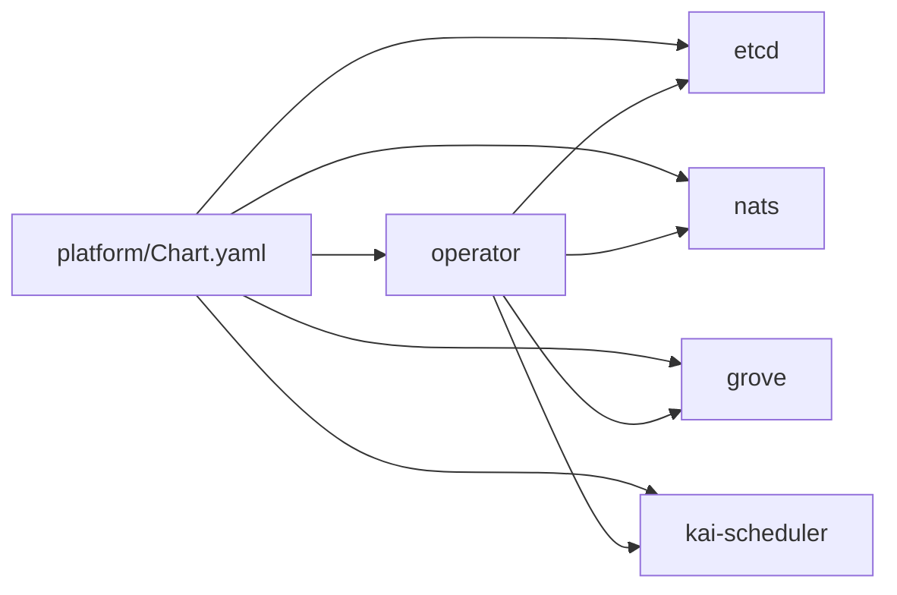
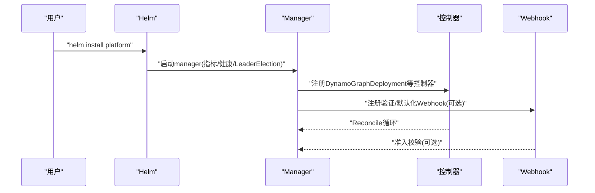

# Kubernetes原生部署

<cite>
**本文引用的文件**
- [deploy/helm/README.md](file://deploy/helm/README.md)
- [deploy/helm/charts/platform/Chart.yaml](file://deploy/helm/charts/platform/Chart.yaml)
- [deploy/helm/charts/platform/values.yaml](file://deploy/helm/charts/platform/values.yaml)
- [deploy/helm/charts/crds/Chart.yaml](file://deploy/helm/charts/crds/Chart.yaml)
- [deploy/helm/charts/crds/README.md](file://deploy/helm/charts/crds/README.md)
- [deploy/helm/charts/crds/templates/nvidia.com_dynamographdeployments.yaml](file://deploy/helm/charts/crds/templates/nvidia.com_dynamographdeployments.yaml)
- [deploy/operator/README.md](file://deploy/operator/README.md)
- [deploy/operator/api/v1alpha1/dynamographdeployment_types.go](file://deploy/operator/api/v1alpha1/dynamographdeployment_types.go)
- [deploy/operator/cmd/main.go](file://deploy/operator/cmd/main.go)
- [docs/pages/kubernetes/installation-guide.md](file://docs/pages/kubernetes/installation-guide.md)
- [examples/deployments/EKS/Deploy_Dynamo_Kubernetes_Platform.md](file://examples/deployments/EKS/Deploy_Dynamo_Kubernetes_Platform.md)
- [examples/deployments/GKE/README.md](file://examples/deployments/GKE/README.md)
</cite>

## 目录
1. [简介](#简介)
2. [项目结构](#项目结构)
3. [核心组件](#核心组件)
4. [架构总览](#架构总览)
5. [详细组件分析](#详细组件分析)
6. [依赖关系分析](#依赖关系分析)
7. [性能考虑](#性能考虑)
8. [故障排查指南](#故障排查指南)
9. [结论](#结论)
10. [附录](#附录)

## 简介
本指南面向在Kubernetes上原生部署Dynamo平台的工程团队，覆盖从平台安装、CRD与控制器管理、Helm图表结构与配置到生产级部署（多节点、GPU资源、网络与存储）、云平台（EKS、GKE、AKS）部署示例、监控与可观测性、备份与恢复、升级策略、故障排查、性能调优与安全最佳实践。内容基于仓库中的Helm图表、Operator源码与官方安装文档整理而成。

## 项目结构
Dynamo的Kubernetes原生部署由三部分组成：
- Helm图表：提供平台化安装与配置，包含平台Chart与CRD Chart。
- Operator：基于Kubebuilder构建的控制器，负责Dynamo资源的生命周期管理。
- 文档与示例：安装指南、云平台部署步骤与后端示例。

图示来源
- [deploy/helm/charts/platform/Chart.yaml](file://deploy/helm/charts/platform/Chart.yaml#L24-L46)
- [deploy/helm/charts/crds/Chart.yaml](file://deploy/helm/charts/crds/Chart.yaml#L15-L20)
- [deploy/operator/cmd/main.go](file://deploy/operator/cmd/main.go#L631-L701)
- [deploy/operator/api/v1alpha1/dynamographdeployment_types.go](file://deploy/operator/api/v1alpha1/dynamographdeployment_types.go#L47-L69)
- [docs/pages/kubernetes/installation-guide.md](file://docs/pages/kubernetes/installation-guide.md#L46-L73)

章节来源
- [deploy/helm/README.md](file://deploy/helm/README.md#L18-L23)
- [deploy/helm/charts/platform/Chart.yaml](file://deploy/helm/charts/platform/Chart.yaml#L15-L46)
- [deploy/helm/charts/crds/Chart.yaml](file://deploy/helm/charts/crds/Chart.yaml#L15-L20)
- [deploy/operator/README.md](file://deploy/operator/README.md#L1-L37)

## 核心组件
- 平台Helm图表（platform）：封装Operator、NATS、etcd、Grove、KAI调度器等子图表依赖，提供统一安装入口与全局配置。
- CRD Helm图表（crds）：仅安装Dynamo CRD，便于在共享集群中复用现有Operator。
- Dynamo Operator：以控制器模式管理DynamoGraphDeployment、DynamoComponentDeployment、DynamoGraphDeploymentRequest等资源；支持Webhook校验与默认化。
- CRD定义：集中于api/v1alpha1目录，如DynamoGraphDeploymentSpec/Status等，定义部署规范与状态字段。

章节来源
- [deploy/helm/charts/platform/Chart.yaml](file://deploy/helm/charts/platform/Chart.yaml#L24-L46)
- [deploy/helm/charts/crds/README.md](file://deploy/helm/charts/crds/README.md#L18-L20)
- [deploy/operator/api/v1alpha1/dynamographdeployment_types.go](file://deploy/operator/api/v1alpha1/dynamographdeployment_types.go#L47-L69)
- [deploy/operator/cmd/main.go](file://deploy/operator/cmd/main.go#L631-L701)

## 架构总览
下图展示Dynamo平台在Kubernetes中的运行时关系：Helm安装CRD与平台组件，Operator通过控制器与Webhook协调资源，NATS/etcd提供消息与状态存储，Grove/KAI用于多节点编排与智能调度。

图示来源
- [deploy/helm/charts/platform/Chart.yaml](file://deploy/helm/charts/platform/Chart.yaml#L24-L46)
- [deploy/operator/cmd/main.go](file://deploy/operator/cmd/main.go#L503-L523)

## 详细组件分析

### Helm图表结构与配置
- platform图表
  - 依赖项：operator、nats、etcd、grove、kai-scheduler，可按需启用。
  - 全局values涵盖Operator镜像、命名空间限制、Webhook、Checkpoint、Ingress/Istio、MPI Run等。
- crds图表
  - 仅安装CRD，适合共享集群场景。

章节来源
- [deploy/helm/charts/platform/Chart.yaml](file://deploy/helm/charts/platform/Chart.yaml#L15-L46)
- [deploy/helm/charts/platform/values.yaml](file://deploy/helm/charts/platform/values.yaml#L1-L200)
- [deploy/helm/charts/crds/Chart.yaml](file://deploy/helm/charts/crds/Chart.yaml#L15-L20)

### 自定义资源定义（CRD）
- DynamoGraphDeployment：描述推理图的期望状态与状态字段，支持重启策略、服务副本状态、Checkpoint状态等。
- CRD模板定义了OpenAPI v3模式、printer columns与版本信息，确保kubectl显示与校验。

章节来源
- [deploy/operator/api/v1alpha1/dynamographdeployment_types.go](file://deploy/operator/api/v1alpha1/dynamographdeployment_types.go#L47-L190)
- [deploy/helm/charts/crds/templates/nvidia.com_dynamographdeployments.yaml](file://deploy/helm/charts/crds/templates/nvidia.com_dynamographdeployments.yaml#L48-L80)

### 操作器管理与控制器
- 控制器注册：DynamoComponentDeployment、DynamoGraphDeployment、DynamoGraphDeploymentScalingAdapter、DynamoGraphDeploymentRequest、DynamoModel、Checkpoint等。
- 健康检查与指标：支持readyz/healthz探针与Prometheus端点。
- Webhook：可选的验证/默认化Webhook，支持失败策略与证书管理。

章节来源
- [deploy/operator/cmd/main.go](file://deploy/operator/cmd/main.go#L631-L701)
- [deploy/operator/cmd/main.go](file://deploy/operator/cmd/main.go#L706-L768)
- [deploy/operator/cmd/main.go](file://deploy/operator/cmd/main.go#L771-L784)

### 部署策略与安装流程
- 生产路径（NGC制品）：先安装CRDs，再安装platform，支持多节点编排组件（Grove/KAI）按需启用。
- 自定义构建路径（源码）：构建并推送Operator镜像，创建拉取密钥，安装CRDs与platform。
- 验证：检查CRD、Operator与平台Pod状态。

章节来源
- [docs/pages/kubernetes/installation-guide.md](file://docs/pages/kubernetes/installation-guide.md#L121-L194)
- [docs/pages/kubernetes/installation-guide.md](file://docs/pages/kubernetes/installation-guide.md#L196-L252)
- [docs/pages/kubernetes/installation-guide.md](file://docs/pages/kubernetes/installation-guide.md#L253-L263)

### 云平台部署示例

#### EKS
- 步骤要点：创建ECR仓库、构建并推送基础镜像与Operator镜像、创建镜像拉取密钥、安装CRDs与platform。
- 验证：Operator、etcd、NATS相关Pod均Running。

章节来源
- [examples/deployments/EKS/Deploy_Dynamo_Kubernetes_Platform.md](file://examples/deployments/EKS/Deploy_Dynamo_Kubernetes_Platform.md#L1-L97)

#### GKE
- 步骤要点：创建GKE集群与GPU节点池、克隆仓库、设置命名空间与HuggingFace令牌密钥、安装平台。
- 部署推理图：调整LD_LIBRARY_PATH与PATH以适配GKE GPU驱动，并按需修改镜像、资源请求/限制与模型名称。
- 测试：通过端口转发与curl进行推理测试。

章节来源
- [examples/deployments/GKE/README.md](file://examples/deployments/GKE/README.md#L1-L189)

### 监控、日志与可观测性
- Prometheus端点：Operator支持本地Prometheus端点，可注入到受管服务。
- Grafana仪表盘：提供Dynamo、Operator、Planner等仪表盘配置。
- 日志：通过kubectl logs查看Pod日志；必要时配置持久化日志采集。

章节来源
- [deploy/helm/charts/platform/values.yaml](file://deploy/helm/charts/platform/values.yaml#L137-L141)
- [deploy/helm/README.md](file://deploy/helm/README.md#L18-L23)

### 备份与恢复
- etcd：作为Operator状态存储，建议启用持久卷与备份策略。
- Checkpoint：支持PVC/S3/OCI三种存储后端，配合chrek DaemonSet实现快速Pod恢复。

章节来源
- [deploy/helm/charts/platform/values.yaml](file://deploy/helm/charts/platform/values.yaml#L212-L258)

### 升级策略
- 平台升级：通过Helm升级platform与crds；注意版本兼容性与依赖变更。
- Operator升级：更新镜像仓库与标签，保持Webhook与证书配置一致。
- 多节点编排：升级Grove/KAI时评估其版本与兼容性。

章节来源
- [docs/pages/kubernetes/installation-guide.md](file://docs/pages/kubernetes/installation-guide.md#L368-L374)

## 依赖关系分析
- Helm依赖：platform依赖operator、nats、etcd、grove、kai-scheduler；crds仅安装CRD。
- 控制器依赖：Operator依赖etcd（状态存储）、NATS（消息/事件）、可选Grove/KAI/LWS/Volcano（多节点/调度）。
- 运行时耦合：Operator通过Webhook与控制器共同保障资源一致性；CRD定义约束资源形态。

图示来源
- [deploy/helm/charts/platform/Chart.yaml](file://deploy/helm/charts/platform/Chart.yaml#L24-L46)

章节来源
- [deploy/helm/charts/platform/Chart.yaml](file://deploy/helm/charts/platform/Chart.yaml#L15-L46)
- [deploy/operator/cmd/main.go](file://deploy/operator/cmd/main.go#L503-L523)

## 性能考虑
- 资源规划：根据后端框架（vLLM、SGLang、TRT-LLM）与模型规模合理设置CPU/GPU/内存请求与限制。
- 存储I/O：优先使用高性能存储类，结合etcd持久卷与JetStream PVC提升稳定性。
- 网络：在多节点场景下，确保跨节点通信与服务发现可用；必要时启用Istio或Gateway API。
- 调度：在GKE/AKS上为GPU节点配置节点选择器与容忍；在EKS上结合Spot实例与自动扩缩容策略。

## 故障排查指南
- 安装冲突：若提示无法安装集群级Operator，检查是否存在命名空间受限Operator，添加命名空间限制参数。
- CRD已存在：在共享集群跳过CRD安装步骤，直接安装platform。
- Pod未启动：使用describe/logs定位问题；检查镜像拉取密钥、GPU驱动与库路径。
- etcd镜像问题：在Bitnami仓库迁移期间，使用legacy镜像仓库与允许非标准容器配置。
- 清理卸载：先卸载platform，再逐个删除CRD。

章节来源
- [docs/pages/kubernetes/installation-guide.md](file://docs/pages/kubernetes/installation-guide.md#L285-L345)

## 结论
通过Helm图表与Operator的组合，Dynamo实现了对推理图的声明式管理与自动化运维。结合云平台示例与生产级配置（GPU、网络、存储、监控、备份与升级），可在EKS、GKE、AKS等环境中稳定落地。建议在生产中启用Webhook、命名空间限制、Checkpoint与多节点编排，并持续优化资源与存储策略以获得最佳性能与可靠性。

## 附录

### 关键流程：Operator启动与控制器装配

图示来源
- [deploy/operator/cmd/main.go](file://deploy/operator/cmd/main.go#L415-L420)
- [deploy/operator/cmd/main.go](file://deploy/operator/cmd/main.go#L631-L701)
- [deploy/operator/cmd/main.go](file://deploy/operator/cmd/main.go#L706-L768)