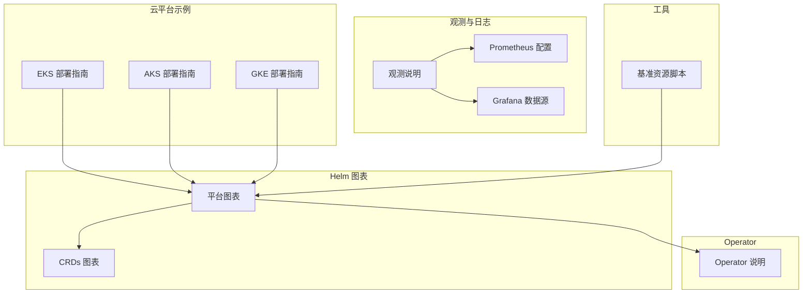
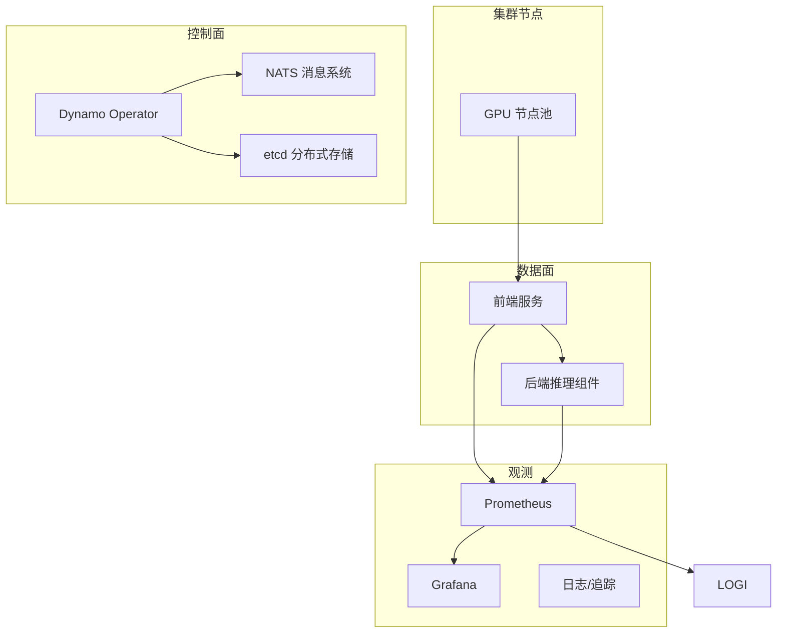
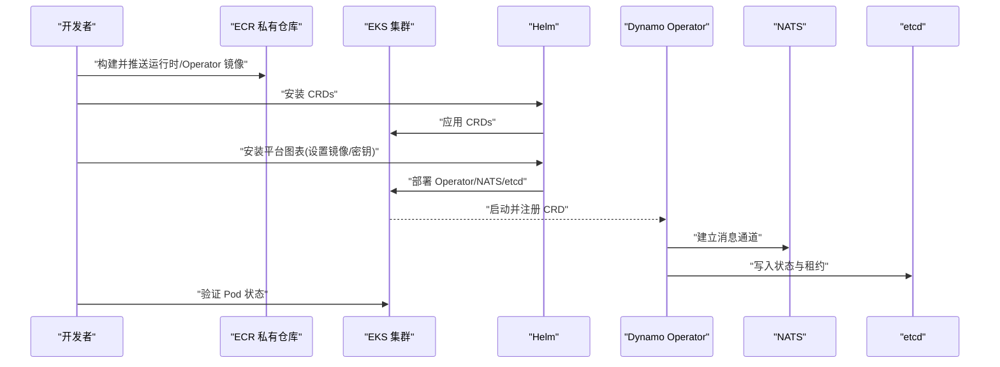
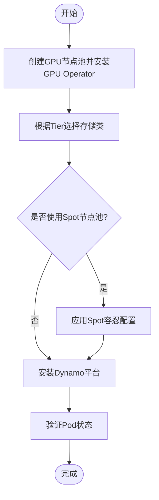
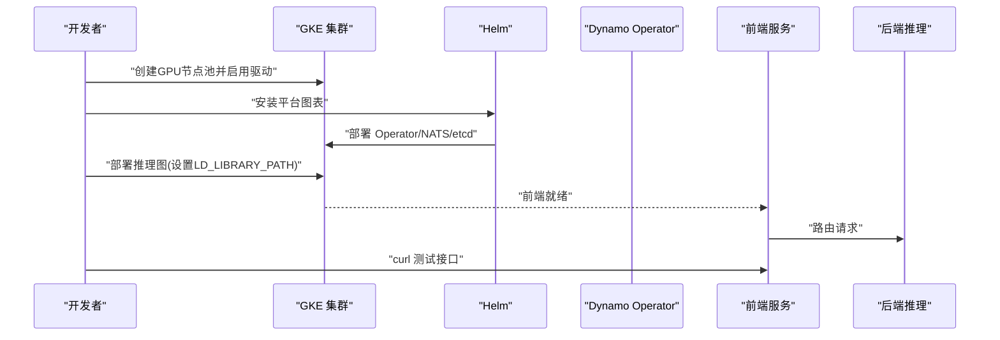
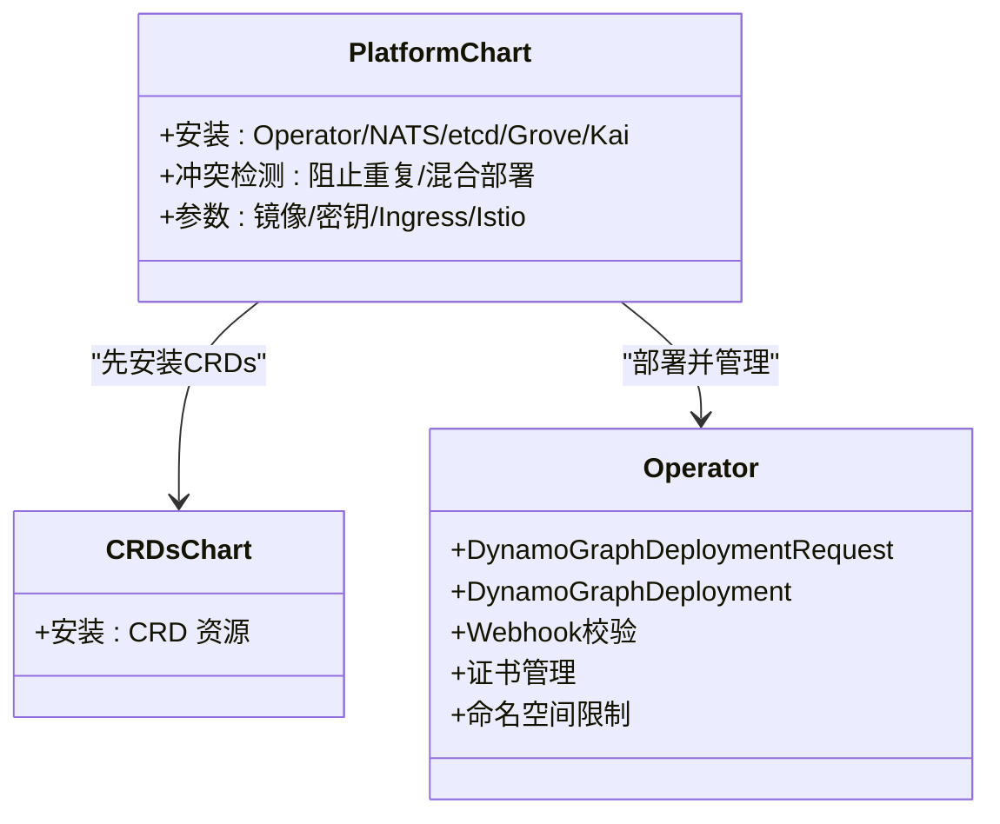
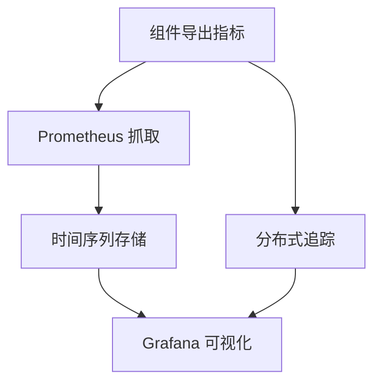
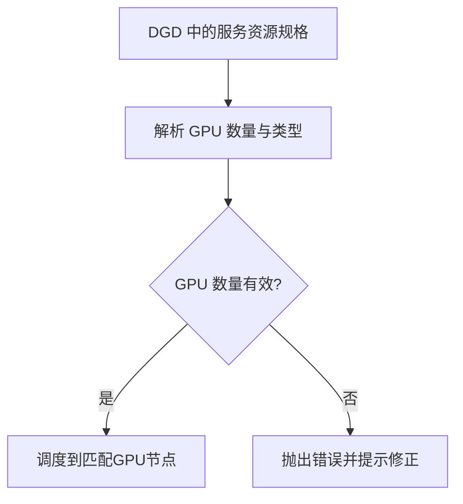
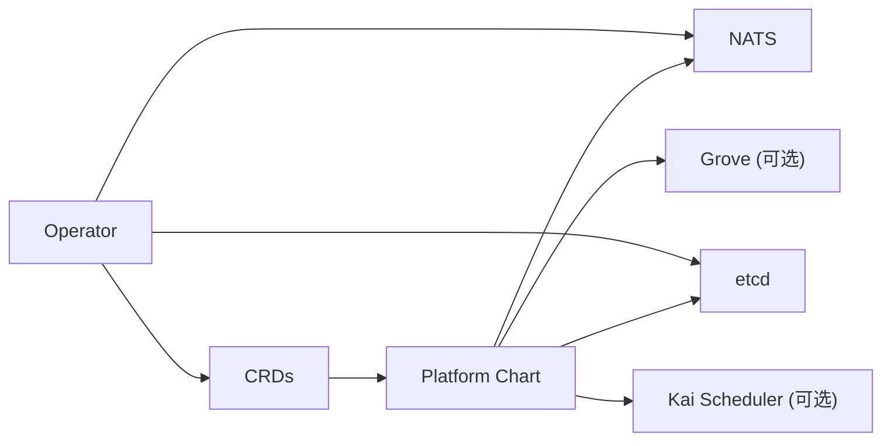

# 云平台部署

<cite>
**本文引用的文件**
- [examples/deployments/EKS/Deploy_Dynamo_Kubernetes_Platform.md](file://examples/deployments/EKS/Deploy_Dynamo_Kubernetes_Platform.md)
- [examples/deployments/EKS/Create_EKS_EFS.md](file://examples/deployments/EKS/Create_EKS_EFS.md)
- [examples/deployments/AKS/AKS-deployment.md](file://examples/deployments/AKS/AKS-deployment.md)
- [examples/deployments/AKS/values-aks-spot.yaml](file://examples/deployments/AKS/values-aks-spot.yaml)
- [examples/deployments/GKE/README.md](file://examples/deployments/GKE/README.md)
- [deploy/helm/README.md](file://deploy/helm/README.md)
- [deploy/helm/charts/platform/README.md](file://deploy/helm/charts/platform/README.md)
- [deploy/helm/charts/crds/README.md](file://deploy/helm/charts/crds/README.md)
- [deploy/operator/README.md](file://deploy/operator/README.md)
- [deploy/observability/README.md](file://deploy/observability/README.md)
- [deploy/observability/prometheus.yml](file://deploy/observability/prometheus.yml)
- [deploy/observability/grafana-datasources.yml](file://deploy/observability/grafana-datasources.yml)
- [deploy/utils/setup_benchmarking_resources.sh](file://deploy/utils/setup_benchmarking_resources.sh)
- [components/src/dynamo/planner/defaults.py](file://components/src/dynamo/planner/defaults.py)
- [lib/runtime/src/pipeline/network/manager.rs](file://lib/runtime/src/pipeline/network/manager.rs)
</cite>

## 目录
1. [引言](#引言)
2. [项目结构](#项目结构)
3. [核心组件](#核心组件)
4. [架构总览](#架构总览)
5. [详细组件分析](#详细组件分析)
6. [依赖关系分析](#依赖关系分析)
7. [性能与成本优化](#性能与成本优化)
8. [故障排查指南](#故障排查指南)
9. [结论](#结论)
10. [附录](#附录)

## 引言
本指南面向在主流云平台（AWS EKS、Microsoft AKS、Google GKE）上部署Dynamo的工程团队，提供从集群准备、容器镜像构建、Operator与平台组件安装到模型推理图部署、监控与日志、备份与灾难恢复、成本优化与高可用性的全流程实践。文档严格基于仓库中的示例与配置文件进行归纳总结，并给出可直接执行的步骤与验证方法。

## 项目结构
围绕云平台部署，本仓库的关键目录与文件如下：
- 平台安装与Helm图表：deploy/helm
- 运维观测与指标：deploy/observability
- 部署脚本与工具：deploy/utils
- 各云平台部署示例：examples/deployments/{EKS,AKS,GKE}
- 运行时与规划器资源定义：components/src/dynamo/planner/defaults.py
- 网络管理与通信：lib/runtime/src/pipeline/network/manager.rs

**图表来源**
- [deploy/helm/README.md](file://deploy/helm/README.md#L18-L23)
- [deploy/helm/charts/platform/README.md](file://deploy/helm/charts/platform/README.md#L18-L33)
- [deploy/helm/charts/crds/README.md](file://deploy/helm/charts/crds/README.md#L18-L20)
- [deploy/operator/README.md](file://deploy/operator/README.md#L1-L37)
- [deploy/observability/README.md](file://deploy/observability/README.md#L1-L4)
- [deploy/observability/prometheus.yml](file://deploy/observability/prometheus.yml#L16-L62)
- [deploy/observability/grafana-datasources.yml](file://deploy/observability/grafana-datasources.yml#L16-L24)
- [deploy/utils/setup_benchmarking_resources.sh](file://deploy/utils/setup_benchmarking_resources.sh#L1-L107)

**章节来源**
- [deploy/helm/README.md](file://deploy/helm/README.md#L18-L23)
- [deploy/helm/charts/platform/README.md](file://deploy/helm/charts/platform/README.md#L18-L33)
- [deploy/helm/charts/crds/README.md](file://deploy/helm/charts/crds/README.md#L18-L20)
- [deploy/operator/README.md](file://deploy/operator/README.md#L1-L37)
- [deploy/observability/README.md](file://deploy/observability/README.md#L1-L4)

## 核心组件
- Dynamo Kubernetes Operator：通过CRD管理推理图生命周期，支持SLA驱动与直接配置两种模式。
- 平台组件：NATS消息系统、etcd状态存储、可选的Grove多节点编排与Kai调度器。
- Helm图表：提供CRDs与平台组件的一键安装，内置冲突检测与命名空间隔离能力。
- 观测体系：Prometheus指标抓取、Grafana数据源与仪表盘、日志采集与追踪。
- 基准与工具：一键部署基准资源、PVC与凭据注入、Helm参数化配置。

**章节来源**
- [deploy/operator/README.md](file://deploy/operator/README.md#L6-L19)
- [deploy/helm/charts/platform/README.md](file://deploy/helm/charts/platform/README.md#L24-L33)
- [deploy/helm/charts/platform/README.md](file://deploy/helm/charts/platform/README.md#L83-L171)
- [deploy/observability/prometheus.yml](file://deploy/observability/prometheus.yml#L16-L62)
- [deploy/observability/grafana-datasources.yml](file://deploy/observability/grafana-datasources.yml#L16-L24)
- [deploy/utils/setup_benchmarking_resources.sh](file://deploy/utils/setup_benchmarking_resources.sh#L32-L96)

## 架构总览
下图展示Dynamo在云原生环境中的端到端架构：集群节点承载GPU工作负载；Operator负责编排；NATS与etcd提供通信与状态；前端服务对外暴露API；观测系统采集指标与日志。

[此图为概念性架构示意，不直接映射具体源码文件，故无“图表来源”标注]

## 详细组件分析

### AWS EKS 部署
- 集群与网络
  - 使用托管节点组与附加策略（含EBS、ALB、CloudWatch、EFS），确保CSI与负载均衡控制器可用。
  - 可选使用EFA提升GPU节点间通信性能。
- 容器镜像
  - 在私有ECR中创建仓库，构建并推送运行时镜像与Operator镜像。
- 平台安装
  - 先安装CRDs，再通过Helm安装平台图表，设置镜像拉取密钥与Operator参数。
- 存储
  - 可结合EFS或EBS实现持久化缓存与模型数据。
- 负载均衡
  - 使用ALB Ingress控制器暴露服务。
- 安全
  - 使用IAM角色与OIDC，配合ServiceAccount与RBAC。
- 验证
  - 检查平台Pod状态，确认Operator、etcd、NATS正常运行。

**图表来源**
- [examples/deployments/EKS/Deploy_Dynamo_Kubernetes_Platform.md](file://examples/deployments/EKS/Deploy_Dynamo_Kubernetes_Platform.md#L32-L85)
- [examples/deployments/EKS/Create_EKS_EFS.md](file://examples/deployments/EKS/Create_EKS_EFS.md#L52-L108)
- [deploy/helm/charts/platform/README.md](file://deploy/helm/charts/platform/README.md#L83-L171)

**章节来源**
- [examples/deployments/EKS/Deploy_Dynamo_Kubernetes_Platform.md](file://examples/deployments/EKS/Deploy_Dynamo_Kubernetes_Platform.md#L1-L97)
- [examples/deployments/EKS/Create_EKS_EFS.md](file://examples/deployments/EKS/Create_EKS_EFS.md#L52-L108)
- [deploy/helm/charts/platform/README.md](file://deploy/helm/charts/platform/README.md#L83-L171)

### Microsoft AKS 部署
- GPU节点池
  - 使用NVIDIA GPU Operator自动安装驱动与设备插件，推荐跳过节点创建时的驱动安装。
- 存储选项
  - 支持Local CSI、Azure Managed Lustre、Azure Disk、Azure Files、Azure Blob等，按Tier选择。
- Spot节点池
  - 需要容忍特定污点以调度到Spot节点，示例values文件已包含必要容忍。
- 平台安装
  - 按官方指南安装Dynamo Operator与平台组件，验证Pod状态。
- 验证
  - 获取dynamo-system命名空间下的Pod，确认Operator、etcd、NATS均处于Running状态。

**图表来源**
- [examples/deployments/AKS/AKS-deployment.md](file://examples/deployments/AKS/AKS-deployment.md#L14-L60)
- [examples/deployments/AKS/AKS-deployment.md](file://examples/deployments/AKS/AKS-deployment.md#L61-L146)
- [examples/deployments/AKS/values-aks-spot.yaml](file://examples/deployments/AKS/values-aks-spot.yaml#L17-L70)

**章节来源**
- [examples/deployments/AKS/AKS-deployment.md](file://examples/deployments/AKS/AKS-deployment.md#L1-L201)
- [examples/deployments/AKS/values-aks-spot.yaml](file://examples/deployments/AKS/values-aks-spot.yaml#L1-L70)

### Google GKE 部署
- 集群与GPU节点池
  - 创建带GPU加速器的节点池，启用自动扩缩容与最新驱动版本。
- 镜像与命名空间
  - 设置命名空间与HuggingFace令牌密钥。
- 平台安装
  - 按官方指南安装Dynamo平台，验证Pod状态。
- 推理图部署
  - 需要在解码容器中正确设置LD_LIBRARY_PATH与PATH，使GPU驱动生效。
- 验证
  - 通过端口转发与HTTP请求验证服务可用性。

**图表来源**
- [examples/deployments/GKE/README.md](file://examples/deployments/GKE/README.md#L8-L87)
- [examples/deployments/GKE/README.md](file://examples/deployments/GKE/README.md#L88-L156)

**章节来源**
- [examples/deployments/GKE/README.md](file://examples/deployments/GKE/README.md#L1-L189)

### Helm 图表与 Operator
- Helm图表
  - platform图表安装Operator、NATS、etcd、可选Grove/Kai；crds图表仅安装CRD。
  - 内置冲突检测：防止重复安装、混合作用域部署。
- Operator
  - 提供DynamoGraphDeploymentRequest与DynamoGraphDeployment两类CRD，支持SLA驱动与直接配置。
  - 支持Webhook校验、证书管理、命名空间限制、Leader Election等高级特性。

**图表来源**
- [deploy/helm/README.md](file://deploy/helm/README.md#L18-L23)
- [deploy/helm/charts/platform/README.md](file://deploy/helm/charts/platform/README.md#L24-L82)
- [deploy/helm/charts/crds/README.md](file://deploy/helm/charts/crds/README.md#L18-L20)
- [deploy/operator/README.md](file://deploy/operator/README.md#L6-L19)

**章节来源**
- [deploy/helm/README.md](file://deploy/helm/README.md#L18-L23)
- [deploy/helm/charts/platform/README.md](file://deploy/helm/charts/platform/README.md#L24-L82)
- [deploy/helm/charts/crds/README.md](file://deploy/helm/charts/crds/README.md#L18-L20)
- [deploy/operator/README.md](file://deploy/operator/README.md#L6-L19)

### 观测性与日志
- Prometheus
  - 配置抓取目标：NATS、etcd、DCGM、前端与后端服务等。
- Grafana
  - 配置Prometheus数据源，结合仓库提供的仪表盘。
- 日志与追踪
  - 结合Prometheus/Grafana与日志采集组件，实现端到端可观测。

**图表来源**
- [deploy/observability/prometheus.yml](file://deploy/observability/prometheus.yml#L16-L62)
- [deploy/observability/grafana-datasources.yml](file://deploy/observability/grafana-datasources.yml#L16-L24)

**章节来源**
- [deploy/observability/README.md](file://deploy/observability/README.md#L1-L4)
- [deploy/observability/prometheus.yml](file://deploy/observability/prometheus.yml#L16-L62)
- [deploy/observability/grafana-datasources.yml](file://deploy/observability/grafana-datasources.yml#L16-L24)

### 资源与GPU配置要点
- GPU资源声明
  - 通过资源对象的limits.gpu与requests.gpu指定GPU数量；多节点部署时总量为节点数×单节点GPU上限。
- GPU类型
  - 默认使用nvidia.com/gpu；也可指定自定义GPU类型（如intel xe）。
- 网络与通信
  - 网络管理器从环境变量读取配置，支持多种传输模式与统一的服务器/客户端抽象。

**图表来源**
- [components/src/dynamo/planner/defaults.py](file://components/src/dynamo/planner/defaults.py#L184-L219)
- [lib/runtime/src/pipeline/network/manager.rs](file://lib/runtime/src/pipeline/network/manager.rs#L1-L182)

**章节来源**
- [components/src/dynamo/planner/defaults.py](file://components/src/dynamo/planner/defaults.py#L184-L219)
- [lib/runtime/src/pipeline/network/manager.rs](file://lib/runtime/src/pipeline/network/manager.rs#L1-L182)

## 依赖关系分析
- Helm图表依赖
  - platform图表依赖etcd、NATS、可选Grove与Kai；CRDs需先于平台安装。
- Operator依赖
  - 依赖NATS与etcd；支持Webhook与证书管理；支持命名空间限制与Leader Election。
- 云平台差异
  - EKS侧重EFS/ALB/CSI；AKS强调GPU Operator与Spot容忍；GKE关注LD_LIBRARY_PATH与GPU驱动路径。

**图表来源**
- [deploy/helm/charts/platform/README.md](file://deploy/helm/charts/platform/README.md#L83-L94)
- [deploy/helm/charts/crds/README.md](file://deploy/helm/charts/crds/README.md#L18-L20)
- [deploy/operator/README.md](file://deploy/operator/README.md#L6-L19)

**章节来源**
- [deploy/helm/charts/platform/README.md](file://deploy/helm/charts/platform/README.md#L83-L94)
- [deploy/helm/charts/crds/README.md](file://deploy/helm/charts/crds/README.md#L18-L20)
- [deploy/operator/README.md](file://deploy/operator/README.md#L6-L19)

## 性能与成本优化
- GPU实例与节点池
  - EKS：结合EFA与合适实例类型；AKS/GKE：按工作负载选择GPU机型与驱动版本。
- 自动扩缩容
  - GKE节点池启用自动扩缩容，避免峰值压力。
- 存储Tier
  - 模型缓存优先共享高吞吐存储；编译缓存可使用本地或持久盘；性能缓存可使用临时存储。
- 网络与I/O
  - EKS使用ALB；AKS/GKE确保CSI与驱动路径正确；GKE需设置LD_LIBRARY_PATH。
- 成本优化
  - 使用Spot节点池（AKS）降低GPU成本；结合自动扩缩容与资源限额；采用分层存储减少冷数据成本。

[本节为通用优化建议，不直接分析具体文件，故无“章节来源”与“图表来源”]

## 故障排查指南
- 安装前检查
  - 确认命名空间存在且Dynamo平台已安装；必要时使用基准资源脚本初始化PVC与密钥。
- 常见问题
  - Operator冲突：遵循冲突检测规则，避免重复或混合部署。
  - GPU不可用：检查GPU Operator、设备插件与节点容忍；AKS/GKE需正确设置驱动路径。
  - 观测缺失：确认Prometheus抓取目标与Grafana数据源配置。
- 清理
  - 卸载Dynamo平台与CRDs，必要时删除GPU Operator与集群。

**章节来源**
- [deploy/utils/setup_benchmarking_resources.sh](file://deploy/utils/setup_benchmarking_resources.sh#L32-L96)
- [deploy/helm/charts/platform/README.md](file://deploy/helm/charts/platform/README.md#L62-L82)
- [examples/deployments/AKS/AKS-deployment.md](file://examples/deployments/AKS/AKS-deployment.md#L183-L201)

## 结论
通过本指南，可在EKS、AKS、GKE三大云平台上完成Dynamo的端到端部署：从集群准备、镜像构建、Operator与平台安装，到推理图部署、观测与日志、成本与高可用优化，以及清理与回滚。建议结合各平台特性（EFS/ALB、GPU Operator、LD_LIBRARY_PATH）与仓库提供的Helm参数与脚本，快速落地生产级推理服务。

## 附录
- 快速验证清单
  - 平台Pod健康：Operator、etcd、NATS均Running。
  - 推理图Pod健康：前端与后端Worker均Running。
  - 观测可用：Prometheus抓取成功，Grafana可见指标。
  - 存储可用：PVC存在并挂载成功，密钥已注入。
- 参考路径
  - 平台安装与参数：[deploy/helm/charts/platform/README.md](file://deploy/helm/charts/platform/README.md#L83-L171)
  - 观测配置：[deploy/observability/prometheus.yml](file://deploy/observability/prometheus.yml#L16-L62)、[deploy/observability/grafana-datasources.yml](file://deploy/observability/grafana-datasources.yml#L16-L24)
  - 基准资源初始化：[deploy/utils/setup_benchmarking_resources.sh](file://deploy/utils/setup_benchmarking_resources.sh#L32-L96)