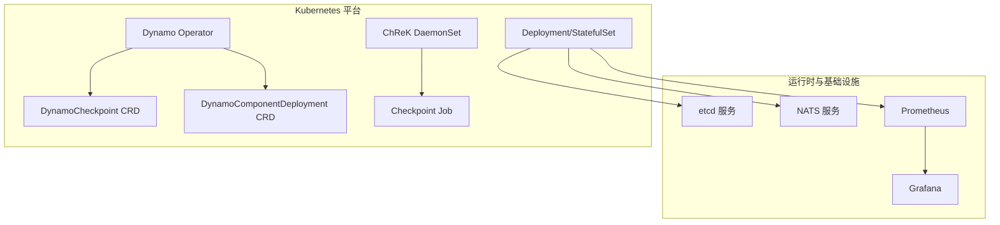
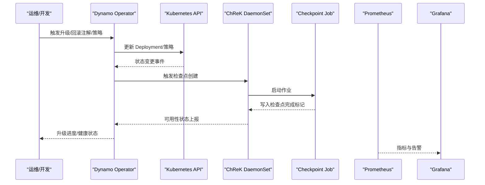
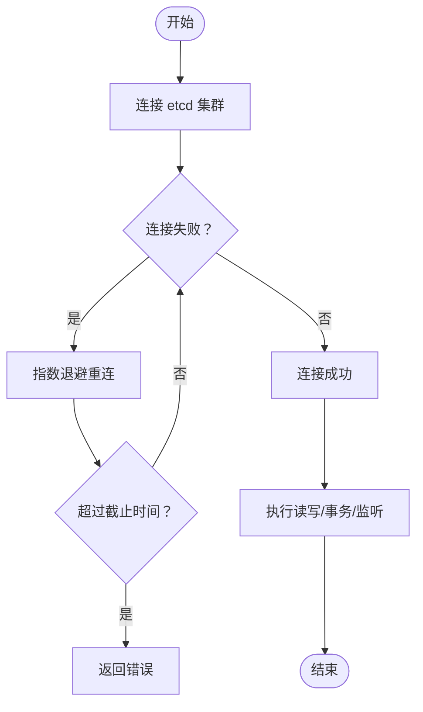
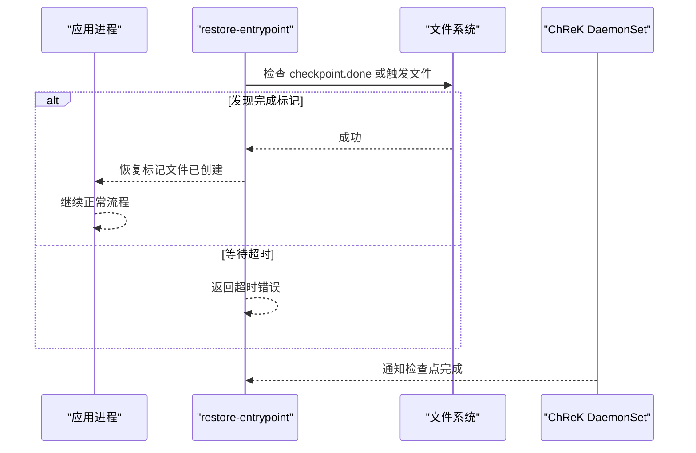
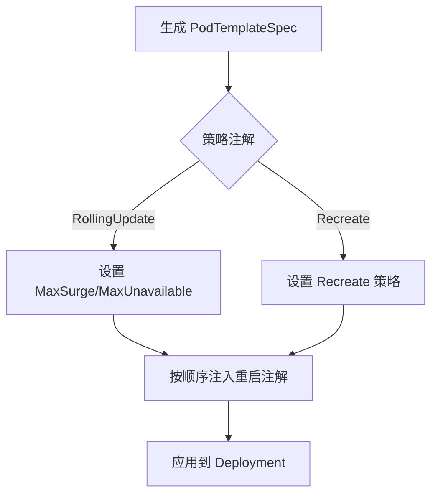
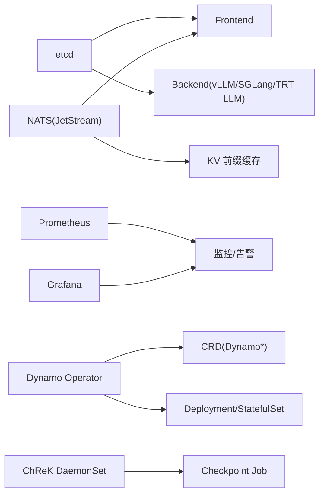
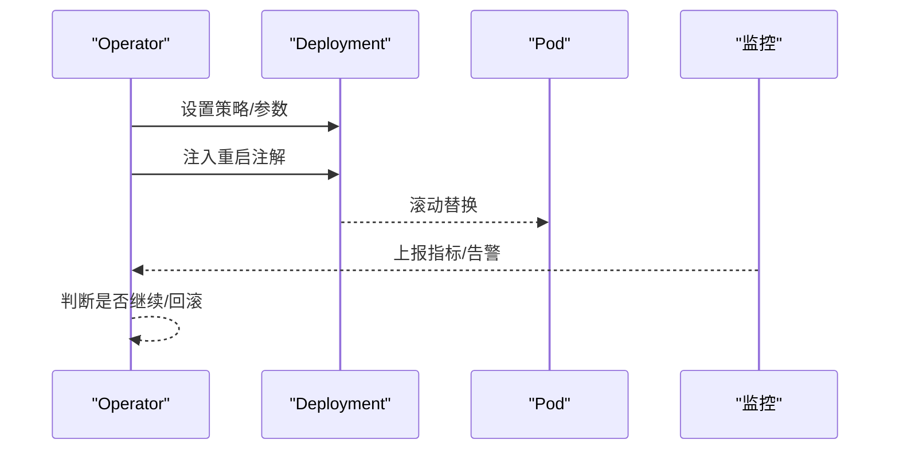

# 升级与备份

<cite>
**本文引用的文件**   
- [README.md](file://README.md)
- [docker-compose.yml](file://deploy/docker-compose.yml)
- [etcd 客户端连接器](file://lib/runtime/src/transports/etcd/connector.rs)
- [etcd 存储实现](file://lib/runtime/src/storage/kv/etcd.rs)
- [系统健康监控](file://lib/runtime/src/system_health.rs)
- [Dynamo 检查点 CRD](file://deploy/helm/charts/crds/templates/nvidia.com_dynamocheckpoints.yaml)
- [Dynamo 组件部署 CRD](file://deploy/helm/charts/crds/templates/nvidia.com_dynamocomponentdeployments.yaml)
- [ChReK 恢复入口配置](file://deploy/chrek/pkg/restore/config.go)
- [ChReK 独立文档（含恢复流程）](file://docs/pages/kubernetes/chrek/standalone.md)
- [ChReK 恢复入口主程序](file://deploy/chrek/cmd/restore-entrypoint/main.go)
- [Dynamo 运行时图管理（重启顺序与注解）](file://deploy/operator/internal/dynamo/graph.go)
- [Dynamo 运行时图控制器（滚动更新与重建）](file://deploy/operator/internal/controller/dynamocomponentdeployment_controller.go)
- [Dynamo 运行时图控制器（部署策略枚举）](file://deploy/operator/internal/common/schemas.go)
- [预部署检查脚本](file://deploy/pre-deployment/pre-deployment-check.sh)
- [Prometheus 监控配置](file://deploy/observability/prometheus.yml)
- [Grafana Dynamo 仪表盘](file://deploy/observability/grafana_dashboards/dynamo.json)
- [Dynamo 观测性总览](file://deploy/observability/README.md)
</cite>

## 目录
1. [简介](#简介)
2. [项目结构](#项目结构)
3. [核心组件](#核心组件)
4. [架构总览](#架构总览)
5. [详细组件分析](#详细组件分析)
6. [依赖关系分析](#依赖关系分析)
7. [性能考量](#性能考量)
8. [故障排查指南](#故障排查指南)
9. [结论](#结论)
10. [附录](#附录)

## 简介
本指南面向生产环境的Dynamo平台，围绕“升级与备份”主题，提供从准备、执行到验证的全流程操作手册。内容涵盖：
- 版本升级流程与兼容性检查
- 回滚机制与风险控制
- 数据备份与恢复最佳实践（etcd 快照、持久化存储、配置导出）
- 滚动升级、蓝绿部署、金丝雀发布策略
- 升级前后监控与验证
- 自动化脚本与批量操作建议
- 灾难恢复与业务连续性保障

## 项目结构
Dynamo在升级与备份方面涉及的关键目录与文件：
- 运行时与基础设施：etcd、NATS、Prometheus/Grafana
- Kubernetes 资源：Operator、CRD、DaemonSet/Job（ChReK）、Deployment
- 部署与运维工具：docker-compose、预部署检查脚本、观测性配置

**图表来源**
- [docker-compose.yml](file://deploy/docker-compose.yml#L1-L36)
- [Dynamo 检查点 CRD](file://deploy/helm/charts/crds/templates/nvidia.com_dynamocheckpoints.yaml#L1-L120)
- [Dynamo 组件部署 CRD](file://deploy/helm/charts/crds/templates/nvidia.com_dynamocomponentdeployments.yaml#L1-L120)
- [Prometheus 监控配置](file://deploy/observability/prometheus.yml#L1-L63)
- [Grafana Dynamo 仪表盘](file://deploy/observability/grafana_dashboards/dynamo.json#L1-L120)

**章节来源**
- [README.md](file://README.md#L362-L381)
- [docker-compose.yml](file://deploy/docker-compose.yml#L1-L36)

## 核心组件
- etcd：用于服务发现与键值存储，支持快照与集群重连
- NATS：消息总线，支持JetStream，用于KV前缀缓存协调
- Prometheus/Grafana：指标采集与可视化，支撑升级过程中的可观测性
- Dynamo Operator：管理Dynamo组件部署、重启策略与滚动更新
- ChReK：容器检查点与恢复能力，支撑快速冷启动与无损迁移
- 预部署检查脚本：确保集群具备默认StorageClass、GPU节点与GPU Operator

**章节来源**
- [etcd 客户端连接器](file://lib/runtime/src/transports/etcd/connector.rs#L40-L74)
- [etcd 存储实现](file://lib/runtime/src/storage/kv/etcd.rs#L1-L194)
- [Dynamo 检查点 CRD](file://deploy/helm/charts/crds/templates/nvidia.com_dynamocheckpoints.yaml#L1-L120)
- [Dynamo 组件部署 CRD](file://deploy/helm/charts/crds/templates/nvidia.com_dynamocomponentdeployments.yaml#L1-L120)
- [ChReK 恢复入口配置](file://deploy/chrek/pkg/restore/config.go#L140-L224)
- [预部署检查脚本](file://deploy/pre-deployment/pre-deployment-check.sh#L1-L284)

## 架构总览
下图展示升级与备份在系统中的位置与交互：

**图表来源**
- [Dynamo 运行时图控制器（滚动更新与重建）](file://deploy/operator/internal/controller/dynamocomponentdeployment_controller.go#L1092-L1131)
- [Dynamo 运行时图管理（重启顺序与注解）](file://deploy/operator/internal/dynamo/graph.go#L108-L305)
- [ChReK 恢复入口配置](file://deploy/chrek/pkg/restore/config.go#L140-L224)
- [Prometheus 监控配置](file://deploy/observability/prometheus.yml#L1-L63)

## 详细组件分析

### etcd：快照与高可用
- 连接与重连：支持带截止时间的指数退避重连，避免雪崩效应
- 存储接口：提供桶（路径前缀）与键值读写、事务与监听
- 建议：升级前对etcd进行快照；升级后校验集群健康与数据一致性

**图表来源**
- [etcd 客户端连接器](file://lib/runtime/src/transports/etcd/connector.rs#L40-L74)
- [etcd 存储实现](file://lib/runtime/src/storage/kv/etcd.rs#L26-L194)

**章节来源**
- [etcd 客户端连接器](file://lib/runtime/src/transports/etcd/connector.rs#L40-L74)
- [etcd 存储实现](file://lib/runtime/src/storage/kv/etcd.rs#L1-L194)

### ChReK：检查点与恢复
- 恢复检测：支持通过检查点完成标记或触发文件判断是否恢复
- 等待策略：可设置等待超时，避免无限期阻塞
- 应用要求：应用需实现检查点模式下的加载、就绪信号与恢复标记

**图表来源**
- [ChReK 恢复入口配置](file://deploy/chrek/pkg/restore/config.go#L140-L224)
- [ChReK 独立文档（含恢复流程）](file://docs/pages/kubernetes/chrek/standalone.md#L147-L364)
- [ChReK 恢复入口主程序](file://deploy/chrek/cmd/restore-entrypoint/main.go#L93-L107)

**章节来源**
- [ChReK 恢复入口配置](file://deploy/chrek/pkg/restore/config.go#L140-L224)
- [ChReK 独立文档（含恢复流程）](file://docs/pages/kubernetes/chrek/standalone.md#L147-L364)
- [ChReK 恢复入口主程序](file://deploy/chrek/cmd/restore-entrypoint/main.go#L93-L107)

### Operator：滚动升级与重建
- 部署策略：支持 RollingUpdate 与 Recreate，可通过注解覆盖
- 滚动参数：MaxSurge/MaxUnavailable 动态计算，保证升级期间的可用性
- 重启注解：按服务顺序注入重启注解，避免并发滚动引发抖动

**图表来源**
- [Dynamo 运行时图控制器（滚动更新与重建）](file://deploy/operator/internal/controller/dynamocomponentdeployment_controller.go#L1092-L1131)
- [Dynamo 运行时图控制器（部署策略枚举）](file://deploy/operator/internal/common/schemas.go#L20-L25)
- [Dynamo 运行时图管理（重启顺序与注解）](file://deploy/operator/internal/dynamo/graph.go#L108-L305)

**章节来源**
- [Dynamo 运行时图控制器（滚动更新与重建）](file://deploy/operator/internal/controller/dynamocomponentdeployment_controller.go#L1092-L1131)
- [Dynamo 运行时图控制器（部署策略枚举）](file://deploy/operator/internal/common/schemas.go#L20-L25)
- [Dynamo 运行时图管理（重启顺序与注解）](file://deploy/operator/internal/dynamo/graph.go#L108-L305)

### 观测性：监控与告警
- Prometheus 抓取：前端、后端、etcd、NATS、DCGM等
- Grafana 仪表盘：请求速率、首Token耗时、GPU利用率等
- 建议：升级前后对比关键指标，识别异常波动

**章节来源**
- [Prometheus 监控配置](file://deploy/observability/prometheus.yml#L1-L63)
- [Grafana Dynamo 仪表盘](file://deploy/observability/grafana_dashboards/dynamo.json#L1-L120)
- [Dynamo 观测性总览](file://deploy/observability/README.md#L1-L4)

## 依赖关系分析
- etcd/NATS 与各组件的耦合度较高，升级时应优先保证其可用性
- Operator 与 CRD 的版本需匹配，避免升级过程中出现API不兼容
- ChReK 依赖于宿主机文件系统与容器运行时，升级前需确认镜像与二进制兼容

**图表来源**
- [docker-compose.yml](file://deploy/docker-compose.yml#L1-L36)
- [Dynamo 检查点 CRD](file://deploy/helm/charts/crds/templates/nvidia.com_dynamocheckpoints.yaml#L1-L120)
- [Dynamo 组件部署 CRD](file://deploy/helm/charts/crds/templates/nvidia.com_dynamocomponentdeployments.yaml#L1-L120)
- [Prometheus 监控配置](file://deploy/observability/prometheus.yml#L1-L63)

**章节来源**
- [docker-compose.yml](file://deploy/docker-compose.yml#L1-L36)
- [Dynamo 检查点 CRD](file://deploy/helm/charts/crds/templates/nvidia.com_dynamocheckpoints.yaml#L1-L120)
- [Dynamo 组件部署 CRD](file://deploy/helm/charts/crds/templates/nvidia.com_dynamocomponentdeployments.yaml#L1-L120)
- [Prometheus 监控配置](file://deploy/observability/prometheus.yml#L1-L63)

## 性能考量
- 滚动升级期间，MaxSurge/MaxUnavailable 参数直接影响升级吞吐与可用性
- etcd 集群规模与网络延迟会影响重连与快照性能
- ChReK 恢复速度取决于检查点大小与磁盘IO，建议使用高性能持久化卷
- 监控抓取间隔与目标数量会影响Prometheus负载，升级时可临时降低抓取频率

[本节为通用指导，无需特定文件引用]

## 故障排查指南
- etcd 连接失败
  - 现象：重连超时、读写失败
  - 排查：检查 etcd 集群状态、网络连通性、证书与权限
  - 参考：连接器的重连逻辑与错误上下文
- ChReK 恢复未生效
  - 现象：等待 checkpoint 超时、checkpoint.done 不存在
  - 排查：确认触发文件/完成标记存在、应用已写入就绪信号
  - 参考：恢复入口配置与独立文档
- 升级卡顿
  - 现象：Deployment 无法滚动、Pod 无法替换
  - 排查：检查策略注解、重启注解、资源配额与节点亲和
  - 参考：控制器策略与图管理逻辑
- 观测性缺失
  - 现象：Grafana 无数据或Prometheus抓取失败
  - 排查：核对抓取配置、目标可达性、端口映射

**章节来源**
- [etcd 客户端连接器](file://lib/runtime/src/transports/etcd/connector.rs#L40-L74)
- [ChReK 恢复入口配置](file://deploy/chrek/pkg/restore/config.go#L140-L224)
- [ChReK 独立文档（含恢复流程）](file://docs/pages/kubernetes/chrek/standalone.md#L147-L364)
- [Dynamo 运行时图控制器（滚动更新与重建）](file://deploy/operator/internal/controller/dynamocomponentdeployment_controller.go#L1092-L1131)
- [Dynamo 运行时图管理（重启顺序与注解）](file://deploy/operator/internal/dynamo/graph.go#L108-L305)
- [Prometheus 监控配置](file://deploy/observability/prometheus.yml#L1-L63)

## 结论
通过结合 etcd 快照、ChReK 检查点与 Operator 的滚动/重建策略，并辅以完善的监控与预部署检查，Dynamo可在升级过程中实现高可靠与低风险。建议将“备份—升级—验证—回滚”的闭环纳入标准流程，并在灰度阶段充分验证。

[本节为总结性内容，无需特定文件引用]

## 附录

### 升级前准备清单
- 预部署检查：kubectl 可达、默认 StorageClass、GPU 节点、GPU Operator
- etcd 备份：执行集群快照，记录当前版本与Revision
- 配置导出：导出 CRD、Deployment、Service、PVC 等清单
- 验证环境：在测试集群演练升级流程与回滚

**章节来源**
- [预部署检查脚本](file://deploy/pre-deployment/pre-deployment-check.sh#L1-L284)
- [README.md](file://README.md#L362-L381)

### 升级流程（滚动升级）
- 步骤
  - 设置注解：选择 RollingUpdate 或 Recreate
  - 计算参数：根据副本数动态设置 MaxSurge/MaxUnavailable
  - 注入重启注解：按顺序对服务注入重启时间戳
  - 观察：Prometheus/Grafana 监控关键指标
  - 验证：健康检查、端到端请求
- 回滚：移除注解或回退到上一版本镜像

**图表来源**
- [Dynamo 运行时图控制器（滚动更新与重建）](file://deploy/operator/internal/controller/dynamocomponentdeployment_controller.go#L1092-L1131)
- [Dynamo 运行时图管理（重启顺序与注解）](file://deploy/operator/internal/dynamo/graph.go#L108-L305)
- [Prometheus 监控配置](file://deploy/observability/prometheus.yml#L1-L63)

**章节来源**
- [Dynamo 运行时图控制器（滚动更新与重建）](file://deploy/operator/internal/controller/dynamocomponentdeployment_controller.go#L1092-L1131)
- [Dynamo 运行时图管理（重启顺序与注解）](file://deploy/operator/internal/dynamo/graph.go#L108-L305)
- [Prometheus 监控配置](file://deploy/observability/prometheus.yml#L1-L63)

### 备份与恢复最佳实践
- etcd 快照
  - 升级前：执行快照并校验完整性
  - 升级后：比对Revision变化，确认数据一致
- 持久化存储
  - 使用默认 StorageClass 提供 PVC，升级前后保持挂载不变
  - 对重要数据定期做快照或复制
- 配置导出
  - 导出 CRD、Deployment、Service、PVC 等清单，便于回滚与审计
- 恢复演练
  - 使用 ChReK 检查点进行冷启动恢复演练，验证数据与状态一致性

**章节来源**
- [Dynamo 检查点 CRD](file://deploy/helm/charts/crds/templates/nvidia.com_dynamocheckpoints.yaml#L1-L120)
- [Dynamo 组件部署 CRD](file://deploy/helm/charts/crds/templates/nvidia.com_dynamocomponentdeployments.yaml#L1-L120)
- [ChReK 恢复入口配置](file://deploy/chrek/pkg/restore/config.go#L140-L224)
- [预部署检查脚本](file://deploy/pre-deployment/pre-deployment-check.sh#L1-L284)

### 蓝绿与金丝雀发布
- 蓝绿
  - 新版本部署至独立命名空间或服务名，流量切换后回收旧版本
  - 适合需要完全隔离验证的场景
- 金丝雀
  - 将少量流量导入新版本，逐步扩大比例，结合Prometheus/Grafana观察指标
  - 适合渐进式验证与快速回滚

[本小节为概念性说明，无需特定文件引用]

### 自动化与批量操作
- 使用 Helm/Kustomize 批量部署/回滚
- 编写升级脚本：预检查、快照、升级、验证、回滚
- 使用 CI/CD 在测试环境先行演练

[本小节为通用指导，无需特定文件引用]

### 灾难恢复与业务连续性
- 多副本 etcd 集群与异地快照
- ChReK 检查点缩短冷启动时间，提升弹性
- 健康检查与自动告警，配合灰度与回滚机制

**章节来源**
- [系统健康监控](file://lib/runtime/src/system_health.rs#L1-L58)
- [Prometheus 监控配置](file://deploy/observability/prometheus.yml#L1-L63)
- [Grafana Dynamo 仪表盘](file://deploy/observability/grafana_dashboards/dynamo.json#L1-L120)