# 平台安装与配置

<cite>
**本文引用的文件**
- [deploy/helm/README.md](file://deploy/helm/README.md)
- [deploy/helm/charts/platform/README.md](file://deploy/helm/charts/platform/README.md)
- [deploy/helm/charts/platform/values.yaml](file://deploy/helm/charts/platform/values.yaml)
- [deploy/helm/charts/platform/components/operator/values.yaml](file://deploy/helm/charts/platform/components/operator/values.yaml)
- [deploy/pre-deployment/pre-deployment-check.sh](file://deploy/pre-deployment/pre-deployment-check.sh)
- [deploy/sanity_check.py](file://deploy/sanity_check.py)
- [examples/deployments/EKS/Deploy_Dynamo_Kubernetes_Platform.md](file://examples/deployments/EKS/Deploy_Dynamo_Kubernetes_Platform.md)
- [deploy/utils/gpu_inventory.py](file://deploy/utils/gpu_inventory.py)
- [deploy/operator/api/v1alpha1/common.go](file://deploy/operator/api/v1alpha1/common.go)
- [deploy/operator/internal/webhook/validation/shared.go](file://deploy/operator/internal/webhook/validation/shared.go)
- [deploy/operator/internal/controller_common/resource.go](file://deploy/operator/internal/controller_common/resource.go)
- [deploy/operator/internal/controller_common/resource_test.go](file://deploy/operator/internal/controller_common/resource_test.go)
</cite>

## 目录
1. [简介](#简介)
2. [项目结构](#项目结构)
3. [核心组件](#核心组件)
4. [架构总览](#架构总览)
5. [详细组件分析](#详细组件分析)
6. [依赖关系分析](#依赖关系分析)
7. [性能考虑](#性能考虑)
8. [故障排查指南](#故障排查指南)
9. [结论](#结论)
10. [附录](#附录)

## 简介
本技术文档面向Dynamo平台在Kubernetes上的安装与配置，覆盖从前置条件检查、依赖组件安装（NATS、etcd、Grove、Kai Scheduler），到Helm图表配置、values.yaml参数设置与自定义方法。同时提供GPU设备插件配置、网络策略与存储类配置的关键步骤，以及安装验证、健康检查与故障排查指南，并给出开发、测试、生产三类环境的最佳实践与配置模板建议。

## 项目结构
Dynamo平台的安装主要通过Helm图表完成，核心目录与文件如下：
- Helm图表：deploy/helm/charts/platform 提供完整平台安装；deploy/helm/charts/crds 安装CRD。
- 预部署检查脚本：deploy/pre-deployment/pre-deployment-check.sh 检查kubectl连通性、默认StorageClass、GPU节点与GPU Operator状态。
- 运行时诊断工具：deploy/sanity_check.py 收集系统信息、容器上下文、框架与运行时组件状态。
- 示例部署：examples/deployments/EKS/Deploy_Dynamo_Kubernetes_Platform.md 展示从源码构建镜像并安装平台的端到端流程。
- GPU资源模型与校验：deploy/operator/api/v1alpha1/common.go、deploy/operator/internal/webhook/validation/shared.go、deploy/operator/internal/controller_common/resource.go 等定义资源请求/限制、GPU类型与共享内存等规范。

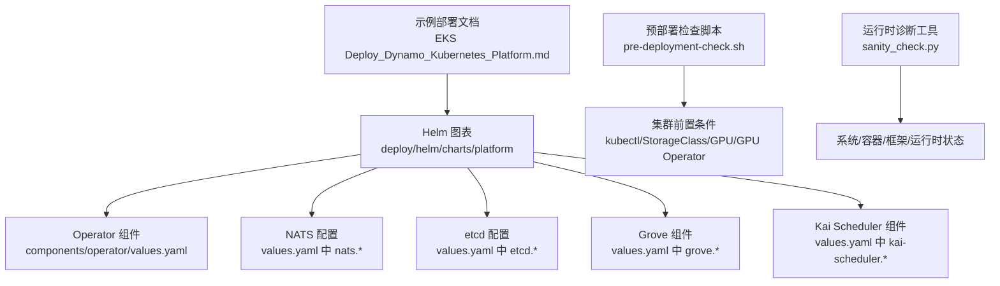

**图示来源**
- [deploy/helm/charts/platform/README.md](file://deploy/helm/charts/platform/README.md#L24-L33)
- [deploy/helm/charts/platform/values.yaml](file://deploy/helm/charts/platform/values.yaml#L1-L778)
- [deploy/helm/charts/platform/components/operator/values.yaml](file://deploy/helm/charts/platform/components/operator/values.yaml#L1-L283)
- [deploy/pre-deployment/pre-deployment-check.sh](file://deploy/pre-deployment/pre-deployment-check.sh#L1-L284)
- [deploy/sanity_check.py](file://deploy/sanity_check.py#L1-L800)
- [examples/deployments/EKS/Deploy_Dynamo_Kubernetes_Platform.md](file://examples/deployments/EKS/Deploy_Dynamo_Kubernetes_Platform.md#L1-L97)

**章节来源**
- [deploy/helm/README.md](file://deploy/helm/README.md#L18-L23)
- [deploy/helm/charts/platform/README.md](file://deploy/helm/charts/platform/README.md#L24-L33)

## 核心组件
- Dynamo Operator：管理Dynamo资源生命周期、Webhook证书、MPI Run密钥生成、镜像拉取密钥注入等。
- NATS：高吞吐消息系统，支持JetStream持久化与监控端口。
- etcd：分布式键值存储，用于Operator状态管理。
- Grove：多节点推理编排（可选）。
- Kai Scheduler：智能工作负载调度（可选）。

这些组件由Helm图表统一安装与配置，values.yaml中提供了详尽的参数项与默认值。

**章节来源**
- [deploy/helm/charts/platform/README.md](file://deploy/helm/charts/platform/README.md#L26-L33)
- [deploy/helm/charts/platform/values.yaml](file://deploy/helm/charts/platform/values.yaml#L19-L100)
- [deploy/helm/charts/platform/components/operator/values.yaml](file://deploy/helm/charts/platform/components/operator/values.yaml#L19-L148)

## 架构总览
下图展示Dynamo平台在Kubernetes中的组件交互与数据流：

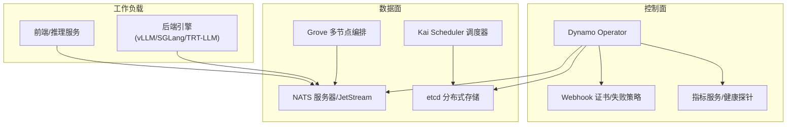

**图示来源**
- [deploy/helm/charts/platform/values.yaml](file://deploy/helm/charts/platform/values.yaml#L280-L483)
- [deploy/helm/charts/platform/values.yaml](file://deploy/helm/charts/platform/values.yaml#L49-L100)

## 详细组件分析

### 1) 前置条件检查与集群准备
- kubectl连通性：确保kubectl可用且能连接集群。
- 默认StorageClass：要求存在默认StorageClass以支持持久卷动态供应。
- GPU节点与GPU Operator：检测带nvidia.com/gpu.present标签的节点，确认GPU Operator已安装并处于Running状态。

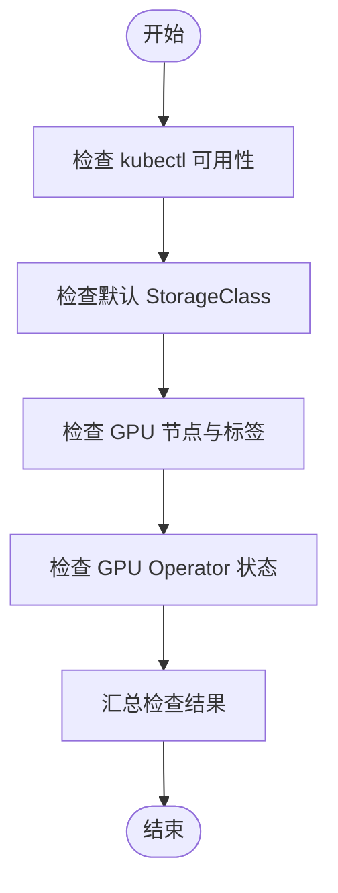

**图示来源**
- [deploy/pre-deployment/pre-deployment-check.sh](file://deploy/pre-deployment/pre-deployment-check.sh#L41-L177)

**章节来源**
- [deploy/pre-deployment/pre-deployment-check.sh](file://deploy/pre-deployment/pre-deployment-check.sh#L9-L177)

### 2) 运行时诊断与健康检查
- sanity_check.py提供系统/容器/框架/运行时组件的树状诊断输出，支持详尽模式收集CUDA/NVIDIA信息、ulimits、HuggingFace缓存等。
- 建议在安装前后运行该工具进行对比，定位潜在问题。

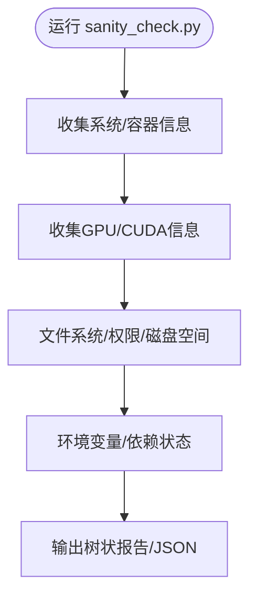

**图示来源**
- [deploy/sanity_check.py](file://deploy/sanity_check.py#L5-L149)

**章节来源**
- [deploy/sanity_check.py](file://deploy/sanity_check.py#L1-L800)

### 3) Helm平台图表安装与配置
- 平台图表提供一键安装Dynamo Operator、NATS、etcd、Grove、Kai Scheduler的能力。
- values.yaml中包含各子组件的启用开关、镜像仓库与标签、资源请求/限制、Webhook证书、Ingress/Istio集成、MPI Run密钥等。

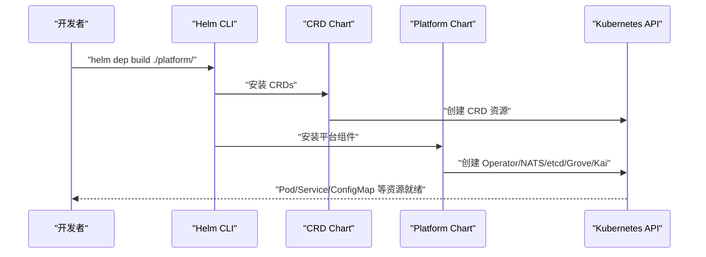

**图示来源**
- [examples/deployments/EKS/Deploy_Dynamo_Kubernetes_Platform.md](file://examples/deployments/EKS/Deploy_Dynamo_Kubernetes_Platform.md#L57-L85)
- [deploy/helm/README.md](file://deploy/helm/README.md#L18-L23)

**章节来源**
- [deploy/helm/charts/platform/README.md](file://deploy/helm/charts/platform/README.md#L34-L94)
- [deploy/helm/charts/platform/values.yaml](file://deploy/helm/charts/platform/values.yaml#L1-L778)
- [deploy/helm/charts/platform/components/operator/values.yaml](file://deploy/helm/charts/platform/components/operator/values.yaml#L1-L283)
- [examples/deployments/EKS/Deploy_Dynamo_Kubernetes_Platform.md](file://examples/deployments/EKS/Deploy_Dynamo_Kubernetes_Platform.md#L1-L97)

### 4) NATS配置要点
- JetStream持久化：启用文件存储并配置PVC大小与存储类。
- 监控与TLS：可开启HTTP监控端口与TLS加密。
- 最大负载与端口：根据提示词长度与上下文调整max_payload，按需开启monitor与profiling端口。

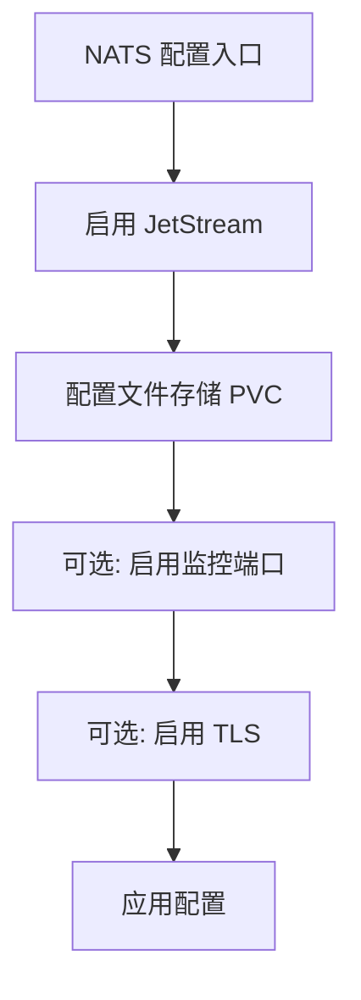

**图示来源**
- [deploy/helm/charts/platform/values.yaml](file://deploy/helm/charts/platform/values.yaml#L354-L483)

**章节来源**
- [deploy/helm/charts/platform/values.yaml](file://deploy/helm/charts/platform/values.yaml#L335-L483)

### 5) etcd配置要点
- 单节点/高可用：replicaCount=1用于单节点，3+用于HA；可启用PDB与认证。
- 存储：持久化存储建议开启，容量按数据量与副本数评估。

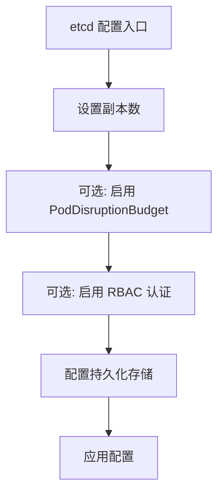

**图示来源**
- [deploy/helm/charts/platform/values.yaml](file://deploy/helm/charts/platform/values.yaml#L280-L334)

**章节来源**
- [deploy/helm/charts/platform/values.yaml](file://deploy/helm/charts/platform/values.yaml#L280-L334)

### 6) Grove与Kai Scheduler
- Grove：多节点推理编排，可选启用，支持容忍与亲和配置。
- Kai Scheduler：智能调度，可选启用，支持全局容忍与亲和。

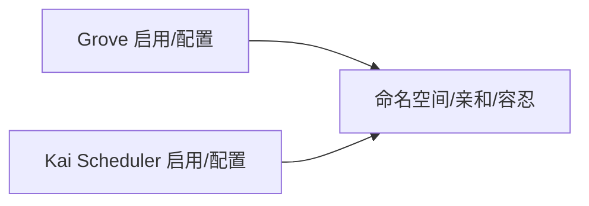

**图示来源**
- [deploy/helm/charts/platform/values.yaml](file://deploy/helm/charts/platform/values.yaml#L259-L278)

**章节来源**
- [deploy/helm/charts/platform/values.yaml](file://deploy/helm/charts/platform/values.yaml#L259-L278)

### 7) GPU设备插件与资源模型
- GPU资源类型：默认使用nvidia.com/gpu，也可指定自定义GPU类型（如gpu.intel.com/xe）。
- 共享内存：可通过SharedMemorySpec禁用或设置大小。
- 卷挂载与缓存：VolumeMount支持作为编译缓存或指定挂载点。
- GPU库存采集：提供工具采集节点GPU数量、型号与显存，并可基于nvidia-smi补充缺失信息。

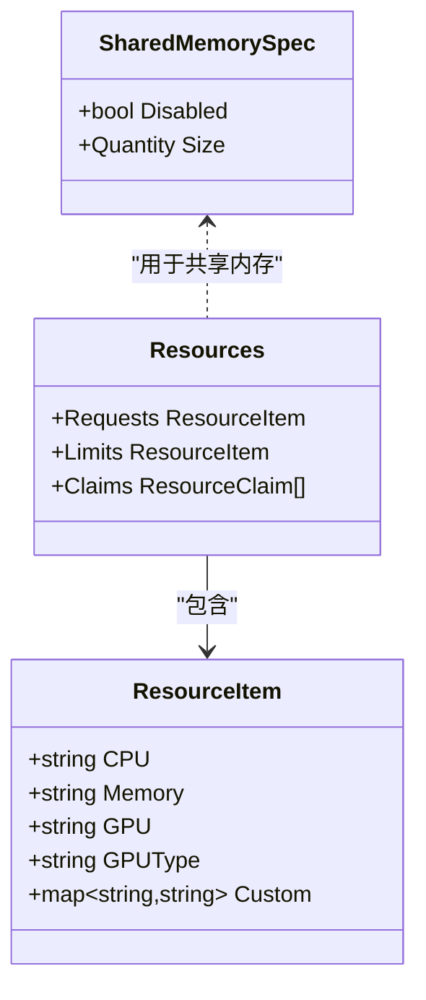

**图示来源**
- [deploy/operator/api/v1alpha1/common.go](file://deploy/operator/api/v1alpha1/common.go#L72-L101)

**章节来源**
- [deploy/operator/api/v1alpha1/common.go](file://deploy/operator/api/v1alpha1/common.go#L72-L101)
- [deploy/operator/internal/webhook/validation/shared.go](file://deploy/operator/internal/webhook/validation/shared.go#L131-L164)
- [deploy/utils/gpu_inventory.py](file://deploy/utils/gpu_inventory.py#L1-L490)

### 8) 网络策略与Ingress/Istio集成
- Ingress：可启用并配置className与TLS密钥名称。
- Istio：可启用并配置Gateway名称。
- Webhook失败策略：可配置为Fail或Ignore，影响不可用时的准入控制行为。

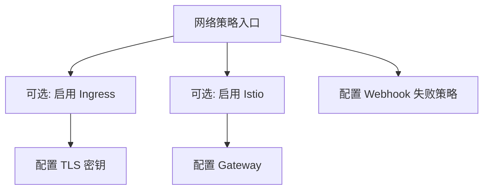

**图示来源**
- [deploy/helm/charts/platform/values.yaml](file://deploy/helm/charts/platform/values.yaml#L115-L136)
- [deploy/helm/charts/platform/values.yaml](file://deploy/helm/charts/platform/values.yaml#L151-L211)

**章节来源**
- [deploy/helm/charts/platform/values.yaml](file://deploy/helm/charts/platform/values.yaml#L115-L136)
- [deploy/helm/charts/platform/values.yaml](file://deploy/helm/charts/platform/values.yaml#L151-L211)

### 9) 存储类与持久化
- 默认StorageClass：预部署检查要求存在默认StorageClass。
- etcd与NATS JetStream：分别配置持久化存储与PVC大小。
- Grove/Kai：根据需要配置存储后端（PVC/S3/OCI）。

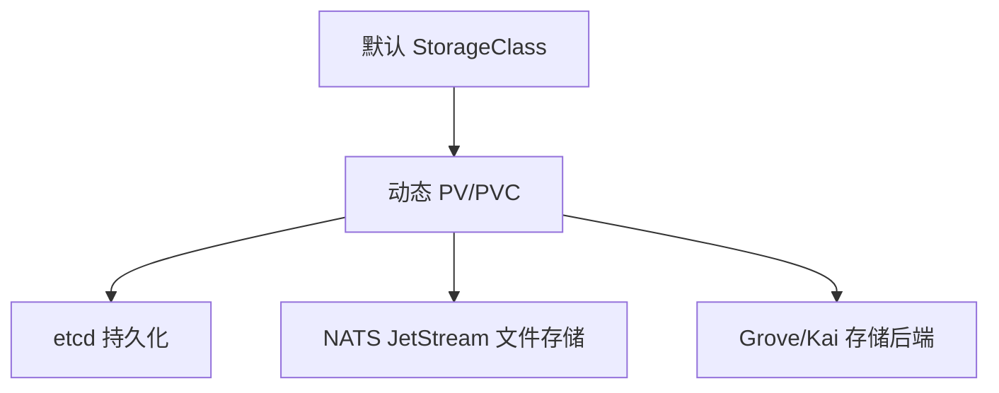

**图示来源**
- [deploy/pre-deployment/pre-deployment-check.sh](file://deploy/pre-deployment/pre-deployment-check.sh#L61-L120)
- [deploy/helm/charts/platform/values.yaml](file://deploy/helm/charts/platform/values.yaml#L290-L334)
- [deploy/helm/charts/platform/values.yaml](file://deploy/helm/charts/platform/values.yaml#L368-L383)

**章节来源**
- [deploy/pre-deployment/pre-deployment-check.sh](file://deploy/pre-deployment/pre-deployment-check.sh#L61-L120)
- [deploy/helm/charts/platform/values.yaml](file://deploy/helm/charts/platform/values.yaml#L290-L334)
- [deploy/helm/charts/platform/values.yaml](file://deploy/helm/charts/platform/values.yaml#L368-L383)

### 10) 安装验证与健康检查
- 验证命令：参考示例文档中的kubectl get pods -A，确认Operator、etcd、NATS等组件处于Running状态。
- 健康探针：Operator控制器管理器暴露健康探针端口；Prometheus指标仅本地暴露以提升安全性。
- Webhook：证书自动生成或外部管理，失败策略可配置为Fail以保证严格校验。

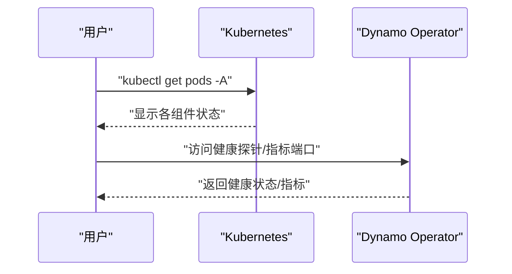

**图示来源**
- [examples/deployments/EKS/Deploy_Dynamo_Kubernetes_Platform.md](file://examples/deployments/EKS/Deploy_Dynamo_Kubernetes_Platform.md#L87-L97)
- [deploy/helm/charts/platform/components/operator/values.yaml](file://deploy/helm/charts/platform/components/operator/values.yaml#L72-L94)

**章节来源**
- [examples/deployments/EKS/Deploy_Dynamo_Kubernetes_Platform.md](file://examples/deployments/EKS/Deploy_Dynamo_Kubernetes_Platform.md#L87-L97)
- [deploy/helm/charts/platform/components/operator/values.yaml](file://deploy/helm/charts/platform/components/operator/values.yaml#L72-L94)

## 依赖关系分析
- Helm图表依赖关系：platform依赖operator子图表、Bitnami etcd、NATS官方chart、Grove OCI仓库、Kai Scheduler OCI仓库。
- Operator与组件：Operator负责协调NATS/etcd/Grove/Kai生命周期；Webhook负责资源校验；Ingress/Istio负责外部路由。

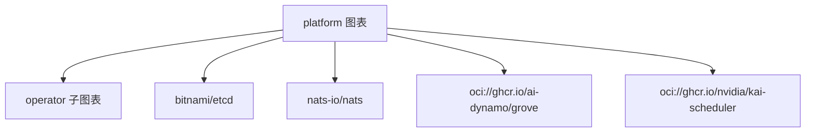

**图示来源**
- [deploy/helm/charts/platform/README.md](file://deploy/helm/charts/platform/README.md#L87-L94)

**章节来源**
- [deploy/helm/charts/platform/README.md](file://deploy/helm/charts/platform/README.md#L87-L94)

## 性能考虑
- NATS最大负载：根据提示词长度与上下文合理设置max_payload，避免消息过大导致丢弃。
- JetStream存储：单机场景可使用内存存储，生产建议使用文件存储并配置足够PVC容量。
- etcd副本与PDB：高可用部署建议3+副本并启用PDB，平衡可用性与一致性。
- Operator资源：为Operator分配足够的CPU/内存，避免在大规模集群上成为瓶颈。
- GPU调度：优先使用nvidia.com/gpu，必要时指定自定义GPU类型；结合节点亲和/容忍实现隔离与亲和。

[本节为通用指导，无需特定文件引用]

## 故障排查指南
- 集群前置条件失败：检查StorageClass是否唯一且有效；确认GPU节点标签与GPU Operator状态。
- NATS/etcd异常：查看对应Pod日志与事件，确认PVC绑定、JetStream存储路径与权限。
- Operator校验失败：检查Webhook证书生成/外部证书注入、失败策略与超时设置。
- 运行时诊断：使用sanity_check.py输出树状报告，定位系统/容器/框架/运行时问题。
- GPU相关：使用gpu_inventory.py采集节点GPU信息，必要时通过nvidia-smi补充缺失SKU/显存信息。

**章节来源**
- [deploy/pre-deployment/pre-deployment-check.sh](file://deploy/pre-deployment/pre-deployment-check.sh#L204-L236)
- [deploy/sanity_check.py](file://deploy/sanity_check.py#L1-L800)
- [deploy/utils/gpu_inventory.py](file://deploy/utils/gpu_inventory.py#L1-L490)

## 结论
通过Helm图表与完善的values.yaml配置，Dynamo平台可在Kubernetes上快速完成安装与配置。结合预部署检查、运行时诊断与严格的GPU/网络/存储策略，可显著提升部署成功率与运行稳定性。建议在开发、测试、生产三类环境中采用差异化配置模板，并遵循本文提供的最佳实践。

## 附录

### A. 不同环境配置模板与最佳实践
- 开发环境
  - Operator：启用Webhook失败策略为Fail，便于早期发现问题。
  - NATS：启用monitor端口便于调试，max_payload适度放宽。
  - etcd：单节点副本，关闭RBAC与PDB，简化部署。
  - Grove/Kai：默认关闭，按需启用。
- 测试环境
  - Operator：启用Webhook失败策略为Fail，开启Metrics本地暴露。
  - NATS：启用JetStream文件存储，配置较小PVC，保留monitor端口。
  - etcd：单节点副本，开启PDB，关闭RBAC。
- 生产环境
  - Operator：启用Webhook失败策略为Fail，启用cert-manager自动证书管理。
  - NATS：启用JetStream文件存储与TLS，配置较大PVC与监控端口。
  - etcd：3+副本，启用RBAC与PDB，持久化存储容量充足。
  - Grove/Kai：按需启用，配置亲和与容忍，确保跨节点高可用。

**章节来源**
- [deploy/helm/charts/platform/values.yaml](file://deploy/helm/charts/platform/values.yaml#L151-L211)
- [deploy/helm/charts/platform/values.yaml](file://deploy/helm/charts/platform/values.yaml#L280-L334)
- [deploy/helm/charts/platform/values.yaml](file://deploy/helm/charts/platform/values.yaml#L335-L483)

### B. 关键参数速查
- Operator
  - dynamo-operator.enabled：是否启用Operator
  - dynamo-operator.controllerManager.manager.image.*：镜像仓库/标签/拉取策略
  - dynamo-operator.webhook.failurePolicy：Webhook失败策略
- NATS
  - nats.enabled：是否启用NATS
  - nats.config.jetstream.fileStore.pvc.size：JetStream PVC大小
  - nats.config.merge.max_payload：最大消息负载
- etcd
  - etcd.enabled：是否启用etcd
  - etcd.replicaCount：副本数
  - etcd.persistence.enabled：是否启用持久化
- Grove/Kai
  - grove.enabled：是否启用Grove
  - kai-scheduler.enabled：是否启用Kai Scheduler
- 网络与路由
  - dynamo.ingress.enabled：是否启用Ingress
  - dynamo.istio.enabled：是否启用Istio
  - dynamo.metrics.prometheusEndpoint：Prometheus指标端点

**章节来源**
- [deploy/helm/charts/platform/values.yaml](file://deploy/helm/charts/platform/values.yaml#L19-L100)
- [deploy/helm/charts/platform/values.yaml](file://deploy/helm/charts/platform/values.yaml#L280-L483)
- [deploy/helm/charts/platform/values.yaml](file://deploy/helm/charts/platform/values.yaml#L115-L136)