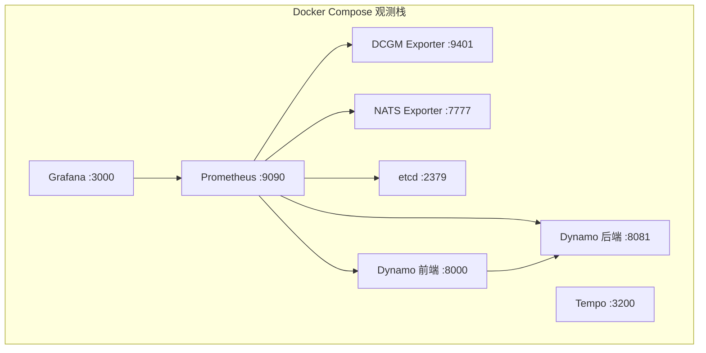
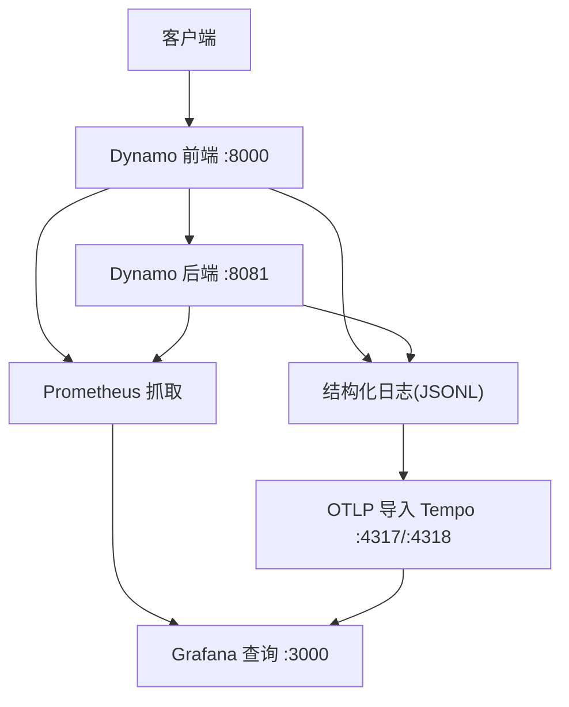
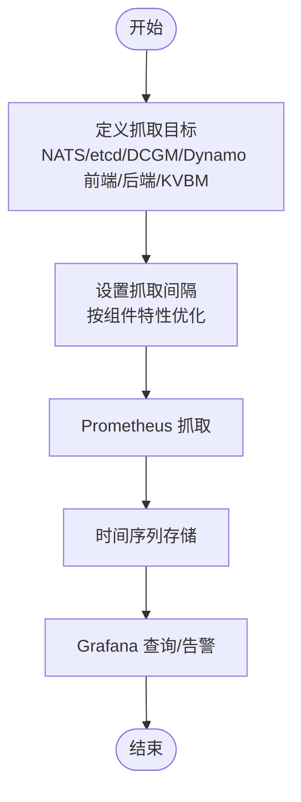
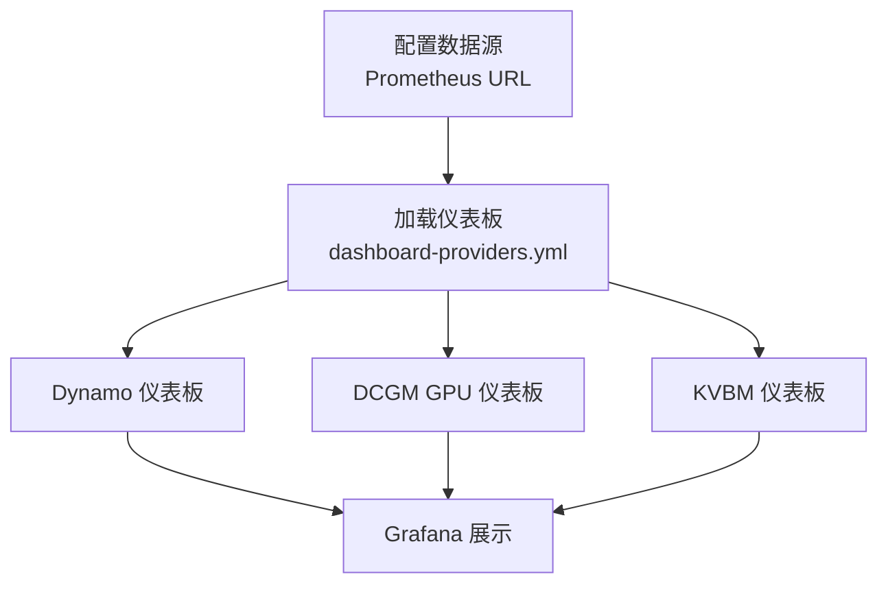
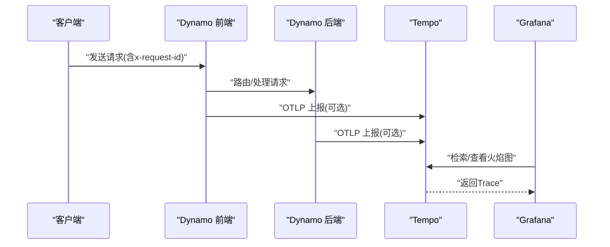
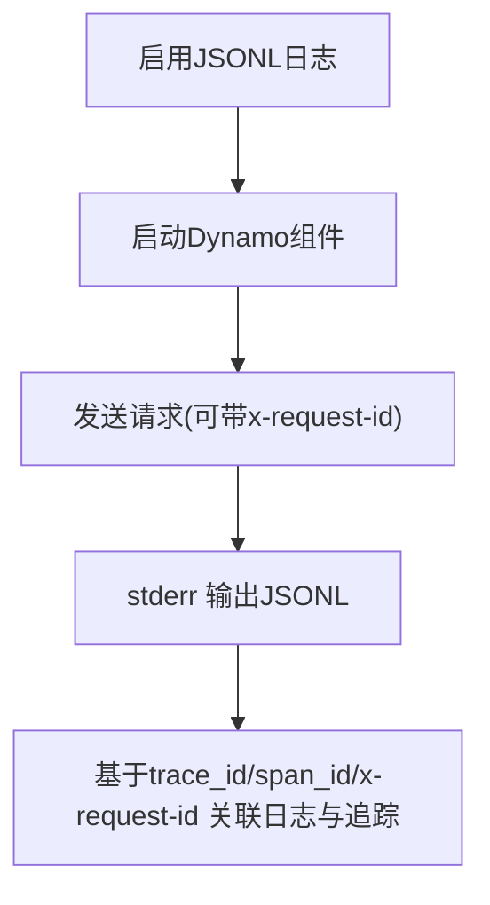
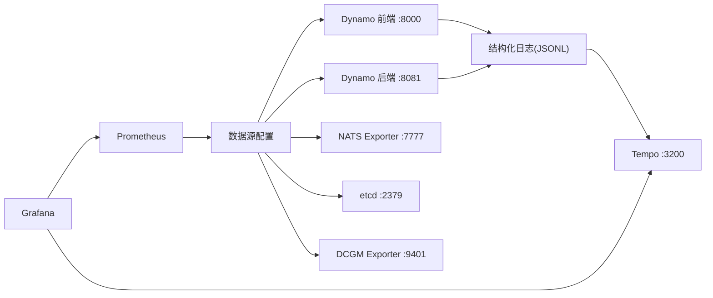

# 监控与日志

<cite>
**本文引用的文件**
- [deploy/observability/prometheus.yml](file://deploy/observability/prometheus.yml)
- [deploy/observability/grafana-datasources.yml](file://deploy/observability/grafana-datasources.yml)
- [deploy/observability/tempo.yaml](file://deploy/observability/tempo.yaml)
- [deploy/observability/tempo-datasource.yml](file://deploy/observability/tempo-datasource.yml)
- [deploy/observability/grafana_dashboards/dashboard-providers.yml](file://deploy/observability/grafana_dashboards/dashboard-providers.yml)
- [deploy/observability/grafana_dashboards/dynamo.json](file://deploy/observability/grafana_dashboards/dynamo.json)
- [deploy/observability/grafana_dashboards/kvbm.json](file://deploy/observability/grafana_dashboards/kvbm.json)
- [deploy/observability/README.md](file://deploy/observability/README.md)
- [docs/pages/observability/README.md](file://docs/pages/observability/README.md)
- [docs/pages/observability/metrics.md](file://docs/pages/observability/metrics.md)
- [docs/pages/observability/tracing.md](file://docs/pages/observability/tracing.md)
- [docs/pages/observability/logging.md](file://docs/pages/observability/logging.md)
</cite>

## 目录
1. [简介](#简介)
2. [项目结构](#项目结构)
3. [核心组件](#核心组件)
4. [架构总览](#架构总览)
5. [详细组件分析](#详细组件分析)
6. [依赖关系分析](#依赖关系分析)
7. [性能考量](#性能考量)
8. [故障排查指南](#故障排查指南)
9. [结论](#结论)
10. [附录](#附录)

## 简介
本指南面向Dynamo在单机与容器环境中的监控与日志体系，覆盖Prometheus指标采集、Grafana仪表板、Tempo链路追踪的部署与使用；解释Dynamo特有指标、健康检查、告警建议与性能基线；提供日志聚合、搜索与分析方法；并给出Kubernetes原生监控、应用级监控与基础设施监控的集成方案。同时说明监控数据的持久化、归档与备份策略，并提供故障诊断、性能分析与容量规划的方法。

## 项目结构
Dynamo的可观测性由两部分组成：
- 容器编排与观测栈：通过Docker Compose启动NATS、etcd、Prometheus、Grafana、Tempo及各类Exporter。
- 文档与仪表板：提供指标参考、Tracing与Logging配置说明，以及预置的Grafana仪表板。

图表来源
- [docs/pages/observability/README.md](file://docs/pages/observability/README.md#L72-L85)

章节来源
- [deploy/observability/README.md](file://deploy/observability/README.md#L1-L4)
- [docs/pages/observability/README.md](file://docs/pages/observability/README.md#L1-L100)

## 核心组件
- 指标采集（Prometheus）
  - 配置文件定义了对NATS Exporter、etcd、DCGM Exporter、Dynamo前端与后端的抓取任务，抓取间隔按组件特性设定。
- 可视化（Grafana）
  - 数据源指向Prometheus；仪表板提供Dynamo整体指标、GPU指标、KVBM指标等。
- 链路追踪（Tempo）
  - 接收OTLP gRPC/HTTP；存储本地磁盘；支持在Grafana Explore中检索与火焰图分析。
- 日志（结构化JSONL）
  - 支持trace_id/span_id字段，便于与Tracing关联；可选开启Span事件日志；支持自定义请求ID头进行跨系统关联。

章节来源
- [deploy/observability/prometheus.yml](file://deploy/observability/prometheus.yml#L20-L62)
- [deploy/observability/grafana-datasources.yml](file://deploy/observability/grafana-datasources.yml#L18-L24)
- [deploy/observability/tempo.yaml](file://deploy/observability/tempo.yaml#L1-L37)
- [deploy/observability/tempo-datasource.yml](file://deploy/observability/tempo-datasource.yml#L6-L28)
- [docs/pages/observability/logging.md](file://docs/pages/observability/logging.md#L1-L269)

## 架构总览
Dynamo的可观测性采用“指标+日志+追踪”三位一体的设计：
- 指标：Dynamo组件在各自系统端口暴露Prometheus格式指标；Prometheus周期抓取并存储；Grafana查询展示。
- 日志：Dynamo组件输出结构化JSONL日志，包含trace_id/span_id；可通过Grafana Loki或外部日志平台聚合；也可仅用日志进行短时调试。
- 追踪：Dynamo基于OpenTelemetry导出OTLP到Tempo；Grafana Explore检索与可视化火焰图。

图表来源
- [docs/pages/observability/README.md](file://docs/pages/observability/README.md#L72-L85)
- [docs/pages/observability/tracing.md](file://docs/pages/observability/tracing.md#L18-L26)
- [docs/pages/observability/logging.md](file://docs/pages/observability/logging.md#L15-L27)

## 详细组件分析

### Prometheus 指标采集
- 抓取目标
  - NATS Exporter、etcd、DCGM Exporter、Dynamo前端、Dynamo后端、KVBM指标端点。
- 抓取间隔
  - 不同组件按需设置，如DCGM Exporter 5s、NATS/etcd 2s、Dynamo前端/后端按业务负载调整。
- 本地开发建议
  - 使用host.docker.internal映射宿主机端口；若端口冲突，可在组件启动时调整系统端口。

图表来源
- [deploy/observability/prometheus.yml](file://deploy/observability/prometheus.yml#L16-L62)

章节来源
- [deploy/observability/prometheus.yml](file://deploy/observability/prometheus.yml#L16-L62)
- [docs/pages/observability/metrics.md](file://docs/pages/observability/metrics.md#L16-L22)

### Grafana 数据源与仪表板
- 数据源
  - Prometheus作为默认数据源，URL指向Prometheus服务。
- 仪表板
  - 提供Dynamo综合面板、DCGM GPU面板、KVBM面板；通过dashboard-providers.yml从文件系统自动加载。
- 快速上手
  - 启动观测栈后，访问Grafana，默认账号密码见文档；选择Prometheus数据源，即可查看Dynamo指标。

图表来源
- [deploy/observability/grafana-datasources.yml](file://deploy/observability/grafana-datasources.yml#L18-L24)
- [deploy/observability/grafana_dashboards/dashboard-providers.yml](file://deploy/observability/grafana_dashboards/dashboard-providers.yml#L18-L29)
- [deploy/observability/grafana_dashboards/dynamo.json](file://deploy/observability/grafana_dashboards/dynamo.json#L1-L120)
- [deploy/observability/grafana_dashboards/kvbm.json](file://deploy/observability/grafana_dashboards/kvbm.json#L1-L140)

章节来源
- [deploy/observability/grafana-datasources.yml](file://deploy/observability/grafana-datasources.yml#L18-L24)
- [deploy/observability/grafana_dashboards/dashboard-providers.yml](file://deploy/observability/grafana_dashboards/dashboard-providers.yml#L18-L29)
- [deploy/observability/grafana_dashboards/dynamo.json](file://deploy/observability/grafana_dashboards/dynamo.json#L1-L220)
- [deploy/observability/grafana_dashboards/kvbm.json](file://deploy/observability/grafana_dashboards/kvbm.json#L1-L220)

### Tempo 分布式追踪
- 配置要点
  - 接收OTLP gRPC/HTTP；本地存储；分块与WAL路径；压缩与保留策略。
- 环境变量
  - 开启JSONL日志与OTLP导出；设置服务名区分组件；指定OTLP端点。
- 使用流程
  - 启动观测栈 → 设置环境变量 → 启动前端/后端 → 发送带x-request-id的请求 → 在Grafana Explore中检索。

图表来源
- [docs/pages/observability/tracing.md](file://docs/pages/observability/tracing.md#L18-L26)
- [docs/pages/observability/tracing.md](file://docs/pages/observability/tracing.md#L155-L215)
- [deploy/observability/tempo.yaml](file://deploy/observability/tempo.yaml#L1-L37)
- [deploy/observability/tempo-datasource.yml](file://deploy/observability/tempo-datasource.yml#L6-L28)

章节来源
- [docs/pages/observability/tracing.md](file://docs/pages/observability/tracing.md#L1-L215)
- [deploy/observability/tempo.yaml](file://deploy/observability/tempo.yaml#L1-L37)
- [deploy/observability/tempo-datasource.yml](file://deploy/observability/tempo-datasource.yml#L1-L28)

### 日志聚合、搜索与分析
- 结构化日志
  - JSONL格式，包含trace_id/span_id；可选记录Span事件；支持按模块设置日志级别。
- 请求ID关联
  - 通过x-request-id头在日志与追踪之间建立强关联。
- 短期调试
  - 无需外部追踪后端，仅启用JSONL日志即可在stderr中查看结构化日志。

图表来源
- [docs/pages/observability/logging.md](file://docs/pages/observability/logging.md#L15-L27)
- [docs/pages/observability/logging.md](file://docs/pages/observability/logging.md#L226-L249)

章节来源
- [docs/pages/observability/logging.md](file://docs/pages/observability/logging.md#L1-L269)

### Dynamo 特有的监控指标与告警建议
- 指标类别
  - 前端指标：请求数、队列数、首Token耗时、Token间延迟、请求时长、输入/输出序列长度、模型配置参数等。
  - 组件指标：并发请求数、请求/响应字节数、处理时长、运行时长等。
  - 引擎指标：透传各后端引擎指标（如vLLM/SGLang/TensorRT-LLM）。
- 告警建议
  - 前端队列超时：dynamo_frontend_queued_requests持续升高。
  - 首Token延迟异常：dynamo_frontend_time_to_first_token_seconds分位数突增。
  - 处理时长异常：dynamo_frontend_request_duration_seconds分位数突增。
  - 并发瓶颈：dynamo_component_inflight_requests接近上限且dynamo_frontend_queued_requests上升。
  - 资源紧张：DCGM GPU利用率/功耗异常。
- 性能基线
  - 建议结合不同模型、批大小、并发度进行压测，记录分位数指标作为基线；关注ISL/OSL变化以评估缓存命中与吞吐。

章节来源
- [docs/pages/observability/metrics.md](file://docs/pages/observability/metrics.md#L101-L224)

### Kubernetes 原生监控、应用级监控与基础设施监控集成
- 原生监控
  - 通过Prometheus Operator或内置Prometheus抓取K8s资源指标；结合Node Exporter、kube-state-metrics完善监控面。
- 应用级监控
  - 为Dynamo各组件注入系统端口与探针；在Deployment/StatefulSet中设置存活/就绪探针；为Operator控制器暴露自身指标。
- 基础设施监控
  - GPU指标使用DCGM；网络/NATS/etcd通过对应Exporter；存储IO与节点资源通过Node Exporter与cAdvisor。

章节来源
- [docs/pages/observability/README.md](file://docs/pages/observability/README.md#L54-L58)

## 依赖关系分析
- 组件耦合
  - Prometheus依赖各组件的/metrics端点；Grafana依赖Prometheus数据源；Tempo依赖OTLP导出；日志依赖结构化输出。
- 外部依赖
  - NATS/etcd用于服务发现与事件总线；DCGM Exporter用于GPU指标；Docker Compose网络用于容器间通信。
- 潜在环路
  - 无直接循环依赖；Prometheus抓取链路为单向。

图表来源
- [deploy/observability/prometheus.yml](file://deploy/observability/prometheus.yml#L20-L62)
- [deploy/observability/grafana-datasources.yml](file://deploy/observability/grafana-datasources.yml#L18-L24)
- [deploy/observability/tempo-datasource.yml](file://deploy/observability/tempo-datasource.yml#L6-L28)

章节来源
- [deploy/observability/prometheus.yml](file://deploy/observability/prometheus.yml#L16-L62)
- [deploy/observability/grafana-datasources.yml](file://deploy/observability/grafana-datasources.yml#L18-L24)
- [deploy/observability/tempo-datasource.yml](file://deploy/observability/tempo-datasource.yml#L6-L28)

## 性能考量
- 抓取频率与存储
  - 对高频指标（NATS/etcd/DCGM）采用较短抓取间隔；对低频指标（如系统运行时长）可适当延长。
- 指标基数控制
  - 控制标签维度（如模型名、组件名），避免高基数导致存储膨胀。
- 追踪采样
  - 在生产环境中适度降低采样率，平衡可观测性与开销。
- 存储与保留
  - Prometheus长期存储建议使用远程写入；Tempo本地存储适合演示场景，生产建议对象存储或云存储后端。

## 故障排查指南
- 指标缺失
  - 检查Dynamo组件是否正确暴露系统端口；确认Prometheus抓取地址可达；核对抓取间隔与超时。
- 仪表板无数据
  - 确认Grafana数据源URL与认证；检查dashboard-providers配置是否生效。
- 追踪无法检索
  - 确认OTEL_EXPORT_ENABLED与OTLP端点；确保x-request-id一致；检查Tempo存储路径与权限。
- 日志无trace_id/span_id
  - 确认DYN_LOGGING_JSONL已启用；检查日志级别；验证请求头是否正确传递。
- 性能异常定位
  - 结合前端队列时长与处理时长分位数；对比KVBM命中率与缓存迁移次数；观察GPU利用率与功耗。

章节来源
- [docs/pages/observability/metrics.md](file://docs/pages/observability/metrics.md#L16-L22)
- [docs/pages/observability/tracing.md](file://docs/pages/observability/tracing.md#L18-L26)
- [docs/pages/observability/logging.md](file://docs/pages/observability/logging.md#L15-L27)

## 结论
Dynamo的监控与日志体系以Prometheus/Grafana/Tempo为核心，辅以结构化日志与Kubernetes原生监控，形成完整的可观测闭环。通过明确的指标命名、仪表板与告警建议，可快速定位性能瓶颈与异常；结合压测基线与容量规划，实现稳定高效的在线服务。

## 附录
- 快速启动
  - 启动基础设施与观测栈；设置环境变量；启动Dynamo组件；在Grafana中查看指标与追踪。
- 参考文档
  - 指标参考、Tracing与Logging详细配置、Kubernetes观测指南。

章节来源
- [docs/pages/observability/README.md](file://docs/pages/observability/README.md#L20-L35)
- [docs/pages/observability/metrics.md](file://docs/pages/observability/metrics.md#L32-L60)
- [docs/pages/observability/tracing.md](file://docs/pages/observability/tracing.md#L27-L62)
- [docs/pages/observability/logging.md](file://docs/pages/observability/logging.md#L28-L48)