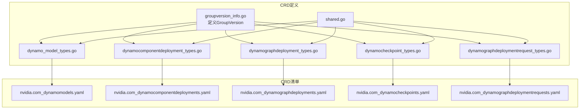
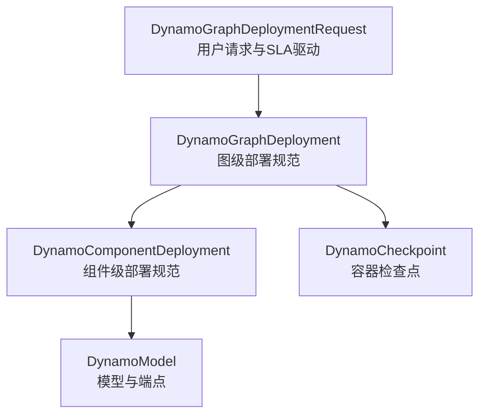
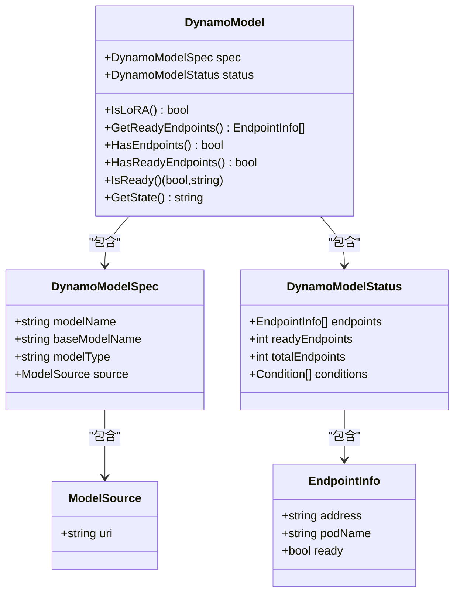
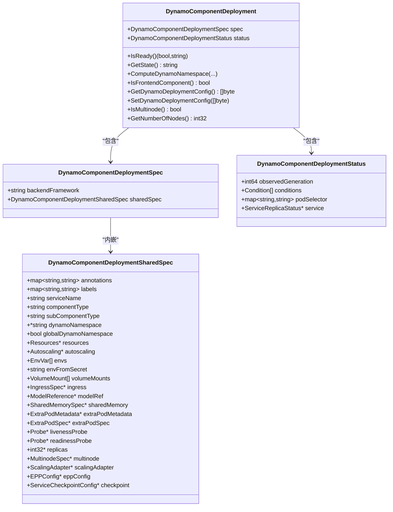
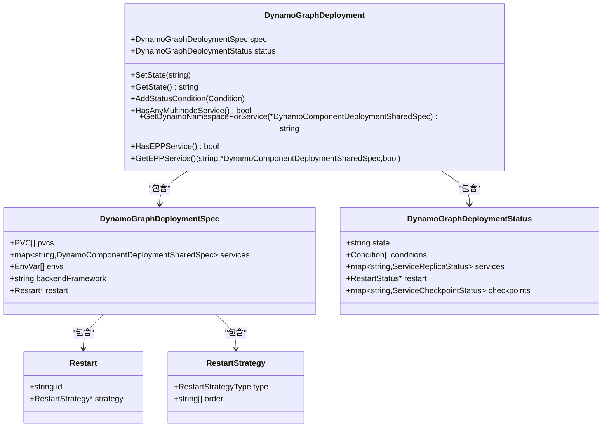
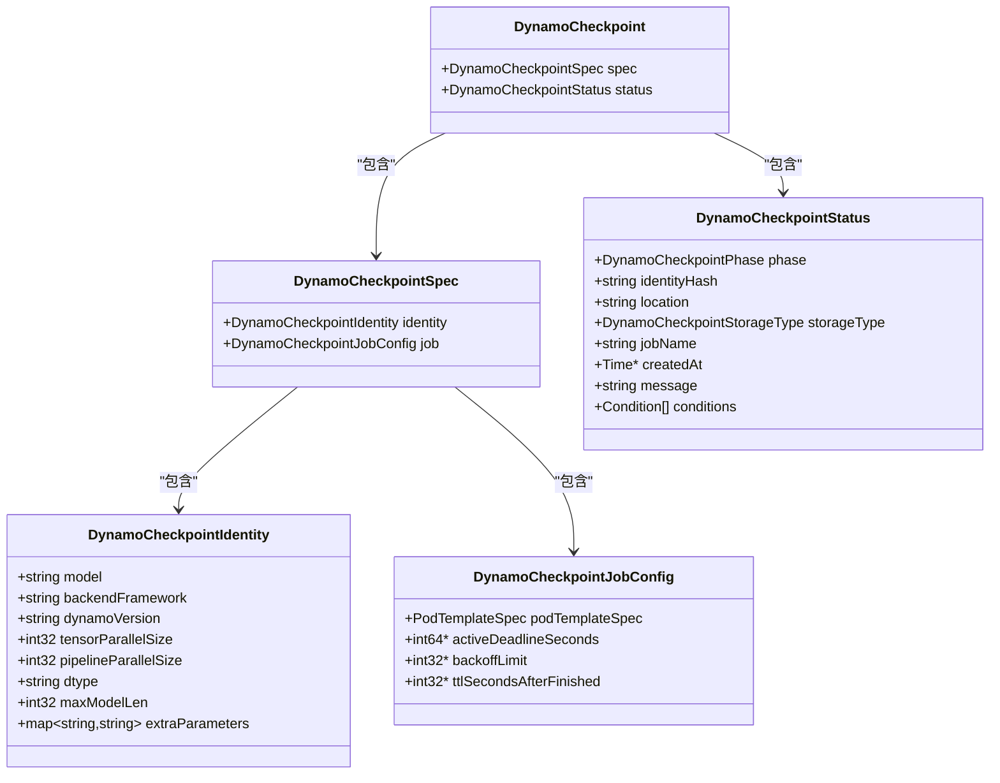
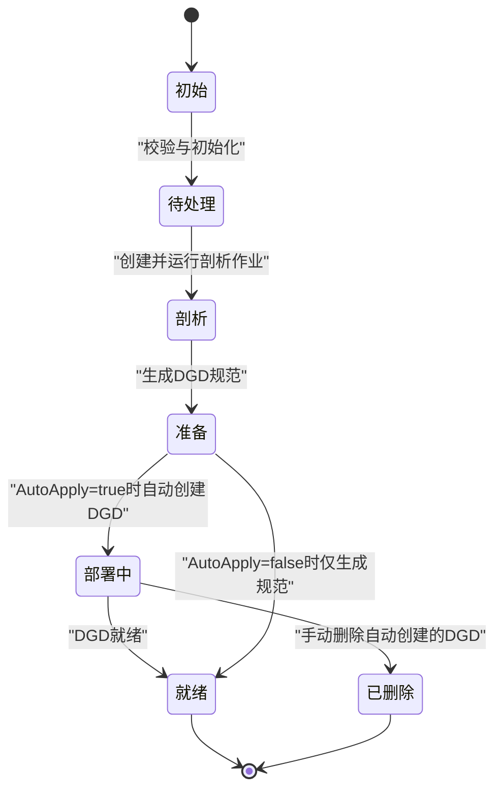
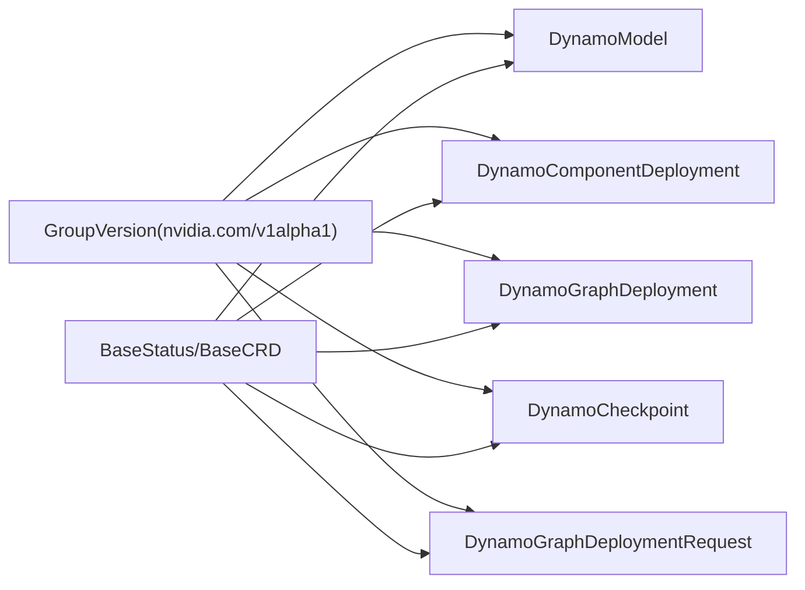

# 自定义资源定义(CRD)

<cite>
**本文引用的文件**
- [dynamo_model_types.go](file://deploy/operator/api/v1alpha1/dynamo_model_types.go)
- [dynamocomponentdeployment_types.go](file://deploy/operator/api/v1alpha1/dynamocomponentdeployment_types.go)
- [dynamographdeployment_types.go](file://deploy/operator/api/v1alpha1/dynamographdeployment_types.go)
- [dynamocheckpoint_types.go](file://deploy/operator/api/v1alpha1/dynamocheckpoint_types.go)
- [dynamographdeploymentrequest_types.go](file://deploy/operator/api/v1alpha1/dynamographdeploymentrequest_types.go)
- [groupversion_info.go](file://deploy/operator/api/v1alpha1/groupversion_info.go)
- [shared.go](file://deploy/operator/api/v1alpha1/shared.go)
- [nvidia.com_dynamomodels.yaml](file://deploy/operator/config/crd/bases/nvidia.com_dynamomodels.yaml)
- [nvidia.com_dynamocomponentdeployments.yaml](file://deploy/operator/config/crd/bases/nvidia.com_dynamocomponentdeployments.yaml)
- [nvidia.com_dynamographdeployments.yaml](file://deploy/operator/config/crd/bases/nvidia.com_dynamographdeployments.yaml)
- [nvidia.com_dynamocheckpoints.yaml](file://deploy/operator/config/crd/bases/nvidia.com_dynamocheckpoints.yaml)
- [nvidia.com_dynamographdeploymentrequests.yaml](file://deploy/operator/config/crd/bases/nvidia.com_dynamographdeploymentrequests.yaml)
</cite>

## 目录
1. [简介](#简介)
2. [项目结构](#项目结构)
3. [核心组件](#核心组件)
4. [架构总览](#架构总览)
5. [详细组件分析](#详细组件分析)
6. [依赖关系分析](#依赖关系分析)
7. [性能考量](#性能考量)
8. [故障排查指南](#故障排查指南)
9. [结论](#结论)
10. [附录](#附录)

## 简介
本文件面向Dynamo平台的Kubernetes自定义资源定义（CRD），系统性梳理并解释以下核心资源类型的结构、用途、字段语义、约束与生命周期行为：DynamoModel、DynamoComponentDeployment、DynamoGraphDeployment、DynamoCheckpoint、DynamoGraphDeploymentRequest。同时给出CRD的创建、更新与删除操作指引，说明资源状态监控与故障处理策略，并概述CRD与控制器的交互机制以及Webhook校验规则的来源与作用范围。

## 项目结构
Dynamo的CRD位于operator子模块中，采用按版本分组的目录组织方式，核心类型定义在v1alpha1包下，CRD清单由Kustomize生成并在bases目录中提供。各CRD与其对应的状态模型、打印列、校验注解均在类型定义文件中集中声明。

图表来源
- [groupversion_info.go](file://deploy/operator/api/v1alpha1/groupversion_info.go#L30-L39)
- [dynamo_model_types.go](file://deploy/operator/api/v1alpha1/dynamo_model_types.go#L93-L123)
- [dynamocomponentdeployment_types.go](file://deploy/operator/api/v1alpha1/dynamocomponentdeployment_types.go#L206-L237)
- [dynamographdeployment_types.go](file://deploy/operator/api/v1alpha1/dynamographdeployment_types.go#L191-L231)
- [dynamocheckpoint_types.go](file://deploy/operator/api/v1alpha1/dynamocheckpoint_types.go#L174-L205)
- [dynamographdeploymentrequest_types.go](file://deploy/operator/api/v1alpha1/dynamographdeploymentrequest_types.go#L254-L328)
- [nvidia.com_dynamomodels.yaml](file://deploy/operator/config/crd/bases/nvidia.com_dynamomodels.yaml)
- [nvidia.com_dynamocomponentdeployments.yaml](file://deploy/operator/config/crd/bases/nvidia.com_dynamocomponentdeployments.yaml)
- [nvidia.com_dynamographdeployments.yaml](file://deploy/operator/config/crd/bases/nvidia.com_dynamographdeployments.yaml)
- [nvidia.com_dynamocheckpoints.yaml](file://deploy/operator/config/crd/bases/nvidia.com_dynamocheckpoints.yaml)
- [nvidia.com_dynamographdeploymentrequests.yaml](file://deploy/operator/config/crd/bases/nvidia.com_dynamographdeploymentrequests.yaml)

章节来源
- [groupversion_info.go](file://deploy/operator/api/v1alpha1/groupversion_info.go#L20-L39)
- [shared.go](file://deploy/operator/api/v1alpha1/shared.go#L24-L86)

## 核心组件
本节对每个CRD进行要点归纳，包括用途、关键字段与约束、状态字段、打印列与短名称，便于快速理解与使用。

- DynamoModel
  - 用途：描述一个可被路由发现与调用的模型实例，支持LoRA与基础模型类型；记录服务端点列表、就绪端点数与总数，并通过条件表达最新状态。
  - 关键字段与约束
    - spec.modelName：必填，完整模型标识符。
    - spec.baseModelName：必填，用于通过headless service发现端点的服务标签匹配依据。
    - spec.modelType：枚举值，允许“base”、“lora”、“adapter”，默认“base”。
    - spec.source.uri：当模型类型为lora时必填，支持S3与HuggingFace等URI格式。
    - status.endpoints：端点地址、Pod名与就绪标记。
    - status.readyEndpoints、status.totalEndpoints：统计信息。
    - status.conditions：标准条件集合。
  - 打印列与短名称：BaseModel、Type、Ready、Total、Age；短名称dm。
  - 常用方法：判断是否LoRA、筛选就绪端点、计算就绪状态、获取资源状态字符串。

- DynamoComponentDeployment
  - 用途：描述单个组件的部署规范，包含后端框架、资源、探针、副本数、多节点、入口、模型引用、共享内存、额外Pod元数据与覆盖、EPP配置、容器检查点等。
  - 关键字段与约束
    - spec.backendFramework：枚举“sglang”、“vllm”、“trtllm”。
    - spec.sharedSpec：包含annotations、labels、serviceName、componentType、subComponentType、资源、环境变量、卷挂载、入口、模型引用、共享内存、额外Pod元数据/覆盖、探针、副本数、多节点、缩放适配器、EPP配置、检查点等。
    - status.conditions、status.podSelector、status.service：观测到的状态。
  - 打印列与短名称：DynamoComponent、Available、Backend、Age；短名称dcd。
  - 常用方法：判断就绪、获取状态、计算Dynamo命名空间、识别前端组件、读写部署配置、多节点判定与节点数查询、父DGD引用解析。

- DynamoGraphDeployment
  - 用途：描述图级部署的整体规范，包含PVC、服务映射、全局环境变量、后端框架、重启策略等；维护整体状态、服务级副本状态、重启阶段与检查点状态。
  - 关键字段与约束
    - spec.pvcs：最多100个PVC，供组件引用。
    - spec.services：最多25个服务，键为服务名，值为共享部署规范。
    - spec.envs：全局环境变量。
    - spec.backendFramework：枚举“sglang”、“vllm”、“trtllm”。
    - spec.restart.id：必填，触发重启的任意字符串；restart.strategy.type：重启策略类型（Sequential/Parallel），可指定顺序。
    - status.state、status.conditions、status.services、status.restart、status.checkpoints：观测状态。
  - 打印列与短名称：Ready、Backend、Age；短名称dgd。
  - 常用方法：设置/获取状态、合并条件、检测是否存在多节点服务、计算服务Dynamo命名空间、查找EPP服务。

- DynamoCheckpoint
  - 用途：描述容器检查点的创建与管理，支持PVC/S3/OCI存储后端；通过身份标识决定等价性，跟踪作业生命周期阶段与条件。
  - 关键字段与约束
    - spec.identity：必填，包含模型、后端框架、Dynamo版本、张量并行/管道并行大小、数据类型、最大序列长度、额外参数等，共同决定identity hash。
    - spec.job：必填，包含Pod模板、活动截止时间、重试次数、完成后TTL等。
    - status.phase、status.identityHash、status.location、status.storageType、status.jobName、status.createdAt、status.message、status.conditions：观测状态。
  - 打印列与短名称：Model、Backend、Phase、Hash、Age；短名称dckpt。
  - 特殊约束：XValidation规则禁止修改已创建后的identity字段。

- DynamoGraphDeploymentRequest
  - 用途：面向用户的高级部署请求，以SLA为导向，自动完成性能剖析、生成DGD规范并可自动应用；支持mocker部署与GPU发现。
  - 关键字段与约束
    - spec.model、spec.backend：必填，高层模型标识与推理后端。
    - spec.useMocker、spec.enableGpuDiscovery：布尔开关。
    - spec.profilingConfig：必填，包含profiler镜像、输出PVC、资源需求、容忍度、配置对象或ConfigMap引用等。
    - spec.autoApply、spec.deploymentOverrides：控制是否自动创建DGD及覆盖元数据。
    - status.state、status.backend、status.observedGeneration、status.conditions、status.profilingResults、status.generatedDeployment、status.deployment：观测状态。
  - 打印列与短名称：Model、Backend、State、DGD-State、Age；短名称dgdr。
  - 生命周期：Initial→Pending→Profiling→Ready/Deploying→Ready或DeploymentDeleted，spec在剖析开始后变为不可变。

章节来源
- [dynamo_model_types.go](file://deploy/operator/api/v1alpha1/dynamo_model_types.go#L29-L173)
- [dynamocomponentdeployment_types.go](file://deploy/operator/api/v1alpha1/dynamocomponentdeployment_types.go#L39-L380)
- [dynamographdeployment_types.go](file://deploy/operator/api/v1alpha1/dynamographdeployment_types.go#L47-L291)
- [dynamocheckpoint_types.go](file://deploy/operator/api/v1alpha1/dynamocheckpoint_types.go#L112-L206)
- [dynamographdeploymentrequest_types.go](file://deploy/operator/api/v1alpha1/dynamographdeploymentrequest_types.go#L124-L329)

## 架构总览
Dynamo CRD体系围绕“请求—图—组件—模型—检查点”五类资源协同工作：用户通过DynamoGraphDeploymentRequest发起部署请求，系统完成性能剖析后生成DynamoGraphDeployment规范；控制器据此创建DynamoComponentDeployment资源，后者驱动具体Pod/Service等K8s资源；DynamoModel用于模型发现与端点管理；DynamoCheckpoint支撑冷启动优化与恢复。

图表来源
- [dynamographdeploymentrequest_types.go](file://deploy/operator/api/v1alpha1/dynamographdeploymentrequest_types.go#L239-L271)
- [dynamographdeployment_types.go](file://deploy/operator/api/v1alpha1/dynamographdeployment_types.go#L197-L206)
- [dynamocomponentdeployment_types.go](file://deploy/operator/api/v1alpha1/dynamocomponentdeployment_types.go#L216-L224)
- [dynamo_model_types.go](file://deploy/operator/api/v1alpha1/dynamo_model_types.go#L104-L110)
- [dynamocheckpoint_types.go](file://deploy/operator/api/v1alpha1/dynamocheckpoint_types.go#L184-L192)

## 详细组件分析

### DynamoModel 类型与状态机
- 数据模型
  - spec.modelName/baseModelName/modelType/source.uri：模型标识、类型与来源。
  - status.endpoints/readyEndpoints/totalEndpoints/conditions：观测状态与条件。
- 状态判定
  - 就绪条件：至少存在端点、至少一个就绪端点、且就绪端点数等于总数。
  - 资源状态：根据就绪结果映射为“ready”或“not_ready”。

图表来源
- [dynamo_model_types.go](file://deploy/operator/api/v1alpha1/dynamo_model_types.go#L29-L91)
- [dynamo_model_types.go](file://deploy/operator/api/v1alpha1/dynamo_model_types.go#L104-L173)

章节来源
- [dynamo_model_types.go](file://deploy/operator/api/v1alpha1/dynamo_model_types.go#L29-L173)

### DynamoComponentDeployment 部署规范
- 规范字段
  - backendFramework：后端框架枚举。
  - sharedSpec：统一的组件级部署与运行时设置，涵盖资源、探针、副本数、多节点、入口、模型引用、共享内存、额外Pod元数据/覆盖、缩放适配器、EPP配置、检查点等。
- 状态与行为
  - status.conditions、status.podSelector、status.service：观测到的可用性与服务副本状态。
  - 计算Dynamo命名空间、判断前端组件、读写部署配置、多节点判定等辅助方法。

图表来源
- [dynamocomponentdeployment_types.go](file://deploy/operator/api/v1alpha1/dynamocomponentdeployment_types.go#L39-L138)
- [dynamocomponentdeployment_types.go](file://deploy/operator/api/v1alpha1/dynamocomponentdeployment_types.go#L184-L204)
- [dynamocomponentdeployment_types.go](file://deploy/operator/api/v1alpha1/dynamocomponentdeployment_types.go#L216-L380)

章节来源
- [dynamocomponentdeployment_types.go](file://deploy/operator/api/v1alpha1/dynamocomponentdeployment_types.go#L39-L380)

### DynamoGraphDeployment 图级编排
- 规范字段
  - pvcs：最多100个PVC。
  - services：最多25个服务，键为服务名，值为共享部署规范。
  - envs：全局环境变量。
  - backendFramework：后端框架枚举。
  - restart：重启ID与策略（顺序/并行）。
- 状态与行为
  - status.state/conditions/services/restart/checkpoints：整体状态与服务级副本、重启与检查点状态。

图表来源
- [dynamographdeployment_types.go](file://deploy/operator/api/v1alpha1/dynamographdeployment_types.go#L47-L99)
- [dynamographdeployment_types.go](file://deploy/operator/api/v1alpha1/dynamographdeployment_types.go#L101-L146)
- [dynamographdeployment_types.go](file://deploy/operator/api/v1alpha1/dynamographdeployment_types.go#L197-L291)

章节来源
- [dynamographdeployment_types.go](file://deploy/operator/api/v1alpha1/dynamographdeployment_types.go#L47-L291)

### DynamoCheckpoint 检查点管理
- 规范字段
  - spec.identity：决定等价性的输入集合，包含模型、后端框架、Dynamo版本、并行度、数据类型、最大序列长度、额外参数等。
  - spec.job：检查点创建作业的配置，包含Pod模板、活动截止时间、重试次数、完成后TTL等。
- 状态与行为
  - status.phase/identityHash/location/storageType/jobName/createdAt/message/conditions：生命周期阶段、位置、存储类型、作业名、创建时间、消息与条件。

图表来源
- [dynamocheckpoint_types.go](file://deploy/operator/api/v1alpha1/dynamocheckpoint_types.go#L112-L172)
- [dynamocheckpoint_types.go](file://deploy/operator/api/v1alpha1/dynamocheckpoint_types.go#L184-L206)

章节来源
- [dynamocheckpoint_types.go](file://deploy/operator/api/v1alpha1/dynamocheckpoint_types.go#L112-L206)

### DynamoGraphDeploymentRequest 请求与生命周期
- 规范字段
  - spec.model/backend/useMocker/enableGpuDiscovery：高层模型与后端、mocker开关与GPU发现开关。
  - spec.profilingConfig：剖析配置，包含profiler镜像、输出PVC、资源需求、容忍度、配置对象或ConfigMap引用。
  - spec.autoApply/deploymentOverrides：自动应用与DGD元数据覆盖。
- 生命周期与状态
  - 初始→待处理→剖析→准备/部署中→就绪或DGD已删除；spec在剖析开始后不可变。

图表来源
- [dynamographdeploymentrequest_types.go](file://deploy/operator/api/v1alpha1/dynamographdeploymentrequest_types.go#L243-L253)

章节来源
- [dynamographdeploymentrequest_types.go](file://deploy/operator/api/v1alpha1/dynamographdeploymentrequest_types.go#L124-L329)

## 依赖关系分析
- 组版本绑定
  - 所有CRD类型均注册于nvidia.com/v1alpha1组版本，通过SchemeBuilder统一注册。
- 公共状态基类
  - BaseStatus/BaseCRD提供通用状态字段（version/state/conditions）与访问器，便于跨CRD复用。
- CRD清单来源
  - 各CRD的OpenAPI v3模式与打印列、短名称等由类型定义中的kubebuilder注解生成，最终落盘为bases下的YAML清单。

图表来源
- [groupversion_info.go](file://deploy/operator/api/v1alpha1/groupversion_info.go#L30-L39)
- [shared.go](file://deploy/operator/api/v1alpha1/shared.go#L24-L86)

章节来源
- [groupversion_info.go](file://deploy/operator/api/v1alpha1/groupversion_info.go#L20-L39)
- [shared.go](file://deploy/operator/api/v1alpha1/shared.go#L24-L86)

## 性能考量
- 多节点与并行重启
  - DynamoGraphDeployment支持多节点组件与顺序/并行重启策略，合理规划重启顺序可降低抖动与停机窗口。
- 检查点加速冷启动
  - DynamoCheckpoint通过容器检查点技术减少Pod恢复时间，建议结合DynamoComponentDeployment的checkpoint配置启用。
- 探针与副本数
  - 合理配置liveness/readiness探针与副本数，有助于提升可用性与弹性；缩放适配器可与HPA/KEDA配合实现动态扩缩容。
- 端点就绪与路由
  - DynamoModel的端点就绪判定直接影响路由决策，确保LoRA加载与基础模型探测路径正确配置。

## 故障排查指南
- 状态字段定位
  - 优先查看各CRD的status.conditions与status.state，结合打印列快速判断资源状态。
- DynamoModel
  - 若就绪端点数小于总数，检查端点地址、Pod就绪与LoRA加载状态。
- DynamoComponentDeployment
  - 若Available条件非True，检查副本数、探针、多节点配置与缩放适配器状态。
- DynamoGraphDeployment
  - 若整体未就绪，检查services中的各组件状态、重启阶段与检查点状态。
- DynamoCheckpoint
  - 若Phase为Failed，查看conditions与message；确认identity与job配置正确。
- DynamoGraphDeploymentRequest
  - 若spec不可变错误，需删除并重建DGDR以调整配置；关注ProfilingResults与GeneratedDeployment。

## 结论
Dynamo的CRD体系以清晰的层次化设计实现了从用户请求到组件部署再到模型发现与检查点管理的全链路编排。通过严格的字段约束、标准条件与打印列，用户可以直观地掌握资源状态；通过缩放适配器、多节点与检查点等能力，系统在可用性与性能之间取得平衡。建议在生产环境中结合可观测性工具持续监控各CRD状态，配合自动化流程实现稳定高效的模型推理服务交付。

## 附录

### CRD创建、更新与删除操作示例（步骤说明）
- 创建
  - 使用kubectl apply -f 应用对应的CRD清单（bases目录下的YAML）。
  - 创建业务资源（如DynamoGraphDeploymentRequest、DynamoGraphDeployment、DynamoComponentDeployment、DynamoModel、DynamoCheckpoint）。
- 更新
  - 对于DynamoGraphDeploymentRequest：在剖析开始前可更新spec；剖析开始后spec不可变，需删除并重建。
  - 对于DynamoGraphDeployment/DynamoComponentDeployment：按需调整共享规范与副本数，观察Available/Ready条件变化。
  - 对于DynamoModel：更新模型类型与来源（若适用），观察端点就绪状态。
  - 对于DynamoCheckpoint：仅可变更job配置（如重试次数、TTL），不可变更identity。
- 删除
  - 使用kubectl delete -f 删除资源；对于DynamoGraphDeploymentRequest，若为自动应用DGD，删除后其状态会反映“DeploymentDeleted”。

章节来源
- [nvidia.com_dynamomodels.yaml](file://deploy/operator/config/crd/bases/nvidia.com_dynamomodels.yaml)
- [nvidia.com_dynamocomponentdeployments.yaml](file://deploy/operator/config/crd/bases/nvidia.com_dynamocomponentdeployments.yaml)
- [nvidia.com_dynamographdeployments.yaml](file://deploy/operator/config/crd/bases/nvidia.com_dynamographdeployments.yaml)
- [nvidia.com_dynamocheckpoints.yaml](file://deploy/operator/config/crd/bases/nvidia.com_dynamocheckpoints.yaml)
- [nvidia.com_dynamographdeploymentrequests.yaml](file://deploy/operator/config/crd/bases/nvidia.com_dynamographdeploymentrequests.yaml)

### 资源生命周期管理与状态监控
- 生命周期
  - DynamoGraphDeploymentRequest：Initial→Pending→Profiling→Ready/Deploying→Ready或DeploymentDeleted。
  - DynamoGraphDeployment：由可用性与就绪条件驱动。
  - DynamoComponentDeployment：由Available条件与服务副本状态驱动。
  - DynamoModel：由端点就绪与总数驱动。
  - DynamoCheckpoint：由Phase与条件驱动。
- 监控建议
  - 使用kubectl get/describe查看打印列与状态。
  - 结合控制器日志与事件，定位条件变化与错误原因。

章节来源
- [dynamographdeploymentrequest_types.go](file://deploy/operator/api/v1alpha1/dynamographdeploymentrequest_types.go#L243-L253)
- [dynamographdeployment_types.go](file://deploy/operator/api/v1alpha1/dynamographdeployment_types.go#L101-L120)
- [dynamocomponentdeployment_types.go](file://deploy/operator/api/v1alpha1/dynamocomponentdeployment_types.go#L184-L204)
- [dynamo_model_types.go](file://deploy/operator/api/v1alpha1/dynamo_model_types.go#L76-L91)
- [dynamocheckpoint_types.go](file://deploy/operator/api/v1alpha1/dynamocheckpoint_types.go#L135-L172)

### Webhook验证规则与控制器交互
- 验证规则来源
  - CRD清单由kubebuilder注解生成，包含XValidation、枚举与默认值等约束；这些规则在CRD层面生效，作为准入控制的第一道防线。
- 控制器职责
  - 控制器负责将期望状态（spec）转换为实际状态（status），并持续观测底层K8s资源，更新条件与状态。
  - 对于DynamoGraphDeploymentRequest，控制器在剖析完成后生成DGD规范或自动创建DGD，并同步状态。

章节来源
- [dynamocheckpoint_types.go](file://deploy/operator/api/v1alpha1/dynamocheckpoint_types.go#L182)
- [dynamographdeploymentrequest_types.go](file://deploy/operator/api/v1alpha1/dynamographdeploymentrequest_types.go#L254-L271)
- [dynamographdeployment_types.go](file://deploy/operator/api/v1alpha1/dynamographdeployment_types.go#L191-L206)
- [dynamocomponentdeployment_types.go](file://deploy/operator/api/v1alpha1/dynamocomponentdeployment_types.go#L206-L216)
- [dynamo_model_types.go](file://deploy/operator/api/v1alpha1/dynamo_model_types.go#L93-L101)