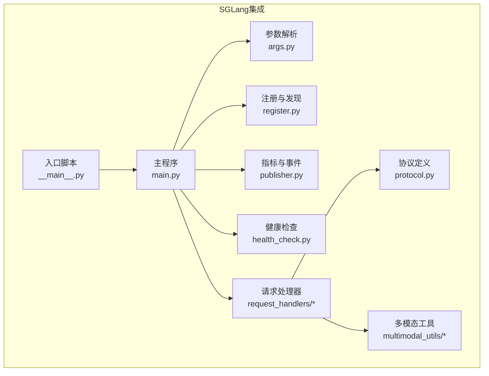
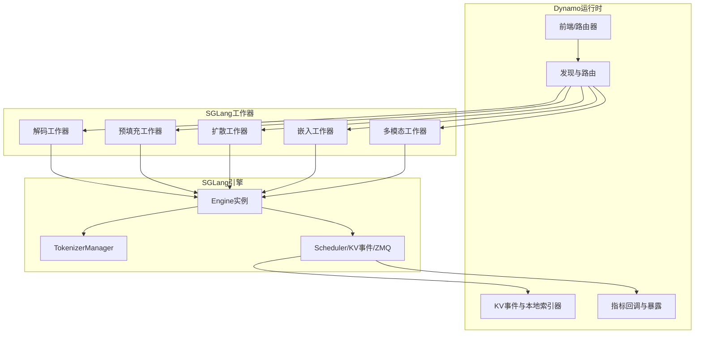
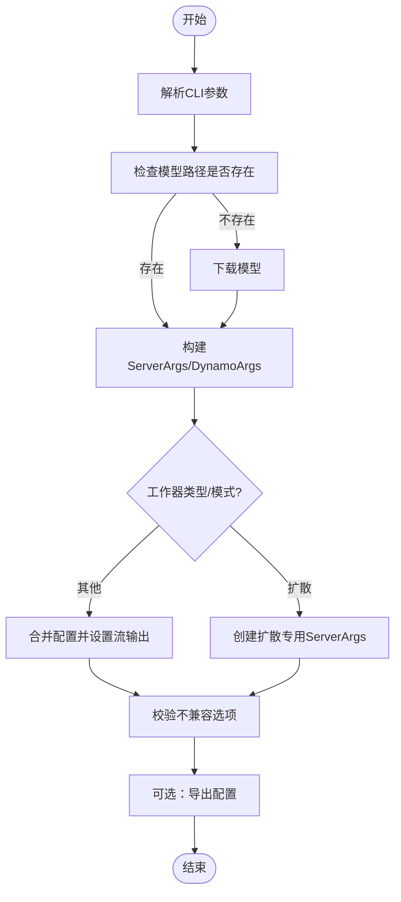
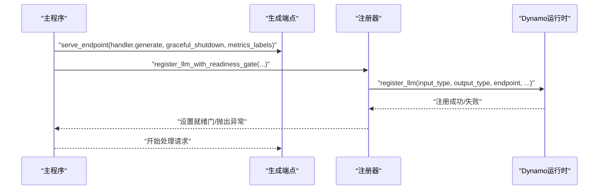
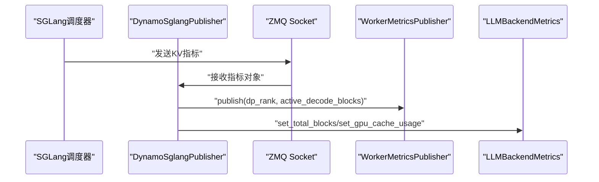
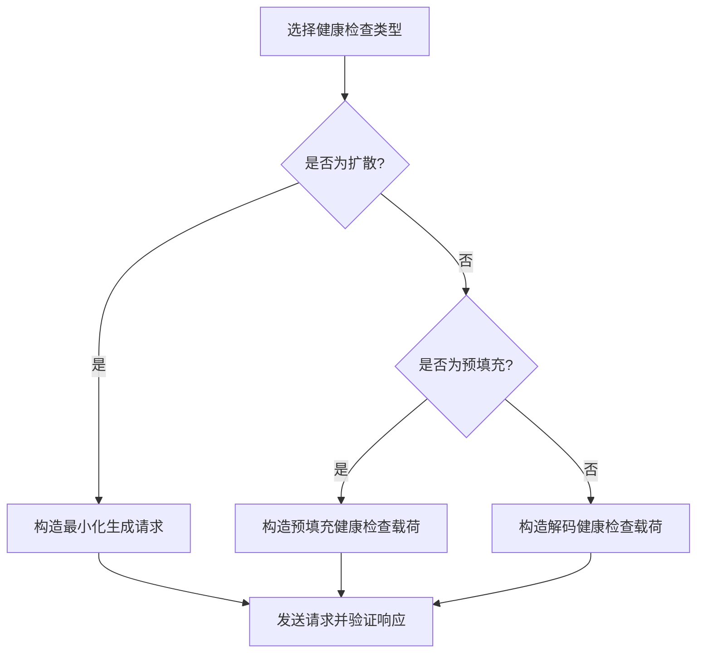
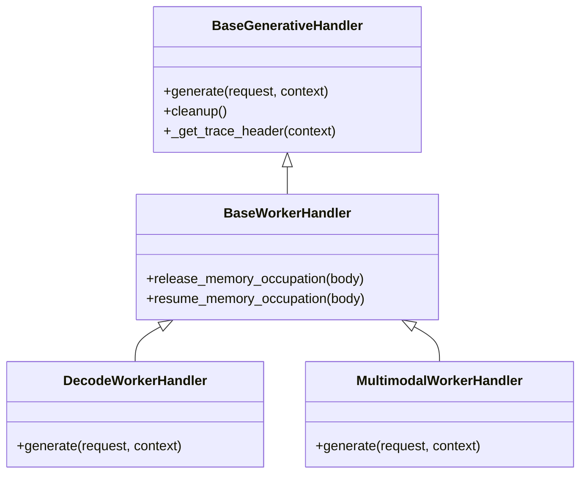
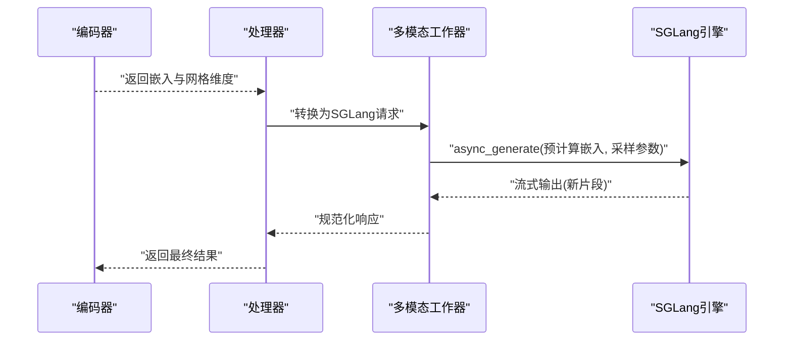
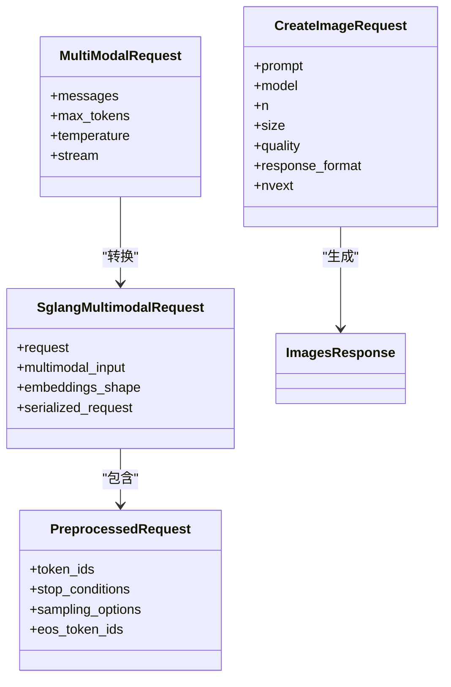
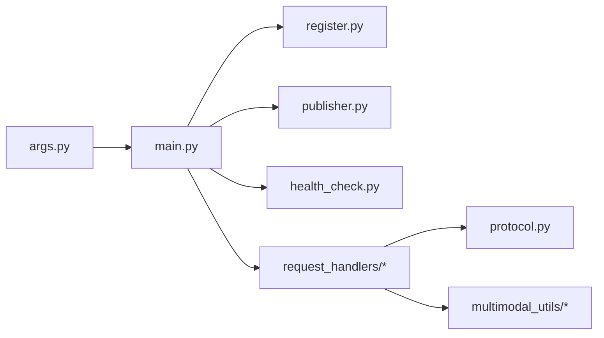

# SGLang引擎集成

<cite>
**本文档引用的文件**
- [components/src/dynamo/sglang/main.py](file://components/src/dynamo/sglang/main.py)
- [components/src/dynamo/sglang/__main__.py](file://components/src/dynamo/sglang/__main__.py)
- [components/src/dynamo/sglang/args.py](file://components/src/dynamo/sglang/args.py)
- [components/src/dynamo/sglang/protocol.py](file://components/src/dynamo/sglang/protocol.py)
- [components/src/dynamo/sglang/register.py](file://components/src/dynamo/sglang/register.py)
- [components/src/dynamo/sglang/publisher.py](file://components/src/dynamo/sglang/publisher.py)
- [components/src/dynamo/sglang/health_check.py](file://components/src/dynamo/sglang/health_check.py)
- [components/src/dynamo/sglang/request_handlers/__init__.py](file://components/src/dynamo/sglang/request_handlers/__init__.py)
- [components/src/dynamo/sglang/request_handlers/handler_base.py](file://components/src/dynamo/sglang/request_handlers/handler_base.py)
- [components/src/dynamo/sglang/request_handlers/llm/decode_handler.py](file://components/src/dynamo/sglang/request_handlers/llm/decode_handler.py)
- [components/src/dynamo/sglang/request_handlers/multimodal/worker_handler.py](file://components/src/dynamo/sglang/request_handlers/multimodal/worker_handler.py)
- [components/src/dynamo/sglang/multimodal_utils/__init__.py](file://components/src/dynamo/sglang/multimodal_utils/__init__.py)
- [components/src/dynamo/sglang/multimodal_utils/multimodal_chat_processor.py](file://components/src/dynamo/sglang/multimodal_utils/multimodal_chat_processor.py)
</cite>

## 目录
1. [简介](#简介)
2. [项目结构](#项目结构)
3. [核心组件](#核心组件)
4. [架构总览](#架构总览)
5. [详细组件分析](#详细组件分析)
6. [依赖关系分析](#依赖关系分析)
7. [性能考量](#性能考量)
8. [故障排查指南](#故障排查指南)
9. [结论](#结论)
10. [附录](#附录)

## 简介
本文件系统性阐述SGLang引擎在Dynamo平台中的集成方案与实现细节，重点覆盖以下方面：
- SGLang作为后端引擎的独特架构与优势：基于SGLang的分布式推理、多模态支持、KV事件与指标发布、以及与Dynamo运行时的深度集成。
- 分布式推理中的创新设计：解码与预填充分离、数据并行注意力模式、跨节点KV事件分发与本地索引器协同。
- 图像扩散模型支持：Diffusion语言模型与图像扩散生成的双路径实现，含健康检查与存储适配。
- 专家分布与EPLB（专家并行负载均衡）机制：通过数据并行规模与路由信息实现DP rank感知的负载均衡。
- 多模态处理流程：从图像编码到文本生成的完整链路，含编码器、处理器与解码器的协作。
- 请求处理器设计模式：预填充、解码、嵌入、图像扩散等不同工作器的职责划分与调用链。
- 性能剖析工具与优化策略：Prometheus指标、ZMQ KV事件、内存占用释放与恢复、CUDA图与权重缓存管理。
- 实际部署示例、配置参数详解与常见问题解决方案：涵盖命令行参数、环境变量、YAML配置与端点类型选择。
- 与Dynamo框架其他组件的集成方式与最佳实践：前端、路由器、KV路由器、观测性与告警。

## 项目结构
SGLang集成位于Dynamo组件目录下，采用按功能域分层组织：
- 入口与主流程：入口脚本、主程序、参数解析、注册与健康检查。
- 请求处理：基础处理器抽象、LLM工作器（解码、预填充、扩散）、多模态工作器（编码、处理器、解码）。
- 协议与类型：统一的请求/响应协议定义，支持文本、图像、视频与扩散生成。
- 指标与事件：SGLang指标收集、ZMQ KV事件订阅、组件级指标发布。
- 多模态工具：聊天消息转换、流式响应处理、图像加载与嵌入处理。

**图表来源**
- [components/src/dynamo/sglang/__main__.py](file://components/src/dynamo/sglang/__main__.py#L1-L13)
- [components/src/dynamo/sglang/main.py](file://components/src/dynamo/sglang/main.py#L1-L888)
- [components/src/dynamo/sglang/args.py](file://components/src/dynamo/sglang/args.py#L1-L635)
- [components/src/dynamo/sglang/protocol.py](file://components/src/dynamo/sglang/protocol.py#L1-L177)
- [components/src/dynamo/sglang/register.py](file://components/src/dynamo/sglang/register.py#L1-L315)
- [components/src/dynamo/sglang/publisher.py](file://components/src/dynamo/sglang/publisher.py#L1-L389)
- [components/src/dynamo/sglang/health_check.py](file://components/src/dynamo/sglang/health_check.py#L1-L147)
- [components/src/dynamo/sglang/request_handlers/__init__.py](file://components/src/dynamo/sglang/request_handlers/__init__.py#L1-L42)
- [components/src/dynamo/sglang/multimodal_utils/__init__.py](file://components/src/dynamo/sglang/multimodal_utils/__init__.py#L1-L19)

**章节来源**
- [components/src/dynamo/sglang/main.py](file://components/src/dynamo/sglang/main.py#L1-L888)
- [components/src/dynamo/sglang/args.py](file://components/src/dynamo/sglang/args.py#L1-L635)

## 核心组件
- 参数解析与配置容器：统一解析SGLang与Dynamo参数，自动推断端点、下载模型、设置流输出与跳过分词器初始化策略。
- 注册与运行时配置：向Dynamo注册模型、注入运行时配置（最大并发、批内令牌数、KV块总数、数据并行规模、引导端点），支持就绪门机制。
- 指标与KV事件发布：在主节点接收SGLang调度器指标，在非主节点仅发布KV事件；支持DP注意力模式下的本地订阅与跨节点NATS转发。
- 健康检查：为解码、预填充与图像扩散分别提供最小化健康检查载荷，确保快速可用性验证。
- 请求处理器：抽象基类提供通用基础设施；具体工作器覆盖解码、预填充、扩散、嵌入、多模态编码/处理器/解码等场景。
- 多模态工具：将Dynamo多模态请求转换为SGLang格式、处理流式响应、加载图像与生成嵌入。

**章节来源**
- [components/src/dynamo/sglang/args.py](file://components/src/dynamo/sglang/args.py#L308-L605)
- [components/src/dynamo/sglang/register.py](file://components/src/dynamo/sglang/register.py#L18-L274)
- [components/src/dynamo/sglang/publisher.py](file://components/src/dynamo/sglang/publisher.py#L65-L388)
- [components/src/dynamo/sglang/health_check.py](file://components/src/dynamo/sglang/health_check.py#L50-L146)
- [components/src/dynamo/sglang/request_handlers/handler_base.py](file://components/src/dynamo/sglang/request_handlers/handler_base.py#L21-L200)

## 架构总览
SGLang集成采用“工作器+运行时”的解耦架构：
- 工作器负责具体任务：解码、预填充、扩散、嵌入、多模态处理。
- 运行时负责路由、发现、KV事件与指标发布、健康检查与就绪门。
- SGLang引擎作为推理后端，通过异步生成接口与工作器交互，支持流式输出与分布式调度。

**图表来源**
- [components/src/dynamo/sglang/main.py](file://components/src/dynamo/sglang/main.py#L235-L407)
- [components/src/dynamo/sglang/register.py](file://components/src/dynamo/sglang/register.py#L146-L231)
- [components/src/dynamo/sglang/publisher.py](file://components/src/dynamo/sglang/publisher.py#L332-L388)

## 详细组件分析

### 参数解析与配置
- 自动推断端点：根据工作器类型与聚合/预填充/解码模式选择默认端点。
- 模型下载：若模型路径不存在，通过模式仓库自动下载。
- 流输出强制开启：确保SGLang发送“自上次输出以来的新片段”，便于Dynamo直传。
- 跳过分词器初始化：可切换至SGLang内置分词器或Dynamo自定义分词器。
- 扩散工作器专用：为图像扩散生成创建stub ServerArgs，禁用transformer相关参数。

**图表来源**
- [components/src/dynamo/sglang/args.py](file://components/src/dynamo/sglang/args.py#L308-L605)

**章节来源**
- [components/src/dynamo/sglang/args.py](file://components/src/dynamo/sglang/args.py#L308-L605)

### 注册与运行时配置
- 注册LLM：向Dynamo注册输入/输出类型、运行时配置（推理解析器、工具调用解析器、本地索引器开关、数据并行规模、引导端点、最大并发与批内令牌数、KV块总数）。
- 就绪门：注册过程与服务端点启动并发进行，通过事件信号通知前端可接受请求。
- 引导端点：在预填充工作器中发布引导端点，供解码阶段使用。

**图表来源**
- [components/src/dynamo/sglang/register.py](file://components/src/dynamo/sglang/register.py#L18-L67)
- [components/src/dynamo/sglang/register.py](file://components/src/dynamo/sglang/register.py#L234-L274)

**章节来源**
- [components/src/dynamo/sglang/register.py](file://components/src/dynamo/sglang/register.py#L18-L274)

### 指标与KV事件发布
- 主节点指标：通过ZMQ从SGLang调度器接收KV指标（活跃块、总块、GPU缓存使用率），并发布到Dynamo指标端点。
- 非主节点：仅发布KV事件，不接收调度器指标。
- DP注意力模式：按本地DP rank范围订阅对应ZMQ端点，结合NATS实现跨节点事件转发。
- 组件级指标：模型加载时间、总块数、GPU缓存使用率等。

**图表来源**
- [components/src/dynamo/sglang/publisher.py](file://components/src/dynamo/sglang/publisher.py#L124-L164)
- [components/src/dynamo/sglang/publisher.py](file://components/src/dynamo/sglang/publisher.py#L199-L282)

**章节来源**
- [components/src/dynamo/sglang/publisher.py](file://components/src/dynamo/sglang/publisher.py#L65-L388)

### 健康检查
- 解码/预填充健康检查：构造最小化采样参数与单令牌生成，支持文本或token输入两种模式。
- 图像扩散健康检查：构造最小化生成请求（小尺寸、少量步数），避免外部存储依赖。

**图表来源**
- [components/src/dynamo/sglang/health_check.py](file://components/src/dynamo/sglang/health_check.py#L50-L146)

**章节来源**
- [components/src/dynamo/sglang/health_check.py](file://components/src/dynamo/sglang/health_check.py#L50-L146)

### 请求处理器设计模式
- 抽象基类：提供组件与配置管理、指标与KV事件发布、分布式追踪头传递、内存占用释放/恢复等通用能力。
- 解码工作器：支持聚合与解码分离两种模式；在解码分离模式下需要引导信息（主机、端口、房间）与DP rank。
- 多模态工作器：处理嵌入预计算、网格维度、RDMA元数据序列化，统一流式响应处理。
- 基础工作器：封装SGLang Engine集成、输入参数管理、取消处理与生命周期清理。

**图表来源**
- [components/src/dynamo/sglang/request_handlers/handler_base.py](file://components/src/dynamo/sglang/request_handlers/handler_base.py#L21-L200)
- [components/src/dynamo/sglang/request_handlers/llm/decode_handler.py](file://components/src/dynamo/sglang/request_handlers/llm/decode_handler.py#L18-L200)
- [components/src/dynamo/sglang/request_handlers/multimodal/worker_handler.py](file://components/src/dynamo/sglang/request_handlers/multimodal/worker_handler.py#L1-L200)

**章节来源**
- [components/src/dynamo/sglang/request_handlers/handler_base.py](file://components/src/dynamo/sglang/request_handlers/handler_base.py#L21-L200)
- [components/src/dynamo/sglang/request_handlers/llm/decode_handler.py](file://components/src/dynamo/sglang/request_handlers/llm/decode_handler.py#L18-L200)
- [components/src/dynamo/sglang/request_handlers/multimodal/worker_handler.py](file://components/src/dynamo/sglang/request_handlers/multimodal/worker_handler.py#L1-L200)

### 多模态处理流程
- 编码阶段：图像/视频加载、嵌入生成、网格维度与RDMA元数据准备。
- 处理阶段：将多模态消息转换为SGLang对话模板，生成token_ids与停止条件。
- 解码阶段：将嵌入预计算为SGLang输入项，执行流式生成并规范化完成原因。

**图表来源**
- [components/src/dynamo/sglang/multimodal_utils/multimodal_chat_processor.py](file://components/src/dynamo/sglang/multimodal_utils/multimodal_chat_processor.py#L11-L48)
- [components/src/dynamo/sglang/request_handlers/multimodal/worker_handler.py](file://components/src/dynamo/sglang/request_handlers/multimodal/worker_handler.py#L72-L200)

**章节来源**
- [components/src/dynamo/sglang/multimodal_utils/multimodal_chat_processor.py](file://components/src/dynamo/sglang/multimodal_utils/multimodal_chat_processor.py#L11-L163)
- [components/src/dynamo/sglang/request_handlers/multimodal/worker_handler.py](file://components/src/dynamo/sglang/request_handlers/multimodal/worker_handler.py#L1-L200)

### 协议与数据模型
- 标准LLM协议：包含停止条件、采样选项、预处理请求、嵌入请求等。
- 多模态协议：支持文本、图像URL、视频URL的消息内容，统一的多模态请求与SGLang请求包装。
- 图像扩散协议：OpenAI风格的图像生成请求，支持NVIDIA扩展字段与响应数据结构。

**图表来源**
- [components/src/dynamo/sglang/protocol.py](file://components/src/dynamo/sglang/protocol.py#L19-L177)

**章节来源**
- [components/src/dynamo/sglang/protocol.py](file://components/src/dynamo/sglang/protocol.py#L1-L177)

## 依赖关系分析
- 组件耦合与内聚：请求处理器对SGLang Engine与Dynamo运行时有直接依赖；指标与事件发布器与SGLang调度器/运行时松耦合。
- 外部依赖：SGLang Engine、ZMQ、Prometheus、NATS（通过Dynamo运行时抽象）。
- 关键依赖链：参数解析 → 引擎初始化 → 注册与就绪门 → 服务端点 → 指标与KV事件发布 → 请求处理。

**图表来源**
- [components/src/dynamo/sglang/args.py](file://components/src/dynamo/sglang/args.py#L308-L605)
- [components/src/dynamo/sglang/main.py](file://components/src/dynamo/sglang/main.py#L191-L328)
- [components/src/dynamo/sglang/request_handlers/__init__.py](file://components/src/dynamo/sglang/request_handlers/__init__.py#L1-L42)

**章节来源**
- [components/src/dynamo/sglang/main.py](file://components/src/dynamo/sglang/main.py#L191-L328)
- [components/src/dynamo/sglang/request_handlers/__init__.py](file://components/src/dynamo/sglang/request_handlers/__init__.py#L1-L42)

## 性能考量
- 指标与可观测性：启用指标后，SGLang使用多进程收集器聚合指标；组件级指标通过专用注册表独立暴露。
- KV事件与本地索引器：在DP注意力模式下，按本地DP rank订阅ZMQ端点，减少跨节点延迟；可通过持久化KV事件标志切换NATS JetStream以获得更强一致性。
- 内存占用管理：支持暂停生成、释放KV缓存/权重/CUDA图、重新注册端点的有序流程，保障平滑迁移与扩容。
- 预热与首字延迟：预填充工作器在主节点进行空跑预热，避免首次TTFT影响。
- 并行与负载均衡：通过数据并行规模与路由信息（DP rank）实现专家并行与负载均衡。

**章节来源**
- [components/src/dynamo/sglang/publisher.py](file://components/src/dynamo/sglang/publisher.py#L285-L388)
- [components/src/dynamo/sglang/request_handlers/handler_base.py](file://components/src/dynamo/sglang/request_handlers/handler_base.py#L142-L200)
- [components/src/dynamo/sglang/main.py](file://components/src/dynamo/sglang/main.py#L359-L361)

## 故障排查指南
- 健康检查失败：检查扩散工作器的最小化请求参数与存储URL配置；确认端口与网络可达。
- 注册失败：查看运行时配置是否正确（引导端点、数据并行规模、最大并发与批内令牌数）；确认就绪门事件是否触发。
- 指标缺失：确认SGLang启用指标且设置了多进程目录；检查ZMQ端点格式与IPv6括号包裹。
- 多模态错误：检查嵌入形状与RDMA描述符；核对网格维度与预计算嵌入格式。
- 内存释放异常：遵循“先注销、再暂停、后释放、再注册”的顺序；检查标签集合与当前运行状态。

**章节来源**
- [components/src/dynamo/sglang/health_check.py](file://components/src/dynamo/sglang/health_check.py#L123-L146)
- [components/src/dynamo/sglang/register.py](file://components/src/dynamo/sglang/register.py#L234-L274)
- [components/src/dynamo/sglang/publisher.py](file://components/src/dynamo/sglang/publisher.py#L332-L388)
- [components/src/dynamo/sglang/request_handlers/multimodal/worker_handler.py](file://components/src/dynamo/sglang/request_handlers/multimodal/worker_handler.py#L82-L112)
- [components/src/dynamo/sglang/request_handlers/handler_base.py](file://components/src/dynamo/sglang/request_handlers/handler_base.py#L142-L200)

## 结论
SGLang在Dynamo中的集成实现了高性能、可扩展的分布式推理与多模态处理能力。通过清晰的职责划分、完善的指标与事件体系、灵活的就绪门与引导端点机制，以及针对扩散与多模态的专门支持，该集成能够满足大规模在线服务的低延迟与高吞吐需求。配合内存占用管理与本地索引器策略，可在复杂拓扑下实现稳定的专家并行与负载均衡。

## 附录
- 命令行参数与环境变量：详见参数解析模块中的选项定义与默认值。
- 端点类型：支持聊天与补全两类端点类型，可按需启用。
- YAML配置：支持嵌套配置提取与临时文件写入，便于复杂部署场景。
- 部署建议：优先启用指标与本地索引器；在多节点环境下启用持久化KV事件以保证一致性；合理设置数据并行规模与最大并发以平衡吞吐与延迟。

**章节来源**
- [components/src/dynamo/sglang/args.py](file://components/src/dynamo/sglang/args.py#L33-L148)
- [components/src/dynamo/sglang/args.py](file://components/src/dynamo/sglang/args.py#L308-L605)