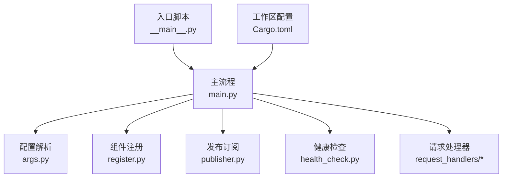
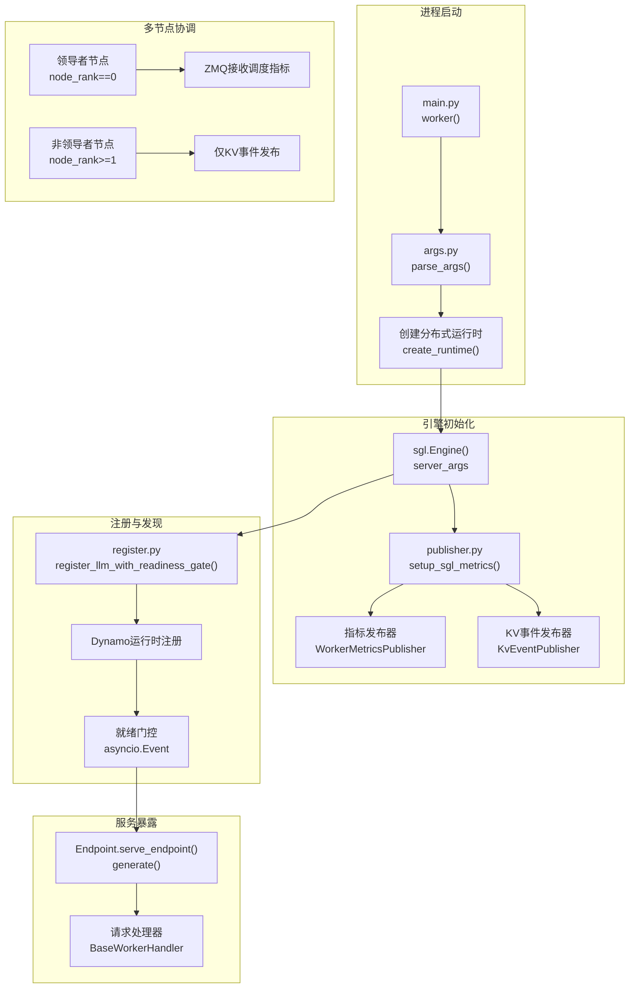
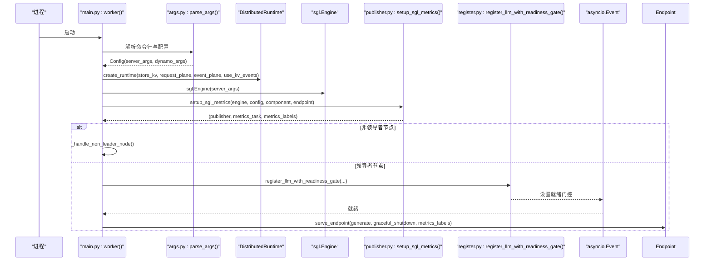
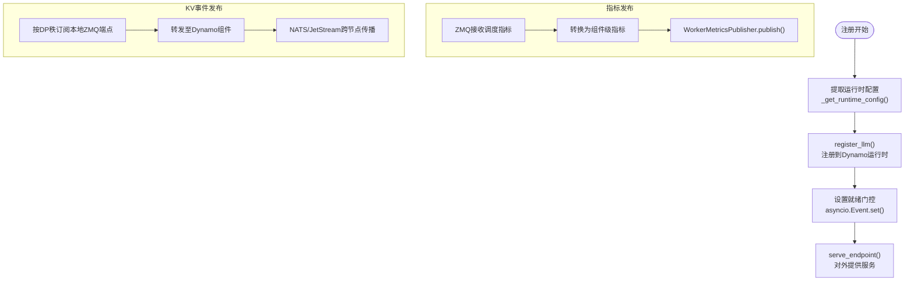
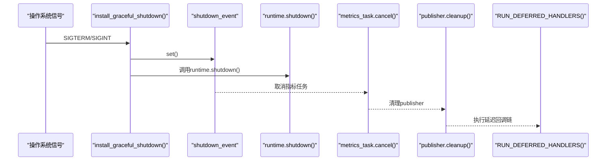
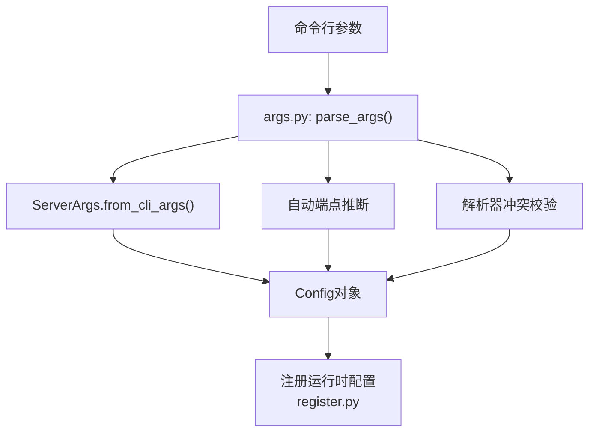
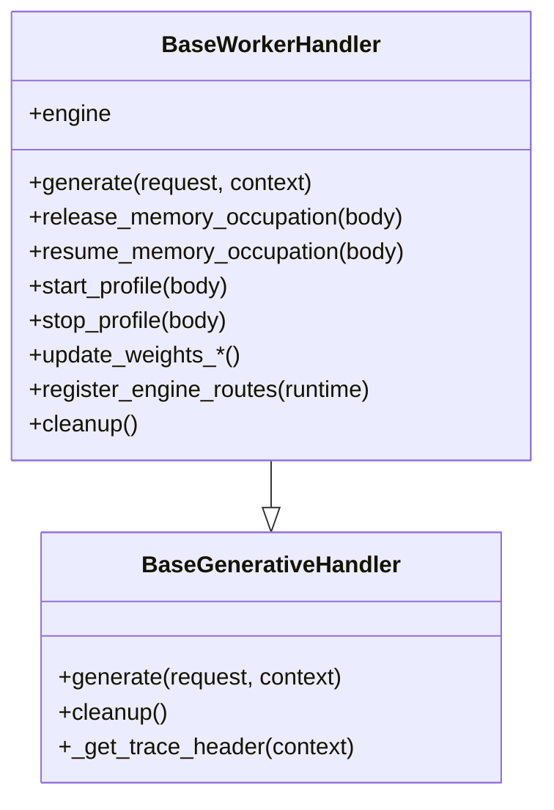
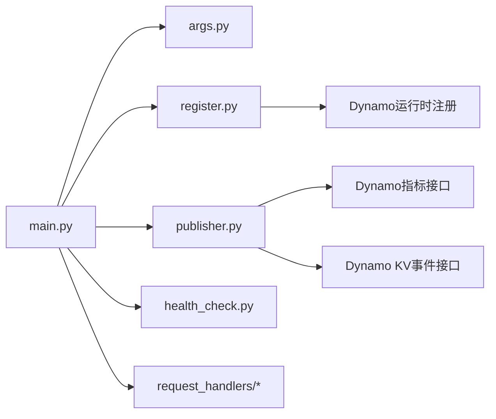

# SGLang核心架构

<cite>
**本文档引用的文件**
- [components/src/dynamo/sglang/__main__.py](file://components/src/dynamo/sglang/__main__.py)
- [components/src/dynamo/sglang/main.py](file://components/src/dynamo/sglang/main.py)
- [components/src/dynamo/sglang/register.py](file://components/src/dynamo/sglang/register.py)
- [components/src/dynamo/sglang/publisher.py](file://components/src/dynamo/sglang/publisher.py)
- [components/src/dynamo/sglang/args.py](file://components/src/dynamo/sglang/args.py)
- [components/src/dynamo/sglang/health_check.py](file://components/src/dynamo/sglang/health_check.py)
- [components/src/dynamo/sglang/request_handlers/__init__.py](file://components/src/dynamo/sglang/request_handlers/__init__.py)
- [components/src/dynamo/sglang/request_handlers/handler_base.py](file://components/src/dynamo/sglang/request_handlers/handler_base.py)
- [Cargo.toml](file://Cargo.toml)
</cite>

## 目录
1. [引言](#引言)
2. [项目结构](#项目结构)
3. [核心组件](#核心组件)
4. [架构总览](#架构总览)
5. [详细组件分析](#详细组件分析)
6. [依赖关系分析](#依赖关系分析)
7. [性能考虑](#性能考虑)
8. [故障排除指南](#故障排除指南)
9. [结论](#结论)

## 引言
本文件面向开发者与运维工程师，系统性阐述SGLang在Dynamo框架中的核心架构与实现细节。内容涵盖引擎初始化流程、组件注册机制与发布订阅模式、多节点并行处理（领导者与非领导者节点）、信号处理与优雅关闭、配置管理（命令行参数解析与运行时配置），并通过多种架构图与序列图帮助读者快速理解SGLang引擎的内部工作机制与最佳实践。

## 项目结构
SGLang后端位于components/src/dynamo/sglang目录，采用按功能域分层的组织方式：
- 入口与主流程：__main__.py与main.py负责进程启动、参数解析、运行时创建、组件初始化与生命周期管理
- 配置管理：args.py定义命令行参数、环境变量与运行时配置合并逻辑
- 组件注册：register.py负责将模型注册到Dynamo运行时，并提供就绪门控机制
- 发布订阅：publisher.py封装SGLang指标与KV事件的发布与订阅，支持多节点场景
- 健康检查：health_check.py为不同工作负载提供健康检查载荷
- 请求处理器：request_handlers目录包含各类工作负载的处理器基类与具体实现
- 工作区配置：Cargo.toml定义了Dynamo工作区的成员与依赖

**图表来源**
- [components/src/dynamo/sglang/__main__.py](file://components/src/dynamo/sglang/__main__.py#L1-L13)
- [components/src/dynamo/sglang/main.py](file://components/src/dynamo/sglang/main.py#L1-L888)
- [components/src/dynamo/sglang/args.py](file://components/src/dynamo/sglang/args.py#L1-L635)
- [components/src/dynamo/sglang/register.py](file://components/src/dynamo/sglang/register.py#L1-L315)
- [components/src/dynamo/sglang/publisher.py](file://components/src/dynamo/sglang/publisher.py#L1-L389)
- [components/src/dynamo/sglang/health_check.py](file://components/src/dynamo/sglang/health_check.py#L1-L147)
- [components/src/dynamo/sglang/request_handlers/__init__.py](file://components/src/dynamo/sglang/request_handlers/__init__.py#L1-L42)
- [Cargo.toml](file://Cargo.toml#L1-L147)

**章节来源**
- [components/src/dynamo/sglang/__main__.py](file://components/src/dynamo/sglang/__main__.py#L1-L13)
- [components/src/dynamo/sglang/main.py](file://components/src/dynamo/sglang/main.py#L1-L888)
- [Cargo.toml](file://Cargo.toml#L1-L147)

## 核心组件
- 进程入口与主流程
  - __main__.py：设置Python哈希种子并调用main函数
  - main.py：异步主流程，负责参数解析、运行时创建、信号处理、组件初始化与优雅关闭
- 配置系统
  - args.py：统一解析SGLang与Dynamo参数，支持嵌套配置文件、自动端点推断、工具解析器选择等
- 注册与发现
  - register.py：将模型注册到Dynamo运行时，构建运行时配置（如KV块数、批大小、最大并发等），提供就绪门控
- 指标与事件发布
  - publisher.py：封装ZMQ指标接收、组件级指标发布、KV事件订阅与转发，支持DP注意力模式下的多节点协调
- 健康检查
  - health_check.py：为解码、预填充、扩散等不同工作负载生成最小化健康检查载荷
- 请求处理器
  - handler_base.py：抽象基类，提供通用生成接口、内存占用释放/恢复、权重更新、取消监控等能力
  - request_handlers/__init__.py：导出各类处理器（解码、预填充、扩散、嵌入、多模态等）

**章节来源**
- [components/src/dynamo/sglang/main.py](file://components/src/dynamo/sglang/main.py#L1-L888)
- [components/src/dynamo/sglang/args.py](file://components/src/dynamo/sglang/args.py#L1-L635)
- [components/src/dynamo/sglang/register.py](file://components/src/dynamo/sglang/register.py#L1-L315)
- [components/src/dynamo/sglang/publisher.py](file://components/src/dynamo/sglang/publisher.py#L1-L389)
- [components/src/dynamo/sglang/health_check.py](file://components/src/dynamo/sglang/health_check.py#L1-L147)
- [components/src/dynamo/sglang/request_handlers/__init__.py](file://components/src/dynamo/sglang/request_handlers/__init__.py#L1-L42)
- [components/src/dynamo/sglang/request_handlers/handler_base.py](file://components/src/dynamo/sglang/request_handlers/handler_base.py#L1-L574)

## 架构总览
下图展示了SGLang在Dynamo中的端到端架构：进程启动后解析配置，创建分布式运行时，初始化SGLang引擎，建立指标与KV事件发布通道，随后根据服务模式（聚合/预填充/解码）注册组件并对外提供服务。多节点场景中，领导者节点负责调度与指标收集，非领导者节点仅参与本地DP秩的事件发布与度量汇总。

**图表来源**
- [components/src/dynamo/sglang/main.py](file://components/src/dynamo/sglang/main.py#L191-L407)
- [components/src/dynamo/sglang/args.py](file://components/src/dynamo/sglang/args.py#L308-L605)
- [components/src/dynamo/sglang/register.py](file://components/src/dynamo/sglang/register.py#L234-L275)
- [components/src/dynamo/sglang/publisher.py](file://components/src/dynamo/sglang/publisher.py#L332-L388)

## 详细组件分析

### 引擎初始化与多节点并行处理
- 初始化流程
  - 解析参数并创建分布式运行时
  - 根据服务模式（聚合/预填充/解码/扩散/嵌入/多模态）选择对应的初始化路径
  - 在所有节点上建立指标发布与KV事件发布通道
- 多节点差异
  - 领导者节点（node_rank==0）：接收SGLang调度器指标，发布GPU缓存使用率与总块数；非领导者节点：不接收调度指标，仅发布本地DP秩的KV事件
  - 通过环境变量控制非零节点的阻塞行为，确保非领导者节点仅作为调度器参与
- 预填充工作负载的热身
  - 领导者节点在初始化时进行一次空预热，避免首次TTFT尖峰

**图表来源**
- [components/src/dynamo/sglang/main.py](file://components/src/dynamo/sglang/main.py#L191-L407)
- [components/src/dynamo/sglang/publisher.py](file://components/src/dynamo/sglang/publisher.py#L332-L388)
- [components/src/dynamo/sglang/register.py](file://components/src/dynamo/sglang/register.py#L234-L275)

**章节来源**
- [components/src/dynamo/sglang/main.py](file://components/src/dynamo/sglang/main.py#L53-L87)
- [components/src/dynamo/sglang/main.py](file://components/src/dynamo/sglang/main.py#L235-L407)
- [components/src/dynamo/sglang/publisher.py](file://components/src/dynamo/sglang/publisher.py#L104-L122)

### 组件注册机制与发布订阅模式
- 注册流程
  - 从SGLang引擎提取运行时配置（推理解析器、工具调用解析器、本地索引器开关、数据并行规模、引导端点等）
  - 将模型注册到Dynamo运行时，同时发布运行时配置以供路由与发现
  - 提供就绪门控，确保前端在模型可用后再接受请求
- 发布订阅
  - 指标发布：ZMQ接收SGLang调度器指标，转换为组件级指标（总块数、GPU缓存使用率）
  - KV事件发布：按DP秩范围订阅本地ZMQ端点，将事件转发至Dynamo组件，跨节点由NATS/JetStream承载
  - 多节点一致性：通过本地索引器或持久化KV事件（JetStream）保障多副本路由器一致性

**图表来源**
- [components/src/dynamo/sglang/register.py](file://components/src/dynamo/sglang/register.py#L146-L231)
- [components/src/dynamo/sglang/register.py](file://components/src/dynamo/sglang/register.py#L234-L275)
- [components/src/dynamo/sglang/publisher.py](file://components/src/dynamo/sglang/publisher.py#L124-L188)
- [components/src/dynamo/sglang/publisher.py](file://components/src/dynamo/sglang/publisher.py#L199-L282)

**章节来源**
- [components/src/dynamo/sglang/register.py](file://components/src/dynamo/sglang/register.py#L18-L66)
- [components/src/dynamo/sglang/register.py](file://components/src/dynamo/sglang/register.py#L146-L231)
- [components/src/dynamo/sglang/publisher.py](file://components/src/dynamo/sglang/publisher.py#L65-L190)
- [components/src/dynamo/sglang/publisher.py](file://components/src/dynamo/sglang/publisher.py#L199-L282)

### 信号处理与优雅关闭机制
- 信号回调链
  - 使用自定义安装函数接管SIGTERM/SIGINT，记录回调并延迟执行，确保在事件循环线程安全地串行执行
  - 支持多次注册回调，形成可叠加的关闭链
- 关闭序列
  - 触发shutdown_event，调用runtime.shutdown()，取消指标任务，清理publisher与处理器
  - 执行已注册的延迟回调，保证资源有序释放
- 取消与中断
  - 请求级取消：通过上下文监控与SGLang请求ID，支持在生成过程中主动中止
  - 系统级关闭：统一触发，确保进程平滑退出

**图表来源**
- [components/src/dynamo/sglang/main.py](file://components/src/dynamo/sglang/main.py#L92-L188)

**章节来源**
- [components/src/dynamo/sglang/main.py](file://components/src/dynamo/sglang/main.py#L92-L188)
- [components/src/dynamo/sglang/request_handlers/handler_base.py](file://components/src/dynamo/sglang/request_handlers/handler_base.py#L439-L574)

### 配置管理系统
- 参数解析
  - 合并SGLang与Dynamo参数，支持嵌套YAML配置抽取、临时文件处理、布尔动作兼容
  - 自动推断端点（backend/generate、prefill/generate、processor/generate等）
  - 校验解析器冲突（Dynamo与SGLang解析器不可同时启用）
- 运行时配置
  - 从SGLang引擎与server_args提取运行时配置（推理/工具解析器、本地索引器、数据并行规模、引导端点、批大小、最大并发等）
  - 通过注册流程发布到Dynamo运行时，供路由与发现使用

**图表来源**
- [components/src/dynamo/sglang/args.py](file://components/src/dynamo/sglang/args.py#L308-L605)
- [components/src/dynamo/sglang/register.py](file://components/src/dynamo/sglang/register.py#L146-L231)

**章节来源**
- [components/src/dynamo/sglang/args.py](file://components/src/dynamo/sglang/args.py#L308-L605)
- [components/src/dynamo/sglang/register.py](file://components/src/dynamo/sglang/register.py#L146-L231)

### 请求处理器与工作负载类型
- 基类能力
  - 通用生成接口、输入参数管理、内存占用释放/恢复、权重在线更新、性能剖析、取消监控
- 工作负载类型
  - 解码/预填充/扩散/嵌入/多模态处理器：根据服务模式与组件角色选择对应实现
  - 多模态内部组件：编码器、处理器、解码器等，通过内部端点协作完成端到端流水线

**图表来源**
- [components/src/dynamo/sglang/request_handlers/handler_base.py](file://components/src/dynamo/sglang/request_handlers/handler_base.py#L21-L72)
- [components/src/dynamo/sglang/request_handlers/handler_base.py](file://components/src/dynamo/sglang/request_handlers/handler_base.py#L89-L371)

**章节来源**
- [components/src/dynamo/sglang/request_handlers/handler_base.py](file://components/src/dynamo/sglang/request_handlers/handler_base.py#L1-L574)
- [components/src/dynamo/sglang/request_handlers/__init__.py](file://components/src/dynamo/sglang/request_handlers/__init__.py#L1-L42)

## 依赖关系分析
- 内部模块耦合
  - main.py依赖args.py、register.py、publisher.py、health_check.py与request_handlers
  - publisher.py依赖Dynamo的指标与KV事件发布接口
  - register.py依赖Dynamo运行时注册API与SGLang引擎信息
- 外部依赖
  - SGLang引擎与ZMQ用于指标与事件传输
  - Prometheus用于指标聚合与导出
  - NATS/JetStream用于跨节点事件传播

**图表来源**
- [components/src/dynamo/sglang/main.py](file://components/src/dynamo/sglang/main.py#L23-L46)
- [components/src/dynamo/sglang/publisher.py](file://components/src/dynamo/sglang/publisher.py#L19-L28)
- [components/src/dynamo/sglang/register.py](file://components/src/dynamo/sglang/register.py#L13-L15)

**章节来源**
- [components/src/dynamo/sglang/main.py](file://components/src/dynamo/sglang/main.py#L1-L888)
- [components/src/dynamo/sglang/publisher.py](file://components/src/dynamo/sglang/publisher.py#L1-L389)
- [components/src/dynamo/sglang/register.py](file://components/src/dynamo/sglang/register.py#L1-L315)

## 性能考虑
- 指标与事件开销
  - 仅在启用指标时初始化SGLang多进程指标收集，避免不必要的开销
  - KV事件发布按DP秩范围订阅，减少跨节点网络压力
- 预填充热身
  - 领导者节点预填充一次，降低首次TTFT
- 并行与调度
  - DP注意力模式下，按节点均分DP秩，最大化本地事件处理与最小化跨节点通信
- 流式输出
  - 强制流式输出，减少累积令牌带来的额外处理成本

## 故障排除指南
- 模型注册失败
  - 检查server_args与dynamo_args配置是否正确，确认解析器冲突与端点类型匹配
  - 查看注册日志与异常堆栈，必要时调整KV事件配置或禁用持久化事件
- 指标未显示
  - 确认SGLang以启用指标模式启动，且PROMETHEUS_MULTIPROC_DIR已设置
  - 检查ZMQ端点格式与IPv6地址括号包裹
- 多节点事件丢失
  - 核对KV事件配置中的publisher字段，确保非空
  - 检查NATS/JetStream连接状态与持久化策略
- 优雅关闭异常
  - 确保所有回调通过add_signal_handler注册，避免遗漏
  - 检查publisher与处理器的cleanup是否被调用

**章节来源**
- [components/src/dynamo/sglang/register.py](file://components/src/dynamo/sglang/register.py#L265-L274)
- [components/src/dynamo/sglang/publisher.py](file://components/src/dynamo/sglang/publisher.py#L352-L353)
- [components/src/dynamo/sglang/publisher.py](file://components/src/dynamo/sglang/publisher.py#L251-L273)
- [components/src/dynamo/sglang/main.py](file://components/src/dynamo/sglang/main.py#L123-L142)

## 结论
SGLang在Dynamo中的核心架构围绕“统一配置、动态注册、发布订阅、多节点协同”展开。通过清晰的初始化流程、严格的就绪门控与优雅关闭机制，以及针对不同工作负载的处理器抽象，系统实现了高可用、可观测与可扩展的推理服务。建议在生产部署中结合DP注意力模式与NATS JetStream，以获得更好的多副本一致性与跨节点事件传播效果。