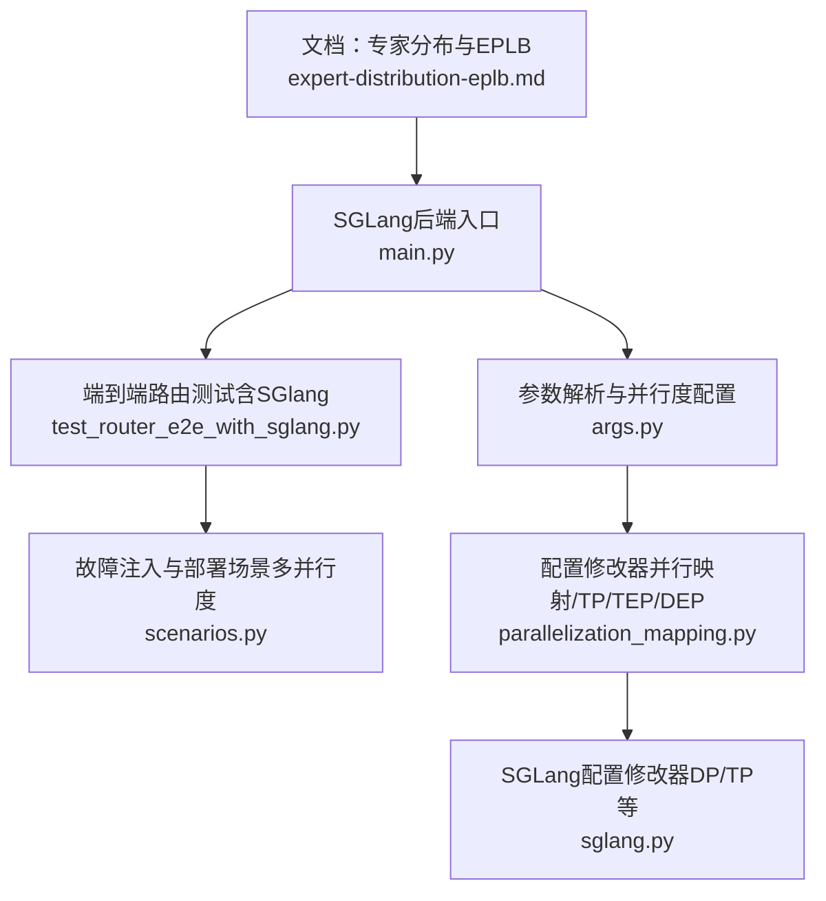

# 专家分布与负载均衡

<cite>
**本文引用的文件**
- [expert-distribution-eplb.md](file://docs/pages/backends/sglang/expert-distribution-eplb.md)
- [args.py](file://components/src/dynamo/sglang/args.py)
- [main.py](file://components/src/dynamo/sglang/main.py)
- [test_router_e2e_with_sglang.py](file://tests/router/test_router_e2e_with_sglang.py)
- [scenarios.py](file://tests/fault_tolerance/deploy/scenarios.py)
- [parallelization_mapping.py](file://benchmarks/profiler/utils/config_modifiers/parallelization_mapping.py)
- [sglang.py](file://benchmarks/profiler/utils/config_modifiers/sglang.py)
</cite>

## 目录
1. [引言](#引言)
2. [项目结构](#项目结构)
3. [核心组件](#核心组件)
4. [架构总览](#架构总览)
5. [组件详解](#组件详解)
6. [依赖关系分析](#依赖关系分析)
7. [性能考量](#性能考量)
8. [故障排查指南](#故障排查指南)
9. [结论](#结论)
10. [附录](#附录)

## 引言
本文件面向SGLang在MoE（Mixture-of-Experts）场景下的专家分布与EPLB（Expert Parallelism Load Balancer）机制，系统性阐述专家模型的划分策略、通信与路由、动态负载均衡与故障转移、训练与部署流程、性能影响与优化方法，并给出配置参数、监控指标与调优建议及实际部署案例与排障经验。

## 项目结构
围绕专家分布与EPLB，本仓库中与SGLang后端相关的结构要点如下：
- 文档：专家分布与EPLB的背景、策略与实现要点集中在文档页。
- 后端入口与参数解析：SGLang后端通过统一入口启动，参数解析与并行度配置由参数模块负责。
- 测试与示例：包含端到端路由测试与多节点/多并行度部署场景，体现专家并行与数据并行的组合使用。

**图示来源**
- [expert-distribution-eplb.md](file://docs/pages/backends/sglang/expert-distribution-eplb.md#L1-L62)
- [main.py](file://components/src/dynamo/sglang/main.py#L1-L888)
- [args.py](file://components/src/dynamo/sglang/args.py#L1-L635)
- [test_router_e2e_with_sglang.py](file://tests/router/test_router_e2e_with_sglang.py#L392-L415)
- [scenarios.py](file://tests/fault_tolerance/deploy/scenarios.py#L402-L435)
- [parallelization_mapping.py](file://benchmarks/profiler/utils/config_modifiers/parallelization_mapping.py#L82-L250)
- [sglang.py](file://benchmarks/profiler/utils/config_modifiers/sglang.py#L225-L259)

**章节来源**
- [expert-distribution-eplb.md](file://docs/pages/backends/sglang/expert-distribution-eplb.md#L1-L62)
- [main.py](file://components/src/dynamo/sglang/main.py#L1-L888)
- [args.py](file://components/src/dynamo/sglang/args.py#L1-L635)
- [test_router_e2e_with_sglang.py](file://tests/router/test_router_e2e_with_sglang.py#L392-L415)
- [scenarios.py](file://tests/fault_tolerance/deploy/scenarios.py#L402-L435)
- [parallelization_mapping.py](file://benchmarks/profiler/utils/config_modifiers/parallelization_mapping.py#L82-L250)
- [sglang.py](file://benchmarks/profiler/utils/config_modifiers/sglang.py#L225-L259)

## 核心组件
- 专家分布与EPLB策略
  - 冗余专家：为高负载专家创建副本，扩大可调度池，提升局部平衡能力。
  - 分组受限路由：利用专家分组特性，优先同组专家落至同一节点，降低跨节点流量。
  - 负载均衡策略：分层均衡（节点数整除专家组时）与全局均衡（其他情况），分别适配prefill与decode阶段。
- SGLang后端实现要点
  - 动态重平衡：通过后台管理器周期性触发，依据统计更新专家位置。
  - 专家使用记录：支持per_token/per_pass/stat/stat_approx等模式，stat默认用于EPLB。
  - 预置布局：支持从文件或JSON字符串加载初始专家布局，加速收敛。
- 并行度与资源映射
  - 支持TP/TEP/DEP等并行维度，结合GPU数量与节点拓扑进行合理映射。

**章节来源**
- [expert-distribution-eplb.md](file://docs/pages/backends/sglang/expert-distribution-eplb.md#L12-L62)
- [args.py](file://components/src/dynamo/sglang/args.py#L308-L606)
- [parallelization_mapping.py](file://benchmarks/profiler/utils/config_modifiers/parallelization_mapping.py#L82-L250)
- [sglang.py](file://benchmarks/profiler/utils/config_modifiers/sglang.py#L225-L259)

## 架构总览
下图展示SGLang后端在专家分布与EPLB场景下的关键交互：请求经路由进入后端，后端根据专家布局执行推理；EPLB后台周期性收集统计并调整专家位置；测试与部署场景覆盖单机/多机、不同并行度组合。

**图示来源**
- [main.py](file://components/src/dynamo/sglang/main.py#L235-L407)
- [expert-distribution-eplb.md](file://docs/pages/backends/sglang/expert-distribution-eplb.md#L32-L52)
- [test_router_e2e_with_sglang.py](file://tests/router/test_router_e2e_with_sglang.py#L392-L415)
- [scenarios.py](file://tests/fault_tolerance/deploy/scenarios.py#L402-L435)

## 组件详解

### EPLB算法与实现
- 策略要点
  - 冗余专家：为热门专家复制，形成更大可调度池，便于局部打包。
  - 分组受限路由：优先将同组专家放置于同一节点，减少跨节点通信。
  - 分层/全局策略：按节点数与专家组关系选择策略，适配prefill与decode。
- 实现路径
  - 动态重平衡：后台管理器周期触发，基于统计生成新布局并更新引擎。
  - 使用统计：支持多种粒度模式，stat默认用于EPLB，stat_approx用于低开销近似统计。
  - 初始化布局：支持从文件或JSON加载预置布局，加速收敛。

**图示来源**
- [expert-distribution-eplb.md](file://docs/pages/backends/sglang/expert-distribution-eplb.md#L24-L52)

**章节来源**
- [expert-distribution-eplb.md](file://docs/pages/backends/sglang/expert-distribution-eplb.md#L12-L62)

### SGLang后端入口与并行度配置
- 入口流程
  - 解析参数（含SGLang与Dynamo参数），设置流式输出、令牌化策略、端点类型等。
  - 根据服务模式（解码/预填充/扩散/嵌入/多模态）初始化对应处理器与端点。
  - 设置信号处理与优雅停机，注册健康检查与指标发布。
- 并行度与资源
  - 支持TP/TEP/DEP等维度，结合GPU数量与节点拓扑进行映射。
  - 在配置修改器中统一设置并行参数，移除冲突项，确保运行时一致性。

**图示来源**
- [args.py](file://components/src/dynamo/sglang/args.py#L308-L606)
- [main.py](file://components/src/dynamo/sglang/main.py#L191-L234)

**章节来源**
- [args.py](file://components/src/dynamo/sglang/args.py#L308-L606)
- [main.py](file://components/src/dynamo/sglang/main.py#L191-L234)

### 端到端路由与多并行度部署
- 端到端测试
  - 在单GPU上启动多个SGLang工作进程，验证路由决策与负载分发。
- 多并行度场景
  - 支持不同TP/DP组合，覆盖聚合与拆分部署形态，便于评估专家并行与数据并行的协同。

**图示来源**
- [test_router_e2e_with_sglang.py](file://tests/router/test_router_e2e_with_sglang.py#L392-L415)
- [scenarios.py](file://tests/fault_tolerance/deploy/scenarios.py#L402-L435)

**章节来源**
- [test_router_e2e_with_sglang.py](file://tests/router/test_router_e2e_with_sglang.py#L392-L415)
- [scenarios.py](file://tests/fault_tolerance/deploy/scenarios.py#L402-L435)

## 依赖关系分析
- 参数解析与配置
  - SGLang参数与Dynamo参数合并，衍生服务模式与端点类型，决定后端初始化分支。
- 并行度映射
  - 并行映射工具将逻辑并行策略映射到具体参数（TP/TEP/DEP），并与节点GPU数匹配。
- 运行时与发布
  - 后端统一接入分布式运行时，发布KV事件与Prometheus指标，支撑可观测性与一致性。

**图示来源**
- [args.py](file://components/src/dynamo/sglang/args.py#L308-L606)
- [main.py](file://components/src/dynamo/sglang/main.py#L235-L407)
- [parallelization_mapping.py](file://benchmarks/profiler/utils/config_modifiers/parallelization_mapping.py#L224-L250)
- [sglang.py](file://benchmarks/profiler/utils/config_modifiers/sglang.py#L225-L259)

**章节来源**
- [args.py](file://components/src/dynamo/sglang/args.py#L308-L606)
- [main.py](file://components/src/dynamo/sglang/main.py#L235-L407)
- [parallelization_mapping.py](file://benchmarks/profiler/utils/config_modifiers/parallelization_mapping.py#L224-L250)
- [sglang.py](file://benchmarks/profiler/utils/config_modifiers/sglang.py#L225-L259)

## 性能考量
- 专家使用统计模式
  - per_token：最细粒度，统计开销最高；适合离线分析与小规模在线调试。
  - per_pass：每轮聚合，兼顾实时性与开销。
  - stat：移动窗口聚合，EPLB默认模式，平衡精度与开销。
  - stat_approx：近似统计，低开销但精度随批量下降，适合高吞吐场景。
- 策略选择
  - 分层策略在节点数整除专家组时更优，减少跨节点流量。
  - 全局策略适用于一般情况，尤其在decode阶段专家并行更大时。
- 并行度与资源
  - 合理设置TP/TEP/DEP，避免过度拆分导致通信放大。
  - 结合GPU数量与节点拓扑，优先保证专家组内局部平衡。

[本节为通用指导，无需列出“章节来源”]

## 故障排查指南
- 健康检查与优雅停机
  - 后端设置健康检查负载，安装信号处理器以链式执行清理回调，确保停机过程可控。
- 端到端路由问题
  - 使用端到端测试验证路由决策与负载分发，定位单机多进程场景下的调度异常。
- 多并行度部署异常
  - 检查并行度映射是否与节点GPU数匹配，确认配置修改器已正确移除冲突参数。
- EPLB相关问题
  - 若统计模式过高导致延迟上升，切换为stat_approx或降低聚合窗口。
  - 若专家分布长期不均衡，检查策略选择与重平衡频率。

**章节来源**
- [main.py](file://components/src/dynamo/sglang/main.py#L92-L188)
- [test_router_e2e_with_sglang.py](file://tests/router/test_router_e2e_with_sglang.py#L392-L415)
- [sglang.py](file://benchmarks/profiler/utils/config_modifiers/sglang.py#L225-L259)

## 结论
SGLang在MoE场景下的专家分布与EPLB机制通过冗余专家、分组受限路由与分层/全局策略，实现了动态、在线的专家位置重平衡。配合灵活的统计模式与并行度映射，系统可在不同阶段与规模下取得更优的吞吐与延迟表现。结合可观测性与端到端测试，可快速定位并解决部署与运行中的问题。

[本节为总结性内容，无需列出“章节来源”]

## 附录

### 关键参数与配置
- 启用EPLB与重平衡频率
  - --enable-eplb：启用EPLB后台管理器。
  - --eplb-rebalance-num-iterations：重平衡触发间隔（请求次数）。
- 专家使用统计模式
  - --expert-distribution-recorder-mode：per_token/per_pass/stat/stat_approx。
  - --expert-distribution-recorder-buffer-size：stat模式的聚合窗口大小。
- 初始专家布局
  - --init-expert-location：指定.pt/.json文件或JSON字符串作为初始布局。
- 并行度与资源
  - --tp/--dp/--tep：张量/数据/专家并行大小。
  - 配置修改器会根据节点GPU数与并行策略进行资源与参数校正。

**章节来源**
- [expert-distribution-eplb.md](file://docs/pages/backends/sglang/expert-distribution-eplb.md#L36-L56)
- [args.py](file://components/src/dynamo/sglang/args.py#L308-L606)
- [sglang.py](file://benchmarks/profiler/utils/config_modifiers/sglang.py#L225-L259)

### 监控指标与可观测性
- 指标发布
  - 后端统一发布Prometheus指标，便于跟踪吞吐、延迟与资源利用率。
- KV事件
  - 发布KV事件以支撑多副本一致性与事件平面协调。
- 健康检查
  - 提供健康检查负载，保障就绪门控与探活准确性。

**章节来源**
- [main.py](file://components/src/dynamo/sglang/main.py#L255-L263)

### 实际部署案例
- 单机多进程（单GPU）
  - 在同一GPU上启动多个工作进程，验证路由与负载分发。
- 多并行度组合
  - TP=1/2/4 与 DP=1/2 的组合，覆盖聚合与拆分部署形态，便于对比专家并行与数据并行的协同效果。

**章节来源**
- [test_router_e2e_with_sglang.py](file://tests/router/test_router_e2e_with_sglang.py#L392-L415)
- [scenarios.py](file://tests/fault_tolerance/deploy/scenarios.py#L402-L435)