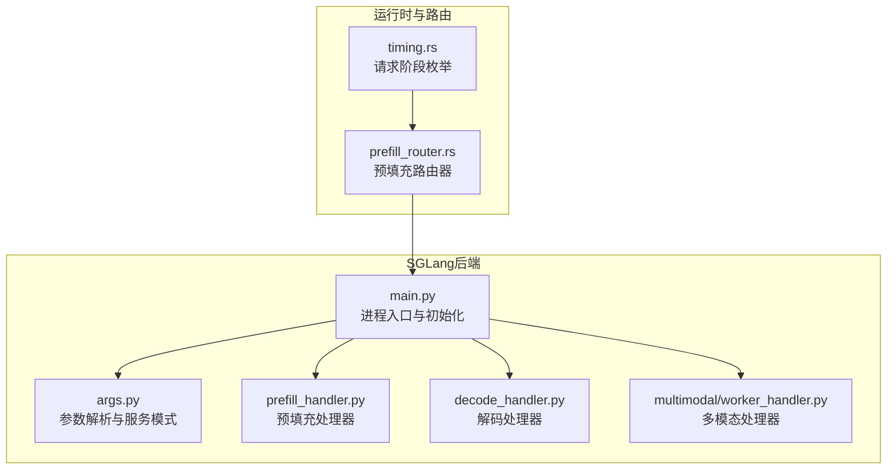
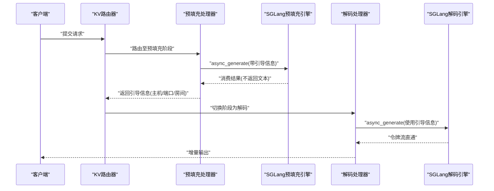
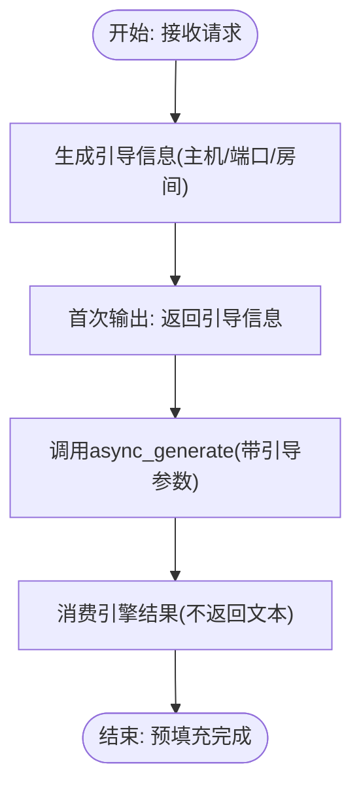
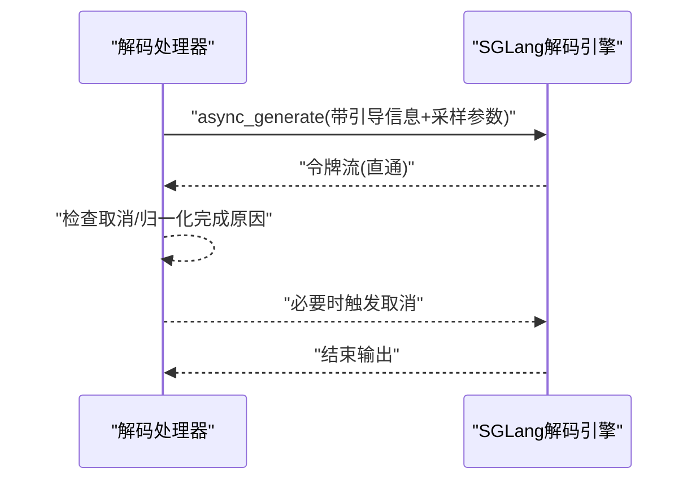
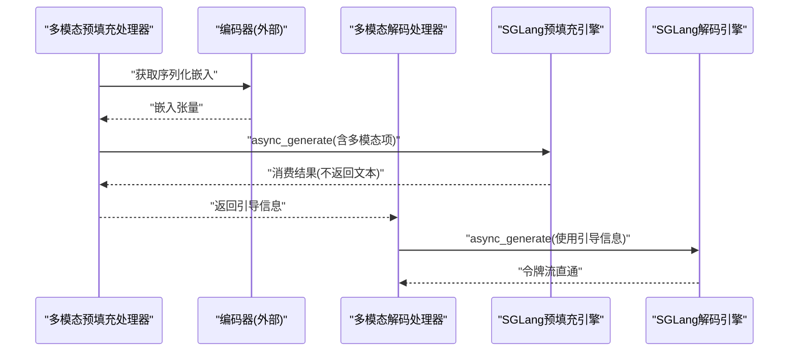
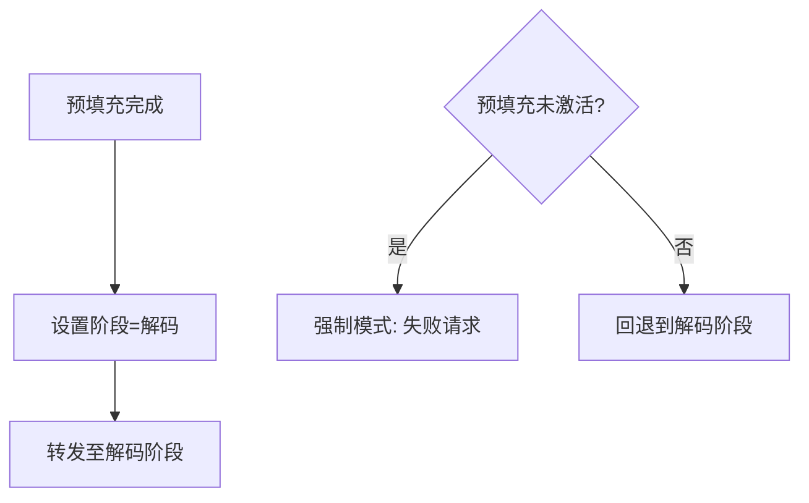
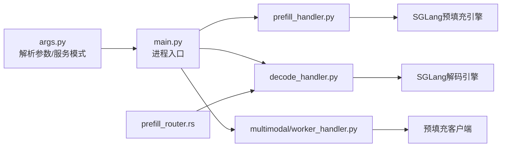

# 分割式推理支持

<cite>
**本文档引用的文件**
- [components/src/dynamo/sglang/main.py](file://components/src/dynamo/sglang/main.py)
- [components/src/dynamo/sglang/args.py](file://components/src/dynamo/sglang/args.py)
- [components/src/dynamo/sglang/request_handlers/llm/prefill_handler.py](file://components/src/dynamo/sglang/request_handlers/llm/prefill_handler.py)
- [components/src/dynamo/sglang/request_handlers/llm/decode_handler.py](file://components/src/dynamo/sglang/request_handlers/llm/decode_handler.py)
- [components/src/dynamo/sglang/request_handlers/multimodal/worker_handler.py](file://components/src/dynamo/sglang/request_handlers/multimodal/worker_handler.py)
- [lib/llm/src/kv_router/prefill_router.rs](file://lib/llm/src/kv_router/prefill_router.rs)
- [lib/llm/src/protocols/common/timing.rs](file://lib/llm/src/protocols/common/timing.rs)
- [examples/backends/sglang/launch/disagg_same_gpu.sh](file://examples/backends/sglang/launch/disagg_same_gpu.sh)
- [examples/backends/sglang/slurm_jobs/job_script_template_disagg.j2](file://examples/backends/sglang/slurm_jobs/job_script_template_disagg.j2)
- [docs/pages/performance/tuning.md](file://docs/pages/performance/tuning.md)
</cite>

## 目录
1. [简介](#简介)
2. [项目结构](#项目结构)
3. [核心组件](#核心组件)
4. [架构总览](#架构总览)
5. [详细组件分析](#详细组件分析)
6. [依赖关系分析](#依赖关系分析)
7. [性能考量](#性能考量)
8. [故障排查指南](#故障排查指南)
9. [结论](#结论)
10. [附录](#附录)

## 简介
本文件系统性阐述 Dynamo 中对 SGLang 的分割式（解码分离）推理支持，覆盖预填充（Prefill）与解码（Decode）阶段的独立调度、GPU 内存优化策略、吞吐量提升方法、配置参数与部署选项、监控指标与性能基准测试、以及迁移策略与最佳实践。通过解析关键实现文件，我们将展示从请求进入、路由到预填充、再到解码的完整链路，并给出面向生产的调优建议。

## 项目结构
围绕 SGLang 分割式推理的关键代码位于以下模块：
- 后端入口与初始化：负责根据服务模式选择预填充或解码工作进程，设置度量与事件发布，处理多节点并行。
- 请求处理器：分别实现预填充与解码工作进程的生成逻辑，支持聚合与分割两种模式。
- 多模态支持：在图像等多模态场景下，预填充阶段完成视觉编码，解码阶段仅进行文本生成。
- 路由器与阶段标识：KV 路由器在预填充完成后切换请求阶段，确保后续流量正确进入解码阶段。
- 配置与参数：统一解析 SGLang 与 Dynamo 的参数，自动推断端点与服务名，支持调试配置导出。

**图表来源**
- [components/src/dynamo/sglang/main.py](file://components/src/dynamo/sglang/main.py#L191-L233)
- [components/src/dynamo/sglang/args.py](file://components/src/dynamo/sglang/args.py#L195-L218)
- [components/src/dynamo/sglang/request_handlers/llm/prefill_handler.py](file://components/src/dynamo/sglang/request_handlers/llm/prefill_handler.py#L16-L47)
- [components/src/dynamo/sglang/request_handlers/llm/decode_handler.py](file://components/src/dynamo/sglang/request_handlers/llm/decode_handler.py#L18-L54)
- [components/src/dynamo/sglang/request_handlers/multimodal/worker_handler.py](file://components/src/dynamo/sglang/request_handlers/multimodal/worker_handler.py#L242-L274)
- [lib/llm/src/kv_router/prefill_router.rs](file://lib/llm/src/kv_router/prefill_router.rs#L593-L623)
- [lib/llm/src/protocols/common/timing.rs](file://lib/llm/src/protocols/common/timing.rs#L36-L58)

**章节来源**
- [components/src/dynamo/sglang/main.py](file://components/src/dynamo/sglang/main.py#L191-L233)
- [components/src/dynamo/sglang/args.py](file://components/src/dynamo/sglang/args.py#L195-L218)

## 核心组件
- 进程入口与初始化
  - 根据服务模式（聚合/预填充/解码）选择不同的初始化流程；非主节点仅运行调度与事件发布；支持优雅停机与信号链式回调。
- 参数解析与服务模式
  - 解析 SGLang 与 Dynamo 的混合参数，自动推断端点名称与服务模式；支持自定义模板、分发平面、事件平面、KV 存储等。
- 预填充处理器
  - 生成预填充阶段的引导信息（主机、端口、房间号），随后消费引擎输出但不直接返回文本内容，保证与解码阶段的连接建立。
- 解码处理器
  - 在聚合模式下直接生成；在解码分离模式下使用来自预填充的引导信息进行连接，支持令牌流直通与取消监控。
- 多模态处理器
  - 支持图像等多模态输入；在解码分离模式下，预填充阶段完成视觉编码，解码阶段仅使用嵌入与令牌序列。
- 预填充路由器
  - 在预填充完成后将请求阶段切换为解码，确保后续流量进入解码阶段；若预填充未激活或失败，在强制模式下失败请求，在非强制模式下回退到解码阶段。

**章节来源**
- [components/src/dynamo/sglang/main.py](file://components/src/dynamo/sglang/main.py#L235-L407)
- [components/src/dynamo/sglang/args.py](file://components/src/dynamo/sglang/args.py#L308-L605)
- [components/src/dynamo/sglang/request_handlers/llm/prefill_handler.py](file://components/src/dynamo/sglang/request_handlers/llm/prefill_handler.py#L60-L139)
- [components/src/dynamo/sglang/request_handlers/llm/decode_handler.py](file://components/src/dynamo/sglang/request_handlers/llm/decode_handler.py#L93-L191)
- [components/src/dynamo/sglang/request_handlers/multimodal/worker_handler.py](file://components/src/dynamo/sglang/request_handlers/multimodal/worker_handler.py#L288-L421)
- [lib/llm/src/kv_router/prefill_router.rs](file://lib/llm/src/kv_router/prefill_router.rs#L593-L667)

## 架构总览
下图展示了从请求进入、预填充、到解码的整体流程，以及关键组件之间的交互关系。

**图表来源**
- [components/src/dynamo/sglang/request_handlers/llm/prefill_handler.py](file://components/src/dynamo/sglang/request_handlers/llm/prefill_handler.py#L124-L139)
- [components/src/dynamo/sglang/request_handlers/llm/decode_handler.py](file://components/src/dynamo/sglang/request_handlers/llm/decode_handler.py#L137-L147)
- [lib/llm/src/kv_router/prefill_router.rs](file://lib/llm/src/kv_router/prefill_router.rs#L603-L623)

## 详细组件分析

### 预填充阶段（Prefill）
- 引导信息生成
  - 预填充处理器生成引导信息（主机、端口、房间号），并在首次输出中返回给前端，确保解码阶段能正确连接。
- 结果消费
  - 预填充阶段不直接返回文本，而是消费引擎输出以建立连接并准备 KV 块，避免在预填充阶段占用解码资源。
- 取消与追踪
  - 使用取消监控机制，当请求被取消时，SGLang 引擎会自动终止异步生成器，释放 GPU 资源。

**图表来源**
- [components/src/dynamo/sglang/request_handlers/llm/prefill_handler.py](file://components/src/dynamo/sglang/request_handlers/llm/prefill_handler.py#L105-L139)

**章节来源**
- [components/src/dynamo/sglang/request_handlers/llm/prefill_handler.py](file://components/src/dynamo/sglang/request_handlers/llm/prefill_handler.py#L60-L139)

### 解码阶段（Decode）
- 聚合模式
  - 解码处理器直接调用引擎进行生成，支持令牌流直通与文本流格式化输出。
- 分离模式
  - 解码处理器使用来自预填充的引导信息进行连接，确保 KV 块与状态一致；支持数据并行秩（dp_rank）传递。
- 取消与追踪
  - 解码阶段同样具备取消监控，保证在请求取消时及时退出并清理资源。

**图表来源**
- [components/src/dynamo/sglang/request_handlers/llm/decode_handler.py](file://components/src/dynamo/sglang/request_handlers/llm/decode_handler.py#L137-L154)

**章节来源**
- [components/src/dynamo/sglang/request_handlers/llm/decode_handler.py](file://components/src/dynamo/sglang/request_handlers/llm/decode_handler.py#L93-L191)

### 多模态分割式推理
- 预填充阶段
  - 多模态预填充处理器接收序列化的嵌入，构建多模态项，调用引擎进行预填充，仅生成引导信息与内部结果消费。
- 解码阶段
  - 多模态解码处理器从预填充客户端获取引导信息，直接进行解码生成，避免重复视觉编码。
- 嵌入处理
  - 使用 NIXL 连接器读取嵌入张量，确保设备与形状匹配，避免对齐错误。

**图表来源**
- [components/src/dynamo/sglang/request_handlers/multimodal/worker_handler.py](file://components/src/dynamo/sglang/request_handlers/multimodal/worker_handler.py#L453-L476)
- [components/src/dynamo/sglang/request_handlers/multimodal/worker_handler.py](file://components/src/dynamo/sglang/request_handlers/multimodal/worker_handler.py#L324-L340)

**章节来源**
- [components/src/dynamo/sglang/request_handlers/multimodal/worker_handler.py](file://components/src/dynamo/sglang/request_handlers/multimodal/worker_handler.py#L288-L421)

### 预填充路由器与阶段切换
- 预填充完成后，路由器将请求阶段切换为解码，确保后续流量进入解码阶段。
- 若预填充未激活或远程预填充失败，路由器可按强制模式失败请求，或在非强制模式下回退到解码阶段。

**图表来源**
- [lib/llm/src/kv_router/prefill_router.rs](file://lib/llm/src/kv_router/prefill_router.rs#L603-L667)

**章节来源**
- [lib/llm/src/kv_router/prefill_router.rs](file://lib/llm/src/kv_router/prefill_router.rs#L593-L667)

## 依赖关系分析
- 服务模式与端点
  - 服务模式由 SGLang 的分割式模式决定，Dynamo 自动推断端点名称（如预填充/解码/后端）。
- 进程初始化
  - 入口根据模式选择初始化路径，非主节点仅运行调度与事件发布，主节点注册健康检查与度量。
- 多模态与外部编码器
  - 多模态解码阶段依赖预填充客户端提供的引导信息，预填充阶段依赖外部编码器提供的嵌入。

**图表来源**
- [components/src/dynamo/sglang/args.py](file://components/src/dynamo/sglang/args.py#L438-L452)
- [components/src/dynamo/sglang/main.py](file://components/src/dynamo/sglang/main.py#L223-L232)
- [components/src/dynamo/sglang/request_handlers/multimodal/worker_handler.py](file://components/src/dynamo/sglang/request_handlers/multimodal/worker_handler.py#L393-L416)

**章节来源**
- [components/src/dynamo/sglang/args.py](file://components/src/dynamo/sglang/args.py#L438-L452)
- [components/src/dynamo/sglang/main.py](file://components/src/dynamo/sglang/main.py#L223-L232)

## 性能考量
- GPU 内存优化
  - Dynamo 当前在解码引擎获取请求时立即分配 KV 块，建议尽可能减少预填充引擎数量（甚至无预填充引擎），以最大化解码引擎可用的 KV 缓存。
  - 通过设置较大的本地预填充长度，可在解码引擎上“搭车”更多预填充请求，减少排队。
- 吞吐量提升策略
  - 预填充阶段与解码阶段独立调度，允许在不同 GPU 上并行运行，提高整体吞吐。
  - 对于多模态场景，预填充阶段完成视觉编码，解码阶段仅进行文本生成，降低重复计算。
- 流输出优化
  - Dynamo 强制启用流输出（stream_output=True），SGLang 发送“离散片段”（仅新增 token），处理器直接透传，减少额外处理开销。

**章节来源**
- [docs/pages/performance/tuning.md](file://docs/pages/performance/tuning.md#L134-L137)
- [components/src/dynamo/sglang/request_handlers/llm/decode_handler.py](file://components/src/dynamo/sglang/request_handlers/llm/decode_handler.py#L508-L519)

## 故障排查指南
- 预填充阶段取消
  - 若在预填充阶段取消请求，解码阶段不应收到该请求；可通过日志确认 decode 工作者是否收到请求 ID。
- 引导信息缺失
  - 解码分离模式下，若未提供引导信息，将抛出异常；请检查预填充阶段是否成功返回引导信息。
- 多模态对齐问题
  - 嵌入形状不匹配通常表示令牌化变化导致的对齐问题；检查输入 token 数量与嵌入形状，确保一致性。
- 单 GPU 分割式测试
  - 提供脚本用于在同一 GPU 上运行分割式模式的最小化测试，检查 GPU 内存是否满足要求。

**章节来源**
- [components/src/dynamo/sglang/request_handlers/llm/decode_handler.py](file://components/src/dynamo/sglang/request_handlers/llm/decode_handler.py#L117-L120)
- [components/src/dynamo/sglang/request_handlers/multimodal/worker_handler.py](file://components/src/dynamo/sglang/request_handlers/multimodal/worker_handler.py#L376-L391)
- [examples/backends/sglang/launch/disagg_same_gpu.sh](file://examples/backends/sglang/launch/disagg_same_gpu.sh#L1-L36)

## 结论
SGLang 在 Dynamo 中的分割式推理通过预填充与解码的独立调度，实现了更灵活的 GPU 内存利用与更高的吞吐量。配合 KV 路由器的阶段切换、流输出直通与多模态嵌入复用，系统在复杂场景下仍保持高效与稳定。生产部署应关注服务模式选择、端点命名、引导信息完整性与多模态对齐问题，并结合性能调优建议进行迭代优化。

## 附录

### 配置参数与部署选项
- 服务模式
  - 支持聚合（agg）、预填充（prefill）、解码（decode）三种模式；Dynamo 根据 SGLang 的分割式模式自动推断。
- 端点与组件
  - 默认端点根据模式自动选择；可通过命令行指定命名空间、组件与端点。
- 分发与事件平面
  - 可配置请求分发平面（tcp/nats/http）与事件发布平面（nats/zmq），影响延迟与一致性。
- 多模态与模板
  - 支持自定义 Jinja 模板或使用 SGLang 内置分词器；二者不可同时使用。
- 配置导出
  - 可将最终配置导出到文件以便调试与审计。

**章节来源**
- [components/src/dynamo/sglang/args.py](file://components/src/dynamo/sglang/args.py#L195-L218)
- [components/src/dynamo/sglang/args.py](file://components/src/dynamo/sglang/args.py#L438-L452)
- [components/src/dynamo/sglang/args.py](file://components/src/dynamo/sglang/args.py#L561-L574)

### 监控指标与可观测性
- 度量标签
  - 解码处理器在聚合与分离模式下均提供统一的度量标签，便于 Prometheus 指标暴露。
- 健康检查
  - 预填充与解码工作进程均提供健康检查载荷，支持就绪门控与注册流程。
- 事件发布
  - 支持通过 NATS JetStream 或本地索引器发布 KV 事件，满足一致性与低延迟需求。

**章节来源**
- [components/src/dynamo/sglang/main.py](file://components/src/dynamo/sglang/main.py#L274-L324)
- [components/src/dynamo/sglang/main.py](file://components/src/dynamo/sglang/main.py#L363-L406)

### 部署示例与最佳实践
- Slurm 批作业模板
  - 提供预填充与解码工作进程的启动模板，支持配置转储与 GPU 利用率日志记录。
- 单 GPU 分割式测试
  - 提供脚本检查 GPU 内存并启动分割式模式，适合快速验证与回归测试。
- 最佳实践
  - 减少预填充引擎数量以增大解码引擎 KV 缓存；
  - 设置较大本地预填充长度，利用“搭车”策略；
  - 使用流输出直通与令牌流处理，降低额外开销；
  - 多模态场景优先在预填充阶段完成视觉编码，解码阶段专注文本生成。

**章节来源**
- [examples/backends/sglang/slurm_jobs/job_script_template_disagg.j2](file://examples/backends/sglang/slurm_jobs/job_script_template_disagg.j2#L250-L275)
- [examples/backends/sglang/launch/disagg_same_gpu.sh](file://examples/backends/sglang/launch/disagg_same_gpu.sh#L1-L36)
- [docs/pages/performance/tuning.md](file://docs/pages/performance/tuning.md#L134-L137)