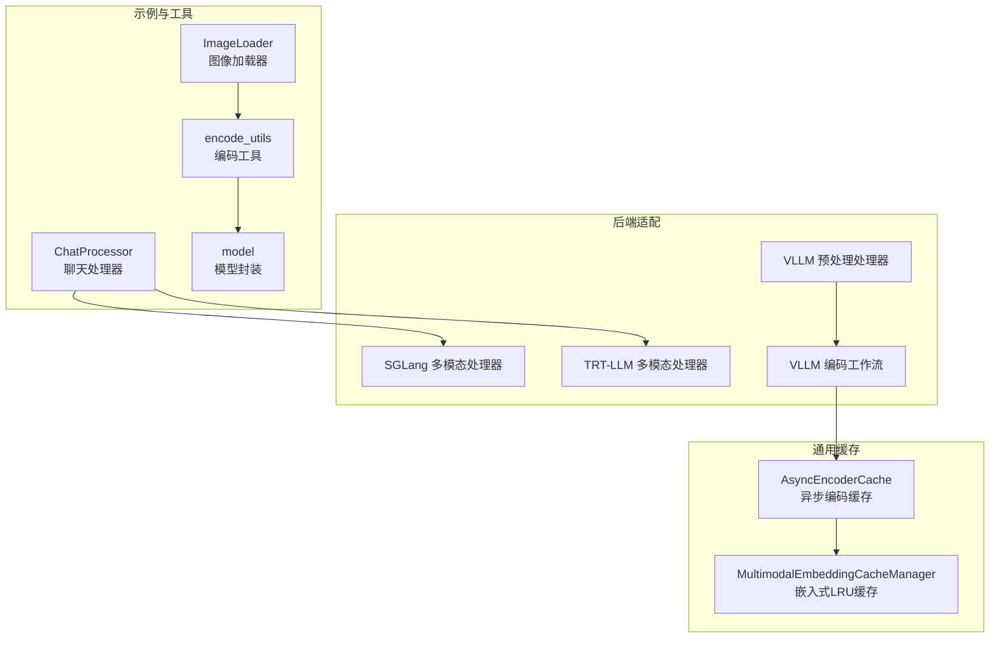
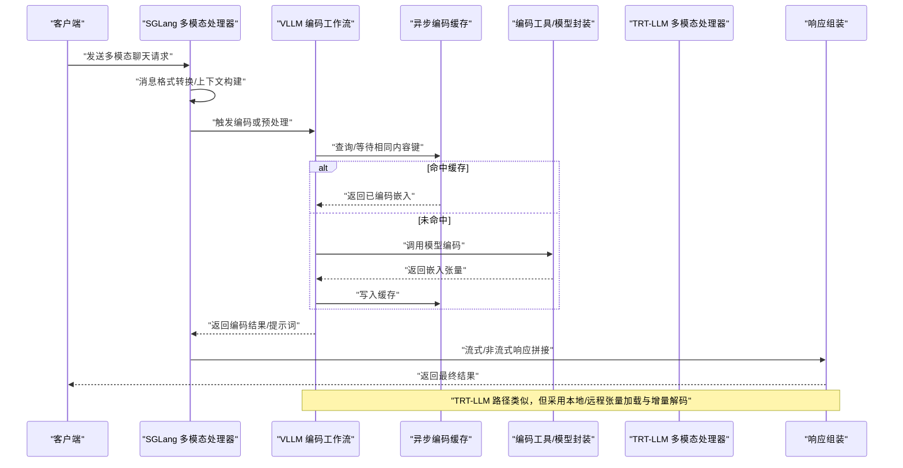
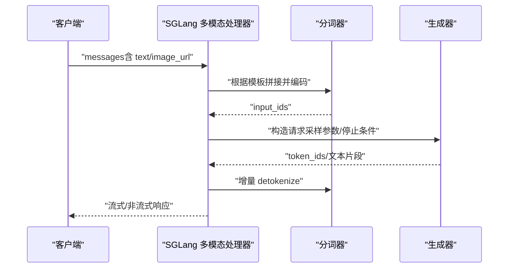
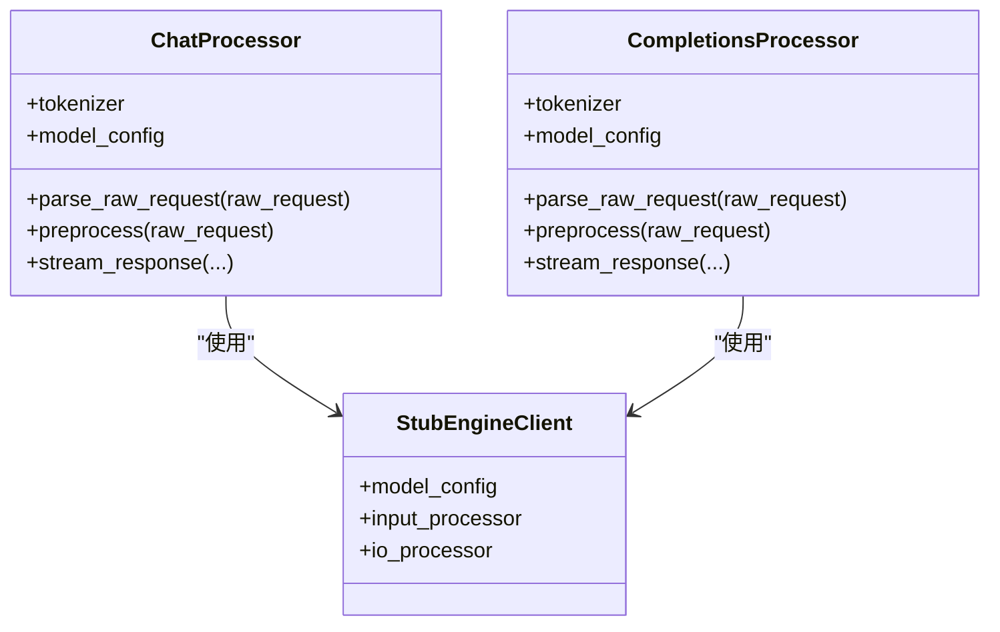
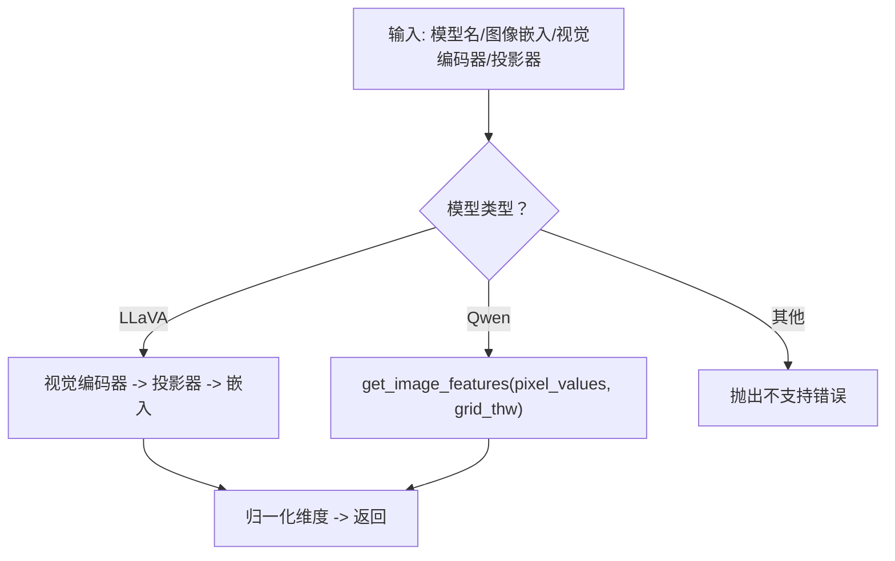
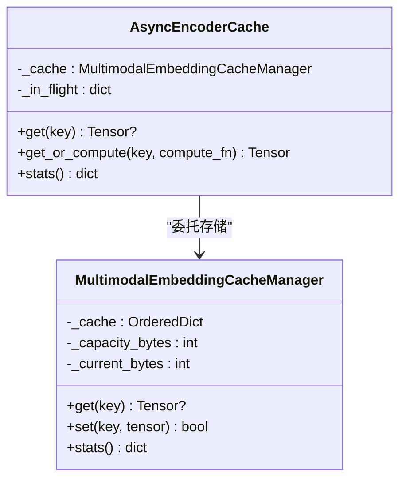
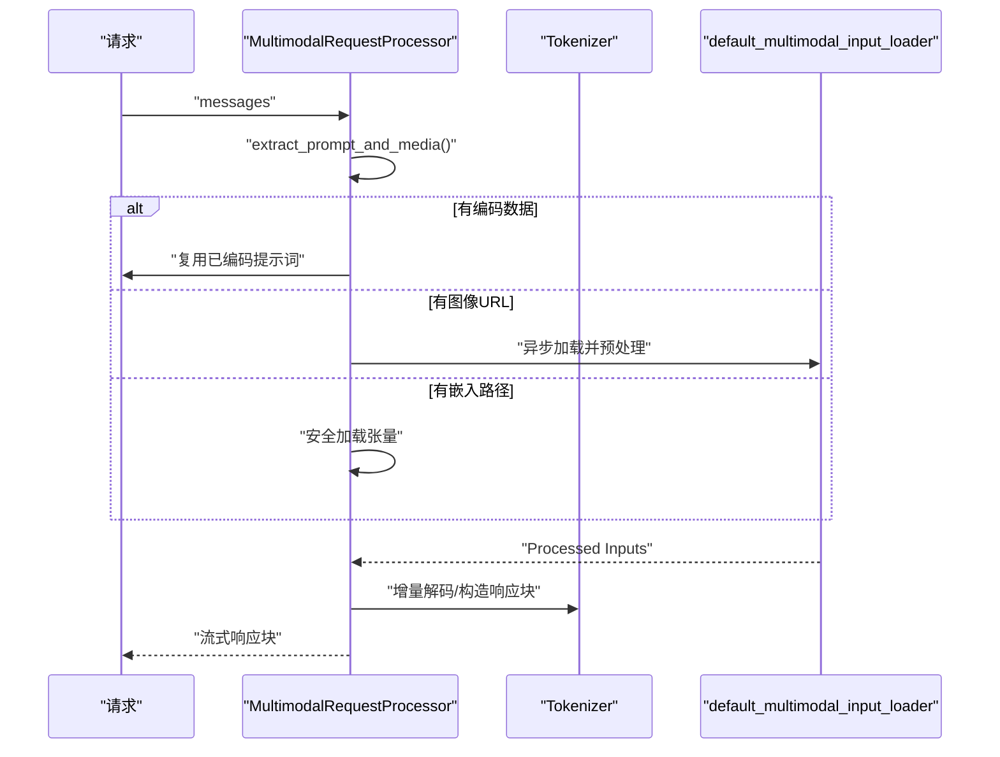
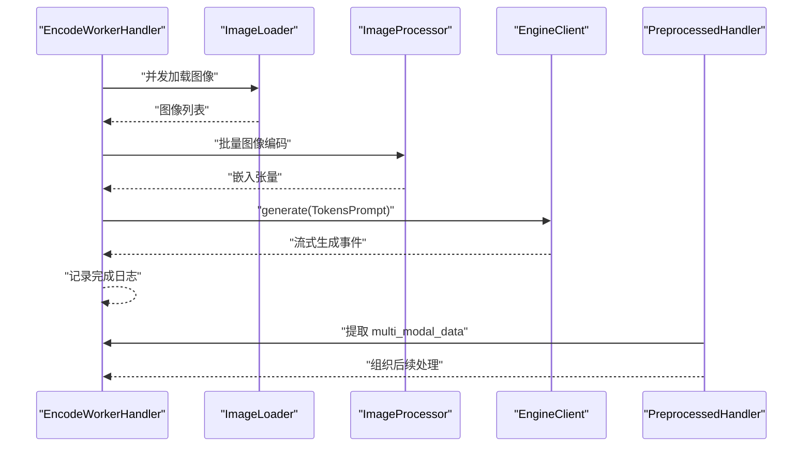
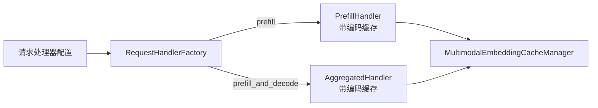

# 多模态处理流程

<cite>
**本文引用的文件**   
- [examples/multimodal/utils/image_loader.py](file://examples/multimodal/utils/image_loader.py)
- [examples/multimodal/utils/chat_processor.py](file://examples/multimodal/utils/chat_processor.py)
- [examples/multimodal/utils/encode_utils.py](file://examples/multimodal/utils/encode_utils.py)
- [examples/multimodal/utils/model.py](file://examples/multimodal/utils/model.py)
- [components/src/dynamo/common/multimodal/async_encoder_cache.py](file://components/src/dynamo/common/multimodal/async_encoder_cache.py)
- [components/src/dynamo/common/memory/multimodal_embedding_cache_manager.py](file://components/src/dynamo/common/memory/multimodal_embedding_cache_manager.py)
- [components/src/dynamo/sglang/multimodal_utils/multimodal_chat_processor.py](file://components/src/dynamo/sglang/multimodal_utils/multimodal_chat_processor.py)
- [components/src/dynamo/trtllm/multimodal_processor.py](file://components/src/dynamo/trtllm/multimodal_processor.py)
- [components/src/dynamo/vllm/multimodal_handlers/encode_worker_handler.py](file://components/src/dynamo/vllm/multimodal_handlers/encode_worker_handler.py)
- [components/src/dynamo/vllm/multimodal_handlers/preprocessed_handler.py](file://components/src/dynamo/vllm/multimodal_handlers/preprocessed_handler.py)
- [components/src/dynamo/trtllm/request_handlers/handlers.py](file://components/src/dynamo/trtllm/request_handlers/handlers.py)
- [lib/llm/tests/preprocessor.rs](file://lib/llm/tests/preprocessor.rs)
</cite>

## 目录
1. [引言](#引言)
2. [项目结构](#项目结构)
3. [核心组件](#核心组件)
4. [架构总览](#架构总览)
5. [详细组件分析](#详细组件分析)
6. [依赖关系分析](#依赖关系分析)
7. [性能考量](#性能考量)
8. [故障排查指南](#故障排查指南)
9. [结论](#结论)
10. [附录](#附录)

## 引言
本文件系统性梳理 SGLang 在多模态场景下的处理流程与架构设计，覆盖从图像加载、编码、到文本生成的完整链路；深入解析多模态聊天处理器的消息格式转换与上下文管理；文档化图像加载器的优化策略与缓存机制；说明多模态编码工具函数的使用方法与性能优化技巧；解释多模态数据在不同处理器间的传递机制与状态管理；并提供多模态模型的配置参数、部署示例与性能调优建议。

## 项目结构
围绕多模态处理的相关模块主要分布在以下位置：
- 示例与工具：examples/multimodal/utils（图像加载、聊天处理器、编码工具、模型封装）
- 通用缓存：components/src/dynamo/common（异步编码缓存与LRU缓存管理）
- 后端适配：components/src/dynamo/sglang、trtllm、vllm（多模态请求预处理与响应处理）
- 预处理器测试：lib/llm/tests（验证多模态数据在预处理阶段的捕获）



**图示来源**
- [examples/multimodal/utils/image_loader.py](file://examples/multimodal/utils/image_loader.py#L31-L111)
- [examples/multimodal/utils/chat_processor.py](file://examples/multimodal/utils/chat_processor.py#L128-L348)
- [examples/multimodal/utils/encode_utils.py](file://examples/multimodal/utils/encode_utils.py#L26-L133)
- [examples/multimodal/utils/model.py](file://examples/multimodal/utils/model.py#L25-L92)
- [components/src/dynamo/common/multimodal/async_encoder_cache.py](file://components/src/dynamo/common/multimodal/async_encoder_cache.py#L46-L138)
- [components/src/dynamo/common/memory/multimodal_embedding_cache_manager.py](file://components/src/dynamo/common/memory/multimodal_embedding_cache_manager.py#L29-L174)
- [components/src/dynamo/sglang/multimodal_utils/multimodal_chat_processor.py](file://components/src/dynamo/sglang/multimodal_utils/multimodal_chat_processor.py#L11-L163)
- [components/src/dynamo/trtllm/multimodal_processor.py](file://components/src/dynamo/trtllm/multimodal_processor.py#L46-L281)
- [components/src/dynamo/vllm/multimodal_handlers/encode_worker_handler.py](file://components/src/dynamo/vllm/multimodal_handlers/encode_worker_handler.py#L152-L379)
- [components/src/dynamo/vllm/multimodal_handlers/preprocessed_handler.py](file://components/src/dynamo/vllm/multimodal_handlers/preprocessed_handler.py#L226-L243)

**章节来源**
- [examples/multimodal/utils/image_loader.py](file://examples/multimodal/utils/image_loader.py#L31-L111)
- [examples/multimodal/utils/chat_processor.py](file://examples/multimodal/utils/chat_processor.py#L128-L348)
- [examples/multimodal/utils/encode_utils.py](file://examples/multimodal/utils/encode_utils.py#L26-L133)
- [examples/multimodal/utils/model.py](file://examples/multimodal/utils/model.py#L25-L92)
- [components/src/dynamo/common/multimodal/async_encoder_cache.py](file://components/src/dynamo/common/multimodal/async_encoder_cache.py#L46-L138)
- [components/src/dynamo/common/memory/multimodal_embedding_cache_manager.py](file://components/src/dynamo/common/memory/multimodal_embedding_cache_manager.py#L29-L174)
- [components/src/dynamo/sglang/multimodal_utils/multimodal_chat_processor.py](file://components/src/dynamo/sglang/multimodal_utils/multimodal_chat_processor.py#L11-L163)
- [components/src/dynamo/trtllm/multimodal_processor.py](file://components/src/dynamo/trtllm/multimodal_processor.py#L46-L281)
- [components/src/dynamo/vllm/multimodal_handlers/encode_worker_handler.py](file://components/src/dynamo/vllm/multimodal_handlers/encode_worker_handler.py#L152-L379)
- [components/src/dynamo/vllm/multimodal_handlers/preprocessed_handler.py](file://components/src/dynamo/vllm/multimodal_handlers/preprocessed_handler.py#L226-L243)

## 核心组件
- 图像加载器（ImageLoader）：支持 HTTP(S)/dataURL 加载，线程池解码避免阻塞事件循环，带 LRU 缓存队列，限制最大缓存大小。
- 聊天处理器（ChatProcessor/CompletionsProcessor）：封装 vLLM 的 OpenAI 服务接口，负责消息格式预处理、对话上下文构建、流式/非流式响应拼接与增量输出。
- 编码工具（encode_utils/model）：按模型类型选择编码路径（如 LLaVA 投影、Qwen grid_thw），构造多模态输入数据结构。
- 异步编码缓存（AsyncEncoderCache/MultimodalEmbeddingCacheManager）：对相同内容键去重计算，防止重复编码；LRU 按字节容量回收。
- SGLang 多模态处理器：将多模态消息转换为 SGLang 期望的 token_ids 与采样参数，提供 detokenize 与流式响应处理。
- TRT-LLM 多模态处理器：从消息中提取文本与媒体，支持本地/远程张量加载与同步预处理包装为异步执行，增量解码 delta 计算。
- VLLM 编码工作流：批量加载图像、调用引擎生成以触发编码，支持错误聚合与日志记录。
- 预处理处理器：从 PreprocessedRequest 中提取 multi_modal_data 并组织为后续处理可用的数据结构。

**章节来源**
- [examples/multimodal/utils/image_loader.py](file://examples/multimodal/utils/image_loader.py#L31-L111)
- [examples/multimodal/utils/chat_processor.py](file://examples/multimodal/utils/chat_processor.py#L128-L348)
- [examples/multimodal/utils/encode_utils.py](file://examples/multimodal/utils/encode_utils.py#L26-L133)
- [examples/multimodal/utils/model.py](file://examples/multimodal/utils/model.py#L25-L92)
- [components/src/dynamo/common/multimodal/async_encoder_cache.py](file://components/src/dynamo/common/multimodal/async_encoder_cache.py#L46-L138)
- [components/src/dynamo/common/memory/multimodal_embedding_cache_manager.py](file://components/src/dynamo/common/memory/multimodal_embedding_cache_manager.py#L29-L174)
- [components/src/dynamo/sglang/multimodal_utils/multimodal_chat_processor.py](file://components/src/dynamo/sglang/multimodal_utils/multimodal_chat_processor.py#L11-L163)
- [components/src/dynamo/trtllm/multimodal_processor.py](file://components/src/dynamo/trtllm/multimodal_processor.py#L46-L281)
- [components/src/dynamo/vllm/multimodal_handlers/encode_worker_handler.py](file://components/src/dynamo/vllm/multimodal_handlers/encode_worker_handler.py#L152-L379)
- [components/src/dynamo/vllm/multimodal_handlers/preprocessed_handler.py](file://components/src/dynamo/vllm/multimodal_handlers/preprocessed_handler.py#L226-L243)

## 架构总览
下图展示从请求进入至文本生成完成的多模态处理主干流程，涵盖图像加载、编码、预处理、生成与响应阶段。



**图示来源**
- [components/src/dynamo/sglang/multimodal_utils/multimodal_chat_processor.py](file://components/src/dynamo/sglang/multimodal_utils/multimodal_chat_processor.py#L11-L163)
- [components/src/dynamo/vllm/multimodal_handlers/encode_worker_handler.py](file://components/src/dynamo/vllm/multimodal_handlers/encode_worker_handler.py#L152-L379)
- [components/src/dynamo/common/multimodal/async_encoder_cache.py](file://components/src/dynamo/common/multimodal/async_encoder_cache.py#L80-L126)
- [examples/multimodal/utils/encode_utils.py](file://examples/multimodal/utils/encode_utils.py#L58-L103)
- [components/src/dynamo/trtllm/multimodal_processor.py](file://components/src/dynamo/trtllm/multimodal_processor.py#L168-L235)

## 详细组件分析

### 图像加载器与缓存机制
- 支持的数据源：HTTP(S)、dataURL、本地文件（通过 TRT-LLM 处理器）。
- 解码与格式校验：使用线程池解码图片，限制格式集合，确保安全性与兼容性。
- 缓存策略：基于 URL 的小顶堆式 LRU 队列，限制最大缓存项数，避免内存膨胀。
- 错误处理：对空内容、不支持格式、HTTP 错误等进行统一异常抛出与日志记录。

```mermaid
flowchart TD
Start(["开始"]) --> Parse["解析 URL/数据源"]
Parse --> Scheme{"scheme 类型？"}
Scheme --> |HTTP(S)| CheckCache["检查缓存命中"]
Scheme --> |data| DecodeData["解析并解码 base64 数据"]
Scheme --> |其他| ErrScheme["报错：不支持的 scheme"]
CheckCache --> Hit{"命中？"}
Hit --> |是| ReturnCache["返回缓存图像"]
Hit --> |否| Fetch["下载/读取内容"]
Fetch --> Validate["格式校验与转换为 RGB"]
Validate --> SaveCache["写入缓存队列与映射"]
SaveCache --> ReturnImg["返回图像对象"]
DecodeData --> Validate
ErrScheme --> End(["结束"])
ReturnCache --> End
ReturnImg --> End
```

**图示来源**
- [examples/multimodal/utils/image_loader.py](file://examples/multimodal/utils/image_loader.py#L41-L111)

**章节来源**
- [examples/multimodal/utils/image_loader.py](file://examples/multimodal/utils/image_loader.py#L31-L111)

### 多模态聊天处理器（SGLang 侧）
- 请求转换：将多模态消息中的 text 与 image_url 转换为 SGLang 期望的 conversation 结构与 token_ids。
- 采样参数：温度、最大 token 数等由请求携带，EOS 标记与流式开关参与响应控制。
- 响应处理：提供 detokenize 与流式增量拼接，兼容多种数据载体（字符串、JSON、可调用对象）。



**图示来源**
- [components/src/dynamo/sglang/multimodal_utils/multimodal_chat_processor.py](file://components/src/dynamo/sglang/multimodal_utils/multimodal_chat_processor.py#L11-L163)

**章节来源**
- [components/src/dynamo/sglang/multimodal_utils/multimodal_chat_processor.py](file://components/src/dynamo/sglang/multimodal_utils/multimodal_chat_processor.py#L11-L163)

### 多模态聊天处理器（vLLM 侧）
- 预处理：OpenAI 服务封装，支持自定义模板或回退到简单拼接；返回 conversation 与 engine_prompts。
- 流式/非流式：流式模式下按增量 delta 输出，非流式收集全部片段后合并。
- 上下文管理：维护累计输出长度，避免重复输出历史片段。



**图示来源**
- [examples/multimodal/utils/chat_processor.py](file://examples/multimodal/utils/chat_processor.py#L36-L348)

**章节来源**
- [examples/multimodal/utils/chat_processor.py](file://examples/multimodal/utils/chat_processor.py#L128-L348)

### 多模态编码工具与模型封装
- 模型识别：支持 LLaVA 与 Qwen 系列，按模型类型选择编码路径。
- 编码流程：LLaVA 使用视觉编码器+投影器，Qwen 使用 grid_thw 参数；统一归一化输出维度。
- 多模态数据构造：针对不同模型构造 image/audio/video/embedding 数据结构。



**图示来源**
- [examples/multimodal/utils/encode_utils.py](file://examples/multimodal/utils/encode_utils.py#L58-L103)
- [examples/multimodal/utils/model.py](file://examples/multimodal/utils/model.py#L44-L92)

**章节来源**
- [examples/multimodal/utils/encode_utils.py](file://examples/multimodal/utils/encode_utils.py#L26-L133)
- [examples/multimodal/utils/model.py](file://examples/multimodal/utils/model.py#L25-L92)

### 异步编码缓存与 LRU 管理
- 请求合并：同一键并发请求仅计算一次，其余等待首个结果。
- LRU 回收：按字节容量统计，逐出最久未使用条目；单条过大直接拒绝。
- 统计指标：命中/未命中、当前占用、利用率、在途请求数。



**图示来源**
- [components/src/dynamo/common/multimodal/async_encoder_cache.py](file://components/src/dynamo/common/multimodal/async_encoder_cache.py#L46-L138)
- [components/src/dynamo/common/memory/multimodal_embedding_cache_manager.py](file://components/src/dynamo/common/memory/multimodal_embedding_cache_manager.py#L29-L174)

**章节来源**
- [components/src/dynamo/common/multimodal/async_encoder_cache.py](file://components/src/dynamo/common/multimodal/async_encoder_cache.py#L46-L138)
- [components/src/dynamo/common/memory/multimodal_embedding_cache_manager.py](file://components/src/dynamo/common/memory/multimodal_embedding_cache_manager.py#L29-L174)

### TRT-LLM 多模态处理器
- 输入提取：从消息中抽取文本、图像 URL 或嵌入路径；区分本地/远程张量。
- 安全与限额：限制文件大小，校验本地路径在允许目录内；远程下载限制大小。
- 预处理包装：将默认多模态输入加载器包装为异步执行，提升高并发吞吐。
- 增量解码：首次包含角色信息，后续基于上次解码文本计算 delta。



**图示来源**
- [components/src/dynamo/trtllm/multimodal_processor.py](file://components/src/dynamo/trtllm/multimodal_processor.py#L168-L281)

**章节来源**
- [components/src/dynamo/trtllm/multimodal_processor.py](file://components/src/dynamo/trtllm/multimodal_processor.py#L46-L281)

### VLLM 编码工作流与预处理处理器
- 批量图像加载：并发拉取多个图像，聚合异常信息，统一抛出。
- 触发编码：构造 vLLM TokensPrompt，设置最小/最大 token，消费生成器以驱动编码执行。
- 预处理提取：从 PreprocessedRequest 中提取 multi_modal_data，组织为后续处理器可用结构。



**图示来源**
- [components/src/dynamo/vllm/multimodal_handlers/encode_worker_handler.py](file://components/src/dynamo/vllm/multimodal_handlers/encode_worker_handler.py#L152-L379)
- [components/src/dynamo/vllm/multimodal_handlers/preprocessed_handler.py](file://components/src/dynamo/vllm/multimodal_handlers/preprocessed_handler.py#L226-L243)

**章节来源**
- [components/src/dynamo/vllm/multimodal_handlers/encode_worker_handler.py](file://components/src/dynamo/vllm/multimodal_handlers/encode_worker_handler.py#L152-L379)
- [components/src/dynamo/vllm/multimodal_handlers/preprocessed_handler.py](file://components/src/dynamo/vllm/multimodal_handlers/preprocessed_handler.py#L226-L243)

## 依赖关系分析
- 编码缓存工厂：根据配置创建带缓存的处理器，支持不同拆分模式（prefill/aggregate）。
- 预处理器测试：验证多模态数据在预处理阶段被正确捕获与计数。



**图示来源**
- [components/src/dynamo/trtllm/request_handlers/handlers.py](file://components/src/dynamo/trtllm/request_handlers/handlers.py#L32-L55)

**章节来源**
- [components/src/dynamo/trtllm/request_handlers/handlers.py](file://components/src/dynamo/trtllm/request_handlers/handlers.py#L32-L55)
- [lib/llm/tests/preprocessor.rs](file://lib/llm/tests/preprocessor.rs#L586-L624)

## 性能考量
- 并发与去重
  - 异步编码缓存对同一内容键进行请求合并，减少重复计算。
  - 图像加载器并发拉取多个 URL，结合线程池解码避免阻塞事件循环。
- 缓存策略
  - LRU 按字节容量回收，避免内存无限增长；单条过大直接拒绝，降低碎片风险。
- I/O 与网络
  - TRT-LLM 远程张量加载限制大小并直接内存读取，减少磁盘 IO。
  - SGLang/聊天处理器对响应增量解码，降低累积开销。
- 模型与数据结构
  - 编码工具统一输出维度，便于下游一致处理；Qwen 需要 grid_thw，缺失时快速失败。

[本节为通用指导，无需列出具体文件来源]

## 故障排查指南
- 图像加载失败
  - 检查 URL scheme 是否为 http/https/data；dataURL 必须为 image/* 且 base64。
  - 空内容或不支持格式会抛出异常；查看日志定位具体 URL。
- 编码缓存异常
  - 若并发计算异常，确认缓存键是否稳定（内容哈希）；检查 in_flight 统计。
  - LRU 满时逐出旧项，确认容量设置是否合理。
- TRT-LLM 张量加载
  - 本地路径需在允许目录内；超出大小限制会报错；远程下载失败需检查网络与大小。
- SGLang 响应处理
  - detokenize 失败时检查数据载体类型；必要时降级为字符串处理。
- VLLM 编码触发
  - 未触发编码时检查生成器是否被消费；确认 multi_modal_data 是否正确传入。

**章节来源**
- [examples/multimodal/utils/image_loader.py](file://examples/multimodal/utils/image_loader.py#L105-L111)
- [components/src/dynamo/common/multimodal/async_encoder_cache.py](file://components/src/dynamo/common/multimodal/async_encoder_cache.py#L112-L126)
- [components/src/dynamo/trtllm/multimodal_processor.py](file://components/src/dynamo/trtllm/multimodal_processor.py#L98-L139)
- [components/src/dynamo/sglang/multimodal_utils/multimodal_chat_processor.py](file://components/src/dynamo/sglang/multimodal_utils/multimodal_chat_processor.py#L104-L107)
- [components/src/dynamo/vllm/multimodal_handlers/encode_worker_handler.py](file://components/src/dynamo/vllm/multimodal_handlers/encode_worker_handler.py#L366-L379)

## 结论
该多模态处理链路在保证安全与稳定的前提下，通过并发加载、异步编码缓存与增量解码等手段显著提升了吞吐与延迟表现。SGLang、TRT-LLM 与 VLLM 三套适配器分别满足不同后端与部署形态的需求，配合统一的编码工具与缓存策略，形成可扩展、可观测的多模态推理流水线。

[本节为总结性内容，无需列出具体文件来源]

## 附录

### 多模态模型配置与部署要点
- 支持模型
  - LLaVA 1.5 7B：需要视觉编码器与投影器。
  - Qwen2.5-VL 7B：需要 grid_thw 参数。
  - 其他：如 Qwen Audio、LLaVA Next Video，按模型封装构造数据结构。
- 编码参数
  - 设备映射与 dtype：自动设备分配与半精度/混合精度。
  - 多模态数据构造：根据模型类型选择 image/audio/video/embedding 字段。
- 编码缓存
  - 容量单位为字节；命中率与利用率可作为调优参考。
- TRT-LLM 安全与限额
  - 最大文件大小限制；本地路径必须在允许目录内；远程下载限制大小。

**章节来源**
- [examples/multimodal/utils/model.py](file://examples/multimodal/utils/model.py#L25-L92)
- [examples/multimodal/utils/encode_utils.py](file://examples/multimodal/utils/encode_utils.py#L105-L133)
- [components/src/dynamo/common/memory/multimodal_embedding_cache_manager.py](file://components/src/dynamo/common/memory/multimodal_embedding_cache_manager.py#L43-L61)
- [components/src/dynamo/trtllm/multimodal_processor.py](file://components/src/dynamo/trtllm/multimodal_processor.py#L53-L62)