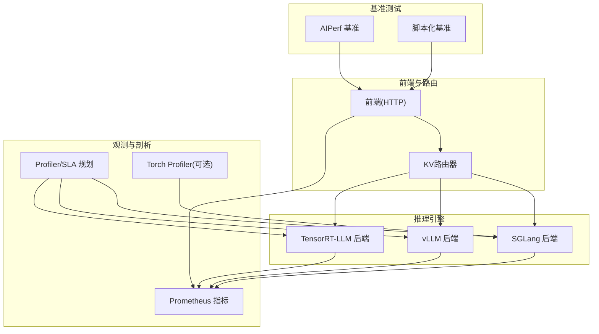
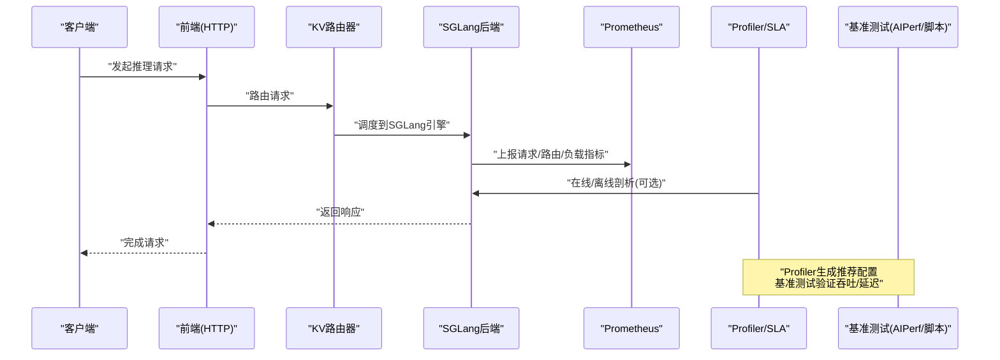
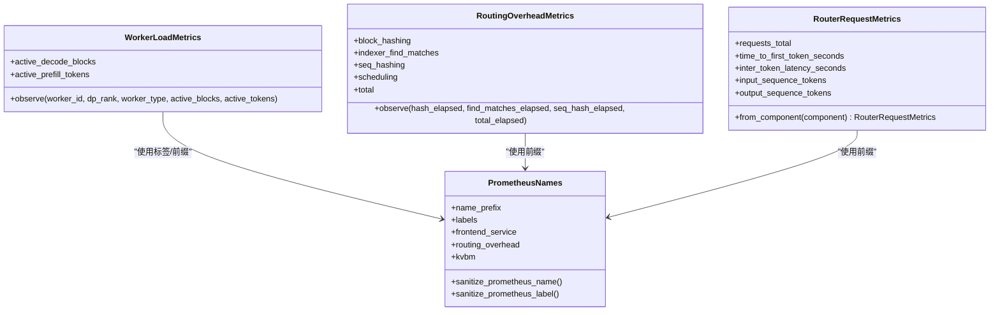
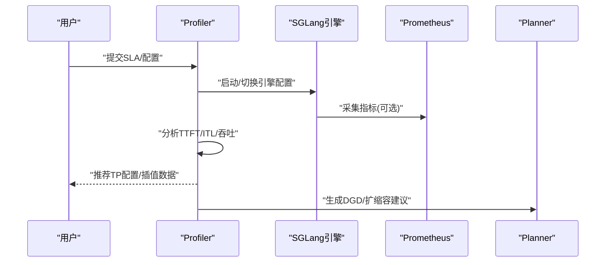
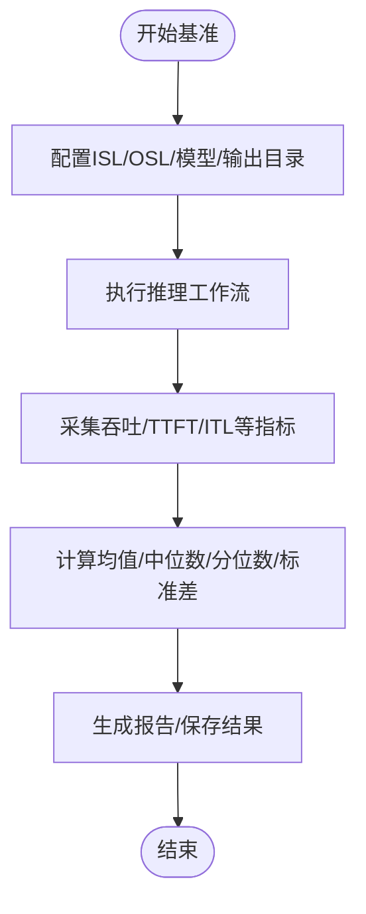
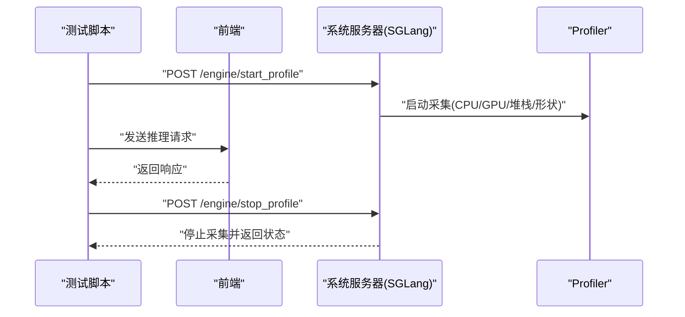
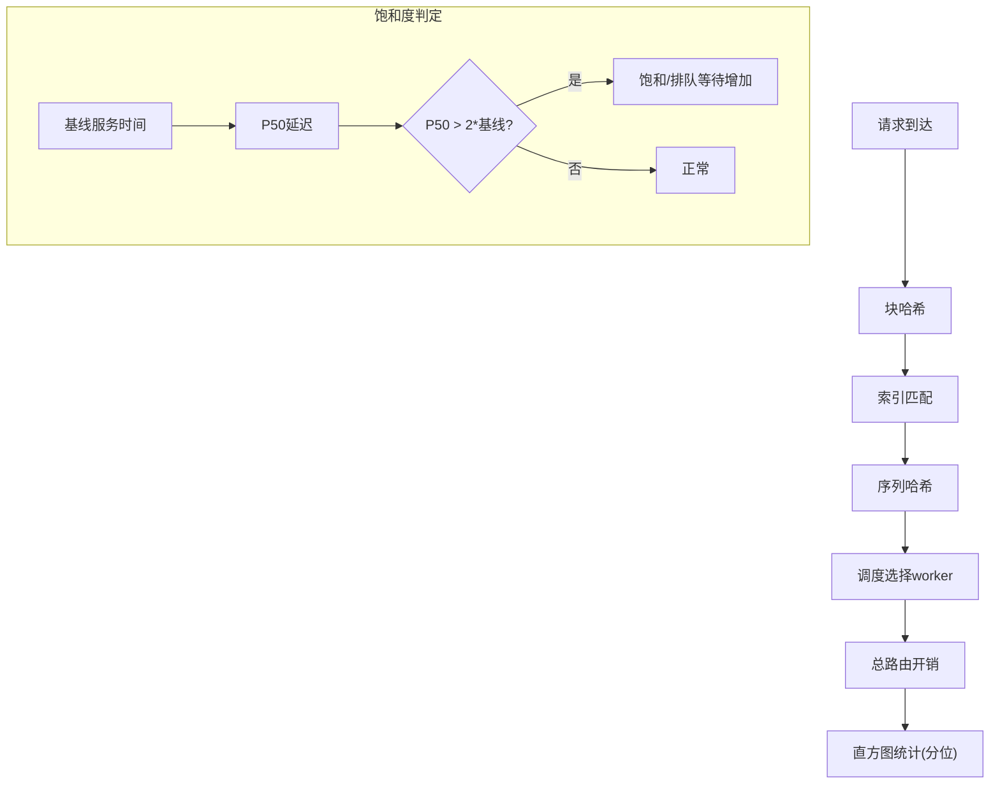
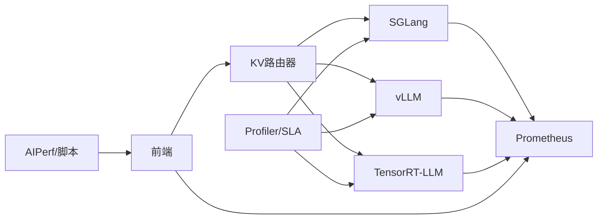

# 性能剖析与优化

<cite>
**本文引用的文件**
- [docs/pages/components/profiler/README.md](file://docs/pages/components/profiler/README.md)
- [benchmarks/profiler/profile_sla.py](file://benchmarks/profiler/profile_sla.py)
- [examples/backends/sglang/test_sglang_profile.py](file://examples/backends/sglang/test_sglang_profile.py)
- [lib/llm/src/kv_router/metrics.rs](file://lib/llm/src/kv_router/metrics.rs)
- [lib/runtime/src/metrics/prometheus_names.rs](file://lib/runtime/src/metrics/prometheus_names.rs)
- [benchmarks/utils/benchmark.py](file://benchmarks/utils/benchmark.py)
- [docs/pages/performance/tuning.md](file://docs/pages/performance/tuning.md)
- [lib/kv-router/benches/kv_indexer_bench.rs](file://lib/kv-router/benches/kv_indexer_bench.rs)
- [examples/backends/sglang/slurm_jobs/parse.py](file://examples/backends/sglang/slurm_jobs/parse.py)
- [lib/runtime/examples/async_vs_compute_interaction.rs](file://lib/runtime/examples/async_vs_compute_interaction.rs)
- [tests/fault_tolerance/deploy/parse_results.py](file://tests/fault_tolerance/deploy/parse_results.py)
</cite>

## 目录
1. [引言](#引言)
2. [项目结构](#项目结构)
3. [核心组件](#核心组件)
4. [架构总览](#架构总览)
5. [详细组件分析](#详细组件分析)
6. [依赖关系分析](#依赖关系分析)
7. [性能考量](#性能考量)
8. [故障排除指南](#故障排除指南)
9. [结论](#结论)
10. [附录](#附录)

## 引言
本文件面向SGLang在Dynamo平台中的性能剖析与优化，系统性梳理性能监控体系、Prometheus指标定义与用途、剖析工具使用与数据分析方法（含延迟分解与瓶颈识别）、优化策略与调参建议（内存与并发）、性能基准测试方法与标准（吞吐与延迟），以及诊断流程与常见陷阱规避。文档同时提供真实案例与效果对比思路，帮助读者快速落地性能优化。

## 项目结构
围绕SGLang性能剖析与优化的关键路径如下：
- Profiler与SLA规划：通过自动化剖析生成最优张量并行配置，支撑按SLA的弹性扩缩容。
- 指标体系：统一的Prometheus命名规范与前端/路由/工作器等关键指标，覆盖请求时延、队列等待、负载状态等。
- 基准测试：支持AIPerf与脚本化基准编排，输出吞吐、TTFT、ITL等关键指标。
- 运行时剖析：SGLang后端支持自定义引擎路由以采集torch profiler数据，便于深度剖析。
- 调优指南：针对预填/解码阶段、块大小、批大小、最大token数等进行系统性调优。

**图表来源**
- [docs/pages/components/profiler/README.md](file://docs/pages/components/profiler/README.md#L1-L129)
- [lib/llm/src/kv_router/metrics.rs](file://lib/llm/src/kv_router/metrics.rs#L1-L397)
- [lib/runtime/src/metrics/prometheus_names.rs](file://lib/runtime/src/metrics/prometheus_names.rs#L1-L790)
- [benchmarks/utils/benchmark.py](file://benchmarks/utils/benchmark.py#L1-L103)

**章节来源**
- [docs/pages/components/profiler/README.md](file://docs/pages/components/profiler/README.md#L1-L129)
- [lib/llm/src/kv_router/metrics.rs](file://lib/llm/src/kv_router/metrics.rs#L1-L397)
- [lib/runtime/src/metrics/prometheus_names.rs](file://lib/runtime/src/metrics/prometheus_names.rs#L1-L790)
- [benchmarks/utils/benchmark.py](file://benchmarks/utils/benchmark.py#L1-L103)

## 核心组件
- Profiler与SLA规划：自动测量模型推理特性，确定预填与解码阶段的张量并行设置，生成性能插值数据，驱动Planner按SLA进行扩缩容。
- Prometheus指标体系：统一命名规范与标签，覆盖前端请求、路由开销、工作器负载、KV缓存命中率等；支持直方图与计数器，便于分位统计与趋势分析。
- 基准测试框架：支持AIPerf与脚本化工作流，输出吞吐、TTFT、ITL、P50/P95等指标，支撑不同场景下的性能评估。
- 运行时剖析：SGLang后端可通过自定义引擎路由开启/停止torch profiler，采集CPU/GPU活动、堆栈与形状信息，辅助定位热点与瓶颈。
- 调优指南：针对预填优先、块大小、批大小、最大token数等关键参数给出调优建议与权衡。

**章节来源**
- [docs/pages/components/profiler/README.md](file://docs/pages/components/profiler/README.md#L1-L129)
- [lib/runtime/src/metrics/prometheus_names.rs](file://lib/runtime/src/metrics/prometheus_names.rs#L1-L790)
- [benchmarks/utils/benchmark.py](file://benchmarks/utils/benchmark.py#L1-L103)
- [examples/backends/sglang/test_sglang_profile.py](file://examples/backends/sglang/test_sglang_profile.py#L1-L297)
- [docs/pages/performance/tuning.md](file://docs/pages/performance/tuning.md#L1-L137)

## 架构总览
下图展示SGLang在Dynamo中的性能剖析与优化闭环：前端接收请求，路由到后端引擎；后端上报Prometheus指标；Profiler基于在线/离线方式采集性能数据并生成推荐配置；基准测试与运行时剖析用于验证与深入分析。

**图表来源**
- [lib/llm/src/kv_router/metrics.rs](file://lib/llm/src/kv_router/metrics.rs#L1-L397)
- [lib/runtime/src/metrics/prometheus_names.rs](file://lib/runtime/src/metrics/prometheus_names.rs#L1-L790)
- [docs/pages/components/profiler/README.md](file://docs/pages/components/profiler/README.md#L1-L129)
- [benchmarks/utils/benchmark.py](file://benchmarks/utils/benchmark.py#L1-L103)

## 详细组件分析

### 组件A：Prometheus指标与命名规范
- 指标命名与标签：采用统一前缀与命名约定，确保跨组件一致性；提供标签注入与名称清洗函数，避免非法字符与保留前缀冲突。
- 关键指标类别：
  - 前端服务：请求总量、排队/并发请求数、请求耗时、输入/输出序列长度、TTFT/ITL、迁移次数与类型、工作器活跃解码块/预填令牌等。
  - 路由开销：块哈希、索引匹配、序列哈希、调度、总开销等直方图，单位毫秒。
  - KVBM：设备/主机/磁盘间块上下载、匹配令牌数、命中率、对象存储读写失败数等。
- 使用建议：
  - 为每个组件注册静态指标，结合组件层级自动注入标签（如组件名、命名空间、端点）。
  - 对延迟类指标使用对数桶或指数桶，便于观察尾部延迟分布。

**图表来源**
- [lib/llm/src/kv_router/metrics.rs](file://lib/llm/src/kv_router/metrics.rs#L24-L269)
- [lib/runtime/src/metrics/prometheus_names.rs](file://lib/runtime/src/metrics/prometheus_names.rs#L64-L499)

**章节来源**
- [lib/llm/src/kv_router/metrics.rs](file://lib/llm/src/kv_router/metrics.rs#L1-L397)
- [lib/runtime/src/metrics/prometheus_names.rs](file://lib/runtime/src/metrics/prometheus_names.rs#L1-L790)

### 组件B：Profiler与SLA规划
- 功能概述：自动测量模型在不同TP设置下的TTFT/ITL/吞吐等指标，生成插值数据，指导按SLA的部署与扩缩容。
- 在线/离线模式：在线AIPerf方式精度最高但耗时较长；离线AI Configurator方式快速估算（仅TRT-LLM）。
- 输出与推荐：最优TP设置、性能插值数据、生成DGD部署清单；支持Dry Run模式进行安全校验与错误记录。

**图表来源**
- [docs/pages/components/profiler/README.md](file://docs/pages/components/profiler/README.md#L1-L129)
- [benchmarks/profiler/profile_sla.py](file://benchmarks/profiler/profile_sla.py#L532-L602)

**章节来源**
- [docs/pages/components/profiler/README.md](file://docs/pages/components/profiler/README.md#L1-L129)
- [benchmarks/profiler/profile_sla.py](file://benchmarks/profiler/profile_sla.py#L532-L602)

### 组件C：基准测试与指标采集
- AIPerf与脚本化基准：支持通过命令行参数指定ISL/OSL/模型/输出目录等，自动执行工作流并产出吞吐、TTFT、ITL等统计。
- 指标计算：请求吞吐、输出吞吐、总吞吐、TTFT/ITL均值/中位数/分位数、标准差等，便于多场景对比。
- 结果解析：测试脚本可解析AI-Perf结果，提取客户端数量、恢复时间等关键指标，支撑故障注入场景的评估。

**图表来源**
- [benchmarks/utils/benchmark.py](file://benchmarks/utils/benchmark.py#L51-L98)
- [tests/fault_tolerance/deploy/parse_results.py](file://tests/fault_tolerance/deploy/parse_results.py#L659-L697)

**章节来源**
- [benchmarks/utils/benchmark.py](file://benchmarks/utils/benchmark.py#L1-L103)
- [tests/fault_tolerance/deploy/parse_results.py](file://tests/fault_tolerance/deploy/parse_results.py#L659-L697)

### 组件D：运行时剖析（SGLang）
- 自定义引擎路由：提供/start_profile与/stop_profile接口，支持指定输出目录、活动类型（CPU/GPU）、是否记录堆栈与形状。
- 实践要点：在小规模流量下采集数据，结合前端/后端健康检查确认就绪状态；采集完成后检查输出目录是否存在trace文件。
- 适用场景：定位热点算子、核函数、内存分配与拷贝瓶颈，辅助调参与代码优化。

**图表来源**
- [examples/backends/sglang/test_sglang_profile.py](file://examples/backends/sglang/test_sglang_profile.py#L148-L225)

**章节来源**
- [examples/backends/sglang/test_sglang_profile.py](file://examples/backends/sglang/test_sglang_profile.py#L1-L297)

### 组件E：延迟分解与瓶颈识别
- 路由开销分解：将单请求路由开销拆分为块哈希、索引匹配、序列哈希、调度与总开销，单位毫秒；通过直方图观察各阶段占比与异常峰值。
- 队列与饱和度：通过基线服务时间与P50延迟比较判断是否饱和，结合超时/排队等待等指标识别瓶颈。
- 计算干扰分析：在异步任务与计算任务共存时，计算“干扰因子”评估异步任务受阻程度，指导并发与调度策略调整。

**图表来源**
- [lib/llm/src/kv_router/metrics.rs](file://lib/llm/src/kv_router/metrics.rs#L94-L166)
- [lib/kv-router/benches/kv_indexer_bench.rs](file://lib/kv-router/benches/kv_indexer_bench.rs#L1053-L1096)
- [lib/runtime/examples/async_vs_compute_interaction.rs](file://lib/runtime/examples/async_vs_compute_interaction.rs#L433-L466)

**章节来源**
- [lib/llm/src/kv_router/metrics.rs](file://lib/llm/src/kv_router/metrics.rs#L94-L166)
- [lib/kv-router/benches/kv_indexer_bench.rs](file://lib/kv-router/benches/kv_indexer_bench.rs#L1053-L1096)
- [lib/runtime/examples/async_vs_compute_interaction.rs](file://lib/runtime/examples/async_vs_compute_interaction.rs#L433-L466)

## 依赖关系分析
- 组件耦合与内聚：前端/路由与引擎之间通过清晰的HTTP接口耦合；指标体系通过统一命名与标签实现高内聚、低耦合。
- 外部依赖：Prometheus作为指标采集与查询基础；AIPerf用于基准测试；Profiler/SLA规划依赖kube-prometheus-stack（在K8s环境）。
- 潜在环路：当前设计为单向数据流（采集→分析→推荐→部署），未见循环依赖。

**图表来源**
- [lib/llm/src/kv_router/metrics.rs](file://lib/llm/src/kv_router/metrics.rs#L1-L397)
- [lib/runtime/src/metrics/prometheus_names.rs](file://lib/runtime/src/metrics/prometheus_names.rs#L1-L790)
- [docs/pages/components/profiler/README.md](file://docs/pages/components/profiler/README.md#L1-L129)
- [benchmarks/utils/benchmark.py](file://benchmarks/utils/benchmark.py#L1-L103)

**章节来源**
- [lib/llm/src/kv_router/metrics.rs](file://lib/llm/src/kv_router/metrics.rs#L1-L397)
- [lib/runtime/src/metrics/prometheus_names.rs](file://lib/runtime/src/metrics/prometheus_names.rs#L1-L790)
- [docs/pages/components/profiler/README.md](file://docs/pages/components/profiler/README.md#L1-L129)
- [benchmarks/utils/benchmark.py](file://benchmarks/utils/benchmark.py#L1-L103)

## 性能考量
- 并发与批大小：预填阶段偏好小批量、大max_num_token；解码阶段偏好大批量、适中max_num_token，以平衡KV缓存占用与中间张量尺寸。
- 块大小：过小导致碎片化与前缀缓存命中率下降；过大导致迁移效率降低。典型密度模型建议从128起步。
- 张量并行映射：同节点内TP、跨节点PP通常更优；具体TP需结合模型规模与硬件能力，通过Profiler/基准测试验证。
- 内存与KV缓存：根据可用显存与目标SLA，动态调整每GPU KV缓存大小与并发度；关注命中率与对象存储读写失败数。
- 端到端延迟：TTFT与ITL是SLA关键指标；路由开销直方图有助于识别异常峰值；通过分位统计评估尾延迟风险。

**章节来源**
- [docs/pages/performance/tuning.md](file://docs/pages/performance/tuning.md#L1-L137)
- [lib/llm/src/kv_router/metrics.rs](file://lib/llm/src/kv_router/metrics.rs#L181-L269)

## 故障排除指南
- 指标缺失或异常：
  - 检查Prometheus端点可达性与抓取配置；确认组件已注册指标且标签注入正确。
  - 关注路由开销直方图是否出现异常峰值，结合日志定位热点阶段。
- 饱和与排队：
  - 若P50延迟显著超过基线服务时间或出现超时，判定为饱和；减少并发或提升资源。
- 运行时剖析：
  - 确认/start_profile与/stop_profile调用成功；检查输出目录是否存在trace文件；在小流量下采集以降低干扰。
- 基准测试：
  - 确保endpoint合法（本地或集群内部服务URL）；检查ISL/OSL与模型名称与部署一致；解析AI-Perf结果时注意客户端数量与恢复时间。

**章节来源**
- [lib/llm/src/kv_router/metrics.rs](file://lib/llm/src/kv_router/metrics.rs#L181-L269)
- [lib/kv-router/benches/kv_indexer_bench.rs](file://lib/kv-router/benches/kv_indexer_bench.rs#L1053-L1096)
- [examples/backends/sglang/test_sglang_profile.py](file://examples/backends/sglang/test_sglang_profile.py#L148-L225)
- [benchmarks/utils/benchmark.py](file://benchmarks/utils/benchmark.py#L15-L33)

## 结论
通过统一的Prometheus指标体系、自动化的Profiler/SLA规划、完善的基准测试与运行时剖析能力，SGLang在Dynamo平台实现了从指标采集、性能分析到配置优化的闭环。结合调优指南与故障排除流程，可在不同负载与硬件条件下稳定达成SLA目标，并持续迭代优化。

## 附录
- 实际优化案例与效果对比建议：
  - 场景：中等负载下追求更低ITL与更高吞吐/GPU。
  - 方法：使用Profiler确定最优TP；通过AIPerf在相同ISL/OSL/并发下对比不同配置；记录TTFT/ITL/P50/P95与吞吐/GPU变化。
  - 解析：以分位统计为主，关注尾延迟与稳定性；结合路由开销直方图定位瓶颈阶段。
  - 参考：Slurm作业解析脚本可用于批量对比不同并发下的输出TPS与TPS/用户，辅助决策。

**章节来源**
- [examples/backends/sglang/slurm_jobs/parse.py](file://examples/backends/sglang/slurm_jobs/parse.py#L97-L135)
- [docs/pages/performance/tuning.md](file://docs/pages/performance/tuning.md#L1-L137)