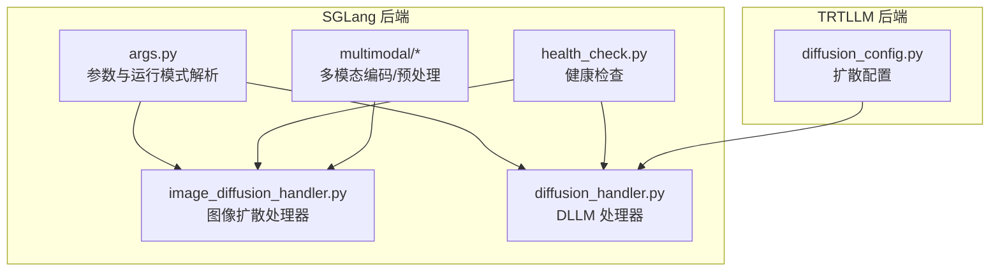
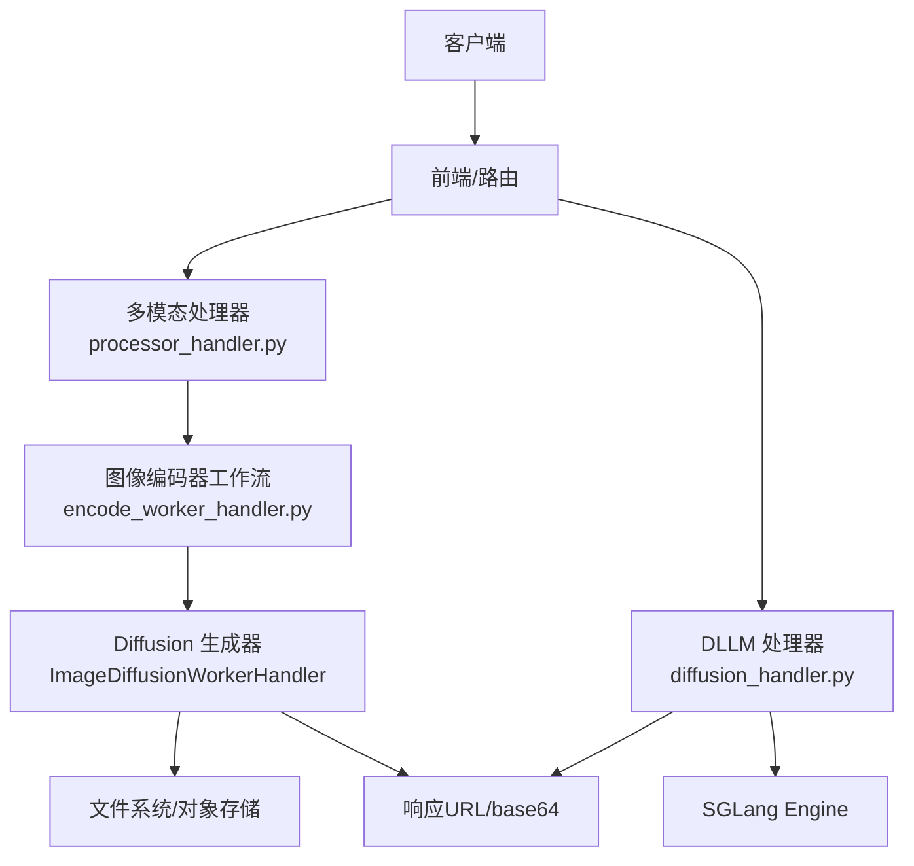
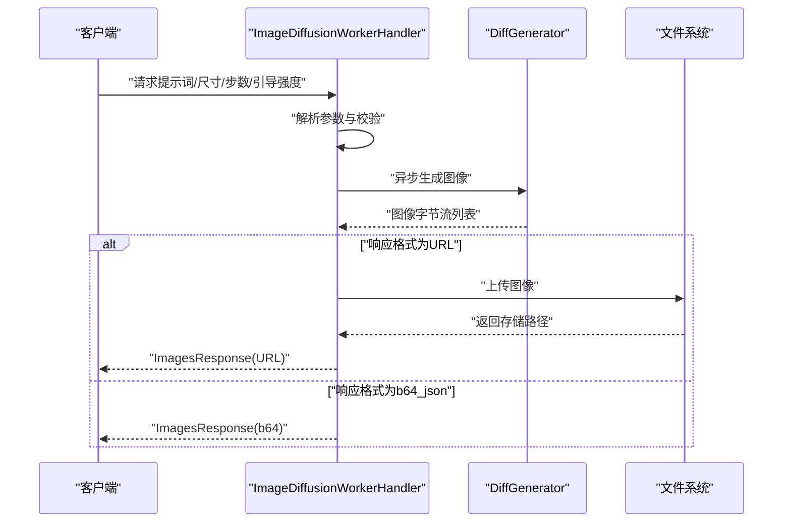
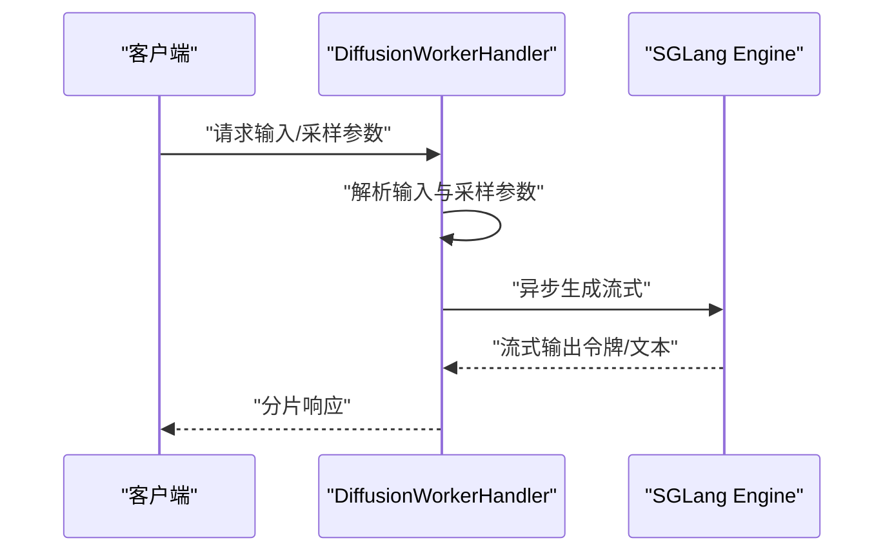
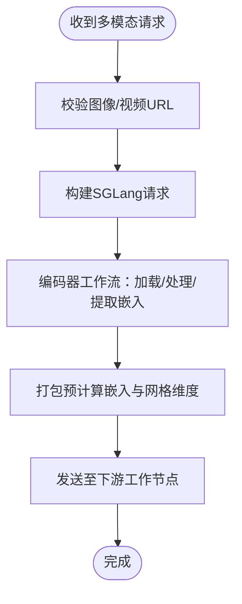
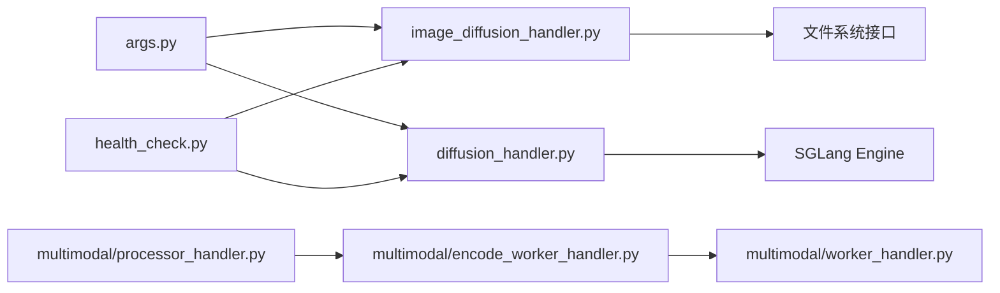

# 扩散模型支持

<cite>
**本文引用的文件**
- [image_diffusion_handler.py](file://components/src/dynamo/sglang/request_handlers/image_diffusion/image_diffusion_handler.py)
- [health_check.py](file://components/src/dynamo/sglang/health_check.py)
- [args.py](file://components/src/dynamo/sglang/args.py)
- [diffusion_handler.py](file://components/src/dynamo/sglang/request_handlers/llm/diffusion_handler.py)
- [diffusion_config.py](file://components/src/dynamo/trtllm/configs/diffusion_config.py)
- [multimodal/processor_handler.py](file://components/src/dynamo/sglang/request_handlers/multimodal/processor_handler.py)
- [multimodal/encode_worker_handler.py](file://components/src/dynamo/sglang/request_handlers/multimodal/encode_worker_handler.py)
- [multimodal/worker_handler.py](file://components/src/dynamo/sglang/request_handlers/multimodal/worker_handler.py)
- [multimodal-sglang.md](file://docs/pages/features/multimodal/multimodal-sglang.md)
- [test_sglang_image_diffusion_handler.py](file://components/src/dynamo/sglang/tests/test_sglang_image_diffusion_handler.py)
</cite>

## 目录
1. [引言](#引言)
2. [项目结构](#项目结构)
3. [核心组件](#核心组件)
4. [架构总览](#架构总览)
5. [详细组件分析](#详细组件分析)
6. [依赖关系分析](#依赖关系分析)
7. [性能考虑](#性能考虑)
8. [故障排除指南](#故障排除指南)
9. [结论](#结论)
10. [附录](#附录)

## 引言
本技术文档聚焦于 SGLang 在扩散模型（扩散语言模型 DLLM 与图像扩散模型）上的支持与实现。内容涵盖：
- 扩散语言模型（DLLM）与图像扩散模型的架构设计与实现原理
- 扩散算法的配置项与参数调优策略
- 图像扩散处理器的工作机制（生成流程与存储管理）
- 健康检查与监控策略
- 与传统大语言模型（LLM）的区别与适用场景
- 部署配置、性能基准测试与故障排除
- 实际使用示例与最佳实践建议

## 项目结构
围绕扩散模型支持的关键目录与文件如下：
- SGLang 后端的图像扩散处理器：components/src/dynamo/sglang/request_handlers/image_diffusion
- SGLang 后端的 DLLM 处理器：components/src/dynamo/sglang/request_handlers/llm/diffusion_handler.py
- TRTLLM 的扩散配置：components/src/dynamo/trtllm/configs/diffusion_config.py
- SGLang 参数与运行模式解析：components/src/dynamo/sglang/args.py
- SGLang 健康检查：components/src/dynamo/sglang/health_check.py
- 多模态（图像编码/预处理）与扩散集成：components/src/dynamo/sglang/request_handlers/multimodal/*
- 文档与已知限制：docs/pages/features/multimodal/multimodal-sglang.md
- 测试用例：components/src/dynamo/sglang/tests/test_sglang_image_diffusion_handler.py

**图表来源**
- [args.py](file://components/src/dynamo/sglang/args.py#L514-L541)
- [health_check.py](file://components/src/dynamo/sglang/health_check.py#L123-L146)
- [image_diffusion_handler.py](file://components/src/dynamo/sglang/request_handlers/image_diffusion/image_diffusion_handler.py#L27-L61)
- [diffusion_handler.py](file://components/src/dynamo/sglang/request_handlers/llm/diffusion_handler.py#L15-L58)
- [diffusion_config.py](file://components/src/dynamo/trtllm/configs/diffusion_config.py#L20-L99)

**章节来源**
- [args.py](file://components/src/dynamo/sglang/args.py#L514-L541)
- [multimodal-sglang.md](file://docs/pages/features/multimodal/multimodal-sglang.md#L296-L409)

## 核心组件
- 图像扩散处理器（ImageDiffusionWorkerHandler）
  - 负责接收文本提示，调用 DiffGenerator 进行图像生成，支持 base64 返回或上传到文件系统并返回 URL
  - 支持响应格式选择、尺寸解析、随机种子、负向提示等参数
- DLLM 处理器（DiffusionWorkerHandler）
  - 基于 SGLang Engine 的扩散语言模型推理，继承解码工作流，支持流式输出
- 扩散配置（DiffusionConfig）
  - 定义模型路径、默认生成参数、并行度、优化开关等
- 参数与运行模式（args.py）
  - 解析 SGLang 与 Dynamo 的混合参数，自动推断端点类型与服务模式（含图像扩散专用逻辑）
- 健康检查（health_check.py）
  - 提供针对 SGLang 与图像扩散的最小化健康检查载荷，确保资源占用低、响应快
- 多模态集成
  - 多模态处理器与编码器工作流，为图像/视频输入提供预处理与嵌入生成，便于与扩散模型协同

**章节来源**
- [image_diffusion_handler.py](file://components/src/dynamo/sglang/request_handlers/image_diffusion/image_diffusion_handler.py#L27-L61)
- [diffusion_handler.py](file://components/src/dynamo/sglang/request_handlers/llm/diffusion_handler.py#L15-L58)
- [diffusion_config.py](file://components/src/dynamo/trtllm/configs/diffusion_config.py#L20-L99)
- [args.py](file://components/src/dynamo/sglang/args.py#L514-L541)
- [health_check.py](file://components/src/dynamo/sglang/health_check.py#L123-L146)

## 架构总览
下图展示了图像扩散与 DLLM 的关键交互路径与职责划分。

**图表来源**
- [multimodal/processor_handler.py](file://components/src/dynamo/sglang/request_handlers/multimodal/processor_handler.py#L84-L119)
- [multimodal/encode_worker_handler.py](file://components/src/dynamo/sglang/request_handlers/multimodal/encode_worker_handler.py#L98-L146)
- [image_diffusion_handler.py](file://components/src/dynamo/sglang/request_handlers/image_diffusion/image_diffusion_handler.py#L70-L136)
- [diffusion_handler.py](file://components/src/dynamo/sglang/request_handlers/llm/diffusion_handler.py#L59-L101)

## 详细组件分析

### 图像扩散处理器（ImageDiffusionWorkerHandler）
- 职责
  - 接收请求（提示词、尺寸、步数、引导强度等），调用 DiffGenerator 生成图像
  - 将图像以 base64 或上传至文件系统并返回 URL
  - 支持分布式追踪头注入，便于可观测性
- 关键流程
  - 参数校验与解析（尺寸、步数上限、负向提示、种子）
  - 生成图像列表，统一转换为字节流
  - 按响应格式写入数据并封装为 OpenAI 兼容响应
- 存储管理
  - 支持任意 fsspec 兼容文件系统（如 S3/GCS/本地）
  - 按用户与请求维度组织路径，返回可访问的公共 URL
- 错误处理
  - 捕获异常并返回包含错误信息的响应体

**图表来源**
- [image_diffusion_handler.py](file://components/src/dynamo/sglang/request_handlers/image_diffusion/image_diffusion_handler.py#L70-L136)
- [image_diffusion_handler.py](file://components/src/dynamo/sglang/request_handlers/image_diffusion/image_diffusion_handler.py#L206-L235)

**章节来源**
- [image_diffusion_handler.py](file://components/src/dynamo/sglang/request_handlers/image_diffusion/image_diffusion_handler.py#L70-L136)
- [image_diffusion_handler.py](file://components/src/dynamo/sglang/request_handlers/image_diffusion/image_diffusion_handler.py#L206-L235)

### DLLM 处理器（DiffusionWorkerHandler）
- 职责
  - 基于 SGLang Engine 的扩散语言模型推理，支持流式输出
  - 校验引擎是否启用扩散算法配置
- 关键流程
  - 解析输入参数（token_ids 或文本）
  - 构建采样参数
  - 通过引擎异步生成，按令牌或文本流式返回

**图表来源**
- [diffusion_handler.py](file://components/src/dynamo/sglang/request_handlers/llm/diffusion_handler.py#L59-L101)

**章节来源**
- [diffusion_handler.py](file://components/src/dynamo/sglang/request_handlers/llm/diffusion_handler.py#L15-L58)
- [diffusion_handler.py](file://components/src/dynamo/sglang/request_handlers/llm/diffusion_handler.py#L59-L101)

### 多模态与扩散集成
- 多模态处理器
  - 校验图像/视频 URL，构建 SGLang 请求，转发给编码器工作流
- 编码器工作流
  - 加载图像，使用图像处理器与视觉模型提取嵌入，生成 SGLang 可消费的预计算嵌入格式
- 预填/解码工作流
  - 将预计算嵌入与网格维度等元数据打包，交由下游工作节点进行后续推理

**图表来源**
- [multimodal/processor_handler.py](file://components/src/dynamo/sglang/request_handlers/multimodal/processor_handler.py#L84-L119)
- [multimodal/encode_worker_handler.py](file://components/src/dynamo/sglang/request_handlers/multimodal/encode_worker_handler.py#L98-L146)
- [multimodal/worker_handler.py](file://components/src/dynamo/sglang/request_handlers/multimodal/worker_handler.py#L114-L141)

**章节来源**
- [multimodal/processor_handler.py](file://components/src/dynamo/sglang/request_handlers/multimodal/processor_handler.py#L84-L119)
- [multimodal/encode_worker_handler.py](file://components/src/dynamo/sglang/request_handlers/multimodal/encode_worker_handler.py#L98-L146)
- [multimodal/worker_handler.py](file://components/src/dynamo/sglang/request_handlers/multimodal/worker_handler.py#L114-L141)
- [multimodal-sglang.md](file://docs/pages/features/multimodal/multimodal-sglang.md#L296-L409)

### 参数与配置
- SGLang 参数与运行模式
  - 自动推断端点类型（图像扩散时设置为 images），强制开启流式输出
  - 支持自定义模板、工具/推理解析器、多模态组件开关等
- 图像扩散处理器配置
  - 文件系统 URL（fsspec）、基础 URL（用于重写响应中的图片链接）
- TRTLLM 扩散配置
  - 默认模型路径、输出目录、默认生成参数（高度/宽度/帧数/步数/引导强度）
  - 优化开关（TeaCache、编译模式）、并行度（数据/张量/环/FSDF 等）

**章节来源**
- [args.py](file://components/src/dynamo/sglang/args.py#L514-L541)
- [args.py](file://components/src/dynamo/sglang/args.py#L128-L147)
- [diffusion_config.py](file://components/src/dynamo/trtllm/configs/diffusion_config.py#L20-L99)

## 依赖关系分析
- 组件耦合
  - 图像扩散处理器依赖文件系统接口与 DiffGenerator；与健康检查模块共享最小化载荷结构
  - DLLM 处理器依赖 SGLang Engine；与参数解析模块共享运行模式与端点类型
  - 多模态链路中，处理器与编码器工作流通过 NATS/Round Robin 通信，编码器内部使用图像加载器与视觉模型
- 外部依赖
  - fsspec（文件系统抽象）
  - PIL（图像编解码）
  - SGLang Engine/DiffGenerator（推理后端）

**图表来源**
- [args.py](file://components/src/dynamo/sglang/args.py#L514-L541)
- [health_check.py](file://components/src/dynamo/sglang/health_check.py#L123-L146)
- [image_diffusion_handler.py](file://components/src/dynamo/sglang/request_handlers/image_diffusion/image_diffusion_handler.py#L27-L61)
- [diffusion_handler.py](file://components/src/dynamo/sglang/request_handlers/llm/diffusion_handler.py#L15-L58)
- [multimodal/processor_handler.py](file://components/src/dynamo/sglang/request_handlers/multimodal/processor_handler.py#L84-L119)
- [multimodal/encode_worker_handler.py](file://components/src/dynamo/sglang/request_handlers/multimodal/encode_worker_handler.py#L98-L146)
- [multimodal/worker_handler.py](file://components/src/dynamo/sglang/request_handlers/multimodal/worker_handler.py#L114-L141)

**章节来源**
- [args.py](file://components/src/dynamo/sglang/args.py#L514-L541)
- [health_check.py](file://components/src/dynamo/sglang/health_check.py#L123-L146)
- [multimodal-sglang.md](file://docs/pages/features/multimodal/multimodal-sglang.md#L296-L409)

## 性能考虑
- 生成步数与质量权衡
  - 步数越多质量越高但延迟更高；健康检查默认仅 1 步以快速验证
- 尺寸与显存
  - 高分辨率会显著增加显存占用；可通过最大尺寸限制避免 OOM
- 并行度与优化
  - 合理设置数据/张量并行度与优化开关（如 TeaCache、编译模式）可提升吞吐
- I/O 与存储
  - 使用 fsspec 抽象可适配不同存储后端；上传/下载路径应尽量靠近边缘以降低网络开销

[本节为通用指导，无需特定文件来源]

## 故障排除指南
- 健康检查失败
  - 确认最小化请求（短提示、小尺寸、单步）可正常返回
  - 检查模型路径与端点类型（图像扩散应为 images）
- 图像生成异常
  - 检查文件系统 URL 与基础 URL 配置
  - 确认图像类型转换（PIL/Numpy/Bytes）路径可用
- 多模态链路问题
  - 校验图像/视频 URL 是否可达
  - 确认编码器工作流已就绪并完成实例等待

**章节来源**
- [health_check.py](file://components/src/dynamo/sglang/health_check.py#L123-L146)
- [image_diffusion_handler.py](file://components/src/dynamo/sglang/request_handlers/image_diffusion/image_diffusion_handler.py#L129-L136)
- [test_sglang_image_diffusion_handler.py](file://components/src/dynamo/sglang/tests/test_sglang_image_diffusion_handler.py#L93-L130)

## 结论
SGLang 在扩散模型上的支持通过“图像扩散处理器”与“DLLM 处理器”两条主线实现，并与多模态链路深度集成。借助灵活的参数解析、最小化健康检查与可扩展的存储抽象，系统在易用性与性能之间取得平衡。结合 TRTLLM 的扩散配置，可在不同硬件与场景下进行精细化调优。

[本节为总结，无需特定文件来源]

## 附录

### 配置与部署要点
- 图像扩散
  - 端点类型：images
  - 文件系统 URL：支持 S3/GCS/本地等
  - 基础 URL：用于重写响应中的图片链接
- DLLM
  - 确保引擎配置启用扩散算法
  - 流式输出已强制开启
- 多模态
  - 处理器负责路由与预处理，编码器负责视觉特征提取

**章节来源**
- [args.py](file://components/src/dynamo/sglang/args.py#L514-L541)
- [args.py](file://components/src/dynamo/sglang/args.py#L128-L147)
- [multimodal-sglang.md](file://docs/pages/features/multimodal/multimodal-sglang.md#L296-L409)

### 参数调优策略
- 采样参数
  - 步数：根据质量需求与延迟预算折中
  - 引导强度：影响生成与提示的契合度
  - 种子：固定种子可复现实验结果
- 存储与传输
  - 优先使用就近存储，减少跨域传输
  - 对于大体积图像，优先选择 URL 返回以降低内存峰值

**章节来源**
- [image_diffusion_handler.py](file://components/src/dynamo/sglang/request_handlers/image_diffusion/image_diffusion_handler.py#L95-L111)
- [diffusion_config.py](file://components/src/dynamo/trtllm/configs/diffusion_config.py#L47-L66)

### 实际使用示例与最佳实践
- 示例
  - 图像扩散：构造最小请求（短提示、小尺寸、单步），验证健康检查
  - 多模态：提供图像 URL，由处理器转交给编码器工作流
- 最佳实践
  - 显存受限时优先降低分辨率与步数
  - 固定种子便于 A/B 实验
  - 使用 URL 返回以降低内存压力

**章节来源**
- [health_check.py](file://components/src/dynamo/sglang/health_check.py#L123-L146)
- [multimodal/processor_handler.py](file://components/src/dynamo/sglang/request_handlers/multimodal/processor_handler.py#L84-L119)
- [test_sglang_image_diffusion_handler.py](file://components/src/dynamo/sglang/tests/test_sglang_image_diffusion_handler.py#L93-L130)