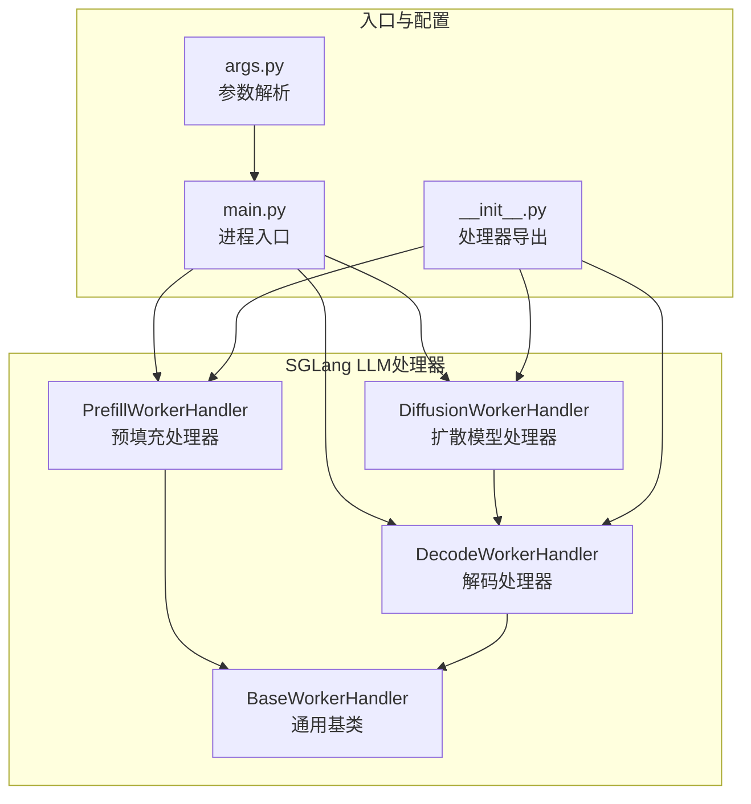
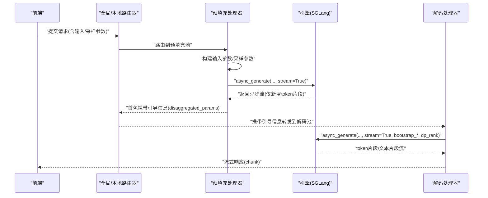
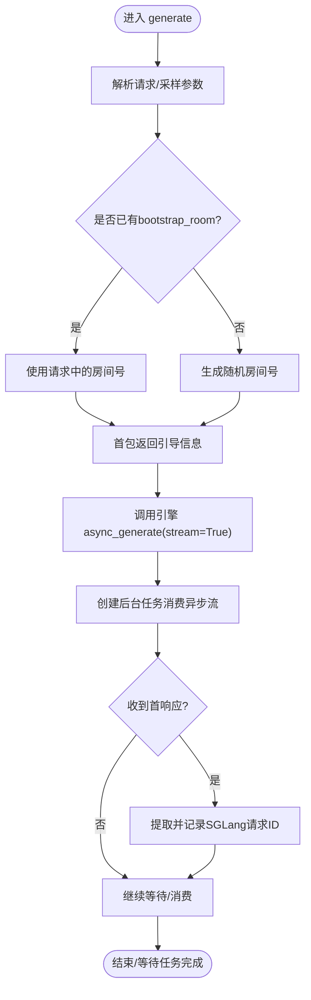
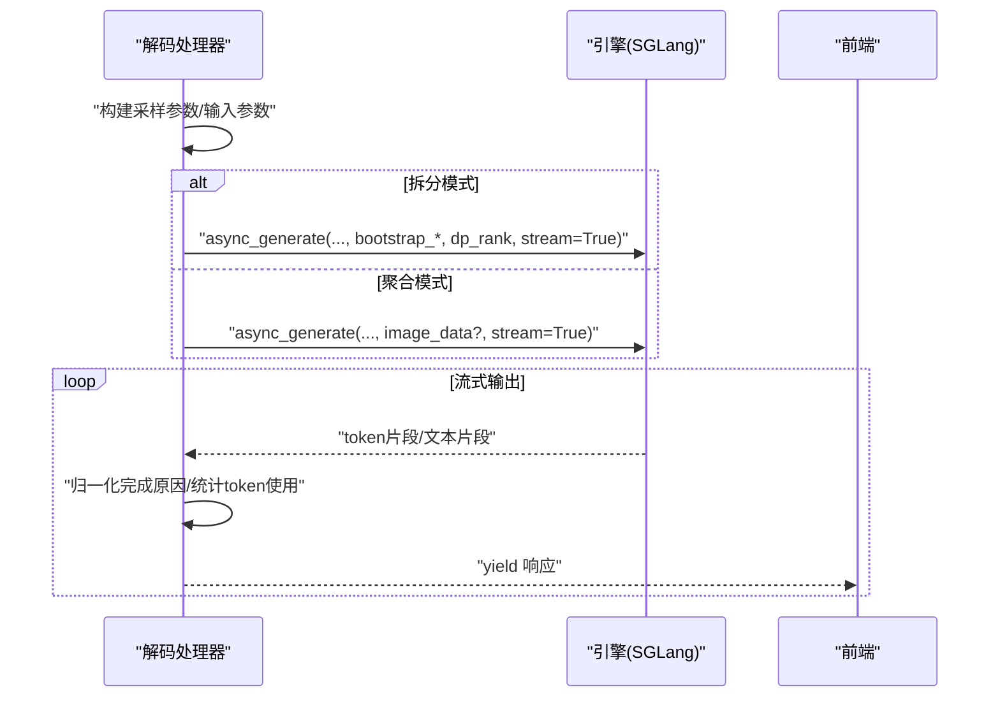
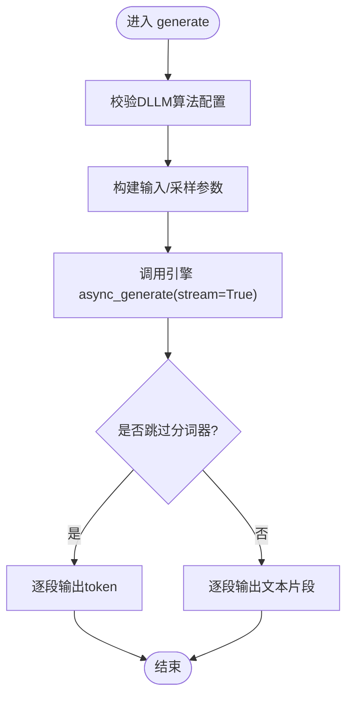
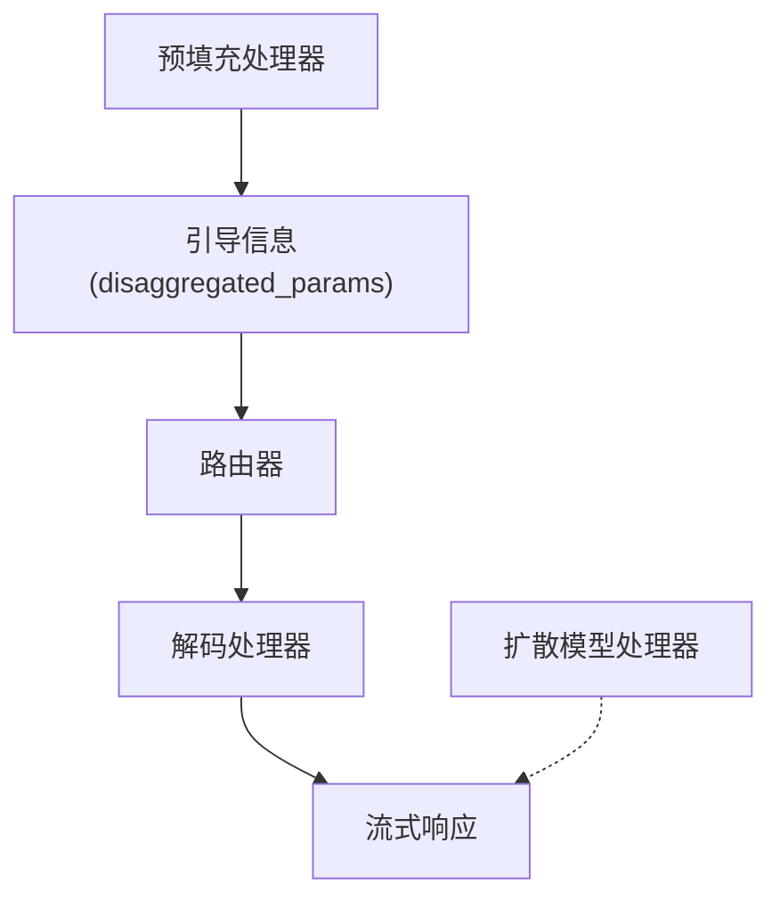
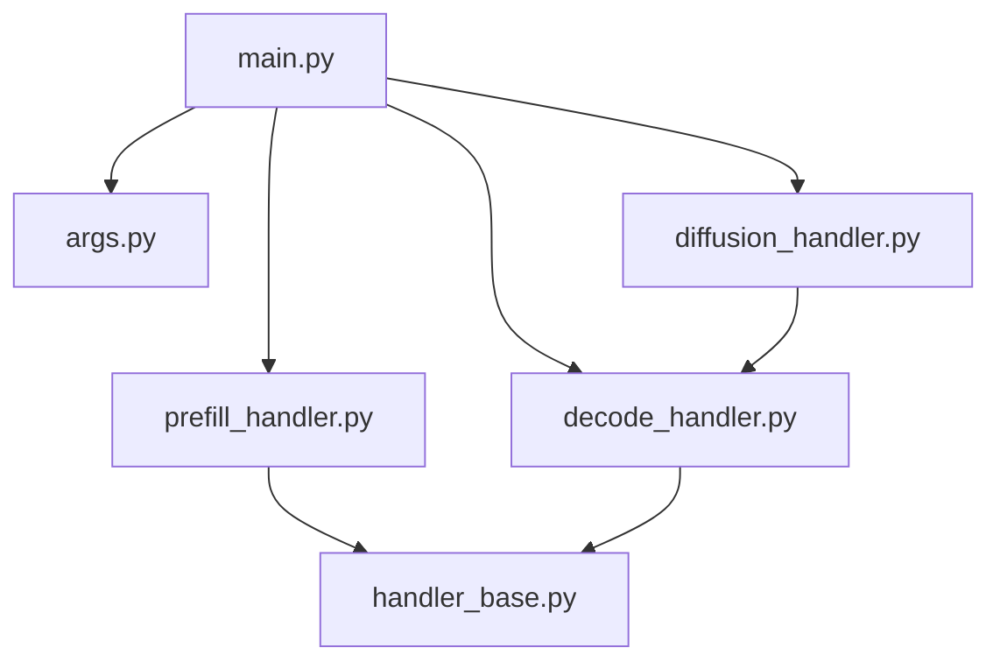

# LLM处理器

<cite>
**本文引用的文件**
- [prefill_handler.py](file://components/src/dynamo/sglang/request_handlers/llm/prefill_handler.py)
- [decode_handler.py](file://components/src/dynamo/sglang/request_handlers/llm/decode_handler.py)
- [diffusion_handler.py](file://components/src/dynamo/sglang/request_handlers/llm/diffusion_handler.py)
- [handler_base.py](file://components/src/dynamo/sglang/request_handlers/handler_base.py)
- [main.py](file://components/src/dynamo/sglang/main.py)
- [args.py](file://components/src/dynamo/sglang/args.py)
- [image_diffusion_handler.py](file://components/src/dynamo/sglang/request_handlers/image_diffusion/image_diffusion_handler.py)
- [__init__.py](file://components/src/dynamo/sglang/request_handlers/llm/__init__.py)
- [prefill_router.rs](file://lib/llm/src/kv_router/prefill_router.rs)
- [mocker.rs](file://lib/llm/src/mocker.rs)
- [handler.py](file://components/src/dynamo/global_router/handler.py)
- [test_sglang_prometheus_utils.py](file://components/src/dynamo/sglang/tests/test_sglang_prometheus_utils.py)
</cite>

## 目录
1. [简介](#简介)
2. [项目结构](#项目结构)
3. [核心组件](#核心组件)
4. [架构总览](#架构总览)
5. [详细组件分析](#详细组件分析)
6. [依赖分析](#依赖分析)
7. [性能考虑](#性能考虑)
8. [故障排查指南](#故障排查指南)
9. [结论](#结论)
10. [附录：使用示例与调试](#附录使用示例与调试)

## 简介
本文件系统性梳理 SGLang LLM 处理器在 Dynamo 框架中的实现与协作关系，重点覆盖三类处理器：
- 预填充处理器（prefill_handler）：负责离线计算 KV 缓存、序列预处理与批量处理，为解码阶段提供已编码的上下文。
- 解码处理器（decode_handler）：负责在线 token 流式生成、采样策略执行与流式响应输出，支持聚合与拆分两种服务模式。
- 扩散模型处理器（diffusion_handler）：基于 SGLang 引擎的扩散语言模型能力，提供 token 级或文本级的流式输出。

文档还说明三者之间的数据流转、协作关系、配置参数、性能优化与常见问题排查，并给出实际使用示例与调试建议。

## 项目结构
SGLang 处理器位于 components/src/dynamo/sglang/request_handlers/llm 下，采用按功能模块划分的组织方式：
- 预填充、解码、扩散处理器分别独立实现，共享统一的基类与输入参数管理工具。
- 入口程序根据运行模式选择初始化不同处理器，并注册端点与健康检查。

图表来源
- [main.py](file://components/src/dynamo/sglang/main.py#L330-L494)
- [prefill_handler.py](file://components/src/dynamo/sglang/request_handlers/llm/prefill_handler.py#L16-L58)
- [decode_handler.py](file://components/src/dynamo/sglang/request_handlers/llm/decode_handler.py#L18-L59)
- [diffusion_handler.py](file://components/src/dynamo/sglang/request_handlers/llm/diffusion_handler.py#L15-L58)
- [handler_base.py](file://components/src/dynamo/sglang/request_handlers/handler_base.py#L89-L141)
- [args.py](file://components/src/dynamo/sglang/args.py#L308-L605)
- [__init__.py](file://components/src/dynamo/sglang/request_handlers/llm/__init__.py#L1-L12)

章节来源
- [main.py](file://components/src/dynamo/sglang/main.py#L330-L494)
- [args.py](file://components/src/dynamo/sglang/args.py#L308-L605)
- [__init__.py](file://components/src/dynamo/sglang/request_handlers/llm/__init__.py#L1-L12)

## 核心组件
- BaseWorkerHandler：抽象基类，封装引擎集成、输入参数管理、分布式追踪、内存占用释放/恢复、权重更新等通用能力。
- PrefillWorkerHandler：预填充专用处理器，负责产出 KV 缓存并提供“引导信息”（bootstrap_info），供解码阶段连接。
- DecodeWorkerHandler：解码专用处理器，支持聚合与拆分两种模式；负责采样参数构建、token 文本流式输出、完成原因归一化。
- DiffusionWorkerHandler：继承自解码处理器，面向扩散语言模型，提供 token 或文本级流式输出。

章节来源
- [handler_base.py](file://components/src/dynamo/sglang/request_handlers/handler_base.py#L89-L378)
- [prefill_handler.py](file://components/src/dynamo/sglang/request_handlers/llm/prefill_handler.py#L16-L165)
- [decode_handler.py](file://components/src/dynamo/sglang/request_handlers/llm/decode_handler.py#L18-L320)
- [diffusion_handler.py](file://components/src/dynamo/sglang/request_handlers/llm/diffusion_handler.py#L15-L104)

## 架构总览
SGLang 在 Dynamo 中以“预填充 + 解码”的拆分模式运行时，前端请求经由全局/本地路由器路由到预填充池，预填充完成后通过“引导信息”建立连接，再进入解码池持续生成 token。扩散模型处理器可单独部署，不参与预填充-解码流水线。

图表来源
- [prefill_handler.py](file://components/src/dynamo/sglang/request_handlers/llm/prefill_handler.py#L93-L139)
- [decode_handler.py](file://components/src/dynamo/sglang/request_handlers/llm/decode_handler.py#L113-L191)
- [prefill_router.rs](file://lib/llm/src/kv_router/prefill_router.rs#L534-L667)
- [mocker.rs](file://lib/llm/src/mocker.rs#L330-L361)

## 详细组件分析

### 预填充处理器（PrefillWorkerHandler）
- 职责
  - 从请求中提取输入与采样参数，调用 SGLang 引擎进行预填充，产出 KV 缓存。
  - 生成“引导房间号”（bootstrap_room），并通过首包返回给路由器，用于后续解码阶段建立连接。
  - 使用异步生成器消费引擎输出，同时维护取消监控任务，确保请求被取消时能及时终止。
- 关键流程
  - 输入参数与采样参数构建：兼容“内部预处理格式”和“OpenAI风格格式”，自动映射温度、top_p、top_k、最大新 token 等。
  - 引导信息生成：优先使用请求中提供的 bootstrap_room，否则自动生成；返回包含主机、端口与房间号的引导信息。
  - 引擎调用：设置 stream=True，传入 bootstrap_host/port/room 与外部追踪头，记录 trace_id。
  - 结果消费：创建后台任务消费异步流，首次响应后提取 SGLang 请求 ID，便于后续取消。
- 取消与清理
  - 维护挂起的任务集合，清理时取消所有未完成任务并关闭引擎。

图表来源
- [prefill_handler.py](file://components/src/dynamo/sglang/request_handlers/llm/prefill_handler.py#L60-L165)

章节来源
- [prefill_handler.py](file://components/src/dynamo/sglang/request_handlers/llm/prefill_handler.py#L60-L165)
- [handler_base.py](file://components/src/dynamo/sglang/request_handlers/handler_base.py#L380-L437)

### 解码处理器（DecodeWorkerHandler）
- 职责
  - 在聚合模式下直接调用引擎完成解码；在拆分模式下接收预填充阶段提供的引导信息，建立与预填充节点的连接。
  - 支持两种输出格式：token 列表（skip_tokenizer_init=True）与 OpenAI 风格文本片段（skip_tokenizer_init=False）。
  - 归一化完成原因（finish_reason），并在完成时附加 token 使用统计（prompt/completion/total，以及缓存命中细节）。
- 采样策略
  - 从请求中提取温度、top_p、top_k、最大新 token、忽略 EOS 等参数，构建引擎所需的采样参数字典。
- 多模态支持
  - 在聚合模式下可接受图像 URL 列表，交由引擎的多模态数据处理器进行加载与编码。
- 取消与清理
  - 使用取消监控上下文管理器，确保在请求取消或关闭事件触发时调用引擎的 abort_request。

图表来源
- [decode_handler.py](file://components/src/dynamo/sglang/request_handlers/llm/decode_handler.py#L93-L320)

章节来源
- [decode_handler.py](file://components/src/dynamo/sglang/request_handlers/llm/decode_handler.py#L61-L320)
- [handler_base.py](file://components/src/dynamo/sglang/request_handlers/handler_base.py#L526-L574)

### 扩散模型处理器（DiffusionWorkerHandler）
- 特殊性
  - 继承自解码处理器，但面向扩散语言模型（DLLM），需在启动时校验引擎是否配置了扩散算法。
  - 输出仍遵循 Dynamo 的流式约定，但由于扩散特性，通常在末尾一次性返回结果。
- 关键点
  - 通过引擎的 async_generate 启动扩散生成，保持 stream=True。
  - 根据是否跳过分词器决定输出格式（token 或文本）。
  - 记录 trace 信息以便可观测性。

图表来源
- [diffusion_handler.py](file://components/src/dynamo/sglang/request_handlers/llm/diffusion_handler.py#L59-L101)

章节来源
- [diffusion_handler.py](file://components/src/dynamo/sglang/request_handlers/llm/diffusion_handler.py#L15-L104)

### 三者协作与数据流
- 预填充阶段
  - 预填充处理器产出 KV 缓存，并在首包中返回引导信息（主机、端口、房间号）。
- 路由与连接
  - 路由器根据策略选择预填充池，预填充完成后建立与解码池的连接（依据引导信息）。
- 解码阶段
  - 解码处理器接收引导信息与数据并行秩（dp_rank），持续输出 token 或文本片段。
- 扩散模型
  - 独立于预填充-解码流水线，单独注册端点并提供健康检查。

图表来源
- [prefill_handler.py](file://components/src/dynamo/sglang/request_handlers/llm/prefill_handler.py#L113-L118)
- [prefill_router.rs](file://lib/llm/src/kv_router/prefill_router.rs#L534-L667)
- [mocker.rs](file://lib/llm/src/mocker.rs#L330-L361)

章节来源
- [prefill_router.rs](file://lib/llm/src/kv_router/prefill_router.rs#L534-L667)
- [mocker.rs](file://lib/llm/src/mocker.rs#L330-L361)

## 依赖分析
- 运行时与端点
  - 入口根据 serving_mode 与工作角色选择初始化对应处理器，并注册端点与健康检查。
- 配置与参数
  - 参数解析模块负责合并 CLI 与配置文件、推断端点、下载模型、强制 stream_output=True、设置 skip_tokenizer_init 等。
- 基类能力
  - 基类提供输入参数管理、取消监控、内存占用释放/恢复、权重更新、引擎路由注册等通用能力。

图表来源
- [main.py](file://components/src/dynamo/sglang/main.py#L191-L494)
- [args.py](file://components/src/dynamo/sglang/args.py#L308-L605)
- [handler_base.py](file://components/src/dynamo/sglang/request_handlers/handler_base.py#L323-L378)

章节来源
- [main.py](file://components/src/dynamo/sglang/main.py#L191-L494)
- [args.py](file://components/src/dynamo/sglang/args.py#L308-L605)
- [handler_base.py](file://components/src/dynamo/sglang/request_handlers/handler_base.py#L323-L378)

## 性能考虑
- 流式输出优化
  - 强制 stream_output=True，使引擎仅返回自上次输出以来的新 token 片段，减少冗余传输与拼接开销。
- 预填充热身
  - 预填充节点在领导节点上执行一次空请求热身，避免首次 TTFT 抖动。
- 内存占用控制
  - 提供 release/resume 接口，支持分层释放 KV 缓存、权重与 CUDA 图，配合发现注销/重注册实现平滑降载。
- 分布式并行
  - 通过 dp_rank 将请求路由到指定数据并行秩，提升吞吐与资源利用率。
- 指标与可观测性
  - 通过 Prometheus 指标过滤与导出，聚焦 SGLang 相关指标，便于性能分析与告警。

章节来源
- [args.py](file://components/src/dynamo/sglang/args.py#L544-L548)
- [main.py](file://components/src/dynamo/sglang/main.py#L359-L361)
- [handler_base.py](file://components/src/dynamo/sglang/request_handlers/handler_base.py#L142-L236)
- [test_sglang_prometheus_utils.py](file://components/src/dynamo/sglang/tests/test_sglang_prometheus_utils.py#L21-L82)

## 故障排查指南
- 预填充-解码连接失败
  - 检查引导信息是否正确传递（主机、端口、房间号），确认路由器已将引导信息写入请求。
  - 若强制拆分模式且预填充未激活，路由器会回退到仅解码路径，可能影响 TTFT。
- 请求取消与中断
  - 基类取消监控会在请求取消或关闭事件触发时调用引擎 abort_request，若无响应需检查上下文状态与取消信号链路。
- 内存占用释放异常
  - 释放顺序必须先注销发现、暂停生成、再释放内存；若顺序错误可能导致请求仍在活跃而无法释放。
- 扩散模型未启用
  - 启动时需验证引擎已配置扩散算法，否则日志会提示行为可能未激活。
- 多模态图像输入
  - 聚合模式下需确保图像 URL 列表格式正确，引擎侧会进行加载与编码。

章节来源
- [prefill_router.rs](file://lib/llm/src/kv_router/prefill_router.rs#L637-L667)
- [mocker.rs](file://lib/llm/src/mocker.rs#L330-L361)
- [handler_base.py](file://components/src/dynamo/sglang/request_handlers/handler_base.py#L439-L525)
- [diffusion_handler.py](file://components/src/dynamo/sglang/request_handlers/llm/diffusion_handler.py#L43-L57)

## 结论
SGLang LLM 处理器在 Dynamo 中通过统一的基类与清晰的职责边界，实现了预填充与解码的高效拆分、灵活的采样与流式输出、以及对扩散模型的原生支持。借助引导信息机制与分布式路由，系统在保证低延迟的同时具备良好的扩展性与可观测性。实践中建议关注流式输出一致性、内存占用释放顺序与多模态输入格式，以获得稳定与高性能的服务体验。

## 附录：使用示例与调试
- 启动参数要点
  - 通过 --dyn-endpoint-types 控制启用的端点类型（如 chat、completions、images）。
  - 通过 --use-sglang-tokenizer 或 skip_tokenizer_init 控制是否使用 SGLang 分词器。
  - 通过 --disaggregation-mode 选择聚合/预填充/解码模式。
- 实际使用步骤（概念性）
  - 启动预填充处理器与解码处理器（或仅解码处理器）。
  - 前端发送请求，携带输入与采样参数。
  - 预填充阶段返回引导信息，解码阶段持续输出流式响应。
  - 对于扩散模型，单独启动扩散处理器并提供模型路径与并行度参数。
- 调试建议
  - 开启分布式追踪头，结合日志定位请求生命周期。
  - 使用 Prometheus 指标导出工具筛选 SGLang 相关指标，观察吞吐与缓存命中率。
  - 在预填充阶段执行一次热身请求，降低首次 TTFT 波动。

章节来源
- [args.py](file://components/src/dynamo/sglang/args.py#L33-L148)
- [main.py](file://components/src/dynamo/sglang/main.py#L214-L232)
- [test_sglang_prometheus_utils.py](file://components/src/dynamo/sglang/tests/test_sglang_prometheus_utils.py#L21-L82)