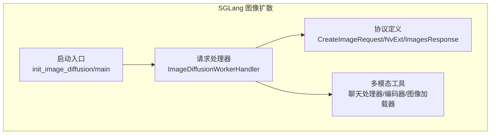
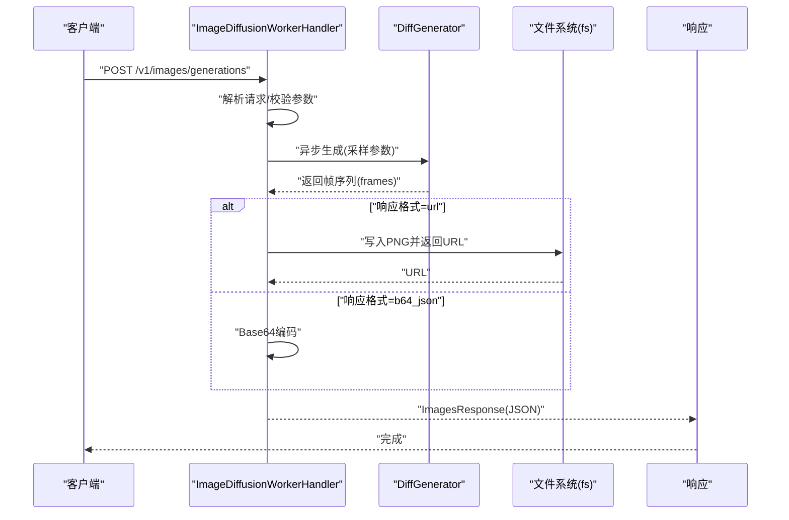
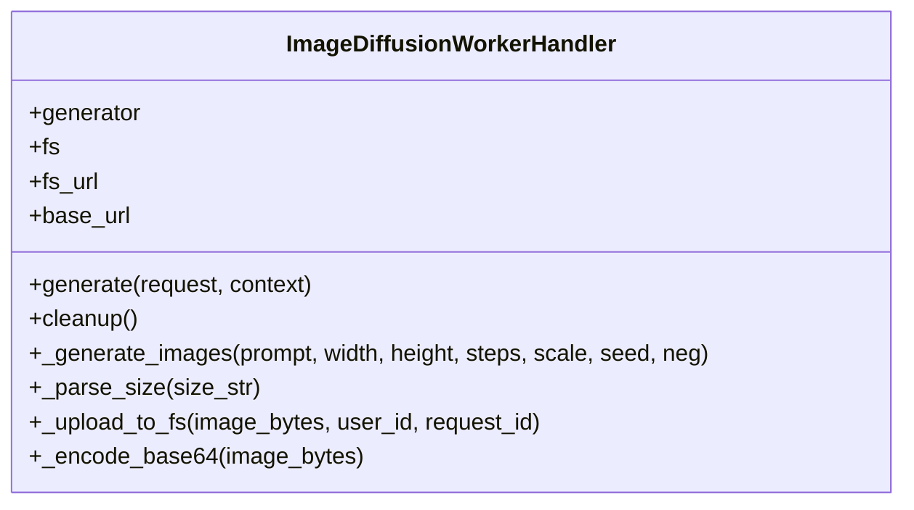
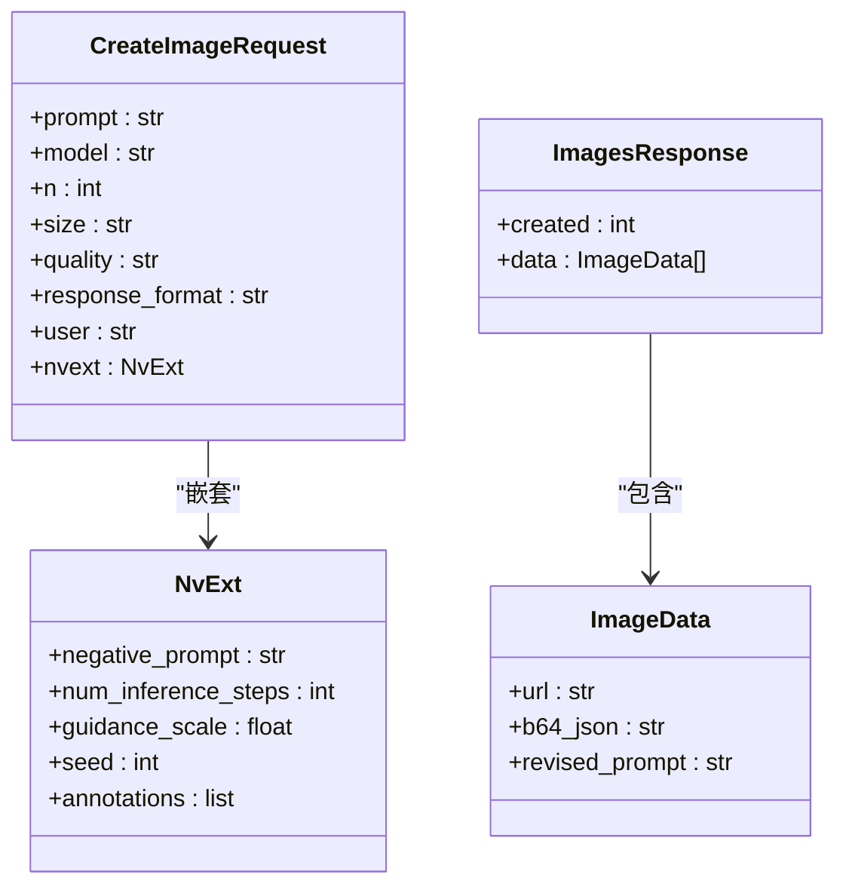
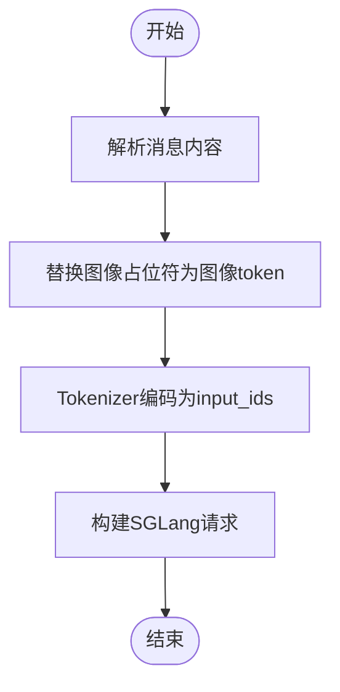
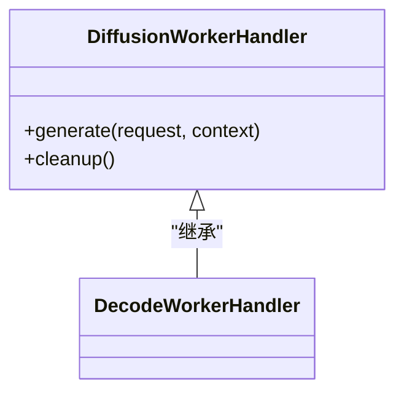
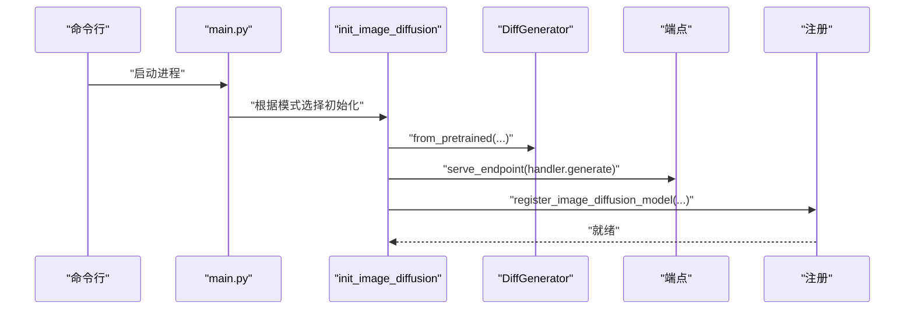
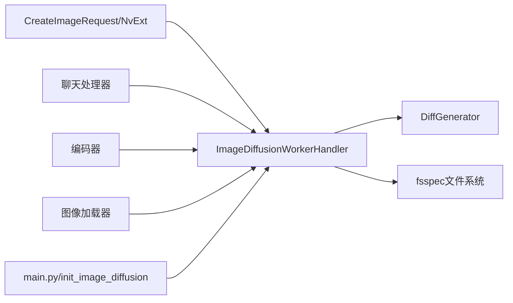

# 图像扩散处理器

<cite>
**本文引用的文件**
- [components/src/dynamo/sglang/request_handlers/image_diffusion/image_diffusion_handler.py](file://components/src/dynamo/sglang/request_handlers/image_diffusion/image_diffusion_handler.py)
- [components/src/dynamo/sglang/request_handlers/llm/diffusion_handler.py](file://components/src/dynamo/sglang/request_handlers/llm/diffusion_handler.py)
- [components/src/dynamo/sglang/protocol.py](file://components/src/dynamo/sglang/protocol.py)
- [components/src/dynamo/sglang/multimodal_utils/multimodal_chat_processor.py](file://components/src/dynamo/sglang/multimodal_utils/multimodal_chat_processor.py)
- [components/src/dynamo/sglang/multimodal_utils/multimodal_encode_utils.py](file://components/src/dynamo/sglang/multimodal_utils/multimodal_encode_utils.py)
- [components/src/dynamo/sglang/multimodal_utils/multimodal_image_loader.py](file://components/src/dynamo/sglang/multimodal_utils/multimodal_image_loader.py)
- [components/src/dynamo/sglang/main.py](file://components/src/dynamo/sglang/main.py)
- [components/src/dynamo/sglang/tests/test_sglang_image_diffusion_handler.py](file://components/src/dynamo/sglang/tests/test_sglang_image_diffusion_handler.py)
- [components/src/dynamo/trtllm/configs/diffusion_config.py](file://components/src/dynamo/trtllm/configs/diffusion_config.py)
- [lib/gpu_memory_service/integrations/common/patches.py](file://lib/gpu_memory_service/integrations/common/patches.py)
</cite>

## 目录
1. [引言](#引言)
2. [项目结构](#项目结构)
3. [核心组件](#核心组件)
4. [架构总览](#架构总览)
5. [详细组件分析](#详细组件分析)
6. [依赖关系分析](#依赖关系分析)
7. [性能考量](#性能考量)
8. [故障排查指南](#故障排查指南)
9. [结论](#结论)
10. [附录](#附录)

## 引言
本文件面向SGLang图像扩散处理器的技术文档，系统阐述扩散模型在图像生成中的应用原理与处理流程，覆盖噪声调度、去噪过程与图像重建机制；同时完整文档化图像扩散处理器的配置参数、输入提示处理与输出格式规范，深入解释推理优化技术与内存管理策略，并提供质量控制、分辨率设置与风格转换等能力说明，最后给出实际使用示例、性能调优建议与常见问题排查指南。

## 项目结构
SGLang图像扩散处理器位于组件目录中，主要由以下模块构成：
- 请求处理器：负责接收请求、解析参数、调用DiffGenerator进行图像生成、处理存储与编码响应。
- 协议定义：定义图像生成请求/响应的数据结构（含NVIDIA扩展参数）。
- 多模态工具：多模态聊天处理器、图像编码器与图像加载器，支撑文本-图像联合理解与预处理。
- 启动入口：根据运行模式初始化不同类型的处理器（图像扩散、扩散语言模型、多模态等）。
- 测试：对图像扩散处理器进行单元测试，覆盖成功路径、错误处理、格式转换与参数传递。

**图表来源**
- [components/src/dynamo/sglang/request_handlers/image_diffusion/image_diffusion_handler.py](file://components/src/dynamo/sglang/request_handlers/image_diffusion/image_diffusion_handler.py#L1-L236)
- [components/src/dynamo/sglang/protocol.py](file://components/src/dynamo/sglang/protocol.py#L141-L177)
- [components/src/dynamo/sglang/multimodal_utils/multimodal_chat_processor.py](file://components/src/dynamo/sglang/multimodal_utils/multimodal_chat_processor.py#L1-L163)
- [components/src/dynamo/sglang/multimodal_utils/multimodal_encode_utils.py](file://components/src/dynamo/sglang/multimodal_utils/multimodal_encode_utils.py#L1-L171)
- [components/src/dynamo/sglang/multimodal_utils/multimodal_image_loader.py](file://components/src/dynamo/sglang/multimodal_utils/multimodal_image_loader.py#L1-L124)
- [components/src/dynamo/sglang/main.py](file://components/src/dynamo/sglang/main.py#L562-L644)

**章节来源**
- [components/src/dynamo/sglang/main.py](file://components/src/dynamo/sglang/main.py#L562-L644)

## 核心组件
- 图像扩散请求处理器：负责解析请求、构建采样参数、调用DiffGenerator执行扩散生成、处理存储与编码响应。
- 协议与数据结构：定义图像生成请求体、NVIDIA扩展参数（如步数、引导尺度、种子、负面提示）与响应格式。
- 多模态工具链：文本到对话模板映射、图像嵌入编码、图像加载与缓存。
- 启动与注册：根据命令行参数选择初始化图像扩散处理器，并完成健康检查与模型注册。

**章节来源**
- [components/src/dynamo/sglang/request_handlers/image_diffusion/image_diffusion_handler.py](file://components/src/dynamo/sglang/request_handlers/image_diffusion/image_diffusion_handler.py#L27-L137)
- [components/src/dynamo/sglang/protocol.py](file://components/src/dynamo/sglang/protocol.py#L141-L177)
- [components/src/dynamo/sglang/multimodal_utils/multimodal_chat_processor.py](file://components/src/dynamo/sglang/multimodal_utils/multimodal_chat_processor.py#L11-L48)
- [components/src/dynamo/sglang/multimodal_utils/multimodal_encode_utils.py](file://components/src/dynamo/sglang/multimodal_utils/multimodal_encode_utils.py#L131-L171)
- [components/src/dynamo/sglang/multimodal_utils/multimodal_image_loader.py](file://components/src/dynamo/sglang/multimodal_utils/multimodal_image_loader.py#L44-L124)
- [components/src/dynamo/sglang/main.py](file://components/src/dynamo/sglang/main.py#L562-L644)

## 架构总览
图像扩散处理器采用“请求-生成-存储-响应”的流水线式架构：
- 请求层：解析OpenAI兼容的/v1/images/generations请求，支持NVIDIA扩展参数。
- 生成层：通过DiffGenerator执行扩散算法，返回帧序列（通常为单帧PNG字节）。
- 存储层：可选上传至fsspec兼容文件系统，或直接返回Base64编码。
- 响应层：封装为ImagesResponse，包含时间戳与数据列表。

**图表来源**
- [components/src/dynamo/sglang/request_handlers/image_diffusion/image_diffusion_handler.py](file://components/src/dynamo/sglang/request_handlers/image_diffusion/image_diffusion_handler.py#L70-L137)
- [components/src/dynamo/sglang/protocol.py](file://components/src/dynamo/sglang/protocol.py#L151-L177)

## 详细组件分析

### 图像扩散请求处理器（ImageDiffusionWorkerHandler）
职责与流程：
- 初始化：保存DiffGenerator实例、文件系统句柄与基础URL。
- 请求处理：解析CreateImageRequest，合并NVIDIA扩展参数（步数、引导尺度、种子、负面提示），解析尺寸字符串。
- 生成：调用DiffGenerator异步生成，限制最大推理步数。
- 存储/编码：按需上传至fsspec文件系统并返回URL，或直接Base64编码。
- 响应：构造ImagesResponse并逐条yield。

关键点：
- 最大推理步数上限保护，避免过长生成导致资源耗尽。
- 支持多种图像类型输入（PIL Image、numpy数组、bytes），统一转为PNG字节。
- 错误处理：捕获异常并返回标准错误响应。

**图表来源**
- [components/src/dynamo/sglang/request_handlers/image_diffusion/image_diffusion_handler.py](file://components/src/dynamo/sglang/request_handlers/image_diffusion/image_diffusion_handler.py#L27-L236)

**章节来源**
- [components/src/dynamo/sglang/request_handlers/image_diffusion/image_diffusion_handler.py](file://components/src/dynamo/sglang/request_handlers/image_diffusion/image_diffusion_handler.py#L70-L137)
- [components/src/dynamo/sglang/request_handlers/image_diffusion/image_diffusion_handler.py](file://components/src/dynamo/sglang/request_handlers/image_diffusion/image_diffusion_handler.py#L138-L196)
- [components/src/dynamo/sglang/request_handlers/image_diffusion/image_diffusion_handler.py](file://components/src/dynamo/sglang/request_handlers/image_diffusion/image_diffusion_handler.py#L198-L236)

### 协议与数据结构（CreateImageRequest/NvExt/ImagesResponse）
- CreateImageRequest：支持prompt、model、n、size、quality、response_format、user以及嵌套的nvext扩展字段。
- NvExt：包含negative_prompt、num_inference_steps、guidance_scale、seed、annotations等。
- ImagesResponse：包含created时间戳与data列表（每项为ImageData，支持url或b64_json）。

**图表来源**
- [components/src/dynamo/sglang/protocol.py](file://components/src/dynamo/sglang/protocol.py#L151-L177)
- [components/src/dynamo/sglang/protocol.py](file://components/src/dynamo/sglang/protocol.py#L141-L149)

**章节来源**
- [components/src/dynamo/sglang/protocol.py](file://components/src/dynamo/sglang/protocol.py#L141-L177)

### 多模态工具链
- 文本到对话模板映射：将消息内容转换为SGLang对话模板，替换图像占位符，生成token_ids与采样选项。
- 图像嵌入编码：针对特定模型（如Qwen2.5-VL）提取视觉特征，确保输出维度规范化。
- 图像加载器：支持HTTP/HTTPS、data URL与本地文件，带缓存与格式限制，避免阻塞事件循环。

**图表来源**
- [components/src/dynamo/sglang/multimodal_utils/multimodal_chat_processor.py](file://components/src/dynamo/sglang/multimodal_utils/multimodal_chat_processor.py#L11-L48)

**章节来源**
- [components/src/dynamo/sglang/multimodal_utils/multimodal_chat_processor.py](file://components/src/dynamo/sglang/multimodal_utils/multimodal_chat_processor.py#L11-L48)
- [components/src/dynamo/sglang/multimodal_utils/multimodal_encode_utils.py](file://components/src/dynamo/sglang/multimodal_utils/multimodal_encode_utils.py#L131-L171)
- [components/src/dynamo/sglang/multimodal_utils/multimodal_image_loader.py](file://components/src/dynamo/sglang/multimodal_utils/multimodal_image_loader.py#L44-L124)

### 扩散语言模型处理器（DiffusionWorkerHandler）
- 继承自DecodeWorkerHandler，用于扩散语言模型（DLLM）工作流。
- 负责从引擎获取流式输出，按token或文本形式处理。
- 在初始化时验证引擎是否配置了扩散算法参数。

**图表来源**
- [components/src/dynamo/sglang/request_handlers/llm/diffusion_handler.py](file://components/src/dynamo/sglang/request_handlers/llm/diffusion_handler.py#L15-L104)

**章节来源**
- [components/src/dynamo/sglang/request_handlers/llm/diffusion_handler.py](file://components/src/dynamo/sglang/request_handlers/llm/diffusion_handler.py#L15-L104)

### 启动与注册（init_image_diffusion/main）
- 解析命令行参数，初始化DiffGenerator（非sgl.Engine）。
- 初始化文件系统句柄，准备存储生成的图像。
- 注册端点并启动服务，提供健康检查payload。

**图表来源**
- [components/src/dynamo/sglang/main.py](file://components/src/dynamo/sglang/main.py#L562-L644)

**章节来源**
- [components/src/dynamo/sglang/main.py](file://components/src/dynamo/sglang/main.py#L562-L644)

## 依赖关系分析
- ImageDiffusionWorkerHandler依赖：
  - 协议定义：CreateImageRequest/NvExt/ImagesResponse。
  - 文件系统：fsspec兼容接口，用于上传PNG并生成公开URL。
  - DiffGenerator：执行扩散生成，返回帧序列。
- 多模态工具链相互协作：聊天处理器生成token_ids，编码器提取视觉特征，图像加载器提供输入图像。
- 启动入口根据运行模式选择处理器并完成注册。

**图表来源**
- [components/src/dynamo/sglang/request_handlers/image_diffusion/image_diffusion_handler.py](file://components/src/dynamo/sglang/request_handlers/image_diffusion/image_diffusion_handler.py#L18-L22)
- [components/src/dynamo/sglang/protocol.py](file://components/src/dynamo/sglang/protocol.py#L151-L177)
- [components/src/dynamo/sglang/multimodal_utils/multimodal_chat_processor.py](file://components/src/dynamo/sglang/multimodal_utils/multimodal_chat_processor.py#L11-L48)
- [components/src/dynamo/sglang/multimodal_utils/multimodal_encode_utils.py](file://components/src/dynamo/sglang/multimodal_utils/multimodal_encode_utils.py#L131-L171)
- [components/src/dynamo/sglang/multimodal_utils/multimodal_image_loader.py](file://components/src/dynamo/sglang/multimodal_utils/multimodal_image_loader.py#L44-L124)
- [components/src/dynamo/sglang/main.py](file://components/src/dynamo/sglang/main.py#L562-L644)

**章节来源**
- [components/src/dynamo/sglang/request_handlers/image_diffusion/image_diffusion_handler.py](file://components/src/dynamo/sglang/request_handlers/image_diffusion/image_diffusion_handler.py#L18-L22)
- [components/src/dynamo/sglang/multimodal_utils/multimodal_chat_processor.py](file://components/src/dynamo/sglang/multimodal_utils/multimodal_chat_processor.py#L11-L48)
- [components/src/dynamo/sglang/multimodal_utils/multimodal_encode_utils.py](file://components/src/dynamo/sglang/multimodal_utils/multimodal_encode_utils.py#L131-L171)
- [components/src/dynamo/sglang/multimodal_utils/multimodal_image_loader.py](file://components/src/dynamo/sglang/multimodal_utils/multimodal_image_loader.py#L44-L124)
- [components/src/dynamo/sglang/main.py](file://components/src/dynamo/sglang/main.py#L562-L644)

## 性能考量
- 推理步数上限：默认最大推理步数限制，防止长时间生成导致资源占用过高。
- 异步生成：通过线程池执行生成，避免阻塞事件循环。
- 内存管理：在清理阶段触发显存回收；若集成GPU内存服务，会安全地绕过可能导致段错误的空缓存操作。
- 并行与分布式：DiffGenerator支持张量并行与数据并行配置，结合分布式超时参数提升吞吐。
- I/O与存储：上传图片到文件系统采用异步管道写入，减少阻塞；Base64编码适合小规模传输但会增加CPU开销。

**章节来源**
- [components/src/dynamo/sglang/request_handlers/image_diffusion/image_diffusion_handler.py](file://components/src/dynamo/sglang/request_handlers/image_diffusion/image_diffusion_handler.py#L24-L68)
- [components/src/dynamo/sglang/request_handlers/image_diffusion/image_diffusion_handler.py](file://components/src/dynamo/sglang/request_handlers/image_diffusion/image_diffusion_handler.py#L159-L162)
- [lib/gpu_memory_service/integrations/common/patches.py](file://lib/gpu_memory_service/integrations/common/patches.py#L18-L45)
- [components/src/dynamo/sglang/main.py](file://components/src/dynamo/sglang/main.py#L580-L588)

## 故障排查指南
- 生成失败：捕获异常并返回包含错误信息的响应，检查日志定位具体原因。
- 形状不匹配：当token序列长度与嵌入形状不一致时，记录详细上下文并返回错误响应。
- 不支持的图像类型：仅支持JPEG/PNG/WEBP，其他格式会抛出异常。
- HTTP错误：网络请求失败或空内容会记录错误并抛出异常。
- 参数校验：未提供必要参数（如模型路径、文件系统URL）会导致初始化失败。

**章节来源**
- [components/src/dynamo/sglang/request_handlers/image_diffusion/image_diffusion_handler.py](file://components/src/dynamo/sglang/request_handlers/image_diffusion/image_diffusion_handler.py#L129-L137)
- [components/src/dynamo/sglang/multimodal_utils/multimodal_chat_processor.py](file://components/src/dynamo/sglang/multimodal_utils/multimodal_chat_processor.py#L376-L391)
- [components/src/dynamo/sglang/multimodal_utils/multimodal_image_loader.py](file://components/src/dynamo/sglang/multimodal_utils/multimodal_image_loader.py#L118-L123)
- [components/src/dynamo/sglang/main.py](file://components/src/dynamo/sglang/main.py#L594-L596)

## 结论
SGLang图像扩散处理器通过清晰的请求-生成-存储-响应流程，提供了OpenAI兼容的图像生成能力。其设计强调参数校验、异步I/O与错误恢复，配合DiffGenerator实现高效稳定的扩散生成。多模态工具链与协议定义进一步增强了系统的可扩展性与一致性。在生产环境中，建议结合并行配置、内存管理策略与监控指标进行持续优化。

## 附录

### 配置参数与输入提示处理
- 请求参数
  - prompt：生成图像的文本描述。
  - model：扩散模型标识（如Stable Diffusion系列）。
  - n：生成图像数量。
  - size：分辨率字符串，格式为"WxH"。
  - quality：质量等级（如standard、hd）。
  - response_format：响应格式（url或b64_json）。
  - user：用户标识。
  - nvext：NVIDIA扩展参数集合。
- NVIDIA扩展参数
  - negative_prompt：负面提示词。
  - num_inference_steps：推理步数（受上限保护）。
  - guidance_scale：引导尺度。
  - seed：随机种子。
  - annotations：附加注释（可选）。

**章节来源**
- [components/src/dynamo/sglang/protocol.py](file://components/src/dynamo/sglang/protocol.py#L151-L164)
- [components/src/dynamo/sglang/protocol.py](file://components/src/dynamo/sglang/protocol.py#L141-L149)

### 输出格式规范
- ImagesResponse：包含created时间戳与data列表。
- ImageData：每项支持url或b64_json字段，可选revised_prompt。

**章节来源**
- [components/src/dynamo/sglang/protocol.py](file://components/src/dynamo/sglang/protocol.py#L172-L177)

### 实际使用示例
- 成功生成（URL格式）：请求包含prompt、size与response_format=url，处理器上传PNG并返回URL。
- 成功生成（Base64格式）：请求包含prompt、size与response_format=b64_json，处理器返回Base64编码。
- 默认步数：未指定num_inference_steps时，默认值为50。
- 错误处理：生成异常时返回包含错误信息的响应。

**章节来源**
- [components/src/dynamo/sglang/tests/test_sglang_image_diffusion_handler.py](file://components/src/dynamo/sglang/tests/test_sglang_image_diffusion_handler.py#L140-L180)
- [components/src/dynamo/sglang/tests/test_sglang_image_diffusion_handler.py](file://components/src/dynamo/sglang/tests/test_sglang_image_diffusion_handler.py#L181-L221)
- [components/src/dynamo/sglang/tests/test_sglang_image_diffusion_handler.py](file://components/src/dynamo/sglang/tests/test_sglang_image_diffusion_handler.py#L223-L242)
- [components/src/dynamo/sglang/tests/test_sglang_image_diffusion_handler.py](file://components/src/dynamo/sglang/tests/test_sglang_image_diffusion_handler.py#L244-L274)

### 性能调优建议
- 控制num_inference_steps：在质量与延迟之间权衡，避免超过最大步数限制。
- 使用并行配置：合理设置张量并行与数据并行大小，结合分布式超时参数。
- I/O优化：优先使用URL格式以减少CPU编码开销；若必须使用Base64，注意带宽与CPU负载。
- 内存管理：启用GPU内存服务时，遵循空缓存安全策略，避免段错误。

**章节来源**
- [components/src/dynamo/sglang/request_handlers/image_diffusion/image_diffusion_handler.py](file://components/src/dynamo/sglang/request_handlers/image_diffusion/image_diffusion_handler.py#L24-L68)
- [components/src/dynamo/sglang/main.py](file://components/src/dynamo/sglang/main.py#L580-L588)
- [lib/gpu_memory_service/integrations/common/patches.py](file://lib/gpu_memory_service/integrations/common/patches.py#L18-L45)

### 分辨率设置与风格转换
- 分辨率设置：通过size参数传入"WxH"字符串，处理器解析为宽高。
- 风格转换：可通过negative_prompt与guidance_scale调整生成风格与细节强度；seed固定可复现实验结果。

**章节来源**
- [components/src/dynamo/sglang/request_handlers/image_diffusion/image_diffusion_handler.py](file://components/src/dynamo/sglang/request_handlers/image_diffusion/image_diffusion_handler.py#L198-L204)
- [components/src/dynamo/sglang/protocol.py](file://components/src/dynamo/sglang/protocol.py#L141-L149)

### TRT-LLM扩散配置参考
- 默认高度、宽度、帧数、推理步数、引导尺度等参数可在TRT-LLM扩散配置中查看与调整。
- 可用于视频扩散场景的默认值与并行度配置。

**章节来源**
- [components/src/dynamo/trtllm/configs/diffusion_config.py](file://components/src/dynamo/trtllm/configs/diffusion_config.py#L76-L98)