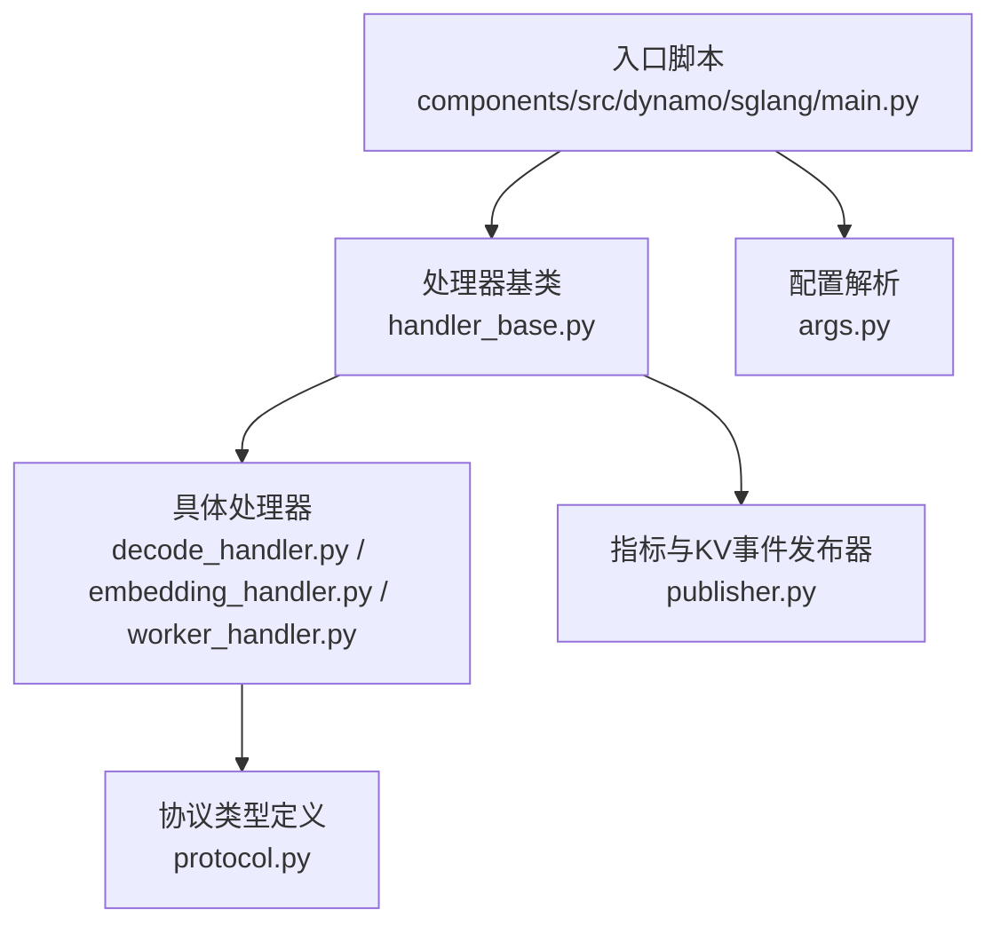
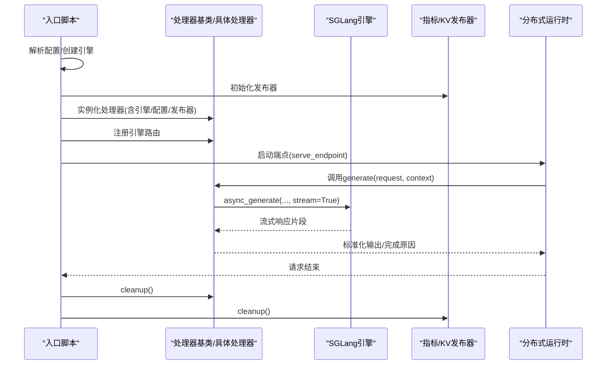
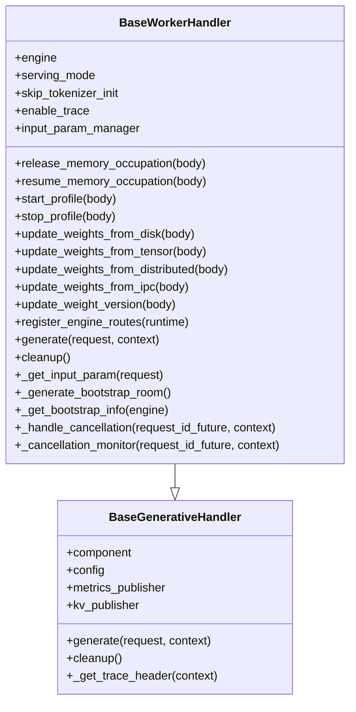
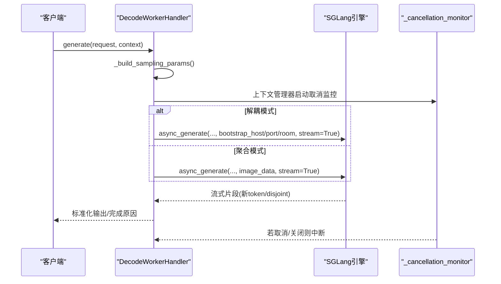
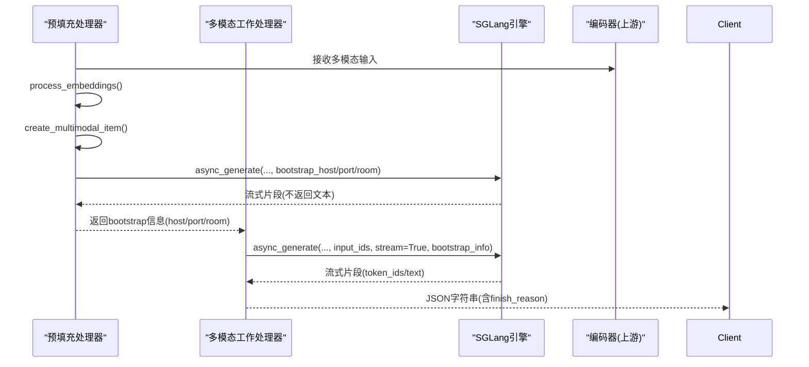
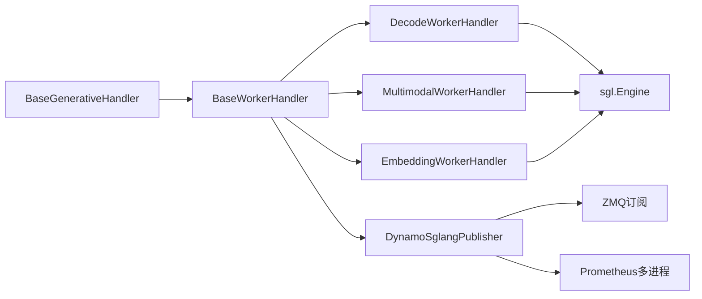

# 基础处理器类

<cite>
**本文引用的文件列表**
- [components/src/dynamo/sglang/request_handlers/handler_base.py](file://components/src/dynamo/sglang/request_handlers/handler_base.py)
- [components/src/dynamo/sglang/request_handlers/llm/decode_handler.py](file://components/src/dynamo/sglang/request_handlers/llm/decode_handler.py)
- [components/src/dynamo/sglang/request_handlers/multimodal/worker_handler.py](file://components/src/dynamo/sglang/request_handlers/multimodal/worker_handler.py)
- [components/src/dynamo/sglang/request_handlers/embedding/embedding_handler.py](file://components/src/dynamo/sglang/request_handlers/embedding/embedding_handler.py)
- [components/src/dynamo/sglang/main.py](file://components/src/dynamo/sglang/main.py)
- [components/src/dynamo/sglang/publisher.py](file://components/src/dynamo/sglang/publisher.py)
- [components/src/dynamo/sglang/args.py](file://components/src/dynamo/sglang/args.py)
- [components/src/dynamo/sglang/protocol.py](file://components/src/dynamo/sglang/protocol.py)
</cite>

## 目录
1. [简介](#简介)
2. [项目结构与定位](#项目结构与定位)
3. [核心组件总览](#核心组件总览)
4. [架构概览](#架构概览)
5. [详细组件分析](#详细组件分析)
6. [依赖关系分析](#依赖关系分析)
7. [性能与资源管理](#性能与资源管理)
8. [故障排查与错误处理](#故障排查与错误处理)
9. [结论](#结论)
10. [附录：扩展与最佳实践](#附录扩展与最佳实践)

## 简介
本文件面向SGLang后端组件中的“基础处理器类”，系统化阐述其设计模式、架构原则、生命周期管理、初始化与资源清理流程、处理器间继承与多态实现、配置参数、错误处理策略与日志记录机制，并给出可直接参考的代码路径与扩展实践建议。目标是帮助开发者在不深入阅读大量源码的情况下，快速理解并正确扩展SGLang基础处理器。

## 项目结构与定位
- 基础处理器位于SGLang后端组件的请求处理器层，统一抽象生成式任务的通用能力（如组件与配置管理、指标与KV事件发布、分布式追踪头注入、取消与关闭等），并为具体业务处理器（解码、预填充、嵌入、多模态等）提供可复用的基础设施。
- 典型调用链：入口脚本解析配置与运行时，按模式选择合适的处理器实例，注册引擎路由，启动服务端点，最终由具体处理器实现generate方法完成推理与流式输出。

图表来源
- [components/src/dynamo/sglang/main.py](file://components/src/dynamo/sglang/main.py#L191-L800)
- [components/src/dynamo/sglang/request_handlers/handler_base.py](file://components/src/dynamo/sglang/request_handlers/handler_base.py#L21-L574)
- [components/src/dynamo/sglang/request_handlers/llm/decode_handler.py](file://components/src/dynamo/sglang/request_handlers/llm/decode_handler.py#L1-L320)
- [components/src/dynamo/sglang/request_handlers/embedding/embedding_handler.py](file://components/src/dynamo/sglang/request_handlers/embedding/embedding_handler.py#L1-L88)
- [components/src/dynamo/sglang/request_handlers/multimodal/worker_handler.py](file://components/src/dynamo/sglang/request_handlers/multimodal/worker_handler.py#L1-L543)
- [components/src/dynamo/sglang/publisher.py](file://components/src/dynamo/sglang/publisher.py#L65-L389)
- [components/src/dynamo/sglang/args.py](file://components/src/dynamo/sglang/args.py#L1-L635)
- [components/src/dynamo/sglang/protocol.py](file://components/src/dynamo/sglang/protocol.py#L1-L177)

章节来源
- [components/src/dynamo/sglang/main.py](file://components/src/dynamo/sglang/main.py#L191-L800)
- [components/src/dynamo/sglang/request_handlers/handler_base.py](file://components/src/dynamo/sglang/request_handlers/handler_base.py#L21-L574)

## 核心组件总览
- 抽象基类
  - BaseGenerativeHandler：所有生成式处理器的最小抽象，提供组件与配置持有、指标与KV事件发布器引用、抽象generate接口、cleanup钩子、分布式追踪头注入工具。
  - BaseWorkerHandler：在BaseGenerativeHandler基础上，增加SGLang引擎集成、输入参数管理、内存占用释放/恢复、权重热更新、引擎路由注册、取消监控、引导信息获取等LLM专用能力。
- 具体处理器
  - 解码处理器：支持聚合与解耦模式，负责token或文本流式输出，处理取消与完成原因标准化。
  - 多模态处理器：支持聚合与解耦模式，负责从编码器接收嵌入，构建多模态项，协调引导信息，统一流式输出。
  - 嵌入处理器：负责文本到向量的编码，转换为OpenAI兼容格式。
- 发布器与配置
  - DynamoSglangPublisher：封装SGLang指标与KV事件发布，支持多进程指标收集、ZMQ订阅、本地索引器开关、节点级差异处理。
  - Config/DynamoArgs/DisaggregationMode：统一解析CLI与配置文件，派生服务模式（聚合/预填充/解码），并自动推导默认端点与行为。

章节来源
- [components/src/dynamo/sglang/request_handlers/handler_base.py](file://components/src/dynamo/sglang/request_handlers/handler_base.py#L21-L574)
- [components/src/dynamo/sglang/request_handlers/llm/decode_handler.py](file://components/src/dynamo/sglang/request_handlers/llm/decode_handler.py#L18-L320)
- [components/src/dynamo/sglang/request_handlers/multimodal/worker_handler.py](file://components/src/dynamo/sglang/request_handlers/multimodal/worker_handler.py#L242-L543)
- [components/src/dynamo/sglang/request_handlers/embedding/embedding_handler.py](file://components/src/dynamo/sglang/request_handlers/embedding/embedding_handler.py#L17-L88)
- [components/src/dynamo/sglang/publisher.py](file://components/src/dynamo/sglang/publisher.py#L65-L389)
- [components/src/dynamo/sglang/args.py](file://components/src/dynamo/sglang/args.py#L151-L232)

## 架构概览
SGLang基础处理器采用“抽象基类 + 具体处理器”的分层设计：
- 抽象基类统一职责：组件/配置持有、指标/KV发布器引用、抽象generate接口、清理钩子、追踪头注入。
- 具体处理器聚焦业务：根据模式（聚合/预填充/解码）与数据形态（纯文本/令牌/多模态）实现generate；通过基类提供的输入参数管理、取消监控、引擎路由注册等能力，保证一致性与可观测性。
- 生命周期：入口脚本解析配置、创建引擎、初始化发布器、注册引擎路由、启动端点；处理器在generate中进行请求处理与流式输出；退出时执行cleanup并触发发布器清理。

图表来源
- [components/src/dynamo/sglang/main.py](file://components/src/dynamo/sglang/main.py#L235-L328)
- [components/src/dynamo/sglang/request_handlers/handler_base.py](file://components/src/dynamo/sglang/request_handlers/handler_base.py#L323-L351)
- [components/src/dynamo/sglang/publisher.py](file://components/src/dynamo/sglang/publisher.py#L332-L389)

## 详细组件分析

### 抽象基类：BaseGenerativeHandler 与 BaseWorkerHandler
- 设计要点
  - 统一持有Component与Config，便于跨处理器共享上下文。
  - 可选的指标与KV发布器引用，支持按需启用。
  - 抽象generate接口，强制子类实现异步流式生成。
  - 提供cleanup钩子，子类可覆盖以释放资源。
  - 分布式追踪头注入工具，便于跨组件传递trace信息。
- BaseWorkerHandler扩展能力
  - 持有sgl.Engine实例，集成SGLang引擎能力。
  - 输入参数管理：基于tokenizer_manager的InputParamManager，支持跳过分词器初始化的场景。
  - 内存占用释放/恢复：通过引擎管理器暂停/继续生成、释放/恢复内存标签（如KV缓存、权重、CUDA图）。
  - 权重热更新：支持从磁盘、张量、分布式、IPC等多种方式更新权重版本。
  - 引擎路由注册：将上述操作注册为引擎路由，供外部调用。
  - 取消监控：使用Future与asyncio.wait监控上下文取消与全局shutdown事件，必要时调用引擎abort_request。
  - 引导信息：在解耦模式下生成随机房间号、解析引擎bootstrap地址与端口，支持IPv6安全格式化。
- 生命周期
  - 初始化：设置engine/config/publisher/shutdown_event/serving_mode/skip_tokenizer_init/enable_trace，构造InputParamManager。
  - 生成：子类实现generate，内部可调用_input_param/_get_trace_header/_cancellation_monitor等。
  - 清理：调用父类cleanup并释放发布器资源。

图表来源
- [components/src/dynamo/sglang/request_handlers/handler_base.py](file://components/src/dynamo/sglang/request_handlers/handler_base.py#L21-L574)

章节来源
- [components/src/dynamo/sglang/request_handlers/handler_base.py](file://components/src/dynamo/sglang/request_handlers/handler_base.py#L21-L574)

### 具体处理器：解码处理器（DecodeWorkerHandler）
- 角色与职责
  - 支持聚合与解耦两种模式；解耦模式需要前端提供bootstrap信息。
  - 将请求参数映射为SGLang采样参数；根据是否跳过分词器决定输出格式（token或OpenAI文本）。
  - 使用_cancellation_monitor确保在上下文取消或全局shutdown时能及时中断生成。
  - 对完成原因进行标准化，计算token用量（提示、补全、缓存）。
- 关键流程
  - 参数构建：根据skip_tokenizer_init选择不同参数映射策略。
  - 生成调用：调用engine.async_generate，传入bootstrap信息（解耦模式）或图像数据（聚合多模态）。
  - 流式处理：分别处理token流与文本流，按disjoint segment直接透传新token，避免累积开销。
- 生命周期
  - 初始化：调用父类构造，记录模式信息。
  - 清理：调用父类cleanup并显式engine.shutdown。

图表来源
- [components/src/dynamo/sglang/request_handlers/llm/decode_handler.py](file://components/src/dynamo/sglang/request_handlers/llm/decode_handler.py#L93-L320)
- [components/src/dynamo/sglang/request_handlers/handler_base.py](file://components/src/dynamo/sglang/request_handlers/handler_base.py#L526-L574)

章节来源
- [components/src/dynamo/sglang/request_handlers/llm/decode_handler.py](file://components/src/dynamo/sglang/request_handlers/llm/decode_handler.py#L18-L320)

### 具体处理器：多模态处理器（MultimodalWorkerHandler/MultimodalPrefillWorkerHandler）
- 角色与职责
  - MultimodalWorkerHandler：在聚合模式下直接消费嵌入，构建多模态项；在解耦模式下先从预填充阶段获取bootstrap信息，再进行解码生成。
  - MultimodalPrefillWorkerHandler：在预填充阶段处理多模态输入，生成bootstrap信息并启动预填充生成（不返回文本，仅建立连接）。
  - 统一的流式处理：使用StreamProcessor将SGLang输出转为JSON字符串，包含token_ids/text/finish_reason/finished字段。
- 关键流程
  - 预填充阶段：从编码器接收序列化的嵌入描述符，使用Connector读取到CPU/Tensor，创建precomputed_embedding格式的多模态项，调用engine.async_generate并消费结果。
  - 解码阶段：在解耦模式下，先通过prefill_client获取bootstrap信息，再发起解码生成；在聚合模式下直接传入image_data。
  - 错误处理：标准化错误响应，包含finish_reason="error"与错误详情。
- 生命周期
  - 初始化：构造EmbeddingsProcessor并异步初始化；校验解耦模式下的prefill_client。
  - 清理：调用父类cleanup并engine.shutdown。

图表来源
- [components/src/dynamo/sglang/request_handlers/multimodal/worker_handler.py](file://components/src/dynamo/sglang/request_handlers/multimodal/worker_handler.py#L424-L543)
- [components/src/dynamo/sglang/request_handlers/multimodal/worker_handler.py](file://components/src/dynamo/sglang/request_handlers/multimodal/worker_handler.py#L242-L422)

章节来源
- [components/src/dynamo/sglang/request_handlers/multimodal/worker_handler.py](file://components/src/dynamo/sglang/request_handlers/multimodal/worker_handler.py#L242-L543)

### 具体处理器：嵌入处理器（EmbeddingWorkerHandler）
- 角色与职责
  - 负责将文本/列表输入编码为向量，转换为OpenAI兼容的embedding响应格式。
  - 严格校验输入类型，调用engine.async_encode并进行usage统计。
- 生命周期
  - 初始化：调用父类构造，记录初始化完成。
  - 清理：调用父类cleanup并engine.shutdown。

章节来源
- [components/src/dynamo/sglang/request_handlers/embedding/embedding_handler.py](file://components/src/dynamo/sglang/request_handlers/embedding/embedding_handler.py#L17-L88)

## 依赖关系分析
- 组件耦合
  - BaseWorkerHandler强依赖sgl.Engine与tokenizer_manager，用于生成、暂停/继续、内存占用控制、权重更新、profile控制等。
  - BaseWorkerHandler通过DynamoSglangPublisher与指标/KV事件发布器交互，实现跨节点观测与KV事件转发。
  - 具体处理器通过InputParamManager统一输入参数构建，减少重复逻辑。
- 外部依赖
  - SGLang引擎与管理器：引擎路由、权重更新、profile、bootstrap信息。
  - Prometheus/ZMQ：指标多进程收集、KV事件ZMQ订阅。
  - NATS：在非leader节点仅发布KV事件，不接收调度指标。
- 循环依赖
  - 基类与具体处理器之间为单向依赖，无循环。
  - 发布器与处理器通过接口解耦，避免循环。

图表来源
- [components/src/dynamo/sglang/request_handlers/handler_base.py](file://components/src/dynamo/sglang/request_handlers/handler_base.py#L21-L574)
- [components/src/dynamo/sglang/publisher.py](file://components/src/dynamo/sglang/publisher.py#L65-L389)

章节来源
- [components/src/dynamo/sglang/request_handlers/handler_base.py](file://components/src/dynamo/sglang/request_handlers/handler_base.py#L21-L574)
- [components/src/dynamo/sglang/publisher.py](file://components/src/dynamo/sglang/publisher.py#L65-L389)

## 性能与资源管理
- 流式输出优化
  - 强制stream_output=True，SGLang发送disjoint segment（自上次输出以来的新token），处理器直接透传，避免累积开销。
- 取消与中断
  - 使用Future记录首次响应的请求ID，结合上下文取消与全局shutdown事件，确保及时abort_request，降低资源占用。
- 内存占用控制
  - release_memory_occupation/resume_memory_occupation按顺序执行：先注销发现、暂停生成、释放内存、恢复生成、重新注册，保障安全切换。
- 指标与KV事件
  - leader节点接收SGLang调度器指标并通过ZMQ转发；非leader节点仅发布KV事件；支持本地索引器与持久KV事件开关。
- 配置驱动
  - 通过DynamoArgs与DisaggregationMode自动推导服务模式与默认端点，减少手工配置成本。

章节来源
- [components/src/dynamo/sglang/request_handlers/handler_base.py](file://components/src/dynamo/sglang/request_handlers/handler_base.py#L142-L237)
- [components/src/dynamo/sglang/publisher.py](file://components/src/dynamo/sglang/publisher.py#L124-L189)
- [components/src/dynamo/sglang/args.py](file://components/src/dynamo/sglang/args.py#L195-L232)

## 故障排查与错误处理
- 错误处理策略
  - 多模态处理器对关键异常（如形状不匹配）进行捕获与标准化错误响应，包含finish_reason="error"与详细错误信息。
  - 解码处理器在token流中若出现无输出但未完成的情况，会返回error并终止。
  - 发布器在接收/发布指标失败时记录异常，避免中断主流程。
- 日志记录
  - 基类与各处理器均使用标准logging模块，关键路径（初始化、生成、取消、清理）均有日志输出。
  - 发布器在ZMQ关闭、上下文终止、KV发布器关闭时记录警告，便于定位资源泄漏。
- 取消与关闭
  - _cancellation_monitor在收到取消或shutdown时调用engine.abort_request，随后抛出GeneratorExit，确保生成过程尽快退出。

章节来源
- [components/src/dynamo/sglang/request_handlers/multimodal/worker_handler.py](file://components/src/dynamo/sglang/request_handlers/multimodal/worker_handler.py#L376-L392)
- [components/src/dynamo/sglang/request_handlers/llm/decode_handler.py](file://components/src/dynamo/sglang/request_handlers/llm/decode_handler.py#L235-L240)
- [components/src/dynamo/sglang/publisher.py](file://components/src/dynamo/sglang/publisher.py#L159-L187)
- [components/src/dynamo/sglang/request_handlers/handler_base.py](file://components/src/dynamo/sglang/request_handlers/handler_base.py#L439-L525)

## 结论
SGLang基础处理器类通过清晰的抽象与扩展点，实现了生成式任务的统一接入与可观测性。基类提供了跨处理器共享的能力与一致的生命周期管理，具体处理器在各自领域内聚焦业务细节。配合完善的配置解析、指标/KV事件发布、取消与资源控制机制，整体具备良好的可维护性与扩展性。

## 附录：扩展与最佳实践
- 如何扩展基础处理器
  - 继承BaseWorkerHandler，实现generate方法；在构造函数中调用super().__init__()并按需设置额外属性。
  - 若涉及多模态或特殊输入，可复用_input_param与_input_param_manager，或自定义参数映射。
  - 在generate中使用_cancellation_monitor包装生成过程，确保取消与关闭时能及时中断。
  - 如需引擎路由能力，调用register_engine_routes(runtime)注册所需操作。
- 最佳实践
  - 明确服务模式：聚合/预填充/解码，依据模式选择合适的输入与输出格式。
  - 统一流式输出：遵循disjoint segment原则，避免累积token带来的延迟与内存压力。
  - 严格错误处理：捕获关键异常并返回标准化错误响应，包含finish_reason与错误详情。
  - 资源安全：在release_memory_occupation/resume_memory_occupation中遵循“注销→暂停→释放/恢复→继续→注册”的顺序。
  - 日志与追踪：在关键路径添加日志，必要时注入traceparent头，便于端到端追踪。
- 参考路径
  - 基类与通用能力：[components/src/dynamo/sglang/request_handlers/handler_base.py](file://components/src/dynamo/sglang/request_handlers/handler_base.py#L21-L574)
  - 解码处理器实现：[components/src/dynamo/sglang/request_handlers/llm/decode_handler.py](file://components/src/dynamo/sglang/request_handlers/llm/decode_handler.py#L18-L320)
  - 多模态处理器实现：[components/src/dynamo/sglang/request_handlers/multimodal/worker_handler.py](file://components/src/dynamo/sglang/request_handlers/multimodal/worker_handler.py#L242-L543)
  - 嵌入处理器实现：[components/src/dynamo/sglang/request_handlers/embedding/embedding_handler.py](file://components/src/dynamo/sglang/request_handlers/embedding/embedding_handler.py#L17-L88)
  - 发布器与指标：[components/src/dynamo/sglang/publisher.py](file://components/src/dynamo/sglang/publisher.py#L65-L389)
  - 配置解析与模式：[components/src/dynamo/sglang/args.py](file://components/src/dynamo/sglang/args.py#L151-L232)
  - 协议类型定义：[components/src/dynamo/sglang/protocol.py](file://components/src/dynamo/sglang/protocol.py#L1-L177)