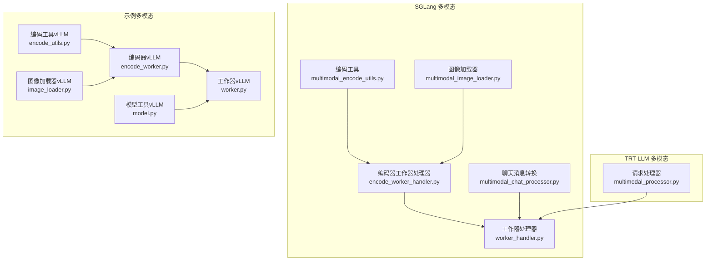
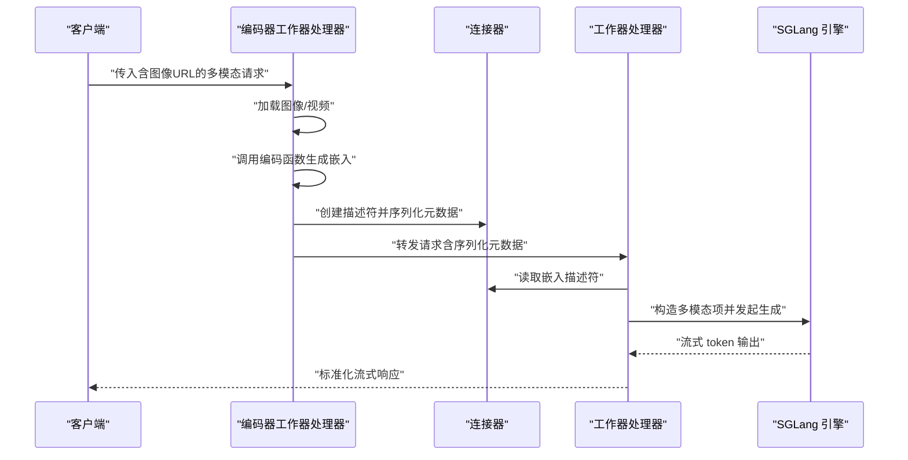
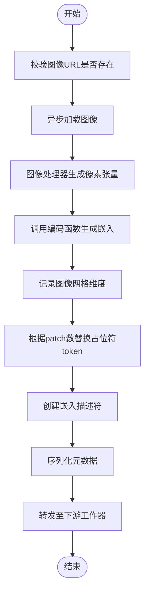
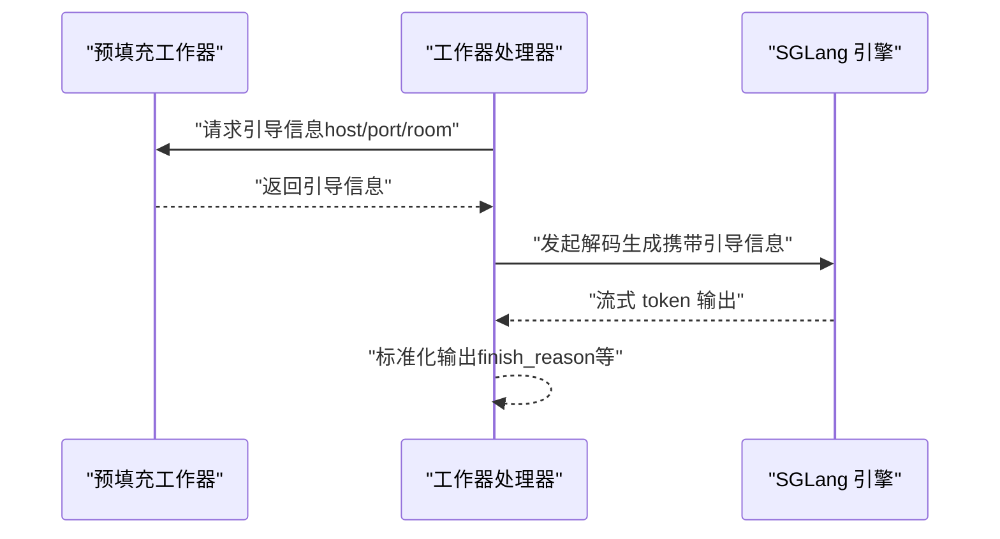
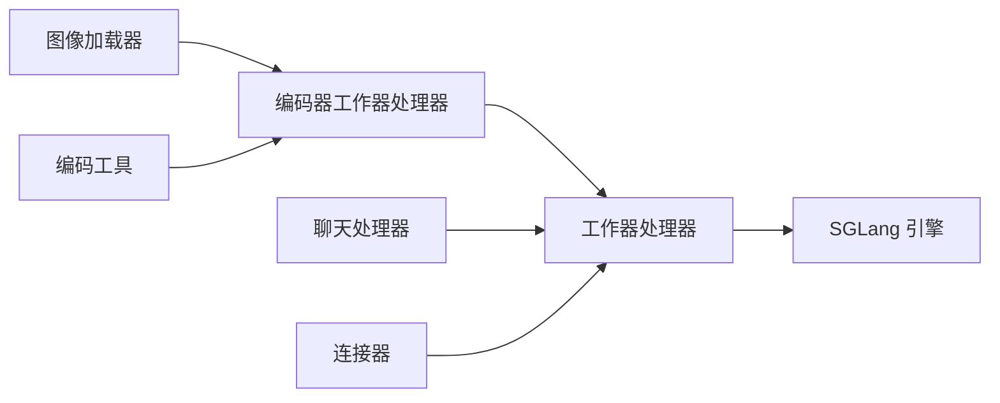

# 多模态处理器

<cite>
**本文引用的文件**
- [components/src/dynamo/sglang/request_handlers/multimodal/encode_worker_handler.py](file://components/src/dynamo/sglang/request_handlers/multimodal/encode_worker_handler.py)
- [components/src/dynamo/sglang/request_handlers/multimodal/worker_handler.py](file://components/src/dynamo/sglang/request_handlers/multimodal/worker_handler.py)
- [components/src/dynamo/sglang/multimodal_utils/multimodal_chat_processor.py](file://components/src/dynamo/sglang/multimodal_utils/multimodal_chat_processor.py)
- [components/src/dynamo/sglang/multimodal_utils/multimodal_encode_utils.py](file://components/src/dynamo/sglang/multimodal_utils/multimodal_encode_utils.py)
- [components/src/dynamo/sglang/multimodal_utils/multimodal_image_loader.py](file://components/src/dynamo/sglang/multimodal_utils/multimodal_image_loader.py)
- [components/src/dynamo/trtllm/multimodal_processor.py](file://components/src/dynamo/trtllm/multimodal_processor.py)
- [examples/multimodal/components/encode_worker.py](file://examples/multimodal/components/encode_worker.py)
- [examples/multimodal/components/worker.py](file://examples/multimodal/components/worker.py)
- [examples/multimodal/utils/encode_utils.py](file://examples/multimodal/utils/encode_utils.py)
- [examples/multimodal/utils/image_loader.py](file://examples/multimodal/utils/image_loader.py)
- [examples/multimodal/utils/model.py](file://examples/multimodal/utils/model.py)
</cite>

## 目录
1. [简介](#简介)
2. [项目结构](#项目结构)
3. [核心组件](#核心组件)
4. [架构总览](#架构总览)
5. [详细组件分析](#详细组件分析)
6. [依赖关系分析](#依赖关系分析)
7. [性能考虑](#性能考虑)
8. [故障排查指南](#故障排查指南)
9. [结论](#结论)
10. [附录：使用示例与集成指南](#附录使用示例与集成指南)

## 简介
本文件系统性阐述 SGLang 多模态处理器在 Dynamo 架构中的设计与实现，重点覆盖以下方面：
- 多模态处理架构的设计理念与组件分工：编码器工作器处理器（负责图像/视频等输入的特征提取）、处理器（负责请求解析、特征融合与格式标准化）、工作器处理器（负责推理引擎交互与流式输出）。
- 多模态数据的预处理流程、特征提取与融合机制：从消息解析到图像加载、编码器特征提取、嵌入形状规范化、SGLang 请求构建与流式响应处理。
- 编码器工作器处理器的图像/视频编码能力、处理器的数据转换与格式标准化、工作器处理器的任务分发与结果聚合。
- 配置参数、性能优化策略与资源调度机制。
- 实际使用示例与集成指南。

## 项目结构
围绕 SGLang 的多模态路径，关键模块分布如下：
- SGLang 后端多模态请求处理器与工具集：位于 components/src/dynamo/sglang 下，包含请求处理器、聊天消息到 SGLang 请求的转换、图像编码工具与图像加载器。
- TRT-LLM 多模态处理器：位于 components/src/dynamo/trtllm 下，提供统一的 OpenAI 格式请求处理、媒体加载与输入预处理。
- 示例多模态组件与工具：位于 examples/multimodal 下，提供 vLLM 路径的编码器与工作器实现，以及通用的编码与图像加载工具。

图表来源
- [components/src/dynamo/sglang/request_handlers/multimodal/encode_worker_handler.py](file://components/src/dynamo/sglang/request_handlers/multimodal/encode_worker_handler.py#L38-L193)
- [components/src/dynamo/sglang/request_handlers/multimodal/worker_handler.py](file://components/src/dynamo/sglang/request_handlers/multimodal/worker_handler.py#L242-L543)
- [components/src/dynamo/sglang/multimodal_utils/multimodal_chat_processor.py](file://components/src/dynamo/sglang/multimodal_utils/multimodal_chat_processor.py#L11-L48)
- [components/src/dynamo/sglang/multimodal_utils/multimodal_encode_utils.py](file://components/src/dynamo/sglang/multimodal_utils/multimodal_encode_utils.py#L131-L171)
- [components/src/dynamo/sglang/multimodal_utils/multimodal_image_loader.py](file://components/src/dynamo/sglang/multimodal_utils/multimodal_image_loader.py#L44-L124)
- [components/src/dynamo/trtllm/multimodal_processor.py](file://components/src/dynamo/trtllm/multimodal_processor.py#L46-L281)
- [examples/multimodal/components/encode_worker.py](file://examples/multimodal/components/encode_worker.py#L47-L265)
- [examples/multimodal/components/worker.py](file://examples/mynamo/components/worker.py#L194-L475)
- [examples/multimodal/utils/encode_utils.py](file://examples/multimodal/utils/encode_utils.py#L58-L133)
- [examples/multimodal/utils/image_loader.py](file://examples/multimodal/utils/image_loader.py#L31-L111)
- [examples/multimodal/utils/model.py](file://examples/multimodal/utils/model.py#L44-L92)

章节来源
- [components/src/dynamo/sglang/request_handlers/multimodal/encode_worker_handler.py](file://components/src/dynamo/sglang/request_handlers/multimodal/encode_worker_handler.py#L38-L193)
- [components/src/dynamo/sglang/request_handlers/multimodal/worker_handler.py](file://components/src/dynamo/sglang/request_handlers/multimodal/worker_handler.py#L242-L543)
- [components/src/dynamo/trtllm/multimodal_processor.py](file://components/src/dynamo/trtllm/multimodal_processor.py#L46-L281)
- [examples/multimodal/components/encode_worker.py](file://examples/multimodal/components/encode_worker.py#L47-L265)
- [examples/multimodal/components/worker.py](file://examples/multimodal/components/worker.py#L194-L475)

## 核心组件
- 编码器工作器处理器（SGLang）
  - 负责从请求中提取图像 URL，加载图像，调用图像编码函数生成嵌入，替换占位符 token，并通过连接器将嵌入以描述符形式传递给下游工作器。
  - 关键点：图像加载缓存、编码器选择、token 替换、描述符序列化元数据。
- 工作器处理器（SGLang）
  - 负责在聚合/解码模式下，从上游接收嵌入描述符，构造 SGLang 多模态项，调用引擎进行生成；在解码模式下，从预填充阶段获取引导信息后进行解码流式输出。
  - 关键点：嵌入读取、多模态项构造、采样参数构建、流式响应处理、错误标准化。
- 多模态聊天处理器（SGLang）
  - 将 OpenAI 风格的消息转换为 SGLang 的对话格式与 token_ids，支持 detokenize 与流式响应处理。
- 多模态编码工具（SGLang）
  - 提供模型名归一化、模型支持检测、Qwen 风格特征提取等。
- 图像加载器（SGLang）
  - 支持 HTTP(S)/data URL，带缓存与线程池加载，限制格式以提升安全性。
- TRT-LLM 多模态处理器
  - 统一处理 OpenAI 风格请求，支持 URL/本地路径加载张量、媒体加载与输入预处理，支持增量解码与流式响应。
- 示例 vLLM 编码器与工作器
  - 提供与 vLLM 兼容的编码器与工作器实现，支持图像/视频/音频嵌入构造与 KV 事件发布、指标统计等。

章节来源
- [components/src/dynamo/sglang/request_handlers/multimodal/encode_worker_handler.py](file://components/src/dynamo/sglang/request_handlers/multimodal/encode_worker_handler.py#L38-L193)
- [components/src/dynamo/sglang/request_handlers/multimodal/worker_handler.py](file://components/src/dynamo/sglang/request_handlers/multimodal/worker_handler.py#L242-L543)
- [components/src/dynamo/sglang/multimodal_utils/multimodal_chat_processor.py](file://components/src/dynamo/sglang/multimodal_utils/multimodal_chat_processor.py#L11-L163)
- [components/src/dynamo/sglang/multimodal_utils/multimodal_encode_utils.py](file://components/src/dynamo/sglang/multimodal_utils/multimodal_encode_utils.py#L131-L171)
- [components/src/dynamo/sglang/multimodal_utils/multimodal_image_loader.py](file://components/src/dynamo/sglang/multimodal_utils/multimodal_image_loader.py#L44-L124)
- [components/src/dynamo/trtllm/multimodal_processor.py](file://components/src/dynamo/trtllm/multimodal_processor.py#L46-L281)
- [examples/multimodal/components/encode_worker.py](file://examples/multimodal/components/encode_worker.py#L47-L265)
- [examples/multimodal/components/worker.py](file://examples/multimodal/components/worker.py#L194-L475)

## 架构总览
SGLang 多模态处理链路分为两类：EPD（Encoder-Precompute + Downstream Decode）与 PD（Precompute + Downstream Decode）。两者均通过“编码器工作器处理器”生成嵌入并通过连接器传递给下游“工作器处理器”。不同在于是否由上游编码器先行计算嵌入。

图表来源
- [components/src/dynamo/sglang/request_handlers/multimodal/encode_worker_handler.py](file://components/src/dynamo/sglang/request_handlers/multimodal/encode_worker_handler.py#L98-L184)
- [components/src/dynamo/sglang/request_handlers/multimodal/worker_handler.py](file://components/src/dynamo/sglang/request_handlers/multimodal/worker_handler.py#L288-L375)

## 详细组件分析

### 编码器工作器处理器（SGLang）
职责与流程
- 解析请求，校验图像 URL。
- 加载图像并进行预处理。
- 使用模型特定编码器生成嵌入，记录网格维度。
- 替换请求中的占位符 token 数量以匹配 patch 数。
- 创建嵌入描述符并通过连接器序列化元数据，随后将请求转发给下游工作器。

图表来源
- [components/src/dynamo/sglang/request_handlers/multimodal/encode_worker_handler.py](file://components/src/dynamo/sglang/request_handlers/multimodal/encode_worker_handler.py#L122-L184)

章节来源
- [components/src/dynamo/sglang/request_handlers/multimodal/encode_worker_handler.py](file://components/src/dynamo/sglang/request_handlers/multimodal/encode_worker_handler.py#L38-L193)

### 工作器处理器（SGLang）
职责与流程
- 聚合模式：从上游读取嵌入描述符，构造 SGLang 多模态项，直接调用引擎进行生成，流式返回 token。
- 解码模式：从预填充阶段获取引导信息，再进行解码流式输出。
- 错误处理：对形状不匹配等异常进行标准化输出。

图表来源
- [components/src/dynamo/sglang/request_handlers/multimodal/worker_handler.py](file://components/src/dynamo/sglang/request_handlers/multimodal/worker_handler.py#L393-L416)

章节来源
- [components/src/dynamo/sglang/request_handlers/multimodal/worker_handler.py](file://components/src/dynamo/sglang/request_handlers/multimodal/worker_handler.py#L242-L543)

### 多模态聊天处理器（SGLang）
- 将 OpenAI 风格 messages 转换为 SGLang 对话格式，拼接文本与图像占位符，生成 token_ids。
- 提供 detokenize 与流式响应处理，支持增量文本累积与完成标记。

章节来源
- [components/src/dynamo/sglang/multimodal_utils/multimodal_chat_processor.py](file://components/src/dynamo/sglang/multimodal_utils/multimodal_chat_processor.py#L11-L163)

### 多模态编码工具（SGLang）
- 模型名归一化与支持检测，针对 Qwen 风格视觉编码器提取特征，输出规范化形状（batch 维度统一为 1）。

章节来源
- [components/src/dynamo/sglang/multimodal_utils/multimodal_encode_utils.py](file://components/src/dynamo/sglang/multimodal_utils/multimodal_encode_utils.py#L131-L171)

### 图像加载器（SGLang）
- 支持 HTTP(S)/data URL，带全局 HTTP 客户端复用与队列缓存，限制格式以避免安全问题，PIL 在线程池中加载。

章节来源
- [components/src/dynamo/sglang/multimodal_utils/multimodal_image_loader.py](file://components/src/dynamo/sglang/multimodal_utils/multimodal_image_loader.py#L44-L124)

### TRT-LLM 多模态处理器
- 统一处理 OpenAI 风格请求，支持 URL/本地路径加载张量、媒体加载与输入预处理。
- 增量解码与流式响应，支持文件大小限制与安全路径检查。

章节来源
- [components/src/dynamo/trtllm/multimodal_processor.py](file://components/src/dynamo/trtllm/multimodal_processor.py#L46-L281)

### 示例 vLLM 编码器与工作器
- vLLM 路径的编码器：加载图像、调用编码函数生成嵌入，构造描述符并写入连接器，随后将请求转发给下游。
- vLLM 路径的工作器：支持预填充/解码分离或聚合模式，构造多模态数据（图像/视频/音频），与 KV 事件发布、指标统计集成。

章节来源
- [examples/multimodal/components/encode_worker.py](file://examples/multimodal/components/encode_worker.py#L47-L265)
- [examples/multimodal/components/worker.py](file://examples/multimodal/components/worker.py#L194-L475)

## 依赖关系分析
- 编码器工作器处理器依赖图像加载器与编码工具，生成嵌入并通过连接器传递给工作器处理器。
- 工作器处理器依赖连接器读取嵌入，构造多模态项并调用引擎；在解码模式下依赖预填充阶段提供的引导信息。
- 多模态聊天处理器与编码工具为通用模块，分别负责请求格式转换与模型特定编码逻辑。
- 示例 vLLM 组件提供与 vLLM 兼容的实现，便于在不同后端间切换。

图表来源
- [components/src/dynamo/sglang/request_handlers/multimodal/encode_worker_handler.py](file://components/src/dynamo/sglang/request_handlers/multimodal/encode_worker_handler.py#L58-L92)
- [components/src/dynamo/sglang/request_handlers/multimodal/worker_handler.py](file://components/src/dynamo/sglang/request_handlers/multimodal/worker_handler.py#L259-L277)
- [components/src/dynamo/sglang/multimodal_utils/multimodal_chat_processor.py](file://components/src/dynamo/sglang/multimodal_utils/multimodal_chat_processor.py#L11-L48)
- [components/src/dynamo/sglang/multimodal_utils/multimodal_encode_utils.py](file://components/src/dynamo/sglang/multimodal_utils/multimodal_encode_utils.py#L131-L171)
- [components/src/dynamo/sglang/multimodal_utils/multimodal_image_loader.py](file://components/src/dynamo/sglang/multimodal_utils/multimodal_image_loader.py#L44-L124)

## 性能考虑
- 并发与异步
  - 图像加载与编码过程采用异步与线程池，避免阻塞事件循环，提升高并发吞吐。
  - 连接器读写操作采用等待完成机制，确保数据传输一致性。
- 缓存与重用
  - 图像加载器内置 LRU 缓存队列，减少重复下载与解码开销。
  - 全局 HTTP 客户端复用，降低连接建立成本。
- 形状与内存
  - 嵌入输出统一增加 batch 维度，保证下游接口一致性。
  - 设备与 dtype 选择（如 float16）以平衡精度与显存占用。
- 流式输出
  - 工作器处理器对 SGLang 流式输出进行标准化封装，减少上层解析负担。

[本节为通用性能建议，无需列出章节来源]

## 故障排查指南
常见问题与定位要点
- 图像加载失败
  - 检查 URL 协议与格式（仅支持 http/https/data），确认 data URL base64 编码正确。
  - 查看缓存命中情况与队列容量，避免频繁重复下载。
- 嵌入形状不匹配
  - 确认 token 序列长度与嵌入 patch 数一致；若不一致，检查图像预处理与 token 替换逻辑。
- 引擎流式输出异常
  - 检查响应字段完整性（token_ids/text/finish_reason），必要时启用标准化错误输出。
- 文件访问受限
  - TRT-LLM 路径对本地文件访问有白名单目录限制，需确保路径在允许范围内且未越权。

章节来源
- [components/src/dynamo/sglang/request_handlers/multimodal/worker_handler.py](file://components/src/dynamo/sglang/request_handlers/multimodal/worker_handler.py#L376-L392)
- [components/src/dynamo/trtllm/multimodal_processor.py](file://components/src/dynamo/trtllm/multimodal_processor.py#L102-L139)
- [components/src/dynamo/sglang/multimodal_utils/multimodal_image_loader.py](file://components/src/dynamo/sglang/multimodal_utils/multimodal_image_loader.py#L64-L124)

## 结论
SGLang 多模态处理器通过“编码器工作器处理器 + 工作器处理器”的协作模式，实现了从图像/视频输入到多模态生成的完整链路。其关键优势在于：
- 明确的职责划分与可插拔的编码器/模型支持；
- 异步与缓存优化的图像加载与嵌入生成；
- 统一的流式输出与错误处理；
- 可扩展的多后端（SGLang/TRT-LLM/vLLM）适配。

[本节为总结性内容，无需列出章节来源]

## 附录：使用示例与集成指南
- SGLang 路径
  - 编码器工作器处理器：接收含图像 URL 的请求，生成嵌入并通过连接器传递给下游工作器。
  - 工作器处理器：在聚合模式下直接使用嵌入生成，在解码模式下先获取引导信息再进行解码。
  - 聊天消息转换：将 OpenAI 风格消息转换为 SGLang 请求格式。
- TRT-LLM 路径
  - 统一处理 OpenAI 风格请求，支持 URL/本地路径加载张量与媒体输入预处理。
- vLLM 路径
  - 编码器：生成嵌入并写入连接器，随后将请求转发给下游工作器。
  - 工作器：支持预填充/解码分离或聚合模式，构造多模态数据并集成 KV 事件发布与指标统计。

章节来源
- [components/src/dynamo/sglang/request_handlers/multimodal/encode_worker_handler.py](file://components/src/dynamo/sglang/request_handlers/multimodal/encode_worker_handler.py#L98-L184)
- [components/src/dynamo/sglang/request_handlers/multimodal/worker_handler.py](file://components/src/dynamo/sglang/request_handlers/multimodal/worker_handler.py#L288-L375)
- [components/src/dynamo/sglang/multimodal_utils/multimodal_chat_processor.py](file://components/src/dynamo/sglang/multimodal_utils/multimodal_chat_processor.py#L11-L48)
- [components/src/dynamo/trtllm/multimodal_processor.py](file://components/src/dynamo/trtllm/multimodal_processor.py#L168-L235)
- [examples/multimodal/components/encode_worker.py](file://examples/multimodal/components/encode_worker.py#L73-L154)
- [examples/multimodal/components/worker.py](file://examples/multimodal/components/worker.py#L227-L397)