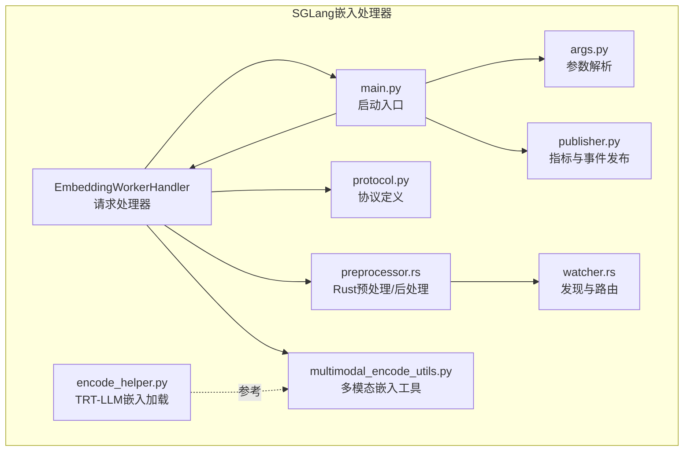
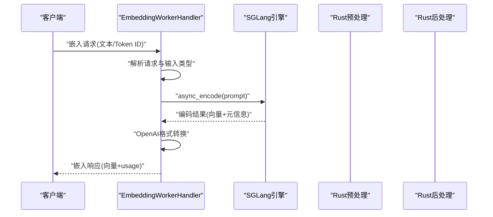
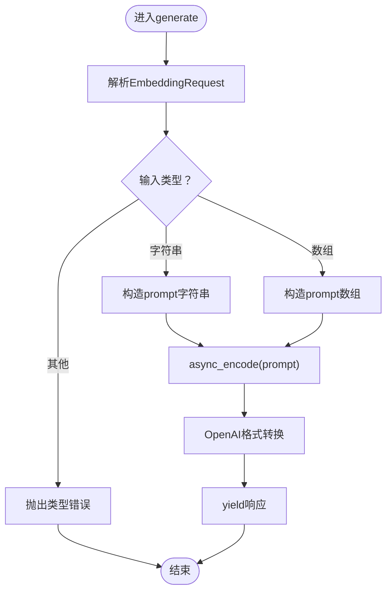
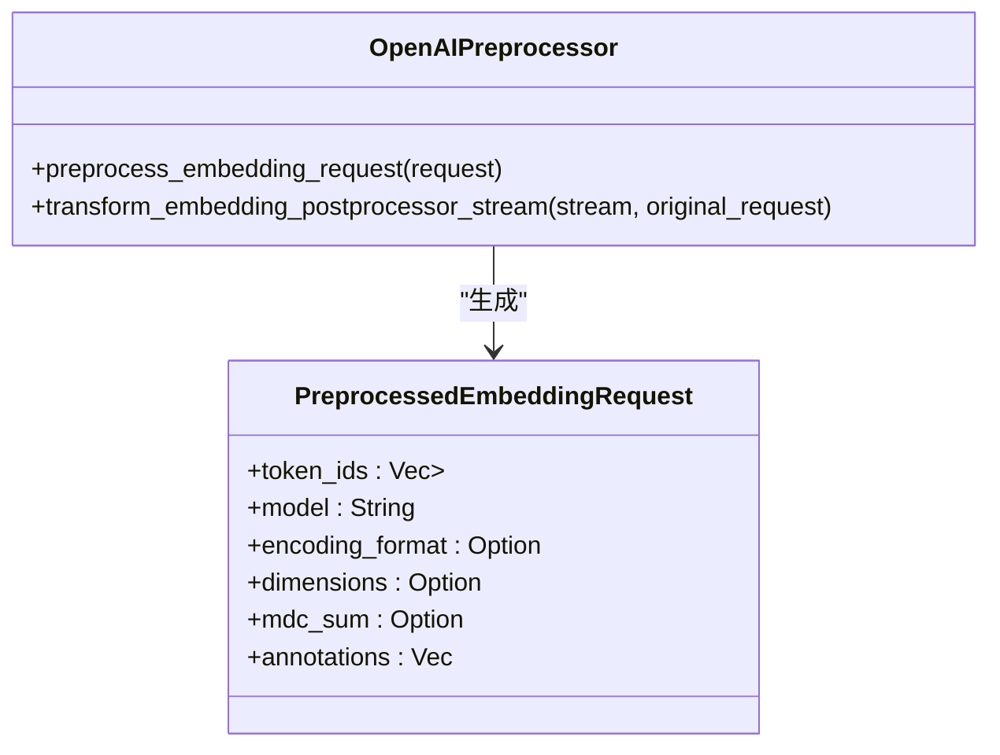
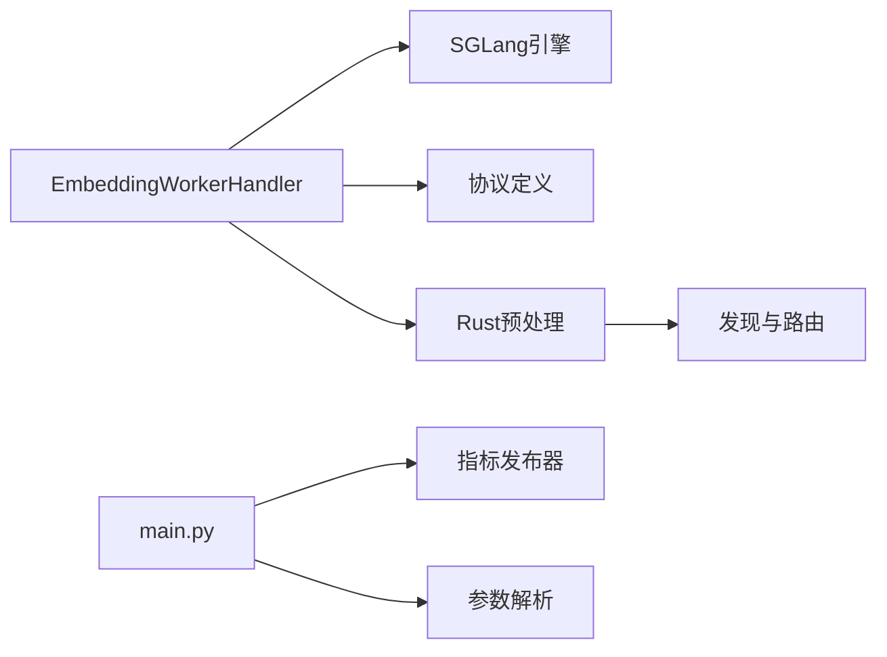

# 嵌入处理器

<cite>
**本文引用的文件**
- [components/src/dynamo/sglang/request_handlers/embedding/embedding_handler.py](file://components/src/dynamo/sglang/request_handlers/embedding/embedding_handler.py)
- [components/src/dynamo/sglang/main.py](file://components/src/dynamo/sglang/main.py)
- [components/src/dynamo/sglang/args.py](file://components/src/dynamo/sglang/args.py)
- [components/src/dynamo/sglang/protocol.py](file://components/src/dynamo/sglang/protocol.py)
- [components/src/dynamo/sglang/publisher.py](file://components/src/dynamo/sglang/publisher.py)
- [lib/llm/src/preprocessor.rs](file://lib/llm/src/preprocessor.rs)
- [lib/llm/src/protocols/common/preprocessor.rs](file://lib/llm/src/protocols/common/preprocessor.rs)
- [lib/llm/src/discovery/watcher.rs](file://lib/llm/src/discovery/watcher.rs)
- [components/src/dynamo/sglang/multimodal_utils/multimodal_encode_utils.py](file://components/src/dynamo/sglang/multimodal_utils/multimodal_encode_utils.py)
- [components/src/dynamo/trtllm/encode_helper.py](file://components/src/dynamo/trtllm/encode_helper.py)
- [tests/frontend/test_prompt_embeds.py](file://tests/frontend/test_prompt_embeds.py)
</cite>

## 目录
1. [简介](#简介)
2. [项目结构](#项目结构)
3. [核心组件](#核心组件)
4. [架构总览](#架构总览)
5. [详细组件分析](#详细组件分析)
6. [依赖关系分析](#依赖关系分析)
7. [性能考量](#性能考量)
8. [故障排查指南](#故障排查指南)
9. [结论](#结论)
10. [附录](#附录)

## 简介
本文件面向SGLang嵌入处理器（Embedding Worker）的技术文档，系统阐述嵌入向量生成的实现原理与处理流程，覆盖文本预处理、模型推理与向量归一化等关键环节；同时给出特殊配置项、输入输出格式、性能特征、应用场景、错误处理与超时控制、资源管理策略，并提供与前端及多模态组件的集成模式说明。

## 项目结构
SGLang嵌入处理器位于后端组件目录中，核心由以下模块构成：
- 请求处理器：负责接收请求、调用引擎编码、转换响应格式
- 启动入口：根据命令行参数选择运行模式并初始化引擎与指标发布
- 配置解析：统一解析SGLang与Dynamo参数，设置嵌入工作模式
- 协议定义：定义嵌入请求与响应的数据结构
- 指标发布：封装SGLang指标与KV事件发布器
- Rust预处理管线：提供OpenAI兼容的嵌入预处理与后处理流式转换
- 多模态工具：提供嵌入归一化与形状处理能力
- TRT-LLM辅助：提供嵌入加载与RDMA传输辅助

图表来源
- [components/src/dynamo/sglang/main.py](file://components/src/dynamo/sglang/main.py#L497-L560)
- [components/src/dynamo/sglang/request_handlers/embedding/embedding_handler.py](file://components/src/dynamo/sglang/request_handlers/embedding/embedding_handler.py#L17-L88)
- [components/src/dynamo/sglang/args.py](file://components/src/dynamo/sglang/args.py#L427-L430)
- [components/src/dynamo/sglang/publisher.py](file://components/src/dynamo/sglang/publisher.py#L332-L389)
- [lib/llm/src/preprocessor.rs](file://lib/llm/src/preprocessor.rs#L543-L849)
- [lib/llm/src/discovery/watcher.rs](file://lib/llm/src/discovery/watcher.rs#L608-L635)
- [components/src/dynamo/sglang/multimodal_utils/multimodal_encode_utils.py](file://components/src/dynamo/sglang/multimodal_utils/multimodal_encode_utils.py#L158-L170)
- [components/src/dynamo/trtllm/encode_helper.py](file://components/src/dynamo/trtllm/encode_helper.py#L220-L249)

章节来源
- [components/src/dynamo/sglang/main.py](file://components/src/dynamo/sglang/main.py#L497-L560)
- [components/src/dynamo/sglang/args.py](file://components/src/dynamo/sglang/args.py#L427-L430)

## 核心组件
- EmbeddingWorkerHandler：接收嵌入请求，调用SGLang引擎进行编码，将结果转换为OpenAI兼容格式返回
- 初始化流程：根据参数判断是否启用嵌入模式，创建引擎与指标发布器，注册健康检查与就绪门
- 参数解析：支持嵌入工作模式开关、自定义模板、请求平面、事件平面等
- 协议定义：定义嵌入请求的输入类型（字符串、字符串数组、整数数组、整数二维数组）
- 预处理与后处理：Rust侧提供OpenAI兼容的嵌入预处理与输出流转换
- 指标与事件：封装SGLang指标收集与KV事件订阅/发布

章节来源
- [components/src/dynamo/sglang/request_handlers/embedding/embedding_handler.py](file://components/src/dynamo/sglang/request_handlers/embedding/embedding_handler.py#L17-L88)
- [components/src/dynamo/sglang/main.py](file://components/src/dynamo/sglang/main.py#L497-L560)
- [components/src/dynamo/sglang/args.py](file://components/src/dynamo/sglang/args.py#L89-L94)
- [components/src/dynamo/sglang/protocol.py](file://components/src/dynamo/sglang/protocol.py#L51-L61)
- [lib/llm/src/preprocessor.rs](file://lib/llm/src/preprocessor.rs#L543-L849)
- [components/src/dynamo/sglang/publisher.py](file://components/src/dynamo/sglang/publisher.py#L332-L389)

## 架构总览
SGLang嵌入处理器采用“请求处理器 + 引擎 + 预处理/后处理 + 指标发布”的分层设计。请求进入后，先由协议层校验与解析，再经预处理将文本或token ID转换为内部表示，随后通过SGLang引擎执行编码，最后由后处理转换为OpenAI兼容的嵌入响应。

图表来源
- [components/src/dynamo/sglang/request_handlers/embedding/embedding_handler.py](file://components/src/dynamo/sglang/request_handlers/embedding/embedding_handler.py#L34-L87)
- [lib/llm/src/preprocessor.rs](file://lib/llm/src/preprocessor.rs#L543-L849)

## 详细组件分析

### 嵌入请求处理器（EmbeddingWorkerHandler）
- 输入类型支持：字符串、字符串数组、整数数组、整数二维数组
- 处理流程：解析请求 → 判断输入类型 → 调用引擎async_encode → OpenAI格式转换
- 输出格式：包含对象类型、嵌入向量列表、索引、模型名与usage统计

图表来源
- [components/src/dynamo/sglang/request_handlers/embedding/embedding_handler.py](file://components/src/dynamo/sglang/request_handlers/embedding/embedding_handler.py#L34-L87)

章节来源
- [components/src/dynamo/sglang/request_handlers/embedding/embedding_handler.py](file://components/src/dynamo/sglang/request_handlers/embedding/embedding_handler.py#L17-L88)

### 初始化与运行模式（main.py）
- 嵌入工作模式：当检测到嵌入标志时，初始化嵌入处理器并注册健康检查与就绪门
- 指标发布：创建指标发布器与KV事件发布器，启动指标循环
- 多节点处理：非主节点仅运行指标与KV事件发布，不直接处理请求

章节来源
- [components/src/dynamo/sglang/main.py](file://components/src/dynamo/sglang/main.py#L497-L560)
- [components/src/dynamo/sglang/main.py](file://components/src/dynamo/sglang/main.py#L265-L269)
- [components/src/dynamo/sglang/publisher.py](file://components/src/dynamo/sglang/publisher.py#L332-L389)

### 参数与配置（args.py）
- 关键参数
  - 嵌入工作模式开关：用于启用SGLang嵌入模式
  - 自定义Jinja模板：与SGLang内置tokenizer互斥
  - 请求平面/事件平面：控制请求分发与事件发布方式
  - 模型下载与命名：自动下载模型并设置服务模型名
- 运行模式推断：根据SGLang的解耦模式确定部署策略

章节来源
- [components/src/dynamo/sglang/args.py](file://components/src/dynamo/sglang/args.py#L89-L94)
- [components/src/dynamo/sglang/args.py](file://components/src/dynamo/sglang/args.py#L427-L430)
- [components/src/dynamo/sglang/args.py](file://components/src/dynamo/sglang/args.py#L508-L510)
- [components/src/dynamo/sglang/args.py](file://components/src/dynamo/sglang/args.py#L542-L560)

### 协议与数据结构（protocol.py）
- 嵌入请求输入类型：支持字符串、字符串数组、整数数组、整数二维数组
- 响应结构：包含对象类型、嵌入向量、索引、模型名与usage统计

章节来源
- [components/src/dynamo/sglang/protocol.py](file://components/src/dynamo/sglang/protocol.py#L51-L61)
- [components/src/dynamo/sglang/protocol.py](file://components/src/dynamo/sglang/protocol.py#L54-L61)

### 预处理与后处理（Rust）
- 预处理：支持文本与token ID两种输入，文本走分词器，token ID直接复用
- 后处理：将引擎输出转换为OpenAI兼容的嵌入响应流
- 发现与路由：嵌入流水线通过路由器连接前后端，形成闭环

图表来源
- [lib/llm/src/preprocessor.rs](file://lib/llm/src/preprocessor.rs#L543-L849)
- [lib/llm/src/protocols/common/preprocessor.rs](file://lib/llm/src/protocols/common/preprocessor.rs#L188-L223)

章节来源
- [lib/llm/src/preprocessor.rs](file://lib/llm/src/preprocessor.rs#L543-L849)
- [lib/llm/src/protocols/common/preprocessor.rs](file://lib/llm/src/protocols/common/preprocessor.rs#L188-L223)
- [lib/llm/src/discovery/watcher.rs](file://lib/llm/src/discovery/watcher.rs#L608-L635)

### 多模态嵌入工具（归一化与形状处理）
- 归一化：对不同返回形式的嵌入张量进行标准化，确保维度一致
- 错误提示：提供更友好的模型不支持提示与形状规范化

章节来源
- [components/src/dynamo/sglang/multimodal_utils/multimodal_encode_utils.py](file://components/src/dynamo/sglang/multimodal_utils/multimodal_encode_utils.py#L158-L170)

### TRT-LLM嵌入加载与RDMA传输（参考）
- 加载嵌入：从路径或URL加载嵌入张量，支持字典与张量两种格式
- 辅助数据：字典格式下提取辅助字段，便于下游处理

章节来源
- [components/src/dynamo/trtllm/encode_helper.py](file://components/src/dynamo/trtllm/encode_helper.py#L220-L249)

## 依赖关系分析
- 组件耦合
  - EmbeddingWorkerHandler依赖SGLang引擎与协议定义
  - 初始化流程依赖参数解析与指标发布器
  - 预处理/后处理由Rust模块提供，保证跨语言一致性
- 外部依赖
  - SGLang引擎：执行编码与流式输出
  - Prometheus/ZMQ：指标与KV事件发布
  - NATS/HTTP/TCP：请求平面与事件平面

图表来源
- [components/src/dynamo/sglang/request_handlers/embedding/embedding_handler.py](file://components/src/dynamo/sglang/request_handlers/embedding/embedding_handler.py#L17-L88)
- [components/src/dynamo/sglang/main.py](file://components/src/dynamo/sglang/main.py#L497-L560)
- [lib/llm/src/preprocessor.rs](file://lib/llm/src/preprocessor.rs#L543-L849)
- [lib/llm/src/discovery/watcher.rs](file://lib/llm/src/discovery/watcher.rs#L608-L635)

章节来源
- [components/src/dynamo/sglang/request_handlers/embedding/embedding_handler.py](file://components/src/dynamo/sglang/request_handlers/embedding/embedding_handler.py#L17-L88)
- [components/src/dynamo/sglang/main.py](file://components/src/dynamo/sglang/main.py#L497-L560)

## 性能考量
- 流式输出：强制启用SGLang的流式输出，减少首token延迟
- 指标采集：在启用指标时，使用多进程Prometheus注册表聚合SGLang指标
- 预热：预取模式工作节点在主节点上进行预热以避免首次TTFT尖峰
- 资源隔离：非主节点仅运行指标与KV事件发布，降低资源竞争

章节来源
- [components/src/dynamo/sglang/args.py](file://components/src/dynamo/sglang/args.py#L548-L549)
- [components/src/dynamo/sglang/main.py](file://components/src/dynamo/sglang/main.py#L359-L361)
- [components/src/dynamo/sglang/publisher.py](file://components/src/dynamo/sglang/publisher.py#L332-L389)

## 故障排查指南
- 嵌入输入类型错误：当输入既不是字符串也不是数组时，抛出类型错误
- 多模态嵌入对齐问题：当tokenization变化导致形状不匹配时，记录详细上下文并返回错误响应
- 指标与事件异常：ZMQ接收失败或上下文关闭时记录警告并优雅清理
- 健康检查与就绪门：注册阶段等待就绪门触发，确保模型完全加载后再接受请求

章节来源
- [components/src/dynamo/sglang/request_handlers/embedding/embedding_handler.py](file://components/src/dynamo/sglang/request_handlers/embedding/embedding_handler.py#L52-L53)
- [components/src/dynamo/sglang/request_handlers/multimodal/worker_handler.py](file://components/src/dynamo/sglang/request_handlers/multimodal/worker_handler.py#L376-L391)
- [components/src/dynamo/sglang/publisher.py](file://components/src/dynamo/sglang/publisher.py#L159-L164)
- [components/src/dynamo/sglang/main.py](file://components/src/dynamo/sglang/main.py#L298-L313)

## 结论
SGLang嵌入处理器通过清晰的分层设计与严格的协议约束，实现了从文本/Token ID到嵌入向量的高效转换，并提供OpenAI兼容的响应格式。结合Rust预处理/后处理与SGLang引擎，系统在性能与稳定性方面具备良好表现。通过参数化配置与指标发布，可灵活适配多场景部署需求。

## 附录

### 输入输出格式与示例
- 输入
  - 文本字符串：单条或多条文本
  - Token ID数组：单个序列或多个序列
- 输出
  - 嵌入对象列表：包含对象类型、向量、索引
  - usage统计：包含prompt_tokens与total_tokens

章节来源
- [components/src/dynamo/sglang/protocol.py](file://components/src/dynamo/sglang/protocol.py#L51-L61)
- [components/src/dynamo/sglang/request_handlers/embedding/embedding_handler.py](file://components/src/dynamo/sglang/request_handlers/embedding/embedding_handler.py#L61-L87)

### 特殊配置选项
- 嵌入工作模式：启用SGLang嵌入模式
- 自定义模板：与SGLang内置tokenizer互斥
- 请求/事件平面：TCP/NATS/HTTP/ZMQ等
- 模型下载与命名：自动下载并设置服务模型名

章节来源
- [components/src/dynamo/sglang/args.py](file://components/src/dynamo/sglang/args.py#L89-L94)
- [components/src/dynamo/sglang/args.py](file://components/src/dynamo/sglang/args.py#L474-L482)
- [components/src/dynamo/sglang/args.py](file://components/src/dynamo/sglang/args.py#L508-L510)

### 应用场景
- 相似度搜索：将查询与候选文本映射到同一语义空间，计算余弦相似度
- 聚类分析：基于嵌入向量进行无监督聚类，发现主题或语义分组
- 推荐系统：利用用户画像与物品嵌入进行协同过滤或基于内容的推荐

[本节为概念性说明，无需列出具体文件来源]

### 使用示例与集成模式
- 与前端集成：通过OpenAI兼容接口提交嵌入请求，接收标准化响应
- 与多模态组件集成：在多模态流水线中，嵌入向量作为视觉/音频特征参与后续推理
- 并发与流式：支持并发请求与流式响应，适用于实时应用

章节来源
- [tests/frontend/test_prompt_embeds.py](file://tests/frontend/test_prompt_embeds.py#L193-L330)