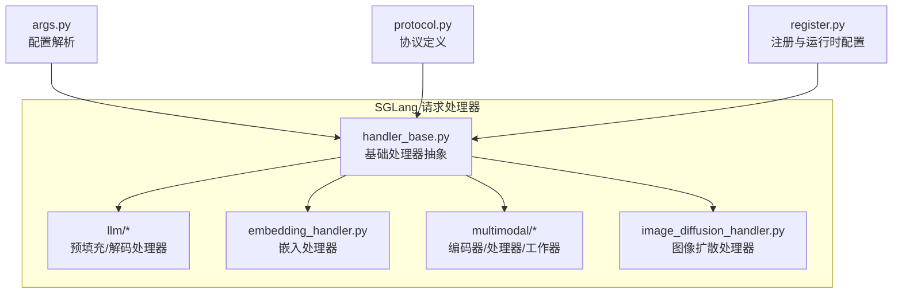
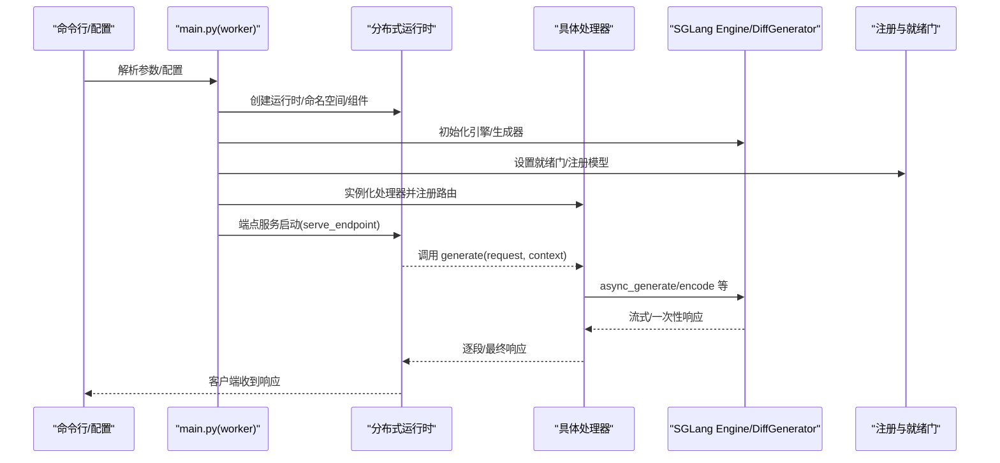
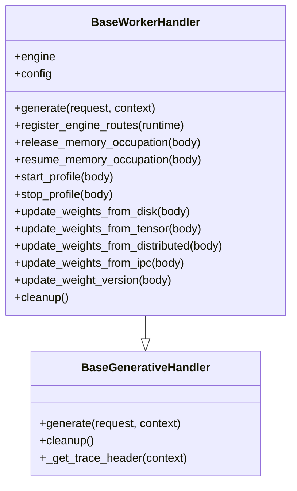
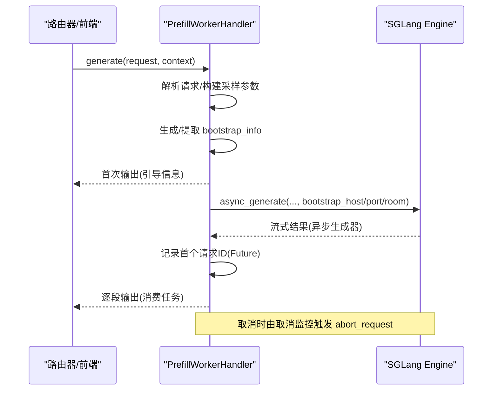
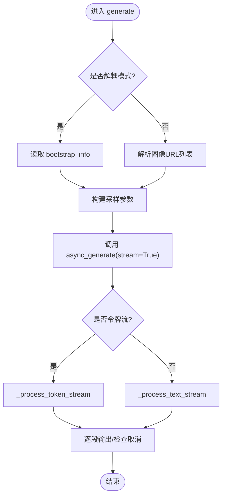
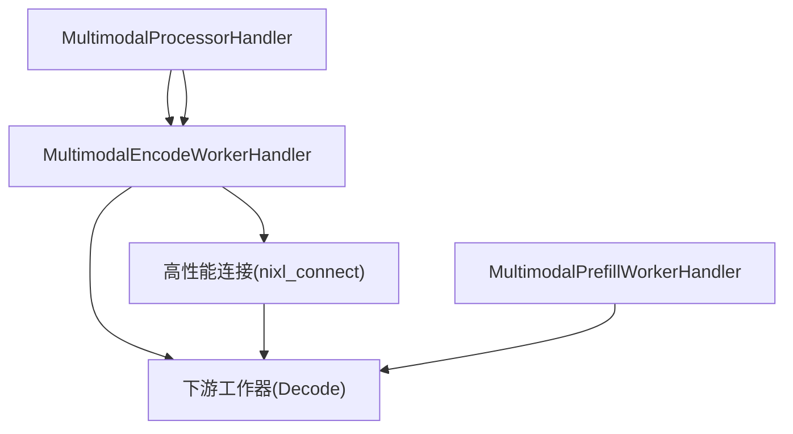
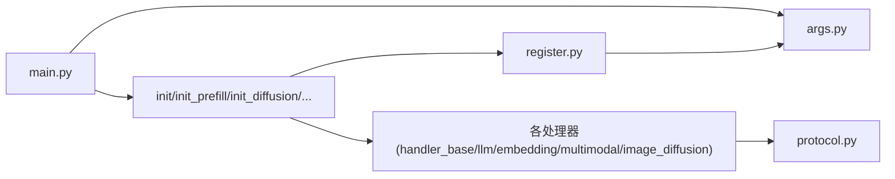

# 请求处理器体系

<cite>
**本文引用的文件**
- [components/src/dynamo/sglang/main.py](file://components/src/dynamo/sglang/main.py)
- [components/src/dynamo/sglang/request_handlers/handler_base.py](file://components/src/dynamo/sglang/request_handlers/handler_base.py)
- [components/src/dynamo/sglang/request_handlers/llm/prefill_handler.py](file://components/src/dynamo/sglang/request_handlers/llm/prefill_handler.py)
- [components/src/dynamo/sglang/request_handlers/llm/decode_handler.py](file://components/src/dynamo/sglang/request_handlers/llm/decode_handler.py)
- [components/src/dynamo/sglang/request_handlers/embedding/embedding_handler.py](file://components/src/dynamo/sglang/request_handlers/embedding/embedding_handler.py)
- [components/src/dynamo/sglang/request_handlers/multimodal/encode_worker_handler.py](file://components/src/dynamo/sglang/request_handlers/multimodal/encode_worker_handler.py)
- [components/src/dynamo/sglang/request_handlers/multimodal/processor_handler.py](file://components/src/dynamo/sglang/request_handlers/multimodal/processor_handler.py)
- [components/src/dynamo/sglang/request_handlers/multimodal/worker_handler.py](file://components/src/dynamo/sglang/request_handlers/multimodal/worker_handler.py)
- [components/src/dynamo/sglang/request_handlers/image_diffusion/image_diffusion_handler.py](file://components/src/dynamo/sglang/request_handlers/image_diffusion/image_diffusion_handler.py)
- [components/src/dynamo/sglang/protocol.py](file://components/src/dynamo/sglang/protocol.py)
- [components/src/dynamo/sglang/args.py](file://components/src/dynamo/sglang/args.py)
- [components/src/dynamo/sglang/register.py](file://components/src/dynamo/sglang/register.py)
</cite>

## 目录
1. [引言](#引言)
2. [项目结构](#项目结构)
3. [核心组件](#核心组件)
4. [架构总览](#架构总览)
5. [详细组件分析](#详细组件分析)
6. [依赖关系分析](#依赖关系分析)
7. [性能考量](#性能考量)
8. [故障排查指南](#故障排查指南)
9. [结论](#结论)
10. [附录](#附录)

## 引言
本文件系统性梳理 SGLang 请求处理器体系，覆盖基础处理器类的设计原则与继承关系，LLM 相关处理器（预填充、解码、扩散模型）的工作原理与调用流程，嵌入处理器的特殊处理逻辑与应用场景，以及多模态处理器的架构设计（编码器、处理器、工作器）。文档同时给出处理器初始化流程、请求处理管道与错误处理机制，并提供配置参数详解与实际代码示例路径。

## 项目结构
SGLang 后端位于 components/src/dynamo/sglang 下，请求处理器集中在 components/src/dynamo/sglang/request_handlers 中，按功能划分为：
- 基础层：handler_base.py 提供抽象基类与通用能力
- LLM 处理器：llm/ 目录下的 prefill_handler.py、decode_handler.py
- 嵌入处理器：embedding/embedding_handler.py
- 多模态处理器：multimodal/ 目录下的 encode_worker_handler.py、processor_handler.py、worker_handler.py
- 图像扩散处理器：image_diffusion/image_diffusion_handler.py
- 协议与配置：protocol.py、args.py、register.py

图表来源
- [components/src/dynamo/sglang/request_handlers/handler_base.py](file://components/src/dynamo/sglang/request_handlers/handler_base.py#L21-L87)
- [components/src/dynamo/sglang/request_handlers/llm/prefill_handler.py](file://components/src/dynamo/sglang/request_handlers/llm/prefill_handler.py#L16-L58)
- [components/src/dynamo/sglang/request_handlers/llm/decode_handler.py](file://components/src/dynamo/sglang/request_handlers/llm/decode_handler.py#L18-L59)
- [components/src/dynamo/sglang/request_handlers/embedding/embedding_handler.py](file://components/src/dynamo/sglang/request_handlers/embedding/embedding_handler.py#L17-L32)
- [components/src/dynamo/sglang/request_handlers/multimodal/encode_worker_handler.py](file://components/src/dynamo/sglang/request_handlers/multimodal/encode_worker_handler.py#L38-L96)
- [components/src/dynamo/sglang/request_handlers/multimodal/processor_handler.py](file://components/src/dynamo/sglang/request_handlers/multimodal/processor_handler.py#L29-L59)
- [components/src/dynamo/sglang/request_handlers/multimodal/worker_handler.py](file://components/src/dynamo/sglang/request_handlers/multimodal/worker_handler.py#L242-L274)
- [components/src/dynamo/sglang/request_handlers/image_diffusion/image_diffusion_handler.py](file://components/src/dynamo/sglang/request_handlers/image_diffusion/image_diffusion_handler.py#L27-L68)
- [components/src/dynamo/sglang/args.py](file://components/src/dynamo/sglang/args.py#L308-L605)
- [components/src/dynamo/sglang/protocol.py](file://components/src/dynamo/sglang/protocol.py#L1-L177)
- [components/src/dynamo/sglang/register.py](file://components/src/dynamo/sglang/register.py#L18-L66)

章节来源
- [components/src/dynamo/sglang/main.py](file://components/src/dynamo/sglang/main.py#L191-L800)
- [components/src/dynamo/sglang/args.py](file://components/src/dynamo/sglang/args.py#L308-L605)

## 核心组件
- 基础处理器抽象
  - BaseGenerativeHandler：为所有生成式处理器提供统一接口与通用基础设施（组件管理、配置、指标与 KV 事件发布、分布式追踪头注入）
  - BaseWorkerHandler：在上述基础上扩展 LLM 特有功能（SGLang Engine 集成、分词器与输入参数管理、解耦服务支持）

- LLM 处理器
  - PrefillWorkerHandler：预填充阶段专用，负责生成引导信息（bootstrap_host/port/room），并消费异步结果
  - DecodeWorkerHandler：聚合或解耦模式下的解码阶段，支持令牌流与文本流输出，处理取消与停止条件

- 嵌入处理器
  - EmbeddingWorkerHandler：将输入转换为嵌入向量，返回 OpenAI 兼容格式

- 多模态处理器
  - MultimodalProcessorHandler：将前端消息转换为 SGLang 对话模板，转发给编码器
  - MultimodalEncodeWorkerHandler：加载图像/视频，执行视觉编码，生成描述符并通过高性能连接传输到下游
  - MultimodalWorkerHandler：聚合模式直接传入预计算嵌入；解耦模式从预填充工作器获取引导信息后进行解码
  - MultimodalPrefillWorkerHandler：多模态预填充，产出引导信息并开始预填充生成

- 图像扩散处理器
  - ImageDiffusionWorkerHandler：使用 DiffGenerator 生成图像，支持上传存储与 URL 返回

章节来源
- [components/src/dynamo/sglang/request_handlers/handler_base.py](file://components/src/dynamo/sglang/request_handlers/handler_base.py#L21-L87)
- [components/src/dynamo/sglang/request_handlers/llm/prefill_handler.py](file://components/src/dynamo/sglang/request_handlers/llm/prefill_handler.py#L16-L58)
- [components/src/dynamo/sglang/request_handlers/llm/decode_handler.py](file://components/src/dynamo/sglang/request_handlers/llm/decode_handler.py#L18-L59)
- [components/src/dynamo/sglang/request_handlers/embedding/embedding_handler.py](file://components/src/dynamo/sglang/request_handlers/embedding/embedding_handler.py#L17-L32)
- [components/src/dynamo/sglang/request_handlers/multimodal/processor_handler.py](file://components/src/dynamo/sglang/request_handlers/multimodal/processor_handler.py#L29-L59)
- [components/src/dynamo/sglang/request_handlers/multimodal/encode_worker_handler.py](file://components/src/dynamo/sglang/request_handlers/multimodal/encode_worker_handler.py#L38-L96)
- [components/src/dynamo/sglang/request_handlers/multimodal/worker_handler.py](file://components/src/dynamo/sglang/request_handlers/multimodal/worker_handler.py#L242-L274)
- [components/src/dynamo/sglang/request_handlers/image_diffusion/image_diffusion_handler.py](file://components/src/dynamo/sglang/request_handlers/image_diffusion/image_diffusion_handler.py#L27-L68)

## 架构总览
SGLang 请求处理器通过统一的初始化入口完成引擎启动、指标与 KV 事件发布、就绪门注册与端点服务，随后根据部署模式（聚合/预填充/解码）选择对应处理器。多模态场景中，处理器与编码器/工作器通过内部端点协作，扩散模型独立于 LLM 引擎。

图表来源
- [components/src/dynamo/sglang/main.py](file://components/src/dynamo/sglang/main.py#L191-L328)
- [components/src/dynamo/sglang/register.py](file://components/src/dynamo/sglang/register.py#L234-L275)

章节来源
- [components/src/dynamo/sglang/main.py](file://components/src/dynamo/sglang/main.py#L191-L800)
- [components/src/dynamo/sglang/register.py](file://components/src/dynamo/sglang/register.py#L18-L66)

## 详细组件分析

### 基础处理器类设计与继承关系
- 设计原则
  - 统一接口：generate(request, context) 作为所有处理器的唯一入口
  - 可插拔指标与事件：通过 Publisher 注入指标与 KV 事件能力
  - 分布式追踪：自动注入 traceparent 头以贯穿请求链路
  - 取消与关闭：基于 asyncio.Future 与上下文监控，确保优雅取消与资源回收
- 继承关系
  - BaseGenerativeHandler：抽象接口与通用基础设施
  - BaseWorkerHandler：继承自 BaseGenerativeHandler，增加与 SGLang Engine 的集成、权重更新、内存占用释放/恢复等运维能力

图表来源
- [components/src/dynamo/sglang/request_handlers/handler_base.py](file://components/src/dynamo/sglang/request_handlers/handler_base.py#L21-L87)
- [components/src/dynamo/sglang/request_handlers/handler_base.py](file://components/src/dynamo/sglang/request_handlers/handler_base.py#L89-L370)

章节来源
- [components/src/dynamo/sglang/request_handlers/handler_base.py](file://components/src/dynamo/sglang/request_handlers/handler_base.py#L21-L574)

### LLM 预填充处理器（解耦模式）
- 角色与职责
  - 生成引导信息（bootstrap_host、bootstrap_port、bootstrap_room）
  - 将输入转换为 SGLang 输入参数，调用 async_generate 并消费结果
  - 通过 Future 捕获首个请求 ID，配合取消监控实现优雅中断
- 关键流程
  - 解析请求：兼容 DisaggPreprocessedRequest 与常规请求
  - 生成引导信息：优先使用请求提供的 bootstrap_room，否则本地生成
  - 首次输出：返回空 token_ids 与 disaggregated_params
  - 异步生成：创建任务消费结果，取消时由 SGLang 自动终止

图表来源
- [components/src/dynamo/sglang/request_handlers/llm/prefill_handler.py](file://components/src/dynamo/sglang/request_handlers/llm/prefill_handler.py#L60-L165)
- [components/src/dynamo/sglang/request_handlers/handler_base.py](file://components/src/dynamo/sglang/request_handlers/handler_base.py#L439-L574)

章节来源
- [components/src/dynamo/sglang/request_handlers/llm/prefill_handler.py](file://components/src/dynamo/sglang/request_handlers/llm/prefill_handler.py#L16-L165)

### LLM 解码处理器（聚合/解耦）
- 角色与职责
  - 支持聚合与解耦两种模式：解耦模式需要来自预填充的引导信息
  - 构建采样参数：支持令牌输入与 OpenAI 风格输入
  - 输出处理：令牌流与文本流两种格式，标准化完成原因
- 关键流程
  - 采样参数映射：从请求中抽取温度、top_p、top_k、最大新 token 等
  - 解耦模式：从请求中读取 bootstrap_info，设置数据并行 rank
  - 聚合模式：可选图像 URL 列表，交由 SGLang 多模态调度器处理
  - 流式输出：令牌流直接透传新 token，文本流封装为 OpenAI chunk

图表来源
- [components/src/dynamo/sglang/request_handlers/llm/decode_handler.py](file://components/src/dynamo/sglang/request_handlers/llm/decode_handler.py#L93-L320)

章节来源
- [components/src/dynamo/sglang/request_handlers/llm/decode_handler.py](file://components/src/dynamo/sglang/request_handlers/llm/decode_handler.py#L18-L320)

### 嵌入处理器
- 角色与职责
  - 接收 EmbeddingRequest，支持字符串或列表输入
  - 调用 async_encode 生成嵌入向量
  - 将结果转换为 OpenAI 兼容格式，包含 usage 统计
- 特殊逻辑
  - 输入类型校验与分支处理
  - 响应对象的字段映射与累计 prompt token 数

章节来源
- [components/src/dynamo/sglang/request_handlers/embedding/embedding_handler.py](file://components/src/dynamo/sglang/request_handlers/embedding/embedding_handler.py#L17-L88)

### 多模态处理器架构
- 处理器协作模式
  - MultimodalProcessorHandler：将前端消息转换为 SGLang 对话模板，构造 SglangMultimodalRequest，转发给编码器
  - MultimodalEncodeWorkerHandler：加载媒体、执行视觉编码，生成预计算嵌入与描述符，通过高性能连接传输至下游
  - MultimodalWorkerHandler：聚合模式直接传入预计算嵌入；解耦模式从预填充工作器获取引导信息后进行解码
  - MultimodalPrefillWorkerHandler：多模态预填充，产出引导信息并开始预填充生成

图表来源
- [components/src/dynamo/sglang/request_handlers/multimodal/processor_handler.py](file://components/src/dynamo/sglang/request_handlers/multimodal/processor_handler.py#L61-L91)
- [components/src/dynamo/sglang/request_handlers/multimodal/encode_worker_handler.py](file://components/src/dynamo/sglang/request_handlers/multimodal/encode_worker_handler.py#L98-L184)
- [components/src/dynamo/sglang/request_handlers/multimodal/worker_handler.py](file://components/src/dynamo/sglang/request_handlers/multimodal/worker_handler.py#L288-L313)
- [components/src/dynamo/sglang/request_handlers/multimodal/worker_handler.py](file://components/src/dynamo/sglang/request_handlers/multimodal/worker_handler.py#L424-L426)

章节来源
- [components/src/dynamo/sglang/request_handlers/multimodal/processor_handler.py](file://components/src/dynamo/sglang/request_handlers/multimodal/processor_handler.py#L29-L226)
- [components/src/dynamo/sglang/request_handlers/multimodal/encode_worker_handler.py](file://components/src/dynamo/sglang/request_handlers/multimodal/encode_worker_handler.py#L38-L193)
- [components/src/dynamo/sglang/request_handlers/multimodal/worker_handler.py](file://components/src/dynamo/sglang/request_handlers/multimodal/worker_handler.py#L242-L543)

### 图像扩散处理器
- 角色与职责
  - 使用 DiffGenerator 执行扩散推理，支持负向提示、步数、引导尺度、种子等参数
  - 支持返回 URL 或 base64，可写入 fsspec 文件系统
- 特殊逻辑
  - 限制最大推理步数
  - 尺寸解析与图像格式转换（PIL/Numpy/Bytes）
  - 存储路径与 URL 重写

章节来源
- [components/src/dynamo/sglang/request_handlers/image_diffusion/image_diffusion_handler.py](file://components/src/dynamo/sglang/request_handlers/image_diffusion/image_diffusion_handler.py#L27-L236)

## 依赖关系分析
- 运行时与注册
  - main.py 根据 serving_mode 与标志位选择初始化路径，实例化对应处理器并注册端点
  - register.py 提供注册 LLM/扩散模型与运行时配置导出，支持就绪门
- 协议与配置
  - protocol.py 定义 LLM、多模态与扩散请求/响应的数据结构
  - args.py 解析 CLI 与配置文件，推导 serving_mode、端点与运行时开关

图表来源
- [components/src/dynamo/sglang/main.py](file://components/src/dynamo/sglang/main.py#L191-L800)
- [components/src/dynamo/sglang/register.py](file://components/src/dynamo/sglang/register.py#L18-L66)
- [components/src/dynamo/sglang/protocol.py](file://components/src/dynamo/sglang/protocol.py#L1-L177)
- [components/src/dynamo/sglang/args.py](file://components/src/dynamo/sglang/args.py#L308-L605)

章节来源
- [components/src/dynamo/sglang/main.py](file://components/src/dynamo/sglang/main.py#L191-L800)
- [components/src/dynamo/sglang/register.py](file://components/src/dynamo/sglang/register.py#L18-L315)
- [components/src/dynamo/sglang/protocol.py](file://components/src/dynamo/sglang/protocol.py#L1-L177)
- [components/src/dynamo/sglang/args.py](file://components/src/dynamo/sglang/args.py#L308-L635)

## 性能考量
- 流式输出优化
  - SGLang 在 Dynamo 中强制 stream_output=True，仅返回自上次输出以来的新 token，降低累积开销
- 解耦服务预热
  - 预填充工作器在主节点进行预热，避免首次 TTFT 影响
- 内存与权重管理
  - BaseWorkerHandler 提供 release/resume_memory_occupation 与多种权重更新接口，便于在线维护
- 多模态数据传输
  - 使用高性能连接（nixl_connect）传输预计算嵌入，减少 CPU/GPU 间拷贝

## 故障排查指南
- 取消与关闭
  - 取消监控通过 Future 与 asyncio.wait 等待取消或关闭事件，触发 abort_request 并清理任务
- 错误响应
  - 多模态工作器对形状不匹配等错误进行专门诊断与错误响应
  - 图像扩散处理器捕获异常并返回结构化错误
- 日志与可观测性
  - 统一注入 traceparent，便于端到端追踪
  - 指标与 KV 事件发布由 Publisher 管理

章节来源
- [components/src/dynamo/sglang/request_handlers/handler_base.py](file://components/src/dynamo/sglang/request_handlers/handler_base.py#L439-L574)
- [components/src/dynamo/sglang/request_handlers/multimodal/worker_handler.py](file://components/src/dynamo/sglang/request_handlers/multimodal/worker_handler.py#L376-L391)
- [components/src/dynamo/sglang/request_handlers/image_diffusion/image_diffusion_handler.py](file://components/src/dynamo/sglang/request_handlers/image_diffusion/image_diffusion_handler.py#L129-L136)

## 结论
SGLang 请求处理器体系以统一的抽象基类为核心，围绕 LLM、嵌入、多模态与扩散四类场景提供专用处理器。通过清晰的初始化流程、严格的取消与错误处理机制、以及面向生产的内存与权重管理能力，实现了高可用、可观测且易于扩展的服务化架构。

## 附录

### 处理器初始化流程
- 解析参数与配置
  - 解析 CLI 与配置文件，推导 serving_mode、端点与运行时开关
- 初始化引擎/生成器
  - 根据模式选择 init/init_prefill/init_diffusion/init_embedding/init_image_diffusion 等路径
- 注册与就绪门
  - 启动端点服务与注册模型，使用就绪门协调请求排队
- 注册引擎路由
  - BaseWorkerHandler.register_engine_routes 注册内存与权重管理等运维接口

章节来源
- [components/src/dynamo/sglang/main.py](file://components/src/dynamo/sglang/main.py#L191-L800)
- [components/src/dynamo/sglang/request_handlers/handler_base.py](file://components/src/dynamo/sglang/request_handlers/handler_base.py#L323-L351)
- [components/src/dynamo/sglang/register.py](file://components/src/dynamo/sglang/register.py#L234-L275)

### 请求处理管道
- 令牌流与文本流
  - 令牌流：直接透传 disjoint token segments，标准化完成原因
  - 文本流：封装为 OpenAI chat.completion.chunk
- 多模态流处理
  - 统一的流处理函数将 SGLang 输出转为 JSON 字符串，携带完成状态

章节来源
- [components/src/dynamo/sglang/request_handlers/llm/decode_handler.py](file://components/src/dynamo/sglang/request_handlers/llm/decode_handler.py#L193-L320)
- [components/src/dynamo/sglang/request_handlers/multimodal/worker_handler.py](file://components/src/dynamo/sglang/request_handlers/multimodal/worker_handler.py#L144-L212)

### 配置参数详解
- 端点与平面
  - --endpoint：目标端点 dyn://namespace.component.endpoint
  - --store-kv/--request-plane/--event-plane：键值存储与请求/事件平面选择
  - --durable-kv-events：启用 NATS JetStream 持久化 KV 事件
- 预处理与端点类型
  - --custom-jinja-template/--dyn-endpoint-types/--use-sglang-tokenizer
- 多模态与嵌入
  - --multimodal-processor/--multimodal-encode-worker/--multimodal-worker
  - --embedding-worker：同时设置 SGLang 的 --is-embedding
- 扩散模型
  - --image-diffusion-worker/--image-diffusion-fs-url/--image-diffusion-base-url
- 服务模式
  - SGLang --disaggregation-mode：agg/prefill/decode，影响 serving_mode

章节来源
- [components/src/dynamo/sglang/args.py](file://components/src/dynamo/sglang/args.py#L33-L148)
- [components/src/dynamo/sglang/args.py](file://components/src/dynamo/sglang/args.py#L308-L605)

### 协议与数据结构
- LLM 标准协议
  - StopConditions、SamplingOptions、PreprocessedRequest、DisaggPreprocessedRequest
  - EmbeddingRequest
- 多模态协议
  - MultiModalRequest/MultiModalInput/SglangMultimodalRequest/DisaggSglangMultimodalRequest
- 图像扩散协议
  - CreateImageRequest/ImagesResponse/ImageData/NvExt

章节来源
- [components/src/dynamo/sglang/protocol.py](file://components/src/dynamo/sglang/protocol.py#L19-L177)