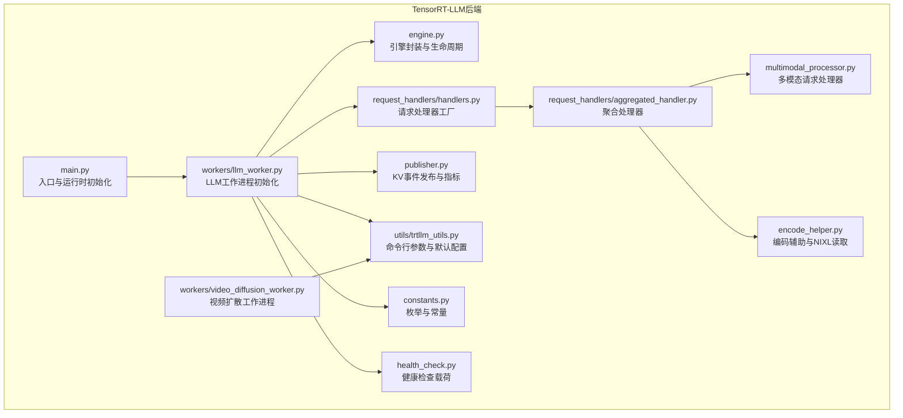
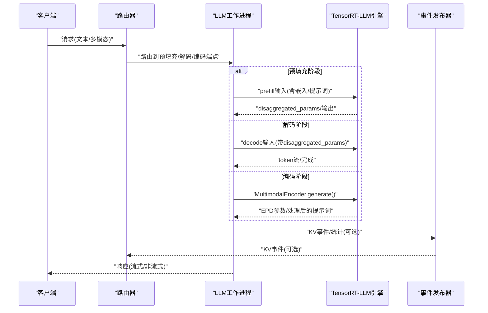
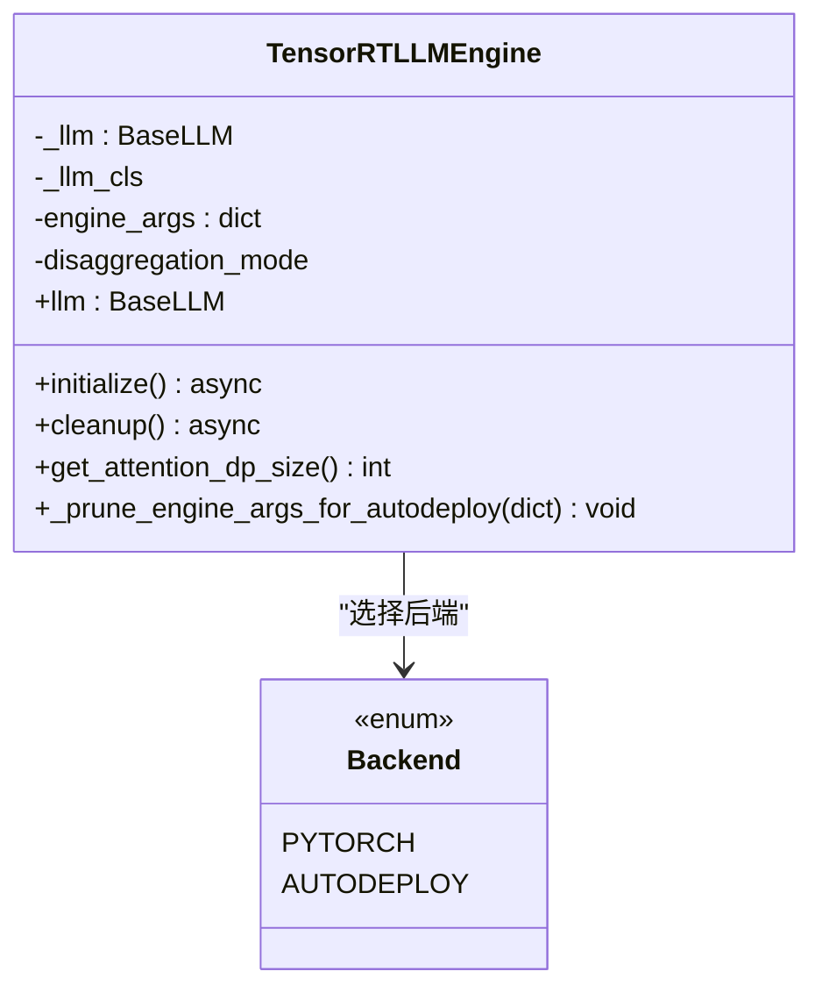
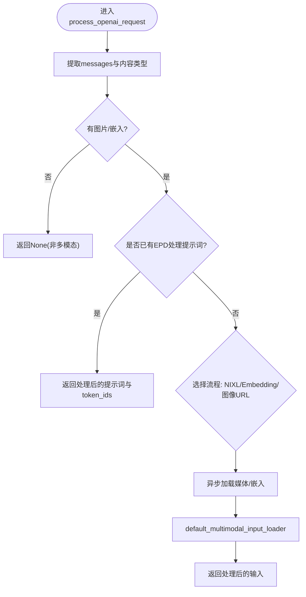
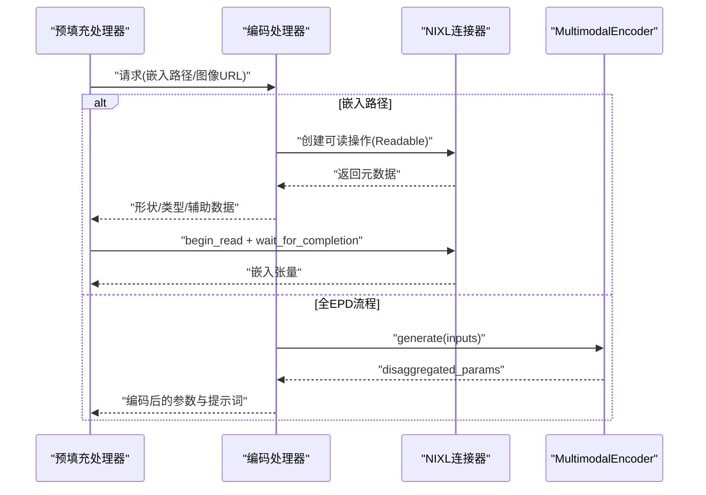
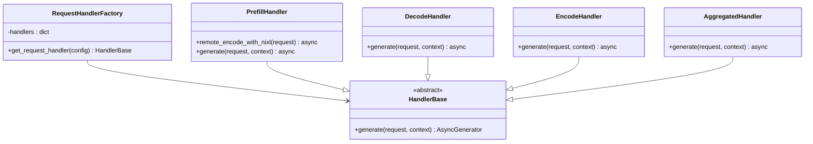
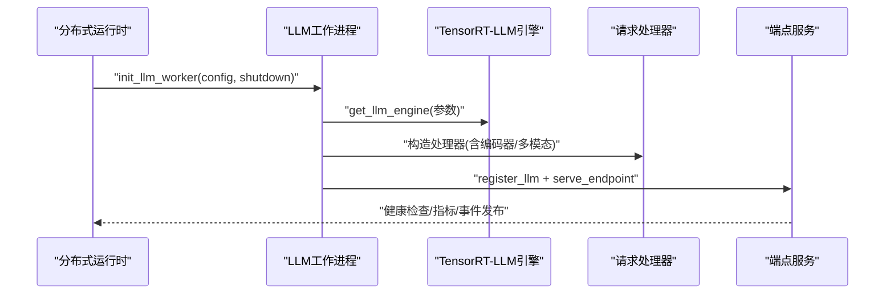
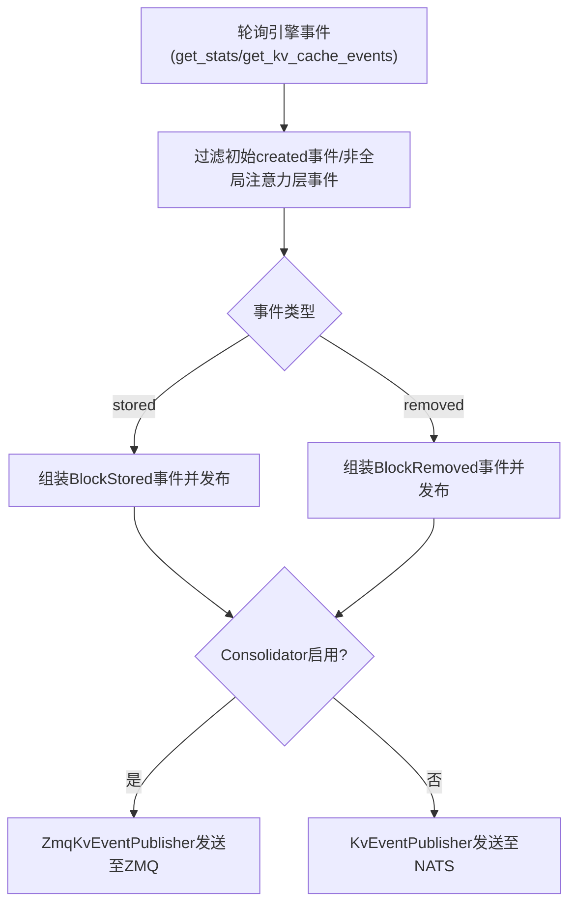
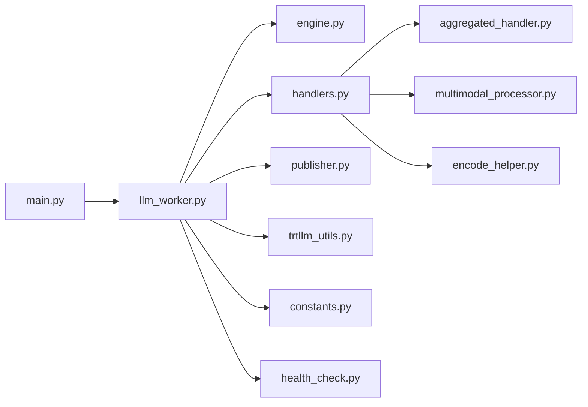

# TensorRT-LLM引擎集成

<cite>
**本文档引用的文件**
- [engine.py](file://components/src/dynamo/trtllm/engine.py)
- [multimodal_processor.py](file://components/src/dynamo/trtllm/multimodal_processor.py)
- [main.py](file://components/src/dynamo/trtllm/main.py)
- [constants.py](file://components/src/dynamo/trtllm/constants.py)
- [encode_helper.py](file://components/src/dynamo/trtllm/encode_helper.py)
- [handlers.py](file://components/src/dynamo/trtllm/request_handlers/handlers.py)
- [aggregated_handler.py](file://components/src/dynamo/trtllm/request_handlers/aggregated_handler.py)
- [base_generative_handler.py](file://components/src/dynamo/trtllm/request_handlers/base_generative_handler.py)
- [llm_worker.py](file://components/src/dynamo/trtllm/workers/llm_worker.py)
- [video_diffusion_worker.py](file://components/src/dynamo/trtllm/workers/video_diffusion_worker.py)
- [publisher.py](file://components/src/dynamo/trtllm/publisher.py)
- [trtllm_utils.py](file://components/src/dynamo/trtllm/utils/trtllm_utils.py)
- [health_check.py](file://components/src/dynamo/trtllm/health_check.py)
</cite>

## 目录
1. [简介](#简介)
2. [项目结构](#项目结构)
3. [核心组件](#核心组件)
4. [架构总览](#架构总览)
5. [详细组件分析](#详细组件分析)
6. [依赖关系分析](#依赖关系分析)
7. [性能考量](#性能考量)
8. [故障排查指南](#故障排查指南)
9. [结论](#结论)
10. [附录](#附录)

## 简介
本文件面向TensorRT-LLM引擎在Dynamo平台中的集成，系统性阐述其在高性能推理中的核心作用与CUDA优化特性。文档覆盖引擎架构设计（预填充与解码阶段的专门优化）、滑动窗口注意力机制、Eagle推理增强与KV缓存传输优化、多模态处理（图像编码、视频处理与跨模态交互）、请求处理器实现（聚合处理器、基元生成处理器与视频扩散处理）、CUDA IPC机制、嵌入获取器与哈希算法优化策略，并提供实际配置示例、性能调优指南与硬件适配建议，以及与Dynamo框架的深度集成与扩展能力。

## 项目结构
TensorRT-LLM后端位于components/src/dynamo/trtllm目录下，采用按功能域分层组织：引擎封装、请求处理、工作进程初始化、多模态处理、事件发布与工具函数等模块协同工作，形成从请求接入到推理执行再到事件发布的完整链路。

**图表来源**
- [engine.py](file://components/src/dynamo/trtllm/engine.py#L25-L92)
- [llm_worker.py](file://components/src/dynamo/trtllm/workers/llm_worker.py#L111-L520)
- [handlers.py](file://components/src/dynamo/trtllm/request_handlers/handlers.py#L23-L49)
- [aggregated_handler.py](file://components/src/dynamo/trtllm/request_handlers/aggregated_handler.py#L20-L66)
- [multimodal_processor.py](file://components/src/dynamo/trtllm/multimodal_processor.py#L46-L281)
- [encode_helper.py](file://components/src/dynamo/trtllm/encode_helper.py#L16-L443)
- [publisher.py](file://components/src/dynamo/trtllm/publisher.py#L275-L764)
- [trtllm_utils.py](file://components/src/dynamo/trtllm/utils/trtllm_utils.py#L34-L597)
- [constants.py](file://components/src/dynamo/trtllm/constants.py#L12-L58)
- [health_check.py](file://components/src/dynamo/trtllm/health_check.py#L51-L92)
- [main.py](file://components/src/dynamo/trtllm/main.py#L29-L51)

**章节来源**
- [main.py](file://components/src/dynamo/trtllm/main.py#L29-L51)
- [llm_worker.py](file://components/src/dynamo/trtllm/workers/llm_worker.py#L111-L520)
- [trtllm_utils.py](file://components/src/dynamo/trtllm/utils/trtllm_utils.py#L34-L597)

## 核心组件
- 引擎封装与生命周期管理：负责TensorRT-LLM引擎实例化、自动部署后端切换、注意力数据并行尺寸查询与清理。
- 请求处理器：根据解耦模式选择合适的处理器（预填充、解码、编码或聚合），支持多模态与远程编码路径。
- 多模态处理：统一OpenAI格式消息解析、媒体加载与预处理、增量响应块生成。
- 编码辅助：NIXL RDMA读取、嵌入序列化/反序列化、EPD流程参数编码与提示词编码。
- 事件发布与指标：KV缓存事件ZMQ发布、NATS发布、统计轮询与Prometheus指标导出。
- 工作进程初始化：构建引擎参数、调度器配置、KV缓存连接器、注册模型与端点、健康检查载荷。
- 健康检查：基于BOS令牌的最小化健康检查请求模板。

**章节来源**
- [engine.py](file://components/src/dynamo/trtllm/engine.py#L25-L171)
- [handlers.py](file://components/src/dynamo/trtllm/request_handlers/handlers.py#L23-L84)
- [multimodal_processor.py](file://components/src/dynamo/trtllm/multimodal_processor.py#L46-L281)
- [encode_helper.py](file://components/src/dynamo/trtllm/encode_helper.py#L16-L443)
- [publisher.py](file://components/src/dynamo/trtllm/publisher.py#L275-L764)
- [llm_worker.py](file://components/src/dynamo/trtllm/workers/llm_worker.py#L111-L520)
- [health_check.py](file://components/src/dynamo/trtllm/health_check.py#L51-L92)

## 架构总览
TensorRT-LLM在Dynamo中的集成采用“解耦模式”与“多模态融合”的双轴设计。解耦模式支持预填充（Prefill）与解码（Decode）分离，以提升吞吐；多模态通过编码器（Encode）与预填充（Prefill）协作，实现图像/嵌入的高效处理。事件发布层可选ZMQ+Consolidator或直接NATS，支撑KV缓存路由与可观测性。

**图表来源**
- [llm_worker.py](file://components/src/dynamo/trtllm/workers/llm_worker.py#L421-L520)
- [handlers.py](file://components/src/dynamo/trtllm/request_handlers/handlers.py#L52-L215)
- [publisher.py](file://components/src/dynamo/trtllm/publisher.py#L491-L514)

## 详细组件分析

### 引擎封装与生命周期（TensorRTLLMEngine）
- 支持标准LLM与自动部署后端，自动裁剪不支持的参数，避免运行时错误。
- 根据解耦模式选择MultimodalEncoder或标准LLM初始化路径。
- 提供注意力数据并行尺寸查询，用于路由与指标。
- 上下文管理器负责初始化与清理，记录模型加载耗时。

**图表来源**
- [engine.py](file://components/src/dynamo/trtllm/engine.py#L25-L171)

**章节来源**
- [engine.py](file://components/src/dynamo/trtllm/engine.py#L25-L171)

### 多模态请求处理器（MultimodalRequestProcessor）
- 统一OpenAI格式消息解析，提取文本、图片URL与嵌入路径。
- 安全加载：URL直读内存限制、本地路径白名单校验与大小限制。
- 同步图像下载与预处理异步化，提升高并发下的吞吐。
- 增量解码：基于前一次解码结果计算delta，生成流式响应块。

**图表来源**
- [multimodal_processor.py](file://components/src/dynamo/trtllm/multimodal_processor.py#L168-L235)

**章节来源**
- [multimodal_processor.py](file://components/src/dynamo/trtllm/multimodal_processor.py#L46-L281)

### 编码辅助与NIXL读取（EncodeHelper）
- 支持两种EPD流程：嵌入路径（NIXL RDMA）与全EPD流程（MultimodalEncoder）。
- NIXL读取：动态分配张量、描述符创建、读操作等待与完成回调。
- 参数编码：disaggregated_params编码为字典，便于网络传输。
- 嵌入序列化/反序列化：支持多种dtype字符串映射，保持跨进程/跨组件兼容。

**图表来源**
- [encode_helper.py](file://components/src/dynamo/trtllm/encode_helper.py#L130-L190)
- [encode_helper.py](file://components/src/dynamo/trtllm/encode_helper.py#L211-L269)
- [encode_helper.py](file://components/src/dynamo/trtllm/encode_helper.py#L271-L373)

**章节来源**
- [encode_helper.py](file://components/src/dynamo/trtllm/encode_helper.py#L16-L443)

### 请求处理器工厂与处理器实现
- 工厂根据解耦模式返回对应处理器：Prefill、Decode、Encode、PrefillAndDecode（聚合）。
- PrefillHandler：支持NIXL远程编码与本地嵌入加载回退；生成一次预填充响应。
- DecodeHandler：使用预填充传递的disaggregated_params进行解码。
- AggregatedHandler：单机内聚合（Prefill+Decode），可选远程编码。

**图表来源**
- [handlers.py](file://components/src/dynamo/trtllm/request_handlers/handlers.py#L23-L84)
- [aggregated_handler.py](file://components/src/dynamo/trtllm/request_handlers/aggregated_handler.py#L20-L66)
- [base_generative_handler.py](file://components/src/dynamo/trtllm/request_handlers/base_generative_handler.py#L16-L47)

**章节来源**
- [handlers.py](file://components/src/dynamo/trtllm/request_handlers/handlers.py#L23-L215)
- [aggregated_handler.py](file://components/src/dynamo/trtllm/request_handlers/aggregated_handler.py#L20-L66)
- [base_generative_handler.py](file://components/src/dynamo/trtllm/request_handlers/base_generative_handler.py#L16-L47)

### 工作进程初始化（LLM与视频扩散）
- LLM工作进程：构建调度器、动态批配置、KV缓存配置与连接器；注册模型与端点；可选启用事件发布与指标。
- 视频扩散工作进程：构建扩散配置，初始化扩散引擎，注册视频生成端点。

**图表来源**
- [llm_worker.py](file://components/src/dynamo/trtllm/workers/llm_worker.py#L111-L520)
- [video_diffusion_worker.py](file://components/src/dynamo/trtllm/workers/video_diffusion_worker.py#L18-L120)

**章节来源**
- [llm_worker.py](file://components/src/dynamo/trtllm/workers/llm_worker.py#L111-L520)
- [video_diffusion_worker.py](file://components/src/dynamo/trtllm/workers/video_diffusion_worker.py#L18-L120)

### KV事件发布与指标（Publisher/ZmqKvEventPublisher）
- 支持两种发布路径：ZMQ（Consolidator）或NATS（直连）。
- 轮询引擎统计与KV缓存事件，过滤非全局注意力层事件，确保KV路由准确性。
- 将事件转换为msgpack格式，支持注意力数据并行rank路由。

**图表来源**
- [publisher.py](file://components/src/dynamo/trtllm/publisher.py#L491-L514)
- [publisher.py](file://components/src/dynamo/trtllm/publisher.py#L516-L731)

**章节来源**
- [publisher.py](file://components/src/dynamo/trtllm/publisher.py#L275-L764)

### 命令行参数与默认配置（trtllm_utils）
- 提供丰富的CLI参数：张量并行、流水线并行、专家并行、注意力数据并行、KV块大小、最大批大小、最大序列长度、最大beam宽度、GPU内存占比、额外引擎参数、覆盖参数、事件与指标发布开关、解耦模式、多模态与扩散相关选项等。
- 默认端点与模型路径、默认扩散参数、自定义Jinja模板支持。

**章节来源**
- [trtllm_utils.py](file://components/src/dynamo/trtllm/utils/trtllm_utils.py#L34-L597)

### 健康检查载荷（TrtllmHealthCheckPayload）
- 基于BOS令牌构造最小化健康检查请求，支持从tokenizer提取BOS ID，否则回退为默认值。

**章节来源**
- [health_check.py](file://components/src/dynamo/trtllm/health_check.py#L51-L92)

## 依赖关系分析
- 模块耦合：请求处理器依赖引擎封装与多模态处理器；工作进程负责装配引擎、处理器与发布器；发布器依赖引擎事件接口与外部传输（ZMQ/NATS）。
- 关键依赖链：main.py -> workers/llm_worker.py -> engine.py + request_handlers/* + publisher.py；多模态路径：multimodal_processor.py <-> encode_helper.py。
- 注意力数据并行：通过engine.get_attention_dp_size()影响路由与指标，确保DP rank正确传播。

**图表来源**
- [main.py](file://components/src/dynamo/trtllm/main.py#L29-L51)
- [llm_worker.py](file://components/src/dynamo/trtllm/workers/llm_worker.py#L111-L520)
- [handlers.py](file://components/src/dynamo/trtllm/request_handlers/handlers.py#L23-L84)

**章节来源**
- [main.py](file://components/src/dynamo/trtllm/main.py#L29-L51)
- [llm_worker.py](file://components/src/dynamo/trtllm/workers/llm_worker.py#L111-L520)

## 性能考量
- 预填充与解码分离：通过Prefill/Decode解耦提升吞吐，减少长尾延迟。
- 多模态路径优化：图像下载与预处理异步化，嵌入路径支持RDMA直传，降低CPU与内存拷贝。
- KV事件与指标：启用事件缓冲与轮询背压，确保低开销与稳定路由；注意力数据并行尺寸影响路由粒度。
- 扩散模型：支持多种注意力与线性量化类型、编译模式与异步CPU卸载，平衡速度与资源占用。
- 日志级别：通过环境变量映射Dynamo日志到TRT-LLM，避免重复格式化开销。

[本节为通用指导，无需特定文件分析]

## 故障排查指南
- 引擎初始化失败：检查engine_args中不支持字段（如AutoDeploy后端的某些配置），确认已通过_prune_engine_args_for_autodeploy裁剪。
- 多模态加载异常：核对URL大小限制、本地路径白名单与文件大小限制；确认allowed_local_media_path配置。
- NIXL读取超时：检查Readable元数据、描述符与等待完成回调；确认RDMA通道可用。
- KV事件缺失：确认已启用事件发布（publish_events_and_metrics），并正确设置event_buffer_max_size；检查Consolidator端点配置。
- 健康检查失败：确认BOS token ID提取逻辑与默认回退；调整采样参数与停止条件。

**章节来源**
- [engine.py](file://components/src/dynamo/trtllm/engine.py#L104-L137)
- [multimodal_processor.py](file://components/src/dynamo/trtllm/multimodal_processor.py#L80-L140)
- [encode_helper.py](file://components/src/dynamo/trtllm/encode_helper.py#L130-L190)
- [publisher.py](file://components/src/dynamo/trtllm/publisher.py#L203-L201)
- [health_check.py](file://components/src/dynamo/trtllm/health_check.py#L17-L48)

## 结论
该集成以TensorRT-LLM为核心，结合Dynamo的分布式运行时与事件发布体系，在预填充/解码解耦、多模态EPD流程、KV缓存事件路由与指标导出等方面实现了高性能与可观测性。通过NIXL RDMA、注意力数据并行与异步预处理等优化策略，显著降低了I/O与CPU瓶颈，适用于大规模在线推理与视频扩散等场景。

[本节为总结，无需特定文件分析]

## 附录
- 实际配置示例与调优要点（基于trtllm_utils.py参数）：
  - 并行度：tensor_parallel_size、pipeline_parallel_size、expert_parallel_size、enable_attention_dp。
  - KV缓存：free_gpu_memory_fraction、kv_block_size、event_buffer_max_size（启用事件发布时）。
  - 扩散模型：attn_type、linear_type、torch_compile_mode、enable_async_cpu_offload等。
  - 多模态：allowed_local_media_path、max_file_size_mb、encoder_cache_capacity_gb。
- 硬件适配建议：
  - GPU数量：gpus_per_node与并行度匹配，避免显存不足。
  - 网络：启用Consolidator与ZMQ时，确保网络带宽与延迟满足事件转发需求。
  - 存储：视频输出目录与临时文件系统容量充足。

**章节来源**
- [trtllm_utils.py](file://components/src/dynamo/trtllm/utils/trtllm_utils.py#L146-L597)
- [llm_worker.py](file://components/src/dynamo/trtllm/workers/llm_worker.py#L95-L262)