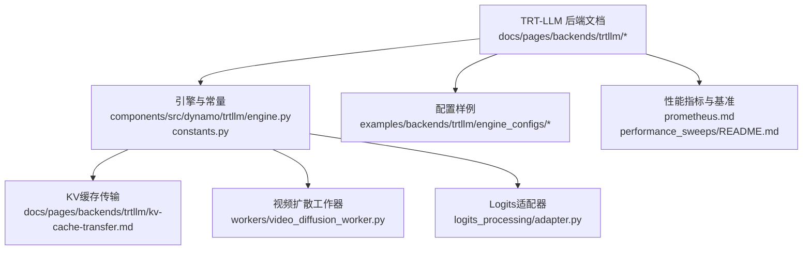
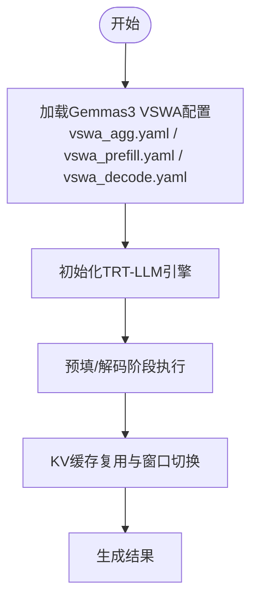
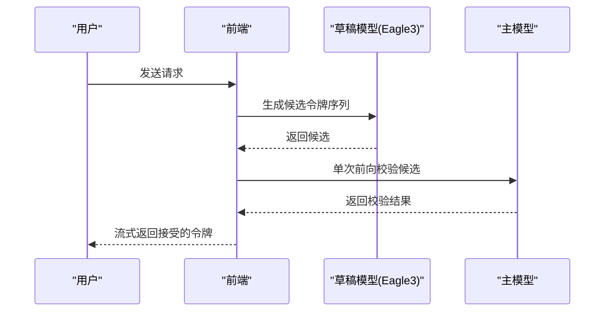
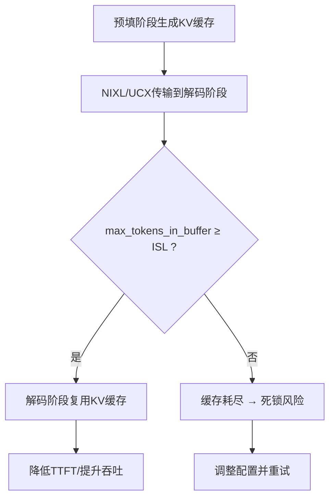
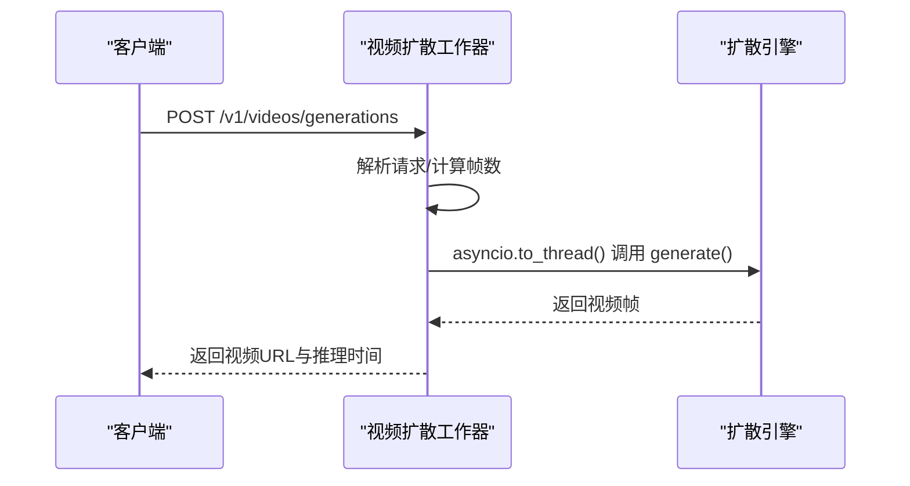
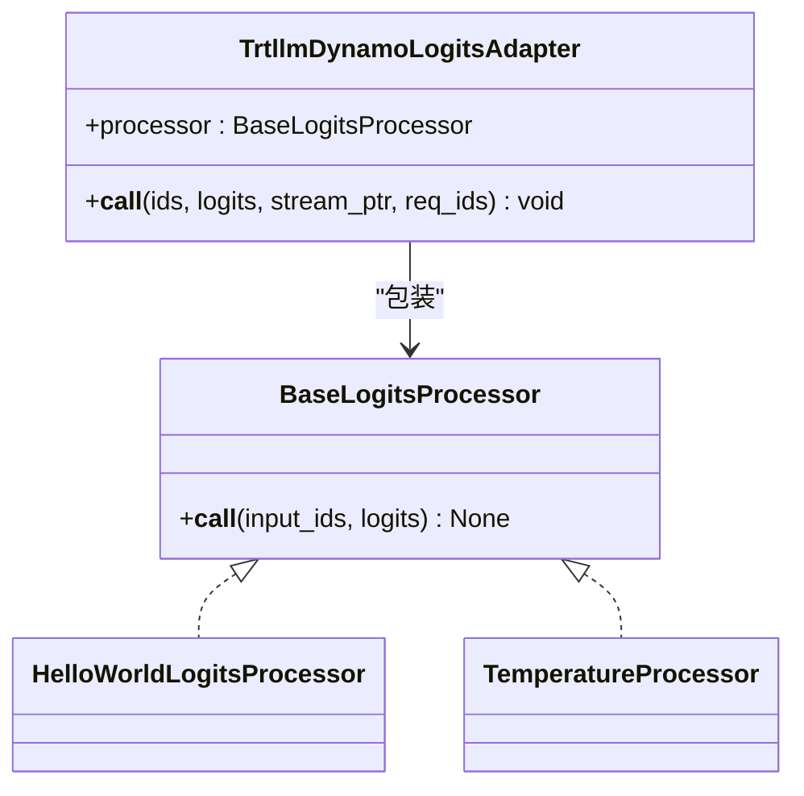
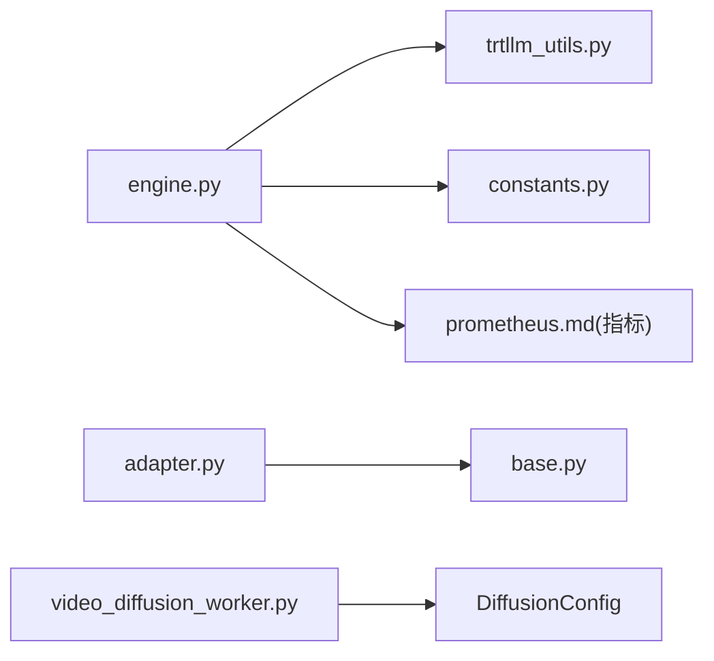

# 专用功能与优化技术

<cite>
**本文引用的文件**   
- [docs/pages/backends/trtllm/README.md](file://docs/pages/backends/trtllm/README.md)
- [docs/pages/backends/trtllm/gemma3-sliding-window-attention.md](file://docs/pages/backends/trtllm/gemma3-sliding-window-attention.md)
- [docs/pages/backends/trtllm/kv-cache-transfer.md](file://docs/pages/backends/trtllm/kv-cache-transfer.md)
- [docs/pages/features/speculative-decoding/README.md](file://docs/pages/features/speculative-decoding/README.md)
- [docs/pages/features/speculative-decoding/speculative-decoding-vllm.md](file://docs/pages/features/speculative-decoding/speculative-decoding-vllm.md)
- [examples/backends/trtllm/engine_configs/gemma3/vswa_agg.yaml](file://examples/backends/trtllm/engine_configs/gemma3/vswa_agg.yaml)
- [examples/backends/trtllm/engine_configs/gemma3/vswa_prefill.yaml](file://examples/backends/trtllm/engine_configs/gemma3/vswa_prefill.yaml)
- [examples/backends/trtllm/engine_configs/gemma3/vswa_decode.yaml](file://examples/backends/trtllm/engine_configs/gemma3/vswa_decode.yaml)
- [examples/backends/trtllm/engine_configs/README.md](file://examples/backends/trtllm/engine_configs/README.md)
- [components/src/dynamo/trtllm/engine.py](file://components/src/dynamo/trtllm/engine.py)
- [components/src/dynamo/trtllm/constants.py](file://components/src/dynamo/trtllm/constants.py)
- [components/src/dynamo/trtllm/utils/trtllm_utils.py](file://components/src/dynamo/trtllm/utils/trtllm_utils.py)
- [components/src/dynamo/trtllm/workers/llm_worker.py](file://components/src/dynamo/trtllm/workers/llm_worker.py)
- [components/src/dynamo/trtllm/workers/video_diffusion_worker.py](file://components/src/dynamo/trtllm/workers/video_diffusion_worker.py)
- [components/src/dynamo/trtllm/tests/test_trtllm_video_diffusion.py](file://components/src/dynamo/trtllm/tests/test_trtllm_video_diffusion.py)
- [components/src/dynamo/trtllm/logits_processing/adapter.py](file://components/src/dynamo/trtllm/logits_processing/adapter.py)
- [lib/bindings/python/src/dynamo/logits_processing/base.py](file://lib/bindings/python/src/dynamo/logits_processing/base.py)
- [lib/bindings/python/src/dynamo/logits_processing/examples/hello_world.py](file://lib/bindings/python/src/dynamo/logits_processing/examples/hello_world.py)
- [lib/bindings/python/src/dynamo/logits_processing/examples/temperature.py](file://lib/bindings/python/src/dynamo/logits_processing/examples/temperature.py)
- [lib/llm/src/kv_router/scheduler.rs](file://lib/llm/src/kv_router/scheduler.rs)
- [docs/pages/backends/trtllm/prometheus.md](file://docs/pages/backends/trtllm/prometheus.md)
- [examples/backends/trtllm/performance_sweeps/README.md](file://examples/backends/trtllm/performance_sweeps/README.md)
</cite>

## 目录
1. [引言](#引言)
2. [项目结构](#项目结构)
3. [核心组件](#核心组件)
4. [架构总览](#架构总览)
5. [详细组件分析](#详细组件分析)
6. [依赖关系分析](#依赖关系分析)
7. [性能考量](#性能考量)
8. [故障排查指南](#故障排查指南)
9. [结论](#结论)
10. [附录](#附录)

## 引言
本文件聚焦于TensorRT-LLM后端在Dynamo平台中的专用功能与优化技术，系统阐述以下主题：
- 滑动窗口注意力（含Gemma3变体）的实现与优势
- 推理增强技术（Eagle推测解码）在多后端中的应用现状与落地要点
- KV缓存传输优化（NIXL/UCX）与缓存共享/重用策略
- 扩散引擎的特殊处理能力（视频生成）
- Logits处理适配器对输出概率分布的优化
- 配置示例、性能对比方法与使用场景建议
- 最佳实践与常见问题解决方案

## 项目结构
围绕TensorRT-LLM专用功能，相关实现与文档主要分布在如下位置：
- 后端文档与示例：docs/pages/backends/trtllm/*
- 配置样例：examples/backends/trtllm/engine_configs/*
- 核心引擎与常量：components/src/dynamo/trtllm/engine.py, constants.py, utils/*
- 推理增强与扩散：workers/*（视频扩散）、logits_processing/*
- 性能指标与基准：docs/pages/backends/trtllm/prometheus.md, examples/backends/trtllm/performance_sweeps/*



**图表来源**
- [docs/pages/backends/trtllm/README.md](file://docs/pages/backends/trtllm/README.md#L1-L397)
- [components/src/dynamo/trtllm/engine.py](file://components/src/dynamo/trtllm/engine.py#L1-L171)
- [components/src/dynamo/trtllm/constants.py](file://components/src/dynamo/trtllm/constants.py#L1-L58)
- [docs/pages/backends/trtllm/kv-cache-transfer.md](file://docs/pages/backends/trtllm/kv-cache-transfer.md#L1-L27)
- [components/src/dynamo/trtllm/workers/video_diffusion_worker.py](file://components/src/dynamo/trtllm/workers/video_diffusion_worker.py#L36-L67)
- [components/src/dynamo/trtllm/logits_processing/adapter.py](file://components/src/dynamo/trtllm/logits_processing/adapter.py#L47-L88)
- [docs/pages/backends/trtllm/prometheus.md](file://docs/pages/backends/trtllm/prometheus.md#L134-L171)
- [examples/backends/trtllm/performance_sweeps/README.md](file://examples/backends/trtllm/performance_sweeps/README.md#L56-L146)

**章节来源**
- [docs/pages/backends/trtllm/README.md](file://docs/pages/backends/trtllm/README.md#L1-L397)
- [examples/backends/trtllm/engine_configs/README.md](file://examples/backends/trtllm/engine_configs/README.md#L1-L44)

## 核心组件
- 引擎与后端选择：支持PyTorch与AutoDeploy两种后端；根据模式（聚合/预填/解码/编码）初始化不同LLM实例。
- 常量与模态：定义了TEXT、MULTIMODAL、VIDEO_DIFFUSION等模态类型，区分文本/多模态/视频扩散任务。
- KV缓存传输：默认采用NIXL（UCX为后端），可选UCX直连；需正确配置缓存传输参数以避免缓存耗尽导致死锁。
- 视频扩散：通过视频扩散工作器接入扩散管线，提供视频生成接口与并发安全控制。
- Logits处理适配器：将Dynamo通用Logits处理器桥接到TRT-LLM，支持温度缩放等策略，按请求逐步修改logits。

**章节来源**
- [components/src/dynamo/trtllm/engine.py](file://components/src/dynamo/trtllm/engine.py#L25-L103)
- [components/src/dynamo/trtllm/constants.py](file://components/src/dynamo/trtllm/constants.py#L21-L58)
- [docs/pages/backends/trtllm/kv-cache-transfer.md](file://docs/pages/backends/trtllm/kv-cache-transfer.md#L14-L26)
- [components/src/dynamo/trtllm/workers/video_diffusion_worker.py](file://components/src/dynamo/trtllm/workers/video_diffusion_worker.py#L36-L67)
- [components/src/dynamo/trtllm/logits_processing/adapter.py](file://components/src/dynamo/trtllm/logits_processing/adapter.py#L47-L88)

## 架构总览
下图展示Dynamo中TensorRT-LLM后端的关键交互：前端路由、KV事件/指标发布、KV缓存传输、引擎初始化与运行时统计、以及视频扩散与Logits处理链路。

```mermaid
graph TB
subgraph "前端与路由"
FE["前端/路由器"]
KVROUTER["KV路由/事件平面"]
end
subgraph "TensorRT-LLM 工作器"
ENG["LLM引擎初始化<br/>engine.py"]
STATS["运行时统计<br/>llm_worker.py"]
ADAPTER["Logits适配器<br/>adapter.py"]
DIFF["视频扩散工作器<br/>video_diffusion_worker.py"]
end
subgraph "传输与缓存"
NIXL["NIXL/UCX 缓存传输"]
KVBLOCK["KV块管理/事件"]
end
FE --> KVROUTER
KVROUTER --> NIXL
NIXL --> ENG
ENG --> STATS
ENG --> ADAPTER
ENG --> DIFF
KVBLOCK <- --> KVROUTER
```

**图表来源**
- [components/src/dynamo/trtllm/engine.py](file://components/src/dynamo/trtllm/engine.py#L55-L92)
- [components/src/dynamo/trtllm/workers/llm_worker.py](file://components/src/dynamo/trtllm/workers/llm_worker.py#L70-L92)
- [components/src/dynamo/trtllm/logits_processing/adapter.py](file://components/src/dynamo/trtllm/logits_processing/adapter.py#L47-L88)
- [components/src/dynamo/trtllm/workers/video_diffusion_worker.py](file://components/src/dynamo/trtllm/workers/video_diffusion_worker.py#L36-L67)
- [docs/pages/backends/trtllm/kv-cache-transfer.md](file://docs/pages/backends/trtllm/kv-cache-transfer.md#L14-L26)

## 详细组件分析

### 滑动窗口注意力（Gemma3 变体）
- 实现要点
  - Gemma3采用“可变滑动窗口注意力”（VSWA），层间交替使用全局注意力与滑动窗口注意力，显著提升长上下文下的吞吐与延迟表现。
  - 在Dynamo中部署时，需为预填/解码/聚合分别配置不同的注意力窗口大小数组，确保层间窗口设置一致。
- 配置示例
  - 聚合/预填/解码配置均包含max_attention_window列表，对应各层最大注意力窗口长度。
- 使用建议
  - 小模型（如gemma-3-1b-it）可在单张H100或GB200上完成部署。
  - 注意版本兼容性：特定版本存在回归，建议使用已验证的运行镜像与版本组合。



**图表来源**
- [examples/backends/trtllm/engine_configs/gemma3/vswa_agg.yaml](file://examples/backends/trtllm/engine_configs/gemma3/vswa_agg.yaml#L19-L27)
- [examples/backends/trtllm/engine_configs/gemma3/vswa_prefill.yaml](file://examples/backends/trtllm/engine_configs/gemma3/vswa_prefill.yaml#L20-L28)
- [examples/backends/trtllm/engine_configs/gemma3/vswa_decode.yaml](file://examples/backends/trtllm/engine_configs/gemma3/vswa_decode.yaml#L19-L27)

**章节来源**
- [docs/pages/backends/trtllm/gemma3-sliding-window-attention.md](file://docs/pages/backends/trtllm/gemma3-sliding-window-attention.md#L1-L53)
- [examples/backends/trtllm/engine_configs/gemma3/vswa_agg.yaml](file://examples/backends/trtllm/engine_configs/gemma3/vswa_agg.yaml#L19-L27)
- [examples/backends/trtllm/engine_configs/gemma3/vswa_prefill.yaml](file://examples/backends/trtllm/engine_configs/gemma3/vswa_prefill.yaml#L20-L28)
- [examples/backends/trtllm/engine_configs/gemma3/vswa_decode.yaml](file://examples/backends/trtllm/engine_configs/gemma3/vswa_decode.yaml#L19-L27)

### Eagle 推测解码（推理增强）
- 现状与支持矩阵
  - vLLM已支持Eagle3作为草稿模型，实现多令牌并行校验，降低自回归生成延迟。
  - SGLang与TensorRT-LLM当前未提供官方文档，仍处于探索阶段。
- 工作流程
  - 草稿阶段：小模型预测候选令牌
  - 校验阶段：主模型单次前向验证候选
  - 接受/拒绝：匹配则接受，不匹配则回退
- 快速上手（vLLM + Eagle3）
  - 启动基础设施与容器，准备HuggingFace访问，运行聚合部署脚本即可体验。



**图表来源**
- [docs/pages/features/speculative-decoding/README.md](file://docs/pages/features/speculative-decoding/README.md#L10-L26)
- [docs/pages/features/speculative-decoding/speculative-decoding-vllm.md](file://docs/pages/features/speculative-decoding/speculative-decoding-vllm.md#L28-L59)

**章节来源**
- [docs/pages/features/speculative-decoding/README.md](file://docs/pages/features/speculative-decoding/README.md#L1-L59)
- [docs/pages/features/speculative-decoding/speculative-decoding-vllm.md](file://docs/pages/features/speculative-decoding/speculative-decoding-vllm.md#L61-L121)

### KV缓存传输优化与缓存共享/重用
- 传输方式
  - 默认：NIXL（UCX为后端）用于跨节点/进程高效传输KV缓存
  - 可选：直接使用UCX作为缓存传输后端
- 关键配置
  - cache_transceiver_config.backend：指定传输后端
  - max_tokens_in_buffer：必须大于最大输入序列长度，避免缓存耗尽导致死锁
- 运行时统计
  - 通过engine.llm.get_stats_async()可获取KV缓存分配/复用等统计信息，辅助调优



**图表来源**
- [docs/pages/backends/trtllm/kv-cache-transfer.md](file://docs/pages/backends/trtllm/kv-cache-transfer.md#L14-L26)
- [docs/pages/backends/trtllm/README.md](file://docs/pages/backends/trtllm/README.md#L372-L397)
- [components/src/dynamo/trtllm/workers/llm_worker.py](file://components/src/dynamo/trtllm/workers/llm_worker.py#L70-L92)

**章节来源**
- [docs/pages/backends/trtllm/kv-cache-transfer.md](file://docs/pages/backends/trtllm/kv-cache-transfer.md#L1-L27)
- [docs/pages/backends/trtllm/README.md](file://docs/pages/backends/trtllm/README.md#L372-L397)
- [components/src/dynamo/trtllm/workers/llm_worker.py](file://components/src/dynamo/trtllm/workers/llm_worker.py#L70-L92)

### 扩散引擎与视频生成（实验特性）
- 支持与要求
  - 依赖feat/visual_gen分支的TensorRT-LLM视觉生成模块与包含ModelType.Videos的Dynamo运行时
  - 自动从model_index.json检测管线类型，无需手动指定模型类型
- 快速启动
  - 通过--modality video_diffusion启用，提供/v1/videos/generations端点
- 并发与线程安全
  - 视频生成管线为全局单例且包含可变状态，需通过异步锁串行化engine.generate()调用，避免共享状态被并发破坏



**图表来源**
- [docs/pages/backends/trtllm/README.md](file://docs/pages/backends/trtllm/README.md#L212-L275)
- [components/src/dynamo/trtllm/workers/video_diffusion_worker.py](file://components/src/dynamo/trtllm/workers/video_diffusion_worker.py#L36-L67)
- [components/src/dynamo/trtllm/tests/test_trtllm_video_diffusion.py](file://components/src/dynamo/trtllm/tests/test_trtllm_video_diffusion.py#L545-L556)

**章节来源**
- [docs/pages/backends/trtllm/README.md](file://docs/pages/backends/trtllm/README.md#L212-L275)
- [components/src/dynamo/trtllm/workers/video_diffusion_worker.py](file://components/src/dynamo/trtllm/workers/video_diffusion_worker.py#L36-L67)
- [components/src/dynamo/trtllm/tests/test_trtllm_video_diffusion.py](file://components/src/dynamo/trtllm/tests/test_trtllm_video_diffusion.py#L264-L556)

### Logits处理适配器与输出概率分布优化
- 设计理念
  - Dynamo提供后端无关的BaseLogitsProcessor协议，TRT-LLM侧通过适配器将其转换为引擎可消费的形式
  - 适配器在CUDA流中执行，按请求逐步修改logits（不支持beam宽度>1）
- 典型用法
  - 温度缩放：通过除以温度系数平滑/尖锐化分布
  - 固定输出：强制输出固定文本序列（测试用途）
- 限制与注意事项
  - 仅支持每请求处理（batch size=1），beam宽度>1不支持
  - 处理器需原地修改logits，不可返回新张量
  - 若需要分词器，请确保已完成初始化



**图表来源**
- [lib/bindings/python/src/dynamo/logits_processing/base.py](file://lib/bindings/python/src/dynamo/logits_processing/base.py#L16-L39)
- [components/src/dynamo/trtllm/logits_processing/adapter.py](file://components/src/dynamo/trtllm/logits_processing/adapter.py#L47-L88)
- [lib/bindings/python/src/dynamo/logits_processing/examples/hello_world.py](file://lib/bindings/python/src/dynamo/logits_processing/examples/hello_world.py#L14-L42)
- [lib/bindings/python/src/dynamo/logits_processing/examples/temperature.py](file://lib/bindings/python/src/dynamo/logits_processing/examples/temperature.py#L11-L41)

**章节来源**
- [docs/pages/backends/trtllm/README.md](file://docs/pages/backends/trtllm/README.md#L276-L332)
- [components/src/dynamo/trtllm/logits_processing/adapter.py](file://components/src/dynamo/trtllm/logits_processing/adapter.py#L47-L88)
- [lib/bindings/python/src/dynamo/logits_processing/base.py](file://lib/bindings/python/src/dynamo/logits_processing/base.py#L16-L39)
- [lib/bindings/python/src/dynamo/logits_processing/examples/hello_world.py](file://lib/bindings/python/src/dynamo/logits_processing/examples/hello_world.py#L14-L42)
- [lib/bindings/python/src/dynamo/logits_processing/examples/temperature.py](file://lib/bindings/python/src/dynamo/logits_processing/examples/temperature.py#L11-L41)

## 依赖关系分析
- 组件耦合
  - engine.py负责引擎生命周期与后端选择，与utils/trtllm_utils.py存在配置编码/命令行解析的协作
  - logits_processing/adapter.py依赖Dynamo通用BaseLogitsProcessor协议
  - 视频扩散工作器依赖DiffusionConfig与底层扩散引擎
- 外部依赖
  - TensorRT-LLM LLM/MultimodalEncoder
  - NIXL/UCX通信库
  - Prometheus指标（非公开字段）



**图表来源**
- [components/src/dynamo/trtllm/engine.py](file://components/src/dynamo/trtllm/engine.py#L1-L171)
- [components/src/dynamo/trtllm/utils/trtllm_utils.py](file://components/src/dynamo/trtllm/utils/trtllm_utils.py#L119-L147)
- [components/src/dynamo/trtllm/constants.py](file://components/src/dynamo/trtllm/constants.py#L1-L58)
- [components/src/dynamo/trtllm/logits_processing/adapter.py](file://components/src/dynamo/trtllm/logits_processing/adapter.py#L47-L88)
- [lib/bindings/python/src/dynamo/logits_processing/base.py](file://lib/bindings/python/src/dynamo/logits_processing/base.py#L16-L39)
- [components/src/dynamo/trtllm/workers/video_diffusion_worker.py](file://components/src/dynamo/trtllm/workers/video_diffusion_worker.py#L36-L67)
- [docs/pages/backends/trtllm/prometheus.md](file://docs/pages/backends/trtllm/prometheus.md#L134-L171)

**章节来源**
- [components/src/dynamo/trtllm/engine.py](file://components/src/dynamo/trtllm/engine.py#L1-L171)
- [components/src/dynamo/trtllm/utils/trtllm_utils.py](file://components/src/dynamo/trtllm/utils/trtllm_utils.py#L119-L147)
- [components/src/dynamo/trtllm/logits_processing/adapter.py](file://components/src/dynamo/trtllm/logits_processing/adapter.py#L47-L88)
- [components/src/dynamo/trtllm/workers/video_diffusion_worker.py](file://components/src/dynamo/trtllm/workers/video_diffusion_worker.py#L36-L67)
- [docs/pages/backends/trtllm/prometheus.md](file://docs/pages/backends/trtllm/prometheus.md#L134-L171)

## 性能考量
- KV缓存传输
  - 优先使用NIXL（UCX后端）以获得更优带宽与低延迟
  - 明确设置cache_transceiver_config.backend并确保max_tokens_in_buffer足够大
- 滑动窗口注意力
  - Gemma3 VSWA在长上下文场景下显著降低TTFT并提升吞吐，需正确配置各层窗口
- 推测解码
  - vLLM/Eagle3可显著降低延迟，但需满足目标与草稿模型架构兼容性
- 日志与指标
  - 通过engine.llm.get_stats_async()与Prometheus扩展指标观测KV缓存利用率、接受率等关键指标
- 基准与对比
  - 使用aiperf工具与提供的性能扫描脚本进行多配置对比，关注用户吞吐/GPU吞吐与屋顶线帕累托曲线

**章节来源**
- [docs/pages/backends/trtllm/kv-cache-transfer.md](file://docs/pages/backends/trtllm/kv-cache-transfer.md#L14-L26)
- [docs/pages/backends/trtllm/README.md](file://docs/pages/backends/trtllm/README.md#L372-L397)
- [docs/pages/backends/trtllm/prometheus.md](file://docs/pages/backends/trtllm/prometheus.md#L134-L171)
- [examples/backends/trtllm/performance_sweeps/README.md](file://examples/backends/trtllm/performance_sweeps/README.md#L56-L146)

## 故障排查指南
- KV缓存耗尽导致死锁（解码卡住）
  - 症状：num_fitting_reqs=0、fitting_disagg_gen_init_requests为空、超时错误
  - 根因：max_tokens_in_buffer小于最大输入序列长度（ISL）
  - 处置：增大cache_transceiver_config.max_tokens_in_buffer，参考示例配置
- Logits处理异常
  - 现象：错误日志记录，logits未被修改
  - 处置：检查是否在CUDA流中执行、是否每请求处理、是否原地修改logits
- 视频扩散并发问题
  - 现象：并发请求导致共享管线状态损坏
  - 处置：确保通过异步锁串行化engine.generate()调用

**章节来源**
- [docs/pages/backends/trtllm/README.md](file://docs/pages/backends/trtllm/README.md#L372-L397)
- [components/src/dynamo/trtllm/logits_processing/adapter.py](file://components/src/dynamo/trtllm/logits_processing/adapter.py#L65-L68)
- [components/src/dynamo/trtllm/tests/test_trtllm_video_diffusion.py](file://components/src/dynamo/trtllm/tests/test_trtllm_video_diffusion.py#L545-L556)

## 结论
- Dynamo中的TensorRT-LLM后端在长上下文（Gemma3 VSWA）、KV缓存传输（NIXL/UCX）、视频扩散（实验）与Logits处理适配器等方面提供了丰富的优化能力
- 推测解码（Eagle）在vLLM已有成熟路径，TensorRT-LLM与SGLang尚在探索
- 通过正确的配置与可观测性手段，可显著降低TTFT、提升吞吐并稳定系统行为

## 附录
- 配置示例路径
  - Gemma3 VSWA：vswa_agg.yaml、vswa_prefill.yaml、vswa_decode.yaml
  - 通用引擎配置说明：engine_configs/README.md
- 快速参考
  - 后端文档总览：docs/pages/backends/trtllm/README.md
  - KV缓存传输：docs/pages/backends/trtllm/kv-cache-transfer.md
  - 性能基准：examples/backends/trtllm/performance_sweeps/README.md
  - 指标参考：docs/pages/backends/trtllm/prometheus.md