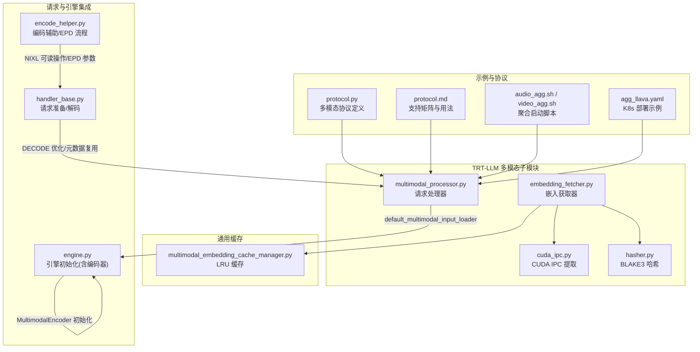
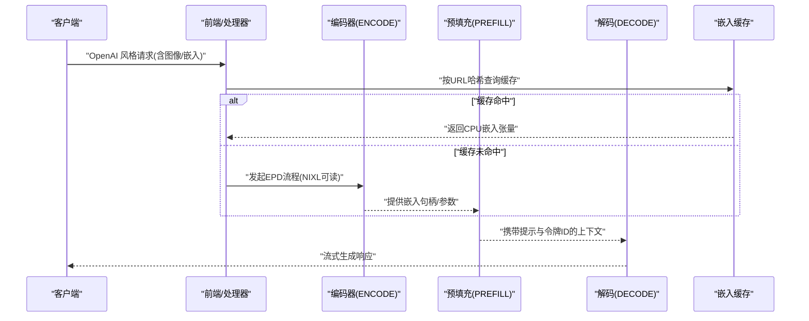
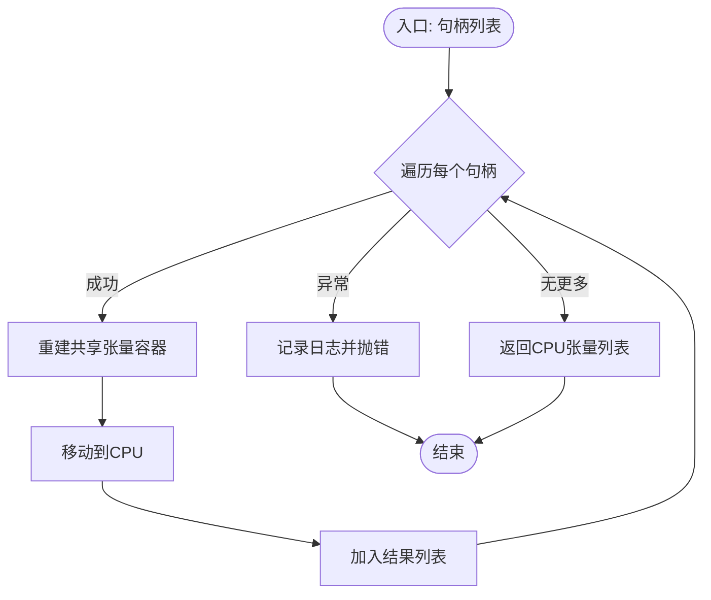
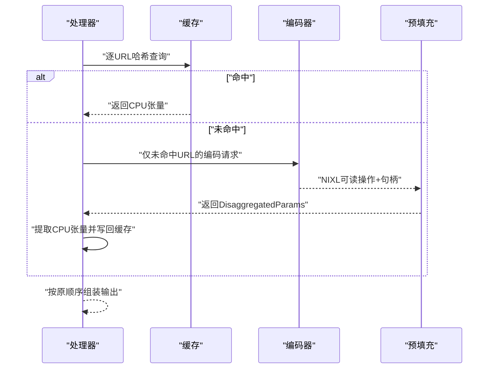
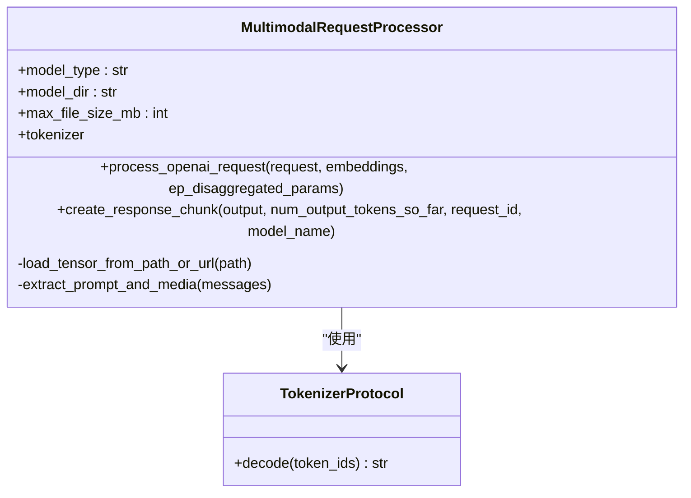
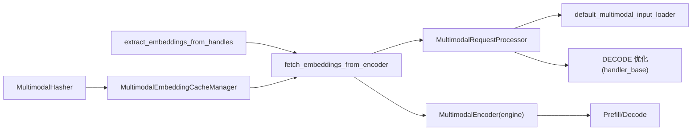

# 多模态处理能力

<cite>
**本文引用的文件**
- [cuda_ipc.py](file://components/src/dynamo/trtllm/multimodal/cuda_ipc.py)
- [embedding_fetcher.py](file://components/src/dynamo/trtllm/multimodal/embedding_fetcher.py)
- [hasher.py](file://components/src/dynamo/trtllm/multimodal/hasher.py)
- [multimodal_processor.py](file://components/src/dynamo/trtllm/multimodal_processor.py)
- [multimodal_embedding_cache_manager.py](file://components/src/dynamo/common/memory/multimodal_embedding_cache_manager.py)
- [handler_base.py](file://components/src/dynamo/trtllm/request_handlers/handler_base.py)
- [encode_helper.py](file://components/src/dynamo/trtllm/encode_helper.py)
- [engine.py](file://components/src/dynamo/trtllm/engine.py)
- [protocol.md](file://docs/pages/features/multimodal/multimodal-trtllm.md)
- [protocol.py](file://examples/multimodal/utils/protocol.py)
- [audio_agg.sh](file://examples/multimodal/launch/audio_agg.sh)
- [video_agg.sh](file://examples/multimodal/launch/video_agg.sh)
- [agg_llava.yaml](file://examples/multimodal/deploy/agg_llava.yaml)
</cite>

## 目录
1. [引言](#引言)
2. [项目结构](#项目结构)
3. [核心组件](#核心组件)
4. [架构总览](#架构总览)
5. [详细组件分析](#详细组件分析)
6. [依赖关系分析](#依赖关系分析)
7. [性能考量](#性能考量)
8. [故障排查指南](#故障排查指南)
9. [结论](#结论)
10. [附录](#附录)

## 引言
本文件系统性阐述 TensorRT-LLM 后端在 Dynamo 中的多模态处理能力，覆盖图像、视频与文本的融合输入、CUDA IPC 跨进程高效数据传输、嵌入获取器的特征提取与向量化流程、基于 BLAKE3 的内容哈希缓存策略、多模态协议设计与实现、配置示例、性能优化与硬件要求，以及与主推理引擎的集成与数据流管理。

## 项目结构
多模态相关代码主要集中在 TRT-LLM 组件的 multimodal 子模块与通用内存缓存管理器中，并通过请求处理器与编码辅助工具与引擎集成。示例脚本与部署清单展示了聚合与拆分（E/P/D）模式下的运行方式。

图示来源
- [cuda_ipc.py](file://components/src/dynamo/trtllm/multimodal/cuda_ipc.py#L1-L63)
- [embedding_fetcher.py](file://components/src/dynamo/trtllm/multimodal/embedding_fetcher.py#L1-L258)
- [hasher.py](file://components/src/dynamo/trtllm/multimodal/hasher.py#L1-L50)
- [multimodal_processor.py](file://components/src/dynamo/trtllm/multimodal_processor.py#L1-L281)
- [multimodal_embedding_cache_manager.py](file://components/src/dynamo/common/memory/multimodal_embedding_cache_manager.py#L1-L174)
- [handler_base.py](file://components/src/dynamo/trtllm/request_handlers/handler_base.py#L444-L503)
- [encode_helper.py](file://components/src/dynamo/trtllm/encode_helper.py#L251-L299)
- [engine.py](file://components/src/dynamo/trtllm/engine.py#L53-L77)
- [protocol.py](file://examples/multimodal/utils/protocol.py#L1-L191)
- [protocol.md](file://docs/pages/features/multimodal/multimodal-trtllm.md#L1-L30)
- [audio_agg.sh](file://examples/multimodal/launch/audio_agg.sh#L1-L98)
- [video_agg.sh](file://examples/multimodal/launch/video_agg.sh#L1-L24)
- [agg_llava.yaml](file://examples/multimodal/deploy/agg_llava.yaml#L1-L64)

章节来源
- [protocol.md](file://docs/pages/features/multimodal/multimodal-trtllm.md#L1-L30)

## 核心组件
- CUDA IPC 提取器：从编码器返回的 CUDA IPC 句柄重建共享张量，异步执行以避免阻塞事件循环，并将结果移动到 CPU。
- 嵌入获取器：封装远程编码器调用，支持按 URL 的缓存命中与未命中路径；未命中时通过 NIXL 可读操作传递嵌入句柄，命中则直接返回缓存张量。
- 内容哈希器：使用 BLAKE3 对原始字节进行哈希，作为缓存键，确保快速且确定性的内容指纹。
- 多模态请求处理器：解析 OpenAI 风格消息，区分 EPD（编码-预填充-解码）与 PD（预填充-解码）路径，调用默认多模态输入加载器完成预处理。
- 编码辅助工具：生成 EPD 参数，通过 NIXL 描述符与可读操作，向预填充处理器传递嵌入信息。
- 请求处理器基类：在 DECODE 模式下利用预填充元数据跳过重复的多模态处理，提升吞吐。
- 引擎初始化：在 ENCODE 模式下初始化 MultimodalEncoder，其他模式初始化标准 LLM。
- 缓存管理器：基于 LRU 的异步缓存，按字节容量限制进行逐出，统计命中率等指标。

章节来源
- [cuda_ipc.py](file://components/src/dynamo/trtllm/multimodal/cuda_ipc.py#L14-L63)
- [embedding_fetcher.py](file://components/src/dynamo/trtllm/multimodal/embedding_fetcher.py#L26-L204)
- [hasher.py](file://components/src/dynamo/trtllm/multimodal/hasher.py#L21-L50)
- [multimodal_processor.py](file://components/src/dynamo/trtllm/multimodal_processor.py#L46-L281)
- [encode_helper.py](file://components/src/dynamo/trtllm/encode_helper.py#L251-L299)
- [handler_base.py](file://components/src/dynamo/trtllm/request_handlers/handler_base.py#L444-L503)
- [engine.py](file://components/src/dynamo/trtllm/engine.py#L53-L77)
- [multimodal_embedding_cache_manager.py](file://components/src/dynamo/common/memory/multimodal_embedding_cache_manager.py#L29-L174)

## 架构总览
多模态处理在 Dynamo 中采用“前端-处理器-编码器-预填充/解码”流水线。图像 URL 或预计算嵌入通过处理器进入输入加载器；当启用缓存或使用编码器时，嵌入通过 NIXL IPC 在进程间传递，避免主机内存拷贝开销。DECODE 阶段复用预填充阶段的提示与令牌 ID，减少重复处理。

图示来源
- [embedding_fetcher.py](file://components/src/dynamo/trtllm/multimodal/embedding_fetcher.py#L114-L204)
- [encode_helper.py](file://components/src/dynamo/trtllm/encode_helper.py#L251-L299)
- [handler_base.py](file://components/src/dynamo/trtllm/request_handlers/handler_base.py#L444-L503)
- [multimodal_embedding_cache_manager.py](file://components/src/dynamo/common/memory/multimodal_embedding_cache_manager.py#L80-L149)

## 详细组件分析

### CUDA IPC 提取器
- 设计要点
  - 使用异步线程执行 GPU→CPU 张量提取，避免阻塞事件循环。
  - 通过 SharedTensorContainer 从 CUDA IPC 句柄重建本地视图，再转至 CPU。
  - 明确生命周期约束：建议单生产者-单消费者模型，确保引用计数归零以便释放 GPU 内存。
- 错误处理
  - 缺失字段抛出值错误；重建失败抛出运行时错误。
- 性能影响
  - 当前实现为串行提取，未来可探索固定页内存 DMA、多线程并发 GPU→CPU 传输等优化。

图示来源
- [cuda_ipc.py](file://components/src/dynamo/trtllm/multimodal/cuda_ipc.py#L14-L63)

章节来源
- [cuda_ipc.py](file://components/src/dynamo/trtllm/multimodal/cuda_ipc.py#L14-L63)

### 嵌入获取器与缓存
- 设计要点
  - 支持两种路径：带缓存（返回 CPU 张量）与不带缓存（返回包含 CUDA IPC 句柄的 DisaggregatedParams）。
  - 对每个 URL 计算 BLAKE3 哈希，先查缓存，未命中时仅对未命中集合发起一次编码请求，随后批量提取并写回缓存。
  - 通过修改请求仅包含未命中 URL，降低网络与编码负载。
- 协议与 IPC
  - 通过 NIXL 可读操作描述嵌入数据，预填充处理器等待完成后再继续。
- 错误处理
  - 空 URL 列表、无响应、缺少 ep_disaggregated_params 等均抛出运行时错误。
- 性能特性
  - 针对重复 URL 的缓存命中可显著减少编码与传输成本；GPU→CPU 提取在独立线程中执行。

图示来源
- [embedding_fetcher.py](file://components/src/dynamo/trtllm/multimodal/embedding_fetcher.py#L114-L204)
- [encode_helper.py](file://components/src/dynamo/trtllm/encode_helper.py#L251-L299)
- [hasher.py](file://components/src/dynamo/trtllm/multimodal/hasher.py#L31-L50)
- [multimodal_embedding_cache_manager.py](file://components/src/dynamo/common/memory/multimodal_embedding_cache_manager.py#L80-L149)

章节来源
- [embedding_fetcher.py](file://components/src/dynamo/trtllm/multimodal/embedding_fetcher.py#L26-L204)
- [encode_helper.py](file://components/src/dynamo/trtllm/encode_helper.py#L251-L299)
- [hasher.py](file://components/src/dynamo/trtllm/multimodal/hasher.py#L21-L50)
- [multimodal_embedding_cache_manager.py](file://components/src/dynamo/common/memory/multimodal_embedding_cache_manager.py#L29-L174)

### 多模态请求处理器
- 功能
  - 解析 OpenAI 风格消息，提取文本提示、图像 URL 与嵌入文件路径。
  - 支持三种路径：EPD（来自编码器的嵌入）、图像 URL（直接下载与预处理）、嵌入文件路径（直接加载）。
  - 默认多模态输入加载器同步执行，通过异步线程并发提升高并发下的吞吐。
- 安全与限制
  - 远程 URL 下载受最大文件大小限制；本地文件访问受允许目录白名单限制，防止越权。
- 流式响应
  - 基于分词器增量解码，维护上次解码文本以生成 delta 响应块。

图示来源
- [multimodal_processor.py](file://components/src/dynamo/trtllm/multimodal_processor.py#L46-L281)

章节来源
- [multimodal_processor.py](file://components/src/dynamo/trtllm/multimodal_processor.py#L46-L281)

### 请求准备与 DECODE 优化
- 设计要点
  - 在 DECODE 模式下，若存在预填充元数据，则直接复用提示与令牌 ID，跳过图像重处理。
  - 通过预填充阶段存储的元数据（如 _epd_processed_prompt/_epd_prompt_token_ids），在解码阶段构建输入。
- 效果
  - 显著减少重复 I/O 与预处理开销，提升长对话或多轮生成的吞吐。

章节来源
- [handler_base.py](file://components/src/dynamo/trtllm/request_handlers/handler_base.py#L444-L503)

### 引擎初始化与编码器
- 设计要点
  - ENCODE 模式下初始化 MultimodalEncoder，传入模型与批大小等参数。
  - 其他模式初始化标准 LLM，承载预填充与解码。
- 影响
  - 将编码阶段与推理阶段解耦，便于资源分配与扩展。

章节来源
- [engine.py](file://components/src/dynamo/trtllm/engine.py#L53-L77)

### 多模态协议与示例
- 协议定义
  - 示例协议定义了多模态消息结构（文本、图像 URL、音频 URL、视频 URL），以及 vLLM 生成请求的序列化包装。
- 支持矩阵
  - 文档明确列出图像 URL 与预计算嵌入的支持情况，以及当前未实现的视频/音频路径。

章节来源
- [protocol.py](file://examples/multimodal/utils/protocol.py#L102-L164)
- [protocol.md](file://docs/pages/features/multimodal/multimodal-trtllm.md#L16-L30)

## 依赖关系分析
- 组件内聚与耦合
  - 嵌入获取器依赖哈希器、CUDA IPC 提取器与缓存管理器，形成清晰的职责边界。
  - 请求处理器依赖默认多模态输入加载器与分词器工厂，负责高层编排。
  - 请求处理器基类与编码辅助工具分别承担 DECODE 优化与 EPD 参数生成，与引擎初始化配合。
- 外部依赖
  - CUDA IPC 与 SharedTensorContainer 用于跨进程张量传输。
  - NIXL 可读操作用于编码器与预填充处理器之间的数据通道。
  - BLAKE3 用于内容哈希，缓存键生成。

图示来源
- [embedding_fetcher.py](file://components/src/dynamo/trtllm/multimodal/embedding_fetcher.py#L114-L204)
- [hasher.py](file://components/src/dynamo/trtllm/multimodal/hasher.py#L31-L50)
- [multimodal_embedding_cache_manager.py](file://components/src/dynamo/common/memory/multimodal_embedding_cache_manager.py#L80-L149)
- [cuda_ipc.py](file://components/src/dynamo/trtllm/multimodal/cuda_ipc.py#L14-L63)
- [multimodal_processor.py](file://components/src/dynamo/trtllm/multimodal_processor.py#L168-L235)
- [handler_base.py](file://components/src/dynamo/trtllm/request_handlers/handler_base.py#L444-L503)
- [engine.py](file://components/src/dynamo/trtllm/engine.py#L53-L77)

## 性能考量
- CUDA IPC 与传输优化
  - 当前实现为同步重建与串行提取，建议评估固定页内存 DMA 与多线程并发提取以降低延迟。
- 缓存策略
  - LRU 缓存按字节容量限制逐出，命中率可通过统计接口观测；对重复内容显著降低编码与传输成本。
- 并发与 I/O
  - 默认多模态输入加载器同步执行，通过异步线程并发提升高并发吞吐；同时注意避免过多并发导致 GPU 内存压力。
- DECODE 复用
  - 利用预填充元数据复用提示与令牌 ID，避免重复图像加载与预处理，适合长对话场景。
- 硬件与资源
  - 编码器与预填充/解码器需合理分配 GPU 资源；部署时根据模型规模与批大小调整副本数量与显存上限。

[本节为通用指导，无需具体文件分析]

## 故障排查指南
- 常见问题与定位
  - 缺少 CUDA IPC 字段：检查编码器返回的句柄结构是否完整。
  - IPC 重建失败：确认句柄有效性与进程间共享状态。
  - 缓存未命中：确认 URL 哈希是否一致，以及缓存容量设置是否过小。
  - 远程下载失败：检查网络连通性与文件大小限制。
  - 本地文件访问被拒绝：确认 allowed_local_media_path 配置与路径解析。
- 日志与统计
  - 嵌入获取器与缓存管理器均提供详细日志与命中率统计，可用于诊断性能瓶颈。

章节来源
- [cuda_ipc.py](file://components/src/dynamo/trtllm/multimodal/cuda_ipc.py#L14-L63)
- [embedding_fetcher.py](file://components/src/dynamo/trtllm/multimodal/embedding_fetcher.py#L114-L204)
- [multimodal_embedding_cache_manager.py](file://components/src/dynamo/common/memory/multimodal_embedding_cache_manager.py#L151-L174)
- [multimodal_processor.py](file://components/src/dynamo/trtllm/multimodal_processor.py#L80-L140)

## 结论
该多模态处理方案通过 CUDA IPC 与 NIXL 实现跨进程高效数据传输，结合 BLAKE3 哈希与 LRU 缓存有效降低重复内容的处理成本；借助 DECODE 元数据复用与异步线程并发，整体吞吐与延迟表现得到显著提升。建议在实际部署中结合业务场景调整缓存容量、并发度与资源配额，并持续监控缓存命中率与 IPC 传输效率。

[本节为总结，无需具体文件分析]

## 附录

### 配置示例与部署
- 聚合模式启动脚本
  - 音频/视频/图像等多模态示例脚本展示了如何启动前端、处理器与编码/工作节点，并通过环境变量配置端口与模型。
- Kubernetes 部署
  - 提供基于 DynamoGraphDeployment 的示例，定义 Frontend、EncodeWorker、VLMWorker、Processor 等组件的镜像、资源与命令行参数。

章节来源
- [audio_agg.sh](file://examples/multimodal/launch/audio_agg.sh#L1-L98)
- [video_agg.sh](file://examples/multimodal/launch/video_agg.sh#L1-L24)
- [agg_llava.yaml](file://examples/multimodal/deploy/agg_llava.yaml#L1-L64)

### 多模态协议与支持矩阵
- 协议定义
  - 包含消息类型（文本、图像 URL、音频 URL、视频 URL）与 vLLM 生成请求的序列化包装。
- 支持矩阵
  - 图像 URL 与预计算嵌入在聚合与拆分模式下均受支持；视频/音频当前未实现。

章节来源
- [protocol.py](file://examples/multimodal/utils/protocol.py#L102-L164)
- [protocol.md](file://docs/pages/features/multimodal/multimodal-trtllm.md#L16-L30)