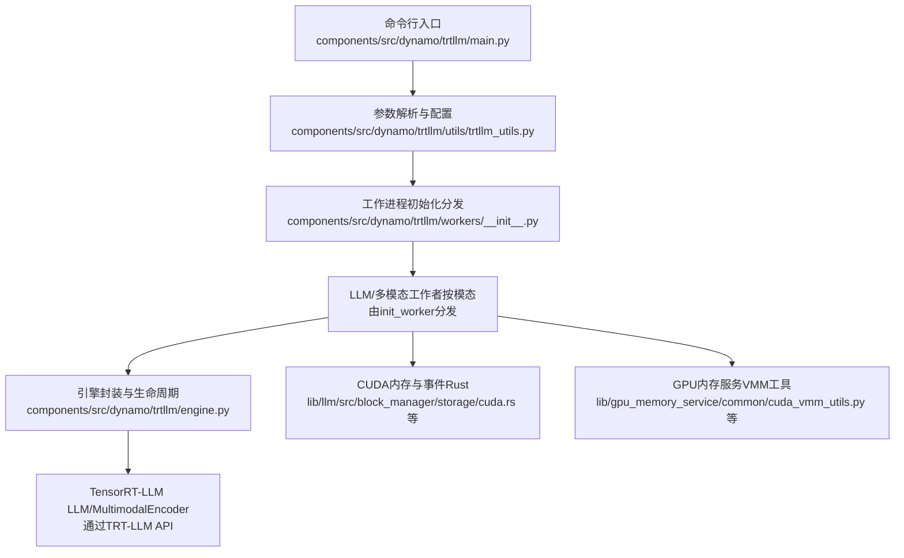
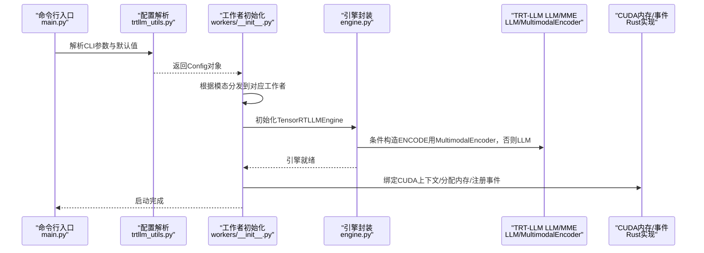
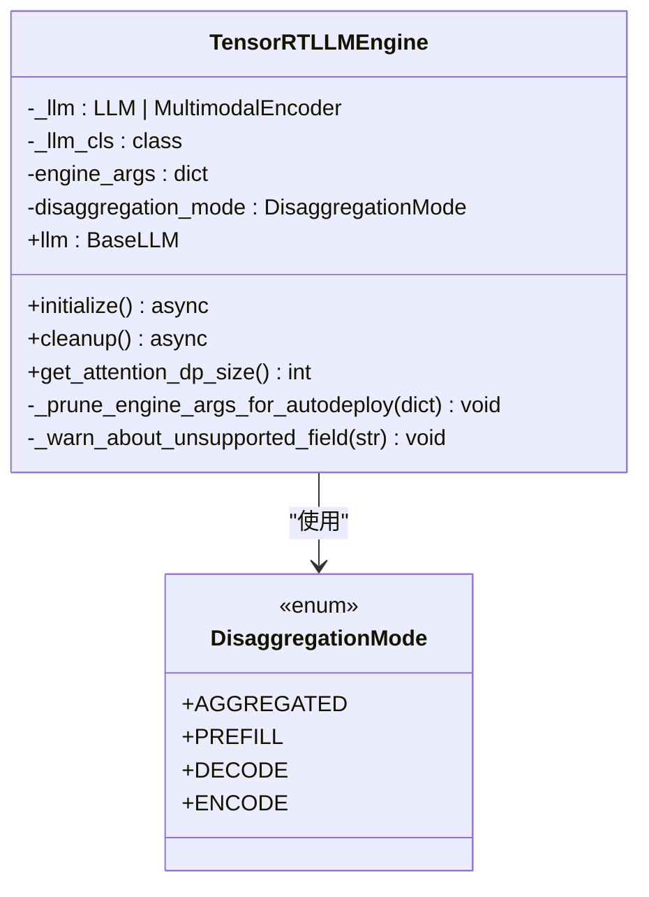
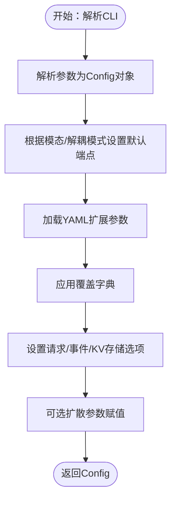
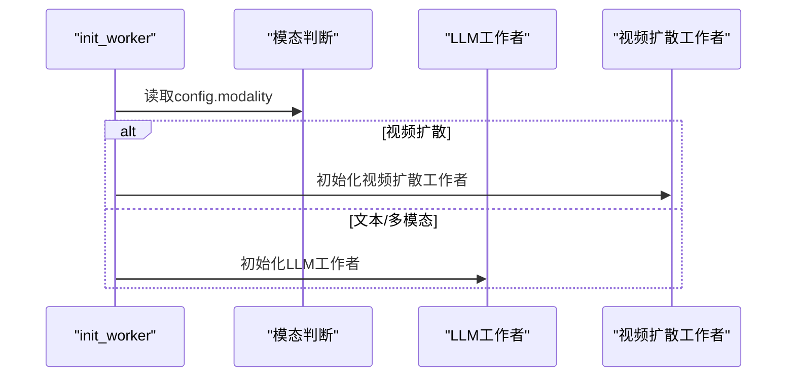
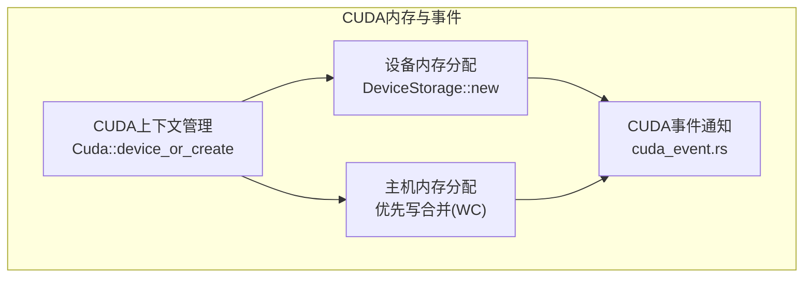
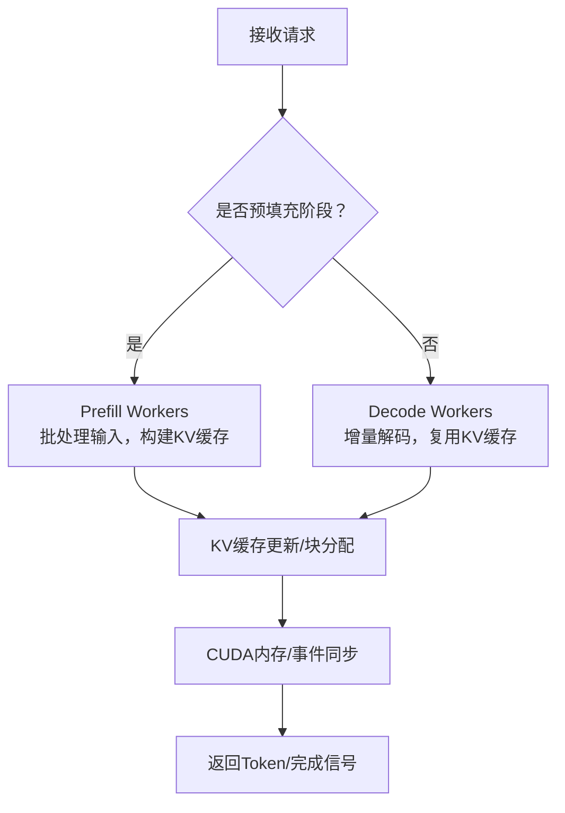
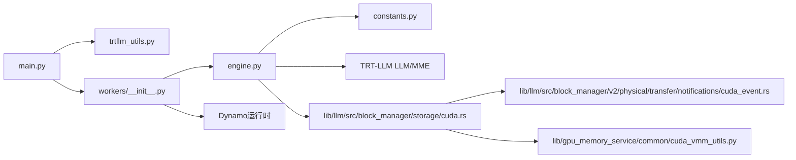

# 引擎架构与CUDA优化

<cite>
**本文引用的文件**
- [engine.py](file://components/src/dynamo/trtllm/engine.py)
- [main.py](file://components/src/dynamo/trtllm/main.py)
- [constants.py](file://components/src/dynamo/trtllm/constants.py)
- [trtllm_utils.py](file://components/src/dynamo/trtllm/utils/trtllm_utils.py)
- [workers/__init__.py](file://components/src/dynamo/trtllm/workers/__init__.py)
- [cuda.rs](file://lib/llm/src/cuda.rs)
- [cuda.rs（存储）](file://lib/llm/src/block_manager/storage/cuda.rs)
- [cuda_event.rs](file://lib/llm/src/block_manager/v2/physical/transfer/notifications/cuda_event.rs)
- [cuda_vmm_utils.py](file://lib/gpu_memory_service/common/cuda_vmm_utils.py)
- [cuda_vmm_utils.py（客户端）](file://lib/gpu_memory_service/client/cuda_vmm_utils.py)
- [test_cuda_graph.py](file://tests/kvbm_integration/test_cuda_graph.py)
- [engine_config_with_cuda_graph_and_kvbm.yaml](file://tests/kvbm_integration/engine_config_with_cuda_graph_and_kvbm.yaml)
- [engine_config_without_cuda_graph_and_kvbm.yaml](file://tests/kvbm_integration/engine_config_without_cuda_graph_and_kvbm.yaml)
- [README.md（TRT-LLM 配置示例）](file://examples/backends/trtllm/engine_configs/README.md)
</cite>

## 目录
1. [引言](#引言)
2. [项目结构](#项目结构)
3. [核心组件](#核心组件)
4. [架构总览](#架构总览)
5. [详细组件分析](#详细组件分析)
6. [依赖关系分析](#依赖关系分析)
7. [性能考量](#性能考量)
8. [故障排查指南](#故障排查指南)
9. [结论](#结论)
10. [附录](#附录)

## 引言
本文件面向TensorRT-LLM在Dynamo平台上的引擎架构与CUDA优化实践，系统阐述以下主题：
- 引擎整体架构：预填充（Prefill）与解码（Decode）阶段的专门优化策略
- CUDA优化技术：内存管理、并行计算与硬件加速
- 引擎初始化流程、配置参数与运行时设置
- 分布式推理中的GPU调度与资源管理
- CUDA IPC机制的实现细节与性能优化策略
- 与Dynamo框架其他组件的集成方式与通信协议
- 实际配置示例、性能调优指南与硬件适配建议

## 项目结构
TRT-LLM后端位于components/src/dynamo/trtllm目录，主要由以下模块组成：
- 引擎封装与生命周期管理：engine.py
- 命令行参数解析与默认配置：utils/trtllm_utils.py
- 工作进程入口与运行时初始化：main.py
- 模态与解耦模式常量：constants.py
- 工作者初始化分发：workers/__init__.py
- CUDA相关底层实现（Rust侧）：lib/llm/src/cuda.rs、lib/llm/src/block_manager/storage/cuda.rs、lib/llm/src/block_manager/v2/physical/transfer/notifications/cuda_event.rs
- GPU内存服务（CUDA VMM）工具：lib/gpu_memory_service/common/cuda_vmm_utils.py、lib/gpu_memory_service/client/cuda_vmm_utils.py
- 测试与示例：tests/kvbm_integration、examples/backends/trtllm/engine_configs

图表来源
- [main.py](file://components/src/dynamo/trtllm/main.py#L29-L46)
- [trtllm_utils.py](file://components/src/dynamo/trtllm/utils/trtllm_utils.py#L146-L597)
- [workers/__init__.py](file://components/src/dynamo/trtllm/workers/__init__.py#L21-L52)
- [engine.py](file://components/src/dynamo/trtllm/engine.py#L25-L92)
- [cuda.rs（存储）](file://lib/llm/src/block_manager/storage/cuda.rs#L77-L381)

章节来源
- [main.py](file://components/src/dynamo/trtllm/main.py#L1-L51)
- [trtllm_utils.py](file://components/src/dynamo/trtllm/utils/trtllm_utils.py#L1-L613)
- [workers/__init__.py](file://components/src/dynamo/trtllm/workers/__init__.py#L1-L56)
- [engine.py](file://components/src/dynamo/trtllm/engine.py#L1-L171)

## 核心组件
- 引擎封装与生命周期：提供异步初始化、清理与LLM实例访问；支持聚合与解耦模式（ENCODE/PREFILL/DECODE/AGGREGATED），并在ENCODE模式下使用MultimodalEncoder。
- 参数与配置：统一的Config类承载CLI参数、默认值、端点选择、并行度、KV缓存块大小、事件发布开关等；支持从YAML加载额外引擎参数并可覆盖。
- 工作者初始化：根据模态（文本/多模态/扩散）分发到对应工作者；与Dynamo运行时（请求平面、事件平面、KV存储）对接。
- CUDA优化支撑：Rust侧提供CUDA上下文管理、设备/主机内存分配、写合并主机内存策略、事件通知等；GPU内存服务提供VMM工具以优化显存占用。

章节来源
- [engine.py](file://components/src/dynamo/trtllm/engine.py#L25-L171)
- [constants.py](file://components/src/dynamo/trtllm/constants.py#L12-L58)
- [trtllm_utils.py](file://components/src/dynamo/trtllm/utils/trtllm_utils.py#L34-L136)
- [workers/__init__.py](file://components/src/dynamo/trtllm/workers/__init__.py#L21-L52)
- [cuda.rs（存储）](file://lib/llm/src/block_manager/storage/cuda.rs#L77-L381)

## 架构总览
Dynamo TRT-LLM后端采用“解耦推理”范式，将预填充（Prefill）与解码（Decode）阶段分离为独立工作进程，结合KV缓存与事件平面实现低延迟高吞吐的推理链路。CUDA优化贯穿内存分配、数据传输与执行调度，确保在多GPU与分布式场景下的高效利用。

图表来源
- [main.py](file://components/src/dynamo/trtllm/main.py#L29-L46)
- [trtllm_utils.py](file://components/src/dynamo/trtllm/utils/trtllm_utils.py#L146-L597)
- [workers/__init__.py](file://components/src/dynamo/trtllm/workers/__init__.py#L21-L52)
- [engine.py](file://components/src/dynamo/trtllm/engine.py#L55-L92)
- [cuda.rs（存储）](file://lib/llm/src/block_manager/storage/cuda.rs#L117-L149)

## 详细组件分析

### 引擎封装与生命周期（TensorRTLLMEngine）
- 支持后端类型：PyTorch与自动部署（AutoDeploy），后者会裁剪不支持的参数。
- ENCODE模式：使用MultimodalEncoder进行多模态编码，仅传递受支持参数。
- 其他模式：使用标准LLM构造器，传入完整engine_args。
- 注意事项：engine_args被复制以避免外部副作用；提供注意力数据并行（attention_dp）尺寸查询接口。

图表来源
- [engine.py](file://components/src/dynamo/trtllm/engine.py#L25-L137)
- [constants.py](file://components/src/dynamo/trtllm/constants.py#L12-L19)

章节来源
- [engine.py](file://components/src/dynamo/trtllm/engine.py#L25-L171)
- [constants.py](file://components/src/dynamo/trtllm/constants.py#L12-L58)

### 参数与配置（Config与命令行）
- 默认端点：根据模态与解耦模式自动选择（解码/聚合、预填充、编码、扩散）。
- 关键参数：
  - 并行度：张量并行、流水线并行、专家并行、注意力数据并行开关
  - KV缓存：块大小、空闲显存比例
  - 扩展引擎参数：支持从YAML加载并可覆盖
  - 运行时：请求平面、事件平面、KV存储、是否启用本地索引器/持久化KV事件
  - 多模态与扩散：媒体路径、文件大小限制、编码器缓存容量、扩散生成参数等
- 自定义模板：支持自定义Jinja模板路径扩展与校验。

图表来源
- [trtllm_utils.py](file://components/src/dynamo/trtllm/utils/trtllm_utils.py#L146-L597)

章节来源
- [trtllm_utils.py](file://components/src/dynamo/trtllm/utils/trtllm_utils.py#L34-L597)

### 工作者初始化与模态分发
- init_worker根据模态选择视频扩散或通用LLM工作者。
- 与Dynamo运行时对接：请求平面（NATS/HTTP/TCP）、事件平面（NATS/ZMQ）、KV存储（etcd/文件/内存）。
- 支持持久化KV事件（JetStream）与本地索引器切换。

图表来源
- [workers/__init__.py](file://components/src/dynamo/trtllm/workers/__init__.py#L21-L52)

章节来源
- [workers/__init__.py](file://components/src/dynamo/trtllm/workers/__init__.py#L21-L52)

### CUDA优化与内存管理
- CUDA上下文管理：按设备获取或创建上下文，绑定到当前线程。
- 设备内存分配：在给定CUDA上下文中分配设备内存。
- 主机内存策略：优先使用写合并（WC）主机内存用于PCIe DMA，若不支持则回退到普通固定页内存。
- 事件通知：基于CUDA事件的完成通知机制，用于跨组件同步。
- GPU内存服务（VMM）：提供CUDA VMM工具以优化显存占用与回收。

图表来源
- [cuda.rs（存储）](file://lib/llm/src/block_manager/storage/cuda.rs#L117-L149)
- [cuda.rs（存储）](file://lib/llm/src/block_manager/storage/cuda.rs#L368-L381)
- [cuda.rs（存储）](file://lib/llm/src/block_manager/storage/cuda.rs#L91-L105)
- [cuda_event.rs](file://lib/llm/src/block_manager/v2/physical/transfer/notifications/cuda_event.rs#L1-L200)
- [cuda_vmm_utils.py](file://lib/gpu_memory_service/common/cuda_vmm_utils.py#L1-L200)
- [cuda_vmm_utils.py（客户端）](file://lib/gpu_memory_service/client/cuda_vmm_utils.py#L1-L200)

章节来源
- [cuda.rs（存储）](file://lib/llm/src/block_manager/storage/cuda.rs#L77-L381)
- [cuda_event.rs](file://lib/llm/src/block_manager/v2/physical/transfer/notifications/cuda_event.rs#L1-L200)
- [cuda_vmm_utils.py](file://lib/gpu_memory_service/common/cuda_vmm_utils.py#L1-L200)
- [cuda_vmm_utils.py（客户端）](file://lib/gpu_memory_service/client/cuda_vmm_utils.py#L1-L200)

### 预填充与解码阶段的专门优化
- 解耦模式：PREFILL/DECODE分别作为独立工作进程，减少长尾延迟与资源竞争。
- KV缓存：通过块大小与空闲显存比例控制缓存占用与命中率。
- CUDA图（测试覆盖）：在KVBM集成测试中验证CUDA图对预填充/解码性能的提升。

图表来源
- [constants.py](file://components/src/dynamo/trtllm/constants.py#L12-L19)
- [trtllm_utils.py](file://components/src/dynamo/trtllm/utils/trtllm_utils.py#L49-L597)
- [test_cuda_graph.py](file://tests/kvbm_integration/test_cuda_graph.py#L1-L200)
- [engine_config_with_cuda_graph_and_kvbm.yaml](file://tests/kvbm_integration/engine_config_with_cuda_graph_and_kvbm.yaml#L1-L200)
- [engine_config_without_cuda_graph_and_kvbm.yaml](file://tests/kvbm_integration/engine_config_without_cuda_graph_and_kvbm.yaml#L1-L200)

章节来源
- [constants.py](file://components/src/dynamo/trtllm/constants.py#L12-L19)
- [trtllm_utils.py](file://components/src/dynamo/trtllm/utils/trtllm_utils.py#L49-L597)
- [test_cuda_graph.py](file://tests/kvbm_integration/test_cuda_graph.py#L1-L200)
- [engine_config_with_cuda_graph_and_kvbm.yaml](file://tests/kvbm_integration/engine_config_with_cuda_graph_and_kvbm.yaml#L1-L200)
- [engine_config_without_cuda_graph_and_kvbm.yaml](file://tests/kvbm_integration/engine_config_without_cuda_graph_and_kvbm.yaml#L1-L200)

### 分布式推理中的GPU调度与资源管理
- 请求平面：支持NATS/HTTP/TCP，TCP通常具有更低延迟。
- 事件平面：支持NATS与ZMQ，用于发布事件与指标。
- KV存储：支持etcd、文件与内存后端；可启用持久化KV事件（JetStream）。
- GPU内存服务：通过VMM工具优化显存分配与回收，降低碎片化与峰值占用。

章节来源
- [trtllm_utils.py](file://components/src/dynamo/trtllm/utils/trtllm_utils.py#L337-L363)
- [cuda_vmm_utils.py](file://lib/gpu_memory_service/common/cuda_vmm_utils.py#L1-L200)
- [cuda_vmm_utils.py（客户端）](file://lib/gpu_memory_service/client/cuda_vmm_utils.py#L1-L200)

### CUDA IPC机制与性能优化
- CUDA IPC在Rust侧通过CUDA上下文与事件通知实现跨组件/跨进程的数据与状态同步。
- 性能优化策略：
  - 写合并主机内存优先，避免PCIe DMA瓶颈
  - 使用CUDA事件进行细粒度同步，减少CPU轮询
  - 合理设置KV缓存块大小与空闲显存比例，平衡吞吐与延迟
  - 在KVBM集成中启用CUDA图以减少内核启动开销

章节来源
- [cuda.rs（存储）](file://lib/llm/src/block_manager/storage/cuda.rs#L91-L105)
- [cuda_event.rs](file://lib/llm/src/block_manager/v2/physical/transfer/notifications/cuda_event.rs#L1-L200)
- [test_cuda_graph.py](file://tests/kvbm_integration/test_cuda_graph.py#L1-L200)

## 依赖关系分析
- 引擎封装依赖TRT-LLM LLM/MultimodalEncoder与Dynamo解耦模式枚举。
- 工作者初始化依赖Dynamo运行时与模态枚举，按模态分发到具体工作者。
- CUDA优化依赖Rust侧CUDA上下文与内存分配实现，以及GPU内存服务工具。

图表来源
- [engine.py](file://components/src/dynamo/trtllm/engine.py#L1-L171)
- [constants.py](file://components/src/dynamo/trtllm/constants.py#L1-L58)
- [main.py](file://components/src/dynamo/trtllm/main.py#L1-L51)
- [trtllm_utils.py](file://components/src/dynamo/trtllm/utils/trtllm_utils.py#L1-L613)
- [workers/__init__.py](file://components/src/dynamo/trtllm/workers/__init__.py#L1-L56)
- [cuda.rs（存储）](file://lib/llm/src/block_manager/storage/cuda.rs#L77-L381)
- [cuda_event.rs](file://lib/llm/src/block_manager/v2/physical/transfer/notifications/cuda_event.rs#L1-L200)
- [cuda_vmm_utils.py](file://lib/gpu_memory_service/common/cuda_vmm_utils.py#L1-L200)

章节来源
- [engine.py](file://components/src/dynamo/trtllm/engine.py#L1-L171)
- [constants.py](file://components/src/dynamo/trtllm/constants.py#L1-L58)
- [main.py](file://components/src/dynamo/trtllm/main.py#L1-L51)
- [trtllm_utils.py](file://components/src/dynamo/trtllm/utils/trtllm_utils.py#L1-L613)
- [workers/__init__.py](file://components/src/dynamo/trtllm/workers/__init__.py#L1-L56)
- [cuda.rs（存储）](file://lib/llm/src/block_manager/storage/cuda.rs#L77-L381)
- [cuda_event.rs](file://lib/llm/src/block_manager/v2/physical/transfer/notifications/cuda_event.rs#L1-L200)
- [cuda_vmm_utils.py](file://lib/gpu_memory_service/common/cuda_vmm_utils.py#L1-L200)

## 性能考量
- 并行度配置：合理设置张量/流水线/专家并行与注意力数据并行，结合硬件拓扑与模型规模进行权衡。
- KV缓存策略：增大块大小可减少分配次数但增加碎片风险；提高空闲显存比例可提升吞吐但降低并发。
- 事件与平面：TCP请求平面通常优于NATS/HTTP；ZMQ事件平面适合低延迟事件传播。
- CUDA图：在KVBM集成测试中验证了CUDA图对预填充/解码的性能增益，建议在稳定负载下启用。
- 固定页内存：优先使用写合并主机内存以优化PCIe DMA，避免在Grace Hopper/Blackwell等平台上回退。

章节来源
- [trtllm_utils.py](file://components/src/dynamo/trtllm/utils/trtllm_utils.py#L176-L238)
- [trtllm_utils.py](file://components/src/dynamo/trtllm/utils/trtllm_utils.py#L337-L363)
- [test_cuda_graph.py](file://tests/kvbm_integration/test_cuda_graph.py#L1-L200)
- [cuda.rs（存储）](file://lib/llm/src/block_manager/storage/cuda.rs#L91-L105)

## 故障排查指南
- 引擎初始化失败：检查engine_args是否包含不兼容字段（如AutoDeploy不支持的并行度参数），必要时裁剪参数或切换后端。
- 日志级别：通过环境变量映射Dynamo日志级别到TRT-LLM日志级别，便于定位问题。
- CUDA上下文错误：确认CUDA上下文已绑定到当前线程且设备ID正确。
- 事件丢失：关注调度器断连警告，检查请求/事件平面连接状态。
- 显存不足：调整空闲显存比例、KV块大小或启用GPU内存服务VMM工具。

章节来源
- [engine.py](file://components/src/dynamo/trtllm/engine.py#L104-L136)
- [main.py](file://components/src/dynamo/trtllm/main.py#L8-L19)
- [cuda.rs（存储）](file://lib/llm/src/block_manager/storage/cuda.rs#L117-L149)
- [scheduler.rs](file://lib/llm/src/block_manager/connector/scheduler.rs#L12-L19)

## 结论
Dynamo TRT-LLM后端通过解耦的Prefill/Decode工作进程、完善的CUDA优化与灵活的运行时配置，实现了高性能、低延迟的分布式推理。结合KV缓存策略、CUDA图与写合并内存等技术，可在多GPU与复杂拓扑环境下获得稳定的吞吐与延迟表现。建议在生产环境中启用持久化KV事件、合理设置并行度与KV参数，并配合GPU内存服务工具进行显存优化。

## 附录
- 配置示例：参考examples/backends/trtllm/engine_configs目录下的各模型配置样例，按需选择聚合/解耦/宽端口等部署形态。
- 性能调优清单：
  - 评估不同请求平面（TCP/NATS/HTTP）对延迟的影响
  - 在KVBM集成场景启用CUDA图
  - 调整KV块大小与空闲显存比例以平衡吞吐与并发
  - 使用写合并主机内存优化PCIe DMA
  - 启用JetStream持久化KV事件以保证一致性

章节来源
- [README.md（TRT-LLM 配置示例）](file://examples/backends/trtllm/engine_configs/README.md#L1-L200)