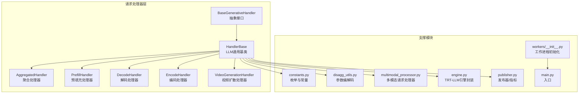
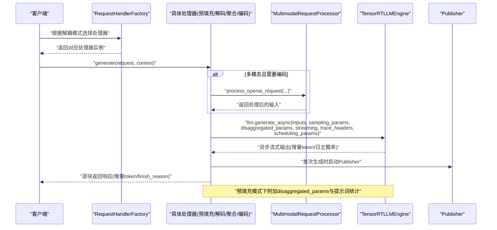
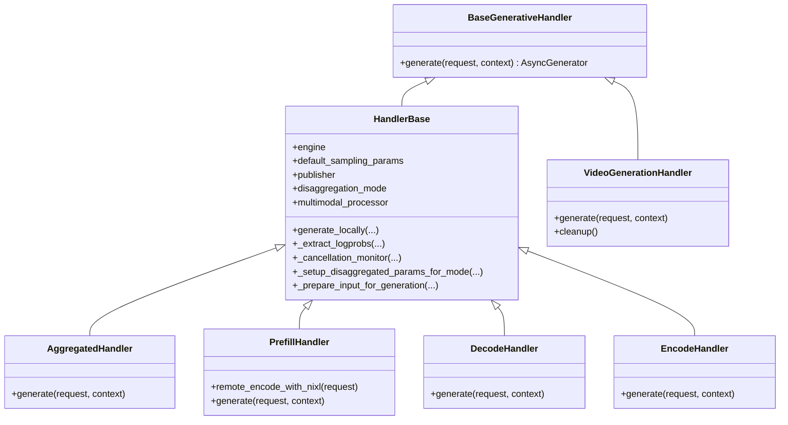
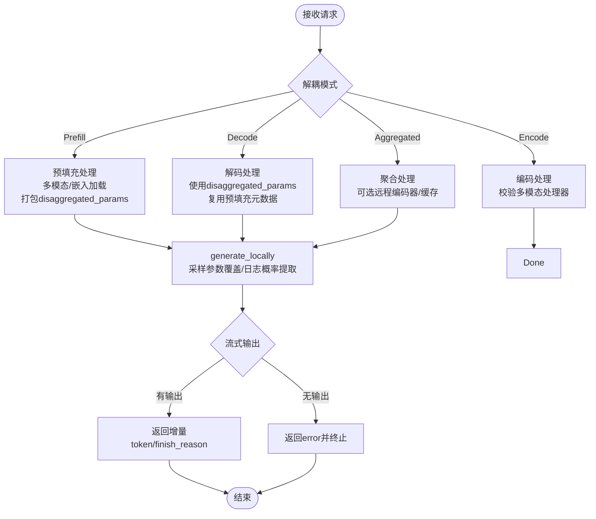
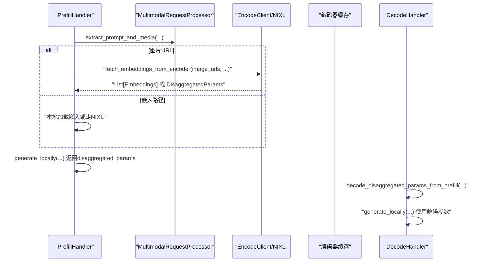
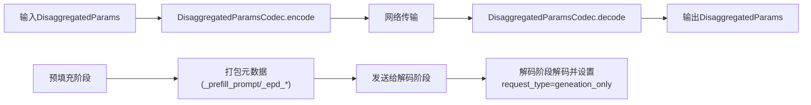
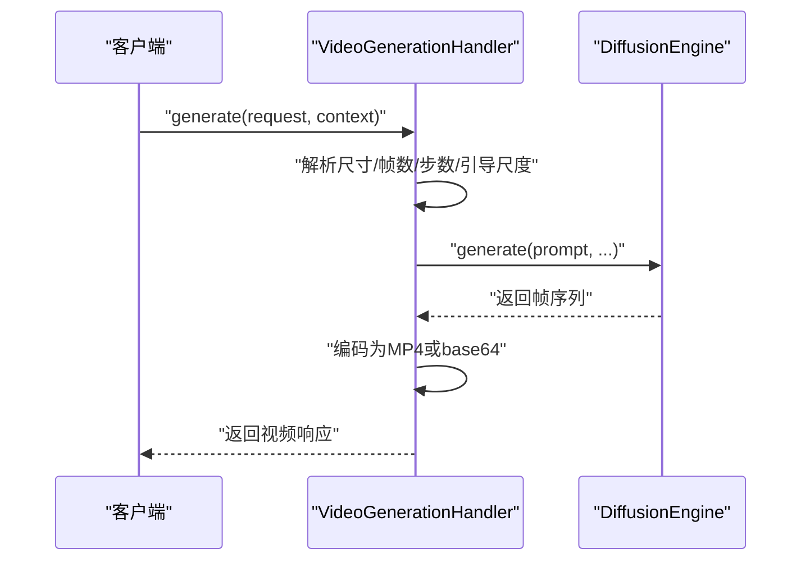
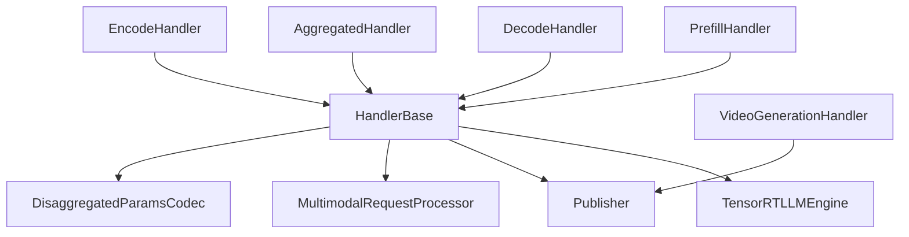

# 请求处理器实现

<cite>
**本文档引用的文件**
- [components/src/dynamo/trtllm/request_handlers/handler_base.py](file://components/src/dynamo/trtllm/request_handlers/handler_base.py)
- [components/src/dynamo/trtllm/request_handlers/base_generative_handler.py](file://components/src/dynamo/trtllm/request_handlers/base_generative_handler.py)
- [components/src/dynamo/trtllm/request_handlers/aggregated_handler.py](file://components/src/dynamo/trtllm/request_handlers/aggregated_handler.py)
- [components/src/dynamo/trtllm/request_handlers/handlers.py](file://components/src/dynamo/trtllm/request_handlers/handlers.py)
- [components/src/dynamo/trtllm/request_handlers/video_diffusion/video_handler.py](file://components/src/dynamo/trtllm/request_handlers/video_diffusion/video_handler.py)
- [components/src/dynamo/trtllm/constants.py](file://components/src/dynamo/trtllm/constants.py)
- [components/src/dynamo/trtllm/utils/disagg_utils.py](file://components/src/dynamo/trtllm/utils/disagg_utils.py)
- [components/src/dynamo/trtllm/multimodal_processor.py](file://components/src/dynamo/trtllm/multimodal_processor.py)
- [components/src/dynamo/trtllm/engine.py](file://components/src/dynamo/trtllm/engine.py)
- [components/src/dynamo/trtllm/workers/__init__.py](file://components/src/dynamo/trtllm/workers/__init__.py)
- [components/src/dynamo/trtllm/main.py](file://components/src/dynamo/trtllm/main.py)
- [components/src/dynamo/trtllm/publisher.py](file://components/src/dynamo/trtllm/publisher.py)
</cite>

## 目录
1. [引言](#引言)
2. [项目结构](#项目结构)
3. [核心组件](#核心组件)
4. [架构总览](#架构总览)
5. [详细组件分析](#详细组件分析)
6. [依赖关系分析](#依赖关系分析)
7. [性能考量](#性能考量)
8. [故障排查指南](#故障排查指南)
9. [结论](#结论)
10. [附录](#附录)

## 引言
本文件面向TensorRT-LLM后端的请求处理器实现，系统性阐述处理器的设计模式与实现细节，覆盖聚合处理器、基元生成处理器（预填充/解码/编码）以及通用处理器的职责边界与协作方式。文档重点解析继承体系与接口设计，明确handler_base与base_generative_handler的架构定位；梳理从接收请求到生成响应的完整链路；总结不同处理器类型在预填充、解码与扩散处理中的特点与适用场景；并提供扩展与自定义指导、错误处理策略与性能优化建议，以及与工作进程的协作与负载均衡策略。

## 项目结构
TensorRT-LLM请求处理器位于components/src/dynamo/trtllm/request_handlers目录，围绕“生成式处理器”抽象与具体实现展开，辅以常量、编解码工具、多模态处理与引擎封装等支撑模块。

图示来源
- [components/src/dynamo/trtllm/request_handlers/handler_base.py](file://components/src/dynamo/trtllm/request_handlers/handler_base.py#L77-L104)
- [components/src/dynamo/trtllm/request_handlers/base_generative_handler.py](file://components/src/dynamo/trtllm/request_handlers/base_generative_handler.py#L16-L47)
- [components/src/dynamo/trtllm/request_handlers/aggregated_handler.py](file://components/src/dynamo/trtllm/request_handlers/aggregated_handler.py#L20-L35)
- [components/src/dynamo/trtllm/request_handlers/handlers.py](file://components/src/dynamo/trtllm/request_handlers/handlers.py#L23-L50)
- [components/src/dynamo/trtllm/request_handlers/video_diffusion/video_handler.py](file://components/src/dynamo/trtllm/request_handlers/video_diffusion/video_handler.py#L33-L65)
- [components/src/dynamo/trtllm/constants.py](file://components/src/dynamo/trtllm/constants.py#L12-L58)
- [components/src/dynamo/trtllm/utils/disagg_utils.py](file://components/src/dynamo/trtllm/utils/disagg_utils.py#L22-L50)
- [components/src/dynamo/trtllm/multimodal_processor.py](file://components/src/dynamo/trtllm/multimodal_processor.py#L46-L71)
- [components/src/dynamo/trtllm/engine.py](file://components/src/dynamo/trtllm/engine.py#L25-L93)
- [components/src/dynamo/trtllm/workers/__init__.py](file://components/src/dynamo/trtllm/workers/__init__.py#L21-L56)
- [components/src/dynamo/trtllm/main.py](file://components/src/dynamo/trtllm/main.py#L29-L51)
- [components/src/dynamo/trtllm/publisher.py](file://components/src/dynamo/trtllm/publisher.py#L733-L763)

章节来源
- [components/src/dynamo/trtllm/request_handlers/handler_base.py](file://components/src/dynamo/trtllm/request_handlers/handler_base.py#L77-L104)
- [components/src/dynamo/trtllm/request_handlers/handlers.py](file://components/src/dynamo/trtllm/request_handlers/handlers.py#L23-L50)
- [components/src/dynamo/trtllm/constants.py](file://components/src/dynamo/trtllm/constants.py#L12-L58)

## 核心组件
- 抽象接口BaseGenerativeHandler：定义所有生成式处理器必须实现的generate方法，确保端点服务基础设施的一致调用入口。
- 基础实现HandlerBase：面向LLM与多模态的通用处理器基类，负责请求格式归一化、采样参数覆盖、日志概率提取、取消监控、KV缓存统计、分布式追踪头构建、调度参数注入、以及与引擎的交互。
- 具体处理器：
  - AggregatedHandler：聚合模式（预填充+解码）处理器，支持可选的编码器分离（E_PD），在本地完成生成或通过远程编码器获取嵌入。
  - PrefillHandler：预填充专用处理器，负责上下文编码与disaggregated_params打包，支持NIXL路径加载嵌入。
  - DecodeHandler：解码专用处理器，使用来自预填充阶段的disaggregated_params进行增量生成。
  - EncodeHandler：编码专用处理器，对接多模态编码器，返回嵌入或元数据。
  - VideoGenerationHandler：视频扩散处理器，基于DiffusionEngine执行扩散生成，输出MP4 URL或base64。
- 工厂与路由：RequestHandlerFactory根据配置的解耦模式选择对应处理器实例。
- 支撑能力：
  - RequestHandlerConfig：统一承载引擎、采样参数、发布器、解耦模式、编码客户端、多模态处理器、连接器、运行时、指标收集器、KV块大小、关闭事件与编码器缓存容量等。
  - DisaggregatedParamsCodec：对不透明状态进行base64编解码，便于网络传输。
  - MultimodalRequestProcessor：OpenAI格式消息解析、URL/本地路径安全加载、多模态输入构造与增量流式响应拼接。
  - TensorRTLLMEngine：封装LLM/MultimodalEncoder初始化、清理与参数裁剪，支持注意力数据并行规模查询。
  - Publisher：发布器/指标收集器封装，配合KV监听器与ZMQ端点。
  - workers/__init__.py与main.py：按模态分发工作进程初始化，驱动引擎与发布器生命周期。

章节来源
- [components/src/dynamo/trtllm/request_handlers/base_generative_handler.py](file://components/src/dynamo/trtllm/request_handlers/base_generative_handler.py#L16-L47)
- [components/src/dynamo/trtllm/request_handlers/handler_base.py](file://components/src/dynamo/trtllm/request_handlers/handler_base.py#L77-L104)
- [components/src/dynamo/trtllm/request_handlers/aggregated_handler.py](file://components/src/dynamo/trtllm/request_handlers/aggregated_handler.py#L20-L66)
- [components/src/dynamo/trtllm/request_handlers/handlers.py](file://components/src/dynamo/trtllm/request_handlers/handlers.py#L23-L85)
- [components/src/dynamo/trtllm/request_handlers/video_diffusion/video_handler.py](file://components/src/dynamo/trtllm/request_handlers/video_diffusion/video_handler.py#L33-L65)
- [components/src/dynamo/trtllm/request_handlers/handlers.py](file://components/src/dynamo/trtllm/request_handlers/handlers.py#L23-L50)
- [components/src/dynamo/trtllm/utils/disagg_utils.py](file://components/src/dynamo/trtllm/utils/disagg_utils.py#L22-L50)
- [components/src/dynamo/trtllm/multimodal_processor.py](file://components/src/dynamo/trtllm/multimodal_processor.py#L46-L71)
- [components/src/dynamo/trtllm/engine.py](file://components/src/dynamo/trtllm/engine.py#L25-L93)
- [components/src/dynamo/trtllm/publisher.py](file://components/src/dynamo/trtllm/publisher.py#L733-L763)
- [components/src/dynamo/trtllm/workers/__init__.py](file://components/src/dynamo/trtllm/workers/__init__.py#L21-L56)
- [components/src/dynamo/trtllm/main.py](file://components/src/dynamo/trtllm/main.py#L29-L51)

## 架构总览
下图展示请求从进入工作进程到生成响应的关键交互，涵盖多模态路径、编码器分离、参数编解码与发布器启动。

图示来源
- [components/src/dynamo/trtllm/request_handlers/handlers.py](file://components/src/dynamo/trtllm/request_handlers/handlers.py#L23-L50)
- [components/src/dynamo/trtllm/request_handlers/handler_base.py](file://components/src/dynamo/trtllm/request_handlers/handler_base.py#L574-L800)
- [components/src/dynamo/trtllm/multimodal_processor.py](file://components/src/dynamo/trtllm/multimodal_processor.py#L168-L235)
- [components/src/dynamo/trtllm/engine.py](file://components/src/dynamo/trtllm/engine.py#L88-L93)
- [components/src/dynamo/trtllm/publisher.py](file://components/src/dynamo/trtllm/publisher.py#L733-L763)

## 详细组件分析

### 继承体系与接口设计
- BaseGenerativeHandler：定义generate方法的最小接口，保证所有生成式处理器（LLM、视频扩散、图像扩散）具备一致的调用契约。
- HandlerBase：继承BaseGenerativeHandler，提供LLM/多模态通用能力：
  - 请求格式归一化（如max_tokens移动至stop_conditions，temperature移动至sampling_options）
  - 采样参数覆盖（logprobs、prompt_logprobs、max/min_tokens、stop_token_ids等）
  - 日志概率提取（从引擎输出中抽取新token的log_probs与top_logprobs）
  - 取消监控（基于Context与shutdown_event的后台任务）
  - 解耦参数管理（编码/解码阶段的参数设置、编码与打包、解码阶段的解码与元数据提取）
  - 输入准备（DECODE阶段复用预填充元数据跳过多模态重处理）
  - 分布式追踪头构建与调度参数注入（attention_dp_rank）
  - 首次生成启动Publisher，结束时记录指标
- 具体处理器：
  - AggregatedHandler：在聚合模式下，可选地通过远程编码器获取嵌入或直接使用已编码参数，再委托generate_locally。
  - PrefillHandler：预填充阶段，处理多模态输入或嵌入路径，必要时调用远程编码器，仅需一次响应并返回disaggregated_params。
  - DecodeHandler：解码阶段，若存在disaggregated_params则直接使用，否则按常规生成。
  - EncodeHandler：编码阶段，校验多模态处理器配置，调用EncodeHelper处理编码请求。
  - VideoGenerationHandler：视频扩散处理器，独立于LLM管线，继承BaseGenerativeHandler，内部序列化访问以避免非线程安全问题。

图示来源
- [components/src/dynamo/trtllm/request_handlers/base_generative_handler.py](file://components/src/dynamo/trtllm/request_handlers/base_generative_handler.py#L16-L47)
- [components/src/dynamo/trtllm/request_handlers/handler_base.py](file://components/src/dynamo/trtllm/request_handlers/handler_base.py#L77-L104)
- [components/src/dynamo/trtllm/request_handlers/aggregated_handler.py](file://components/src/dynamo/trtllm/request_handlers/aggregated_handler.py#L20-L66)
- [components/src/dynamo/trtllm/request_handlers/handlers.py](file://components/src/dynamo/trtllm/request_handlers/handlers.py#L52-L215)
- [components/src/dynamo/trtllm/request_handlers/video_diffusion/video_handler.py](file://components/src/dynamo/trtllm/request_handlers/video_diffusion/video_handler.py#L33-L65)

章节来源
- [components/src/dynamo/trtllm/request_handlers/base_generative_handler.py](file://components/src/dynamo/trtllm/request_handlers/base_generative_handler.py#L16-L47)
- [components/src/dynamo/trtllm/request_handlers/handler_base.py](file://components/src/dynamo/trtllm/request_handlers/handler_base.py#L77-L104)
- [components/src/dynamo/trtllm/request_handlers/aggregated_handler.py](file://components/src/dynamo/trtllm/request_handlers/aggregated_handler.py#L20-L66)
- [components/src/dynamo/trtllm/request_handlers/handlers.py](file://components/src/dynamo/trtllm/request_handlers/handlers.py#L52-L215)
- [components/src/dynamo/trtllm/request_handlers/video_diffusion/video_handler.py](file://components/src/dynamo/trtllm/request_handlers/video_diffusion/video_handler.py#L33-L65)

### 请求处理流程（预填充/解码/聚合/编码）
- 预填充（Prefill）：提取多模态内容（图片URL或嵌入路径），必要时调用远程编码器或本地加载嵌入，仅生成一次上下文表示并返回disaggregated_params；若为EPD流程，保留多模态句柄与哈希以便后续解码阶段复用。
- 解码（Decode）：若携带disaggregated_params，则直接使用；否则按常规生成；DECODE阶段可利用预填充元数据跳过多模态重处理，提升吞吐。
- 聚合（Aggregated）：在单个工作进程中完成预填充+解码，可选地通过编码器缓存或远程编码器获取嵌入，减少跨进程通信。
- 编码（Encode）：校验多模态处理器配置，调用EncodeHelper处理编码请求，返回嵌入或元数据。
- 视频扩散（Video Diffusion）：独立于LLM管线，序列化访问DiffusionEngine，生成视频并编码为MP4或base64。

图示来源
- [components/src/dynamo/trtllm/request_handlers/handlers.py](file://components/src/dynamo/trtllm/request_handlers/handlers.py#L87-L215)
- [components/src/dynamo/trtllm/request_handlers/aggregated_handler.py](file://components/src/dynamo/trtllm/request_handlers/aggregated_handler.py#L36-L66)
- [components/src/dynamo/trtllm/request_handlers/handler_base.py](file://components/src/dynamo/trtllm/request_handlers/handler_base.py#L574-L800)

章节来源
- [components/src/dynamo/trtllm/request_handlers/handlers.py](file://components/src/dynamo/trtllm/request_handlers/handlers.py#L87-L215)
- [components/src/dynamo/trtllm/request_handlers/aggregated_handler.py](file://components/src/dynamo/trtllm/request_handlers/aggregated_handler.py#L36-L66)
- [components/src/dynamo/trtllm/request_handlers/handler_base.py](file://components/src/dynamo/trtllm/request_handlers/handler_base.py#L574-L800)

### 多模态与编码器分离（E_PD）路径
- 预填充阶段：若检测到图片URL，可通过远程编码器获取嵌入；若检测到嵌入路径，可走NIXL或本地加载；也可直接使用文本输入。
- 解码阶段：从预填充结果中解码disaggregated_params，移除多模态句柄以避免验证错误，并设置request_type为generation_only。
- 聚合阶段：在本地完成生成，可选地使用编码器缓存或远程编码器返回的嵌入。

图示来源
- [components/src/dynamo/trtllm/request_handlers/handlers.py](file://components/src/dynamo/trtllm/request_handlers/handlers.py#L100-L189)
- [components/src/dynamo/trtllm/request_handlers/aggregated_handler.py](file://components/src/dynamo/trtllm/request_handlers/aggregated_handler.py#L40-L61)
- [components/src/dynamo/trtllm/request_handlers/handler_base.py](file://components/src/dynamo/trtllm/request_handlers/handler_base.py#L266-L313)

章节来源
- [components/src/dynamo/trtllm/request_handlers/handlers.py](file://components/src/dynamo/trtllm/request_handlers/handlers.py#L100-L189)
- [components/src/dynamo/trtllm/request_handlers/aggregated_handler.py](file://components/src/dynamo/trtllm/request_handlers/aggregated_handler.py#L40-L61)
- [components/src/dynamo/trtllm/request_handlers/handler_base.py](file://components/src/dynamo/trtllm/request_handlers/handler_base.py#L266-L313)

### 解耦参数编解码与元数据打包
- 编码：将不透明状态转换为base64字符串，便于网络传输。
- 打包：在预填充阶段将提示词、token_ids与EPD元数据打包进disaggregated_params，供解码阶段复用，避免重复加载多模态数据。
- 解码：从预填充结果中解码参数，设置request_type为generation_only，并移除多模态句柄以满足引擎验证要求。

图示来源
- [components/src/dynamo/trtllm/utils/disagg_utils.py](file://components/src/dynamo/trtllm/utils/disagg_utils.py#L22-L50)
- [components/src/dynamo/trtllm/request_handlers/handler_base.py](file://components/src/dynamo/trtllm/request_handlers/handler_base.py#L314-L407)
- [components/src/dynamo/trtllm/request_handlers/handler_base.py](file://components/src/dynamo/trtllm/request_handlers/handler_base.py#L266-L313)

章节来源
- [components/src/dynamo/trtllm/utils/disagg_utils.py](file://components/src/dynamo/trtllm/utils/disagg_utils.py#L22-L50)
- [components/src/dynamo/trtllm/request_handlers/handler_base.py](file://components/src/dynamo/trtllm/request_handlers/handler_base.py#L314-L407)
- [components/src/dynamo/trtllm/request_handlers/handler_base.py](file://components/src/dynamo/trtllm/request_handlers/handler_base.py#L266-L313)

### 视频扩散处理器
- 独立于LLM管线，继承BaseGenerativeHandler，内部使用锁序列化访问DiffusionEngine，避免非线程安全问题。
- 支持尺寸解析、帧数计算、推理步数与引导尺度配置，输出MP4 URL或base64编码数据。
- 提供清理方法用于资源回收。

图示来源
- [components/src/dynamo/trtllm/request_handlers/video_diffusion/video_handler.py](file://components/src/dynamo/trtllm/request_handlers/video_diffusion/video_handler.py#L156-L277)

章节来源
- [components/src/dynamo/trtllm/request_handlers/video_diffusion/video_handler.py](file://components/src/dynamo/trtllm/request_handlers/video_diffusion/video_handler.py#L33-L65)
- [components/src/dynamo/trtllm/request_handlers/video_diffusion/video_handler.py](file://components/src/dynamo/trtllm/request_handlers/video_diffusion/video_handler.py#L156-L277)

## 依赖关系分析
- 模块内聚与耦合：
  - HandlerBase高度内聚于LLM/多模态生成逻辑，通过组合模式注入引擎、发布器、多模态处理器、连接器等外部依赖。
  - 具体处理器仅关注各自阶段的特例（如PrefillHandler的NIXL路径、DecodeHandler的参数复用）。
- 外部依赖：
  - TensorRT-LLM引擎与MultimodalEncoder（通过TensorRTLLMEngine封装）
  - 多模态输入加载器与tokenizer（通过MultimodalRequestProcessor）
  - 发布器与指标收集器（通过Publisher）
  - 工作进程初始化（通过workers/__init__.py与main.py）

图示来源
- [components/src/dynamo/trtllm/request_handlers/handler_base.py](file://components/src/dynamo/trtllm/request_handlers/handler_base.py#L77-L104)
- [components/src/dynamo/trtllm/engine.py](file://components/src/dynamo/trtllm/engine.py#L25-L93)
- [components/src/dynamo/trtllm/publisher.py](file://components/src/dynamo/trtllm/publisher.py#L733-L763)
- [components/src/dynamo/trtllm/multimodal_processor.py](file://components/src/dynamo/trtllm/multimodal_processor.py#L46-L71)
- [components/src/dynamo/trtllm/utils/disagg_utils.py](file://components/src/dynamo/trtllm/utils/disagg_utils.py#L22-L50)
- [components/src/dynamo/trtllm/request_handlers/handlers.py](file://components/src/dynamo/trtllm/request_handlers/handlers.py#L87-L215)
- [components/src/dynamo/trtllm/request_handlers/video_diffusion/video_handler.py](file://components/src/dynamo/trtllm/request_handlers/video_diffusion/video_handler.py#L33-L65)

章节来源
- [components/src/dynamo/trtllm/request_handlers/handler_base.py](file://components/src/dynamo/trtllm/request_handlers/handler_base.py#L77-L104)
- [components/src/dynamo/trtllm/engine.py](file://components/src/dynamo/trtllm/engine.py#L25-L93)
- [components/src/dynamo/trtllm/publisher.py](file://components/src/dynamo/trtllm/publisher.py#L733-L763)
- [components/src/dynamo/trtllm/multimodal_processor.py](file://components/src/dynamo/trtllm/multimodal_processor.py#L46-L71)
- [components/src/dynamo/trtllm/utils/disagg_utils.py](file://components/src/dynamo/trtllm/utils/disagg_utils.py#L22-L50)
- [components/src/dynamo/trtllm/request_handlers/handlers.py](file://components/src/dynamo/trtllm/request_handlers/handlers.py#L87-L215)
- [components/src/dynamo/trtllm/request_handlers/video_diffusion/video_handler.py](file://components/src/dynamo/trtllm/request_handlers/video_diffusion/video_handler.py#L33-L65)

## 性能考量
- 流式生成与日志概率：
  - 预填充阶段禁用流式输出，仅生成一次上下文；解码阶段启用流式输出，按增量token返回，降低首token延迟。
  - 通过_extract_logprobs按新token抽取log_probs与top_logprobs，避免全量输出带来的内存压力。
- 取消与优雅停机：
  - _cancellation_monitor结合Context与shutdown_event，及时触发生成中断；在致命错误时通过_initiate_shutdown触发引擎与运行时清理并强制退出，保障系统重启一致性。
- 多模态路径优化：
  - DECODE阶段复用预填充元数据（提示词与token_ids），避免重复加载多模态数据，显著降低I/O与预处理开销。
  - 编码器缓存（MultimodalEmbeddingCacheManager）在聚合模式下可减少远程编码器往返。
- 注意力数据并行与路由：
  - 通过routing.dp_rank注入SchedulingParams，实现严格注意力数据并行路由；get_attention_dp_size可查询并行规模。
- 发布器与指标：
  - 首次生成时启动Publisher，结束时记录指标字典，便于观测与调优。

章节来源
- [components/src/dynamo/trtllm/request_handlers/handler_base.py](file://components/src/dynamo/trtllm/request_handlers/handler_base.py#L574-L800)
- [components/src/dynamo/trtllm/request_handlers/handler_base.py](file://components/src/dynamo/trtllm/request_handlers/handler_base.py#L186-L265)
- [components/src/dynamo/trtllm/engine.py](file://components/src/dynamo/trtllm/engine.py#L94-L102)
- [components/src/dynamo/trtllm/publisher.py](file://components/src/dynamo/trtllm/publisher.py#L733-L763)

## 故障排查指南
- 常见错误与定位：
  - 解码阶段缺少disaggregated_params：检查预填充是否正确返回参数，或确认请求是否携带prefill_result。
  - 预填充多次响应：PrefillHandler应仅生成一次，若出现多次响应需检查生成逻辑。
  - 编码器未配置：EncodeHandler在缺少multimodal_processor时会抛出异常，需确保配置正确。
  - 发布器错误队列：在generate_locally前检查publisher错误队列，避免传播上游错误。
- 取消与停机：
  - 若收到shutdown_event，取消监控会抛出GeneratorExit，确保生成被终止并触发清理。
  - 致命错误时通过_initiate_shutdown触发引擎与运行时清理，随后强制退出进程。
- 多模态路径：
  - 图片URL与嵌入路径的加载失败通常由网络或权限限制导致，检查allowed_local_media_path与URL可达性。
  - EPD流程中若缺少prompt_token_ids，需确认编码器返回的元数据完整性。

章节来源
- [components/src/dynamo/trtllm/request_handlers/handlers.py](file://components/src/dynamo/trtllm/request_handlers/handlers.py#L124-L189)
- [components/src/dynamo/trtllm/request_handlers/handlers.py](file://components/src/dynamo/trtllm/request_handlers/handlers.py#L68-L84)
- [components/src/dynamo/trtllm/request_handlers/handler_base.py](file://components/src/dynamo/trtllm/request_handlers/handler_base.py#L607-L627)
- [components/src/dynamo/trtllm/request_handlers/handler_base.py](file://components/src/dynamo/trtllm/request_handlers/handler_base.py#L186-L265)
- [components/src/dynamo/trtllm/request_handlers/handler_base.py](file://components/src/dynamo/trtllm/request_handlers/handler_base.py#L556-L573)
- [components/src/dynamo/trtllm/multimodal_processor.py](file://components/src/dynamo/trtllm/multimodal_processor.py#L102-L139)

## 结论
该请求处理器实现以BaseGenerativeHandler为抽象接口，HandlerBase为核心基类，结合Prefill/Decode/Aggregated/Encode等具体处理器，形成覆盖LLM与多模态、以及视频扩散的完整生成式处理链路。通过解耦参数编解码、元数据打包与多模态路径优化，系统在预填充与解码阶段实现了高效的跨阶段协作；通过取消监控与优雅停机策略，保障了高并发下的稳定性与可观测性。工厂模式与常量枚举进一步提升了扩展性与可维护性。

## 附录

### 处理器类型与适用场景
- 预填充（Prefill）：适用于需要先处理上下文与多模态输入的场景，支持NIXL与本地嵌入加载路径。
- 解码（Decode）：适用于增量token生成，可复用预填充元数据，适合长对话与流式输出。
- 聚合（Aggregated）：适用于单机部署或低延迟场景，可选地使用编码器缓存或远程编码器。
- 编码（Encode）：适用于多模态编码阶段，需配置多模态处理器。
- 视频扩散（Video Diffusion）：适用于视频生成任务，独立于LLM管线。

章节来源
- [components/src/dynamo/trtllm/constants.py](file://components/src/dynamo/trtllm/constants.py#L12-L58)
- [components/src/dynamo/trtllm/request_handlers/handlers.py](file://components/src/dynamo/trtllm/request_handlers/handlers.py#L23-L50)
- [components/src/dynamo/trtllm/request_handlers/video_diffusion/video_handler.py](file://components/src/dynamo/trtllm/request_handlers/video_diffusion/video_handler.py#L33-L65)

### 扩展与自定义指导
- 新增处理器：继承BaseGenerativeHandler或HandlerBase，实现generate方法；在RequestHandlerFactory注册映射。
- 参数覆盖：通过覆盖默认采样参数与输出选项（如logprobs、prompt_logprobs、max/min_tokens、stop_token_ids）满足业务需求。
- 多模态扩展：在MultimodalRequestProcessor中扩展媒体类型与加载策略，确保URL/本地路径的安全性与性能。
- 错误处理：利用_publisher.check_error_queue与_initiate_shutdown，确保错误被正确传播与处理。
- 性能优化：启用流式输出、复用预填充元数据、使用编码器缓存、合理设置注意力数据并行路由。

章节来源
- [components/src/dynamo/trtllm/request_handlers/base_generative_handler.py](file://components/src/dynamo/trtllm/request_handlers/base_generative_handler.py#L16-L47)
- [components/src/dynamo/trtllm/request_handlers/handler_base.py](file://components/src/dynamo/trtllm/request_handlers/handler_base.py#L630-L675)
- [components/src/dynamo/trtllm/multimodal_processor.py](file://components/src/dynamo/trtllm/multimodal_processor.py#L141-L235)
- [components/src/dynamo/trtllm/request_handlers/handlers.py](file://components/src/dynamo/trtllm/request_handlers/handlers.py#L23-L50)

### 与工作进程的协作与负载均衡
- 工作进程初始化：按模态分发到LLM或视频扩散工作进程，分别绑定相应处理器与引擎。
- 路由与选择：前端/路由器根据请求阶段（Prefill/Decode/Aggregated）与路由信息（如dp_rank）选择目标实例；支持轮询与随机等模式。
- 负载均衡：通过KV事件与对象存储快照实现状态同步与实例发现，结合副本同步策略保障一致性。

章节来源
- [components/src/dynamo/trtllm/workers/__init__.py](file://components/src/dynamo/trtllm/workers/__init__.py#L21-L56)
- [components/src/dynamo/trtllm/main.py](file://components/src/dynamo/trtllm/main.py#L29-L51)