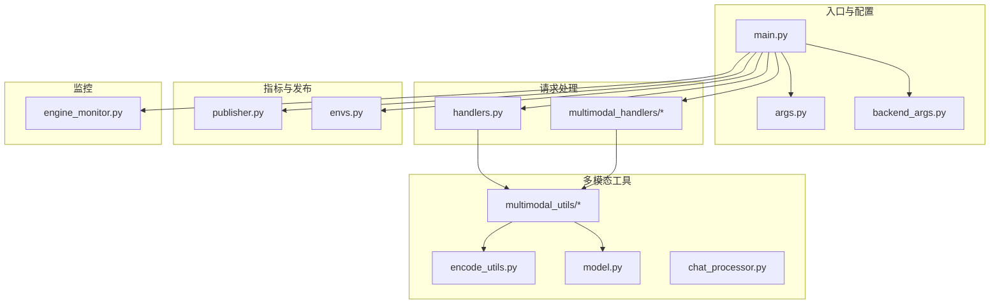
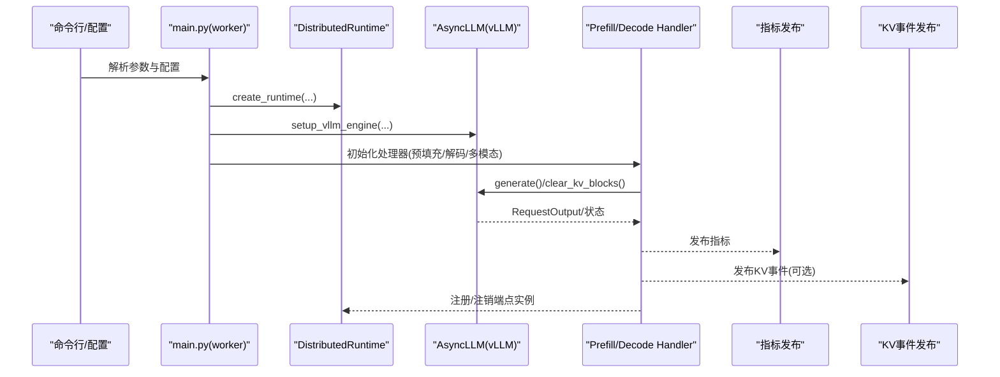
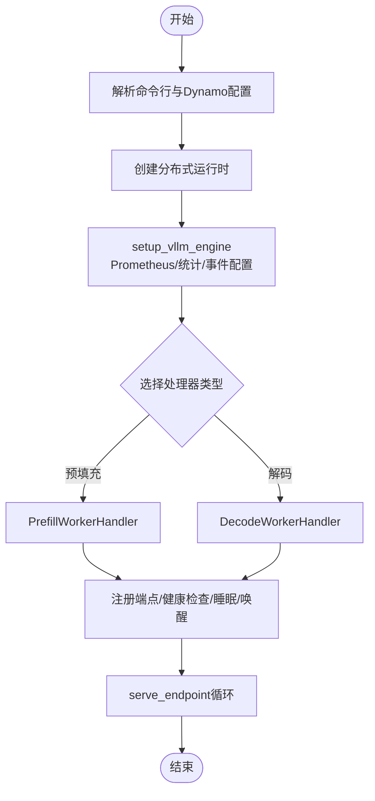
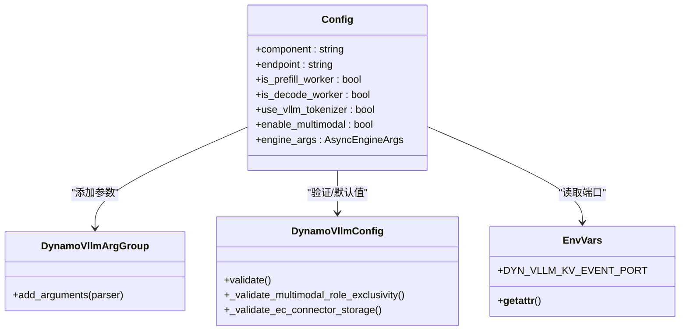
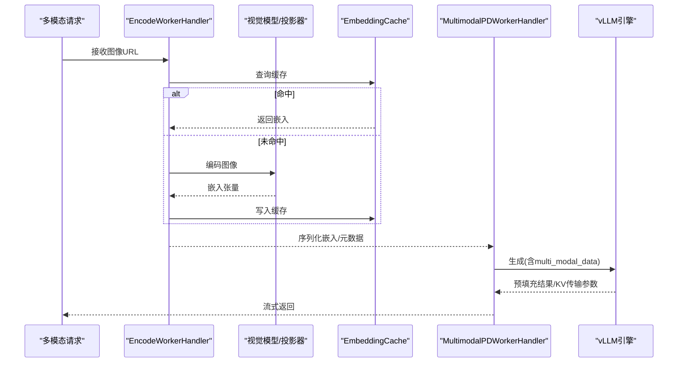
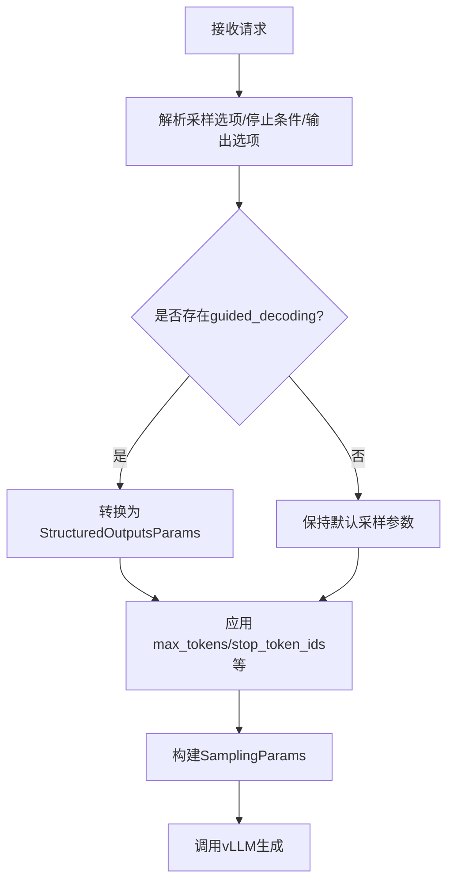
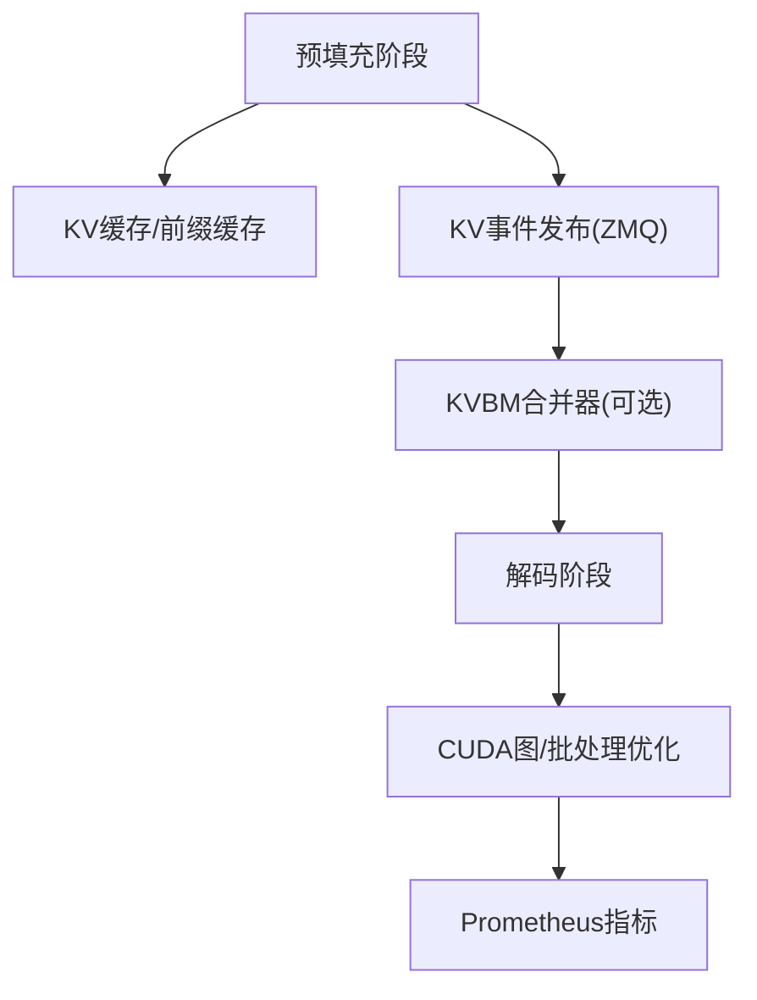
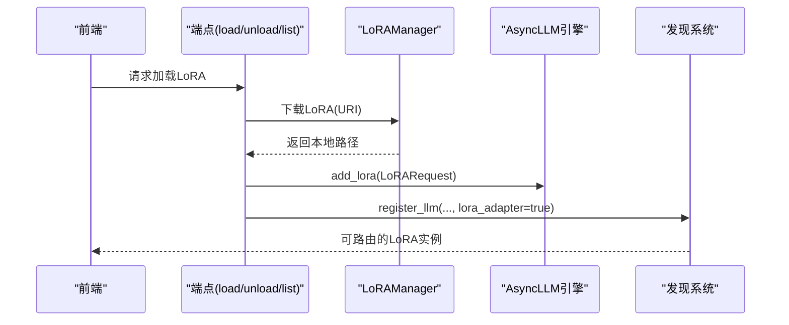
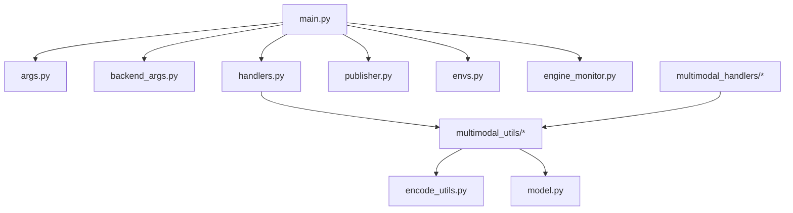

# vLLM引擎集成

<cite>
**本文档引用的文件**
- [components/src/dynamo/vllm/main.py](file://components/src/dynamo/vllm/main.py)
- [components/src/dynamo/vllm/args.py](file://components/src/dynamo/vllm/args.py)
- [components/src/dynamo/vllm/backend_args.py](file://components/src/dynamo/vllm/backend_args.py)
- [components/src/dynamo/vllm/handlers.py](file://components/src/dynamo/vllm/handlers.py)
- [components/src/dynamo/vllm/engine_monitor.py](file://components/src/dynamo/vllm/engine_monitor.py)
- [components/src/dynamo/vllm/publisher.py](file://components/src/dynamo/vllm/publisher.py)
- [components/src/dynamo/vllm/envs.py](file://components/src/dynamo/vllm/envs.py)
- [components/src/dynamo/vllm/multimodal_utils/encode_utils.py](file://components/src/dynamo/vllm/multimodal_utils/encode_utils.py)
- [components/src/dynamo/vllm/multimodal_handlers/encode_worker_handler.py](file://components/src/dynamo/vllm/multimodal_handlers/encode_worker_handler.py)
- [components/src/dynamo/vllm/multimodal_handlers/worker_handler.py](file://components/src/dynamo/vllm/multimodal_handlers/worker_handler.py)
- [components/src/dynamo/vllm/multimodal_utils/chat_processor.py](file://components/src/dynamo/vllm/multimodal_utils/chat_processor.py)
- [components/src/dynamo/vllm/multimodal_utils/model.py](file://components/src/dynamo/vllm/multimodal_utils/model.py)
</cite>

## 目录
1. [简介](#简介)
2. [项目结构](#项目结构)
3. [核心组件](#核心组件)
4. [架构总览](#架构总览)
5. [详细组件分析](#详细组件分析)
6. [依赖关系分析](#依赖关系分析)
7. [性能考虑](#性能考虑)
8. [故障排查指南](#故障排查指南)
9. [结论](#结论)
10. [附录](#附录)

## 简介
本文件系统性阐述基于 vLLM 的后端引擎集成方案，覆盖架构设计、核心特性与实现细节。重点包括：
- 预填充工作器与解码工作器的初始化流程、配置参数映射与运行时管理
- 多模态处理能力：图像编码、视频处理与音频支持现状
- 工具调用、推理解析器与动态推理功能
- 性能优化策略：CUDA 图、前缀缓存与 KV 事件传播
- LoRA 微调支持、模型加载与热更新机制
- 实际配置示例、部署脚本与故障排查指南

## 项目结构
vLLM 引擎集成位于 components/src/dynamo/vllm 目录下，采用“按功能域分层”的组织方式：
- 入口与运行时：main.py、args.py、backend_args.py
- 请求处理与工作器：handlers.py、multimodal_handlers/*.py
- 多模态工具链：multimodal_utils/*
- 指标与发布：publisher.py、envs.py
- 引擎监控：engine_monitor.py

**图表来源**
- [components/src/dynamo/vllm/main.py](file://components/src/dynamo/vllm/main.py#L1-L120)
- [components/src/dynamo/vllm/args.py](file://components/src/dynamo/vllm/args.py#L1-L120)
- [components/src/dynamo/vllm/backend_args.py](file://components/src/dynamo/vllm/backend_args.py#L1-L120)
- [components/src/dynamo/vllm/handlers.py](file://components/src/dynamo/vllm/handlers.py#L1-L120)
- [components/src/dynamo/vllm/multimodal_handlers/encode_worker_handler.py](file://components/src/dynamo/vllm/multimodal_handlers/encode_worker_handler.py#L1-L120)
- [components/src/dynamo/vllm/multimodal_utils/encode_utils.py](file://components/src/dynamo/vllm/multimodal_utils/encode_utils.py#L1-L120)
- [components/src/dynamo/vllm/multimodal_utils/chat_processor.py](file://components/src/dynamo/vllm/multimodal_utils/chat_processor.py#L1-L120)
- [components/src/dynamo/vllm/publisher.py](file://components/src/dynamo/vllm/publisher.py#L1-L120)
- [components/src/dynamo/vllm/envs.py](file://components/src/dynamo/vllm/envs.py#L1-L85)
- [components/src/dynamo/vllm/engine_monitor.py](file://components/src/dynamo/vllm/engine_monitor.py#L1-L120)

**章节来源**
- [components/src/dynamo/vllm/main.py](file://components/src/dynamo/vllm/main.py#L1-L120)
- [components/src/dynamo/vllm/args.py](file://components/src/dynamo/vllm/args.py#L1-L120)
- [components/src/dynamo/vllm/backend_args.py](file://components/src/dynamo/vllm/backend_args.py#L1-L120)

## 核心组件
- 运行时与入口：负责解析命令行参数、创建分布式运行时、初始化 vLLM 引擎、注册端点与健康检查、设置指标收集与 KV 事件发布。
- 请求处理器：封装生成与清理 KV 块逻辑，支持采样参数构建、停止条件与输出选项处理、LoRA 动态加载/卸载、前端解码支持等。
- 多模态工作器：支持编码、预填充/解码（PD）与解码三类工作器，处理图像/视频/音频（当前以图像为主），并进行嵌入传输与缓存。
- 多模态工具：图像加载、编码器组件提取、模型类型识别、聊天/补全预处理与流式响应。
- 指标与发布：独立 Prometheus 注册表、统计日志器工厂、GPU 缓存使用率与块数发布。
- 引擎监控：持续健康检查，异常时触发引擎关闭与运行时关停。

**章节来源**
- [components/src/dynamo/vllm/main.py](file://components/src/dynamo/vllm/main.py#L360-L533)
- [components/src/dynamo/vllm/handlers.py](file://components/src/dynamo/vllm/handlers.py#L233-L425)
- [components/src/dynamo/vllm/multimodal_handlers/encode_worker_handler.py](file://components/src/dynamo/vllm/multimodal_handlers/encode_worker_handler.py#L63-L120)
- [components/src/dynamo/vllm/multimodal_handlers/worker_handler.py](file://components/src/dynamo/vllm/multimodal_handlers/worker_handler.py#L27-L120)
- [components/src/dynamo/vllm/multimodal_utils/chat_processor.py](file://components/src/dynamo/vllm/multimodal_utils/chat_processor.py#L136-L220)
- [components/src/dynamo/vllm/publisher.py](file://components/src/dynamo/vllm/publisher.py#L40-L148)
- [components/src/dynamo/vllm/engine_monitor.py](file://components/src/dynamo/vllm/engine_monitor.py#L23-L120)

## 架构总览
vLLM 引擎集成通过统一的运行时框架，将 vLLM 的异步引擎与 Dynamo 的分布式调度、发现与指标体系整合。整体流程如下：

**图表来源**
- [components/src/dynamo/vllm/main.py](file://components/src/dynamo/vllm/main.py#L99-L191)
- [components/src/dynamo/vllm/main.py](file://components/src/dynamo/vllm/main.py#L361-L457)
- [components/src/dynamo/vllm/handlers.py](file://components/src/dynamo/vllm/handlers.py#L233-L351)
- [components/src/dynamo/vllm/publisher.py](file://components/src/dynamo/vllm/publisher.py#L40-L101)

## 详细组件分析

### 预填充工作器与解码工作器初始化
- 预填充工作器（is_prefill_worker）：仅提供预填充能力，注册 generate 与 clear_kv_blocks 端点；支持睡眠/唤醒路由；可启用前端解码。
- 解码工作器（默认）：提供完整生成能力，注册 LoRA 管理端点（load/unload/list），支持睡眠/唤醒；可启用前端解码。
- 初始化流程：
  - 解析配置 → 创建运行时 → 设置 vLLM 引擎（含 Prometheus、统计日志器、KV 事件配置）→ 选择处理器类型 → 注册端点与健康检查 → 启动服务循环。

**图表来源**
- [components/src/dynamo/vllm/main.py](file://components/src/dynamo/vllm/main.py#L535-L674)
- [components/src/dynamo/vllm/main.py](file://components/src/dynamo/vllm/main.py#L676-L800)
- [components/src/dynamo/vllm/handlers.py](file://components/src/dynamo/vllm/handlers.py#L233-L351)

**章节来源**
- [components/src/dynamo/vllm/main.py](file://components/src/dynamo/vllm/main.py#L535-L800)
- [components/src/dynamo/vllm/handlers.py](file://components/src/dynamo/vllm/handlers.py#L233-L351)

### 配置参数映射与环境变量
- 命令行参数：通过 DynamoVllmArgGroup/DynamoVllmConfig 定义 vLLM 特定标志，如是否启用预填充/解码、是否使用 vLLM 分词器、多模态开关、前端解码、EC 连接器等。
- vLLM 引擎参数：通过 AsyncEngineArgs 传递至 vLLM，并在运行时进行交叉校验与默认值注入（如 block_size、runner、kv_events_config、kv_transfer_config）。
- 环境变量：KV 事件端口等通过 envs 模块集中管理与校验。

**图表来源**
- [components/src/dynamo/vllm/args.py](file://components/src/dynamo/vllm/args.py#L34-L127)
- [components/src/dynamo/vllm/backend_args.py](file://components/src/dynamo/vllm/backend_args.py#L15-L289)
- [components/src/dynamo/vllm/envs.py](file://components/src/dynamo/vllm/envs.py#L25-L85)

**章节来源**
- [components/src/dynamo/vllm/args.py](file://components/src/dynamo/vllm/args.py#L76-L127)
- [components/src/dynamo/vllm/backend_args.py](file://components/src/dynamo/vllm/backend_args.py#L194-L289)
- [components/src/dynamo/vllm/envs.py](file://components/src/dynamo/vllm/envs.py#L25-L85)

### 多模态处理能力
- 图像编码：支持 LLaVA 与 Qwen VL 系列模型，自动提取视觉编码器与投影器，生成嵌入并缓存；支持本地或 RDMA 传输。
- 视频处理：当前以图像为主，视频路径预留（LLaVA Next Video）。
- 音频支持：当前未实现，后续可扩展为多模态输入之一。
- 嵌入传输：通过 NIXL Connector 或本地 safetensors 文件传输，结合 KV 事件与前缀缓存提升复用效率。

**图表来源**
- [components/src/dynamo/vllm/multimodal_handlers/encode_worker_handler.py](file://components/src/dynamo/vllm/multimodal_handlers/encode_worker_handler.py#L105-L282)
- [components/src/dynamo/vllm/multimodal_handlers/worker_handler.py](file://components/src/dynamo/vllm/multimodal_handlers/worker_handler.py#L173-L315)
- [components/src/dynamo/vllm/multimodal_utils/encode_utils.py](file://components/src/dynamo/vllm/multimodal_utils/encode_utils.py#L88-L133)
- [components/src/dynamo/vllm/multimodal_utils/model.py](file://components/src/dynamo/vllm/multimodal_utils/model.py#L139-L201)

**章节来源**
- [components/src/dynamo/vllm/multimodal_handlers/encode_worker_handler.py](file://components/src/dynamo/vllm/multimodal_handlers/encode_worker_handler.py#L63-L282)
- [components/src/dynamo/vllm/multimodal_handlers/worker_handler.py](file://components/src/dynamo/vllm/multimodal_handlers/worker_handler.py#L116-L315)
- [components/src/dynamo/vllm/multimodal_utils/encode_utils.py](file://components/src/dynamo/vllm/multimodal_utils/encode_utils.py#L165-L211)
- [components/src/dynamo/vllm/multimodal_utils/model.py](file://components/src/dynamo/vllm/multimodal_utils/model.py#L203-L305)

### 工具调用、推理解析器与动态推理
- 工具调用与动态推理：在注册解码模型时，将工具解析器与推理解析器注入到运行时配置，使前端能够将工具调用与结构化输出纳入统一处理管线。
- 推理解析器：OpenAI 风格请求映射到 vLLM 采样参数，支持温度、top_p、最大/最小生成长度、停用词等；同时兼容 Dynamo 内部预处理格式。
- 结构化输出：通过 guided_decoding 转换为 vLLM 的 StructuredOutputsParams，实现 JSON/正则/语法约束等。

**图表来源**
- [components/src/dynamo/vllm/handlers.py](file://components/src/dynamo/vllm/handlers.py#L78-L175)
- [components/src/dynamo/vllm/handlers.py](file://components/src/dynamo/vllm/handlers.py#L178-L230)
- [components/src/dynamo/vllm/multimodal_utils/chat_processor.py](file://components/src/dynamo/vllm/multimodal_utils/chat_processor.py#L136-L220)

**章节来源**
- [components/src/dynamo/vllm/handlers.py](file://components/src/dynamo/vllm/handlers.py#L78-L230)
- [components/src/dynamo/vllm/multimodal_utils/chat_processor.py](file://components/src/dynamo/vllm/multimodal_utils/chat_processor.py#L136-L220)

### 性能优化策略
- CUDA 图：通过 vLLM 的 CUDA Graph 支持减少内核启动开销，提升吞吐。
- 前缀缓存与 KV 事件传播：启用前缀缓存并在预填充阶段发布 KV 事件，供下游解码/传输使用；支持 KVBM 合并器端点以降低事件风暴。
- Prometheus 指标：独立注册表与多进程模式兼容，记录 GPU 缓存使用率、总块数、模型加载时间等。
- 睡眠/唤醒：支持按级别释放显存与权重，配合运行时发现机制实现弹性扩缩容。

**图表来源**
- [components/src/dynamo/vllm/main.py](file://components/src/dynamo/vllm/main.py#L283-L358)
- [components/src/dynamo/vllm/publisher.py](file://components/src/dynamo/vllm/publisher.py#L40-L101)
- [components/src/dynamo/vllm/envs.py](file://components/src/dynamo/vllm/envs.py#L25-L85)

**章节来源**
- [components/src/dynamo/vllm/main.py](file://components/src/dynamo/vllm/main.py#L283-L358)
- [components/src/dynamo/vllm/publisher.py](file://components/src/dynamo/vllm/publisher.py#L40-L101)
- [components/src/dynamo/vllm/envs.py](file://components/src/dynamo/vllm/envs.py#L25-L85)

### LoRA 微调支持、模型加载与热更新
- 动态加载/卸载：通过专用端点实现 LoRA 的并发安全加载与卸载，支持 URI 下载与注册到发现系统，便于前端路由。
- 热更新：在不重启引擎的前提下更新 LoRA，结合跟踪字典与锁避免竞态。
- 环境变量：启用运行时 LoRA 更新与超时控制。

**图表来源**
- [components/src/dynamo/vllm/handlers.py](file://components/src/dynamo/vllm/handlers.py#L440-L782)

**章节来源**
- [components/src/dynamo/vllm/handlers.py](file://components/src/dynamo/vllm/handlers.py#L440-L782)

## 依赖关系分析
- 组件耦合：main.py 作为编排中心，依赖 args/backend_args 提供配置，依赖 handlers 提供工作器，依赖 publisher/envs 提供指标与环境变量，依赖 engine_monitor 提供健康保障。
- 多模态模块：encode_worker_handler 与 worker_handler 依赖 multimodal_utils 中的图像加载、编码器组件与模型类型判断。
- vLLM 集成：通过 AsyncLLM 与 vLLM 配置对象交互，使用 KVEventsConfig/KVTransferConfig 与外部系统对接。

**图表来源**
- [components/src/dynamo/vllm/main.py](file://components/src/dynamo/vllm/main.py#L1-L120)
- [components/src/dynamo/vllm/handlers.py](file://components/src/dynamo/vllm/handlers.py#L1-L120)
- [components/src/dynamo/vllm/multimodal_utils/encode_utils.py](file://components/src/dynamo/vllm/multimodal_utils/encode_utils.py#L1-L120)
- [components/src/dynamo/vllm/multimodal_utils/model.py](file://components/src/dynamo/vllm/multimodal_utils/model.py#L1-L120)
- [components/src/dynamo/vllm/multimodal_handlers/encode_worker_handler.py](file://components/src/dynamo/vllm/multimodal_handlers/encode_worker_handler.py#L1-L120)
- [components/src/dynamo/vllm/multimodal_handlers/worker_handler.py](file://components/src/dynamo/vllm/multimodal_handlers/worker_handler.py#L1-L120)

**章节来源**
- [components/src/dynamo/vllm/main.py](file://components/src/dynamo/vllm/main.py#L1-L120)
- [components/src/dynamo/vllm/handlers.py](file://components/src/dynamo/vllm/handlers.py#L1-L120)

## 性能考虑
- 批处理与流水线：预填充阶段尽量短路生成（max_tokens=1），将解码迁移到解码工作器，减少主引擎负担。
- KV 事件与前缀缓存：在预填充阶段建立 KV 块布局，解码阶段通过事件/传输参数复用，显著降低重复计算。
- 指标驱动：通过 Prometheus 指标观测 GPU 缓存使用率与块数，指导资源分配与扩缩容。
- 睡眠/唤醒：在低负载时释放显存与权重，提高资源利用率与冷启动速度。

[本节为通用性能建议，无需特定文件引用]

## 故障排查指南
- 引擎崩溃：engine_monitor 持续健康检查，检测到 EngineDeadError 时触发引擎与运行时关停，防止僵尸进程。
- 端点不可用：检查非主并行节点（data_parallel_rank>=1）会跳过端点服务，确认 rank 配置。
- KV 事件异常：确认 enable_prefix_caching 与 kv_events_config 开关一致，必要时禁用或调整端口。
- 指标缺失：检查 PROMETHEUS_MULTIPROC_DIR 设置与多进程收集器冲突，必要时使用独立注册表。
- LoRA 加载失败：检查 URI 可达性、下载权限与引擎 add_lora 成功性；若注册失败会回滚并返回错误。

**章节来源**
- [components/src/dynamo/vllm/engine_monitor.py](file://components/src/dynamo/vllm/engine_monitor.py#L74-L120)
- [components/src/dynamo/vllm/main.py](file://components/src/dynamo/vllm/main.py#L73-L84)
- [components/src/dynamo/vllm/main.py](file://components/src/dynamo/vllm/main.py#L283-L358)
- [components/src/dynamo/vllm/publisher.py](file://components/src/dynamo/vllm/publisher.py#L193-L200)
- [components/src/dynamo/vllm/handlers.py](file://components/src/dynamo/vllm/handlers.py#L440-L782)

## 结论
vLLM 引擎集成通过清晰的分层架构与完善的运行时管理，实现了高性能、可观测与可扩展的多模态推理服务。预填充与解码分离、LoRA 动态管理、KV 事件传播与前缀缓存、CUDA 图优化等策略共同提升了吞吐与资源利用率。未来可在视频/音频多模态支持、KVBM 合并器与更细粒度的指标维度上进一步增强。

[本节为总结性内容，无需特定文件引用]

## 附录
- 配置示例要点
  - 启用预填充工作器：--is-prefill-worker
  - 使用 vLLM 分词器：--use-vllm-tokenizer
  - 多模态开关：--enable-multimodal 与各角色标志（处理器/编码器/解码器/PD）
  - KV 事件端口：DYN_VLLM_KV_EVENT_PORT
  - LoRA 管理端点：load_lora、unload_lora、list_loras
- 部署脚本与清单
  - 参考 examples/backends/vllm 下的部署与启动脚本，结合 recipes 中的 recipe 示例进行快速部署与性能调优。

[本节为概览性内容，无需特定文件引用]