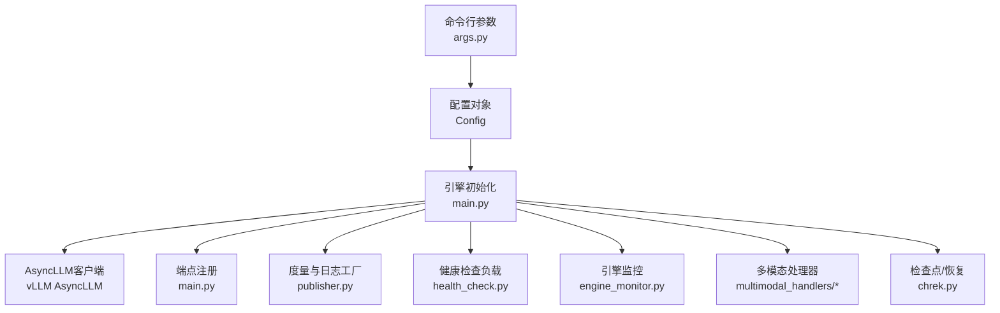
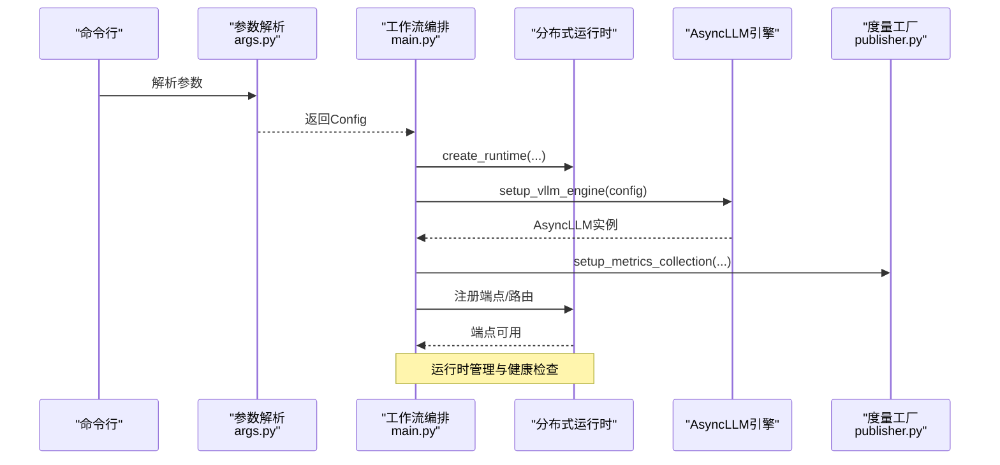
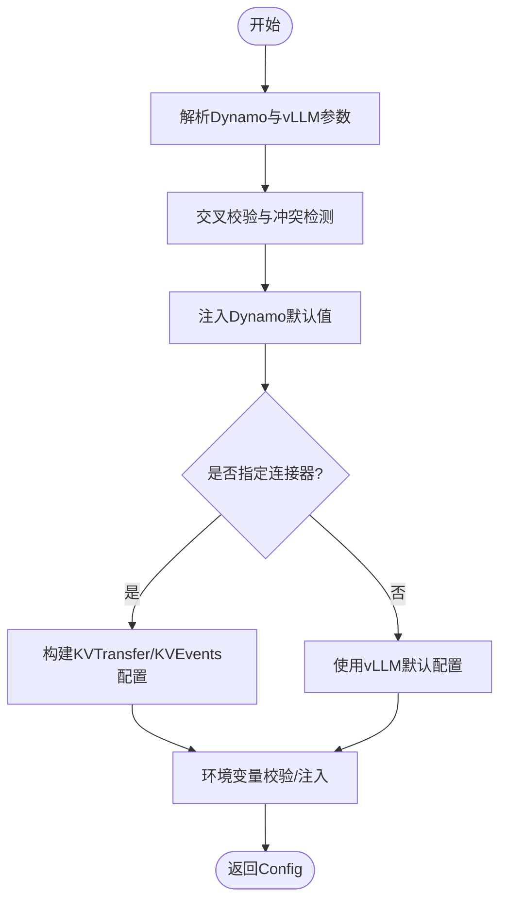
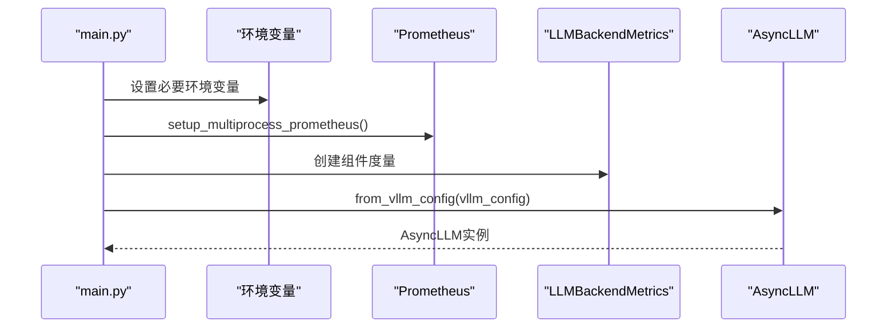
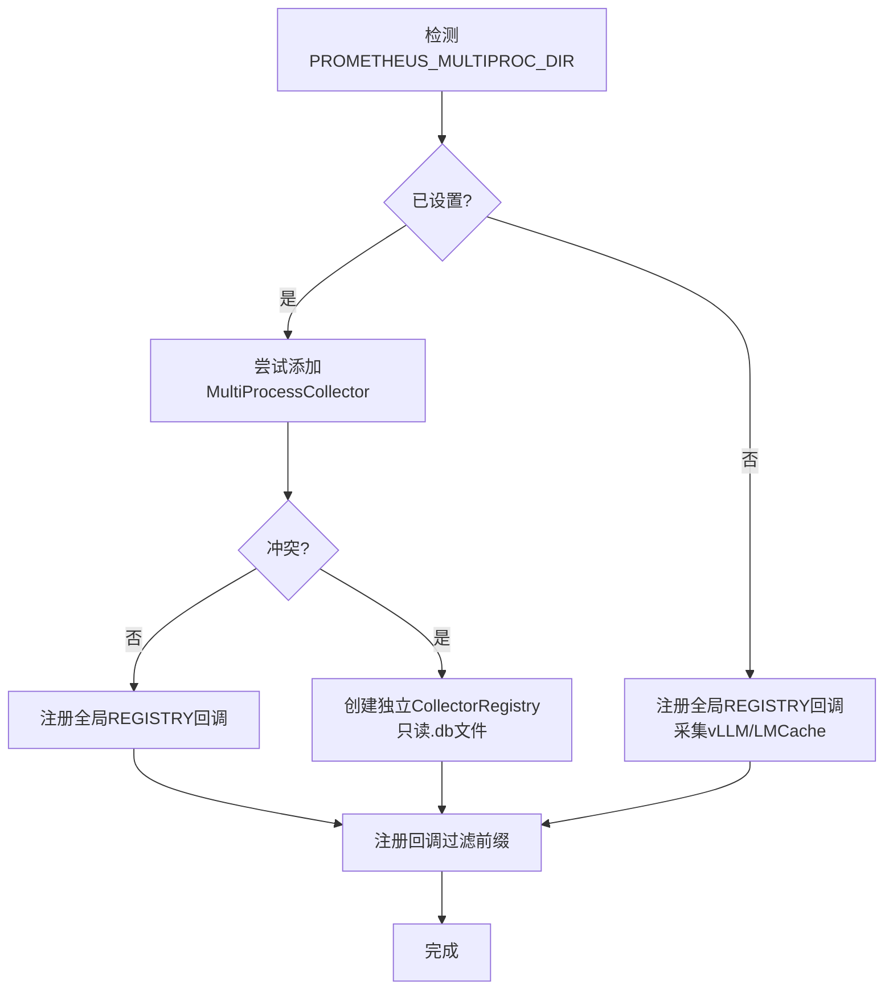
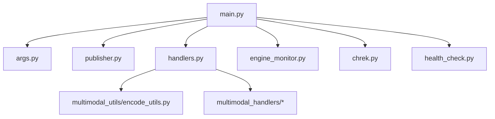

# vLLM核心引擎配置

<cite>
**本文档引用的文件**
- [main.py](file://components/src/dynamo/vllm/main.py)
- [args.py](file://components/src/dynamo/vllm/args.py)
- [envs.py](file://components/src/dynamo/vllm/envs.py)
- [publisher.py](file://components/src/dynamo/vllm/publisher.py)
- [handlers.py](file://components/src/dynamo/vllm/handlers.py)
- [engine_monitor.py](file://components/src/dynamo/vllm/engine_monitor.py)
- [chrek.py](file://components/src/dynamo/vllm/chrek.py)
- [backend_args.py](file://components/src/dynamo/vllm/backend_args.py)
- [multimodal_handlers/__init__.py](file://components/src/dynamo/vllm/multimodal_handlers/__init__.py)
- [multimodal_utils/encode_utils.py](file://components/src/dynamo/vllm/multimodal_utils/encode_utils.py)
- [health_check.py](file://components/src/dynamo/vllm/health_check.py)
</cite>

## 目录
1. [引言](#引言)
2. [项目结构](#项目结构)
3. [核心组件](#核心组件)
4. [架构总览](#架构总览)
5. [详细组件分析](#详细组件分析)
6. [依赖关系分析](#依赖关系分析)
7. [性能考虑](#性能考虑)
8. [故障排查指南](#故障排查指南)
9. [结论](#结论)
10. [附录](#附录)

## 引言
本文件面向需要在Dynamo平台中部署与运维vLLM引擎的工程师，系统性阐述vLLM核心引擎的配置与运行机制。内容覆盖引擎初始化流程、配置参数解析、AsyncLLM客户端创建、多进程模式下Prometheus指标采集、临时目录管理、环境变量配置、数据并行大小获取、统计日志工厂与组件度量注册、引擎启动完整流程、错误处理与资源清理策略，并提供可操作的配置示例与常见问题排查方法。

## 项目结构
vLLM后端位于components/src/dynamo/vllm目录，关键模块职责如下：
- main.py：引擎入口与工作流编排，负责参数解析、引擎创建、端点注册、健康检查与优雅停机。
- args.py：命令行与配置解析，桥接Dynamo与vLLM参数体系，校验与默认值注入。
- envs.py：集中化环境变量定义与校验（如KV事件端口）。
- publisher.py：组件度量注册与统计日志工厂，支持多进程Prometheus指标采集。
- handlers.py：请求处理器基类与具体实现（预填充/解码/多模态等），含LoRA动态加载、前端解码、NIXL集成等。
- engine_monitor.py：引擎健康监控，异常时触发关闭与进程退出。
- chrek.py：检查点/恢复（CRIU）生命周期集成，支持睡眠/唤醒与就地恢复。
- backend_args.py：Dynamo vLLM专用参数组，定义组件角色与功能开关。
- multimodal_handlers与multimodal_utils：多模态组件与编码工具。
- health_check.py：健康检查负载构造器，适配不同工作模式。

图表来源
- [args.py](file://components/src/dynamo/vllm/args.py#L76-L127)
- [main.py](file://components/src/dynamo/vllm/main.py#L99-L191)
- [publisher.py](file://components/src/dynamo/vllm/publisher.py#L103-L148)
- [engine_monitor.py](file://components/src/dynamo/vllm/engine_monitor.py#L23-L51)
- [chrek.py](file://components/src/dynamo/vllm/chrek.py#L142-L158)
- [multimodal_handlers/__init__.py](file://components/src/dynamo/vllm/multimodal_handlers/__init__.py#L1-L25)
- [health_check.py](file://components/src/dynamo/vllm/health_check.py#L83-L103)

章节来源
- [main.py](file://components/src/dynamo/vllm/main.py#L1-L120)
- [args.py](file://components/src/dynamo/vllm/args.py#L34-L127)

## 核心组件
- 配置解析器（Config）：统一承载Dynamo运行时参数与vLLM引擎参数，执行跨域校验与默认值注入。
- AsyncLLM客户端：从vLLM配置构建异步引擎客户端，支持统计日志、请求路由与睡眠/唤醒。
- 统计日志工厂（StatLoggerFactory）：按数据并行秩（dp_rank）创建度量发布器，注册到组件度量集合。
- 度量注册（setup_metrics_collection）：在单进程或多进程模式下分别注册回调，确保Prometheus指标完整采集。
- 健康检查负载（VllmHealthCheckPayload/VllmPrefillHealthCheckPayload）：为不同模式生成标准化健康检查请求。
- 引擎监控（VllmEngineMonitor）：周期性检查引擎健康，异常时触发关闭与进程退出。
- 多模态处理器：针对图像/视频等多模态输入的编码、预处理与解码路径。
- 检查点/恢复（CheckpointConfig）：在CRIU场景下控制模型睡眠、就地恢复与唤醒。

章节来源
- [args.py](file://components/src/dynamo/vllm/args.py#L34-L127)
- [main.py](file://components/src/dynamo/vllm/main.py#L361-L457)
- [publisher.py](file://components/src/dynamo/vllm/publisher.py#L103-L148)
- [engine_monitor.py](file://components/src/dynamo/vllm/engine_monitor.py#L23-L51)
- [health_check.py](file://components/src/dynamo/vllm/health_check.py#L83-L103)
- [chrek.py](file://components/src/dynamo/vllm/chrek.py#L39-L92)

## 架构总览
vLLM后端通过统一配置驱动，完成以下关键步骤：
- 参数解析与交叉验证，注入Dynamo默认值与连接器配置。
- 初始化分布式运行时，按角色选择初始化路径（预填充/解码/多模态/Omni等）。
- 创建AsyncLLM客户端，注册睡眠/唤醒路由与度量回调。
- 可选：KV事件发布器（前缀缓存）、统计日志工厂、健康检查负载。
- 启动端点服务，进入请求处理循环；异常时由引擎监控接管。

图表来源
- [args.py](file://components/src/dynamo/vllm/args.py#L76-L127)
- [main.py](file://components/src/dynamo/vllm/main.py#L146-L191)
- [publisher.py](file://components/src/dynamo/vllm/publisher.py#L193-L281)

## 详细组件分析

### 配置参数解析与映射
- 参数分组：Dynamo运行时参数组与vLLM参数组合并，vLLM引擎参数通过AsyncEngineArgs注入。
- 跨域校验：检查stream_interval兼容性、连接器互斥、模板文件存在性等。
- 默认值注入：prefix caching启用、block_size默认、KV事件端口、分布式执行后端等。
- 连接器映射：根据--connector自动构建KVTransferConfig或KVEventsConfig，支持LMCache/NIXL/KVBM/Pd组合。
- 环境变量：DYN_VLLM_KV_EVENT_PORT用于KV事件发布端口计算，主机侧通道（NIXL）自动推断。

图表来源
- [args.py](file://components/src/dynamo/vllm/args.py#L130-L302)
- [envs.py](file://components/src/dynamo/vllm/envs.py#L25-L64)

章节来源
- [args.py](file://components/src/dynamo/vllm/args.py#L76-L302)
- [envs.py](file://components/src/dynamo/vllm/envs.py#L25-L85)

### AsyncLLM引擎客户端创建与运行时管理
- Prometheus多进程：若未设置PROMETHEUS_MULTIPROC_DIR，则自动创建临时目录并注入环境变量，避免vLLM库bug导致的清理问题。
- 组件度量：创建独立CollectorRegistry，注册LLMBackendMetrics，供统计日志工厂使用。
- 环境变量：禁用UsageStats上报、强制spawn多进程模式、LoRA运行时更新开关与超时。
- 引擎配置：从AsyncEngineArgs构建VllmConfig，支持KVBM整合器端点、默认采样参数、统计日志工厂。
- 客户端初始化：AsyncLLM.from_vllm_config创建异步客户端，记录模型加载耗时。

图表来源
- [main.py](file://components/src/dynamo/vllm/main.py#L361-L457)
- [publisher.py](file://components/src/dynamo/vllm/publisher.py#L17-L20)

章节来源
- [main.py](file://components/src/dynamo/vllm/main.py#L361-L457)
- [publisher.py](file://components/src/dynamo/vllm/publisher.py#L17-L20)

### 多进程模式下的Prometheus指标收集
- 单进程：直接注册回调至全局REGISTRY，采集vLLM与LMCache指标。
- 多进程（PROMETHEUS_MULTIPROC_DIR已设置）：尝试添加MultiProcessCollector到REGISTRY；若出现重复时间序列冲突，则使用独立CollectorRegistry仅读取磁盘.db文件，同时保留全局REGISTRY的内存指标。
- 自动标签注入：为引擎指标注入命名空间、组件、端点、模型名等标签，与Rust侧自动标签对齐。

图表来源
- [main.py](file://components/src/dynamo/vllm/main.py#L193-L281)
- [publisher.py](file://components/src/dynamo/vllm/publisher.py#L17-L20)

章节来源
- [main.py](file://components/src/dynamo/vllm/main.py#L193-L281)
- [publisher.py](file://components/src/dynamo/vllm/publisher.py#L17-L20)

### 临时目录管理与环境变量配置
- 临时目录：在多进程Prometheus场景下，若未显式设置PROMETHEUS_MULTIPROC_DIR，自动创建以“vllm_prometheus_”为前缀的临时目录并注入环境变量，确保退出时正确清理。
- 环境变量：VLLM_NO_USAGE_STATS=1、VLLM_WORKER_MULTIPROC_METHOD=spawn、LoRA运行时更新相关变量等。
- KV事件端口：DYN_VLLM_KV_EVENT_PORT默认20080，按数据并行秩偏移分配各dp_rank的发布端口。

章节来源
- [main.py](file://components/src/dynamo/vllm/main.py#L361-L376)
- [envs.py](file://components/src/dynamo/vllm/envs.py#L25-L64)

### 数据并行大小获取与KV事件发布器
- 数据并行大小：从vllm_config.parallel_config.data_parallel_size获取，默认为1。
- 发布器创建：每个dp_rank创建一个ZMQ发布器，订阅本地或KVBM整合器输出端点，支持本地索引器开关。
- 解码工作器：跳过KV事件发布，避免重复发布。

章节来源
- [main.py](file://components/src/dynamo/vllm/main.py#L323-L358)
- [args.py](file://components/src/dynamo/vllm/args.py#L304-L343)

### 统计日志工厂与组件度量注册
- 工厂职责：按dp_rank创建DynamoStatLoggerPublisher，向WorkerMetricsPublisher发布GPU块与缓存使用率。
- 度量注册：在setup_vllm_engine中创建LLMBackendMetrics并注入工厂；在setup_metrics_collection中注册回调，确保vLLM与Dynamo组件指标均被采集。
- 初始化发布：首次发布空状态，设置总块数与缓存使用率为0，随后随调度器统计更新。

章节来源
- [publisher.py](file://components/src/dynamo/vllm/publisher.py#L103-L148)
- [main.py](file://components/src/dynamo/vllm/main.py#L193-L281)

### 引擎启动完整流程与端点注册
- 初始化路径：根据配置标志选择init/init_prefill/init_multimodal_worker等分支，每条路径最终调用register_vllm_model注册模型元数据。
- 睡眠/唤醒路由：所有工作器注册/engine/sleep与/engine/wake_up，支持按级别离线与按标签唤醒。
- 非主节点处理：当data_parallel_rank非0时，仅运行工作器不提供端点服务。
- 健康检查：为不同模式构造健康检查负载，端点启动时携带健康检查载荷。

章节来源
- [main.py](file://components/src/dynamo/vllm/main.py#L535-L674)
- [main.py](file://components/src/dynamo/vllm/main.py#L676-L800)
- [health_check.py](file://components/src/dynamo/vllm/health_check.py#L83-L103)

### 错误处理机制与资源清理策略
- 引擎监控：定期检查AsyncLLM健康，捕获EngineDeadError后触发引擎shutdown与运行时shutdown，并以非零退出码终止进程。
- 请求中止：在generate协程中监听上下文取消与shutdown_event，及时abort请求并抛出GeneratorExit以便上层清理。
- 清理资源：BaseWorkerHandler.cleanup遍历并清理临时目录列表，避免残留文件占用磁盘。
- 检查点/恢复：在checkpoint模式下，先sleep再等待信号或恢复标记，恢复后wake_up并继续运行。

章节来源
- [engine_monitor.py](file://components/src/dynamo/vllm/engine_monitor.py#L74-L120)
- [handlers.py](file://components/src/dynamo/vllm/handlers.py#L353-L418)
- [handlers.py](file://components/src/dynamo/vllm/handlers.py#L783-L790)
- [chrek.py](file://components/src/dynamo/vllm/chrek.py#L93-L140)

### 多模态与前端解码支持
- 多模态组件：支持处理器、编码器、解码器、统一编码+预填充+解码等角色，通过backend_args.py定义的标志位选择。
- 前端解码：可启用前端图像解码并通过NIXL RDMA传输，减少后端解码开销。
- 编码工具：提供ECTransferConfig构建、模型特定编码器选择与特征提取。

章节来源
- [backend_args.py](file://components/src/dynamo/vllm/backend_args.py#L15-L191)
- [multimodal_handlers/__init__.py](file://components/src/dynamo/vllm/multimodal_handlers/__init__.py#L1-L25)
- [multimodal_utils/encode_utils.py](file://components/src/dynamo/vllm/multimodal_utils/encode_utils.py#L165-L211)

## 依赖关系分析
- 组件耦合：main.py作为编排中心，依赖args.py（配置）、publisher.py（度量）、handlers.py（处理器）、engine_monitor.py（监控）、chrek.py（检查点）。
- 外部依赖：vLLM AsyncLLM、prometheus_client、分布式运行时、NIXL、KVBM整合器。
- 循环依赖：当前模块间无明显循环导入，职责清晰分离。

图表来源
- [main.py](file://components/src/dynamo/vllm/main.py#L58-L67)
- [args.py](file://components/src/dynamo/vllm/args.py#L58-L66)
- [publisher.py](file://components/src/dynamo/vllm/publisher.py#L13-L19)
- [handlers.py](file://components/src/dynamo/vllm/handlers.py#L24-L41)
- [engine_monitor.py](file://components/src/dynamo/vllm/engine_monitor.py#L10-L16)
- [chrek.py](file://components/src/dynamo/vllm/chrek.py#L22-L36)
- [health_check.py](file://components/src/dynamo/vllm/health_check.py#L13-L20)

章节来源
- [main.py](file://components/src/dynamo/vllm/main.py#L58-L67)
- [handlers.py](file://components/src/dynamo/vllm/handlers.py#L24-L41)

## 性能考虑
- 多进程Prometheus：在Kubernetes等多进程场景下，优先使用独立CollectorRegistry避免重复时间序列冲突，确保指标稳定。
- 睡眠/唤醒：通过/engine/sleep与/engine/wake_up降低峰值内存占用，结合检查点/恢复实现弹性扩缩容。
- 前端解码：在高并发图像/视频场景下启用前端解码可显著降低后端CPU/GPU压力。
- 分布式执行后端：NIXL场景下强制mp后端以规避GIL竞争，提升整体吞吐。

## 故障排查指南
- Prometheus指标异常
  - 症状：重复时间序列或指标缺失。
  - 排查：确认PROMETHEUS_MULTIPROC_DIR设置；若冲突，采用独立CollectorRegistry方案。
- 引擎崩溃
  - 症状：EngineDeadError，进程退出。
  - 排查：查看引擎监控日志，确认shutdown流程是否触发；检查GPU内存与模型加载状态。
- LoRA动态加载失败
  - 症状：URI-based加载报错或注册失败。
  - 排查：确认DYN_LORA_ENABLED=true且LoRAManager可用；检查下载路径与注册流程回滚逻辑。
- 健康检查失败
  - 症状：端点不可用或健康检查返回异常。
  - 排查：核对健康检查payload与use_vllm_tokenizer一致性；检查BOS token提取逻辑。
- 检查点/恢复
  - 症状：checkpoint未完成或恢复失败。
  - 排查：确认DYN_CHECKPOINT_*环境变量齐全；检查ready与signal文件状态；核对restore标记。

章节来源
- [engine_monitor.py](file://components/src/dynamo/vllm/engine_monitor.py#L74-L120)
- [handlers.py](file://components/src/dynamo/vllm/handlers.py#L440-L641)
- [health_check.py](file://components/src/dynamo/vllm/health_check.py#L22-L51)
- [chrek.py](file://components/src/dynamo/vllm/chrek.py#L142-L158)

## 结论
vLLM后端通过统一配置与运行时编排，实现了灵活的角色化部署、完善的指标采集与健康保障、以及在多模态与检查点场景下的稳健运行。遵循本文档的配置建议与排障流程，可在生产环境中获得更高的稳定性与可观测性。

## 附录

### 配置示例与参数说明
- 基本参数
  - --model：模型标识（HF名称或本地路径）
  - --served-model-name：对外暴露的服务名称
  - --tensor-parallel-size：张量并行大小
  - --distributed-executor-backend：分布式执行后端（默认由Dynamo注入）
- Dynamo vLLM专用参数
  - --is-prefill-worker：启用预填充工作器
  - --is-decode-worker：标记为解码工作器（不发布KV事件）
  - --use-vllm-tokenizer：使用vLLM分词器进行前后处理
  - --enable-multimodal：启用多模态处理
  - --frontend-decoding：启用前端解码（图像/视频）
  - --omni/--stage-configs-path：Omni多阶段管道配置
- 连接器与KV事件
  - --connector：连接器列表（lmcache/nixl/kvbm/null/none）
  - DYN_VLLM_KV_EVENT_PORT：KV事件发布端口（默认20080）
- 环境变量
  - PROMETHEUS_MULTIPROC_DIR：多进程Prometheus指标目录
  - VLLM_NO_USAGE_STATS：禁用内部UsageStats上报
  - VLLM_WORKER_MULTIPROC_METHOD：多进程启动方式
  - VLLM_NIXL_SIDE_CHANNEL_HOST：NIXL侧通道主机地址（自动推断）

章节来源
- [backend_args.py](file://components/src/dynamo/vllm/backend_args.py#L20-L191)
- [args.py](file://components/src/dynamo/vllm/args.py#L260-L302)
- [envs.py](file://components/src/dynamo/vllm/envs.py#L60-L85)