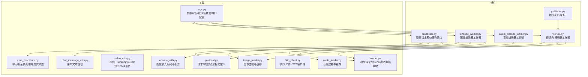
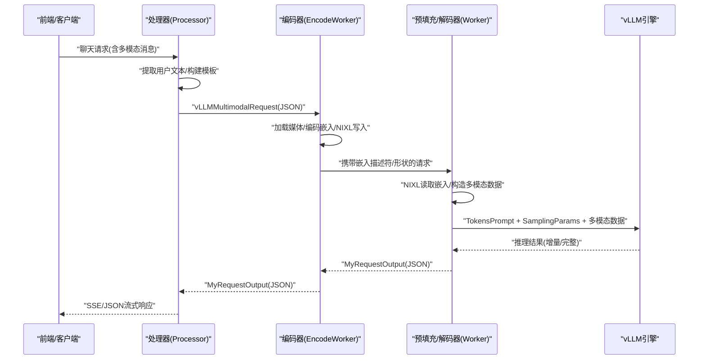
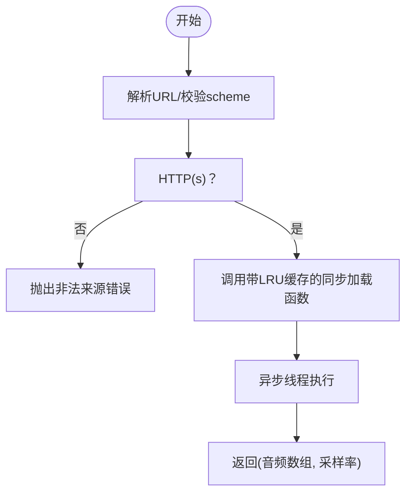
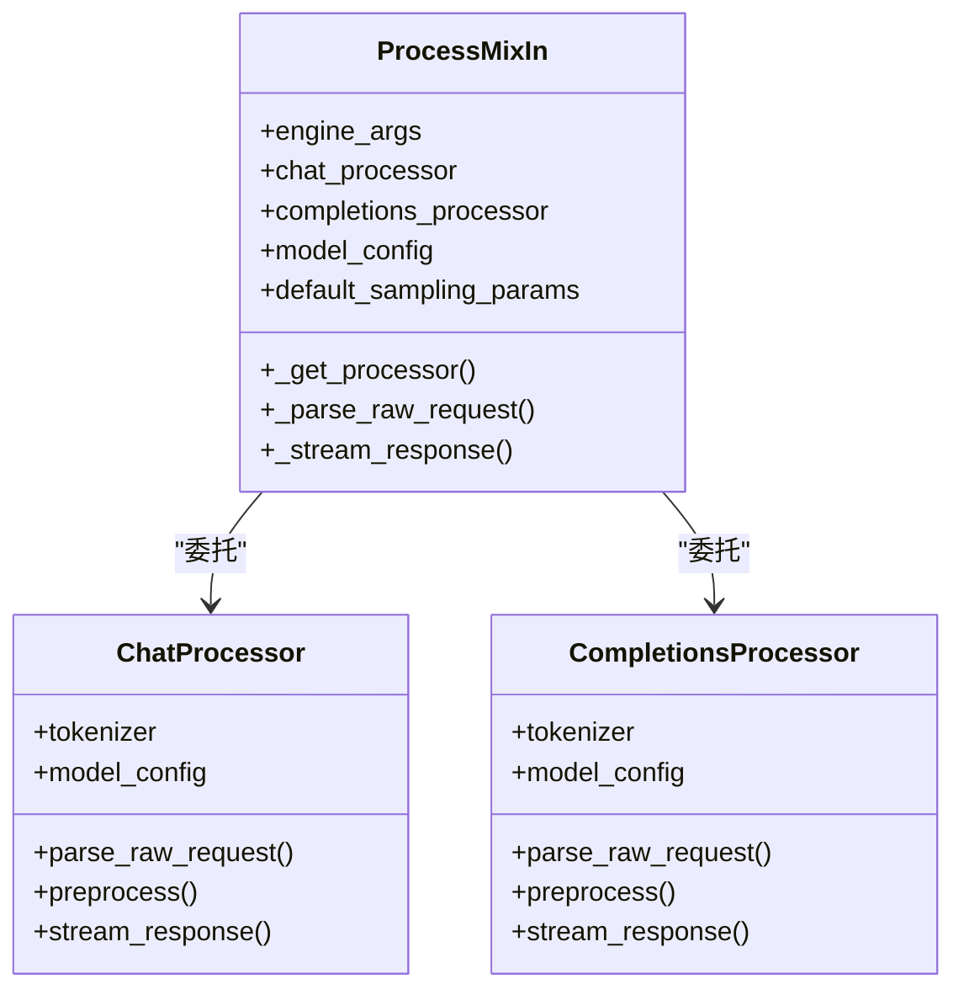
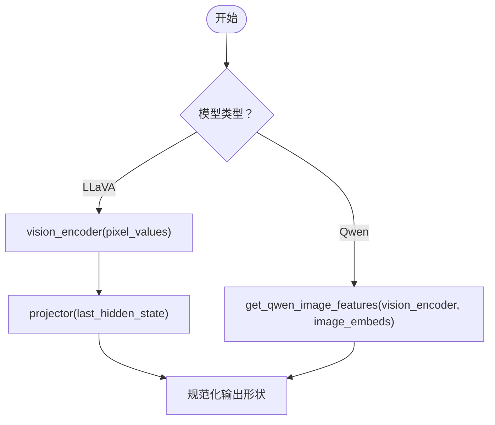
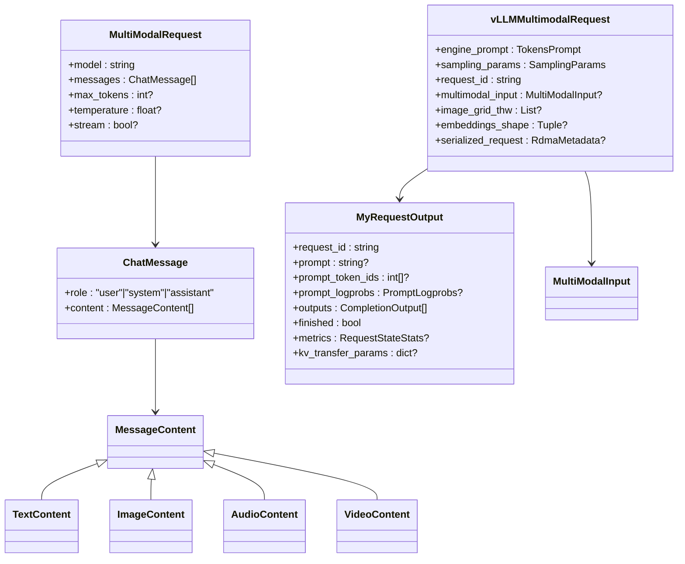
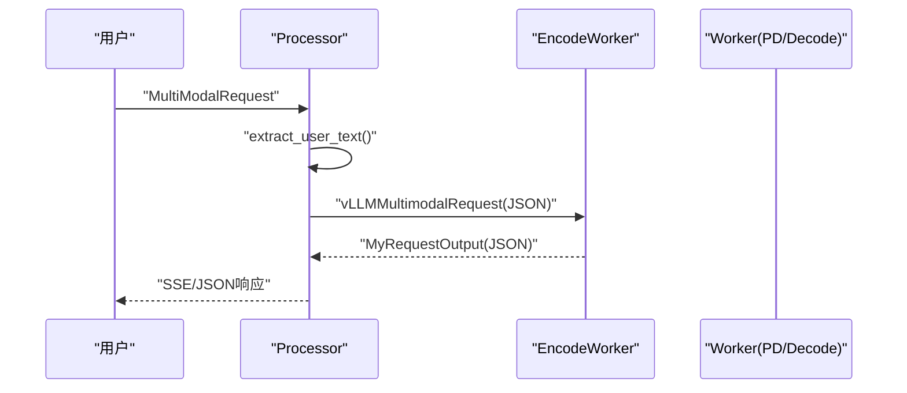
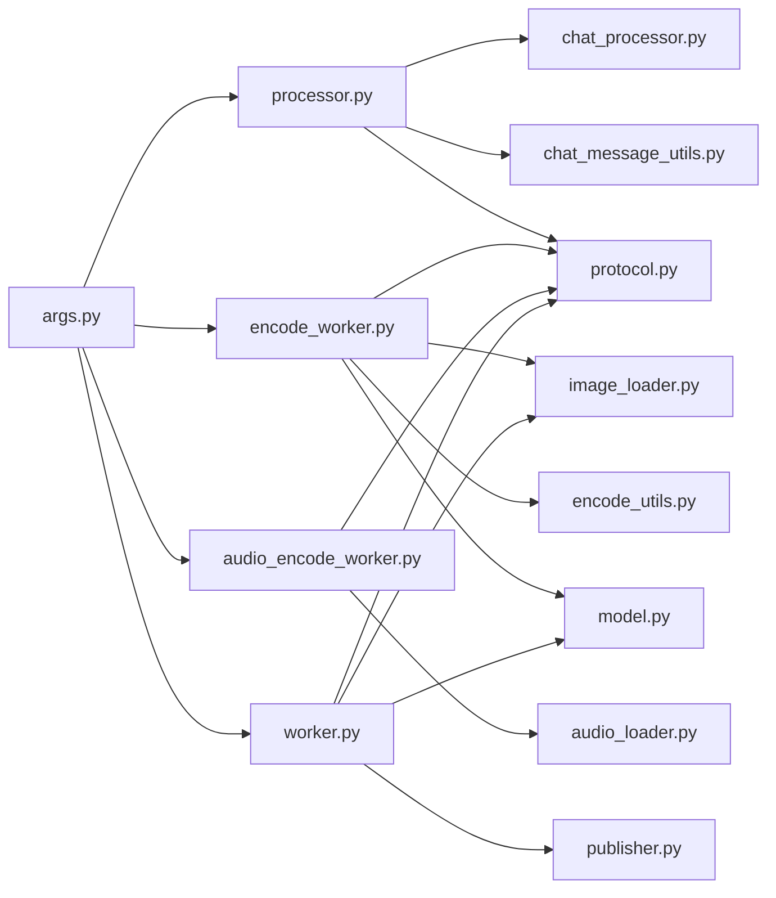

# 多模态处理

<cite>
**本文引用的文件**   
- [examples/multimodal/utils/image_loader.py](file://examples/multimodal/utils/image_loader.py)
- [examples/multimodal/utils/audio_loader.py](file://examples/multimodal/utils/audio_loader.py)
- [examples/multimodal/utils/video_utils.py](file://examples/multimodal/utils/video_utils.py)
- [examples/multimodal/utils/chat_processor.py](file://examples/multimodal/utils/chat_processor.py)
- [examples/multimodal/utils/chat_message_utils.py](file://examples/multimodal/utils/chat_message_utils.py)
- [examples/multimodal/utils/encode_utils.py](file://examples/multimodal/utils/encode_utils.py)
- [examples/multimodal/utils/http_client.py](file://examples/multimodal/utils/http_client.py)
- [examples/multimodal/utils/protocol.py](file://examples/multimodal/utils/protocol.py)
- [examples/multimodal/utils/model.py](file://examples/multimodal/utils/model.py)
- [examples/multimodal/utils/args.py](file://examples/multimodal/utils/args.py)
- [examples/multimodal/components/processor.py](file://examples/multimodal/components/processor.py)
- [examples/multimodal/components/encode_worker.py](file://examples/multimodal/components/encode_worker.py)
- [examples/multimodal/components/audio_encode_worker.py](file://examples/multimodal/components/audio_encode_worker.py)
- [examples/multimodal/components/worker.py](file://examples/multimodal/components/worker.py)
- [examples/multimodal/components/publisher.py](file://examples/multimodal/components/publisher.py)
</cite>

## 目录
1. [简介](#简介)
2. [项目结构](#项目结构)
3. [核心组件](#核心组件)
4. [架构总览](#架构总览)
5. [详细组件分析](#详细组件分析)
6. [依赖关系分析](#依赖关系分析)
7. [性能考虑](#性能考虑)
8. [故障排查指南](#故障排查指南)
9. [结论](#结论)
10. [附录](#附录)

## 简介
本技术文档围绕多模态处理能力，系统阐述图像编码、视频处理与音频支持的实现机制；详解聊天消息处理、编码器工具与HTTP客户端的功能特性；覆盖多模态模型的集成方式、预填充工作器（Prefill/Decode）的特殊处理与协议适配机制；解释图像加载器的实现原理、聊天处理器的消息格式与编码工具的使用方法；并提供多模态配置参数、性能优化策略与错误处理机制，以及实际示例、部署脚本与调试技巧。

## 项目结构
多模态示例位于 examples/multimodal 目录下，按“组件”和“工具”分层组织：
- components：运行时工作器（编码器、预填充/解码器、处理器）
- utils：通用工具（图像/音频/视频加载、聊天处理、编码工具、HTTP客户端、协议定义、模型封装、参数解析）



图表来源
- [examples/multimodal/components/processor.py](file://examples/multimodal/components/processor.py#L1-L348)
- [examples/multimodal/components/encode_worker.py](file://examples/multimodal/components/encode_worker.py#L1-L265)
- [examples/multimodal/components/audio_encode_worker.py](file://examples/multimodal/components/audio_encode_worker.py#L1-L308)
- [examples/multimodal/components/worker.py](file://examples/multimodal/components/worker.py#L1-L475)
- [examples/multimodal/components/publisher.py](file://examples/multimodal/components/publisher.py#L1-L125)
- [examples/multimodal/utils/image_loader.py](file://examples/multimodal/utils/image_loader.py#L1-L111)
- [examples/multimodal/utils/audio_loader.py](file://examples/multimodal/utils/audio_loader.py#L1-L81)
- [examples/multimodal/utils/video_utils.py](file://examples/multimodal/utils/video_utils.py#L1-L415)
- [examples/multimodal/utils/chat_processor.py](file://examples/multimodal/utils/chat_processor.py#L1-L348)
- [examples/multimodal/utils/chat_message_utils.py](file://examples/multimodal/utils/chat_message_utils.py#L1-L26)
- [examples/multimodal/utils/encode_utils.py](file://examples/multimodal/utils/encode_utils.py#L1-L133)
- [examples/multimodal/utils/http_client.py](file://examples/multimodal/utils/http_client.py#L1-L48)
- [examples/multimodal/utils/protocol.py](file://examples/multimodal/utils/protocol.py#L1-L191)
- [examples/multimodal/utils/model.py](file://examples/multimodal/utils/model.py#L1-L92)
- [examples/multimodal/utils/args.py](file://examples/multimodal/utils/args.py#L1-L185)

章节来源
- [examples/multimodal/utils/protocol.py](file://examples/multimodal/utils/protocol.py#L1-L191)
- [examples/multimodal/utils/args.py](file://examples/multimodal/utils/args.py#L1-L185)

## 核心组件
- 图像编码器工作器（encode_worker.py）：负责从URL加载图像、调用图像处理器与视觉编码器/投影器生成嵌入，并通过NIXL连接器进行RDMA传输，再转发给下游LLM工作器。
- 音频编码器工作器（audio_encode_worker.py）：负责从URL加载音频、调用音频处理器与音频编码器/投影器生成嵌入，同样通过NIXL连接器传输后交给下游LLM工作器。
- 预填充/解码器工作器（worker.py）：在聚合模式或拆分模式（Prefill/Decode）下执行推理，支持从嵌入描述符读取远程嵌入，或直接以图像对象作为多模态输入。
- 聊天处理器（chat_processor.py）：对OpenAI风格的聊天请求进行预处理、模板渲染、流式/非流式响应拼接与增量内容提取。
- 协议与消息格式（protocol.py）：定义聊天消息、多模态输入、请求/响应序列化结构，兼容vLLM的TokensPrompt/SamplingParams等类型。
- 编码工具（encode_utils.py）：根据模型类型选择合适的编码路径（如LLaVA的视觉塔+投影器，Qwen的网格信息传递）。
- 加载器与HTTP客户端（image_loader.py、audio_loader.py、video_utils.py、http_client.py）：统一的异步HTTP客户端、缓存策略、线程池解耦阻塞操作、数据URI解析与格式校验。
- 模型封装（model.py）：模型ID枚举、视觉模型加载、多模态数据构造（图像/视频/音频）。
- 参数解析（args.py）：统一解析vLLM参数、设置Dynamo默认值（前缀缓存、多模态嵌入、KV传输、事件端口等）。

章节来源
- [examples/multimodal/components/encode_worker.py](file://examples/multimodal/components/encode_worker.py#L47-L155)
- [examples/multimodal/components/audio_encode_worker.py](file://examples/multimodal/components/audio_encode_worker.py#L58-L198)
- [examples/multimodal/components/worker.py](file://examples/multimodal/components/worker.py#L227-L397)
- [examples/multimodal/utils/chat_processor.py](file://examples/multimodal/utils/chat_processor.py#L128-L282)
- [examples/multimodal/utils/encode_utils.py](file://examples/multimodal/utils/encode_utils.py#L58-L103)
- [examples/multimodal/utils/image_loader.py](file://examples/multimodal/utils/image_loader.py#L31-L111)
- [examples/multimodal/utils/audio_loader.py](file://examples/multimodal/utils/audio_loader.py#L30-L81)
- [examples/multimodal/utils/video_utils.py](file://examples/multimodal/utils/video_utils.py#L37-L153)
- [examples/multimodal/utils/http_client.py](file://examples/multimodal/utils/http_client.py#L27-L48)
- [examples/multimodal/utils/model.py](file://examples/multimodal/utils/model.py#L25-L92)
- [examples/multimodal/utils/args.py](file://examples/multimodal/utils/args.py#L148-L185)

## 架构总览
多模态处理采用“前端处理器 → 编码器工作器 → 预填充/解码器工作器 → LLM引擎”的流水线。编码器工作器将外部媒体（图像/音频）转换为嵌入并通过NIXL连接器传输到预填充/解码器工作器，后者将多模态数据注入vLLM引擎完成推理。



图表来源
- [examples/multimodal/components/processor.py](file://examples/multimodal/components/processor.py#L196-L263)
- [examples/multimodal/components/encode_worker.py](file://examples/multimodal/components/encode_worker.py#L73-L151)
- [examples/multimodal/components/worker.py](file://examples/multimodal/components/worker.py#L259-L397)
- [examples/multimodal/utils/protocol.py](file://examples/multimodal/utils/protocol.py#L157-L191)

## 详细组件分析

### 图像加载器（ImageLoader）
- 支持HTTP(S)/data URI/file三种来源；data URI要求image/开头且base64编码；HTTP(S)支持缓存（LRU队列）。
- 使用PIL异步线程加载，限制支持格式避免潜在解析风险；最终转为RGB。
- 返回的图像可被图像处理器（AutoImageProcessor）进一步处理。

```mermaid
flowchart TD
Start(["开始"]) --> Parse["解析URL/判断scheme"]
Parse --> Scheme{"scheme类型？"}
Scheme --> |data:image/*;base64,...| FromData["解析data URI<br/>base64解码"]
Scheme --> |http(s)| FromHTTP["HTTP客户端GET<br/>状态检查/内容检查"]
Scheme --> |file/无| FromFile["本地文件读取"]
FromData --> LoadPIL["异步线程加载PIL图像"]
FromHTTP --> LoadPIL
FromFile --> LoadPIL
LoadPIL --> Validate["格式校验/转换RGB"]
Validate --> Cache{"HTTP(S)？"}
Cache --> |是| Evict["满则淘汰最旧项"]
Evict --> Put["加入缓存队列/字典"]
Cache --> |否| Skip["跳过缓存"]
Put --> Done(["返回RGB图像"])
Skip --> Done
```

图表来源
- [examples/multimodal/utils/image_loader.py](file://examples/multimodal/utils/image_loader.py#L41-L111)

章节来源
- [examples/multimodal/utils/image_loader.py](file://examples/multimodal/utils/image_loader.py#L31-L111)

### 音频加载器（AudioLoader）
- 仅支持http(s)来源；内部使用同步函数配合functools.lru_cache缓存，通过asyncio.to_thread在事件循环外执行。
- 使用librosa加载音频并指定采样率；异常统一记录并抛出。



图表来源
- [examples/multimodal/utils/audio_loader.py](file://examples/multimodal/utils/audio_loader.py#L61-L81)

章节来源
- [examples/multimodal/utils/audio_loader.py](file://examples/multimodal/utils/audio_loader.py#L30-L81)

### 视频工具（视频下载/容器/采样/缩放/RDMA准备）
- load_video_content：支持data URI（需base64）、HTTP(S)下载、本地file路径；HTTP(S)内容缓存；异常分类记录。
- open_video_container：通过PyAV异步线程打开容器。
- get_video_metadata：提取总帧数与时长。
- read_video_pyav：按索引解码帧，空索引安全提示；失败时统计实际可解码帧数辅助定位。
- calculate_frame_sampling_indices：基于总帧数或时长计算采样索引，保证唯一性与边界安全。
- resize_video_frames：使用双线性插值将帧张量重采样到目标尺寸。
- prepare_tensor_for_rdma：将张量转CPU/uint8/连续内存，便于RDMA传输。

```mermaid
flowchart TD
VS(["开始"]) --> LVC["load_video_content"]
LVC --> SRC{"来源类型？"}
SRC --> |data| D1["校验类型/解码base64"]
SRC --> |http(s)| D2["HTTP下载/缓存"]
SRC --> |file/绝对路径| D3["读取本地文件"]
D1 --> OC["open_video_container(异步线程)"]
D2 --> OC
D3 --> OC
OC --> META["get_video_metadata"]
META --> IDX["calculate_frame_sampling_indices"]
IDX --> DEC["read_video_pyav(异步线程)"]
DEC --> RES["resize_video_frames"]
RES --> RDMA["prepare_tensor_for_rdma"]
RDMA --> VDone(["输出张量/元数据"])
```

图表来源
- [examples/multimodal/utils/video_utils.py](file://examples/multimodal/utils/video_utils.py#L37-L153)
- [examples/multimodal/utils/video_utils.py](file://examples/multimodal/utils/video_utils.py#L155-L187)
- [examples/multimodal/utils/video_utils.py](file://examples/multimodal/utils/video_utils.py#L189-L212)
- [examples/multimodal/utils/video_utils.py](file://examples/multimodal/utils/video_utils.py#L214-L287)
- [examples/multimodal/utils/video_utils.py](file://examples/multimodal/utils/video_utils.py#L289-L356)
- [examples/multimodal/utils/video_utils.py](file://examples/multimodal/utils/video_utils.py#L358-L388)
- [examples/multimodal/utils/video_utils.py](file://examples/multimodal/utils/video_utils.py#L390-L415)

章节来源
- [examples/multimodal/utils/video_utils.py](file://examples/multimodal/utils/video_utils.py#L37-L415)

### 聊天处理器（ChatProcessor/CompletionsProcessor）
- ChatProcessor：基于OpenAIServingChat进行预处理（对话消息渲染、模板选择、特殊标记处理），支持自定义模板或回退到tokenizer模板；流式/非流式响应中提取增量文本并拼接。
- CompletionsProcessor：兼容补全场景，使用渲染器生成prompt与嵌入。
- ProcessMixIn：统一解析原始请求、预处理、采样参数推导、流式/非流式响应包装。



图表来源
- [examples/multimodal/utils/chat_processor.py](file://examples/multimodal/utils/chat_processor.py#L57-L116)
- [examples/multimodal/utils/chat_processor.py](file://examples/multimodal/utils/chat_processor.py#L128-L189)
- [examples/multimodal/utils/chat_processor.py](file://examples/multimodal/utils/chat_processor.py#L284-L348)

章节来源
- [examples/multimodal/utils/chat_processor.py](file://examples/multimodal/utils/chat_processor.py#L128-L348)

### 编码工具（encode_utils）
- encode_image_embeddings：根据模型类型选择编码路径；LLaVA需要视觉塔+投影器；Qwen需要传入image_grid_thw。
- get_qwen_image_features：在Qwen路径下读取像素与网格信息并调用视觉编码器。
- get_encoder_components：按模型ID返回对应的视觉编码器与投影器。



图表来源
- [examples/multimodal/utils/encode_utils.py](file://examples/multimodal/utils/encode_utils.py#L58-L103)

章节来源
- [examples/multimodal/utils/encode_utils.py](file://examples/multimodal/utils/encode_utils.py#L26-L133)

### 协议与消息格式（protocol）
- 定义消息内容类型（文本/图像URL/音频URL/视频URL）、聊天消息结构、多模态请求体、vLLM生成请求、序列化输出等。
- 为SamplingParams与TokensPrompt提供兼容性修补，使其能被Pydantic正确序列化/反序列化。



图表来源
- [examples/multimodal/utils/protocol.py](file://examples/multimodal/utils/protocol.py#L142-L191)

章节来源
- [examples/multimodal/utils/protocol.py](file://examples/multimodal/utils/protocol.py#L34-L191)

### 模型封装（model）
- SupportedModels：枚举支持的多模态模型ID。
- load_vision_model：自动设备映射与半精度加载视觉模型。
- construct_mm_data：根据模型类型构造多模态数据（图像/视频/音频），并做形状与dtype校验。

章节来源
- [examples/multimodal/utils/model.py](file://examples/multimodal/utils/model.py#L25-L92)

### 参数解析（args）
- base_parse_args：解析vLLM参数，构造Config对象，解析命名空间/组件/端点。
- overwrite_args：设置Dynamo默认值（启用前缀缓存、多模态嵌入、KV传输、KV事件端口等）。
- configure_ports：从环境变量读取KV事件端口并确保侧通道主机可用。

章节来源
- [examples/multimodal/utils/args.py](file://examples/multimodal/utils/args.py#L50-L111)
- [examples/multimodal/utils/args.py](file://examples/multimodal/utils/args.py#L148-L185)

### 组件：处理器（Processor）
- 提取用户文本，替换模板占位符，构造OpenAI风格聊天请求，将多模态输入（图像/视频/音频URL）注入请求体。
- 将请求转发至编码器工作器，再由编码器工作器转发至预填充/解码器工作器，最后经聊天处理器进行流式/非流式响应拼接。



图表来源
- [examples/multimodal/components/processor.py](file://examples/multimodal/components/processor.py#L196-L263)

章节来源
- [examples/multimodal/components/processor.py](file://examples/multimodal/components/processor.py#L48-L348)

### 组件：图像编码器工作器（VllmEncodeWorker）
- 从URL加载图像，调用AutoImageProcessor与视觉编码器/投影器生成嵌入，创建NIXL描述符并通过可读句柄序列化元数据，随后轮询下游预填充/解码器工作器并回传结果。

章节来源
- [examples/multimodal/components/encode_worker.py](file://examples/multimodal/components/encode_worker.py#L47-L155)

### 组件：音频编码器工作器（VllmEncodeWorker）
- 从URL加载音频，调用AutoProcessor与Qwen2AudioForConditionalGeneration的音频塔与投影器生成嵌入，创建NIXL描述符并通过可读句柄序列化元数据，随后轮询下游预填充/解码器工作器并回传结果。

章节来源
- [examples/multimodal/components/audio_encode_worker.py](file://examples/multimodal/components/audio_encode_worker.py#L58-L198)

### 组件：预填充/解码器工作器（VllmPDWorker/VllmDecodeWorker）
- VllmPDWorker：接收来自编码器工作器的嵌入描述符或直接的图像对象，构造多模态数据并调用vLLM引擎执行预填充；在拆分模式下将KV转移参数传递给解码器工作器。
- VllmDecodeWorker：仅执行解码阶段，接收KV转移参数并返回结果。

章节来源
- [examples/multimodal/components/worker.py](file://examples/multimodal/components/worker.py#L194-L397)

### 组件：指标发布器工厂（StatLoggerFactory）
- 包装Dynamo的WorkerMetricsPublisher，匹配vLLM的StatLoggerBase接口，按数据并行rank发布GPU块占用等指标。

章节来源
- [examples/multimodal/components/publisher.py](file://examples/multimodal/components/publisher.py#L46-L125)

## 依赖关系分析
- 组件间依赖：Processor依赖ChatProcessor/CompletionsProcessor与消息提取工具；编码器工作器依赖图像/音频加载器与编码工具；预填充/解码器工作器依赖协议与模型封装。
- 外部依赖：vLLM（AsyncLLM、TokensPrompt、SamplingParams、OpenAI服务类）、Transformers（AutoTokenizer/AutoImageProcessor/AutoProcessor、模型加载）、PyAV（视频容器/解码）、httpx（HTTP客户端）、msgspec（SamplingParams序列化）、NIXL（RDMA连接器）。



图表来源
- [examples/multimodal/components/processor.py](file://examples/multimodal/components/processor.py#L27-L38)
- [examples/multimodal/components/encode_worker.py](file://examples/multimodal/components/encode_worker.py#L21-L27)
- [examples/multimodal/components/audio_encode_worker.py](file://examples/multimodal/components/audio_encode_worker.py#L34-L38)
- [examples/multimodal/components/worker.py](file://examples/multimodal/components/worker.py#L25-L42)
- [examples/multimodal/utils/args.py](file://examples/multimodal/utils/args.py#L50-L111)

## 性能考虑
- 异步I/O与线程池：图像/音频加载与视频解码均通过异步线程执行，避免阻塞事件循环。
- 缓存策略：图像与音频加载器内置LRU缓存；视频内容在HTTP(S)场景下缓存字节流，降低重复下载开销。
- 嵌入传输：使用NIXL描述符与RDMA准备（CPU/uint8/连续内存）提升跨节点传输效率。
- 采样与缩放：视频帧采样与双线性插值在GPU上进行，减少后续模型输入体积。
- vLLM默认：启用前缀缓存、多模态嵌入输入、KV传输与事件发布，降低KV路由与调度开销。

[本节为通用指导，无需列出具体文件来源]

## 故障排查指南
- 图像加载失败：检查URL scheme是否为http(s)/data/file；data URI必须以image/开头且base64编码；PIL格式限制为JPEG/PNG/WEBP。
- 音频加载失败：确认URL为http(s)；librosa加载异常会统一记录并抛出；采样率不一致可能导致维度不匹配。
- 视频加载失败：data URI需为video/或octet-stream且base64；HTTP下载失败会记录状态码与响应摘要；PyAV错误需检查容器格式与完整性。
- 请求格式错误：确保MultiModalRequest包含至少一种媒体URL；模板必须包含"<prompt>"占位符；聊天消息中的文本提取需存在用户文本。
- 编码器/解码器通信：检查NIXL连接器初始化与描述符元数据；确认serialized_request与embeddings_shape一致；拆分模式下KV转移参数传递正确。
- vLLM参数：未设置kv_port时无法启用前缀缓存；确保block_size合理；禁用usage_stats避免额外HTTP请求。

章节来源
- [examples/multimodal/utils/image_loader.py](file://examples/multimodal/utils/image_loader.py#L51-L111)
- [examples/multimodal/utils/audio_loader.py](file://examples/multimodal/utils/audio_loader.py#L69-L81)
- [examples/multimodal/utils/video_utils.py](file://examples/multimodal/utils/video_utils.py#L135-L153)
- [examples/multimodal/utils/chat_processor.py](file://examples/multimodal/utils/chat_processor.py#L208-L210)
- [examples/multimodal/utils/protocol.py](file://examples/multimodal/utils/protocol.py#L157-L165)
- [examples/multimodal/utils/args.py](file://examples/multimodal/utils/args.py#L148-L185)

## 结论
该多模态系统通过清晰的组件划分与协议适配，实现了图像、音频与视频的统一接入与高效推理。借助异步I/O、缓存与RDMA传输，系统在高并发场景下具备良好的吞吐与延迟表现。结合Dynamo的分布式运行时与vLLM的高性能引擎，可灵活扩展至多模型与多模态融合场景。

[本节为总结性内容，无需列出具体文件来源]

## 附录

### 多模态配置参数清单
- vLLM参数（通过命令行或环境变量）：模型路径、批大小、块大小、前缀缓存开关、KV传输配置、KV事件端口、日志开关等。
- Dynamo参数：命名空间、组件名、端点字符串、服务模型名、KV事件端口、侧通道主机等。
- 工作器参数：端点、下游端点、工作器类型（prefill/decode/encode_prefill）、是否启用拆分模式。

章节来源
- [examples/multimodal/utils/args.py](file://examples/multimodal/utils/args.py#L148-L185)
- [examples/multimodal/components/processor.py](file://examples/multimodal/components/processor.py#L53-L91)
- [examples/multimodal/components/encode_worker.py](file://examples/multimodal/components/encode_worker.py#L164-L189)
- [examples/multimodal/components/audio_encode_worker.py](file://examples/multimodal/components/audio_encode_worker.py#L208-L232)
- [examples/multimodal/components/worker.py](file://examples/multimodal/components/worker.py#L48-L103)

### 实际多模态示例
- 图像：在聊天消息中包含image_url，处理器提取用户文本并构造模板，编码器工作器加载图像并生成嵌入，预填充/解码器工作器执行推理。
- 音频：在聊天消息中包含audio_url，音频编码器工作器加载音频并生成嵌入，预填充/解码器工作器执行推理。
- 视频：在聊天消息中包含video_url，视频工具负责采样与缩放，编码器工作器生成嵌入，预填充/解码器工作器执行推理。

章节来源
- [examples/multimodal/components/processor.py](file://examples/multimodal/components/processor.py#L229-L251)
- [examples/multimodal/components/encode_worker.py](file://examples/multimodal/components/encode_worker.py#L96-L132)
- [examples/multimodal/components/audio_encode_worker.py](file://examples/multimodal/components/audio_encode_worker.py#L160-L183)
- [examples/multimodal/utils/video_utils.py](file://examples/multimodal/utils/video_utils.py#L289-L356)

### 部署脚本与调试技巧
- 启动顺序建议：先启动预填充/解码器工作器，再启动编码器工作器，最后启动处理器；确保下游端点可达。
- 环境变量：设置DYN_NAMESPACE、DYN_VLLM_KV_EVENT_PORT、VLLM_NIXL_SIDE_CHANNEL_HOST；必要时关闭usage_stats。
- 调试要点：开启详细日志，关注HTTP下载状态、PyAV容器打开错误、NIXL描述符元数据一致性、采样索引边界与实际可解码帧数。

章节来源
- [examples/multimodal/utils/args.py](file://examples/multimodal/utils/args.py#L113-L146)
- [examples/multimodal/components/worker.py](file://examples/multimodal/components/worker.py#L411-L475)
- [examples/multimodal/components/encode_worker.py](file://examples/multimodal/components/encode_worker.py#L203-L265)
- [examples/multimodal/components/audio_encode_worker.py](file://examples/multimodal/components/audio_encode_worker.py#L246-L308)