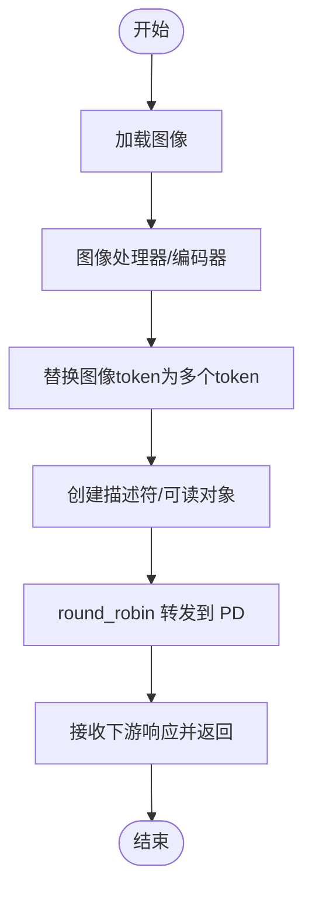
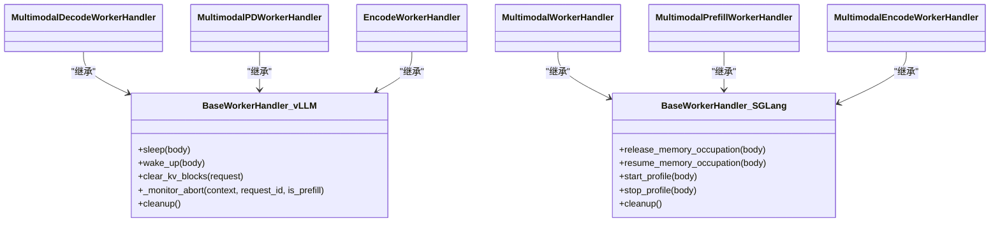

# 工作器处理器

<cite>
**本文引用的文件**
- [components/src/dynamo/vllm/multimodal_handlers/worker_handler.py](file://components/src/dynamo/vllm/multimodal_handlers/worker_handler.py)
- [components/src/dynamo/vllm/multimodal_handlers/encode_worker_handler.py](file://components/src/dynamo/vllm/multimodal_handlers/encode_worker_handler.py)
- [components/src/dynamo/sglang/request_handlers/multimodal/worker_handler.py](file://components/src/dynamo/sglang/request_handlers/multimodal/worker_handler.py)
- [components/src/dynamo/sglang/request_handlers/multimodal/encode_worker_handler.py](file://components/src/dynamo/sglang/request_handlers/multimodal/encode_worker_handler.py)
- [components/src/dynamo/vllm/handlers.py](file://components/src/dynamo/vllm/handlers.py)
- [components/src/dynamo/sglang/request_handlers/handler_base.py](file://components/src/dynamo/sglang/request_handlers/handler_base.py)
- [components/src/dynamo/vllm/multimodal_utils/__init__.py](file://components/src/dynamo/vllm/multimodal_utils/__init__.py)
- [components/src/dynamo/sglang/multimodal_utils/__init__.py](file://components/src/dynamo/sglang/multimodal_utils/__init__.py)
- [components/src/dynamo/vllm/main.py](file://components/src/dynamo/vllm/main.py)
- [docs/pages/fault-tolerance/graceful-shutdown.md](file://docs/pages/fault-tolerance/graceful-shutdown.md)
- [lib/runtime/src/pipeline/network.rs](file://lib/runtime/src/pipeline/network.rs)
</cite>

## 目录
1. [简介](#简介)
2. [项目结构](#项目结构)
3. [核心组件](#核心组件)
4. [架构总览](#架构总览)
5. [详细组件分析](#详细组件分析)
6. [依赖关系分析](#依赖关系分析)
7. [性能考量](#性能考量)
8. [故障排查指南](#故障排查指南)
9. [结论](#结论)
10. [附录](#附录)

## 简介
本文件面向“工作器处理器”的设计与实现，聚焦于多模态场景下的预填充工作器（Prefill）与解码工作器（Decode）的职责划分、请求处理流程与状态管理机制。文档覆盖以下内容：
- 预填充工作器与解码工作器在聚合与拆分两种模式下的行为差异
- 多模态处理器（如 MultimodalDecodeWorkerHandler、MultimodalPDWorkerHandler）的功能特性与交互方式
- 生命周期管理、优雅关闭与资源清理策略
- 工作器间通信协议、负载均衡策略与故障恢复机制
- 配置项、性能调优参数与监控指标
- 实际使用示例、部署配置与故障排查建议

## 项目结构
围绕多模态工作器处理器的关键目录与文件如下：
- vLLM 后端多模态工作器：Decode/PD/Encode 处理器与工具模块
- SGLang 后端多模态工作器：Decode/Prefill/Encode 处理器与工具模块
- 基类与通用能力：vLLM/SGLang 的 BaseWorkerHandler 及其扩展
- 初始化与服务注册：vLLM 启动脚本中的 Encode Worker 初始化流程
- 运行时与网络层：工作器度量与健康检查通知接口
- 故障容忍与优雅停机：文档化关闭流程与清理要点

**图表来源**
- [components/src/dynamo/vllm/multimodal_handlers/worker_handler.py](file://components/src/dynamo/vllm/multimodal_handlers/worker_handler.py#L27-L315)
- [components/src/dynamo/vllm/multimodal_handlers/encode_worker_handler.py](file://components/src/dynamo/vllm/multimodal_handlers/encode_worker_handler.py#L63-L427)
- [components/src/dynamo/sglang/request_handlers/multimodal/worker_handler.py](file://components/src/dynamo/sglang/request_handlers/multimodal/worker_handler.py#L242-L543)
- [components/src/dynamo/sglang/request_handlers/multimodal/encode_worker_handler.py](file://components/src/dynamo/sglang/request_handlers/multimodal/encode_worker_handler.py#L38-L193)
- [components/src/dynamo/vllm/handlers.py](file://components/src/dynamo/vllm/handlers.py#L233-L429)
- [components/src/dynamo/sglang/request_handlers/handler_base.py](file://components/src/dynamo/sglang/request_handlers/handler_base.py#L89-L279)
- [components/src/dynamo/vllm/multimodal_utils/__init__.py](file://components/src/dynamo/vllm/multimodal_utils/__init__.py#L1-L61)
- [components/src/dynamo/sglang/multimodal_utils/__init__.py](file://components/src/dynamo/sglang/multimodal_utils/__init__.py#L1-L19)
- [components/src/dynamo/vllm/main.py](file://components/src/dynamo/vllm/main.py#L985-L1026)
- [lib/runtime/src/pipeline/network.rs](file://lib/runtime/src/pipeline/network.rs#L342-L367)

**章节来源**
- [components/src/dynamo/vllm/multimodal_handlers/worker_handler.py](file://components/src/dynamo/vllm/multimodal_handlers/worker_handler.py#L1-L315)
- [components/src/dynamo/vllm/multimodal_handlers/encode_worker_handler.py](file://components/src/dynamo/vllm/multimodal_handlers/encode_worker_handler.py#L1-L427)
- [components/src/dynamo/sglang/request_handlers/multimodal/worker_handler.py](file://components/src/dynamo/sglang/request_handlers/multimodal/worker_handler.py#L1-L543)
- [components/src/dynamo/sglang/request_handlers/multimodal/encode_worker_handler.py](file://components/src/dynamo/sglang/request_handlers/multimodal/encode_worker_handler.py#L1-L193)
- [components/src/dynamo/vllm/handlers.py](file://components/src/dynamo/vllm/handlers.py#L233-L429)
- [components/src/dynamo/sglang/request_handlers/handler_base.py](file://components/src/dynamo/sglang/request_handlers/handler_base.py#L89-L279)
- [components/src/dynamo/vllm/multimodal_utils/__init__.py](file://components/src/dynamo/vllm/multimodal_utils/__init__.py#L1-L61)
- [components/src/dynamo/sglang/multimodal_utils/__init__.py](file://components/src/dynamo/sglang/multimodal_utils/__init__.py#L1-L19)
- [components/src/dynamo/vllm/main.py](file://components/src/dynamo/vllm/main.py#L985-L1026)
- [lib/runtime/src/pipeline/network.rs](file://lib/runtime/src/pipeline/network.rs#L342-L367)

## 核心组件
- vLLM 多模态工作器
  - MultimodalDecodeWorkerHandler：负责解码阶段的多模态推理，支持 Qwen VL 模型的位置编码对齐与 KV 传输参数传递。
  - MultimodalPDWorkerHandler：预填充分离或单段（预填+解码）模式，负责图像加载、嵌入累积、采样参数调整与远程解码协调。
  - EncodeWorkerHandler：图像编码与嵌入缓存，支持本地/远程传输元数据生成，供下游 PD/Decode 使用。
- SGLang 多模态工作器
  - MultimodalWorkerHandler：聚合/拆分模式下的统一生成入口，负责从预填工作器获取引导信息并在解码阶段流式输出。
  - MultimodalPrefillWorkerHandler：预填阶段生成引导信息，并消费结果以建立 KV 共享环境。
  - MultimodalEncodeWorkerHandler：基于 SGLang 引擎的图像编码与多模态数据格式转换，生成描述符并通过下游客户端转发。

这些组件均继承自各自后端的 BaseWorkerHandler，具备统一的生命周期管理、取消监控与资源清理能力。

**章节来源**
- [components/src/dynamo/vllm/multimodal_handlers/worker_handler.py](file://components/src/dynamo/vllm/multimodal_handlers/worker_handler.py#L27-L315)
- [components/src/dynamo/vllm/multimodal_handlers/encode_worker_handler.py](file://components/src/dynamo/vllm/multimodal_handlers/encode_worker_handler.py#L63-L427)
- [components/src/dynamo/sglang/request_handlers/multimodal/worker_handler.py](file://components/src/dynamo/sglang/request_handlers/multimodal/worker_handler.py#L242-L543)
- [components/src/dynamo/sglang/request_handlers/multimodal/encode_worker_handler.py](file://components/src/dynamo/sglang/request_handlers/multimodal/encode_worker_handler.py#L38-L193)
- [components/src/dynamo/vllm/handlers.py](file://components/src/dynamo/vllm/handlers.py#L233-L429)
- [components/src/dynamo/sglang/request_handlers/handler_base.py](file://components/src/dynamo/sglang/request_handlers/handler_base.py#L89-L279)

## 架构总览
下图展示了 vLLM 与 SGLang 两条路径中多模态工作器的交互关系与数据流：

**图表来源**
- [components/src/dynamo/vllm/multimodal_handlers/encode_worker_handler.py](file://components/src/dynamo/vllm/multimodal_handlers/encode_worker_handler.py#L63-L427)
- [components/src/dynamo/vllm/multimodal_handlers/worker_handler.py](file://components/src/dynamo/vllm/multimodal_handlers/worker_handler.py#L27-L315)
- [components/src/dynamo/sglang/request_handlers/multimodal/encode_worker_handler.py](file://components/src/dynamo/sglang/request_handlers/multimodal/encode_worker_handler.py#L38-L193)
- [components/src/dynamo/sglang/request_handlers/multimodal/worker_handler.py](file://components/src/dynamo/sglang/request_handlers/multimodal/worker_handler.py#L242-L543)
- [components/src/dynamo/vllm/multimodal_utils/__init__.py](file://components/src/dynamo/vllm/multimodal_utils/__init__.py#L1-L61)
- [components/src/dynamo/sglang/multimodal_utils/__init__.py](file://components/src/dynamo/sglang/multimodal_utils/__init__.py#L1-L19)

## 详细组件分析

### vLLM 多模态工作器

#### MultimodalDecodeWorkerHandler（解码）
- 职责
  - 解析 vLLMMultimodalRequest，按需构造多模态输入（如 Qwen VL 的 image_grid_thw 与占位符嵌入），调用引擎生成并逐条返回响应。
  - 透传 kv_transfer_params 以支持 KV 缓存迁移。
- 关键点
  - 对 Qwen VL 模型，保留原始未展开提示，通过 multi_modal_data 让引擎在解码时一致展开，确保块计数匹配。
  - 通过 Connector 异步初始化，保证 RDMA/内存共享通道可用。

**图表来源**
- [components/src/dynamo/vllm/multimodal_handlers/worker_handler.py](file://components/src/dynamo/vllm/multimodal_handlers/worker_handler.py#L61-L114)

**章节来源**
- [components/src/dynamo/vllm/multimodal_handlers/worker_handler.py](file://components/src/dynamo/vllm/multimodal_handlers/worker_handler.py#L27-L114)

#### MultimodalPDWorkerHandler（预填/解码）
- 职责
  - 图像加载与嵌入累积；根据模型类型设置嵌入精度与设备；为 Qwen VL 收集 image_grid_thw 与嵌入形状以便解码一致性。
  - 在启用拆分模式时，先进行一次极短 max_tokens 的预填，生成 kv_transfer_params，并将该参数注入解码请求，随后通过 round_robin 调用解码工作器。
- 关键点
  - 采样参数调整：预填阶段强制 max_tokens/min_tokens 为 1，仅用于生成 KV。
  - 对非 Qwen VL 模型，使用预填阶段已展开的 token_ids 替换解码请求，确保 KV 布局一致。
  - 通过 Connector 异步初始化，支持 RDMA 数据传输。

**图表来源**
- [components/src/dynamo/vllm/multimodal_handlers/worker_handler.py](file://components/src/dynamo/vllm/multimodal_handlers/worker_handler.py#L173-L315)

**章节来源**
- [components/src/dynamo/vllm/multimodal_handlers/worker_handler.py](file://components/src/dynamo/vllm/multimodal_handlers/worker_handler.py#L116-L315)

#### EncodeWorkerHandler（编码）
- 职责
  - 加载图像、调用图像处理器与视觉编码器生成嵌入；对 Qwen VL 进行分片处理；将嵌入写入本地缓存或通过 Connector 生成可读对象元数据，供下游使用。
  - 更新请求中的 image_url、embeddings_shape、serialized_request 等字段，作为后续传输与解码的元信息。
- 关键点
  - 嵌入缓存：基于哈希键缓存，避免重复计算。
  - 传输策略：可通过环境变量切换本地文件缓存或 RDMA 描述符。
  - vLLM 原生编码器：VLLMEncodeWorkerHandler 直接触发引擎执行，计算 mm_hash 并返回响应。

**图表来源**
- [components/src/dynamo/vllm/multimodal_handlers/encode_worker_handler.py](file://components/src/dynamo/vllm/multimodal_handlers/encode_worker_handler.py#L105-L282)

**章节来源**
- [components/src/dynamo/vllm/multimodal_handlers/encode_worker_handler.py](file://components/src/dynamo/vllm/multimodal_handlers/encode_worker_handler.py#L63-L427)

### SGLang 多模态工作器

#### MultimodalWorkerHandler（解码）
- 职责
  - 在聚合模式下直接使用 SGLang 引擎，将预计算嵌入以特定格式注入；在拆分模式下从预填工作器获取引导信息（bootstrap_host/port/room），然后启动解码流式生成。
- 关键点
  - 统一流式输出：通过 StreamProcessor 将 SGLang 的片段输出标准化为 JSON 字符串，包含 token_ids、文本、完成标志与错误处理。
  - 错误处理：对形状不匹配等典型问题提供明确日志与错误响应。

**图表来源**
- [components/src/dynamo/sglang/request_handlers/multimodal/worker_handler.py](file://components/src/dynamo/sglang/request_handlers/multimodal/worker_handler.py#L288-L421)

**章节来源**
- [components/src/dynamo/sglang/request_handlers/multimodal/worker_handler.py](file://components/src/dynamo/sglang/request_handlers/multimodal/worker_handler.py#L242-L421)

#### MultimodalPrefillWorkerHandler（预填）
- 职责
  - 生成引导信息（bootstrap_host/port/room），并将预填阶段的结果消费掉（不向客户端返回文本，仅建立 KV 共享）。
- 关键点
  - 通过 EmbeddingsProcessor 读取嵌入并创建 SGLang 多模态项，启动预填生成。

**图表来源**
- [components/src/dynamo/sglang/request_handlers/multimodal/worker_handler.py](file://components/src/dynamo/sglang/request_handlers/multimodal/worker_handler.py#L453-L543)

**章节来源**
- [components/src/dynamo/sglang/request_handlers/multimodal/worker_handler.py](file://components/src/dynamo/sglang/request_handlers/multimodal/worker_handler.py#L424-L543)

#### MultimodalEncodeWorkerHandler（编码）
- 职责
  - 使用 AutoImageProcessor 与 AutoModel 对图像进行编码，生成预计算嵌入；替换请求中的图像 token 为对应数量的图像 token；通过 Connector 创建可读对象并返回下游 PD 工作器的响应。
- 关键点
  - 特定模型（如 Qwen2.5-VL）的图像 token 处理逻辑；通过 round_robin 将请求转发给 PD 工作器。

**图表来源**
- [components/src/dynamo/sglang/request_handlers/multimodal/encode_worker_handler.py](file://components/src/dynamo/sglang/request_handlers/multimodal/encode_worker_handler.py#L98-L184)

**章节来源**
- [components/src/dynamo/sglang/request_handlers/multimodal/encode_worker_handler.py](file://components/src/dynamo/sglang/request_handlers/multimodal/encode_worker_handler.py#L38-L193)

### 生命周期管理与优雅关闭

- 基类能力
  - vLLM BaseWorkerHandler 提供睡眠/唤醒、清空 KV 块、临时目录管理与资源清理钩子；支持在上下文取消或全局关闭事件触发时中止请求。
  - SGLang BaseWorkerHandler 提供释放/恢复 GPU 内存占用、暂停/继续生成、重新注册发现实例的能力。
- 优雅关闭流程
  - 前端在收到关闭信号后，应允许请求迁移与清理完成；工作器应在关闭事件触发时中止在途请求并执行清理。
  - 清理方法需容错，避免因个别资源失败导致整体停机。

**图表来源**
- [components/src/dynamo/vllm/handlers.py](file://components/src/dynamo/vllm/handlers.py#L287-L429)
- [components/src/dynamo/sglang/request_handlers/handler_base.py](file://components/src/dynamo/sglang/request_handlers/handler_base.py#L142-L236)
- [docs/pages/fault-tolerance/graceful-shutdown.md](file://docs/pages/fault-tolerance/graceful-shutdown.md#L210-L249)

**章节来源**
- [components/src/dynamo/vllm/handlers.py](file://components/src/dynamo/vllm/handlers.py#L233-L429)
- [components/src/dynamo/sglang/request_handlers/handler_base.py](file://components/src/dynamo/sglang/request_handlers/handler_base.py#L89-L279)
- [docs/pages/fault-tolerance/graceful-shutdown.md](file://docs/pages/fault-tolerance/graceful-shutdown.md#L210-L249)

## 依赖关系分析

**图表来源**
- [components/src/dynamo/vllm/handlers.py](file://components/src/dynamo/vllm/handlers.py#L233-L429)
- [components/src/dynamo/sglang/request_handlers/handler_base.py](file://components/src/dynamo/sglang/request_handlers/handler_base.py#L89-L279)
- [components/src/dynamo/vllm/multimodal_handlers/worker_handler.py](file://components/src/dynamo/vllm/multimodal_handlers/worker_handler.py#L27-L315)
- [components/src/dynamo/vllm/multimodal_handlers/encode_worker_handler.py](file://components/src/dynamo/vllm/multimodal_handlers/encode_worker_handler.py#L63-L427)
- [components/src/dynamo/sglang/request_handlers/multimodal/worker_handler.py](file://components/src/dynamo/sglang/request_handlers/multimodal/worker_handler.py#L242-L543)
- [components/src/dynamo/sglang/request_handlers/multimodal/encode_worker_handler.py](file://components/src/dynamo/sglang/request_handlers/multimodal/encode_worker_handler.py#L38-L193)

**章节来源**
- [components/src/dynamo/vllm/handlers.py](file://components/src/dynamo/vllm/handlers.py#L233-L429)
- [components/src/dynamo/sglang/request_handlers/handler_base.py](file://components/src/dynamo/sglang/request_handlers/handler_base.py#L89-L279)
- [components/src/dynamo/vllm/multimodal_handlers/worker_handler.py](file://components/src/dynamo/vllm/multimodal_handlers/worker_handler.py#L1-L315)
- [components/src/dynamo/vllm/multimodal_handlers/encode_worker_handler.py](file://components/src/dynamo/vllm/multimodal_handlers/encode_worker_handler.py#L1-L427)
- [components/src/dynamo/sglang/request_handlers/multimodal/worker_handler.py](file://components/src/dynamo/sglang/request_handlers/multimodal/worker_handler.py#L1-L543)
- [components/src/dynamo/sglang/request_handlers/multimodal/encode_worker_handler.py](file://components/src/dynamo/sglang/request_handlers/multimodal/encode_worker_handler.py#L1-L193)

## 性能考量
- 嵌入缓存与批处理
  - vLLM EncodeWorkerHandler 支持嵌入缓存与并发图像加载，减少重复计算与 I/O 开销。
  - 传输策略可通过环境变量选择本地文件缓存或 RDMA 描述符，结合 Connector 提升跨节点数据搬运效率。
- Qwen VL 特殊处理
  - 针对 mRoPE 的位置编码，解码阶段通过 multi_modal_data 与占位符嵌入确保块计数一致，避免前缀缓存误匹配。
- 流式输出与取消监控
  - vLLM/SGLang 均采用流式输出，配合取消监控任务在请求取消或关闭事件触发时快速中止，降低尾延迟。
- 资源管理
  - 通过睡眠/唤醒与内存占用释放接口，在高负载或维护窗口内动态回收显存，提升资源利用率。

[本节为通用指导，无需具体文件引用]

## 故障排查指南
- 常见问题定位
  - 形状不匹配：SGLang 聚合模式下若 token 数与嵌入形状不一致，会记录详细日志并返回错误响应，需检查分词与嵌入对齐。
  - 传输失败：RDMA 描述符或本地缓存文件损坏会导致读取失败，需检查 Connector 初始化与缓存路径权限。
  - 解码不一致：Qwen VL 模型需确保解码阶段携带正确的 image_grid_thw 与嵌入形状，否则可能产生块计数不匹配。
- 优雅关闭与清理
  - 关闭期间的日志包含“分布式运行时关闭”“工作器清理”等信息，若出现清理异常，需在 cleanup 中增加容错处理。
- 运行时度量与健康检查
  - 通过运行时网络接口添加端点度量标签与健康检查通知器，便于观测请求吞吐、延迟与错误率。

**章节来源**
- [components/src/dynamo/sglang/request_handlers/multimodal/worker_handler.py](file://components/src/dynamo/sglang/request_handlers/multimodal/worker_handler.py#L376-L392)
- [components/src/dynamo/vllm/multimodal_handlers/encode_worker_handler.py](file://components/src/dynamo/vllm/multimodal_handlers/encode_worker_handler.py#L243-L265)
- [docs/pages/fault-tolerance/graceful-shutdown.md](file://docs/pages/fault-tolerance/graceful-shutdown.md#L210-L249)
- [lib/runtime/src/pipeline/network.rs](file://lib/runtime/src/pipeline/network.rs#L342-L367)

## 结论
本文档系统梳理了多模态工作器处理器的设计与实现，重点阐述了 vLLM 与 SGLang 两条路径下预填充/解码/编码工作器的职责边界、请求处理流程与状态管理机制。通过对 Qwen VL 特殊处理、嵌入缓存与 RDMA 传输策略、流式输出与取消监控、以及优雅关闭与资源清理的深入分析，读者可以更好地理解如何在不同后端与部署模式下高效、稳定地运行多模态推理服务。

[本节为总结性内容，无需具体文件引用]

## 附录

### 配置选项与调优参数（概览）
- vLLM
  - 模型与采样参数：通过引擎参数创建默认采样参数，支持在预填阶段强制最小/最大 token 数。
  - 嵌入精度与设备：根据模型类型选择 float16 或 uint8，CPU 设备用于嵌入存储与传输。
  - 传输策略：环境变量控制本地缓存或 RDMA 描述符。
- SGLang
  - 图像 token 处理：针对特定模型（如 Qwen2.5-VL）将单个图像 token 替换为多个图像 token。
  - 内存占用释放：支持按标签释放 KV 缓存、权重与 CUDA 图，便于动态扩缩容。
- 运行时
  - 度量标签：在服务端点注册时附加模型标签，便于 Prometheus 监控。
  - 健康检查通知：重置定时器以维持活跃状态。

**章节来源**
- [components/src/dynamo/vllm/multimodal_handlers/worker_handler.py](file://components/src/dynamo/vllm/multimodal_handlers/worker_handler.py#L147-L165)
- [components/src/dynamo/vllm/multimodal_handlers/encode_worker_handler.py](file://components/src/dynamo/vllm/multimodal_handlers/encode_worker_handler.py#L53-L54)
- [components/src/dynamo/sglang/request_handlers/multimodal/encode_worker_handler.py](file://components/src/dynamo/sglang/request_handlers/multimodal/encode_worker_handler.py#L82-L91)
- [components/src/dynamo/sglang/request_handlers/handler_base.py](file://components/src/dynamo/sglang/request_handlers/handler_base.py#L142-L236)
- [components/src/dynamo/vllm/main.py](file://components/src/dynamo/vllm/main.py#L1014-L1020)
- [lib/runtime/src/pipeline/network.rs](file://lib/runtime/src/pipeline/network.rs#L352-L367)

### 实际使用示例与部署建议
- vLLM
  - 启动编码工作器：在主入口中初始化 EncodeWorkerHandler 并等待 PD 工作器实例上线后再开始服务。
  - 预填/解码协同：在 PD 工作器中开启拆分模式时，预填阶段仅生成 KV，随后通过 round_robin 调用解码工作器。
- SGLang
  - 预填阶段：先返回引导信息（bootstrap_host/port/room），再消费预填结果以建立共享 KV。
  - 编码阶段：将图像编码为预计算嵌入，替换请求中的图像 token，并通过下游客户端转发。

**章节来源**
- [components/src/dynamo/vllm/main.py](file://components/src/dynamo/vllm/main.py#L985-L1026)
- [components/src/dynamo/vllm/multimodal_handlers/worker_handler.py](file://components/src/dynamo/vllm/multimodal_handlers/worker_handler.py#L237-L295)
- [components/src/dynamo/sglang/request_handlers/multimodal/worker_handler.py](file://components/src/dynamo/sglang/request_handlers/multimodal/worker_handler.py#L393-L416)
- [components/src/dynamo/sglang/request_handlers/multimodal/encode_worker_handler.py](file://components/src/dynamo/sglang/request_handlers/multimodal/encode_worker_handler.py#L171-L180)