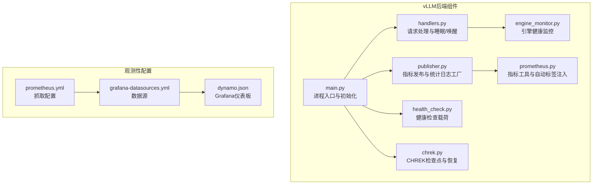
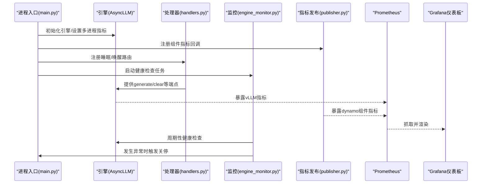
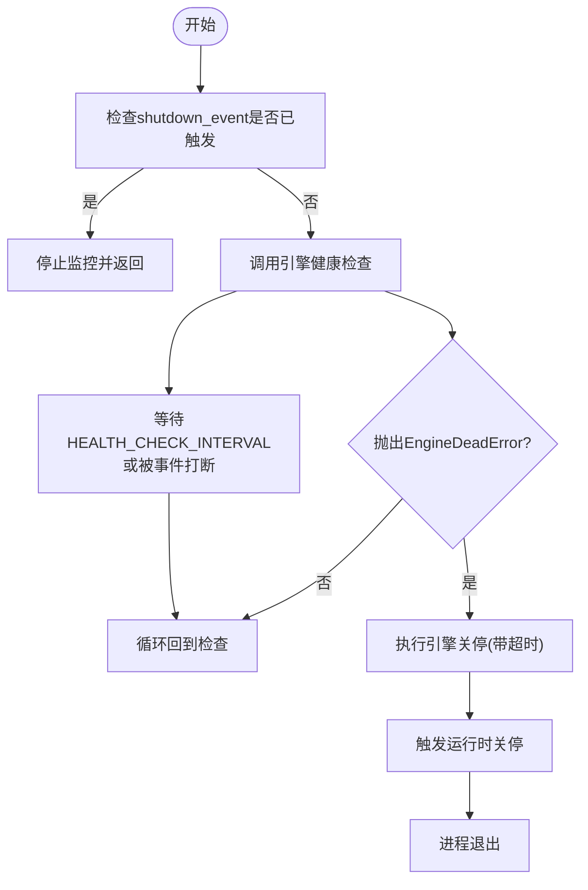
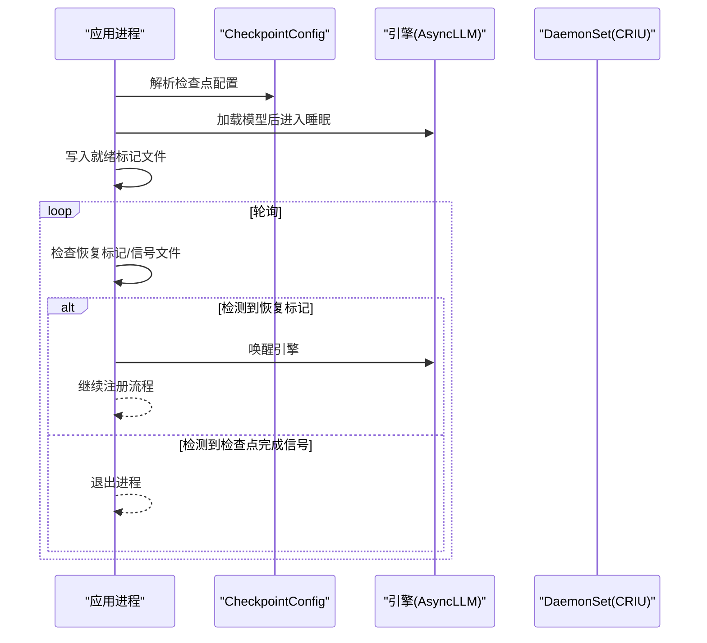
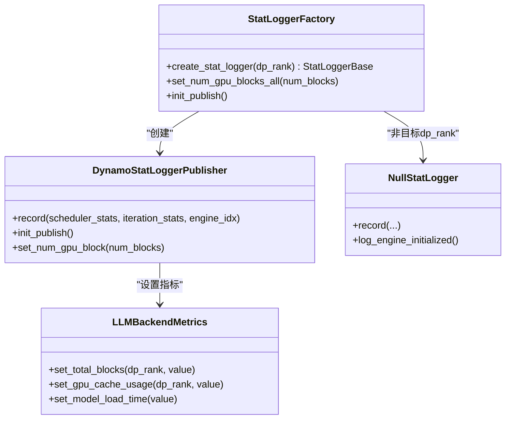
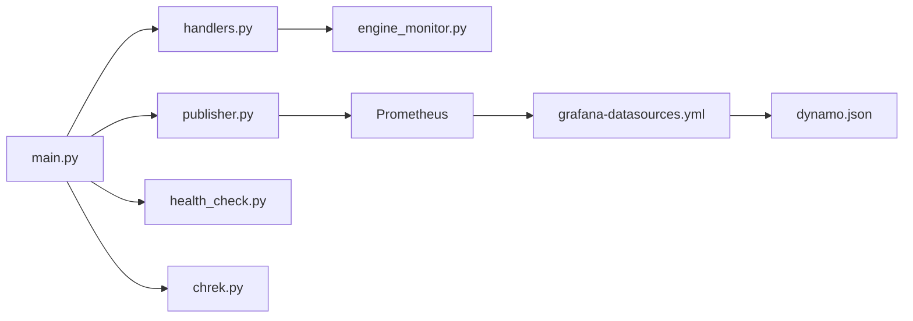

# 性能优化与监控

<cite>
**本文引用的文件**   
- [engine_monitor.py](file://components/src/dynamo/vllm/engine_monitor.py)
- [chrek.py](file://components/src/dynamo/vllm/chrek.py)
- [publisher.py](file://components/src/dynamo/vllm/publisher.py)
- [main.py](file://components/src/dynamo/vllm/main.py)
- [handlers.py](file://components/src/dynamo/vllm/handlers.py)
- [health_check.py](file://components/src/dynamo/vllm/health_check.py)
- [prometheus.py](file://components/src/dynamo/common/utils/prometheus.py)
- [prometheus.yml](file://deploy/observability/prometheus.yml)
- [grafana-datasources.yml](file://deploy/observability/grafana-datasources.yml)
- [dynamo.json](file://deploy/observability/grafana_dashboards/dynamo.json)
- [tuning.md](file://docs/pages/performance/tuning.md)
- [benchmarks/README.md](file://benchmarks/README.md)
</cite>

## 目录
1. [简介](#简介)
2. [项目结构](#项目结构)
3. [核心组件](#核心组件)
4. [架构总览](#架构总览)
5. [组件详解](#组件详解)
6. [依赖关系分析](#依赖关系分析)
7. [性能考量](#性能考量)
8. [故障排查指南](#故障排查指南)
9. [结论](#结论)
10. [附录](#附录)

## 简介
本技术文档聚焦于 vLLM 在 Dynamo 平台中的性能优化与监控体系，围绕以下主题展开：
- 引擎监控器的实现原理、健康检查与异常处理
- CHREK 检查点恢复（Checkpoint/Restore）流程、睡眠与唤醒机制
- Prometheus 指标发布、统计日志工厂与组件度量注册
- 性能瓶颈识别、优化策略选择与监控仪表板配置
- 实战：性能调优最佳实践、资源使用监控与故障诊断技巧
- 基准测试与优化案例分析

## 项目结构
vLLM 后端在 Dynamo 中由“主入口”“处理器”“指标发布”“健康检查”“CHREK 恢复”“运行时集成”等模块协同完成。下图展示与本文相关的关键文件与职责映射。

图表来源
- [main.py](file://components/src/dynamo/vllm/main.py#L1-L120)
- [handlers.py](file://components/src/dynamo/vllm/handlers.py#L233-L448)
- [engine_monitor.py](file://components/src/dynamo/vllm/engine_monitor.py#L23-L120)
- [publisher.py](file://components/src/dynamo/vllm/publisher.py#L1-L148)
- [health_check.py](file://components/src/dynamo/vllm/health_check.py#L83-L197)
- [chrek.py](file://components/src/dynamo/vllm/chrek.py#L1-L158)
- [prometheus.py](file://components/src/dynamo/common/utils/prometheus.py#L35-L363)
- [prometheus.yml](file://deploy/observability/prometheus.yml#L20-L50)
- [grafana-datasources.yml](file://deploy/observability/grafana-datasources.yml#L18-L24)
- [dynamo.json](file://deploy/observability/grafana_dashboards/dynamo.json#L1-L120)

章节来源
- [main.py](file://components/src/dynamo/vllm/main.py#L1-L120)
- [handlers.py](file://components/src/dynamo/vllm/handlers.py#L233-L448)
- [engine_monitor.py](file://components/src/dynamo/vllm/engine_monitor.py#L23-L120)
- [publisher.py](file://components/src/dynamo/vllm/publisher.py#L1-L148)
- [health_check.py](file://components/src/dynamo/vllm/health_check.py#L83-L197)
- [chrek.py](file://components/src/dynamo/vllm/chrek.py#L1-L158)
- [prometheus.py](file://components/src/dynamo/common/utils/prometheus.py#L35-L363)
- [prometheus.yml](file://deploy/observability/prometheus.yml#L20-L50)
- [grafana-datasources.yml](file://deploy/observability/grafana-datasources.yml#L18-L24)
- [dynamo.json](file://deploy/observability/grafana_dashboards/dynamo.json#L1-L120)

## 核心组件
- 引擎监控器：周期性健康检查，异常时触发引擎关闭与运行时关停，保障系统稳定。
- CHREK 检查点与恢复：支持 CRIU 冻结/内存快照，配合 DaemonSet 完成检查点创建与恢复后的唤醒。
- 指标发布与统计日志工厂：通过 vLLM 统计接口与自定义发布器，向 Prometheus 暴露组件级指标，并注入自动标签。
- 健康检查载荷：为不同工作负载（文本/Token 输入、Omni）生成默认健康检查参数。
- 主入口与初始化：统一设置多进程 Prometheus、构建 LLM 后端指标、注册路由与端点服务。

章节来源
- [engine_monitor.py](file://components/src/dynamo/vllm/engine_monitor.py#L23-L120)
- [chrek.py](file://components/src/dynamo/vllm/chrek.py#L39-L158)
- [publisher.py](file://components/src/dynamo/vllm/publisher.py#L40-L148)
- [health_check.py](file://components/src/dynamo/vllm/health_check.py#L83-L197)
- [main.py](file://components/src/dynamo/vllm/main.py#L193-L457)

## 架构总览
下图展示 vLLM 工作进程从启动到服务、再到健康监控与指标发布的整体流程。

图表来源
- [main.py](file://components/src/dynamo/vllm/main.py#L361-L457)
- [publisher.py](file://components/src/dynamo/vllm/publisher.py#L19-L148)
- [handlers.py](file://components/src/dynamo/vllm/handlers.py#L287-L347)
- [engine_monitor.py](file://components/src/dynamo/vllm/engine_monitor.py#L74-L120)
- [prometheus.yml](file://deploy/observability/prometheus.yml#L20-L50)
- [dynamo.json](file://deploy/observability/grafana_dashboards/dynamo.json#L1-L120)

## 组件详解

### 引擎监控器（VllmEngineMonitor）
- 职责：定期对 AsyncLLM 执行健康检查；若检测到引擎死亡，执行超时保护的引擎关停与运行时关停，确保资源释放与进程退出。
- 关键点：
  - 使用事件感知的睡眠，加速对优雅关停信号的响应。
  - 异常路径中通过信号定时器避免关停卡死。
  - 与运行时集成，统一关停流程。

图表来源
- [engine_monitor.py](file://components/src/dynamo/vllm/engine_monitor.py#L74-L120)

章节来源
- [engine_monitor.py](file://components/src/dynamo/vllm/engine_monitor.py#L23-L120)

### CHREK 检查点与恢复（Checkpoint/Restore）
- 职责：在启用检查点模式时，加载引擎后进入睡眠（CRIU 友好），写就绪标记，轮询检查点完成信号或恢复标记，完成恢复后唤醒引擎。
- 关键点：
  - 通过环境变量驱动，严格校验必需项。
  - PVC 存储下支持幂等检查：若已有成功标记则直接退出，避免重复加载。
  - 支持恢复标记检测，恢复后唤醒引擎并返回继续注册流程。

图表来源
- [chrek.py](file://components/src/dynamo/vllm/chrek.py#L93-L140)

章节来源
- [chrek.py](file://components/src/dynamo/vllm/chrek.py#L39-L158)

### 指标发布与统计日志工厂
- 职责：对接 vLLM 的统计日志接口，将调度器与迭代统计转换为 Prometheus 指标；通过专用注册表隔离组件指标；提供工厂按数据并行秩创建发布器。
- 关键点：
  - 使用独立 CollectorRegistry 隔离组件指标，避免与 vLLM/多进程冲突。
  - 自动注入层次化标签（命名空间/组件/端点/模型），并与用户自定义标签合并。
  - 通过回调函数在 /metrics 抓取时输出组合指标。

图表来源
- [publisher.py](file://components/src/dynamo/vllm/publisher.py#L40-L148)
- [prometheus.py](file://components/src/dynamo/common/utils/prometheus.py#L303-L363)

章节来源
- [publisher.py](file://components/src/dynamo/vllm/publisher.py#L1-L148)
- [prometheus.py](file://components/src/dynamo/common/utils/prometheus.py#L35-L363)

### 健康检查载荷
- 职责：为 vLLM/预填充/OMNI 生成默认健康检查请求体，支持基于模型 BOS token 的输入构造。
- 关键点：
  - 文本输入与 Token 输入两种模式，自动推断 BOS token。
  - OMNI 通过异步方式获取 BOS token。

章节来源
- [health_check.py](file://components/src/dynamo/vllm/health_check.py#L83-L197)

### 主入口与初始化（main.py）
- 职责：解析参数、拉取模型、在检查点模式下提前创建引擎、建立运行时、初始化处理器与指标、注册睡眠/唤醒路由、健康检查端点。
- 关键点：
  - 多进程 Prometheus 设置与注册回调，兼容 vLLM/其他引擎指标。
  - 统一设置 LLM 后端指标对象，供统计日志工厂使用。
  - 支持 KV 事件发布器订阅（前缀缓存场景）。

章节来源
- [main.py](file://components/src/dynamo/vllm/main.py#L99-L191)
- [main.py](file://components/src/dynamo/vllm/main.py#L193-L457)
- [main.py](file://components/src/dynamo/vllm/main.py#L460-L800)

### 请求处理与睡眠/唤醒（handlers.py）
- 职责：实现 generate/clear 等端点；提供睡眠/唤醒路由，先注销/注册发现实例，再对引擎执行睡眠/唤醒，保证请求一致性。
- 关键点：
  - 睡眠/唤醒顺序严格控制，避免新请求到达。
  - 支持 LoRA 动态加载/卸载与发布到发现注册表。

章节来源
- [handlers.py](file://components/src/dynamo/vllm/handlers.py#L287-L347)
- [handlers.py](file://components/src/dynamo/vllm/handlers.py#L440-L782)

## 依赖关系分析
- 运行时与引擎：主入口创建分布式运行时，处理器持有运行时句柄，监控器在异常时触发关停。
- 指标链路：vLLM 指标经回调暴露，组件指标通过独立注册表与回调注入标签，Prometheus 抓取后由 Grafana 展示。
- CHREK：通过环境变量与文件系统交互，与 DaemonSet 协同完成 CRIU 操作。

图表来源
- [main.py](file://components/src/dynamo/vllm/main.py#L1-L120)
- [handlers.py](file://components/src/dynamo/vllm/handlers.py#L233-L448)
- [publisher.py](file://components/src/dynamo/vllm/publisher.py#L1-L148)
- [health_check.py](file://components/src/dynamo/vllm/health_check.py#L83-L197)
- [chrek.py](file://components/src/dynamo/vllm/chrek.py#L1-L158)
- [prometheus.yml](file://deploy/observability/prometheus.yml#L20-L50)
- [grafana-datasources.yml](file://deploy/observability/grafana-datasources.yml#L18-L24)
- [dynamo.json](file://deploy/observability/grafana_dashboards/dynamo.json#L1-L120)

章节来源
- [main.py](file://components/src/dynamo/vllm/main.py#L1-L120)
- [handlers.py](file://components/src/dynamo/vllm/handlers.py#L233-L448)
- [publisher.py](file://components/src/dynamo/vllm/publisher.py#L1-L148)
- [health_check.py](file://components/src/dynamo/vllm/health_check.py#L83-L197)
- [chrek.py](file://components/src/dynamo/vllm/chrek.py#L1-L158)
- [prometheus.yml](file://deploy/observability/prometheus.yml#L20-L50)
- [grafana-datasources.yml](file://deploy/observability/grafana-datasources.yml#L18-L24)
- [dynamo.json](file://deploy/observability/grafana_dashboards/dynamo.json#L1-L120)

## 性能考量
- 引擎初始化与指标延迟：组件指标在引擎初始化完成后才可记录，需关注冷启动阶段的指标缺失。
- 多进程指标一致性：当 PROMETHEUS_MULTIPROC_DIR 已存在时，采用分离注册表以避免重复时间序列冲突。
- KV 缓存与块大小：块大小过小导致碎片与传输效率低，过大降低前缀缓存命中率；建议从 128 开始调参。
- 并行化映射：TP 内节点、PP 跨节点通常更优；根据显存与通信能力确定 GPU 数量，平衡吞吐/GPU 与延迟。
- 前缀/解码引擎配比：高负载下增加解码引擎 TP 可提升前缀缓存命中率与降低 ITL；在 Dynamo 当前实现下，尽量减少预填充引擎数量以最大化解码引擎 KV 块可用性。

章节来源
- [main.py](file://components/src/dynamo/vllm/main.py#L193-L281)
- [tuning.md](file://docs/pages/performance/tuning.md#L19-L137)

## 故障排查指南
- 引擎异常关停
  - 现象：健康检查抛出“引擎死亡”异常，触发关停。
  - 排查：查看监控器日志与 Traceback；确认关停是否成功，进程是否退出。
  - 参考：[engine_monitor.py](file://components/src/dynamo/vllm/engine_monitor.py#L110-L116)
- 指标缺失或重复
  - 现象：/metrics 抓取不完整或出现重复时间序列。
  - 排查：确认是否设置了 PROMETHEUS_MULTIPROC_DIR；若已存在，使用分离注册表并分别注册回调。
  - 参考：[main.py](file://components/src/dynamo/vllm/main.py#L225-L281)、[prometheus.py](file://components/src/dynamo/common/utils/prometheus.py#L35-L162)
- CHREK 恢复失败
  - 现象：检查点完成但未退出，或恢复后未唤醒。
  - 排查：检查就绪标记与信号文件是否存在与格式；确认恢复标记写入；核对 CRIU 配置与超时。
  - 参考：[chrek.py](file://components/src/dynamo/vllm/chrek.py#L114-L139)
- 睡眠/唤醒不一致
  - 现象：新请求仍路由到已睡眠实例。
  - 排查：确认注销/注册发现实例顺序与异常分支；检查唤醒后是否重新注册。
  - 参考：[handlers.py](file://components/src/dynamo/vllm/handlers.py#L287-L347)

章节来源
- [engine_monitor.py](file://components/src/dynamo/vllm/engine_monitor.py#L110-L116)
- [main.py](file://components/src/dynamo/vllm/main.py#L225-L281)
- [prometheus.py](file://components/src/dynamo/common/utils/prometheus.py#L35-L162)
- [chrek.py](file://components/src/dynamo/vllm/chrek.py#L114-L139)
- [handlers.py](file://components/src/dynamo/vllm/handlers.py#L287-L347)

## 结论
本文系统梳理了 vLLM 在 Dynamo 中的性能优化与监控方案：通过健康监控器保障引擎稳定性、通过 CHREK 实现检查点与恢复、通过指标工厂与自动标签注入实现统一可观测性，并结合 Prometheus/Grafana 形成闭环。配合性能调优文档与基准测试工具，可在真实生产环境中持续优化吞吐与延迟表现。

## 附录

### 监控配置要点
- Prometheus 抓取：确保抓取后端与前端指标，参考 [prometheus.yml](file://deploy/observability/prometheus.yml#L20-L50)。
- 数据源与仪表板：配置 Grafana 数据源与 Dynamo 仪表板，参考 [grafana-datasources.yml](file://deploy/observability/grafana-datasources.yml#L18-L24)、[dynamo.json](file://deploy/observability/grafana_dashboards/dynamo.json#L1-L120)。
- 指标过滤与标签注入：通过回调函数注入层次化标签，参考 [prometheus.py](file://components/src/dynamo/common/utils/prometheus.py#L35-L162)。

章节来源
- [prometheus.yml](file://deploy/observability/prometheus.yml#L20-L50)
- [grafana-datasources.yml](file://deploy/observability/grafana-datasources.yml#L18-L24)
- [dynamo.json](file://deploy/observability/grafana_dashboards/dynamo.json#L1-L120)
- [prometheus.py](file://components/src/dynamo/common/utils/prometheus.py#L35-L162)

### 性能基准测试与优化案例
- 基准测试：使用内置脚手架快速评估部署性能，参考 [benchmarks/README.md](file://benchmarks/README.md#L20-L40)。
- 调优指南：结合 AIPerf 与 SLA，确定 TP/PP 映射、块大小、批大小与最大令牌数等关键参数，参考 [tuning.md](file://docs/pages/performance/tuning.md#L19-L137)。

章节来源
- [benchmarks/README.md](file://benchmarks/README.md#L20-L40)
- [tuning.md](file://docs/pages/performance/tuning.md#L19-L137)