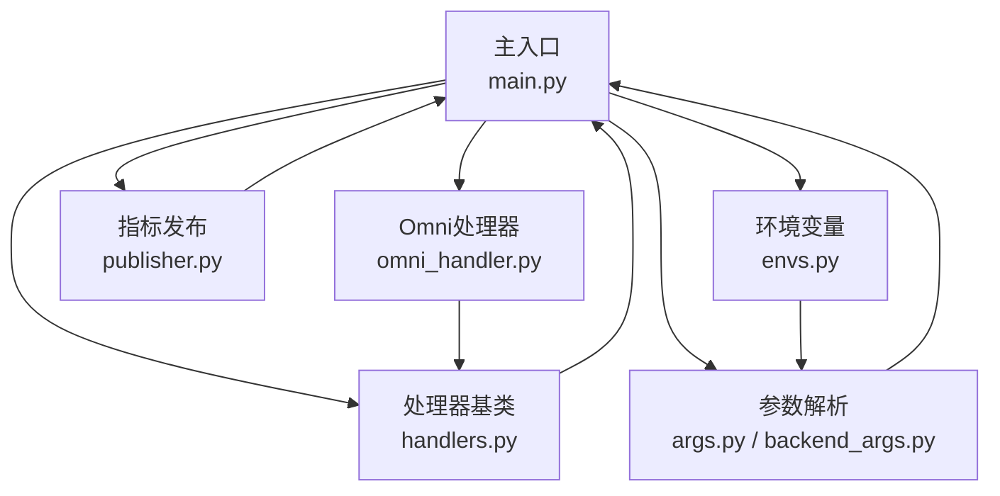
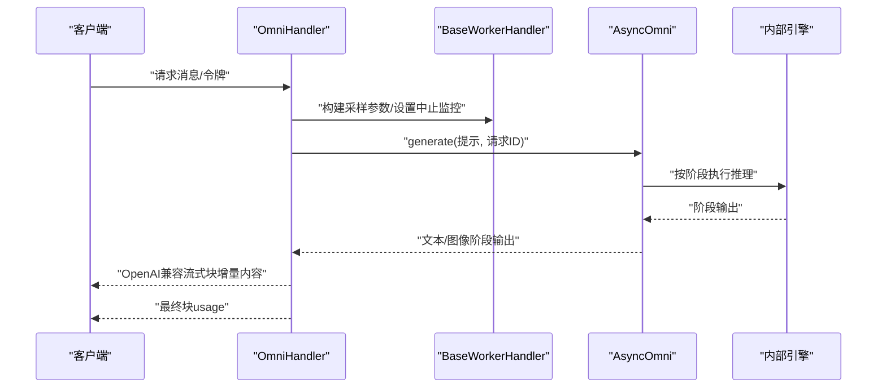
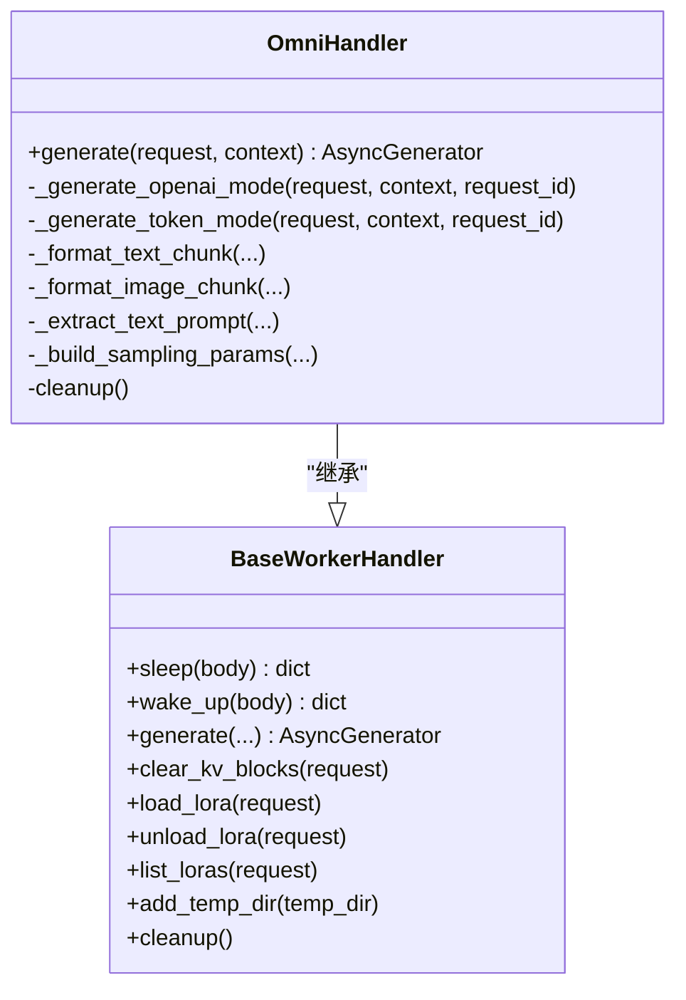
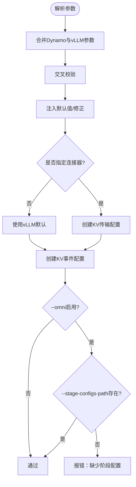
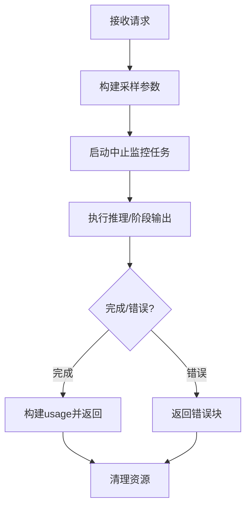
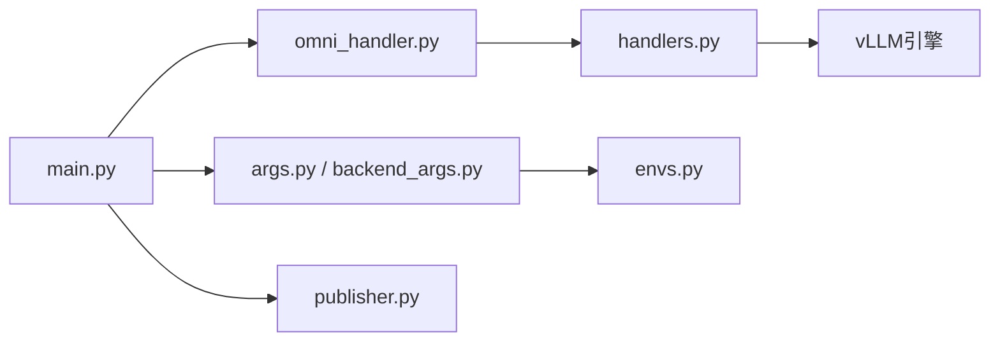

# 高级功能特性

<cite>
**本文引用的文件**
- [components/src/dynamo/vllm/omni/omni_handler.py](file://components/src/dynamo/vllm/omni/omni_handler.py)
- [components/src/dynamo/vllm/main.py](file://components/src/dynamo/vllm/main.py)
- [components/src/dynamo/vllm/backend_args.py](file://components/src/dynamo/vllm/backend_args.py)
- [components/src/dynamo/vllm/args.py](file://components/src/dynamo/vllm/args.py)
- [components/src/dynamo/vllm/handlers.py](file://components/src/dynamo/vllm/handlers.py)
- [components/src/dynamo/vllm/publisher.py](file://components/src/dynamo/vllm/publisher.py)
- [components/src/dynamo/vllm/envs.py](file://components/src/dynamo/vllm/envs.py)
- [recipes/deepseek-r1/README.md](file://recipes/deepseek-r1/README.md)
- [docs/pages/backends/vllm/prompt-embeddings.md](file://docs/pages/backends/vllm/prompt-embeddings.md)
</cite>

## 目录
1. [简介](#简介)
2. [项目结构](#项目结构)
3. [核心组件](#核心组件)
4. [架构总览](#架构总览)
5. [详细组件分析](#详细组件分析)
6. [依赖关系分析](#依赖关系分析)
7. [性能考虑](#性能考虑)
8. [故障排查指南](#故障排查指南)
9. [结论](#结论)
10. [附录](#附录)

## 简介
本文件面向vLLM高级功能特性，聚焦以下目标：
- 深入解析Omni处理器的架构设计与工作原理
- 详解DeepSeek R1模型在Dynamo平台上的支持方式与部署要点
- 全面说明提示嵌入（prompt embeddings）功能的实现路径与使用方法
- 解释Omni模式下的多引擎协同、动态推理与工具调用能力
- 提供高级配置选项、性能优化参数与扩展接口的使用指南
- 给出实际应用场景、性能对比与故障排查方法

## 项目结构
围绕vLLM后端的高级功能，相关代码主要集中在以下模块：
- Omni处理器：负责多阶段流水线的编排与输出格式化
- 主入口与初始化：根据配置选择不同运行模式（含Omni）
- 参数与配置：统一解析Dynamo与vLLM的参数，并注入默认值与校验
- 处理器基类与通用能力：包括采样参数构建、LoRA动态加载、提示嵌入解码等
- 指标与发布：统计日志、指标注册与发布
- 环境变量：KV事件端口等环境变量管理
- 示例与文档：DeepSeek R1部署示例与提示嵌入使用说明

图表来源
- [components/src/dynamo/vllm/main.py](file://components/src/dynamo/vllm/main.py#L176-L188)
- [components/src/dynamo/vllm/omni/omni_handler.py](file://components/src/dynamo/vllm/omni/omni_handler.py#L17-L52)
- [components/src/dynamo/vllm/backend_args.py](file://components/src/dynamo/vllm/backend_args.py#L176-L191)
- [components/src/dynamo/vllm/args.py](file://components/src/dynamo/vllm/args.py#L76-L127)
- [components/src/dynamo/vllm/handlers.py](file://components/src/dynamo/vllm/handlers.py#L233-L286)
- [components/src/dynamo/vllm/publisher.py](file://components/src/dynamo/vllm/publisher.py#L103-L148)
- [components/src/dynamo/vllm/envs.py](file://components/src/dynamo/vllm/envs.py#L60-L84)

章节来源
- [components/src/dynamo/vllm/main.py](file://components/src/dynamo/vllm/main.py#L176-L188)
- [components/src/dynamo/vllm/omni/omni_handler.py](file://components/src/dynamo/vllm/omni/omni_handler.py#L17-L52)
- [components/src/dynamo/vllm/backend_args.py](file://components/src/dynamo/vllm/backend_args.py#L176-L191)
- [components/src/dynamo/vllm/args.py](file://components/src/dynamo/vllm/args.py#L76-L127)
- [components/src/dynamo/vllm/handlers.py](file://components/src/dynamo/vllm/handlers.py#L233-L286)
- [components/src/dynamo/vllm/publisher.py](file://components/src/dynamo/vllm/publisher.py#L103-L148)
- [components/src/dynamo/vllm/envs.py](file://components/src/dynamo/vllm/envs.py#L60-L84)

## 核心组件
- Omni处理器（OmniHandler）
  - 基于vLLM-Omni的异步编排器AsyncOmni，支持文本到文本与文本到图像等多阶段流水线
  - 支持OpenAI兼容流式输出格式，按增量返回delta内容
  - 在非分词器模式下，直接以token模式生成token序列
- 主入口与初始化（init_omni）
  - 通过命令行参数识别Omni模式，构造OmniHandler并注册服务端点
  - 设置指标收集、健康检查负载与清理流程
- 参数与配置（Config/DynamoVllmArgGroup）
  - 统一解析Dynamo运行时参数与vLLM引擎参数，注入默认值与连接器配置
  - 校验Omni模式必需参数（如stage_configs_path）
- 处理器基类（BaseWorkerHandler）
  - 采样参数构建、中止监控、KV缓存清空、LoRA动态加载/卸载/列举
  - 提示嵌入解码与EmbedsPrompt构建，支持跳过分词直接进入推理
- 指标发布（StatLoggerFactory/DynamoStatLoggerPublisher）
  - 将调度器统计与GPU缓存使用率发布至指标系统
- 环境变量（envs）
  - 统一解析KV事件端口等环境变量，确保端口范围合法

章节来源
- [components/src/dynamo/vllm/omni/omni_handler.py](file://components/src/dynamo/vllm/omni/omni_handler.py#L17-L52)
- [components/src/dynamo/vllm/main.py](file://components/src/dynamo/vllm/main.py#L1293-L1364)
- [components/src/dynamo/vllm/backend_args.py](file://components/src/dynamo/vllm/backend_args.py#L176-L191)
- [components/src/dynamo/vllm/args.py](file://components/src/dynamo/vllm/args.py#L34-L68)
- [components/src/dynamo/vllm/handlers.py](file://components/src/dynamo/vllm/handlers.py#L233-L286)
- [components/src/dynamo/vllm/publisher.py](file://components/src/dynamo/vllm/publisher.py#L103-L148)
- [components/src/dynamo/vllm/envs.py](file://components/src/dynamo/vllm/envs.py#L60-L84)

## 架构总览
Omni模式的请求处理链路如下：
- 前端发送OpenAI兼容请求
- BaseWorkerHandler负责参数构建与中止监控
- OmniHandler基于AsyncOmni执行多阶段流水线
- 输出按OpenAI格式逐块返回，最终携带usage信息

图表来源
- [components/src/dynamo/vllm/omni/omni_handler.py](file://components/src/dynamo/vllm/omni/omni_handler.py#L54-L189)
- [components/src/dynamo/vllm/handlers.py](file://components/src/dynamo/vllm/handlers.py#L353-L418)

章节来源
- [components/src/dynamo/vllm/omni/omni_handler.py](file://components/src/dynamo/vllm/omni/omni_handler.py#L54-L189)
- [components/src/dynamo/vllm/handlers.py](file://components/src/dynamo/vllm/handlers.py#L353-L418)

## 详细组件分析

### Omni处理器（OmniHandler）
- 初始化
  - 从配置读取模型、信任远程代码与阶段配置路径，实例化AsyncOmni
  - 保存默认采样参数、最大模型长度、是否使用vLLM分词器等上下文
- 生成流程
  - 文本模式：提取用户消息中的文本作为提示，封装为OmniTextPrompt
  - 图像模式：当最终输出类型为图像时，将PIL图像转为base64数据URL
  - 流式输出：按增量计算delta文本，逐块返回；结束时附加usage统计
- 中止与清理
  - 使用中止监控任务监听取消或关闭事件，必要时触发请求中止
  - 清理阶段关闭AsyncOmni资源

图表来源
- [components/src/dynamo/vllm/omni/omni_handler.py](file://components/src/dynamo/vllm/omni/omni_handler.py#L17-L52)
- [components/src/dynamo/vllm/handlers.py](file://components/src/dynamo/vllm/handlers.py#L233-L286)

章节来源
- [components/src/dynamo/vllm/omni/omni_handler.py](file://components/src/dynamo/vllm/omni/omni_handler.py#L17-L52)
- [components/src/dynamo/vllm/omni/omni_handler.py](file://components/src/dynamo/vllm/omni/omni_handler.py#L54-L189)
- [components/src/dynamo/vllm/omni/omni_handler.py](file://components/src/dynamo/vllm/omni/omni_handler.py#L313-L321)

### 参数与配置（Config/DynamoVllmArgGroup）
- 参数解析
  - 合并Dynamo运行时参数与vLLM引擎参数，交叉校验并更新字段
  - 注入默认行为（如启用前缀缓存、设置块大小等）
- 连接器与KV事件
  - 支持通过connector列表自动装配KV传输配置（LMCache/NIXL/KVBM/Pd）
  - 自动创建KV事件发布配置（ZMQ），用于前缀缓存事件
- Omni模式校验
  - 当启用Omni时，要求提供阶段配置路径；否则报错

图表来源
- [components/src/dynamo/vllm/args.py](file://components/src/dynamo/vllm/args.py#L76-L127)
- [components/src/dynamo/vllm/args.py](file://components/src/dynamo/vllm/args.py#L281-L302)
- [components/src/dynamo/vllm/args.py](file://components/src/dynamo/vllm/args.py#L304-L343)
- [components/src/dynamo/vllm/backend_args.py](file://components/src/dynamo/vllm/backend_args.py#L282-L289)

章节来源
- [components/src/dynamo/vllm/args.py](file://components/src/dynamo/vllm/args.py#L76-L127)
- [components/src/dynamo/vllm/args.py](file://components/src/dynamo/vllm/args.py#L281-L302)
- [components/src/dynamo/vllm/args.py](file://components/src/dynamo/vllm/args.py#L304-L343)
- [components/src/dynamo/vllm/backend_args.py](file://components/src/dynamo/vllm/backend_args.py#L282-L289)

### 处理器基类与通用能力（BaseWorkerHandler）
- 采样参数构建
  - 支持从预处理请求与OpenAI风格请求中构建SamplingParams
  - 动态max_tokens推导，避免越界
- 中止监控
  - 异步等待上下文取消或全局关闭事件，触发请求中止
- KV缓存管理
  - 提供清空KV缓存端点，便于前缀缓存重置
- LoRA动态管理
  - 并发锁保证同名LoRA只加载一次
  - 发现注册/反注册，支持URI下载与本地路径
- 提示嵌入（Prompt Embeddings）
  - 解码base64编码的PyTorch张量，构建EmbedsPrompt
  - 计算序列长度用于usage统计

图表来源
- [components/src/dynamo/vllm/handlers.py](file://components/src/dynamo/vllm/handlers.py#L78-L176)
- [components/src/dynamo/vllm/handlers.py](file://components/src/dynamo/vllm/handlers.py#L353-L418)
- [components/src/dynamo/vllm/handlers.py](file://components/src/dynamo/vllm/handlers.py#L810-L867)

章节来源
- [components/src/dynamo/vllm/handlers.py](file://components/src/dynamo/vllm/handlers.py#L78-L176)
- [components/src/dynamo/vllm/handlers.py](file://components/src/dynamo/vllm/handlers.py#L353-L418)
- [components/src/dynamo/vllm/handlers.py](file://components/src/dynamo/vllm/handlers.py#L810-L867)

### 指标发布与监控（StatLoggerFactory/DynamoStatLoggerPublisher）
- 统计日志工厂
  - 在vLLM引擎初始化时创建，按数据并行rank区分
- 指标发布器
  - 将调度器统计与GPU缓存使用率发布到指标系统
  - 初始化时设置初始值，记录迭代统计

章节来源
- [components/src/dynamo/vllm/publisher.py](file://components/src/dynamo/vllm/publisher.py#L103-L148)

### 环境变量（envs）
- 统一解析KV事件端口，确保端口范围合法
- 提供延迟求值与存在性检测

章节来源
- [components/src/dynamo/vllm/envs.py](file://components/src/dynamo/vllm/envs.py#L60-L84)

## 依赖关系分析
- 组件耦合
  - OmniHandler依赖BaseWorkerHandler提供的通用能力（采样、中止、LoRA、提示嵌入）
  - 主入口根据配置选择运行模式，Omni模式通过OmniHandler接入
- 外部依赖
  - vLLM-Omni：多阶段流水线编排
  - vLLM引擎：AsyncLLM/AsyncOmni、SamplingParams、EmbedsPrompt等
  - Prometheus：指标采集与发布
  - KV事件/ZMQ：前缀缓存事件订阅

图表来源
- [components/src/dynamo/vllm/main.py](file://components/src/dynamo/vllm/main.py#L176-L188)
- [components/src/dynamo/vllm/omni/omni_handler.py](file://components/src/dynamo/vllm/omni/omni_handler.py#L17-L52)
- [components/src/dynamo/vllm/handlers.py](file://components/src/dynamo/vllm/handlers.py#L233-L286)
- [components/src/dynamo/vllm/publisher.py](file://components/src/dynamo/vllm/publisher.py#L103-L148)
- [components/src/dynamo/vllm/args.py](file://components/src/dynamo/vllm/args.py#L76-L127)
- [components/src/dynamo/vllm/envs.py](file://components/src/dynamo/vllm/envs.py#L60-L84)

章节来源
- [components/src/dynamo/vllm/main.py](file://components/src/dynamo/vllm/main.py#L176-L188)
- [components/src/dynamo/vllm/omni/omni_handler.py](file://components/src/dynamo/vllm/omni/omni_handler.py#L17-L52)
- [components/src/dynamo/vllm/handlers.py](file://components/src/dynamo/vllm/handlers.py#L233-L286)
- [components/src/dynamo/vllm/publisher.py](file://components/src/dynamo/vllm/publisher.py#L103-L148)
- [components/src/dynamo/vllm/args.py](file://components/src/dynamo/vllm/args.py#L76-L127)
- [components/src/dynamo/vllm/envs.py](file://components/src/dynamo/vllm/envs.py#L60-L84)

## 性能考虑
- 多进程指标采集
  - 在多进程模式下，优先使用独立注册表与回调，避免重复时间序列冲突
- 前缀缓存与KV事件
  - 默认启用前缀缓存；通过KV事件配置与ZMQ发布，提升缓存命中率
- 分词器与提示嵌入
  - 使用vLLM分词器可减少前端预处理开销；提示嵌入可跳过分词，降低tokenization成本
- 动态推理与睡眠模式
  - 支持睡眠/唤醒接口，按需释放GPU内存，提高资源利用率

章节来源
- [components/src/dynamo/vllm/main.py](file://components/src/dynamo/vllm/main.py#L193-L281)
- [components/src/dynamo/vllm/args.py](file://components/src/dynamo/vllm/args.py#L248-L298)
- [components/src/dynamo/vllm/handlers.py](file://components/src/dynamo/vllm/handlers.py#L78-L176)

## 故障排查指南
- Omni模式未启用但传入阶段配置
  - 现象：启动时报错，提示阶段配置仅在Omni模式下允许
  - 排查：确认已添加--omni标志并正确提供--stage-configs-path
- KV事件端口不合法
  - 现象：端口超出注册范围导致异常
  - 排查：检查DYN_VLLM_KV_EVENT_PORT是否在有效范围内
- 提示嵌入解码失败
  - 现象：base64无效或张量格式不符
  - 排查：确认前端编码规范与后端解码逻辑一致
- LoRA加载并发冲突
  - 现象：同名LoRA并发加载导致状态不一致
  - 排查：利用内部锁序列化加载，避免重复加载

章节来源
- [components/src/dynamo/vllm/backend_args.py](file://components/src/dynamo/vllm/backend_args.py#L282-L289)
- [components/src/dynamo/vllm/envs.py](file://components/src/dynamo/vllm/envs.py#L50-L56)
- [components/src/dynamo/vllm/handlers.py](file://components/src/dynamo/vllm/handlers.py#L810-L832)
- [components/src/dynamo/vllm/handlers.py](file://components/src/dynamo/vllm/handlers.py#L440-L641)

## 结论
Omni处理器为vLLM在Dynamo平台提供了强大的多阶段流水线能力，结合提示嵌入、动态推理与LoRA管理，能够覆盖从文本到图像的多样化生成需求。通过严格的参数校验、指标发布与环境变量管理，系统在生产环境中具备良好的稳定性与可观测性。

## 附录

### DeepSeek R1模型支持与部署
- 模型详情
  - 模型名称：deepseek-ai/DeepSeek-R1
  - 架构：671B参数MoE，推荐FP8量化
  - 硬件建议：H200/GB200多卡，注意存储类与下载耗时
- 快速开始
  - 创建命名空间与HuggingFace密钥
  - 下载模型缓存并等待完成
  - 应用部署清单并进行端口转发测试
- 注意事项
  - 大模型下载耗时较长，注意存储类配置
  - NCCL错误多为OOM，适当调整静态内存比例

章节来源
- [recipes/deepseek-r1/README.md](file://recipes/deepseek-r1/README.md#L21-L104)

### 提示嵌入（Prompt Embeddings）使用指南
- 工作流程
  - 前端：跳过分词，直接传递base64编码的PyTorch张量
  - 路由：保持原协议不变
  - 后端：解码为EmbedsPrompt，绕过embedding层直接进入Transformer
- 快速上手
  - 启用--enable-prompt-embeds
  - 准备形状为(序列长度, 隐藏维度)的张量，base64编码后放入extra_body
- Docker Compose示例
  - 在命令中追加--enable-prompt-embeds即可启用

章节来源
- [docs/pages/backends/vllm/prompt-embeddings.md](file://docs/pages/backends/vllm/prompt-embeddings.md#L56-L116)
- [components/src/dynamo/vllm/handlers.py](file://components/src/dynamo/vllm/handlers.py#L810-L867)