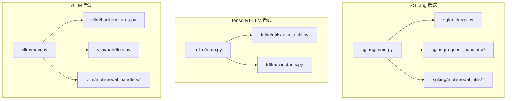
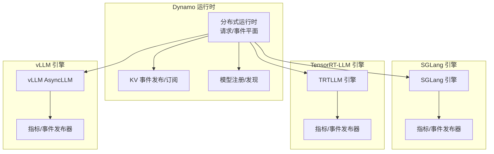
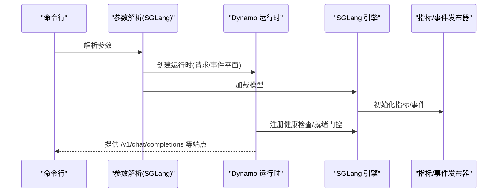
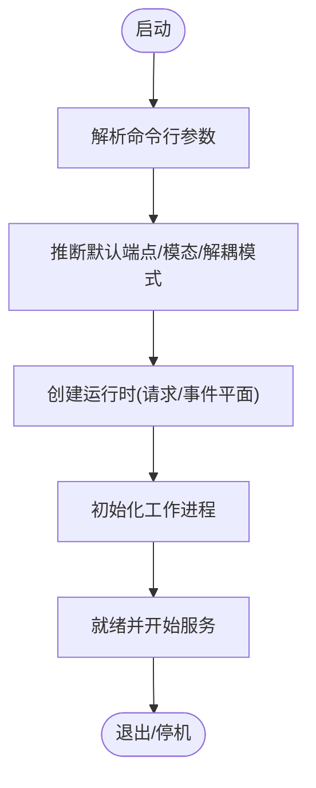
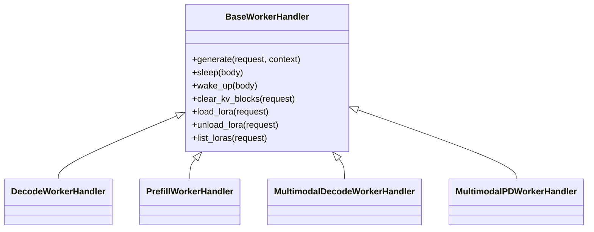
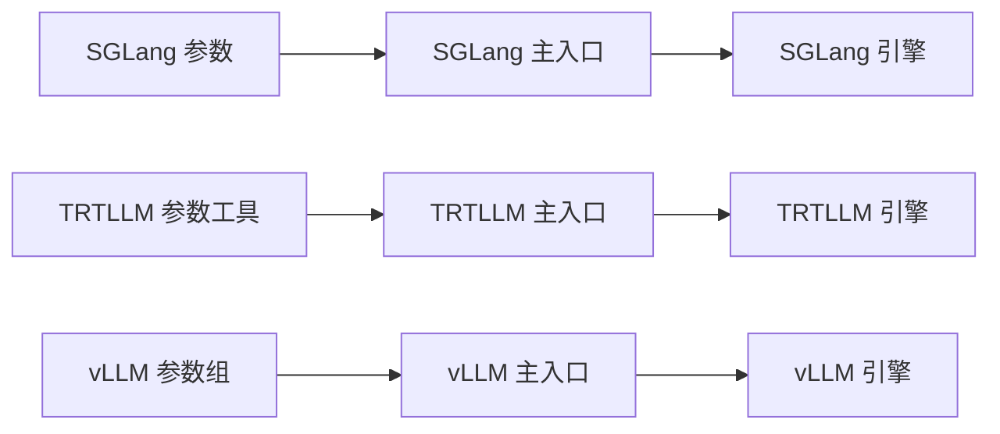

# 后端引擎集成

<cite>
**本文引用的文件**
- [components/src/dynamo/sglang/main.py](file://components/src/dynamo/sglang/main.py)
- [components/src/dynamo/sglang/args.py](file://components/src/dynamo/sglang/args.py)
- [components/src/dynamo/sglang/request_handlers/__init__.py](file://components/src/dynamo/sglang/request_handlers/__init__.py)
- [components/src/dynamo/sglang/multimodal_utils/__init__.py](file://components/src/dynamo/sglang/multimodal_utils/__init__.py)
- [components/src/dynamo/trtllm/main.py](file://components/src/dynamo/trtllm/main.py)
- [components/src/dynamo/trtllm/utils/trtllm_utils.py](file://components/src/dynamo/trtllm/utils/trtllm_utils.py)
- [components/src/dynamo/trtllm/constants.py](file://components/src/dynamo/trtllm/constants.py)
- [components/src/dynamo/vllm/main.py](file://components/src/dynamo/vllm/main.py)
- [components/src/dynamo/vllm/backend_args.py](file://components/src/dynamo/vllm/backend_args.py)
- [components/src/dynamo/vllm/handlers.py](file://components/src/dynamo/vllm/handlers.py)
- [components/src/dynamo/vllm/multimodal_handlers/__init__.py](file://components/src/dynamo/vllm/multimodal_handlers/__init__.py)
- [docs/pages/backends/sglang/README.md](file://docs/pages/backends/sglang/README.md)
- [docs/pages/backends/trtllm/README.md](file://docs/pages/backends/trtllm/README.md)
</cite>

## 目录
1. [简介](#简介)
2. [项目结构](#项目结构)
3. [核心组件](#核心组件)
4. [架构总览](#架构总览)
5. [详细组件分析](#详细组件分析)
6. [依赖关系分析](#依赖关系分析)
7. [性能与资源考量](#性能与资源考量)
8. [故障排查指南](#故障排查指南)
9. [结论](#结论)
10. [附录](#附录)

## 简介
本文件系统化梳理 Dynamo 在后端引擎集成方面的设计与实现，覆盖 SGLang、TensorRT-LLM、vLLM 三大后端。内容包括：
- 各后端特性、适用场景与性能特征
- 集成架构、配置选项、参数映射与最佳实践
- 多模态、工具调用、LoRA 微调等高级能力
- 性能对比、资源消耗分析与部署建议
- 后端选择策略、迁移路径与兼容性考虑
- 实际代码示例、配置模板与故障排查

## 项目结构
围绕后端集成的关键目录与模块如下：
- SGLang：入口、参数解析、请求处理器、多模态工具
- TensorRT-LLM：入口、参数工具、常量（模式/模态）、工作流
- vLLM：入口、参数组、处理器（含 LoRA/多模态）、发布器

图表来源
- [components/src/dynamo/sglang/main.py](file://components/src/dynamo/sglang/main.py#L1-L888)
- [components/src/dynamo/sglang/args.py](file://components/src/dynamo/sglang/args.py#L1-L635)
- [components/src/dynamo/sglang/request_handlers/__init__.py](file://components/src/dynamo/sglang/request_handlers/__init__.py#L1-L42)
- [components/src/dynamo/sglang/multimodal_utils/__init__.py](file://components/src/dynamo/sglang/multimodal_utils/__init__.py#L1-L19)
- [components/src/dynamo/trtllm/main.py](file://components/src/dynamo/trtllm/main.py#L1-L51)
- [components/src/dynamo/trtllm/utils/trtllm_utils.py](file://components/src/dynamo/trtllm/utils/trtllm_utils.py#L1-L613)
- [components/src/dynamo/trtllm/constants.py](file://components/src/dynamo/trtllm/constants.py#L1-L58)
- [components/src/dynamo/vllm/main.py](file://components/src/dynamo/vllm/main.py#L1-L1373)
- [components/src/dynamo/vllm/backend_args.py](file://components/src/dynamo/vllm/backend_args.py#L1-L289)
- [components/src/dynamo/vllm/handlers.py](file://components/src/dynamo/vllm/handlers.py#L1-L1600)
- [components/src/dynamo/vllm/multimodal_handlers/__init__.py](file://components/src/dynamo/vllm/multimodal_handlers/__init__.py#L1-L25)

章节来源
- [components/src/dynamo/sglang/main.py](file://components/src/dynamo/sglang/main.py#L1-L888)
- [components/src/dynamo/trtllm/main.py](file://components/src/dynamo/trtllm/main.py#L1-L51)
- [components/src/dynamo/vllm/main.py](file://components/src/dynamo/vllm/main.py#L1-L1373)

## 核心组件
- SGLang
  - 入口与生命周期管理：模型加载、健康检查、非领导节点处理、优雅停机
  - 组件初始化：解码/预填充/扩散/嵌入/多模态处理器
  - 指标与事件：Prometheus 指标、KV 事件发布
- TensorRT-LLM
  - 入口与运行时：日志级别映射、运行时创建、工作进程初始化
  - 参数工具：命令行参数解析、默认端点推断、KV 事件开关
  - 常量：解耦模式（聚合/预填充/解码/编码）、模态类型（文本/多模态/视频扩散）
- vLLM
  - 入口与生命周期：模型下载、引擎构建、指标收集、KV 事件发布
  - 处理器：解码/预填充工作器、多模态处理器、引擎监控与睡眠/唤醒
  - 高级特性：LoRA 动态加载/卸载/枚举、前端解码、工具/推理解析器

章节来源
- [components/src/dynamo/sglang/main.py](file://components/src/dynamo/sglang/main.py#L191-L800)
- [components/src/dynamo/trtllm/main.py](file://components/src/dynamo/trtllm/main.py#L29-L51)
- [components/src/dynamo/trtllm/utils/trtllm_utils.py](file://components/src/dynamo/trtllm/utils/trtllm_utils.py#L146-L597)
- [components/src/dynamo/trtllm/constants.py](file://components/src/dynamo/trtllm/constants.py#L12-L58)
- [components/src/dynamo/vllm/main.py](file://components/src/dynamo/vllm/main.py#L99-L800)
- [components/src/dynamo/vllm/handlers.py](file://components/src/dynamo/vllm/handlers.py#L56-L782)

## 架构总览
三大后端均通过 Dynamo 分布式运行时接入统一的请求平面与事件平面，支持：
- 解耦模式：聚合、预填充、解码、编码
- KV 路由与事件：本地索引器或持久化 JetStream
- 多模态：图像/视频输入与前端解码
- 工具调用与推理解析：结构化输出与思维链
- 运行时生命周期：睡眠/唤醒、清空 KV 块、优雅停机

图表来源
- [components/src/dynamo/sglang/main.py](file://components/src/dynamo/sglang/main.py#L257-L324)
- [components/src/dynamo/vllm/main.py](file://components/src/dynamo/vllm/main.py#L283-L358)
- [components/src/dynamo/trtllm/main.py](file://components/src/dynamo/trtllm/main.py#L29-L42)

## 详细组件分析

### SGLang 集成
- 初始化流程
  - 解析参数（含自定义 Jinja 模板、分词器选择、端点类型）
  - 模型加载与度量初始化
  - 非领导节点处理（仅发布事件，不服务请求）
  - 注册健康检查与就绪门控
- 组件类型
  - 解码/预填充/扩散/嵌入/多模态处理器
  - 图像扩散专用生成器
- 多模态
  - 请求转换、流式响应处理、图像编码与加载
- 关键参数映射
  - --endpoint、--dyn-tool-call-parser、--dyn-reasoning-parser、--use-sglang-tokenizer、--custom-jinja-template、--dyn-endpoint-types、--store-kv、--request-plane、--event-plane、--durable-kv-events、--image-diffusion-worker、--image-diffusion-fs-url、--image-diffusion-base-url

图表来源
- [components/src/dynamo/sglang/args.py](file://components/src/dynamo/sglang/args.py#L308-L605)
- [components/src/dynamo/sglang/main.py](file://components/src/dynamo/sglang/main.py#L235-L328)

章节来源
- [components/src/dynamo/sglang/args.py](file://components/src/dynamo/sglang/args.py#L33-L148)
- [components/src/dynamo/sglang/args.py](file://components/src/dynamo/sglang/args.py#L308-L605)
- [components/src/dynamo/sglang/main.py](file://components/src/dynamo/sglang/main.py#L191-L407)
- [components/src/dynamo/sglang/request_handlers/__init__.py](file://components/src/dynamo/sglang/request_handlers/__init__.py#L1-L42)
- [components/src/dynamo/sglang/multimodal_utils/__init__.py](file://components/src/dynamo/sglang/multimodal_utils/__init__.py#L1-L19)

### TensorRT-LLM 集成
- 入口与日志
  - 自动映射 Dynamo 日志到 TRTLLM 日志级别
  - 创建运行时并初始化工作进程
- 参数工具
  - 默认端点推断（根据模态与解耦模式）
  - KV 事件开关派生（publish_events_and_metrics）
  - 扩展引擎参数与覆盖
- 常量
  - 解耦模式：prefill_and_decode、prefill、decode、encode
  - 模态：text、multimodal、video_diffusion
- 多模态与扩散
  - 视频扩散实验性支持（需特定分支）

图表来源
- [components/src/dynamo/trtllm/utils/trtllm_utils.py](file://components/src/dynamo/trtllm/utils/trtllm_utils.py#L146-L597)
- [components/src/dynamo/trtllm/main.py](file://components/src/dynamo/trtllm/main.py#L29-L42)
- [components/src/dynamo/trtllm/constants.py](file://components/src/dynamo/trtllm/constants.py#L12-L58)

章节来源
- [components/src/dynamo/trtllm/main.py](file://components/src/dynamo/trtllm/main.py#L29-L51)
- [components/src/dynamo/trtllm/utils/trtllm_utils.py](file://components/src/dynamo/trtllm/utils/trtllm_utils.py#L146-L597)
- [components/src/dynamo/trtllm/constants.py](file://components/src/dynamo/trtllm/constants.py#L12-L58)

### vLLM 集成
- 入口与生命周期
  - 模型下载、引擎构建、指标收集、KV 事件发布
  - 睡眠/唤醒路由、清空 KV 块
- 处理器与多模态
  - 解码/预填充工作器、多模态处理器、前端解码
- LoRA 支持
  - 动态加载/卸载/枚举，URI 下载，实例级发布
- 配置与参数
  - Dynamo vLLM 参数组：是否预填充/解码、是否使用 vLLM 分词器、多模态开关、前端解码、Omni 等

图表来源
- [components/src/dynamo/vllm/handlers.py](file://components/src/dynamo/vllm/handlers.py#L233-L782)
- [components/src/dynamo/vllm/multimodal_handlers/__init__.py](file://components/src/dynamo/vllm/multimodal_handlers/__init__.py#L1-L25)

章节来源
- [components/src/dynamo/vllm/main.py](file://components/src/dynamo/vllm/main.py#L99-L800)
- [components/src/dynamo/vllm/handlers.py](file://components/src/dynamo/vllm/handlers.py#L56-L782)
- [components/src/dynamo/vllm/backend_args.py](file://components/src/dynamo/vllm/backend_args.py#L15-L289)
- [components/src/dynamo/vllm/multimodal_handlers/__init__.py](file://components/src/dynamo/vllm/multimodal_handlers/__init__.py#L1-L25)

## 依赖关系分析
- SGLang
  - 依赖 SGLang 引擎与服务器参数；通过 Dynamo 的运行时与事件平面集成
  - 多模态依赖图像加载与编码工具
- TensorRT-LLM
  - 依赖 TRTLLM 引擎 API；参数工具负责默认端点与 KV 事件开关
  - 解耦模式与模态枚举用于端点与工作器选择
- vLLM
  - 依赖 vLLM AsyncLLM；通过 Prometheus 与 KV 事件发布器集成
  - 处理器依赖输入参数管理、媒体解码与 NIXL 连接

图表来源
- [components/src/dynamo/sglang/args.py](file://components/src/dynamo/sglang/args.py#L308-L605)
- [components/src/dynamo/trtllm/utils/trtllm_utils.py](file://components/src/dynamo/trtllm/utils/trtllm_utils.py#L146-L597)
- [components/src/dynamo/vllm/backend_args.py](file://components/src/dynamo/vllm/backend_args.py#L15-L289)

章节来源
- [components/src/dynamo/sglang/args.py](file://components/src/dynamo/sglang/args.py#L308-L605)
- [components/src/dynamo/trtllm/utils/trtllm_utils.py](file://components/src/dynamo/trtllm/utils/trtllm_utils.py#L146-L597)
- [components/src/dynamo/vllm/backend_args.py](file://components/src/dynamo/vllm/backend_args.py#L15-L289)

## 性能与资源考量
- SGLang
  - 优势：与上游 SGLang 生态一致，支持多模态与扩散；默认强制流式输出以优化吞吐
  - 注意：解耦模式下预填充阶段取消支持（见官方文档矩阵）
- TensorRT-LLM
  - 优势：支持 WideEP、DP 排路由、KVBM 集成；多节点/多模态/视频扩散实验性支持
  - 注意：已知问题（KV 缓冲不足导致死锁），需调整缓存配置
- vLLM
  - 优势：LoRA 动态加载、前端解码、结构化输出与解析器、睡眠/唤醒机制
  - 注意：多进程 Prometheus 需要正确设置 PROMETHEUS_MULTIPROC_DIR 并避免重复注册

章节来源
- [docs/pages/backends/sglang/README.md](file://docs/pages/backends/sglang/README.md#L75-L85)
- [docs/pages/backends/trtllm/README.md](file://docs/pages/backends/trtllm/README.md#L372-L397)
- [components/src/dynamo/vllm/main.py](file://components/src/dynamo/vllm/main.py#L361-L457)

## 故障排查指南
- SGLang
  - 端点类型与自定义模板冲突：当提供自定义 Jinja 模板但未启用 chat 端点时会告警
  - 非领导节点无请求服务：仅发布事件，确认事件平面配置
- TensorRT-LLM
  - KV 缓冲不足导致死锁：增大 max_tokens_in_buffer 或调整引擎配置
  - 视频扩散依赖特定分支与运行时支持
- vLLM
  - Prometheus 多进程冲突：确保只添加一次 MultiProcessCollector 或使用独立注册表
  - LoRA 下载失败：检查 DYN_LORA_ENABLED 与 URI 可达性

章节来源
- [components/src/dynamo/sglang/args.py](file://components/src/dynamo/sglang/args.py#L474-L482)
- [docs/pages/backends/trtllm/README.md](file://docs/pages/backends/trtllm/README.md#L372-L397)
- [components/src/dynamo/vllm/main.py](file://components/src/dynamo/vllm/main.py#L225-L280)

## 结论
- 三后端在 Dynamo 中均实现了统一的运行时接入、事件与指标发布、以及解耦模式支持
- SGLang 适合与上游生态保持一致的场景；TRTLLM 在大规模/多模态/扩散方面具备优势；vLLM 在动态 LoRA 与前端解码方面表现突出
- 选择建议：根据模型类型（文本/多模态/扩散）、部署规模（单机/多机）、功能需求（KVBM/DP 路由/LoRA）进行权衡

## 附录

### 配置与参数映射速查
- SGLang
  - --endpoint、--dyn-tool-call-parser、--dyn-reasoning-parser、--use-sglang-tokenizer、--custom-jinja-template、--dyn-endpoint-types、--store-kv、--request-plane、--event-plane、--durable-kv-events、--image-diffusion-worker、--image-diffusion-fs-url、--image-diffusion-base-url
- TensorRT-LLM
  - --endpoint、--model-path、--served-model-name、--tensor-parallel-size、--pipeline-parallel-size、--expert-parallel-size、--enable-attention-dp、--kv-block-size、--gpus-per-node、--max-batch-size、--max-num-tokens、--max-seq-len、--max-beam-width、--free-gpu-memory-fraction、--extra-engine-args、--override-engine-args、--publish-events-and-metrics、--disaggregation-mode、--use-nixl-connect、--modality、--encode-endpoint、--allowed-local-media-path、--max-file-size-mb、--dyn-encoder-cache-capacity-gb、--dyn-tool-call-parser、--dyn-reasoning-parser、--connector、--custom-jinja-template、--dyn-endpoint-types、--store-kv、--request-plane、--event-plane、--durable-kv-events、扩散相关参数
- vLLM
  - --is-prefill-worker、--is-decode-worker、--use-vllm-tokenizer、--sleep-mode-level、--multimodal-processor、--ec-processor、--multimodal-encode-worker、--multimodal-worker、--multimodal-decode-worker、--multimodal-encode-prefill-worker、--enable-multimodal、--mm-prompt-template、--frontend-decoding、--vllm-native-encoder-worker、--ec-connector-backend、--ec-storage-path、--ec-extra-config、--ec-consumer-mode、--omni、--stage-configs-path

章节来源
- [components/src/dynamo/sglang/args.py](file://components/src/dynamo/sglang/args.py#L33-L148)
- [components/src/dynamo/trtllm/utils/trtllm_utils.py](file://components/src/dynamo/trtllm/utils/trtllm_utils.py#L152-L597)
- [components/src/dynamo/vllm/backend_args.py](file://components/src/dynamo/vllm/backend_args.py#L20-L289)

### 实际代码示例与模板
- SGLang
  - 示例脚本位于 examples/backends/sglang/launch/*.sh
  - 文档参考：docs/pages/backends/sglang/README.md
- TensorRT-LLM
  - 示例脚本位于 examples/backends/trtllm/launch/*.sh
  - 文档参考：docs/pages/backends/trtllm/README.md
- vLLM
  - 示例脚本位于 examples/backends/vllm/launch/*.sh
  - 多模态示例位于 examples/multimodal/launch/*.sh

章节来源
- [docs/pages/backends/sglang/README.md](file://docs/pages/backends/sglang/README.md#L174-L253)
- [docs/pages/backends/trtllm/README.md](file://docs/pages/backends/trtllm/README.md#L105-L143)