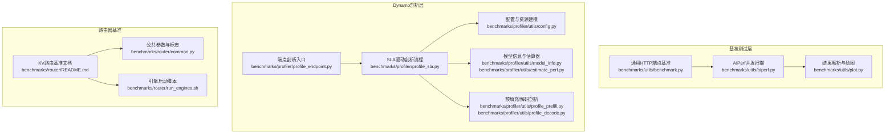
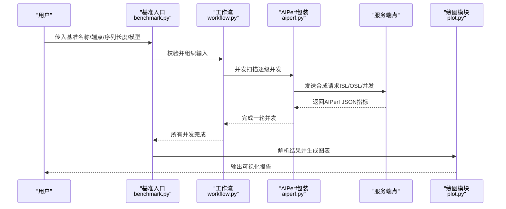
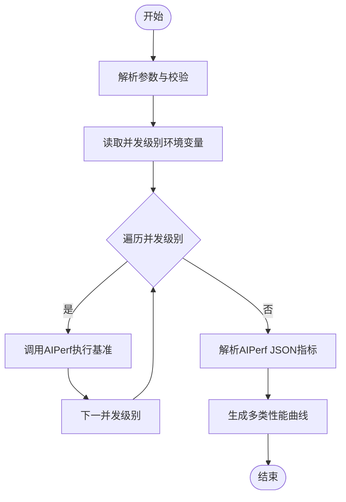
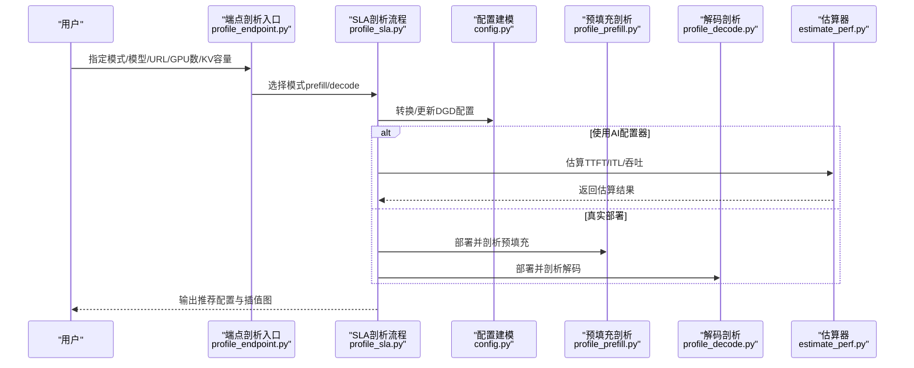
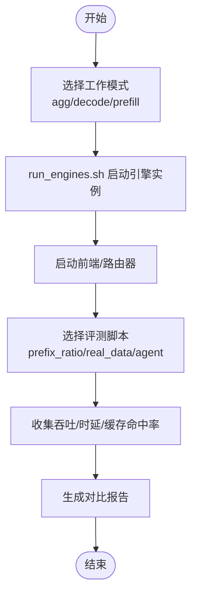
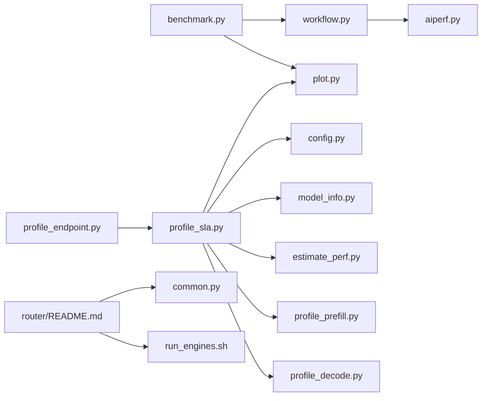

# 基准测试与性能调优

<cite>
**本文引用的文件**   
- [benchmarks/README.md](file://benchmarks/README.md)
- [benchmarks/utils/aiperf.py](file://benchmarks/utils/aiperf.py)
- [benchmarks/utils/benchmark.py](file://benchmarks/utils/benchmark.py)
- [benchmarks/utils/workflow.py](file://benchmarks/utils/workflow.py)
- [benchmarks/utils/plot.py](file://benchmarks/utils/plot.py)
- [benchmarks/profiler/README.md](file://benchmarks/profiler/README.md)
- [benchmarks/profiler/profile_endpoint.py](file://benchmarks/profiler/profile_endpoint.py)
- [benchmarks/profiler/profile_sla.py](file://benchmarks/profiler/profile_sla.py)
- [benchmarks/profiler/utils/config.py](file://benchmarks/profiler/utils/config.py)
- [benchmarks/profiler/utils/defaults.py](file://benchmarks/profiler/utils/defaults.py)
- [benchmarks/profiler/utils/estimate_perf.py](file://benchmarks/profiler/utils/estimate_perf.py)
- [benchmarks/profiler/utils/model_info.py](file://benchmarks/profiler/utils/model_info.py)
- [benchmarks/profiler/utils/profile_prefill.py](file://benchmarks/profiler/utils/profile_prefill.py)
- [benchmarks/profiler/utils/profile_decode.py](file://benchmarks/profiler/utils/profile_decode.py)
- [benchmarks/profiler/utils/plot.py](file://benchmarks/profiler/utils/plot.py)
- [benchmarks/router/README.md](file://benchmarks/router/README.md)
- [benchmarks/router/common.py](file://benchmarks/router/common.py)
- [benchmarks/router/run_engines.sh](file://benchmarks/router/run_engines.sh)
</cite>

## 目录
1. [简介](#简介)
2. [项目结构](#项目结构)
3. [核心组件](#核心组件)
4. [架构总览](#架构总览)
5. [详细组件分析](#详细组件分析)
6. [依赖关系分析](#依赖关系分析)
7. [性能考量](#性能考量)
8. [故障排查指南](#故障排查指南)
9. [结论](#结论)
10. [附录](#附录)

## 简介
本指南面向Dynamo的基准测试与性能调优场景，系统讲解以下内容：
- 性能基准测试工具的使用：AIPerf、负载生成器（含正弦合成器）、性能分析工具
- SLA驱动的部署规划与资源配置优化策略
- 指标采集、瓶颈识别与优化建议
- 不同部署拓扑的性能特征与选择策略
- 硬件配置优化、软件参数调优与网络配置最佳实践
- 性能测试报告模板、结果分析方法与优化案例研究

## 项目结构
本仓库在benchmarks目录下提供了端到端的基准测试与性能分析能力，涵盖：
- 通用HTTP端点基准测试框架（基于AIPerf）
- Dynamo端点性能剖析（预填充/解码阶段）
- 路由器KV缓存前缀共享性能评测
- 可视化与报告生成

图表来源
- [benchmarks/utils/benchmark.py](file://benchmarks/utils/benchmark.py#L1-L103)
- [benchmarks/utils/aiperf.py](file://benchmarks/utils/aiperf.py#L1-L114)
- [benchmarks/utils/plot.py](file://benchmarks/utils/plot.py#L1-L465)
- [benchmarks/profiler/profile_endpoint.py](file://benchmarks/profiler/profile_endpoint.py#L1-L124)
- [benchmarks/profiler/profile_sla.py](file://benchmarks/profiler/profile_sla.py#L1-L869)
- [benchmarks/profiler/utils/config.py](file://benchmarks/profiler/utils/config.py#L1-L389)
- [benchmarks/profiler/utils/model_info.py](file://benchmarks/profiler/utils/model_info.py#L1-L251)
- [benchmarks/profiler/utils/estimate_perf.py](file://benchmarks/profiler/utils/estimate_perf.py#L1-L234)
- [benchmarks/profiler/utils/profile_prefill.py](file://benchmarks/profiler/utils/profile_prefill.py#L1-L140)
- [benchmarks/profiler/utils/profile_decode.py](file://benchmarks/profiler/utils/profile_decode.py#L1-L169)
- [benchmarks/router/README.md](file://benchmarks/router/README.md#L1-L323)
- [benchmarks/router/common.py](file://benchmarks/router/common.py#L1-L87)
- [benchmarks/router/run_engines.sh](file://benchmarks/router/run_engines.sh#L1-L273)

章节来源
- [benchmarks/README.md](file://benchmarks/README.md#L1-L75)
- [benchmarks/router/README.md](file://benchmarks/router/README.md#L1-L323)

## 核心组件
- 通用HTTP端点基准测试
  - 入口脚本：解析参数、校验端点、执行并发扫描、生成可视化图表
  - 并发扫描：通过环境变量控制并发级别，逐级运行AIPerf
  - 结果解析与绘图：从AIPerf JSON中提取指标，绘制多类时序曲线
- Dynamo端点剖析
  - 预填充/解码剖析：支持真实部署或AI配置器估算两种模式
  - SLA驱动推荐：在目标TTFT/ITL约束下，自动筛选最高吞吐/GPU的并行映射
  - 配置建模：统一管理服务资源、容器镜像、后端参数覆盖
- 路由器KV缓存基准
  - 支持聚合/解码/预填充三种工作模式
  - 提供前缀比例、真实轨迹、多轮对话等多场景评测脚本

章节来源
- [benchmarks/utils/benchmark.py](file://benchmarks/utils/benchmark.py#L1-L103)
- [benchmarks/utils/aiperf.py](file://benchmarks/utils/aiperf.py#L1-L114)
- [benchmarks/utils/plot.py](file://benchmarks/utils/plot.py#L1-L465)
- [benchmarks/profiler/profile_endpoint.py](file://benchmarks/profiler/profile_endpoint.py#L1-L124)
- [benchmarks/profiler/profile_sla.py](file://benchmarks/profiler/profile_sla.py#L1-L869)
- [benchmarks/profiler/utils/config.py](file://benchmarks/profiler/utils/config.py#L1-L389)
- [benchmarks/router/README.md](file://benchmarks/router/README.md#L1-L323)

## 架构总览
下图展示从“用户发起基准”到“产出性能报告”的完整链路。

图表来源
- [benchmarks/utils/benchmark.py](file://benchmarks/utils/benchmark.py#L51-L98)
- [benchmarks/utils/workflow.py](file://benchmarks/utils/workflow.py#L77-L97)
- [benchmarks/utils/aiperf.py](file://benchmarks/utils/aiperf.py#L101-L114)
- [benchmarks/utils/plot.py](file://benchmarks/utils/plot.py#L263-L431)

## 详细组件分析

### 组件A：通用HTTP端点基准测试
- 功能要点
  - 参数校验：基准名、端点URL（支持集群内服务名自动补全HTTP协议）
  - 并发扫描：从环境变量读取并发列表，逐级执行AIPerf
  - 结果解析：按并发维度解析AIPerf JSON，提取时延、吞吐等指标
  - 可视化：生成P50/平均互元组延迟、请求吞吐、首Token时间等曲线
- 关键路径
  - 入口：[benchmarks/utils/benchmark.py](file://benchmarks/utils/benchmark.py#L51-L98)
  - 工作流：[benchmarks/utils/workflow.py](file://benchmarks/utils/workflow.py#L77-L97)
  - AIPerf封装：[benchmarks/utils/aiperf.py](file://benchmarks/utils/aiperf.py#L101-L114)
  - 绘图：[benchmarks/utils/plot.py](file://benchmarks/utils/plot.py#L263-L431)

图表来源
- [benchmarks/utils/benchmark.py](file://benchmarks/utils/benchmark.py#L51-L98)
- [benchmarks/utils/aiperf.py](file://benchmarks/utils/aiperf.py#L101-L114)
- [benchmarks/utils/plot.py](file://benchmarks/utils/plot.py#L12-L54)

章节来源
- [benchmarks/utils/benchmark.py](file://benchmarks/utils/benchmark.py#L1-L103)
- [benchmarks/utils/workflow.py](file://benchmarks/utils/workflow.py#L1-L97)
- [benchmarks/utils/aiperf.py](file://benchmarks/utils/aiperf.py#L1-L114)
- [benchmarks/utils/plot.py](file://benchmarks/utils/plot.py#L1-L465)

### 组件B：Dynamo端点剖析（预填充/解码）
- 功能要点
  - 预填充剖析：在最大上下文长度范围内插值TTFT与吞吐/GPU随ISL变化
  - 解码剖析：在给定KV容量下，按并发插值ITL与吞吐/GPU三维表面
  - SLA驱动推荐：在满足TTFT/ITL目标的前提下，选择最高吞吐/GPU的并行映射
  - 配置建模：统一设置容器镜像、资源限制、后端参数覆盖、多节点配置
- 关键路径
  - 端点剖析入口：[benchmarks/profiler/profile_endpoint.py](file://benchmarks/profiler/profile_endpoint.py#L22-L124)
  - SLA剖析主流程：[benchmarks/profiler/profile_sla.py](file://benchmarks/profiler/profile_sla.py#L139-L800)
  - 预填充剖析：[benchmarks/profiler/utils/profile_prefill.py](file://benchmarks/profiler/utils/profile_prefill.py#L84-L140)
  - 解码剖析：[benchmarks/profiler/utils/profile_decode.py](file://benchmarks/profiler/utils/profile_decode.py#L104-L169)
  - 配置建模：[benchmarks/profiler/utils/config.py](file://benchmarks/profiler/utils/config.py#L1-L389)
  - 模型信息与估算器：[benchmarks/profiler/utils/model_info.py](file://benchmarks/profiler/utils/model_info.py#L1-L251), [benchmarks/profiler/utils/estimate_perf.py](file://benchmarks/profiler/utils/estimate_perf.py#L1-L234)

图表来源
- [benchmarks/profiler/profile_endpoint.py](file://benchmarks/profiler/profile_endpoint.py#L22-L124)
- [benchmarks/profiler/profile_sla.py](file://benchmarks/profiler/profile_sla.py#L235-L530)
- [benchmarks/profiler/utils/config.py](file://benchmarks/profiler/utils/config.py#L368-L389)
- [benchmarks/profiler/utils/profile_prefill.py](file://benchmarks/profiler/utils/profile_prefill.py#L84-L140)
- [benchmarks/profiler/utils/profile_decode.py](file://benchmarks/profiler/utils/profile_decode.py#L104-L169)
- [benchmarks/profiler/utils/estimate_perf.py](file://benchmarks/profiler/utils/estimate_perf.py#L29-L234)

章节来源
- [benchmarks/profiler/profile_endpoint.py](file://benchmarks/profiler/profile_endpoint.py#L1-L124)
- [benchmarks/profiler/profile_sla.py](file://benchmarks/profiler/profile_sla.py#L1-L869)
- [benchmarks/profiler/utils/config.py](file://benchmarks/profiler/utils/config.py#L1-L389)
- [benchmarks/profiler/utils/profile_prefill.py](file://benchmarks/profiler/utils/profile_prefill.py#L1-L140)
- [benchmarks/profiler/utils/profile_decode.py](file://benchmarks/profiler/utils/profile_decode.py#L1-L169)
- [benchmarks/profiler/utils/estimate_perf.py](file://benchmarks/profiler/utils/estimate_perf.py#L1-L234)

### 组件C：路由器KV缓存基准
- 功能要点
  - 支持聚合/解码/预填充三种模式，可独立或组合部署
  - 提供前缀比例、真实轨迹、多轮对话三类评测脚本
  - 引擎启动脚本可配置TP/DP、GPU范围、额外参数
- 关键路径
  - 文档与用法：[benchmarks/router/README.md](file://benchmarks/router/README.md#L1-L323)
  - 公共参数与标志：[benchmarks/router/common.py](file://benchmarks/router/common.py#L1-L87)
  - 引擎启动脚本：[benchmarks/router/run_engines.sh](file://benchmarks/router/run_engines.sh#L1-L273)

图表来源
- [benchmarks/router/README.md](file://benchmarks/router/README.md#L48-L198)
- [benchmarks/router/common.py](file://benchmarks/router/common.py#L32-L87)
- [benchmarks/router/run_engines.sh](file://benchmarks/router/run_engines.sh#L134-L156)

章节来源
- [benchmarks/router/README.md](file://benchmarks/router/README.md#L1-L323)
- [benchmarks/router/common.py](file://benchmarks/router/common.py#L1-L87)
- [benchmarks/router/run_engines.sh](file://benchmarks/router/run_engines.sh#L1-L273)

## 依赖关系分析
- 组件耦合
  - 基准入口依赖工作流与AIPerf；工作流依赖AIPerf与Kubernetes辅助判断（集群内服务名）
  - Dynamo剖析入口依赖SLA剖析流程；SLA剖析流程依赖配置建模、模型信息、估算器与预填充/解码剖析
  - 路由器基准依赖公共参数与引擎启动脚本
- 外部依赖
  - AIPerf：用于端到端时延与吞吐测量
  - AI配置器：用于无部署场景下的性能估算
  - Matplotlib/NumPy/SciPy：用于插值与可视化

图表来源
- [benchmarks/utils/benchmark.py](file://benchmarks/utils/benchmark.py#L1-L103)
- [benchmarks/utils/workflow.py](file://benchmarks/utils/workflow.py#L1-L97)
- [benchmarks/utils/aiperf.py](file://benchmarks/utils/aiperf.py#L1-L114)
- [benchmarks/utils/plot.py](file://benchmarks/utils/plot.py#L1-L465)
- [benchmarks/profiler/profile_endpoint.py](file://benchmarks/profiler/profile_endpoint.py#L1-L124)
- [benchmarks/profiler/profile_sla.py](file://benchmarks/profiler/profile_sla.py#L1-L869)
- [benchmarks/profiler/utils/config.py](file://benchmarks/profiler/utils/config.py#L1-L389)
- [benchmarks/profiler/utils/model_info.py](file://benchmarks/profiler/utils/model_info.py#L1-L251)
- [benchmarks/profiler/utils/estimate_perf.py](file://benchmarks/profiler/utils/estimate_perf.py#L1-L234)
- [benchmarks/profiler/utils/profile_prefill.py](file://benchmarks/profiler/utils/profile_prefill.py#L1-L140)
- [benchmarks/profiler/utils/profile_decode.py](file://benchmarks/profiler/utils/profile_decode.py#L1-L169)
- [benchmarks/router/README.md](file://benchmarks/router/README.md#L1-L323)
- [benchmarks/router/common.py](file://benchmarks/router/common.py#L1-L87)
- [benchmarks/router/run_engines.sh](file://benchmarks/router/run_engines.sh#L1-L273)

章节来源
- [benchmarks/utils/benchmark.py](file://benchmarks/utils/benchmark.py#L1-L103)
- [benchmarks/profiler/profile_sla.py](file://benchmarks/profiler/profile_sla.py#L1-L869)

## 性能考量
- 并发与序列长度
  - 并发级别对互元组延迟与吞吐影响显著；应结合业务SLA设定上限
  - ISL过大可能触发分块预填充或激活张量过大，需在最大上下文长度内插值
- 并行映射与资源
  - 在满足TTFT/ITL目标前提下，优先选择吞吐/GPU最高的并行映射
  - 注意注意力数据并行度对并发步长的影响（MoE场景）
- KV缓存与前缀共享
  - 前缀比例越高，KV复用收益越大；路由器KV缓存可显著降低重复计算
- 可视化与成本权衡
  - 通过帕累托前沿与成本曲线，平衡SLA与成本

## 故障排查指南
- 端点基准
  - 端点格式错误：确保HTTP(S)或集群内服务名格式正确
  - 并发扫描失败：检查AIPerf返回码与标准错误输出
  - 图表生成为空：确认AIPerf JSON存在且包含所需字段
- Dynamo剖析
  - 部署超时：适当提高超时阈值或减少并发/序列长度
  - 估算器未安装：确保已安装AI配置器相关依赖
  - KV容量不足：根据日志提示调整解码并发或上下文长度
- 路由器基准
  - 引擎无法启动：检查CUDA可见设备、TP/DP与GPU数量匹配
  - 路由器连接失败：确认端口与NATS/etcd状态

章节来源
- [benchmarks/utils/benchmark.py](file://benchmarks/utils/benchmark.py#L15-L49)
- [benchmarks/utils/aiperf.py](file://benchmarks/utils/aiperf.py#L86-L98)
- [benchmarks/profiler/profile_sla.py](file://benchmarks/profiler/profile_sla.py#L300-L317)
- [benchmarks/router/README.md](file://benchmarks/router/README.md#L317-L323)

## 结论
本指南提供了从“端到端HTTP基准测试”到“Dynamo剖析与SLA驱动推荐”的完整方法论，并结合路由器KV缓存基准给出多场景评测思路。建议在实际部署前先进行小规模并发扫描与剖析，再以SLA为约束进行资源配置优化，最后通过可视化报告持续监控与迭代。

## 附录

### A. 性能测试报告模板
- 实验基本信息
  - 基准名称、端点URL、模型、ISL/OSL/stddev、并发级别
  - 测试环境（GPU型号、驱动、容器镜像版本）
- 指标摘要
  - P50/平均互元组延迟、请求吞吐、首Token时间
  - 吞吐/GPU、每用户吞吐、效率曲线
- 瓶颈与建议
  - 时延来源分析（预填充/解码/调度/网络）
  - 并行映射与资源建议（TP/DP/节点数）
- 优化前后对比
  - 对比图与量化收益

### B. 结果分析方法
- 指标提取
  - 从AIPerf JSON中提取互元组延迟、吞吐、首Token时间等
- 插值与拟合
  - 预填充：二次多项式拟合TTFT/吞吐随ISL变化
  - 解码：二维插值构建ITL/吞吐三维表面
- 推荐策略
  - 在目标SLA内选择最高吞吐/GPU的配置
  - 成本曲线用于权衡不同SLA下的成本

### C. 优化案例研究
- 案例1：大模型高ISL场景
  - 现象：ISL增大导致TTFT上升，吞吐下降
  - 优化：降低ISL或提升TP，同时评估KV容量与并发
- 案例2：高并发低时延场景
  - 现象：并发增加导致互元组延迟抖动
  - 优化：启用KV缓存、合理设置前缀共享策略、调整注意力数据并行度
- 案例3：多轮对话高前缀比例
  - 现象：前缀比例高，路由器KV缓存收益明显
  - 优化：部署解码/预填充分离，提升整体吞吐与稳定性