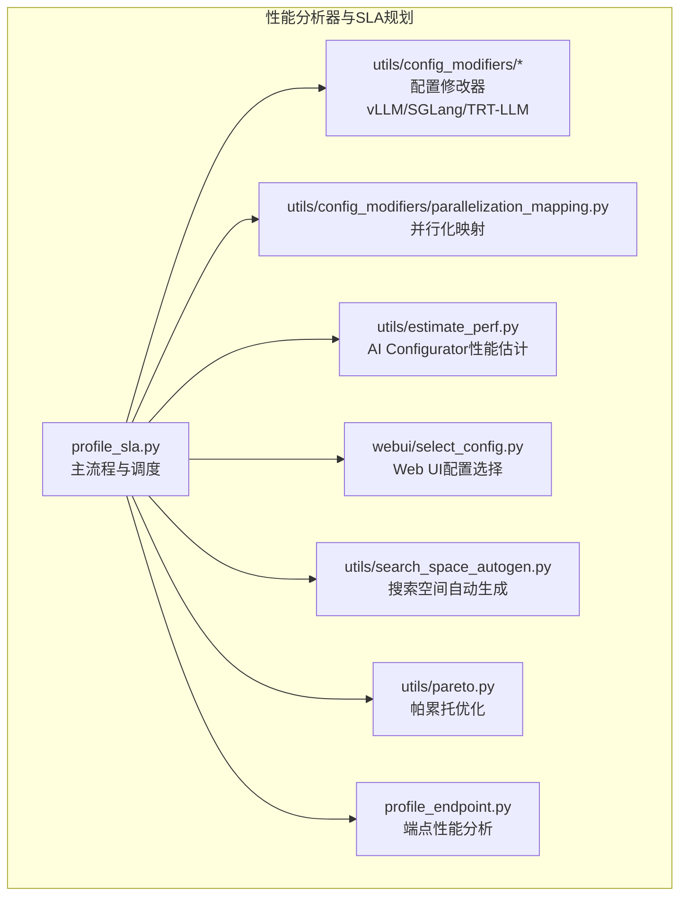
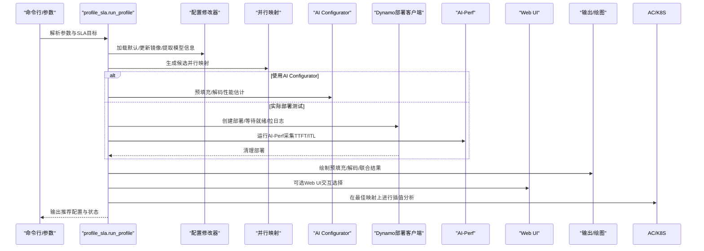
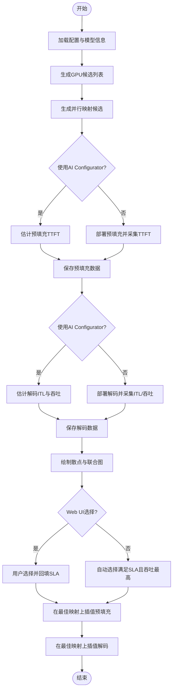
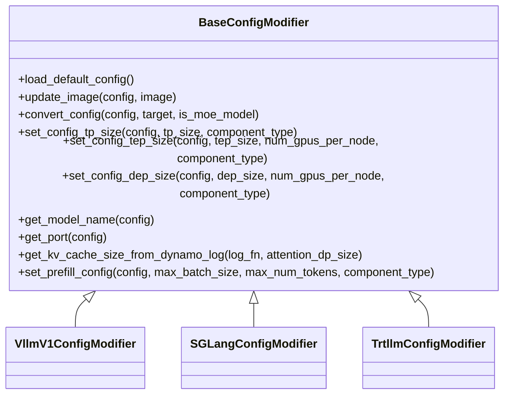
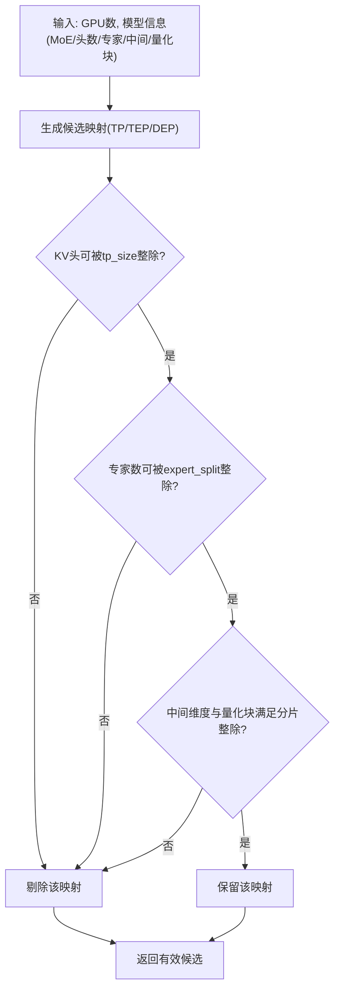
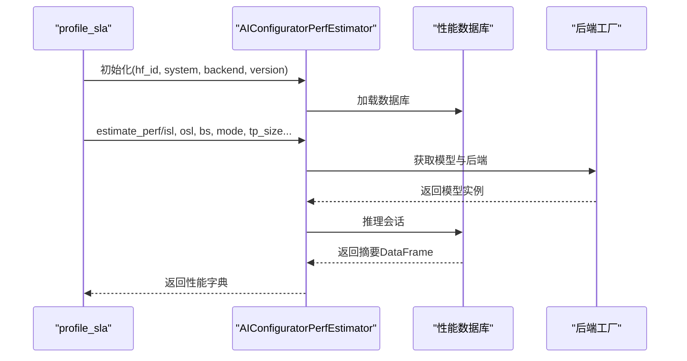
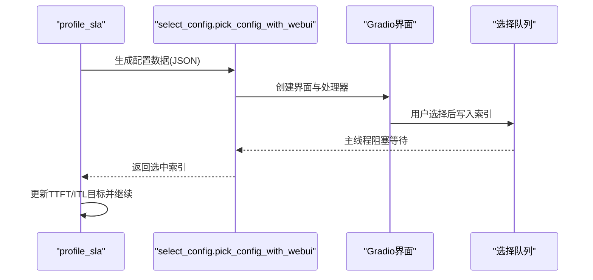
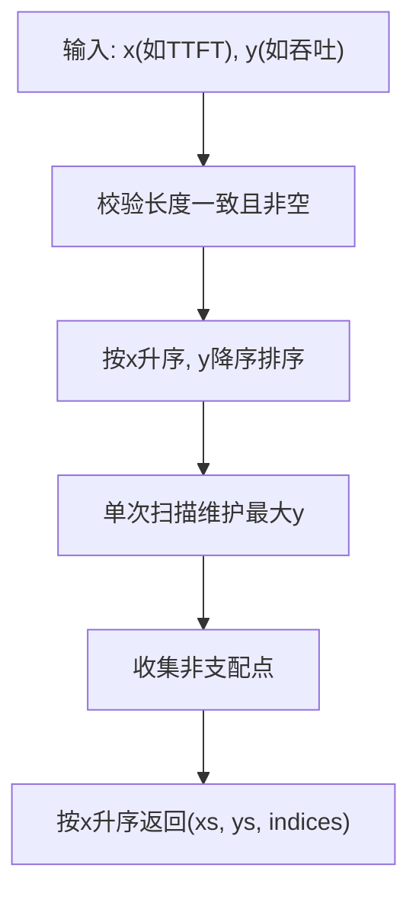
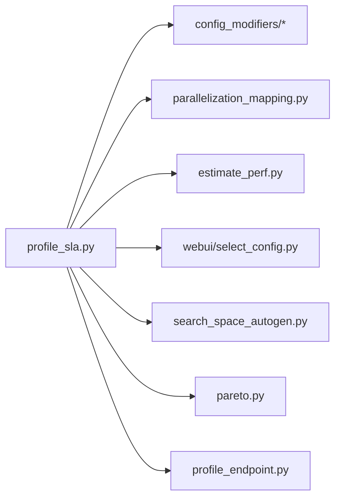

# 性能分析器与SLA规划

<cite>
**本文引用的文件**
- [benchmarks/profiler/profile_sla.py](file://benchmarks/profiler/profile_sla.py)
- [benchmarks/profiler/README.md](file://benchmarks/profiler/README.md)
- [benchmarks/profiler/profile_endpoint.py](file://benchmarks/profiler/profile_endpoint.py)
- [benchmarks/profiler/utils/config_modifiers/__init__.py](file://benchmarks/profiler/utils/config_modifiers/__init__.py)
- [benchmarks/profiler/utils/config_modifiers/parallelization_mapping.py](file://benchmarks/profiler/utils/config_modifiers/parallelization_mapping.py)
- [benchmarks/profiler/utils/config_modifiers/vllm.py](file://benchmarks/profiler/utils/config_modifiers/vllm.py)
- [benchmarks/profiler/utils/config_modifiers/trtllm.py](file://benchmarks/profiler/utils/config_modifiers/trtllm.py)
- [benchmarks/profiler/utils/config_modifiers/sglang.py](file://benchmarks/profiler/utils/config_modifiers/sglang.py)
- [benchmarks/profiler/utils/estimate_perf.py](file://benchmarks/profiler/utils/estimate_perf.py)
- [benchmarks/profiler/utils/search_space_autogen.py](file://benchmarks/profiler/utils/search_space_autogen.py)
- [benchmarks/profiler/utils/pareto.py](file://benchmarks/profiler/utils/pareto.py)
- [benchmarks/profiler/webui/select_config.py](file://benchmarks/profiler/webui/select_config.py)
- [benchmarks/profiler/webui/data_template.json](file://benchmarks/profiler/webui/data_template.json)
</cite>

## 目录
1. [简介](#简介)
2. [项目结构](#项目结构)
3. [核心组件](#核心组件)
4. [架构总览](#架构总览)
5. [详细组件分析](#详细组件分析)
6. [依赖关系分析](#依赖关系分析)
7. [性能考量](#性能考量)
8. [故障排查指南](#故障排查指南)
9. [结论](#结论)
10. [附录](#附录)

## 简介
本指南面向需要在Dynamo平台上进行SLA驱动的性能规划与分析的工程师与运维人员。文档聚焦于“性能分析器”与“SLA规划工具”的使用与原理，涵盖以下主题：
- SLA驱动的性能规划工具：profile_sla.py 的功能、参数与工作流
- 性能分析器配置选项：配置修改器、并行化映射、协议适配
- Web界面工具：配置选择与数据分析
- 性能估计工具：AI Configurator的预填充与解码阶段性能预测
- 搜索空间自动生成与帕累托优化算法
- 实战部署场景中的配置优化案例与最佳实践

## 项目结构
该模块位于 benchmarks/profiler 目录下，围绕“配置修改器（不同后端）+ 并行化映射 + 性能估计/实测 + Web UI + 结果可视化/帕累托分析”构建，形成可扩展的SLA驱动性能规划流水线。

图示来源
- [benchmarks/profiler/profile_sla.py](file://benchmarks/profiler/profile_sla.py#L139-L800)
- [benchmarks/profiler/utils/config_modifiers/__init__.py](file://benchmarks/profiler/utils/config_modifiers/__init__.py#L27-L31)
- [benchmarks/profiler/utils/config_modifiers/parallelization_mapping.py](file://benchmarks/profiler/utils/config_modifiers/parallelization_mapping.py#L171-L221)
- [benchmarks/profiler/utils/estimate_perf.py](file://benchmarks/profiler/utils/estimate_perf.py#L29-L234)
- [benchmarks/profiler/webui/select_config.py](file://benchmarks/profiler/webui/select_config.py#L31-L78)
- [benchmarks/profiler/utils/search_space_autogen.py](file://benchmarks/profiler/utils/search_space_autogen.py#L31-L169)
- [benchmarks/profiler/utils/pareto.py](file://benchmarks/profiler/utils/pareto.py#L5-L43)
- [benchmarks/profiler/profile_endpoint.py](file://benchmarks/profiler/profile_endpoint.py#L22-L124)

章节来源
- [benchmarks/profiler/README.md](file://benchmarks/profiler/README.md#L7-L14)

## 核心组件
- SLA驱动主流程：profile_sla.py 负责从配置加载、生成候选并行映射、按GPU数与映射组合进行预填充/解码性能采样或估计、绘制结果、自动或通过Web UI选择满足SLA的最佳配置，并进行插值分析以覆盖更广的输入/上下文长度范围。
- 配置修改器：针对不同后端（vLLM/SGLang/TRT-LLM）提供统一接口，完成服务名推断、参数转换、资源设置、并行度注入、KV缓存解析等。
- 并行化映射：定义TP/TEP/DEP策略，校验模型属性（如KV头、专家数、中间维度、量化块大小）的可整除性，生成有效候选映射。
- 性能估计：通过AI Configurator数据库进行静态推理，快速估算TTFT/ITL与吞吐，支持最大并发与KV容量估计。
- 搜索空间自动生成：根据模型大小、VRAM与节点GPU数，自动确定最小/最大GPU数与每节点GPU数。
- 帕累托优化：对多目标（如TTFT vs 吞吐、ITL vs 吞吐）计算帕累托前沿，辅助决策。
- Web UI：将采样结果转为JSON，提供交互式图表与表格，支持用户手动挑选配置并回填SLA目标。

章节来源
- [benchmarks/profiler/profile_sla.py](file://benchmarks/profiler/profile_sla.py#L139-L800)
- [benchmarks/profiler/utils/config_modifiers/__init__.py](file://benchmarks/profiler/utils/config_modifiers/__init__.py#L27-L31)
- [benchmarks/profiler/utils/config_modifiers/parallelization_mapping.py](file://benchmarks/profiler/utils/config_modifiers/parallelization_mapping.py#L171-L221)
- [benchmarks/profiler/utils/estimate_perf.py](file://benchmarks/profiler/utils/estimate_perf.py#L29-L234)
- [benchmarks/profiler/utils/search_space_autogen.py](file://benchmarks/profiler/utils/search_space_autogen.py#L31-L169)
- [benchmarks/profiler/utils/pareto.py](file://benchmarks/profiler/utils/pareto.py#L5-L43)
- [benchmarks/profiler/webui/select_config.py](file://benchmarks/profiler/webui/select_config.py#L31-L78)

## 架构总览
下图展示profile_sla.py的主流程与各子模块协作关系：

图示来源
- [benchmarks/profiler/profile_sla.py](file://benchmarks/profiler/profile_sla.py#L139-L800)
- [benchmarks/profiler/utils/estimate_perf.py](file://benchmarks/profiler/utils/estimate_perf.py#L76-L133)
- [benchmarks/profiler/webui/select_config.py](file://benchmarks/profiler/webui/select_config.py#L31-L78)

## 详细组件分析

### profile_sla.py：SLA驱动的性能规划
- 功能概要
  - 支持三种模式：预填充（prefill）与解码（decode）分别采样；以及端点性能分析（profile_endpoint.py）。
  - 自动/手动选择满足SLA的目标配置（TTFT/ITL），并基于最佳映射进行ISL/上下文长度插值分析。
  - 支持Dry Run与AI Configurator估计两种路径，兼顾成本与速度。
- 关键流程
  - 配置加载与修改：依据后端类型调用对应配置修改器，更新镜像、模型、端口等。
  - GPU搜索空间：按2的幂次生成候选GPU数，结合模型与硬件约束。
  - 并行映射：对每个GPU数生成候选映射（TP/TEP/DEP），并验证模型属性可整除性。
  - 部署/估计：若启用AI Configurator则直接估计；否则创建Dynamo部署，运行AI-Perf采集指标。
  - 结果汇总与可视化：绘制预填充/解码散点图与联合图。
  - Web UI选择：将数据转为前端模板格式，提供交互式选择并回填SLA。
  - 插值分析：在选定映射上对ISL与上下文长度进行插值，评估不同输入规模下的性能。
- 参数要点
  - 后端选择（vllm/sglang/trtllm）、模型与镜像、SLA目标（TTFT/ITL）、GPU搜索范围、插值粒度、是否Dry Run、是否使用AI Configurator及其系统/版本等。

图示来源
- [benchmarks/profiler/profile_sla.py](file://benchmarks/profiler/profile_sla.py#L139-L800)

章节来源
- [benchmarks/profiler/profile_sla.py](file://benchmarks/profiler/profile_sla.py#L139-L800)

### 配置修改器：协议适配与参数注入
- 统一接口
  - 提供 load_default_config、update_image、convert_config、set_config_*、get_model_name、get_port、get_kv_cache_size_from_dynamo_log、set_prefill_config 等方法，屏蔽后端差异。
- vLLM
  - 将预填充工作负载转换为解码工作负载（聚合模式），控制前缀缓存开关，设置tensor并行大小，处理多节点资源与专家并行标志。
- SGLang
  - 移除解耦相关标志，启用/禁用前缀缓存，设置tp/ep/dp组合，MoE模型时采用轮询注意力路由提升KV复用。
- TRT-LLM
  - 通过override-engine-args注入并行度与限制，禁用/启用重叠调度与KV复用，解析日志中的KV缓存最大token数。
- 共同特性
  - 从配置中解析模型名与路径、前端端口，从Dynamo日志中提取KV缓存上限用于解码并发与请求范围估计。

图示来源
- [benchmarks/profiler/utils/config_modifiers/vllm.py](file://benchmarks/profiler/utils/config_modifiers/vllm.py#L39-L394)
- [benchmarks/profiler/utils/config_modifiers/sglang.py](file://benchmarks/profiler/utils/config_modifiers/sglang.py#L40-L363)
- [benchmarks/profiler/utils/config_modifiers/trtllm.py](file://benchmarks/profiler/utils/config_modifiers/trtllm.py#L41-L338)

章节来源
- [benchmarks/profiler/utils/config_modifiers/__init__.py](file://benchmarks/profiler/utils/config_modifiers/__init__.py#L27-L31)
- [benchmarks/profiler/utils/config_modifiers/vllm.py](file://benchmarks/profiler/utils/config_modifiers/vllm.py#L39-L394)
- [benchmarks/profiler/utils/config_modifiers/sglang.py](file://benchmarks/profiler/utils/config_modifiers/sglang.py#L40-L363)
- [benchmarks/profiler/utils/config_modifiers/trtllm.py](file://benchmarks/profiler/utils/config_modifiers/trtllm.py#L41-L338)

### 并行化映射：候选生成与约束校验
- 映射类型
  - TP（张量并行）、TEP（专家并行，含张量并行分担）、DEP（数据并行，专家层面）。
- 候选生成
  - 对于MoE模型优先考虑TEP/DEP，非MoE仅考虑TP；部分架构额外允许TP。
- 约束校验
  - KV头数需被tp_size整除；专家数需被expert_split整除；中间维度与量化块需满足分片整除条件。
- 计算派生参数
  - 获取tp_size、expert_split、attention_dp_size、总GPU数等，用于后续配置注入与日志解析。

图示来源
- [benchmarks/profiler/utils/config_modifiers/parallelization_mapping.py](file://benchmarks/profiler/utils/config_modifiers/parallelization_mapping.py#L171-L221)

章节来源
- [benchmarks/profiler/utils/config_modifiers/parallelization_mapping.py](file://benchmarks/profiler/utils/config_modifiers/parallelization_mapping.py#L171-L221)

### 性能估计工具：AI Configurator
- 用途
  - 在不部署的情况下，基于系统/后端/版本数据库进行静态推理，估计预填充TTFT与解码ITL/吞吐。
- 能力
  - estimate_perf/estimate_prefill_perf：按ISL/OSL/批大小/并行度估计性能。
  - get_max_batch_size/get_max_kv_tokens：估算最大并发与KV容量，指导解码请求范围。
- 注意事项
  - MoE模型需提供专家并行相关参数；数据库版本缺失时自动选择最新版本。

图示来源
- [benchmarks/profiler/utils/estimate_perf.py](file://benchmarks/profiler/utils/estimate_perf.py#L29-L234)

章节来源
- [benchmarks/profiler/utils/estimate_perf.py](file://benchmarks/profiler/utils/estimate_perf.py#L29-L234)

### Web界面工具：配置选择与数据分析
- 数据模板
  - data_template.json 定义预填充/解码图表与表格字段、目标线、坐标轴标题等。
- 交互流程
  - 将采样结果转为JSON，启动Gradio界面，用户点击选择，主线程接收队列信号并回填SLA目标。
- 成本/效率
  - 前端负责将GPU小时转换为成本，便于业务侧理解。

图示来源
- [benchmarks/profiler/webui/select_config.py](file://benchmarks/profiler/webui/select_config.py#L31-L78)
- [benchmarks/profiler/webui/data_template.json](file://benchmarks/profiler/webui/data_template.json#L1-L99)

章节来源
- [benchmarks/profiler/webui/select_config.py](file://benchmarks/profiler/webui/select_config.py#L31-L78)
- [benchmarks/profiler/webui/data_template.json](file://benchmarks/profiler/webui/data_template.json#L1-L99)

### 搜索空间自动生成与帕累托优化
- 搜索空间自动生成
  - 若开启GPU发现：从集群获取每节点GPU数与显存，结合模型大小与权重上限估算最小/最大GPU数。
  - 若关闭：使用默认范围（可通过参数覆盖）。
- 帕累托优化
  - 输入两组向量（如TTFT与吞吐、ITL与吞吐），按“左上更优”原则计算帕累托前沿，返回对应索引，辅助筛选非支配配置。

图示来源
- [benchmarks/profiler/utils/pareto.py](file://benchmarks/profiler/utils/pareto.py#L5-L43)

章节来源
- [benchmarks/profiler/utils/search_space_autogen.py](file://benchmarks/profiler/utils/search_space_autogen.py#L31-L169)
- [benchmarks/profiler/utils/pareto.py](file://benchmarks/profiler/utils/pareto.py#L5-L43)

### 端点性能分析：profile_endpoint.py
- 用途
  - 对已上线的服务端点进行预填充或解码性能分析，支持指定URL、模型名、最大上下文长度、插值粒度、注意力数据并行等。
- 流程
  - 解析参数，按模式调用profile_prefill/profile_decode，保存结果到工作目录。

章节来源
- [benchmarks/profiler/profile_endpoint.py](file://benchmarks/profiler/profile_endpoint.py#L22-L124)

## 依赖关系分析
- 组件耦合
  - profile_sla.py 依赖配置修改器、并行映射、性能估计、Web UI、搜索空间与帕累托模块；与Kubernetes部署与AI-Perf集成。
- 外部依赖
  - AI Configurator SDK（可选）；Dynamo部署客户端；Gradio（Web UI）。
- 潜在循环依赖
  - 当前模块间为单向依赖（主流程->子模块），未见循环。

图示来源
- [benchmarks/profiler/profile_sla.py](file://benchmarks/profiler/profile_sla.py#L139-L800)
- [benchmarks/profiler/utils/config_modifiers/__init__.py](file://benchmarks/profiler/utils/config_modifiers/__init__.py#L27-L31)
- [benchmarks/profiler/utils/config_modifiers/parallelization_mapping.py](file://benchmarks/profiler/utils/config_modifiers/parallelization_mapping.py#L171-L221)
- [benchmarks/profiler/utils/estimate_perf.py](file://benchmarks/profiler/utils/estimate_perf.py#L29-L234)
- [benchmarks/profiler/webui/select_config.py](file://benchmarks/profiler/webui/select_config.py#L31-L78)
- [benchmarks/profiler/utils/search_space_autogen.py](file://benchmarks/profiler/utils/search_space_autogen.py#L31-L169)
- [benchmarks/profiler/utils/pareto.py](file://benchmarks/profiler/utils/pareto.py#L5-L43)
- [benchmarks/profiler/profile_endpoint.py](file://benchmarks/profiler/profile_endpoint.py#L22-L124)

## 性能考量
- 并行映射选择
  - 对于MoE模型优先尝试TEP/DEP；非MoE使用TP。确保模型参数可整除，避免运行期错误。
- GPU搜索范围
  - 使用2的幂次遍历GPU数，结合AI Configurator估计或Dry Run快速收敛。
- 插值分析
  - 在选定映射上对ISL与上下文长度进行插值，评估不同输入规模下的TTFT/ITL变化趋势。
- 日志解析KV容量
  - 从Dynamo日志中提取最大并发与KV容量，指导解码阶段请求范围设定，避免OOM。
- Web UI辅助
  - 通过图表与表格直观比较不同配置的SLA满足度与吞吐，降低主观判断偏差。

## 故障排查指南
- 部署超时
  - 现象：部署等待超时，记录错误并清理。
  - 处理：检查后端镜像、资源限制、网络策略；适当增大超时时间；确认模型路径与PVC挂载正确。
- KV容量解析失败
  - 现象：无法从日志中解析KV容量。
  - 处理：确认Dynamo日志中存在相应条目；检查注意力数据并行大小；必要时使用默认值并重新采样。
- AI Configurator不可用
  - 现象：导入失败或数据库版本缺失。
  - 处理：安装aiconfigurator依赖；指定系统/后端/版本；或切换到Dry Run/实测模式。
- Web UI无响应
  - 现象：界面无法加载或选择无效。
  - 处理：检查端口占用；确认生成的数据模板完整；查看浏览器控制台错误。

章节来源
- [benchmarks/profiler/profile_sla.py](file://benchmarks/profiler/profile_sla.py#L300-L340)
- [benchmarks/profiler/utils/config_modifiers/vllm.py](file://benchmarks/profiler/utils/config_modifiers/vllm.py#L318-L350)
- [benchmarks/profiler/utils/config_modifiers/sglang.py](file://benchmarks/profiler/utils/config_modifiers/sglang.py#L318-L332)
- [benchmarks/profiler/utils/config_modifiers/trtllm.py](file://benchmarks/profiler/utils/config_modifiers/trtllm.py#L278-L307)
- [benchmarks/profiler/utils/estimate_perf.py](file://benchmarks/profiler/utils/estimate_perf.py#L18-L27)

## 结论
本指南系统梳理了Dynamo性能分析器与SLA规划工具链：从配置修改器与并行映射的工程化抽象，到AI Configurator与实测双通道的性能估计，再到Web UI与帕累托优化的决策支持，最终形成可落地的部署优化闭环。建议在实际部署中结合搜索空间自动生成与插值分析，持续迭代配置，确保在满足SLA的前提下获得最优吞吐与成本平衡。

## 附录
- 常用参数速查
  - 后端：vllm/sglang/trtllm
  - 模型：本地路径或HF ID
  - 镜像：DGD容器镜像
  - SLA：TTFT（预填充首Token时间）、ITL（解码令牌间隔）
  - GPU搜索：最小/最大GPU数、每节点GPU数
  - 插值粒度：ISL/上下文长度插值步长
  - Dry Run：跳过部署，仅估计
  - AI Configurator：系统/后端/版本/HF ID
- 最佳实践
  - 先用AI Configurator快速筛选候选映射，再用Dry Run缩小范围，最后实测验证。
  - 对MoE模型优先探索TEP/DEP，关注专家与KV头的整除性。
  - 利用Web UI对比不同配置的SLA满足度与吞吐，结合帕累托前沿选择非支配方案。
  - 在生产环境部署前，进行ISL与上下文长度的插值分析，覆盖峰值场景。