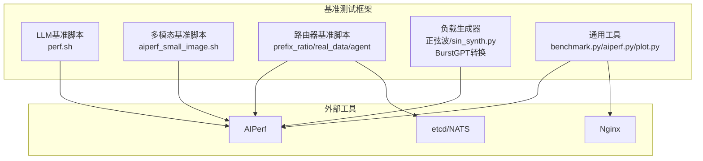
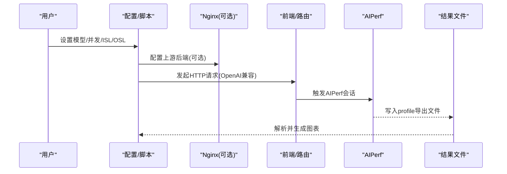
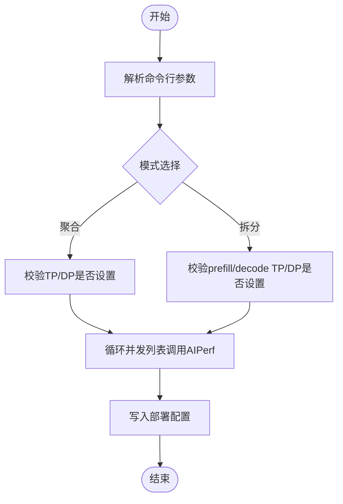
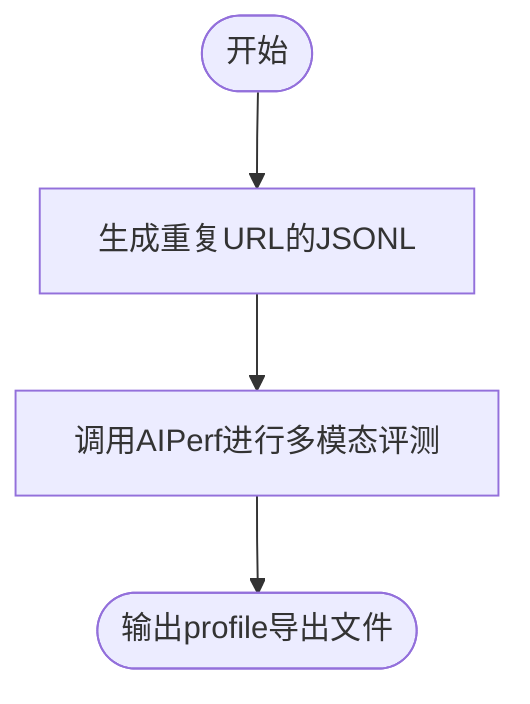
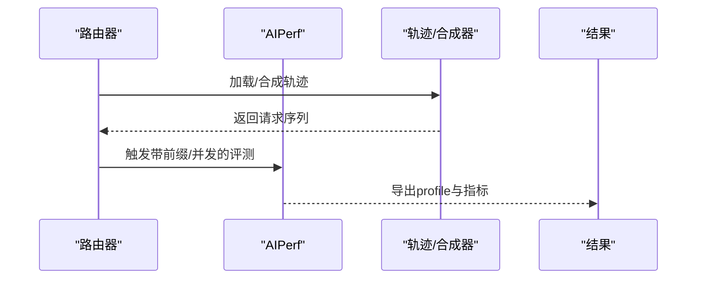
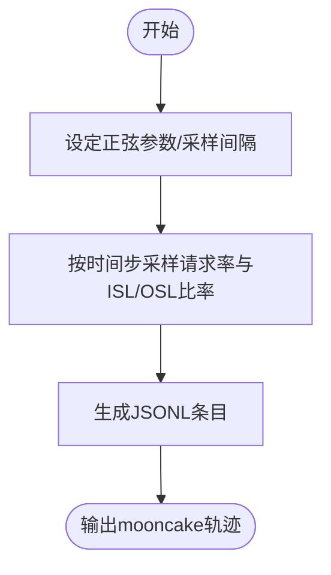
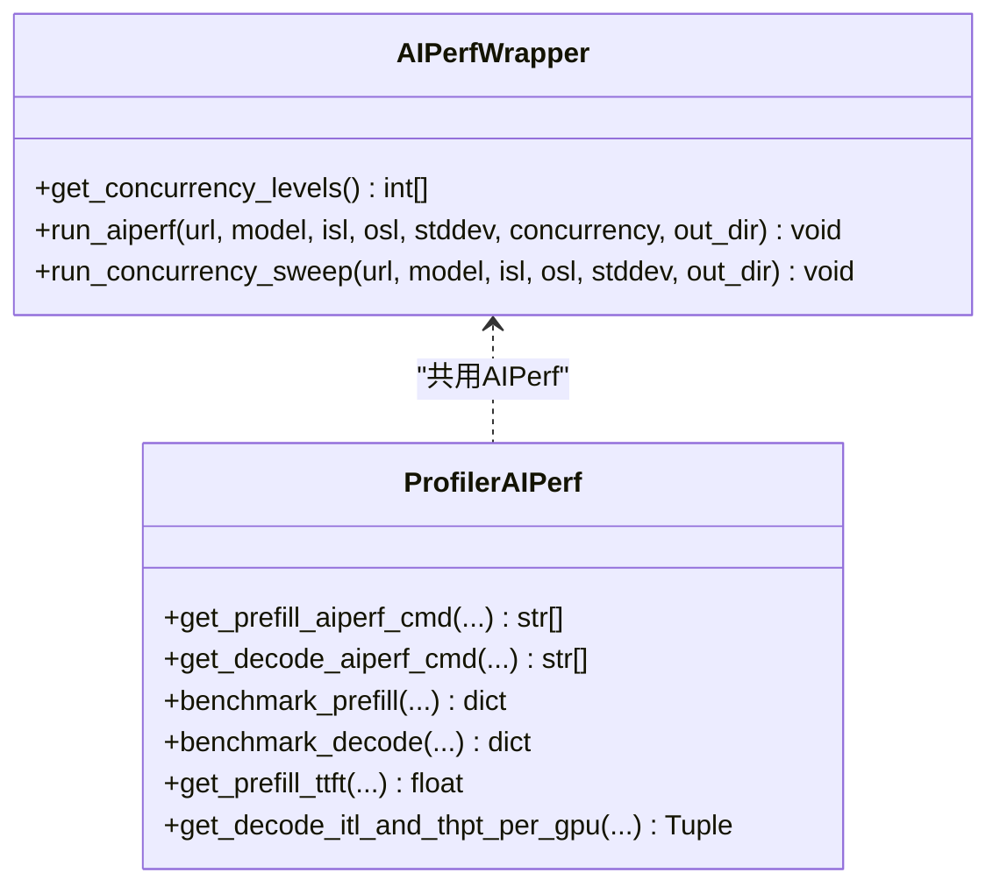
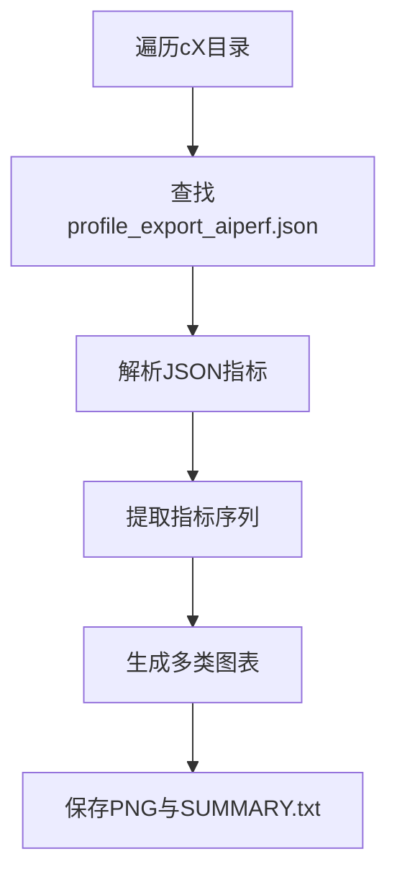
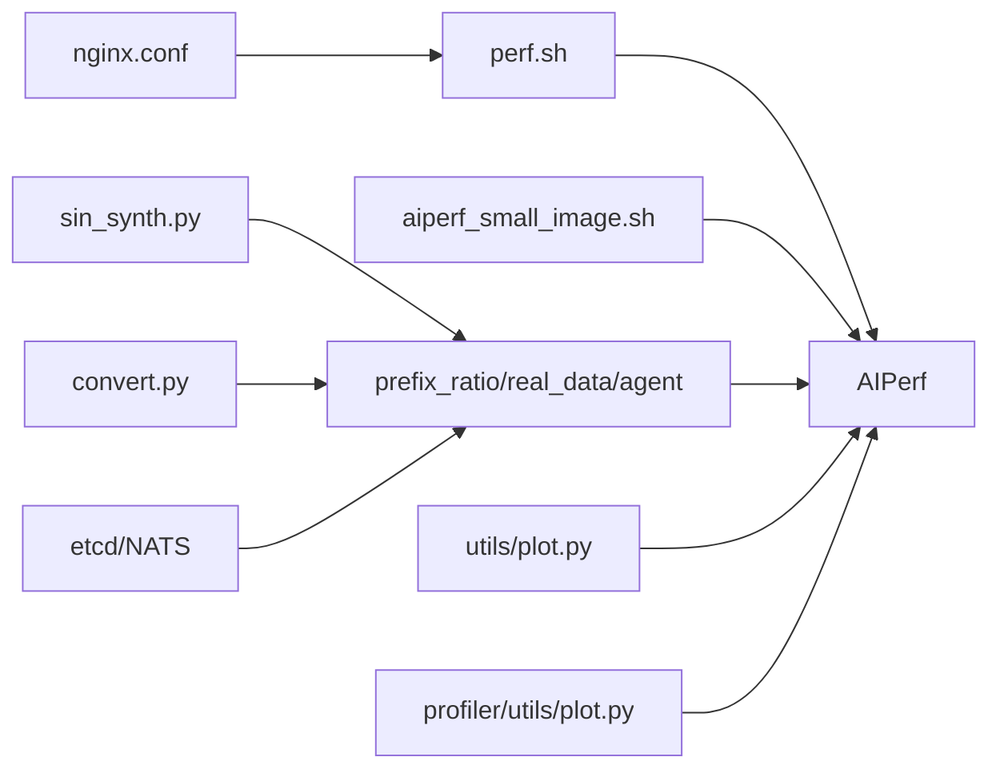

# 性能基准测试

<cite>
**本文引用的文件**
- [benchmarks/README.md](file://benchmarks/README.md)
- [benchmarks/llm/README.md](file://benchmarks/llm/README.md)
- [benchmarks/llm/perf.sh](file://benchmarks/llm/perf.sh)
- [benchmarks/llm/nginx.conf](file://benchmarks/llm/nginx.conf)
- [benchmarks/multimodal/image/aiperf_small_image.sh](file://benchmarks/multimodal/image/aiperf_small_image.sh)
- [benchmarks/router/README.md](file://benchmarks/router/README.md)
- [benchmarks/router/prefix_ratio_benchmark.py](file://benchmarks/router/prefix_ratio_benchmark.py)
- [benchmarks/router/real_data_benchmark.py](file://benchmarks/router/real_data_benchmark.py)
- [benchmarks/router/agent_benchmark.py](file://benchmarks/router/agent_benchmark.py)
- [benchmarks/sin_load_generator/README.md](file://benchmarks/sin_load_generator/README.md)
- [benchmarks/burstgpt_loadgen/README.md](file://benchmarks/burstgpt_loadgen/README.md)
- [benchmarks/utils/benchmark.py](file://benchmarks/utils/benchmark.py)
- [benchmarks/utils/aiperf.py](file://benchmarks/utils/aiperf.py)
- [benchmarks/utils/plot.py](file://benchmarks/utils/plot.py)
- [benchmarks/profiler/utils/aiperf.py](file://benchmarks/profiler/utils/aiperf.py)
- [benchmarks/profiler/utils/plot.py](file://benchmarks/profiler/utils/plot.py)
- [benchmarks/profiler/profile_endpoint.py](file://benchmarks/profiler/profile_endpoint.py)
</cite>

## 目录
1. [简介](#简介)
2. [项目结构](#项目结构)
3. [核心组件](#核心组件)
4. [架构总览](#架构总览)
5. [详细组件分析](#详细组件分析)
6. [依赖关系分析](#依赖关系分析)
7. [性能考量](#性能考量)
8. [故障排查指南](#故障排查指南)
9. [结论](#结论)
10. [附录](#附录)

## 简介
本指南面向在Dynamo平台上进行性能基准测试的工程师与研究者，系统讲解如何使用AIPerf工具对LLM与多模态推理进行端到端性能评估；如何配置与运行正弦波与突发型负载生成器；如何开展路由器（KV缓存路由）的前缀比例与真实轨迹基准测试；以及如何通过性能脚本与可视化工具生成可复现的实验报告。文档同时覆盖测试环境准备、执行流程与结果分析方法，并给出不同硬件配置下的性能基准参考与对比思路。

## 项目结构
本仓库的基准测试能力主要集中在benchmarks目录下，按功能划分为：
- LLM与多模态性能脚本：提供一键式AIPerf调用、Nginx代理与绘图工具
- 路由器基准：前缀比例、真实轨迹与并发会话三类场景
- 负载生成器：正弦波与BurstGPT轨迹转换
- 工具与可视化：统一的AIPerf封装、并发扫描、结果解析与绘图

**图表来源**
- [benchmarks/llm/perf.sh](file://benchmarks/llm/perf.sh#L1-L271)
- [benchmarks/multimodal/image/aiperf_small_image.sh](file://benchmarks/multimodal/image/aiperf_small_image.sh#L1-L52)
- [benchmarks/router/prefix_ratio_benchmark.py](file://benchmarks/router/prefix_ratio_benchmark.py#L1-L335)
- [benchmarks/router/real_data_benchmark.py](file://benchmarks/router/real_data_benchmark.py#L1-L326)
- [benchmarks/router/agent_benchmark.py](file://benchmarks/router/agent_benchmark.py#L1-L270)
- [benchmarks/sin_load_generator/README.md](file://benchmarks/sin_load_generator/README.md#L1-L123)
- [benchmarks/burstgpt_loadgen/README.md](file://benchmarks/burstgpt_loadgen/README.md#L1-L105)
- [benchmarks/utils/benchmark.py](file://benchmarks/utils/benchmark.py#L1-L103)
- [benchmarks/utils/aiperf.py](file://benchmarks/utils/aiperf.py#L1-L114)
- [benchmarks/utils/plot.py](file://benchmarks/utils/plot.py#L1-L465)

**章节来源**
- [benchmarks/README.md](file://benchmarks/README.md#L1-L75)
- [benchmarks/llm/README.md](file://benchmarks/llm/README.md#L1-L16)

## 核心组件
- AIPerf封装与并发扫描：统一命令行参数、并发级别读取与子进程调用，支持预填充与解码两类指标提取
- LLM基准脚本：以shell脚本形式批量调用AIPerf，支持聚合/拆分并行度配置、并发列表与输出目录管理
- 多模态基准脚本：针对图像输入的多模态对话场景，构造重复URL数据集并调用AIPerf
- 路由器基准：前缀比例、真实轨迹与并发会话三类脚本，均基于AIPerf并输出profile导出文件
- 负载生成器：正弦波合成器与BurstGPT CSV到mooncake JSONL的转换器
- 可视化与结果解析：从AIPerf导出文件中抽取指标，绘制时序曲线与效率散点图

**章节来源**
- [benchmarks/utils/aiperf.py](file://benchmarks/utils/aiperf.py#L1-L114)
- [benchmarks/llm/perf.sh](file://benchmarks/llm/perf.sh#L1-L271)
- [benchmarks/multimodal/image/aiperf_small_image.sh](file://benchmarks/multimodal/image/aiperf_small_image.sh#L1-L52)
- [benchmarks/router/prefix_ratio_benchmark.py](file://benchmarks/router/prefix_ratio_benchmark.py#L1-L335)
- [benchmarks/router/real_data_benchmark.py](file://benchmarks/router/real_data_benchmark.py#L1-L326)
- [benchmarks/router/agent_benchmark.py](file://benchmarks/router/agent_benchmark.py#L1-L270)
- [benchmarks/sin_load_generator/README.md](file://benchmarks/sin_load_generator/README.md#L1-L123)
- [benchmarks/burstgpt_loadgen/README.md](file://benchmarks/burstgpt_loadgen/README.md#L1-L105)
- [benchmarks/utils/plot.py](file://benchmarks/utils/plot.py#L1-L465)

## 架构总览
下图展示了从“负载生成/配置”到“AIPerf采集指标”再到“结果解析与可视化”的完整链路，以及与etcd/NATS、Nginx等基础设施的交互。

**图表来源**
- [benchmarks/llm/nginx.conf](file://benchmarks/llm/nginx.conf#L1-L39)
- [benchmarks/llm/perf.sh](file://benchmarks/llm/perf.sh#L217-L241)
- [benchmarks/utils/aiperf.py](file://benchmarks/utils/aiperf.py#L46-L99)
- [benchmarks/utils/plot.py](file://benchmarks/utils/plot.py#L12-L54)

## 详细组件分析

### LLM性能基准脚本（perf.sh）
- 功能：以AIPerf驱动的LLM性能扫描，支持聚合/拆分并行度（TP/DP）、ISL/OSL、并发列表与部署标签
- 关键点：
  - 并发列表通过命令行传入，脚本逐级调用AIPerf并写入独立工件目录
  - 支持聚合模式（需设置TP/DP）与拆分模式（需设置prefill/decode TP/DP）
  - 将部署配置写入deployment_config.json，便于后续对比
- 使用建议：
  - 在容器或K8s环境中确保目标URL可达
  - 合理设置ISL/OSL以贴合业务场景（如对话为长上下文）

**图表来源**
- [benchmarks/llm/perf.sh](file://benchmarks/llm/perf.sh#L61-L129)
- [benchmarks/llm/perf.sh](file://benchmarks/llm/perf.sh#L212-L242)

**章节来源**
- [benchmarks/llm/perf.sh](file://benchmarks/llm/perf.sh#L1-L271)

### 多模态性能基准脚本（aiperf_small_image.sh）
- 功能：针对图像输入的多模态对话场景，构造重复URL数据集并调用AIPerf
- 关键点：
  - 通过--model与--concurrency控制模型与并发
  - 明确提示重复URL可能触发缓存影响，需按实验需求调整缓存策略
- 使用建议：
  - 评估图像预处理与编码开销时，可降低并发以避免GPU拥塞
  - 如需真实随机性，应避免重复URL

**图表来源**
- [benchmarks/multimodal/image/aiperf_small_image.sh](file://benchmarks/multimodal/image/aiperf_small_image.sh#L14-L51)

**章节来源**
- [benchmarks/multimodal/image/aiperf_small_image.sh](file://benchmarks/multimodal/image/aiperf_small_image.sh#L1-L52)

### 路由器性能测试工具
- 前缀比例测试（prefix_ratio_benchmark.py）
  - 通过合成输入长度与前缀比例，评估KV缓存共享带来的TTFT/ITL收益
  - 支持多种子与多URL并行测试，自动保存结果与图表
- 真实数据基准（real_data_benchmark.py）
  - 基于mooncake风格轨迹，支持速度倍数、前缀长度倍数、根树复制等合成参数
  - 可直接使用原始轨迹或注入expected_output_tokens
- 并发会话基准（agent_benchmark.py）
  - 基于多轮对话轨迹，以并发模式维持多会话，保持每会话内顺序性
  - 支持延迟覆盖（含移除延迟），用于压力测试

**图表来源**
- [benchmarks/router/prefix_ratio_benchmark.py](file://benchmarks/router/prefix_ratio_benchmark.py#L26-L87)
- [benchmarks/router/real_data_benchmark.py](file://benchmarks/router/real_data_benchmark.py#L24-L55)
- [benchmarks/router/agent_benchmark.py](file://benchmarks/router/agent_benchmark.py#L47-L84)

**章节来源**
- [benchmarks/router/README.md](file://benchmarks/router/README.md#L1-L323)
- [benchmarks/router/prefix_ratio_benchmark.py](file://benchmarks/router/prefix_ratio_benchmark.py#L1-L335)
- [benchmarks/router/real_data_benchmark.py](file://benchmarks/router/real_data_benchmark.py#L1-L326)
- [benchmarks/router/agent_benchmark.py](file://benchmarks/router/agent_benchmark.py#L1-L270)

### 负载生成器
- 正弦波负载生成器（sin_synth.py）
  - 生成符合正弦函数变化的请求速率与ISL/OSL比例，输出mooncake风格JSONL
  - 参数包括块大小、总块数、时间窗口、采样间隔、最小/最大请求速率与周期、两套ISL/OSL组合及比率周期等
- BurstGPT轨迹转换器（convert.py）
  - 将CSV格式的对话日志转换为mooncake JSONL，支持过滤、截断、加速与哈希块生成

**图表来源**
- [benchmarks/sin_load_generator/README.md](file://benchmarks/sin_load_generator/README.md#L36-L86)

**章节来源**
- [benchmarks/sin_load_generator/README.md](file://benchmarks/sin_load_generator/README.md#L1-L123)
- [benchmarks/burstgpt_loadgen/README.md](file://benchmarks/burstgpt_loadgen/README.md#L1-L105)

### AIPerf工具与并发扫描
- 统一封装（benchmarks/utils/aiperf.py）
  - 从环境变量读取并发级别，默认值为1,2,5,10,50,100,250
  - 通过子进程调用aiperf profile，支持ISL/OSL、流式响应、额外输入字段与随机种子
- LLM端到端封装（benchmarks/profiler/utils/aiperf.py）
  - 提供预填充与解码专用命令构建函数，支持DEP感知的TTFT测量与解码ITL/吞吐提取
  - 自动解析profile_export_aiperf.json并返回结构化结果

**图表来源**
- [benchmarks/utils/aiperf.py](file://benchmarks/utils/aiperf.py#L13-L114)
- [benchmarks/profiler/utils/aiperf.py](file://benchmarks/profiler/utils/aiperf.py#L40-L154)

**章节来源**
- [benchmarks/utils/aiperf.py](file://benchmarks/utils/aiperf.py#L1-L114)
- [benchmarks/profiler/utils/aiperf.py](file://benchmarks/profiler/utils/aiperf.py#L1-L374)

### 结果解析与可视化
- 通用解析与绘图（benchmarks/utils/plot.py）
  - 解析cX目录下的profile_export_aiperf.json，提取并发序列与指标（如ITL、TTFT、吞吐）
  - 生成P50/平均ITL、请求吞吐、平均TTFT随并发变化的曲线，以及tok/s/user vs tok/s/GPU效率图
- 专业插值与帕累托分析（benchmarks/profiler/utils/plot.py）
  - 预填充TTFT与吞吐随ISL的二次拟合曲线
  - 解码ITL与吞吐随KV使用率与上下文长度的3D表面插值
  - 成本-SLA联合分析（按不同TTFT SLA计算成本）

**图表来源**
- [benchmarks/utils/plot.py](file://benchmarks/utils/plot.py#L12-L54)
- [benchmarks/utils/plot.py](file://benchmarks/utils/plot.py#L263-L432)

**章节来源**
- [benchmarks/utils/plot.py](file://benchmarks/utils/plot.py#L1-L465)
- [benchmarks/profiler/utils/plot.py](file://benchmarks/profiler/utils/plot.py#L1-L347)

## 依赖关系分析
- 组件耦合
  - LLM与多模态脚本均依赖AIPerf；路由器脚本依赖mooncake轨迹与AIPerf
  - 负载生成器产出轨迹供路由器与LLM脚本复用
  - 可视化模块依赖AIPerf导出文件结构
- 外部依赖
  - etcd/NATS：路由器基准需要协调服务
  - Nginx：作为可选前置代理，便于多后端负载均衡
  - AIPerf：统一的性能评测CLI

**图表来源**
- [benchmarks/llm/perf.sh](file://benchmarks/llm/perf.sh#L217-L241)
- [benchmarks/multimodal/image/aiperf_small_image.sh](file://benchmarks/multimodal/image/aiperf_small_image.sh#L45-L51)
- [benchmarks/router/prefix_ratio_benchmark.py](file://benchmarks/router/prefix_ratio_benchmark.py#L50-L87)
- [benchmarks/sin_load_generator/README.md](file://benchmarks/sin_load_generator/README.md#L8-L123)
- [benchmarks/burstgpt_loadgen/README.md](file://benchmarks/burstgpt_loadgen/README.md#L1-L105)
- [benchmarks/utils/plot.py](file://benchmarks/utils/plot.py#L12-L54)
- [benchmarks/profiler/utils/plot.py](file://benchmarks/profiler/utils/plot.py#L38-L78)
- [benchmarks/llm/nginx.conf](file://benchmarks/llm/nginx.conf#L24-L37)
- [benchmarks/router/README.md](file://benchmarks/router/README.md#L13-L36)

**章节来源**
- [benchmarks/llm/nginx.conf](file://benchmarks/llm/nginx.conf#L1-L39)
- [benchmarks/router/README.md](file://benchmarks/router/README.md#L1-L323)

## 性能考量
- 并发与资源配比
  - 合理设置并发与GPU数量，避免过载导致吞吐下降与尾延迟上升
  - 对于解码阶段，关注ITL与吞吐的权衡；对于预填充阶段，关注TTFT与吞吐/GPU
- 负载特性
  - 正弦波与突发轨迹能模拟真实波动场景；结合多模态输入可评估端到端瓶颈
- 缓存与前缀共享
  - 路由器前缀比例测试可量化KV缓存共享收益；在多轮对话与长上下文中尤为显著
- 可观测性
  - 使用Nginx代理时注意连接数与超时设置；必要时开启etcd/NATS以保障路由一致性

[本节为通用指导，不直接分析具体文件]

## 故障排查指南
- 路由器基准常见问题
  - 工作节点无法启动：检查CUDA可见设备与GPU可用性
  - 路由器连接失败：确认端口与服务状态
  - 基准超时：降低并发或减少请求数
  - OOM错误：减小批内最大令牌数或模型长度
- LLM/多模态基准
  - AIPerf失败：检查模型名、端点类型与额外输入字段
  - Nginx代理异常：核对上游后端与连接参数
- 结果缺失
  - 确认profile导出文件存在且路径正确；检查并发目录命名规范（cX）

**章节来源**
- [benchmarks/router/README.md](file://benchmarks/router/README.md#L317-L323)

## 结论
通过统一的AIPerf封装、多样化的负载生成器与完善的可视化工具，Dynamo提供了从LLM到多模态、从路由器到端到端的全栈性能基准能力。建议在标准化的硬件配置上，先以正弦波与真实轨迹验证系统稳定性，再逐步扩展到并发会话与多模态场景，最终形成可复现的性能报告与对比分析。

[本节为总结性内容，不直接分析具体文件]

## 附录

### 测试环境准备清单
- 基础设施
  - etcd与NATS（路由器基准必需）
  - Nginx（可选，用于多后端负载均衡）
- 运行时
  - 安装aiperf与所需Python包
  - 准备目标模型与tokenizer
- 路由器专用
  - vLLM/TrtLLM/SGLang引擎或mocker引擎
  - 前端路由（KV缓存模式）与可选的预填充路由

**章节来源**
- [benchmarks/router/README.md](file://benchmarks/router/README.md#L8-L36)
- [benchmarks/llm/nginx.conf](file://benchmarks/llm/nginx.conf#L1-L39)

### 测试执行流程（示例）
- LLM基准
  - 配置perf.sh参数（模型、ISL/OSL、并发、并行度）
  - 执行脚本，等待AIPerf完成并生成工件目录
  - 使用utils/plot.py生成图表
- 多模态基准
  - 运行aiperf_small_image.sh，指定模型与并发
  - 解析导出文件并生成可视化
- 路由器基准
  - 启动工作节点与前端路由
  - 运行prefix_ratio/real_data/agent基准脚本
  - 生成结果与图表

**章节来源**
- [benchmarks/llm/perf.sh](file://benchmarks/llm/perf.sh#L205-L242)
- [benchmarks/multimodal/image/aiperf_small_image.sh](file://benchmarks/multimodal/image/aiperf_small_image.sh#L45-L51)
- [benchmarks/router/prefix_ratio_benchmark.py](file://benchmarks/router/prefix_ratio_benchmark.py#L168-L198)
- [benchmarks/router/real_data_benchmark.py](file://benchmarks/router/real_data_benchmark.py#L307-L320)
- [benchmarks/router/agent_benchmark.py](file://benchmarks/router/agent_benchmark.py#L137-L173)

### 结果分析方法
- 指标提取
  - 从profile_export_aiperf.json中读取TTFT、ITL、吞吐等指标
  - 计算tok/s/user与tok/s/GPU，绘制效率散点图
- 可视化
  - 时序曲线：ITL/吞吐随并发变化
  - 效率图：用户体验与资源效率权衡
  - 插值与帕累托：预填充/解码性能面与成本-SLA联合分析

**章节来源**
- [benchmarks/utils/plot.py](file://benchmarks/utils/plot.py#L12-L54)
- [benchmarks/utils/plot.py](file://benchmarks/utils/plot.py#L263-L432)
- [benchmarks/profiler/utils/plot.py](file://benchmarks/profiler/utils/plot.py#L38-L78)
- [benchmarks/profiler/utils/plot.py](file://benchmarks/profiler/utils/plot.py#L136-L194)
- [benchmarks/profiler/utils/plot.py](file://benchmarks/profiler/utils/plot.py#L196-L297)

### 不同硬件配置下的性能基准与对比
- 建议在相同ISL/OSL、相同并发与相同模型下，记录不同GPU数量、并行度组合下的吞吐、ITL与成本
- 使用效率图与成本-SLA联合分析，识别最优性价比配置
- 对比聚合与拆分（prefill/decode）两种部署形态的TTFT与吞吐差异

[本节为通用指导，不直接分析具体文件]