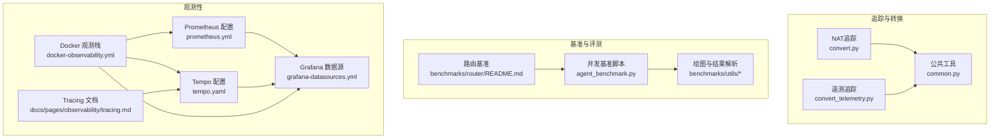
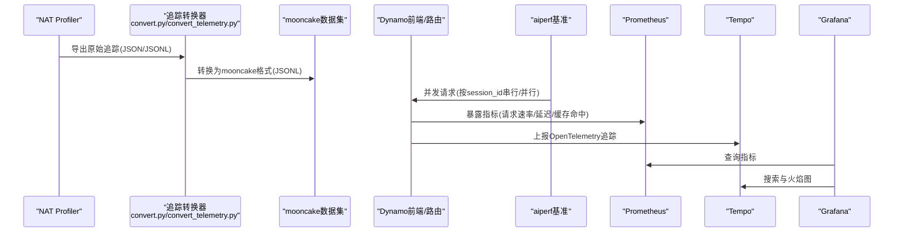
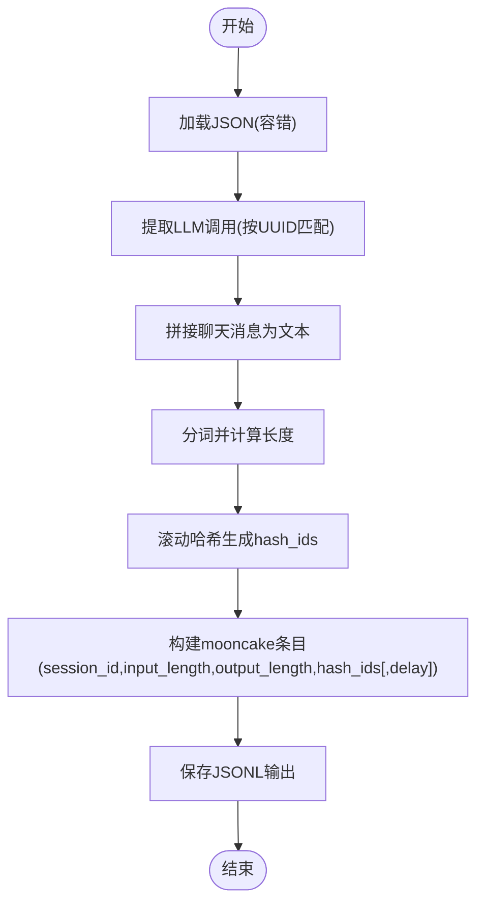
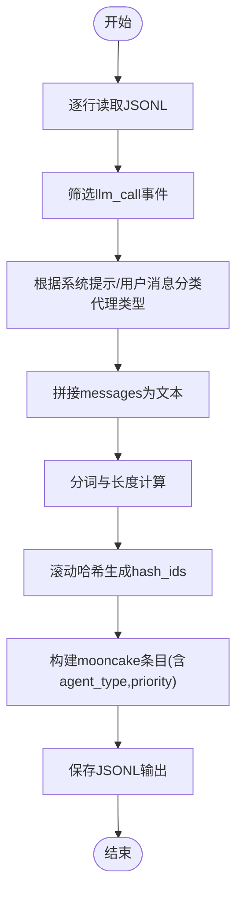
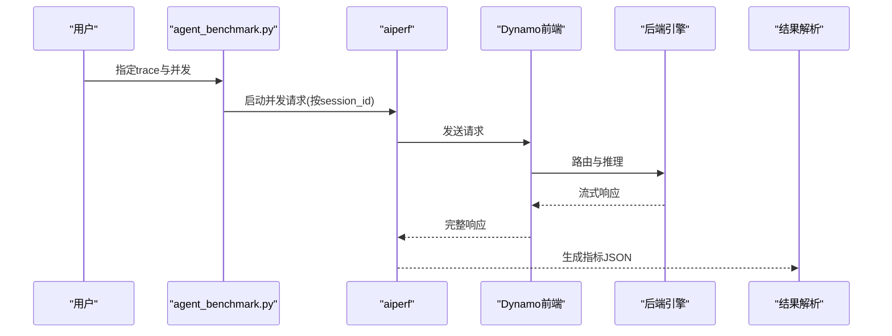
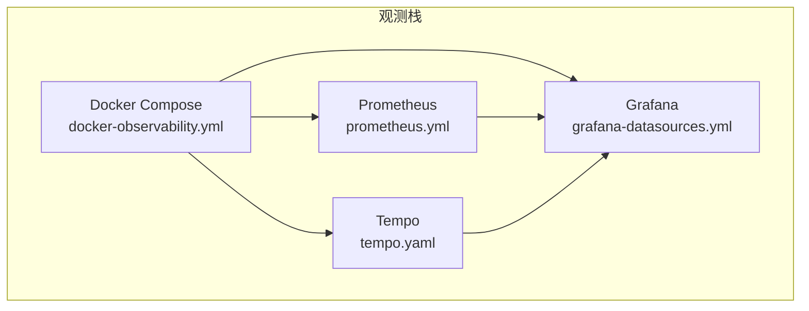
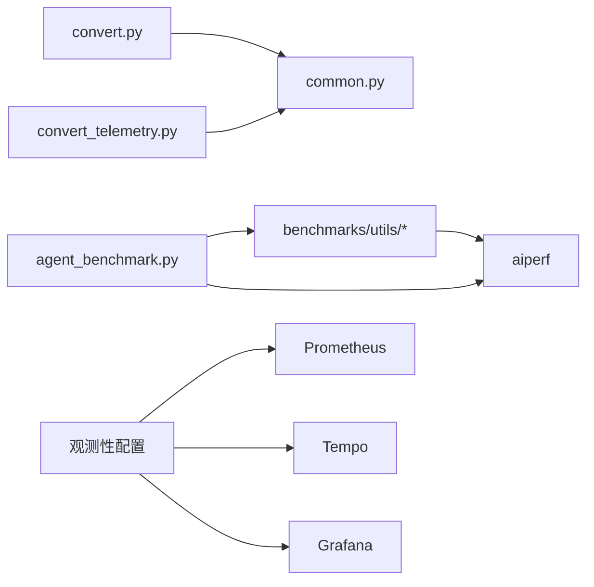

# 网络追踪分析

<cite>
**本文引用的文件**
- [README.md](file://benchmarks/nat_trace/README.md)
- [common.py](file://benchmarks/nat_trace/common.py)
- [convert.py](file://benchmarks/nat_trace/convert.py)
- [convert_telemetry.py](file://benchmarks/nat_trace/convert_telemetry.py)
- [README.md](file://benchmarks/router/README.md)
- [README.md](file://deploy/observability/README.md)
- [prometheus.yml](file://deploy/observability/prometheus.yml)
- [tempo.yaml](file://deploy/observability/tempo.yaml)
- [grafana-datasources.yml](file://deploy/observability/grafana-datasources.yml)
- [docker-observability.yml](file://deploy/docker-observability.yml)
- [tracing.md](file://docs/pages/observability/tracing.md)
- [README.md](file://docs/pages/observability/README.md)
- [README.md](file://benchmarks/profiler/README.md)
- [README.md](file://benchmarks/llm/README.md)
- [README.md](file://benchmarks/utils/README.md)
- [plot.py](file://benchmarks/utils/plot.py)
- [aiperf.py](file://benchmarks/utils/aiperf.py)
- [agent_benchmark.py](file://benchmarks/router/agent_benchmark.py)
- [benchmark_serving.py](file://examples/backends/sglang/slurm_jobs/scripts/vllm/benchmark_serving.py)
- [README.md](file://tests/fault_tolerance/hardware/fault_injection_service/README.md)
- [main.py](file://tests/fault_tolerance/hardware/fault_injection_service/api_service/main.py)
- [README.md](file://tests/fault_tolerance/deploy/README.md)
- [parse_results.py](file://tests/fault_tolerance/deploy/parse_results.py)
</cite>

## 目录
1. [简介](#简介)
2. [项目结构](#项目结构)
3. [核心组件](#核心组件)
4. [架构总览](#架构总览)
5. [详细组件分析](#详细组件分析)
6. [依赖关系分析](#依赖关系分析)
7. [性能考量](#性能考量)
8. [故障排查指南](#故障排查指南)
9. [结论](#结论)
10. [附录](#附录)

## 简介
本指南面向Dynamo网络追踪与性能分析场景，聚焦以下目标：
- 使用NAT追踪工具采集与转换追踪数据，支持多轮对话与前缀缓存基准。
- 介绍通用转换器与遥测转换器的使用方法，实现从NAT与OpenAI风格遥测到统一mooncake格式的转换。
- 提供网络延迟分析方法，涵盖端到端延迟、首字延迟、令牌间延迟等指标的提取与统计。
- 给出网络性能优化建议，包括带宽利用、延迟优化与丢包处理策略。
- 基于真实trace数据的实际案例与故障排查方法，结合可视化与报告生成流程。

## 项目结构
围绕网络追踪分析，相关能力分布在如下模块：
- 追踪数据采集与转换：benchmarks/nat_trace（NAT追踪与遥测转换）
- 路由与KV缓存基准：benchmarks/router（基于mooncake trace的并发与前缀共享测试）
- 观测性栈：deploy/observability（Prometheus、Tempo、Grafana）、docs/pages/observability（Tracing文档）
- 性能度量与可视化：benchmarks/utils（绘图与aiperf封装）、examples与tests中的指标解析脚本

**图表来源**
- [convert.py](file://benchmarks/nat_trace/convert.py#L1-L422)
- [convert_telemetry.py](file://benchmarks/nat_trace/convert_telemetry.py#L1-L292)
- [common.py](file://benchmarks/nat_trace/common.py#L1-L44)
- [README.md](file://benchmarks/router/README.md#L1-L323)
- [agent_benchmark.py](file://benchmarks/router/agent_benchmark.py#L1-L292)
- [prometheus.yml](file://deploy/observability/prometheus.yml#L1-L63)
- [tempo.yaml](file://deploy/observability/tempo.yaml#L1-L37)
- [grafana-datasources.yml](file://deploy/observability/grafana-datasources.yml#L1-L24)
- [docker-observability.yml](file://deploy/docker-observability.yml#L101-L136)
- [tracing.md](file://docs/pages/observability/tracing.md#L113-L157)

**章节来源**
- [README.md](file://benchmarks/nat_trace/README.md#L1-L173)
- [README.md](file://benchmarks/router/README.md#L1-L323)
- [README.md](file://deploy/observability/README.md#L1-L4)

## 核心组件
- NAT追踪转换器：将NAT profiler输出的all_requests_profiler_traces.json转换为mooncake格式，保留会话序列化与前缀哈希。
- 遥测转换器：将OpenAI风格遥测JSONL转换为mooncake格式，识别代理类型与优先级。
- 公共工具：提供分词器与滚动哈希器，用于文本到token长度与hash_ids的映射。
- 路由基准：支持基于mooncake trace的并发与前缀共享评测，生成端到端与中间阶段指标。
- 观测性栈：Prometheus抓取Dynamo组件指标，Tempo接收OpenTelemetry追踪，Grafana可视化与查询。

**章节来源**
- [README.md](file://benchmarks/nat_trace/README.md#L1-L173)
- [common.py](file://benchmarks/nat_trace/common.py#L13-L44)
- [README.md](file://benchmarks/router/README.md#L274-L303)
- [prometheus.yml](file://deploy/observability/prometheus.yml#L20-L50)
- [tempo.yaml](file://deploy/observability/tempo.yaml#L1-L37)
- [grafana-datasources.yml](file://deploy/observability/grafana-datasources.yml#L18-L24)

## 架构总览
下图展示从追踪采集、转换、评测到可视化的完整链路：

**图表来源**
- [convert.py](file://benchmarks/nat_trace/convert.py#L203-L296)
- [convert_telemetry.py](file://benchmarks/nat_trace/convert_telemetry.py#L161-L199)
- [README.md](file://benchmarks/router/README.md#L166-L272)
- [prometheus.yml](file://deploy/observability/prometheus.yml#L39-L49)
- [tempo.yaml](file://deploy/observability/tempo.yaml#L8-L14)
- [tracing.md](file://docs/pages/observability/tracing.md#L113-L157)

## 详细组件分析

### NAT追踪转换器
功能要点：
- 解析NAT profiler的LLM_START/LLM_END事件，提取输入消息与token用量。
- 将多轮对话按request_number生成会话ID，确保同一会话内turn串行执行。
- 使用分词器与滚动哈希器生成hash_ids与input_length，支撑前缀缓存与KV路由。
- 支持跳过请求数、限制数量、添加turn间延迟字段以模拟真实时序。

**图表来源**
- [convert.py](file://benchmarks/nat_trace/convert.py#L76-L121)
- [convert.py](file://benchmarks/nat_trace/convert.py#L123-L179)
- [convert.py](file://benchmarks/nat_trace/convert.py#L182-L201)
- [convert.py](file://benchmarks/nat_trace/convert.py#L203-L296)
- [common.py](file://benchmarks/nat_trace/common.py#L13-L44)

**章节来源**
- [README.md](file://benchmarks/nat_trace/README.md#L11-L88)
- [convert.py](file://benchmarks/nat_trace/convert.py#L26-L74)
- [convert.py](file://benchmarks/nat_trace/convert.py#L299-L325)

### 遥测转换器
功能要点：
- 仅处理llm_call事件，过滤tool_call等非LLM事件。
- 从系统提示或用户消息中识别代理类型（如deep_coordinator、research_worker等）。
- 提取输出token用量，生成mooncake条目并标注优先级。

**图表来源**
- [convert_telemetry.py](file://benchmarks/nat_trace/convert_telemetry.py#L62-L74)
- [convert_telemetry.py](file://benchmarks/nat_trace/convert_telemetry.py#L110-L125)
- [convert_telemetry.py](file://benchmarks/nat_trace/convert_telemetry.py#L127-L148)
- [convert_telemetry.py](file://benchmarks/nat_trace/convert_telemetry.py#L161-L199)

**章节来源**
- [README.md](file://benchmarks/nat_trace/README.md#L90-L152)
- [convert_telemetry.py](file://benchmarks/nat_trace/convert_telemetry.py#L31-L59)

### 路由与并发基准
- 支持基于mooncake trace的并发基准（agent_benchmark），通过session_id控制串行与并行。
- 支持前缀比例扫描与真实trace评测，评估KV缓存路由收益。
- 输出端到端延迟、首字延迟、令牌间延迟等指标，便于对比不同路由策略。

**图表来源**
- [agent_benchmark.py](file://benchmarks/router/agent_benchmark.py#L236-L269)
- [README.md](file://benchmarks/router/README.md#L249-L272)
- [README.md](file://benchmarks/router/README.md#L274-L303)

**章节来源**
- [README.md](file://benchmarks/router/README.md#L47-L272)
- [agent_benchmark.py](file://benchmarks/router/agent_benchmark.py#L1-L292)

### 观测性与可视化
- Prometheus抓取Dynamo前端与后端指标，支持请求速率、TTFT、ITL、缓存命中等。
- Tempo接收OTLP追踪，结合Grafana Explore进行搜索与火焰图分析。
- Docker编排一键启动观测栈，便于本地调试与演示。

**图表来源**
- [prometheus.yml](file://deploy/observability/prometheus.yml#L20-L50)
- [tempo.yaml](file://deploy/observability/tempo.yaml#L1-L37)
- [grafana-datasources.yml](file://deploy/observability/grafana-datasources.yml#L18-L24)
- [docker-observability.yml](file://deploy/docker-observability.yml#L101-L136)

**章节来源**
- [README.md](file://deploy/observability/README.md#L1-L4)
- [tracing.md](file://docs/pages/observability/tracing.md#L113-L157)

## 依赖关系分析
- 转换器依赖公共工具模块提供的分词器与滚动哈希器，保证hash_ids与长度计算的一致性。
- 路由基准依赖aiperf进行并发与吞吐评测，结果由解析脚本汇总统计。
- 观测性栈通过Docker编排统一部署，Prometheus与Tempo分别负责指标与追踪数据存储。

**图表来源**
- [convert.py](file://benchmarks/nat_trace/convert.py#L21-L23)
- [convert_telemetry.py](file://benchmarks/nat_trace/convert_telemetry.py#L19-L21)
- [common.py](file://benchmarks/nat_trace/common.py#L6-L8)
- [agent_benchmark.py](file://benchmarks/router/agent_benchmark.py#L1-L292)
- [prometheus.yml](file://deploy/observability/prometheus.yml#L20-L50)
- [tempo.yaml](file://deploy/observability/tempo.yaml#L1-L37)
- [grafana-datasources.yml](file://deploy/observability/grafana-datasources.yml#L18-L24)

**章节来源**
- [README.md](file://benchmarks/nat_trace/README.md#L1-L173)
- [README.md](file://benchmarks/router/README.md#L1-L323)
- [README.md](file://deploy/observability/README.md#L1-L4)

## 性能考量
- 延迟指标提取与统计
  - 端到端延迟（E2E）、首字延迟（TTFT）、令牌间延迟（ITL）等在评测脚本中被收集与比较。
  - 可通过aiperf参数调整并发、请求规模与标准差，观察不同负载下的延迟分布。
- 带宽与丢包仿真
  - 故障注入服务支持延迟、抖动、丢包、带宽限制与报文损坏等网络扰动，可用于评估系统鲁棒性。
- 前缀共享与KV缓存
  - 通过mooncake trace的hash_ids与session_id，验证路由对共享前缀的利用效率，提升解码阶段吞吐。

**章节来源**
- [benchmark_serving.py](file://examples/backends/sglang/slurm_jobs/scripts/vllm/benchmark_serving.py#L527-L550)
- [README.md](file://benchmarks/router/README.md#L274-L303)
- [main.py](file://tests/fault_tolerance/hardware/fault_injection_service/api_service/main.py#L889-L930)

## 故障排查指南
- 观测性问题
  - Grafana无法访问：检查端口映射与防火墙设置；确认Tempo与Prometheus数据源配置正确。
  - 无追踪可见：确认OTEL导出已启用且服务名一致；使用x-request-id在Grafana中检索。
- 基准评测问题
  - aiperf失败：查看子进程错误输出；核对模型、分词器与URL配置。
  - 结果不一致：当成功数小于错误数时，可能存在aiperf输出不完整，需重新运行或检查超时设置。
- 网络扰动问题
  - 延迟/抖动/丢包/带宽限制未生效：检查故障注入服务动作规格与相关参数配置。

**章节来源**
- [tracing.md](file://docs/pages/observability/tracing.md#L113-L157)
- [docker-observability.yml](file://deploy/docker-observability.yml#L101-L136)
- [aiperf.py](file://benchmarks/utils/aiperf.py#L80-L113)
- [parse_results.py](file://tests/fault_tolerance/deploy/parse_results.py#L435-L457)
- [main.py](file://tests/fault_tolerance/hardware/fault_injection_service/api_service/main.py#L889-L930)

## 结论
通过NAT与遥测追踪转换器，可将异构追踪统一为mooncake格式，配合路由基准与观测性栈，实现从端到端延迟到组件间通信的全链路分析。结合网络扰动仿真与可视化报告，能够系统性地定位瓶颈并制定优化策略。

## 附录
- 实战建议
  - 使用遥测转换器快速接入现有OpenAI风格遥测，自动识别代理类型与优先级。
  - 在路由基准中引入并发与延迟参数，评估不同拓扑与缓存策略的收益。
  - 利用Prometheus与Tempo的组合，建立端到端可观测闭环，持续监控关键指标。