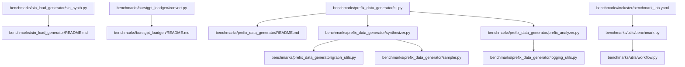
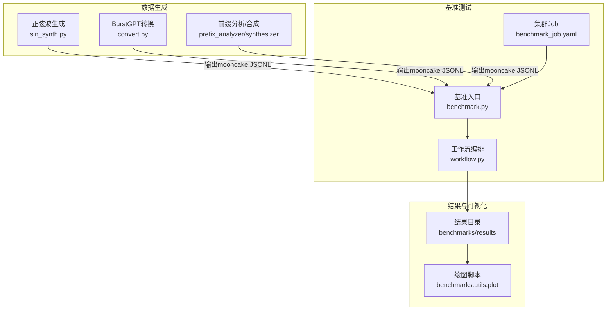
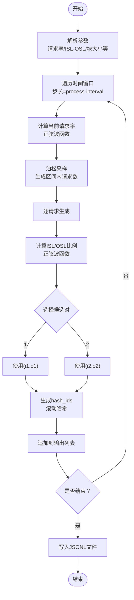
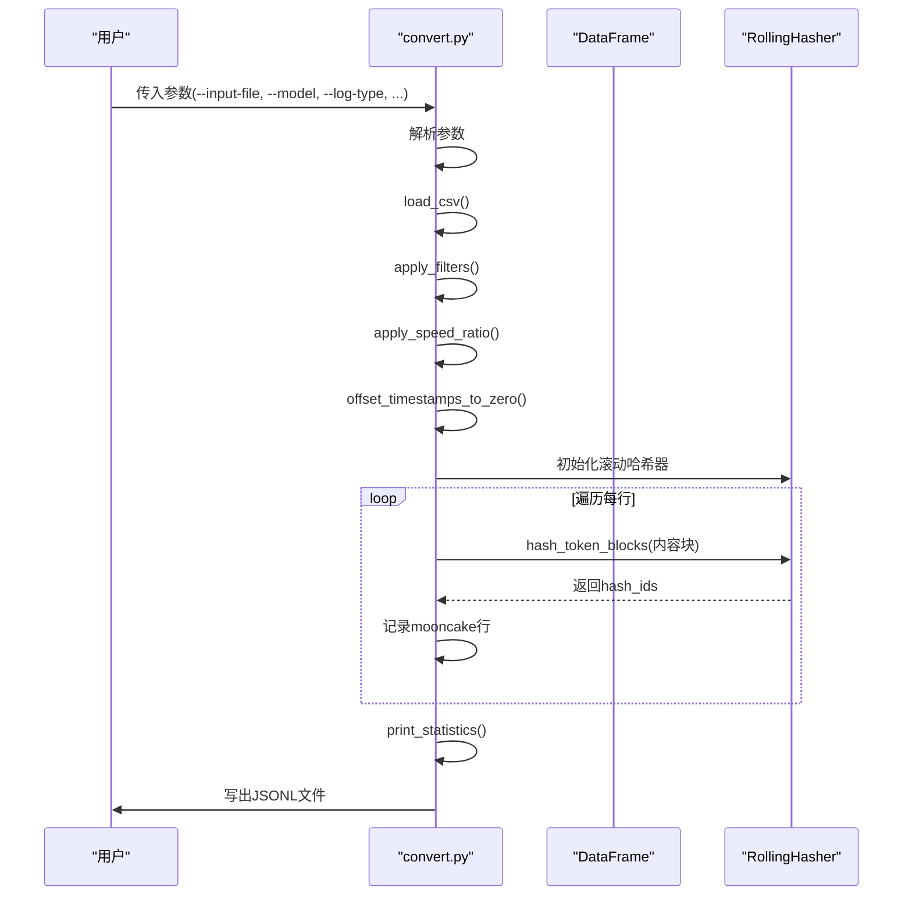
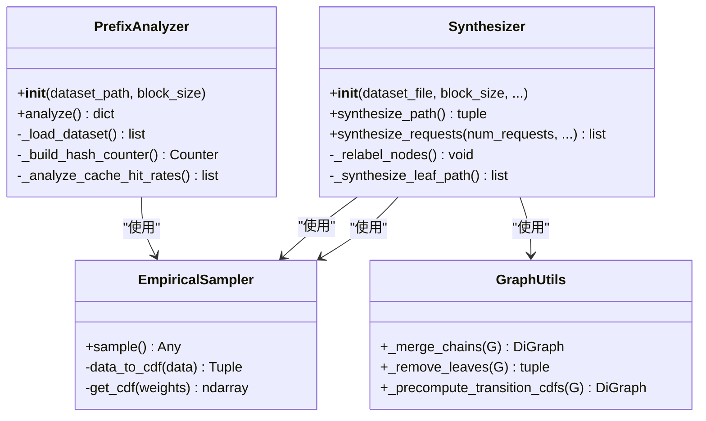
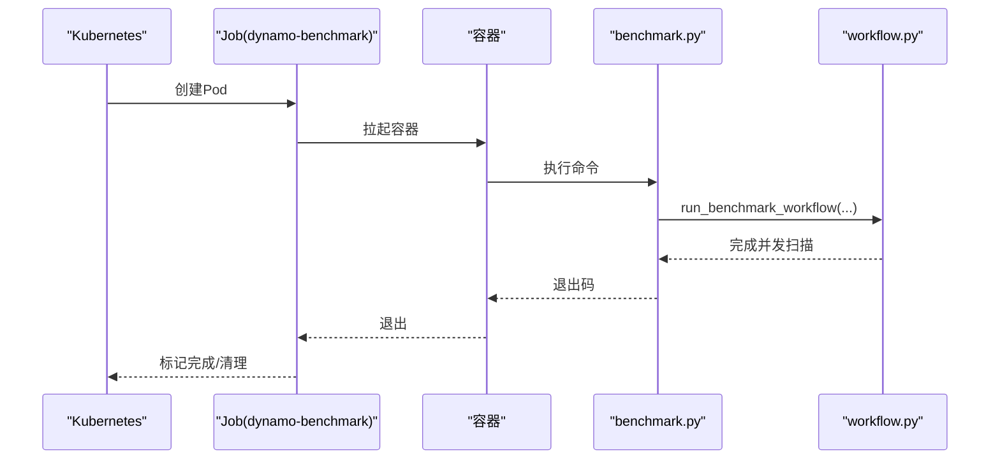
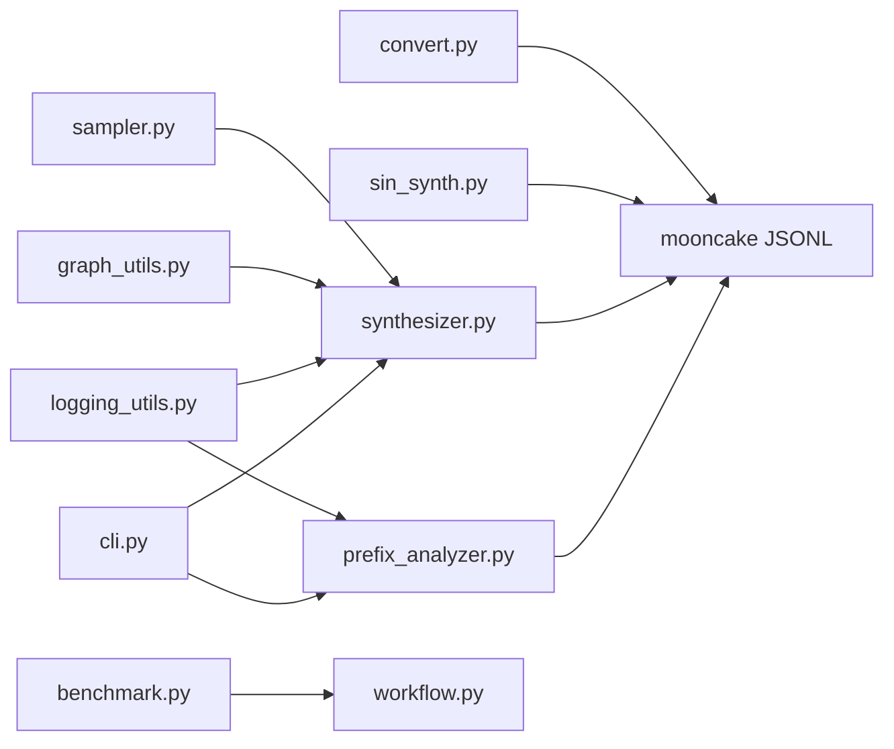

# 负载生成工具

<cite>
**本文引用的文件**
- [sin_synth.py](file://benchmarks/sin_load_generator/sin_synth.py)
- [sin_load_generator/README.md](file://benchmarks/sin_load_generator/README.md)
- [convert.py](file://benchmarks/burstgpt_loadgen/convert.py)
- [burstgpt_loadgen/README.md](file://benchmarks/burstgpt_loadgen/README.md)
- [prefix_data_generator/README.md](file://benchmarks/prefix_data_generator/README.md)
- [cli.py](file://benchmarks/prefix_data_generator/cli.py)
- [sampler.py](file://benchmarks/prefix_data_generator/sampler.py)
- [synthesizer.py](file://benchmarks/prefix_data_generator/synthesizer.py)
- [prefix_analyzer.py](file://benchmarks/prefix_data_generator/prefix_analyzer.py)
- [graph_utils.py](file://benchmarks/prefix_data_generator/graph_utils.py)
- [logging_utils.py](file://benchmarks/prefix_data_generator/logging_utils.py)
- [benchmark.py](file://benchmarks/utils/benchmark.py)
- [workflow.py](file://benchmarks/utils/workflow.py)
- [benchmark_job.yaml](file://benchmarks/incluster/benchmark_job.yaml)
- [benchmarks/README.md](file://benchmarks/README.md)
</cite>

## 目录
1. [简介](#简介)
2. [项目结构](#项目结构)
3. [核心组件](#核心组件)
4. [架构总览](#架构总览)
5. [详细组件分析](#详细组件分析)
6. [依赖关系分析](#依赖关系分析)
7. [性能考量](#性能考量)
8. [故障排查指南](#故障排查指南)
9. [结论](#结论)
10. [附录](#附录)

## 简介
本指南面向Dynamo负载生成与基准测试工具链，覆盖以下能力：
- 正弦波负载生成器（sin_synth.py）：生成具有周期性请求率与输入/输出序列长度比例的mooncake风格JSONL数据。
- BurstGPT负载生成器转换器（convert.py）：将对话日志CSV转换为mooncake风格JSONL，支持过滤、时间加速与统计输出。
- 前缀数据生成器（datagen）：基于trace文件进行分析（Prefix Analyzer）与合成（Synthesizer），包含采样器与图工具。
- 集群内基准测试作业（benchmark_job.yaml）：在Kubernetes中运行基准测试Job，调用benchmarks.utils.benchmark模块。
- 负载测试策略与监控：提供稳定、突发与混合负载的生成思路，以及结果收集与可视化建议。

## 项目结构
该工具链位于benchmarks目录下，按功能划分为：
- sin_load_generator：正弦波负载生成
- burstgpt_loadgen：BurstGPT日志到mooncake格式转换
- prefix_data_generator：前缀数据的分析与合成
- utils：基准测试编排与工作流
- incluster：集群内基准测试Job定义

**图表来源**
- [sin_synth.py](file://benchmarks/sin_load_generator/sin_synth.py#L1-L173)
- [sin_load_generator/README.md](file://benchmarks/sin_load_generator/README.md#L1-L123)
- [convert.py](file://benchmarks/burstgpt_loadgen/convert.py#L1-L385)
- [burstgpt_loadgen/README.md](file://benchmarks/burstgpt_loadgen/README.md#L1-L105)
- [cli.py](file://benchmarks/prefix_data_generator/cli.py#L1-L53)
- [synthesizer.py](file://benchmarks/prefix_data_generator/synthesizer.py#L1-L522)
- [prefix_analyzer.py](file://benchmarks/prefix_data_generator/prefix_analyzer.py#L1-L184)
- [graph_utils.py](file://benchmarks/prefix_data_generator/graph_utils.py#L1-L184)
- [sampler.py](file://benchmarks/prefix_data_generator/sampler.py#L1-L70)
- [logging_utils.py](file://benchmarks/prefix_data_generator/logging_utils.py#L1-L56)
- [benchmark.py](file://benchmarks/utils/benchmark.py#L1-L103)
- [workflow.py](file://benchmarks/utils/workflow.py#L1-L97)
- [benchmark_job.yaml](file://benchmarks/incluster/benchmark_job.yaml#L1-L66)

**章节来源**
- [benchmarks/README.md](file://benchmarks/README.md#L1-L75)

## 核心组件
- 正弦波负载生成器（sin_synth.py）
  - 功能：按时间生成正弦波形的请求率与ISL/OSL比例，输出mooncake风格JSONL。
  - 关键参数：请求率最小/最大值、周期；ISL/OSL候选对及比例周期；块大小、总块数等。
- BurstGPT转换器（convert.py）
  - 功能：读取CSV，按模型/日志类型过滤，调整时间戳速度，生成hash_ids，输出mooncake风格JSONL并打印统计。
  - 关键参数：输入文件、输出文件、模型/日志类型过滤、跳过/限制条目、速度比、块大小、哈希块上限。
- 前缀数据生成器（datagen）
  - 分析器（prefix_analyzer）：统计ISL、上下文长度、唯一提示长度、OSL与理论缓存命中率。
  - 合成器（synthesizer）：构建radix树，提取统计，按倍率与复制因子生成新数据，支持裁剪/过滤。
  - 采样器（sampler）：经验分布采样器，支持从CDF采样。
  - 图工具（graph_utils）：radix树压缩、边权重预计算、验证等。
  - 日志工具（logging_utils）：统一统计表格打印。
- 基准测试编排（benchmark.py + workflow.py）
  - 提供命令行入口，校验端点与名称，组织并发扫描流程并将结果写入指定目录。
- 集群内基准测试（benchmark_job.yaml）
  - 定义K8s Job，拉起容器镜像，注入Secret，以Python模块方式运行基准脚本。

**章节来源**
- [sin_synth.py](file://benchmarks/sin_load_generator/sin_synth.py#L74-L173)
- [convert.py](file://benchmarks/burstgpt_loadgen/convert.py#L14-L68)
- [prefix_analyzer.py](file://benchmarks/prefix_data_generator/prefix_analyzer.py#L10-L184)
- [synthesizer.py](file://benchmarks/prefix_data_generator/synthesizer.py#L37-L522)
- [sampler.py](file://benchmarks/prefix_data_generator/sampler.py#L50-L70)
- [graph_utils.py](file://benchmarks/prefix_data_generator/graph_utils.py#L20-L184)
- [logging_utils.py](file://benchmarks/prefix_data_generator/logging_utils.py#L23-L56)
- [benchmark.py](file://benchmarks/utils/benchmark.py#L51-L103)
- [workflow.py](file://benchmarks/utils/workflow.py#L77-L97)
- [benchmark_job.yaml](file://benchmarks/incluster/benchmark_job.yaml#L1-L66)

## 架构总览
整体工作流从“数据生成”到“端点基准测试”，再到“结果汇总与可视化”。

**图表来源**
- [sin_synth.py](file://benchmarks/sin_load_generator/sin_synth.py#L30-L72)
- [convert.py](file://benchmarks/burstgpt_loadgen/convert.py#L337-L381)
- [prefix_analyzer.py](file://benchmarks/prefix_data_generator/prefix_analyzer.py#L152-L184)
- [synthesizer.py](file://benchmarks/prefix_data_generator/synthesizer.py#L370-L522)
- [benchmark.py](file://benchmarks/utils/benchmark.py#L51-L99)
- [workflow.py](file://benchmarks/utils/workflow.py#L77-L97)
- [benchmark_job.yaml](file://benchmarks/incluster/benchmark_job.yaml#L40-L56)

## 详细组件分析

### 正弦波负载生成器（sin_synth.py）
- 输入参数与含义
  - 基础：块大小、总块数、输出文件、时长、采样间隔
  - 请求率：最小/最大请求率、周期（正弦波周期）
  - ISL/OSL：两组候选（isl1/osl1、isl2/osl2）、ISL/OSL比例最小/最大值与周期
- 生成逻辑
  - 每个采样区间按泊松分布生成请求数量，请求均匀分布在区间内
  - 请求率与ISL/OSL比例按正弦波函数随时间变化
  - 通过滚动哈希器生成hash_ids，长度由输入长度与块大小决定
- 使用建议
  - 固定ISL/OSL：仅设置固定请求率参数，保持isl-osl-ratio-min/max相等
  - 固定请求率：仅设置固定请求率，使请求率参数最小=最大
  - 参考示例见对应README中的“Examples”部分

**图表来源**
- [sin_synth.py](file://benchmarks/sin_load_generator/sin_synth.py#L30-L72)

**章节来源**
- [sin_synth.py](file://benchmarks/sin_load_generator/sin_synth.py#L30-L173)
- [sin_load_generator/README.md](file://benchmarks/sin_load_generator/README.md#L1-L123)

### BurstGPT负载生成器（convert.py）
- 输入CSV字段：Timestamp、Model、Request tokens、Response tokens、Log Type
- 处理流程
  - 加载CSV并打印基本信息
  - 应用过滤（模型/日志类型、跳过/限制条目）
  - 时间戳速度比调整与归零偏移
  - 转换为mooncake格式：映射ISL/OSL，按块大小生成hash_ids
  - 输出统计信息（ISL/OSL均值、标准差、峰值RPS等）
- 关键参数
  - 过滤：--model、--log-type、--skip-num-prompt、--num-prompt
  - 时间：--speed-ratio
  - 哈希：--block-size、--num-hash-blocks
  - 输出：--output-file

**图表来源**
- [convert.py](file://benchmarks/burstgpt_loadgen/convert.py#L337-L381)

**章节来源**
- [convert.py](file://benchmarks/burstgpt_loadgen/convert.py#L14-L385)
- [burstgpt_loadgen/README.md](file://benchmarks/burstgpt_loadgen/README.md#L1-L105)

### 前缀数据生成器（datagen）
- CLI入口（cli.py）
  - 子命令：analyze、synthesize
  - 将剩余参数转发给具体模块主函数
- 分析器（prefix_analyzer）
  - 统计ISL、上下文长度、唯一提示长度、OSL与理论命中率
  - 通过位置-哈希计数识别重复，推导上下文/唯一提示长度
- 合成器（synthesizer）
  - 从mooncake trace构建有向图，radix压缩，去除仅访问一次的叶子
  - 预计算转移CDF，按经验采样生成路径
  - 支持倍率与复制因子控制上下文/提示长度与根节点复制
  - 支持ISL/OSL裁剪与过滤
- 采样器（sampler）
  - 基于经验分布的CDF采样
- 图工具（graph_utils）
  - radix树压缩、边权重预计算、验证
- 日志工具（logging_utils）
  - 统一统计表打印

**图表来源**
- [prefix_analyzer.py](file://benchmarks/prefix_data_generator/prefix_analyzer.py#L10-L184)
- [synthesizer.py](file://benchmarks/prefix_data_generator/synthesizer.py#L37-L522)
- [sampler.py](file://benchmarks/prefix_data_generator/sampler.py#L50-L70)
- [graph_utils.py](file://benchmarks/prefix_data_generator/graph_utils.py#L26-L184)

**章节来源**
- [cli.py](file://benchmarks/prefix_data_generator/cli.py#L20-L53)
- [prefix_analyzer.py](file://benchmarks/prefix_data_generator/prefix_analyzer.py#L10-L184)
- [synthesizer.py](file://benchmarks/prefix_data_generator/synthesizer.py#L37-L522)
- [sampler.py](file://benchmarks/prefix_data_generator/sampler.py#L50-L70)
- [graph_utils.py](file://benchmarks/prefix_data_generator/graph_utils.py#L26-L184)
- [logging_utils.py](file://benchmarks/prefix_data_generator/logging_utils.py#L23-L56)
- [prefix_data_generator/README.md](file://benchmarks/prefix_data_generator/README.md#L1-L132)

### 集群内基准测试作业（benchmark_job.yaml）
- Job定义
  - 镜像：vllm-runtime（示例标签）
  - 资源：CPU/内存requests/limits
  - 环境变量：HUGGING_FACE_HUB_TOKEN（来自Secret）
  - 命令：python3 -m benchmarks.utils.benchmark
  - 参数：--model、--isl、--std、--osl、--output-dir、--benchmark-name、--endpoint-url
  - 卷挂载：PVC用于结果持久化
- 执行流程
  - Job启动容器，运行基准入口脚本
  - 入口脚本调用工作流，执行并发扫描并写入结果目录

**图表来源**
- [benchmark_job.yaml](file://benchmarks/incluster/benchmark_job.yaml#L1-L66)
- [benchmark.py](file://benchmarks/utils/benchmark.py#L51-L99)
- [workflow.py](file://benchmarks/utils/workflow.py#L77-L97)

**章节来源**
- [benchmark_job.yaml](file://benchmarks/incluster/benchmark_job.yaml#L1-L66)
- [benchmark.py](file://benchmarks/utils/benchmark.py#L51-L99)
- [workflow.py](file://benchmarks/utils/workflow.py#L77-L97)

## 依赖关系分析
- 组件耦合
  - datagen子模块内部高内聚：分析器与合成器共享采样器与图工具
  - 工作流与基准入口解耦：入口负责参数校验与分发，工作流负责并发扫描
  - 转换器与生成器均输出mooncake风格JSONL，可直接被AIPerf消费
- 外部依赖
  - pandas、numpy、networkx、tqdm、tabulate等第三方库
  - aiperf.dataset.synthesis.RollingHasher用于哈希生成

**图表来源**
- [sampler.py](file://benchmarks/prefix_data_generator/sampler.py#L50-L70)
- [synthesizer.py](file://benchmarks/prefix_data_generator/synthesizer.py#L37-L522)
- [graph_utils.py](file://benchmarks/prefix_data_generator/graph_utils.py#L26-L184)
- [logging_utils.py](file://benchmarks/prefix_data_generator/logging_utils.py#L23-L56)
- [cli.py](file://benchmarks/prefix_data_generator/cli.py#L20-L53)
- [prefix_analyzer.py](file://benchmarks/prefix_data_generator/prefix_analyzer.py#L10-L184)
- [convert.py](file://benchmarks/burstgpt_loadgen/convert.py#L337-L381)
- [sin_synth.py](file://benchmarks/sin_load_generator/sin_synth.py#L30-L72)
- [benchmark.py](file://benchmarks/utils/benchmark.py#L51-L99)
- [workflow.py](file://benchmarks/utils/workflow.py#L77-L97)

**章节来源**
- [synthesizer.py](file://benchmarks/prefix_data_generator/synthesizer.py#L37-L522)
- [prefix_analyzer.py](file://benchmarks/prefix_data_generator/prefix_analyzer.py#L10-L184)
- [convert.py](file://benchmarks/burstgpt_loadgen/convert.py#L337-L381)
- [sin_synth.py](file://benchmarks/sin_load_generator/sin_synth.py#L30-L72)
- [benchmark.py](file://benchmarks/utils/benchmark.py#L51-L99)
- [workflow.py](file://benchmarks/utils/workflow.py#L77-L97)

## 性能考量
- 生成效率
  - 正弦波生成：采样间隔越小，曲线越平滑但生成耗时增加；建议根据时长与机器性能权衡
  - BurstGPT转换：大数据集建议先过滤再转换，避免不必要的内存占用
  - 前缀合成：倍率与复制因子越大，生成数据越多，注意磁盘与内存开销
- 并发与吞吐
  - 基准测试通过并发扫描评估系统在不同并发下的表现，合理设置并发范围
- 数据规模
  - 适当裁剪ISL/OSL与限制输出数量，确保统计指标稳定且可复现

## 故障排查指南
- 端点校验失败
  - 在集群内运行时，端点必须为HTTP(S)或内部服务URL；否则会抛出异常
- 基准名称非法
  - 不得为空，不得包含保留名（如plots）
- 转换器错误
  - 文件不存在或读取异常：检查输入路径与权限
  - 时间戳偏移后首请求非t=0：脚本会自动归零，确认是否符合预期
- 前缀合成异常
  - radix树压缩或权重不一致：检查输入trace是否满足连续整数哈希假设
  - 倍率/复制因子设置不当导致路径过长或重复过多：调整参数并观察统计

**章节来源**
- [benchmark.py](file://benchmarks/utils/benchmark.py#L15-L50)
- [convert.py](file://benchmarks/burstgpt_loadgen/convert.py#L71-L87)
- [synthesizer.py](file://benchmarks/prefix_data_generator/synthesizer.py#L185-L212)
- [graph_utils.py](file://benchmarks/prefix_data_generator/graph_utils.py#L26-L36)

## 结论
本工具链提供了从真实日志到合成数据的全链路负载生成方案，并通过统一的基准测试框架实现端到端的性能评估。结合正弦波、BurstGPT与前缀合成三种数据生成方式，可灵活覆盖稳定、突发与混合等典型负载场景。配合集群内Job与结果可视化，能够高效支撑Dynamo部署的性能验证与优化。

## 附录

### 负载生成策略与实践建议
- 稳定负载
  - 正弦波：将请求率最小/最大设为相同值，ISL/OSL比例固定
  - BurstGPT：直接使用原始日志，不调整速度比
  - 前缀合成：倍率与复制因子设为1，不裁剪ISL/OSL
- 突发负载
  - 正弦波：增大请求率周期与幅值差异，突出峰值
  - BurstGPT：提高速度比，缩短时间跨度，模拟高峰时段
  - 前缀合成：提升倍率与复制因子，增加上下文重叠与多样性
- 混合负载
  - 正弦波：同时设置请求率与ISL/OSL比例的周期与幅值差异
  - BurstGPT：多段日志拼接，分别设置速度比
  - 前缀合成：组合倍率、复制因子与裁剪策略，平衡统计特性

### 监控与结果收集
- 基准测试
  - 使用命令行入口运行，指定端点、模型、ISL/OSL与输出目录
  - 工作流自动执行并发扫描，结果保存在输出目录
- 可视化
  - 使用绘图脚本对结果目录进行可视化，支持按实验筛选
- 集群内执行
  - 通过Job定义镜像、资源、Secret与参数，完成后自动清理

**章节来源**
- [benchmarks/README.md](file://benchmarks/README.md#L20-L40)
- [benchmark.py](file://benchmarks/utils/benchmark.py#L51-L99)
- [workflow.py](file://benchmarks/utils/workflow.py#L77-L97)
- [benchmark_job.yaml](file://benchmarks/incluster/benchmark_job.yaml#L40-L56)