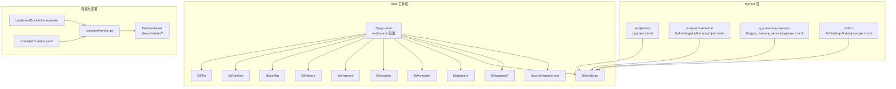
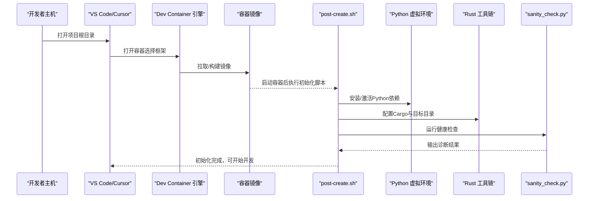
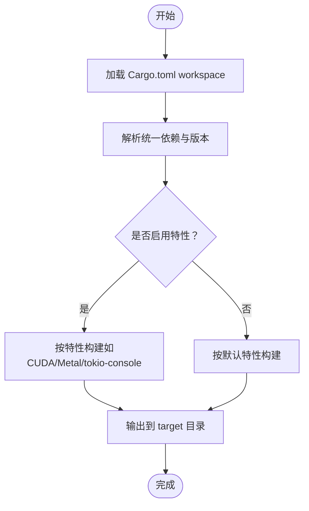
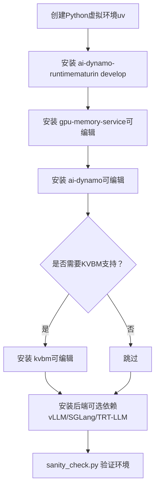
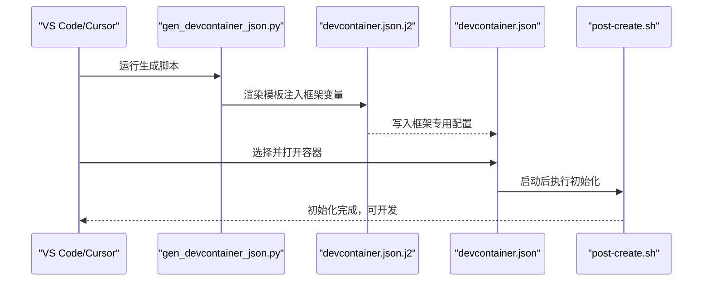
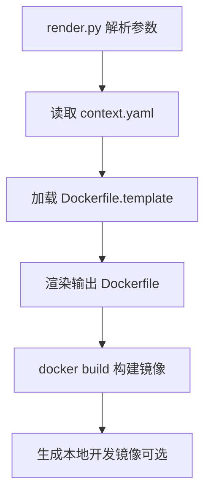
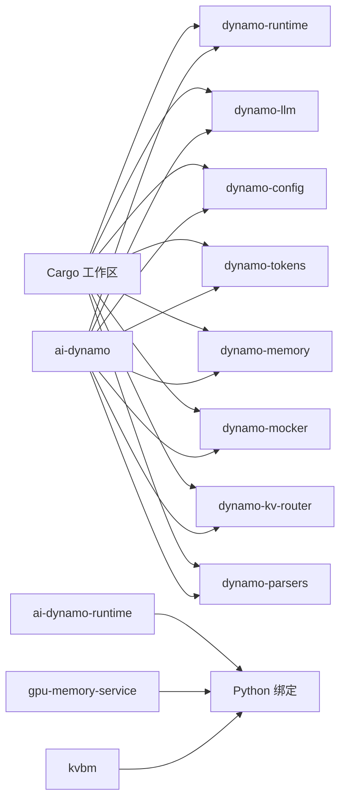

# 开发环境搭建

<cite>
**本文引用的文件**
- [README.md](file://README.md)
- [.devcontainer/README.md](file://.devcontainer/README.md)
- [.devcontainer/devcontainer.json.j2](file://.devcontainer/devcontainer.json.j2)
- [.devcontainer/gen_devcontainer_json.py](file://.devcontainer/gen_devcontainer_json.py)
- [.devcontainer/post-create.sh](file://.devcontainer/post-create.sh)
- [Cargo.toml](file://Cargo.toml)
- [launch/dynamo-run/Cargo.toml](file://launch/dynamo-run/Cargo.toml)
- [.cargo/config.toml](file://.cargo/config.toml)
- [pyproject.toml](file://pyproject.toml)
- [lib/bindings/python/pyproject.toml](file://lib/bindings/python/pyproject.toml)
- [lib/bindings/kvbm/pyproject.toml](file://lib/bindings/kvbm/pyproject.toml)
- [lib/gpu_memory_service/pyproject.toml](file://lib/gpu_memory_service/pyproject.toml)
- [container/Dockerfile.template](file://container/Dockerfile.template)
- [container/context.yaml](file://container/context.yaml)
- [container/render.py](file://container/render.py)
- [container/use-sccache.sh](file://container/use-sccache.sh)
- [deploy/sanity_check.py](file://deploy/sanity_check.py)
</cite>

## 目录
1. [简介](#简介)
2. [项目结构](#项目结构)
3. [核心组件](#核心组件)
4. [架构总览](#架构总览)
5. [详细组件分析](#详细组件分析)
6. [依赖关系分析](#依赖关系分析)
7. [性能考虑](#性能考虑)
8. [故障排查指南](#故障排查指南)
9. [结论](#结论)
10. [附录](#附录)

## 简介
本指南面向Dynamo项目的开发者，提供从零到一的多语言混合开发环境搭建方案。Dynamo采用Rust作为高性能后端，Python用于扩展与集成，同时支持多种推理引擎（vLLM、SGLang、TensorRT-LLM）。文档覆盖以下主题：
- Rust工具链与Cargo工作区配置
- Python虚拟环境与包管理（uv、maturin）
- Go模块管理（在部署与运维相关目录中）
- DevContainer开发容器的生成、使用与优化
- 本地开发环境：GPU驱动、CUDA工具包、Docker与Kubernetes准备
- 依赖管理策略：Cargo工作区、Python包与Go模块
- IDE配置建议（VS Code、Cursor等）
- 常见环境问题排查与解决方案

## 项目结构
Dynamo采用多语言混合架构，代码按功能域分层组织：
- Rust工作区：components/src/dynamo（业务逻辑）、lib（库模块）、launch（可执行入口）
- Python包：ai-dynamo、ai-dynamo-runtime、gpu-memory-service、kvbm等
- 容器与部署：container（Dockerfile模板与渲染脚本）、deploy（健康检查与部署脚本）
- DevContainer：.devcontainer（模板与生成脚本）

图表来源
- [Cargo.toml](file://Cargo.toml#L4-L36)
- [pyproject.toml](file://pyproject.toml#L1-L323)
- [lib/bindings/python/pyproject.toml](file://lib/bindings/python/pyproject.toml#L1-L60)
- [lib/gpu_memory_service/pyproject.toml](file://lib/gpu_memory_service/pyproject.toml#L1-L45)
- [lib/bindings/kvbm/pyproject.toml](file://lib/bindings/kvbm/pyproject.toml#L1-L73)
- [container/Dockerfile.template](file://container/Dockerfile.template#L1-L73)
- [container/context.yaml](file://container/context.yaml#L1-L89)
- [container/render.py](file://container/render.py#L1-L133)
- [.devcontainer/README.md](file://.devcontainer/README.md#L1-L478)

章节来源
- [Cargo.toml](file://Cargo.toml#L4-L36)
- [pyproject.toml](file://pyproject.toml#L1-L323)
- [container/Dockerfile.template](file://container/Dockerfile.template#L1-L73)
- [.devcontainer/README.md](file://.devcontainer/README.md#L1-L478)

## 核心组件
- Rust工作区与特性开关：通过workspace统一版本与依赖，launch/dynamo-run提供CLI入口与特性开关（如CUDA、Metal、tokio-console）。
- Python生态：ai-dynamo为主包，ai-dynamo-runtime为底层运行时绑定，gpu-memory-service为C++扩展，kvbm为可选绑定。
- 容器化与DevContainer：通过Jinja2模板与渲染脚本生成框架特定的devcontainer.json，简化多后端开发体验。

章节来源
- [Cargo.toml](file://Cargo.toml#L4-L36)
- [launch/dynamo-run/Cargo.toml](file://launch/dynamo-run/Cargo.toml#L15-L24)
- [pyproject.toml](file://pyproject.toml#L1-L323)
- [lib/bindings/python/pyproject.toml](file://lib/bindings/python/pyproject.toml#L1-L60)
- [lib/gpu_memory_service/pyproject.toml](file://lib/gpu_memory_service/pyproject.toml#L1-L45)
- [lib/bindings/kvbm/pyproject.toml](file://lib/bindings/kvbm/pyproject.toml#L1-L73)
- [.devcontainer/devcontainer.json.j2](file://.devcontainer/devcontainer.json.j2#L1-L79)
- [.devcontainer/gen_devcontainer_json.py](file://.devcontainer/gen_devcontainer_json.py#L1-L65)

## 架构总览
下图展示Dynamo开发环境的关键交互：IDE通过Dev Container连接容器，容器内完成Rust构建、Python绑定与依赖安装，并通过健康检查脚本验证环境。

图表来源
- [.devcontainer/README.md](file://.devcontainer/README.md#L135-L209)
- [.devcontainer/post-create.sh](file://.devcontainer/post-create.sh#L56-L122)
- [deploy/sanity_check.py](file://deploy/sanity_check.py#L1-L149)

章节来源
- [.devcontainer/README.md](file://.devcontainer/README.md#L135-L209)
- [.devcontainer/post-create.sh](file://.devcontainer/post-create.sh#L56-L122)
- [deploy/sanity_check.py](file://deploy/sanity_check.py#L1-L149)

## 详细组件分析

### Rust工具链与Cargo工作区
- 工作区成员：components/src/dynamo、lib/*、launch/dynamo-run等，统一版本与依赖解析。
- 特性开关：launch/dynamo-run支持默认特性（如mistralrs），以及CUDA、Metal、tokio-console等可选特性。
- 编译配置：.cargo/config.toml启用tokio-console相关编译参数；工作区profile.dev.release提供优化策略。

图表来源
- [Cargo.toml](file://Cargo.toml#L4-L36)
- [launch/dynamo-run/Cargo.toml](file://launch/dynamo-run/Cargo.toml#L15-L24)
- [.cargo/config.toml](file://.cargo/config.toml#L4-L7)

章节来源
- [Cargo.toml](file://Cargo.toml#L4-L36)
- [launch/dynamo-run/Cargo.toml](file://launch/dynamo-run/Cargo.toml#L15-L24)
- [.cargo/config.toml](file://.cargo/config.toml#L4-L7)

### Python虚拟环境与包管理
- ai-dynamo主包：定义项目元数据、依赖与可选后端（vLLM、SGLang、TensorRT-LLM）。
- ai-dynamo-runtime：底层运行时绑定，使用maturin构建Python扩展。
- gpu-memory-service：带C++扩展的Python包，需Python开发头与C++编译器。
- kvbm：可选绑定，支持CUDA 12/13不同后端。
- 安装流程：通过uv创建虚拟环境，maturin develop构建Rust->Python绑定，再以可编辑模式安装各包。

图表来源
- [pyproject.toml](file://pyproject.toml#L1-L323)
- [lib/bindings/python/pyproject.toml](file://lib/bindings/python/pyproject.toml#L48-L60)
- [lib/gpu_memory_service/pyproject.toml](file://lib/gpu_memory_service/pyproject.toml#L1-L45)
- [lib/bindings/kvbm/pyproject.toml](file://lib/bindings/kvbm/pyproject.toml#L47-L73)
- [.devcontainer/post-create.sh](file://.devcontainer/post-create.sh#L111-L118)

章节来源
- [pyproject.toml](file://pyproject.toml#L1-L323)
- [lib/bindings/python/pyproject.toml](file://lib/bindings/python/pyproject.toml#L48-L60)
- [lib/gpu_memory_service/pyproject.toml](file://lib/gpu_memory_service/pyproject.toml#L1-L45)
- [lib/bindings/kvbm/pyproject.toml](file://lib/bindings/kvbm/pyproject.toml#L47-L73)
- [.devcontainer/post-create.sh](file://.devcontainer/post-create.sh#L111-L118)

### DevContainer开发容器
- 模板系统：使用Jinja2模板与生成脚本为vLLM、SGLang、TRT-LLM分别生成devcontainer.json。
- 容器特性：GPU直通、网络主机模式、共享内存、权限映射、持久化缓存与历史记录。
- 初始化流程：容器启动后自动执行post-create.sh，安装预提交钩子、配置Cargo目标目录、运行健康检查。

图表来源
- [.devcontainer/gen_devcontainer_json.py](file://.devcontainer/gen_devcontainer_json.py#L15-L65)
- [.devcontainer/devcontainer.json.j2](file://.devcontainer/devcontainer.json.j2#L1-L79)
- [.devcontainer/post-create.sh](file://.devcontainer/post-create.sh#L56-L122)

章节来源
- [.devcontainer/README.md](file://.devcontainer/README.md#L24-L68)
- [.devcontainer/devcontainer.json.j2](file://.devcontainer/devcontainer.json.j2#L1-L79)
- [.devcontainer/gen_devcontainer_json.py](file://.devcontainer/gen_devcontainer_json.py#L1-L65)
- [.devcontainer/post-create.sh](file://.devcontainer/post-create.sh#L56-L122)

### 容器与Docker构建
- 模板渲染：render.py根据framework、target、平台、CUDA版本等参数渲染Dockerfile。
- 上下文配置：context.yaml集中定义基础镜像、后端版本、特性开关等。
- 本地开发镜像：local-dev目标包含额外开发者工具与用户UID/GID映射。

图表来源
- [container/render.py](file://container/render.py#L13-L133)
- [container/context.yaml](file://container/context.yaml#L1-L89)
- [container/Dockerfile.template](file://container/Dockerfile.template#L1-L73)

章节来源
- [container/render.py](file://container/render.py#L13-L133)
- [container/context.yaml](file://container/context.yaml#L1-L89)
- [container/Dockerfile.template](file://container/Dockerfile.template#L1-L73)

### 本地开发环境准备
- 系统要求：Ubuntu 24.04，至少1张GPU，推荐使用容器镜像以避免环境差异。
- GPU与CUDA：确保驱动与CUDA版本匹配，容器内可通过nvidia-smi与nvcc验证。
- Docker与Kubernetes：容器镜像已预装必要组件；生产部署参考recipes与examples中的Kubernetes配置。

章节来源
- [README.md](file://README.md#L87-L112)
- [deploy/sanity_check.py](file://deploy/sanity_check.py#L793-L897)

## 依赖关系分析
- Rust工作区依赖：通过workspace统一管理，减少重复与版本漂移。
- Python依赖：ai-dynamo主包声明后端可选依赖；ai-dynamo-runtime与gpu-memory-service为绑定与扩展。
- 容器依赖：Dockerfile模板按framework/target组合拼装，确保最小化镜像体积与功能集。

图表来源
- [Cargo.toml](file://Cargo.toml#L48-L134)
- [pyproject.toml](file://pyproject.toml#L1-L323)
- [lib/bindings/python/pyproject.toml](file://lib/bindings/python/pyproject.toml#L1-L60)
- [lib/gpu_memory_service/pyproject.toml](file://lib/gpu_memory_service/pyproject.toml#L1-L45)
- [lib/bindings/kvbm/pyproject.toml](file://lib/bindings/kvbm/pyproject.toml#L1-L73)

章节来源
- [Cargo.toml](file://Cargo.toml#L48-L134)
- [pyproject.toml](file://pyproject.toml#L1-L323)

## 性能考虑
- 使用sccache加速Rust增量编译：通过container/use-sccache.sh安装与统计，结合CI缓存提升构建效率。
- Cargo目标目录：容器内固定到/workspace/target，便于持久化与增量编译。
- Python绑定：maturin构建的原生扩展减少Python层开销，配合uv加速依赖安装。

章节来源
- [container/use-sccache.sh](file://container/use-sccache.sh#L1-L106)
- [.devcontainer/post-create.sh](file://.devcontainer/post-create.sh#L62-L66)

## 故障排查指南
- Dev Container兼容性：Docker 29.x存在兼容性问题，建议使用28.5.2或更早版本。
- 容器启动失败：检查本地开发镜像是否存在、资源是否充足、日志输出定位错误。
- 权限问题：容器内root创建的文件导致宿主权限不一致，需手动chown修正。
- 环境变量未生效：通过devcontainer.json的remoteEnv或宿主持久化环境文件传递。
- 构建失败：先执行cargo clean，若仍失败，清理宿主target目录后重试。

章节来源
- [.devcontainer/README.md](file://.devcontainer/README.md#L10-L23)
- [.devcontainer/README.md](file://.devcontainer/README.md#L406-L477)
- [.devcontainer/README.md](file://.devcontainer/README.md#L305-L362)

## 结论
通过DevContainer与容器模板系统，Dynamo实现了跨后端的一致开发体验；Rust工作区与Python绑定体系保证了高性能与易用性的平衡。遵循本文档的环境搭建步骤与故障排查建议，可快速建立稳定可靠的多语言混合开发环境。

## 附录

### IDE配置建议
- VS Code/Cursor：安装Dev Containers扩展，启用SSH代理转发与GPG密钥共享。
- Rust：rust-analyzer启用内存限制、保存时检查、宏展开与自动导入。
- Python：基于pyproject.toml配置IDE路径与虚拟环境，启用mypy与ruff。

章节来源
- [.devcontainer/devcontainer.json.j2](file://.devcontainer/devcontainer.json.j2#L22-L56)

### Go模块管理（运维与部署相关）
- 在deploy/operator与deploy/inference-gateway等目录中，Go模块通过go.mod/go.sum管理依赖，遵循标准Go工作流进行vendor与版本控制。

章节来源
- [deploy/operator/go.mod](file://deploy/operator/go.mod)
- [deploy/inference-gateway/epp/go.mod](file://deploy/inference-gateway/epp/go.mod)