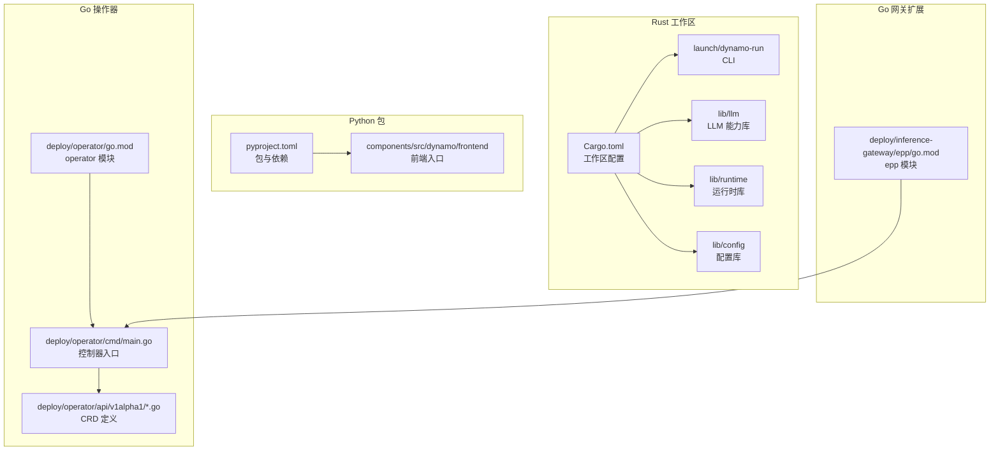
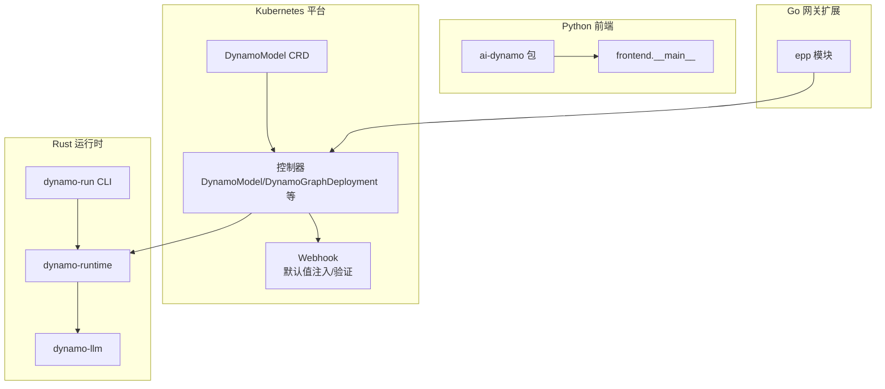
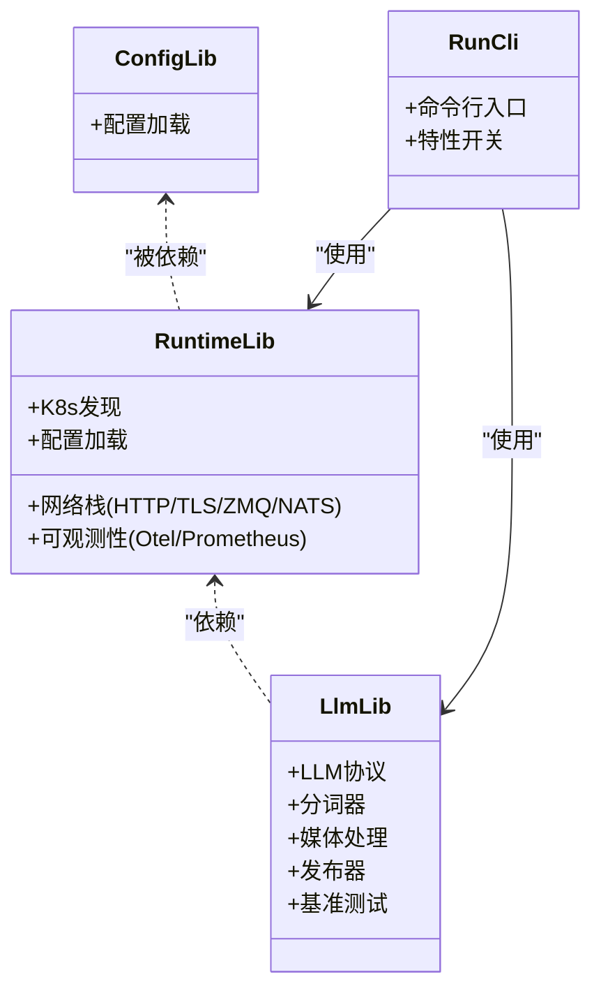
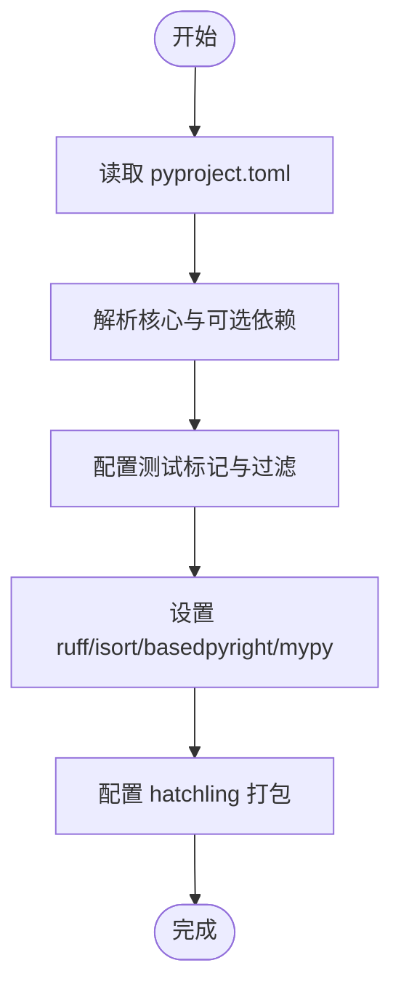
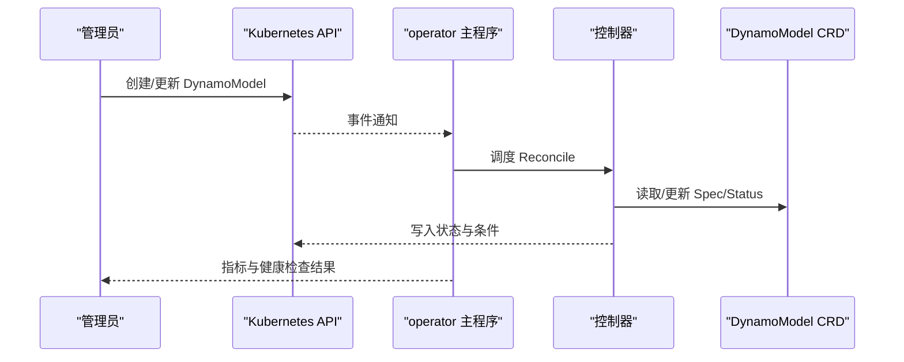
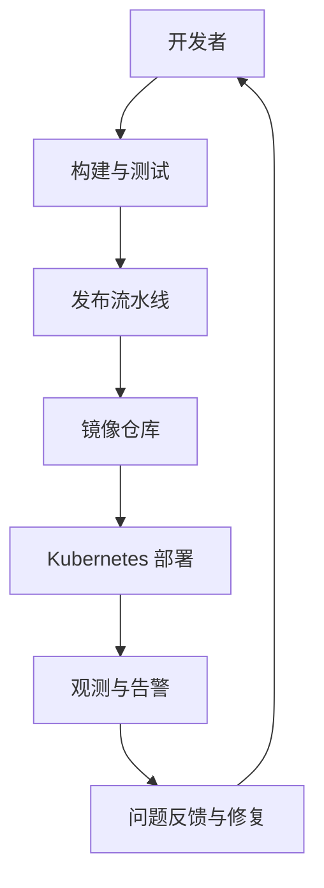
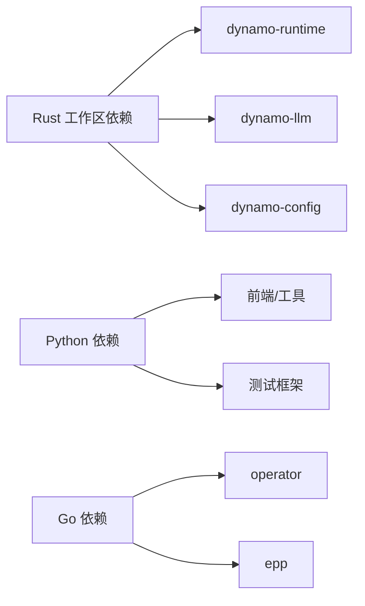

# 多语言开发

<cite>
**本文引用的文件**
- [Cargo.toml（工作区根）](file://Cargo.toml)
- [pyproject.toml（Python 包）](file://pyproject.toml)
- [release.yml（发布流水线）](file://.github/workflows/release.yml)
- [go.mod（operator 模块）](file://deploy/operator/go.mod)
- [go.mod（inference-gateway epp 模块）](file://deploy/inference-gateway/epp/go.mod)
- [main.go（operator 入口）](file://deploy/operator/cmd/main.go)
- [dynamo_model_types.go（CRD 类型）](file://deploy/operator/api/v1alpha1/dynamo_model_types.go)
- [Cargo.toml（dynamo-run 包）](file://launch/dynamo-run/Cargo.toml)
- [Cargo.toml（dynamo-llm 库）](file://lib/llm/Cargo.toml)
- [Cargo.toml（dynamo-runtime 库）](file://lib/runtime/Cargo.toml)
- [Cargo.toml（dynamo-config 库）](file://lib/config/Cargo.toml)
- [__main__.py（前端入口）](file://components/src/dynamo/frontend/__main__.py)
</cite>

## 目录
1. [引言](#引言)
2. [项目结构](#项目结构)
3. [核心组件](#核心组件)
4. [架构总览](#架构总览)
5. [详细组件分析](#详细组件分析)
6. [依赖分析](#依赖分析)
7. [性能考虑](#性能考虑)
8. [故障排查指南](#故障排查指南)
9. [结论](#结论)
10. [附录](#附录)

## 引言
本指南面向 Dynamo 多语言开发团队，系统阐述 Rust 工作区组织与管理、Python 包配置与依赖、Go 操作器（CRD/控制器/Webhook）开发模式，以及跨语言集成的最佳实践。文档同时给出代码风格与质量保障建议、语言间通信机制与接口设计原则，并通过图示帮助读者快速把握整体架构。

## 项目结构
Dynamo 采用“多语言混合”的工程布局：Rust 工作区集中管理核心库与运行时；Python 包提供前端与工具链；Go 模块负责 Kubernetes 操作器与网关扩展；容器与部署脚本贯穿各语言组件。

图表来源
- [Cargo.toml（工作区根）](file://Cargo.toml#L4-L36)
- [pyproject.toml（Python 包）](file://pyproject.toml#L4-L31)
- [go.mod（operator 模块）](file://deploy/operator/go.mod#L1-L31)
- [go.mod（inference-gateway epp 模块）](file://deploy/inference-gateway/epp/go.mod#L1-L11)
- [main.go（operator 入口）](file://deploy/operator/cmd/main.go#L131-L128)
- [dynamo_model_types.go（CRD 类型）](file://deploy/operator/api/v1alpha1/dynamo_model_types.go#L29-L110)

章节来源
- [Cargo.toml（工作区根）](file://Cargo.toml#L4-L36)
- [pyproject.toml（Python 包）](file://pyproject.toml#L4-L31)
- [go.mod（operator 模块）](file://deploy/operator/go.mod#L1-L31)
- [go.mod（inference-gateway epp 模块）](file://deploy/inference-gateway/epp/go.mod#L1-L11)
- [main.go（operator 入口）](file://deploy/operator/cmd/main.go#L131-L128)
- [dynamo_model_types.go（CRD 类型）](file://deploy/operator/api/v1alpha1/dynamo_model_types.go#L29-L110)

## 核心组件
本节按语言维度梳理核心组件职责、依赖与构建配置要点。

- Rust 工作区（15 个核心 crate）
  - 默认成员：runtime、llm、config、tokens、mocker、memory、async-openai、parsers、bindings/c
  - 关键库：dynamo-runtime（网络、指标、日志、K8s 发现）、dynamo-llm（LLM、分词器、协议、发布器）、dynamo-config（配置加载）、dynamo-tokens、dynamo-memory、dynamo-mocker、dynamo-kv-router、dynamo-async-openai、dynamo-parsers
  - 特性开关：如 block-manager、testing-*、media-ffmpeg、integration 等，用于条件编译与测试场景
  - 构建配置：dev/release profile、LTO、代码生成（tonic-build）

- Python 包
  - 名称与版本：ai-dynamo
  - 依赖分组：trtllm、vllm、sglang 可选后端；pytest、fastapi、kubernetes、prometheus_client 等
  - 测试标记：gpu_*、e2e、integration、unit、multimodal、k8s 等
  - 文档与格式：基于 ruff/isort/basedpyright/mypy 的质量体系

- Go 操作器
  - 模块：controller-runtime、k8s.io、istio、gateway-api-inference-extension、volcano、etcd、prometheus 等
  - 入口：cmd/main.go，初始化 Manager、注册控制器与 Webhook、健康检查、指标端点
  - CRD：DynamoModel 等资源类型定义

章节来源
- [Cargo.toml（工作区根）](file://Cargo.toml#L4-L36)
- [Cargo.toml（dynamo-runtime 库）](file://lib/runtime/Cargo.toml#L15-L22)
- [Cargo.toml（dynamo-llm 库）](file://lib/llm/Cargo.toml#L15-L31)
- [pyproject.toml（Python 包）](file://pyproject.toml#L15-L29)
- [pyproject.toml（Python 包）](file://pyproject.toml#L50-L75)
- [pyproject.toml（Python 包）](file://pyproject.toml#L217-L261)
- [go.mod（operator 模块）](file://deploy/operator/go.mod#L5-L31)
- [main.go（operator 入口）](file://deploy/operator/cmd/main.go#L131-L128)
- [dynamo_model_types.go（CRD 类型）](file://deploy/operator/api/v1alpha1/dynamo_model_types.go#L29-L110)

## 架构总览
Dynamo 通过多语言协作实现分布式推理平台：Rust 提供高性能运行时与 LLM 能力；Python 提供前端与工具链；Go 操作器在 Kubernetes 上编排资源并暴露 Webhook；容器镜像与发布流水线统一交付。

图表来源
- [main.go（operator 入口）](file://deploy/operator/cmd/main.go#L631-L701)
- [dynamo_model_types.go（CRD 类型）](file://deploy/operator/api/v1alpha1/dynamo_model_types.go#L104-L110)
- [Cargo.toml（dynamo-runtime 库）](file://lib/runtime/Cargo.toml#L23-L70)
- [Cargo.toml（dynamo-llm 库）](file://lib/llm/Cargo.toml#L46-L92)
- [Cargo.toml（dynamo-run 包）](file://launch/dynamo-run/Cargo.toml#L25-L46)
- [pyproject.toml（Python 包）](file://pyproject.toml#L105-L108)
- [__main__.py（前端入口）](file://components/src/dynamo/frontend/__main__.py#L4-L7)
- [go.mod（inference-gateway epp 模块）](file://deploy/inference-gateway/epp/go.mod#L5-L8)

## 详细组件分析

### Rust 工作区与核心库
- 组织结构
  - 工作区成员与默认成员明确划分；引擎相关 crate 通过通配符纳入但默认不参与构建，以加速日常开发
  - 工作区统一版本、edition、元信息，避免重复声明
- 核心库职责
  - dynamo-runtime：网络栈（HTTP/TLS、ZeroMQ、NATS）、可观测性（OpenTelemetry、Prometheus）、K8s 发现、配置加载
  - dynamo-llm：LLM 协议、分词器、媒体处理、发布器、基准测试与二进制
  - dynamo-config：配置加载与合并
  - 其他：tokens、memory、mocker、async-openai、parsers、bindings/c
- 特性与测试
  - 通过 features 控制 CUDA、NIXL、媒体处理等能力；测试标记与忽略策略在 pyproject.toml 中统一
- 构建与发布
  - dev/release profile 差异化；LTO 与单代码单元优化提升发布性能

图表来源
- [Cargo.toml（dynamo-runtime 库）](file://lib/runtime/Cargo.toml#L23-L70)
- [Cargo.toml（dynamo-llm 库）](file://lib/llm/Cargo.toml#L46-L92)
- [Cargo.toml（dynamo-run 包）](file://launch/dynamo-run/Cargo.toml#L25-L46)
- [Cargo.toml（dynamo-config 库）](file://lib/config/Cargo.toml#L15-L17)

章节来源
- [Cargo.toml（工作区根）](file://Cargo.toml#L4-L36)
- [Cargo.toml（dynamo-runtime 库）](file://lib/runtime/Cargo.toml#L15-L22)
- [Cargo.toml（dynamo-llm 库）](file://lib/llm/Cargo.toml#L15-L31)
- [Cargo.toml（dynamo-run 包）](file://launch/dynamo-run/Cargo.toml#L15-L24)

### Python 包配置与管理
- 包与元信息
  - 名称、版本、描述、许可证、Python 版本要求
- 依赖与可选后端
  - trtllm、vllm、sglang 分组；pytest、fastapi、kubernetes、prometheus_client 等
- 测试与质量
  - 自动 asyncio 模式、丰富测试标记、过滤警告、mypy/basedpyright 配置
- 构建与打包
  - hatchling 后端；wheel 打包路径指向 components/src/dynamo

图表来源
- [pyproject.toml（Python 包）](file://pyproject.toml#L4-L31)
- [pyproject.toml（Python 包）](file://pyproject.toml#L50-L75)
- [pyproject.toml（Python 包）](file://pyproject.toml#L143-L169)
- [pyproject.toml（Python 包）](file://pyproject.toml#L264-L306)
- [pyproject.toml（Python 包）](file://pyproject.toml#L105-L108)

章节来源
- [pyproject.toml（Python 包）](file://pyproject.toml#L4-L31)
- [pyproject.toml（Python 包）](file://pyproject.toml#L50-L75)
- [pyproject.toml（Python 包）](file://pyproject.toml#L143-L169)
- [pyproject.toml（Python 包）](file://pyproject.toml#L264-L306)
- [pyproject.toml（Python 包）](file://pyproject.toml#L105-L108)

### Go 操作器开发模式（CRD/控制器/Webhook）
- CRD 定义
  - DynamoModel：模型名称、基础模型名、类型、来源、端点列表、状态与条件
- 控制器实现
  - 在 main.go 中初始化 Manager、注册多个 Reconciler（DynamoComponentDeployment、DynamoGraphDeployment、DynamoGraphDeploymentScalingAdapter、DynamoGraphDeploymentRequest、DynamoModel、Checkpoint），并配置健康检查与指标端点
- Webhook 处理
  - 支持启用/禁用 Admission Webhooks；注册默认值注入与验证处理器；在集群/命名空间受限模式下协调命名空间排除逻辑

图表来源
- [main.go（operator 入口）](file://deploy/operator/cmd/main.go#L631-L701)
- [dynamo_model_types.go（CRD 类型）](file://deploy/operator/api/v1alpha1/dynamo_model_types.go#L29-L110)

章节来源
- [go.mod（operator 模块）](file://deploy/operator/go.mod#L5-L31)
- [main.go（operator 入口）](file://deploy/operator/cmd/main.go#L131-L128)
- [main.go（operator 入口）](file://deploy/operator/cmd/main.go#L631-L701)
- [dynamo_model_types.go（CRD 类型）](file://deploy/operator/api/v1alpha1/dynamo_model_types.go#L29-L110)

### 概念性总览
以下为概念流程图，展示跨语言组件如何协同工作（非特定源码映射）。

（此图为概念流程，无需图表来源）

## 依赖分析
- Rust 工作区依赖
  - 工作区统一依赖：tokio、axum、hyper、tracing、opentelemetry、prometheus、etcd-client、async-nats 等
  - 成员 crate 间通过 workspace 依赖共享版本，减少耦合与冲突
- Python 依赖
  - 核心：fastapi、kubernetes、pytest、prometheus_client
  - 后端：vllm、trtllm、sglang 可选分组
- Go 依赖
  - controller-runtime、k8s.io、istio、gateway-api-inference-extension、volcano、etcd、prometheus 等

图表来源
- [Cargo.toml（工作区根）](file://Cargo.toml#L48-L134)
- [pyproject.toml（Python 包）](file://pyproject.toml#L15-L29)
- [go.mod（operator 模块）](file://deploy/operator/go.mod#L5-L31)
- [go.mod（inference-gateway epp 模块）](file://deploy/inference-gateway/epp/go.mod#L5-L8)

章节来源
- [Cargo.toml（工作区根）](file://Cargo.toml#L48-L134)
- [pyproject.toml（Python 包）](file://pyproject.toml#L15-L29)
- [go.mod（operator 模块）](file://deploy/operator/go.mod#L5-L31)
- [go.mod（inference-gateway epp 模块）](file://deploy/inference-gateway/epp/go.mod#L5-L8)

## 性能考虑
- Rust
  - 发布构建启用 LTO 与单代码单元，降低二进制体积并提升运行时性能
  - tokio 全功能特性与高并发网络栈（HTTP/2、TLS、ZeroMQ、NATS）适合高吞吐场景
  - 可选 CUDA/NIXL 媒体处理与块管理特性按需开启
- Python
  - 基于 uvloop 的事件循环；mypy/basedpyright 提升静态质量
  - 测试标记支持并行执行，缩短回归时间
- Go
  - controller-runtime 与 etcd 客户端优化长连接与重连；指标端点与健康检查便于运维观测

（本节为通用指导，无需章节来源）

## 故障排查指南
- 发布流水线
  - release.yml 负责从分支提取版本、运行 CI、构建前端镜像、复制到 NGC、打 RC 标签与汇总报告
  - 若镜像复制失败，检查 ECR/NGC 凭据与多架构清单创建
- Go 操作器
  - 健康/就绪探针端口与 TLS 配置；Webhook 证书挂载路径；命名空间受限模式下的租约管理
- Python
  - 测试标记与过滤策略；mypy 忽略缺失导入；IDE 路径配置（basedpyright extraPaths）

章节来源
- [.github/workflows/release.yml（发布流水线）](file://.github/workflows/release.yml#L139-L190)
- [.github/workflows/release.yml（发布流水线）](file://.github/workflows/release.yml#L266-L323)
- [main.go（operator 入口）](file://deploy/operator/cmd/main.go#L373-L381)
- [main.go（operator 入口）](file://deploy/operator/cmd/main.go#L425-L497)
- [pyproject.toml（Python 包）](file://pyproject.toml#L171-L189)
- [pyproject.toml（Python 包）](file://pyproject.toml#L282-L306)
- [pyproject.toml（Python 包）](file://pyproject.toml#L276-L281)

## 结论
Dynamo 通过清晰的多语言分工与严格的依赖管理，实现了高性能、可观测、可扩展的分布式推理平台。遵循本文的组织与最佳实践，可在 Rust、Python、Go 之间高效协作，确保构建、测试、发布与运维的稳定性与一致性。

## 附录

### 跨语言集成最佳实践
- 数据序列化
  - Rust 使用 serde/tonic/axum；Python 使用 fastapi；Go 使用 controller-runtime 与标准库 JSON；建议在边界层统一消息格式（如 JSON/Protobuf）
- 错误处理
  - Rust 使用 anyhow/thiserror；Go 使用 emperror；Python 使用标准异常与 pytest 标记；统一错误传播与日志上下文
- 性能优化
  - Rust 发布构建启用 LTO；Go 使用 etcd 客户端长连接；Python 基于 uvloop；Kubernetes 指标与健康检查
- 代码风格与质量
  - Rust：Cargo.toml 统一依赖；Rustfmt/Clippy；单元/基准测试
  - Python：ruff/isort/basedpyright/mypy；pytest 标记与过滤
  - Go：gofmt/gci/golangci-lint；controller-runtime 规范

（本节为通用指导，无需章节来源）