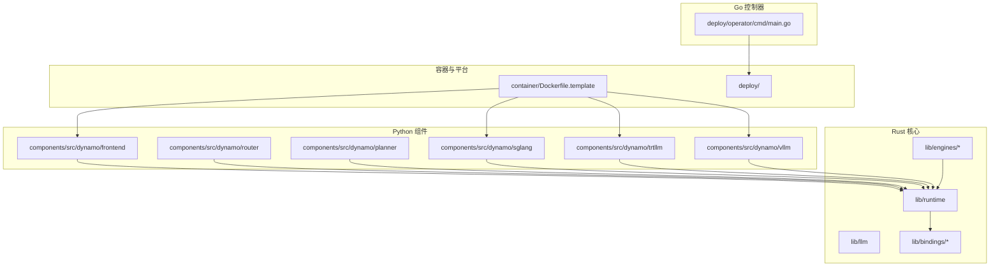
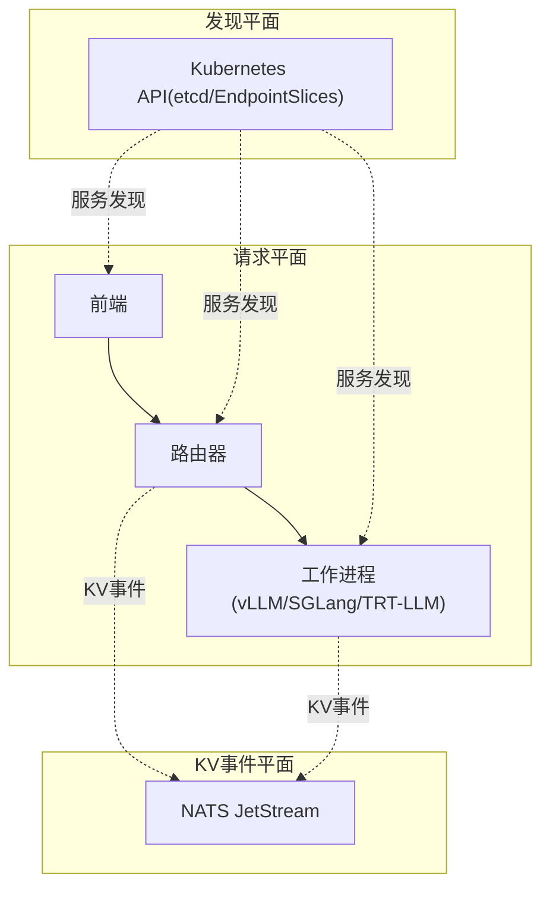
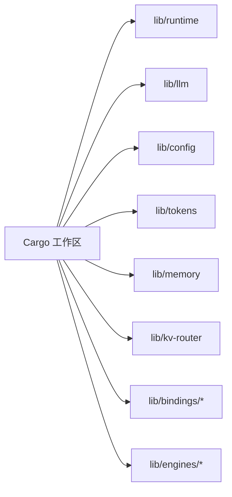
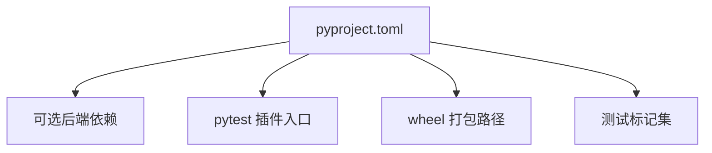
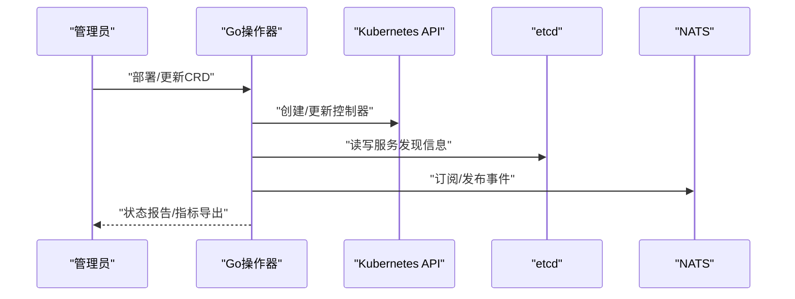
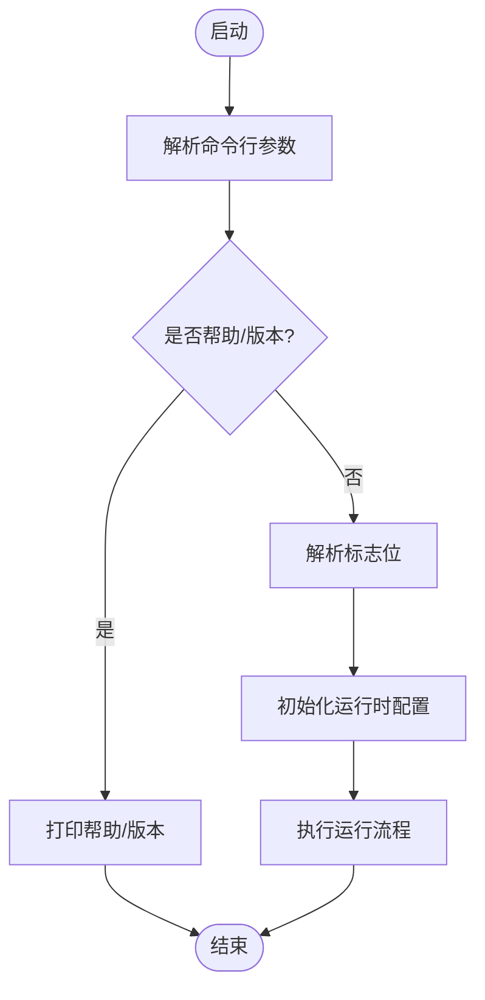
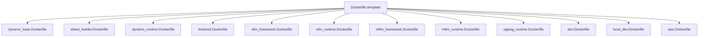
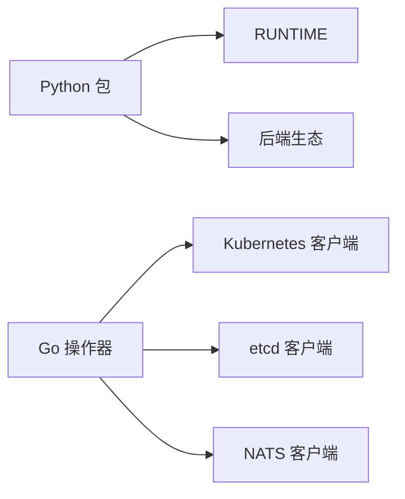

# 开发者指南

<cite>
**本文档引用的文件**
- [README.md](file://README.md)
- [CONTRIBUTING.md](file://CONTRIBUTING.md)
- [Cargo.toml](file://Cargo.toml)
- [pyproject.toml](file://pyproject.toml)
- [.devcontainer/README.md](file://.devcontainer/README.md)
- [.github/workflows/pre-merge.yml](file://.github/workflows/pre-merge.yml)
- [.github/FILTERS.md](file://.github/FILTERS.md)
- [.pre-commit-config.yaml](file://.pre-commit-config.yaml)
- [DCO.md](file://DCO.md)
- [launch/dynamo-run/src/main.rs](file://launch/dynamo-run/src/main.rs)
- [deploy/operator/cmd/main.go](file://deploy/operator/cmd/main.go)
- [container/Dockerfile.template](file://container/Dockerfile.template)
</cite>

## 目录
1. [简介](#简介)
2. [项目结构](#项目结构)
3. [核心组件](#核心组件)
4. [架构总览](#架构总览)
5. [详细组件分析](#详细组件分析)
6. [依赖关系分析](#依赖关系分析)
7. [性能考虑](#性能考虑)
8. [故障排查指南](#故障排查指南)
9. [结论](#结论)
10. [附录](#附录)

## 简介
本指南面向Dynamo项目的贡献者与维护者，覆盖从开发环境搭建、本地调试到多语言混合架构（Rust工作区、Python包与Go控制器）的贡献流程；并提供构建打包、测试策略、代码风格与提交规范、IDE配置与调试技巧等实用内容。Dynamo是一个高性能、低延迟的大模型推理框架，支持多后端（vLLM、SGLang、TensorRT-LLM），采用Rust（运行时与引擎）、Python（扩展与集成）与Go（Kubernetes控制器）混合架构。

## 项目结构
Dynamo采用分层与功能域结合的组织方式：
- 核心库与运行时：lib/ 下的Rust子项目（运行时、LLM引擎、KV路由、内存、绑定等）
- 组件与服务：components/src/dynamo/ 下的Python组件（前端、路由器、规划器、各后端适配）
- 运维与平台：deploy/ 下的Kubernetes控制器、Helm图表、观测性与部署脚本
- 容器与模板：container/ 下的Dockerfile模板与渲染脚本
- 基准与示例：benchmarks/、examples/、recipes/ 提供性能评测与部署配方
- 工具与脚本：scripts/、tests/、.github/ workflows与actions

**图示来源**
- [Cargo.toml](file://Cargo.toml#L4-L36)
- [pyproject.toml](file://pyproject.toml#L106-L108)
- [deploy/operator/cmd/main.go](file://deploy/operator/cmd/main.go#L1-L120)
- [container/Dockerfile.template](file://container/Dockerfile.template#L1-L73)

**章节来源**
- [README.md](file://README.md#L27-L70)
- [Cargo.toml](file://Cargo.toml#L4-L36)
- [pyproject.toml](file://pyproject.toml#L106-L108)

## 核心组件
- 前端（OpenAI兼容HTTP API）：Rust实现的高性能HTTP服务器，负责请求预处理、路由与转发
- 路由器（KV感知路由与负载均衡）：基于KV事件的智能路由，降低重复计算
- 规划器（SLA驱动的动态调度）：根据SLA与性能指标实时调整资源与副本
- 后端适配（vLLM/SGLang/TensorRT-LLM）：Python封装各引擎，统一接口与参数
- 运行时与引擎（Rust）：高性能token处理、异步I/O、内存管理与KV块管理
- Kubernetes控制器（Go）：CRD、控制器与Webhook，实现声明式部署与可观测性

**章节来源**
- [CONTRIBUTING.md](file://CONTRIBUTING.md#L136-L173)

## 架构总览
Dynamo通过“发现平面”、“请求平面”、“KV事件平面”三大通信平面解耦组件协作；Rust负责低层性能与确定性，Python负责快速迭代与生态兼容，Go负责Kubernetes原生编排。

**图示来源**
- [README.md](file://README.md#L362-L381)
- [CONTRIBUTING.md](file://CONTRIBUTING.md#L147-L154)

## 详细组件分析

### Rust工作区与构建系统
- 工作区成员：包含运行时、LLM引擎、配置、令牌、内存、KV路由、绑定、引擎等
- 默认成员：聚焦核心功能，排除部分重型或非旗舰特性
- 依赖：Tokio、Axum、Tracing、Prometheus、NATS、Etcd、OpenTelemetry等
- 配置：dev/profile.release优化策略，启用LTO与单代码生成单元以提升发布性能

**图示来源**
- [Cargo.toml](file://Cargo.toml#L4-L36)
- [Cargo.toml](file://Cargo.toml#L48-L134)

**章节来源**
- [Cargo.toml](file://Cargo.toml#L4-L36)
- [Cargo.toml](file://Cargo.toml#L135-L147)

### Python包与绑定
- 包名与版本：ai-dynamo，可选后端依赖（vLLM、SGLang、TensorRT-LLM）
- 可执行入口：pytest插件注册，按后端分组加载测试夹具
- 打包目标：仅打包components/src/dynamo，wheel构建钩子自定义
- 测试标记：丰富标记体系（GPU规模、并发、性能、e2e等）

**图示来源**
- [pyproject.toml](file://pyproject.toml#L4-L30)
- [pyproject.toml](file://pyproject.toml#L50-L75)
- [pyproject.toml](file://pyproject.toml#L105-L108)
- [pyproject.toml](file://pyproject.toml#L217-L262)

**章节来源**
- [pyproject.toml](file://pyproject.toml#L50-L75)
- [pyproject.toml](file://pyproject.toml#L105-L108)
- [pyproject.toml](file://pyproject.toml#L217-L262)

### Go操作器（Kubernetes控制器）
- 主要职责：Dynamo相关CRD的控制器、Webhook、命名空间范围协调、检查点与存储配置
- 关键特性：支持集群级与命名空间受限模式、自动检测外部组件（Grove/LWS/Volcano/Kai-scheduler）
- 安全与健康：支持metrics安全监听、健康探针、禁用HTTP/2等

**图示来源**
- [deploy/operator/cmd/main.go](file://deploy/operator/cmd/main.go#L130-L180)
- [deploy/operator/cmd/main.go](file://deploy/operator/cmd/main.go#L420-L520)
- [deploy/operator/cmd/main.go](file://deploy/operator/cmd/main.go#L700-L768)

**章节来源**
- [deploy/operator/cmd/main.go](file://deploy/operator/cmd/main.go#L130-L180)
- [deploy/operator/cmd/main.go](file://deploy/operator/cmd/main.go#L420-L520)
- [deploy/operator/cmd/main.go](file://deploy/operator/cmd/main.go#L700-L768)

### 动态运行器（dynamo-run）
- 单二进制：整合输入（HTTP/GRPC/文本/批处理）与输出（引擎列表/自动选择），简化本地体验
- 参数解析：支持in/out动态端点、引擎选择、KV事件开关、日志级别等
- 入口逻辑：根据参数决定帮助、版本或执行流程

**图示来源**
- [launch/dynamo-run/src/main.rs](file://launch/dynamo-run/src/main.rs#L31-L61)
- [launch/dynamo-run/src/main.rs](file://launch/dynamo-run/src/main.rs#L63-L136)

**章节来源**
- [launch/dynamo-run/src/main.rs](file://launch/dynamo-run/src/main.rs#L13-L30)
- [launch/dynamo-run/src/main.rs](file://launch/dynamo-run/src/main.rs#L31-L61)
- [launch/dynamo-run/src/main.rs](file://launch/dynamo-run/src/main.rs#L63-L136)

### 容器化与模板
- 模板系统：通过Jinja2模板组合基础镜像、框架运行时与开发工具链
- 多目标：base、runtime、dev、local-dev、wheel_builder、frontend等
- 特殊场景：AWS EFA支持、SGLang/VLLM/TRTLLM专用阶段

**图示来源**
- [container/Dockerfile.template](file://container/Dockerfile.template#L1-L73)

**章节来源**
- [container/Dockerfile.template](file://container/Dockerfile.template#L1-L73)

## 依赖关系分析
- Rust工作区内部：运行时为其他库提供基础设施；LLM引擎依赖运行时；绑定与引擎通过工作区聚合
- Python包：依赖ai-dynamo-runtime与后端生态（vLLM、SGLang、TRT-LLM），并通过pytest插件注册测试夹具
- Go操作器：依赖Kubernetes客户端、etcd、NATS、控制器运行时与Webhook框架

**图示来源**
- [pyproject.toml](file://pyproject.toml#L15-L29)
- [pyproject.toml](file://pyproject.toml#L50-L75)
- [deploy/operator/cmd/main.go](file://deploy/operator/cmd/main.go#L30-L76)

**章节来源**
- [pyproject.toml](file://pyproject.toml#L15-L29)
- [pyproject.toml](file://pyproject.toml#L50-L75)
- [deploy/operator/cmd/main.go](file://deploy/operator/cmd/main.go#L30-L76)

## 性能考虑
- 发布配置：启用LTO与单代码生成单元，减少二进制体积并提升运行时性能
- 日志与追踪：默认info级别，支持debug/trace，结合OpenTelemetry与Prometheus导出指标
- 并发与I/O：Tokio运行时、异步网络栈、零拷贝序列化（如RMP）降低开销
- 缓存与KV：KV缓存分层（GPU/CPU/SSD/对象存储），事件驱动协调避免重复计算

**章节来源**
- [Cargo.toml](file://Cargo.toml#L142-L147)
- [deploy/operator/cmd/main.go](file://deploy/operator/cmd/main.go#L420-L520)

## 故障排查指南
- DCO签名失败：确保每次提交包含“Signed-off-by”，可通过CLI交互式重签或桌面客户端设置
- 预提交钩子失败：检查格式化、拼写、YAML/JSON校验与类型检查；必要时在本地运行pre-commit
- CI过滤未覆盖文件：在filters.yaml中添加匹配规则，并同步更新工作流中的覆盖集合
- Rust构建问题：清理缓存后重建，检查权限与宿主机/容器用户UID/GID一致性
- 容器环境异常：检查Docker版本兼容性、卷损坏与镜像缓存，必要时重建容器与镜像

**章节来源**
- [DCO.md](file://DCO.md#L1-L82)
- [.pre-commit-config.yaml](file://.pre-commit-config.yaml#L16-L102)
- [.github/FILTERS.md](file://.github/FILTERS.md#L1-L70)
- [.devcontainer/README.md](file://.devcontainer/README.md#L12-L23)
- [.devcontainer/README.md](file://.devcontainer/README.md#L363-L478)

## 结论
Dynamo通过Rust/Python/Go的混合架构实现了高性能、可扩展且易维护的分布式推理平台。遵循本文档的开发流程、测试策略与代码规范，将有助于高效贡献并保持代码质量。

## 附录

### 开发环境搭建与本地调试
- 从源码构建：安装系统依赖、Rust、Python虚拟环境与maturin，构建Rust绑定与Python包
- 本地运行：使用dynamo-run单二进制或Python组件模块启动前端与后端工作进程
- 调试技巧：设置日志级别、使用容器内文档服务、利用devcontainer进行GPU加速开发

**章节来源**
- [README.md](file://README.md#L243-L342)
- [launch/dynamo-run/src/main.rs](file://launch/dynamo-run/src/main.rs#L13-L30)

### 贡献流程与审查
- Issue优先：大改动先建Issue并获得批准；小改动可直接PR
- 提交规范：DCO签名、符合风格指南（Rust/Go/Python），预提交检查通过
- CI流水线：按变更文件分类触发对应Job，覆盖率检查确保文件被正确归类

**章节来源**
- [CONTRIBUTING.md](file://CONTRIBUTING.md#L176-L214)
- [DCO.md](file://DCO.md#L1-L82)
- [.github/workflows/pre-merge.yml](file://.github/workflows/pre-merge.yml#L30-L54)
- [.github/FILTERS.md](file://.github/FILTERS.md#L1-L70)

### 测试策略与编写规范
- 标记体系：gpu_*、e2e、integration、unit、performance、multimodal等，便于并行与定向执行
- 运行方式：pytest主配置与插件注册，支持mypy、ruff等静态检查
- CI触发：按文件变更过滤，仅运行相关测试套件

**章节来源**
- [pyproject.toml](file://pyproject.toml#L217-L262)
- [.github/workflows/pre-merge.yml](file://.github/workflows/pre-merge.yml#L65-L120)

### 代码风格与IDE配置
- Rust：cargo fmt/cargo clippy
- Go：gofmt
- Python：black、ruff、isort、flake8、codespell
- IDE：基于pyright的extraPaths指向组件与绑定源码，便于跳转与类型检查

**章节来源**
- [CONTRIBUTING.md](file://CONTRIBUTING.md#L216-L252)
- [pyproject.toml](file://pyproject.toml#L264-L281)

### 构建与打包流程
- Rust：工作区统一构建，发布配置优化；dynamo-run作为独立可执行
- Python：wheel构建仅打包components/src/dynamo，支持后端可选依赖
- 容器：模板化构建多目标镜像，支持AWS EFA与开发工具链

**章节来源**
- [Cargo.toml](file://Cargo.toml#L135-L147)
- [pyproject.toml](file://pyproject.toml#L105-L108)
- [container/Dockerfile.template](file://container/Dockerfile.template#L1-L73)