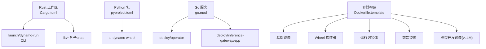
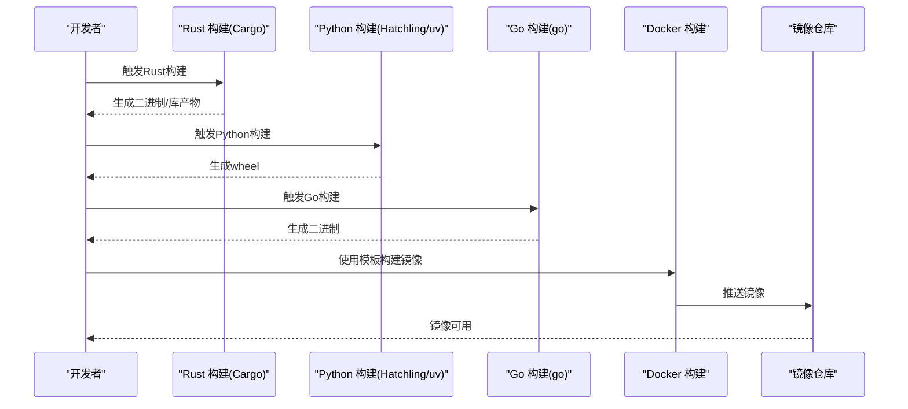
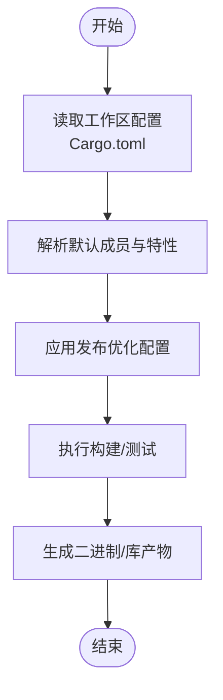
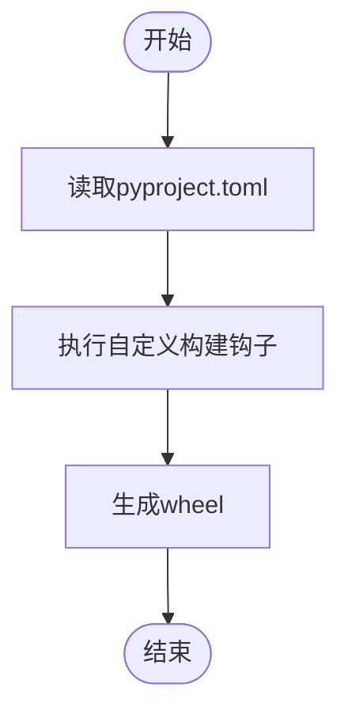
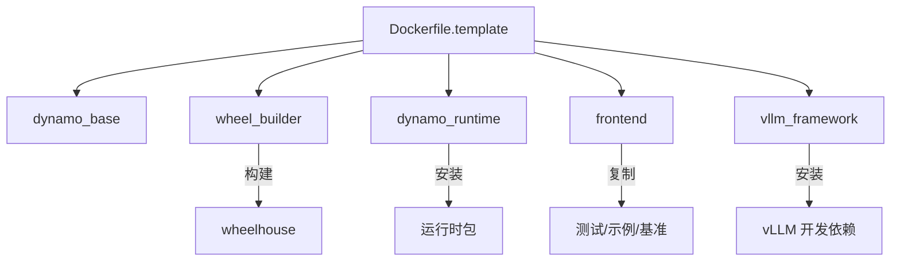
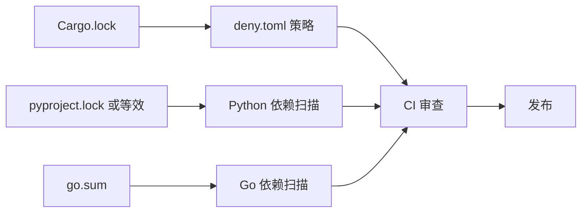

# 构建与打包

<cite>
**本文引用的文件**
- [Cargo.toml](file://Cargo.toml)
- [pyproject.toml](file://pyproject.toml)
- [launch/dynamo-run/Cargo.toml](file://launch/dynamo-run/Cargo.toml)
- [deploy/operator/go.mod](file://deploy/operator/go.mod)
- [deploy/inference-gateway/epp/go.mod](file://deploy/inference-gateway/epp/go.mod)
- [container/Dockerfile.template](file://container/Dockerfile.template)
- [container/templates/dynamo_base.Dockerfile](file://container/templates/dynamo_base.Dockerfile)
- [container/templates/wheel_builder.Dockerfile](file://container/templates/wheel_builder.Dockerfile)
- [container/templates/dynamo_runtime.Dockerfile](file://container/templates/dynamo_runtime.Dockerfile)
- [container/templates/frontend.Dockerfile](file://container/templates/frontend.Dockerfile)
- [container/templates/vllm_framework.Dockerfile](file://container/templates/vllm_framework.Dockerfile)
- [.github/workflows](file://.github/workflows)
- [.github/scripts](file://.github/scripts)
- [.github/FILTERS.md](file://.github/FILTERS.md)
- [.github/release.yml](file://.github/release.yml)
- [deny.toml](file://deny.toml)
- [ATTRIBUTIONS.md](file://ATTRIBUTIONS.md)
- [ATTRIBUTIONS-Python.md](file://ATTRIBUTIONS-Python.md)
- [ATTRIBUTIONS-Rust.md](file://ATTRIBUTIONS-Rust.md)
- [ATTRIBUTIONS-container-frontend.md](file://ATTRIBUTIONS-container-frontend.md)
- [ATTRIBUTIONS-container-sglang-runtime.md](file://ATTRIBUTIONS-container-sglang-runtime.md)
- [ATTRIBUTIONS-container-tensorrtllm-runtime.txt](file://ATTRIBUTIONS-container-tensorrtllm-runtime.txt)
- [ATTRIBUTIONS-container-vllm-runtime.txt](file://ATTRIBUTIONS-container-vllm-runtime.txt)
- [SECURITY.md](file://SECURITY.md)
</cite>

## 目录
1. [简介](#简介)
2. [项目结构](#项目结构)
3. [核心组件](#核心组件)
4. [架构总览](#架构总览)
5. [详细组件分析](#详细组件分析)
6. [依赖关系分析](#依赖关系分析)
7. [性能考量](#性能考量)
8. [故障排查指南](#故障排查指南)
9. [结论](#结论)
10. [附录](#附录)

## 简介
本指南面向Dynamo多语言项目（Rust、Python、Go）的构建与打包，覆盖以下主题：
- 多语言构建流程：Rust crate编译配置、Python包构建与分发、Go二进制生成
- 容器化构建：Docker镜像构建、多阶段构建优化、镜像安全扫描
- 发布流程：版本管理、标签策略、发布渠道
- 依赖管理：锁文件管理、依赖更新、安全漏洞扫描
- CI/CD流水线：自动化构建、测试与部署
- 本地构建验证与发布前检查清单

## 项目结构
Dynamo采用多模块仓库组织方式，包含：
- Rust工作区：以Cargo.toml为中心，统一版本与依赖；launch/dynamo-run为CLI入口crate
- Python包：以pyproject.toml为中心，使用Hatchling构建wheel
- Go服务：operator与inference-gateway等子模块，使用go.mod/go.sum
- 容器化：通过Jinja模板拼装多阶段Dockerfile，支持多种框架目标



**图表来源**
- [Cargo.toml](file://Cargo.toml#L1-L147)
- [pyproject.toml](file://pyproject.toml#L1-L323)
- [launch/dynamo-run/Cargo.toml](file://launch/dynamo-run/Cargo.toml#L1-L54)
- [deploy/operator/go.mod](file://deploy/operator/go.mod#L1-L100)
- [deploy/inference-gateway/epp/go.mod](file://deploy/inference-gateway/epp/go.mod#L1-L110)
- [container/Dockerfile.template](file://container/Dockerfile.template#L1-L73)

**章节来源**
- [Cargo.toml](file://Cargo.toml#L1-L147)
- [pyproject.toml](file://pyproject.toml#L1-L323)
- [launch/dynamo-run/Cargo.toml](file://launch/dynamo-run/Cargo.toml#L1-L54)
- [deploy/operator/go.mod](file://deploy/operator/go.mod#L1-L100)
- [deploy/inference-gateway/epp/go.mod](file://deploy/inference-gateway/epp/go.mod#L1-L110)
- [container/Dockerfile.template](file://container/Dockerfile.template#L1-L73)

## 核心组件
- Rust工作区与默认成员：集中管理版本与公共依赖，定义发布与非发布crate的默认集合
- Python构建系统：Hatchling + uv，wheel输出路径与自定义构建钩子
- Go模块：operator与epp分别声明Kubernetes与网关相关依赖
- 容器模板：通过Jinja模板组合基础、wheel构建、运行时、前端与框架开发阶段

**章节来源**
- [Cargo.toml](file://Cargo.toml#L4-L36)
- [pyproject.toml](file://pyproject.toml#L98-L108)
- [deploy/operator/go.mod](file://deploy/operator/go.mod#L1-L31)
- [deploy/inference-gateway/epp/go.mod](file://deploy/inference-gateway/epp/go.mod#L1-L10)
- [container/Dockerfile.template](file://container/Dockerfile.template#L1-L73)

## 架构总览
下图展示从源码到产物的端到端构建链路，涵盖Rust、Python、Go三类产物与容器镜像。



**图表来源**
- [Cargo.toml](file://Cargo.toml#L1-L147)
- [pyproject.toml](file://pyproject.toml#L98-L108)
- [deploy/operator/go.mod](file://deploy/operator/go.mod#L1-L100)
- [deploy/inference-gateway/epp/go.mod](file://deploy/inference-gateway/epp/go.mod#L1-L110)
- [container/Dockerfile.template](file://container/Dockerfile.template#L1-L73)

## 详细组件分析

### Rust 构建与发布
- 工作区与默认成员：统一版本与依赖，控制默认构建范围
- 优化配置：发布配置启用LTO与单代码单元，提升体积与性能
- CLI特性：dynamo-run支持特性开关，如CUDA、Metal与tokio-console



**图表来源**
- [Cargo.toml](file://Cargo.toml#L4-L36)
- [Cargo.toml](file://Cargo.toml#L142-L147)
- [launch/dynamo-run/Cargo.toml](file://launch/dynamo-run/Cargo.toml#L15-L24)

**章节来源**
- [Cargo.toml](file://Cargo.toml#L4-L36)
- [Cargo.toml](file://Cargo.toml#L142-L147)
- [launch/dynamo-run/Cargo.toml](file://launch/dynamo-run/Cargo.toml#L15-L24)

### Python 包构建与分发
- 构建后端：Hatchling，自定义构建钩子用于打包特定组件
- 轮子输出：指定packages路径，确保仅打包所需源码
- 可选后端：trtllm/vllm/sglang按需安装，便于不同推理引擎的集成测试



**图表来源**
- [pyproject.toml](file://pyproject.toml#L98-L108)
- [pyproject.toml](file://pyproject.toml#L102-L103)

**章节来源**
- [pyproject.toml](file://pyproject.toml#L98-L108)
- [pyproject.toml](file://pyproject.toml#L50-L75)

### Go 二进制生成
- operator模块：依赖控制器运行时、Kubernetes API、监控等
- epp模块：依赖Gateway API扩展与控制器运行时
- 版本与依赖：明确Go版本与第三方库版本，避免环境漂移

```mermaid
classDiagram
class Operator {
+依赖 : controller-runtime
+依赖 : k8s.io/api
+依赖 : prometheus-operator
}
class EPP {
+依赖 : controller-runtime
+依赖 : gateway-api-inference-extension
}
Operator --> "使用" K8s["Kubernetes API"]
EPP --> "使用" Gateway["Gateway API 扩展"]
```

**图表来源**
- [deploy/operator/go.mod](file://deploy/operator/go.mod#L1-L31)
- [deploy/inference-gateway/epp/go.mod](file://deploy/inference-gateway/epp/go.mod#L1-L10)

**章节来源**
- [deploy/operator/go.mod](file://deploy/operator/go.mod#L1-L100)
- [deploy/inference-gateway/epp/go.mod](file://deploy/inference-gateway/epp/go.mod#L1-L110)

### 容器化构建与多阶段优化
- 模板拼装：通过Jinja模板组合基础、wheel构建、运行时、前端与框架开发阶段
- 多阶段优化：wheel构建器在manylinux环境中构建并修复wheel，运行时镜像最小化安装必要依赖
- 前端镜像：复制测试、示例与基准代码，便于本地调试与演示
- vLLM框架开发镜像：预装编译工具与依赖，支持深度优化组件构建



**图表来源**
- [container/Dockerfile.template](file://container/Dockerfile.template#L1-L73)
- [container/templates/dynamo_base.Dockerfile](file://container/templates/dynamo_base.Dockerfile#L1-L51)
- [container/templates/wheel_builder.Dockerfile](file://container/templates/wheel_builder.Dockerfile#L1-L377)
- [container/templates/dynamo_runtime.Dockerfile](file://container/templates/dynamo_runtime.Dockerfile#L1-L112)
- [container/templates/frontend.Dockerfile](file://container/templates/frontend.Dockerfile#L1-L121)
- [container/templates/vllm_framework.Dockerfile](file://container/templates/vllm_framework.Dockerfile#L1-L96)

**章节来源**
- [container/Dockerfile.template](file://container/Dockerfile.template#L1-L73)
- [container/templates/dynamo_base.Dockerfile](file://container/templates/dynamo_base.Dockerfile#L1-L51)
- [container/templates/wheel_builder.Dockerfile](file://container/templates/wheel_builder.Dockerfile#L1-L377)
- [container/templates/dynamo_runtime.Dockerfile](file://container/templates/dynamo_runtime.Dockerfile#L1-L112)
- [container/templates/frontend.Dockerfile](file://container/templates/frontend.Dockerfile#L1-L121)
- [container/templates/vllm_framework.Dockerfile](file://container/templates/vllm_framework.Dockerfile#L1-L96)

## 依赖关系分析
- 锁文件与合规：各语言均提供锁文件与合规清单，确保可复现构建与许可证合规
- 依赖扫描：deny.toml用于策略性依赖检查，结合CI进行安全扫描
- 许可证与归属：ATTRIBUTIONS系列文件汇总第三方组件许可信息



**图表来源**
- [deny.toml](file://deny.toml)
- [ATTRIBUTIONS.md](file://ATTRIBUTIONS.md)
- [ATTRIBUTIONS-Python.md](file://ATTRIBUTIONS-Python.md)
- [ATTRIBUTIONS-Rust.md](file://ATTRIBUTIONS-Rust.md)
- [ATTRIBUTIONS-container-frontend.md](file://ATTRIBUTIONS-container-frontend.md)
- [ATTRIBUTIONS-container-sglang-runtime.md](file://ATTRIBUTIONS-container-sglang-runtime.md)
- [ATTRIBUTIONS-container-tensorrtllm-runtime.txt](file://ATTRIBUTIONS-container-tensorrtllm-runtime.txt)
- [ATTRIBUTIONS-container-vllm-runtime.txt](file://ATTRIBUTIONS-container-vllm-runtime.txt)

**章节来源**
- [deny.toml](file://deny.toml)
- [ATTRIBUTIONS.md](file://ATTRIBUTIONS.md)
- [ATTRIBUTIONS-Python.md](file://ATTRIBUTIONS-Python.md)
- [ATTRIBUTIONS-Rust.md](file://ATTRIBUTIONS-Rust.md)
- [ATTRIBUTIONS-container-frontend.md](file://ATTRIBUTIONS-container-frontend.md)
- [ATTRIBUTIONS-container-sglang-runtime.md](file://ATTRIBUTIONS-container-sglang-runtime.md)
- [ATTRIBUTIONS-container-tensorrtllm-runtime.txt](file://ATTRIBUTIONS-container-tensorrtllm-runtime.txt)
- [ATTRIBUTIONS-container-vllm-runtime.txt](file://ATTRIBUTIONS-container-vllm-runtime.txt)

## 性能考量
- Rust发布优化：启用LTO与单代码单元，减少体积并提升运行时性能
- 缓存与并行：wheel_builder阶段利用uv缓存与sccache加速构建
- 多阶段镜像：运行时镜像仅包含必要依赖，减小镜像体积与攻击面
- 并行任务：wheel构建与Go构建可并行执行，缩短整体构建时间

**章节来源**
- [Cargo.toml](file://Cargo.toml#L142-L147)
- [container/templates/wheel_builder.Dockerfile](file://container/templates/wheel_builder.Dockerfile#L115-L118)
- [container/templates/wheel_builder.Dockerfile](file://container/templates/wheel_builder.Dockerfile#L137-L144)

## 故障排查指南
- 版本不一致：确认Rust/Cargo、Python、Go版本与工具链版本一致
- 依赖冲突：使用锁文件与策略检查（deny.toml）定位冲突
- 容器构建失败：检查wheel_builder阶段的系统依赖安装与网络访问
- Go构建错误：核对go.mod中的依赖版本与Go版本兼容性
- Python构建失败：检查wheel输出路径与构建钩子是否正确执行

**章节来源**
- [deny.toml](file://deny.toml)
- [deploy/operator/go.mod](file://deploy/operator/go.mod#L1-L100)
- [deploy/inference-gateway/epp/go.mod](file://deploy/inference-gateway/epp/go.mod#L1-L110)
- [container/templates/wheel_builder.Dockerfile](file://container/templates/wheel_builder.Dockerfile#L37-L79)

## 结论
本指南提供了Dynamo多语言项目的完整构建与打包方案，涵盖Rust、Python、Go三类产物与容器化构建的全流程。通过工作区统一管理、Hatchling与uv的高效构建、多阶段容器优化以及严格的依赖与安全策略，能够实现稳定、可复现且高性能的交付。

## 附录

### 发布流程与版本管理
- 版本号：Rust与Python包均使用统一版本号，确保跨语言一致性
- 标签策略：建议遵循语义化版本，配合CI自动打标签与发布
- 发布渠道：容器镜像推送到镜像仓库，wheel上传至包索引或制品库

**章节来源**
- [Cargo.toml](file://Cargo.toml#L38-L46)
- [pyproject.toml](file://pyproject.toml#L4-L8)

### CI/CD 流水线配置要点
- 自动化构建：Rust、Python、Go分别触发构建任务
- 测试：在多阶段容器中运行测试，确保环境一致性
- 部署：根据分支与标签策略推送镜像与wheel
- 安全：集成依赖扫描与许可证检查

**章节来源**
- [.github/workflows](file://.github/workflows)
- [.github/scripts](file://.github/scripts)
- [.github/FILTERS.md](file://.github/FILTERS.md)
- [.github/release.yml](file://.github/release.yml)

### 本地构建验证与发布前检查清单
- Rust：清理构建缓存、执行测试、生成发布二进制
- Python：生成wheel、校验wheel内容、运行关键测试
- Go：构建二进制、运行单元测试
- 容器：构建基础镜像与运行时镜像、扫描镜像安全
- 文档与合规：更新ATTRIBUTIONS与许可证文件

**章节来源**
- [ATTRIBUTIONS.md](file://ATTRIBUTIONS.md)
- [SECURITY.md](file://SECURITY.md)