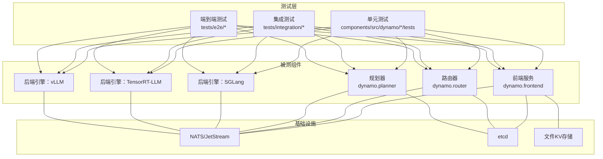
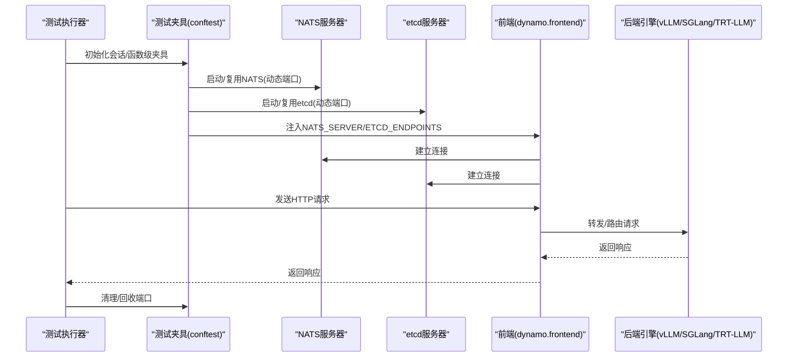
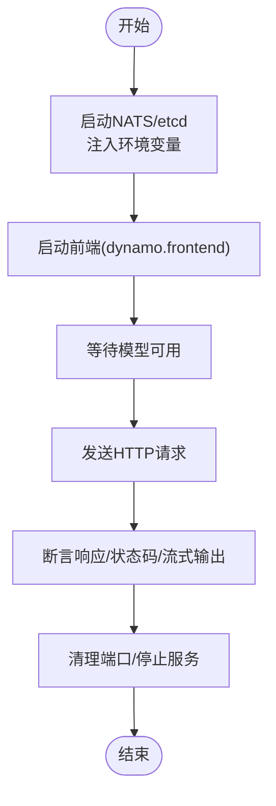
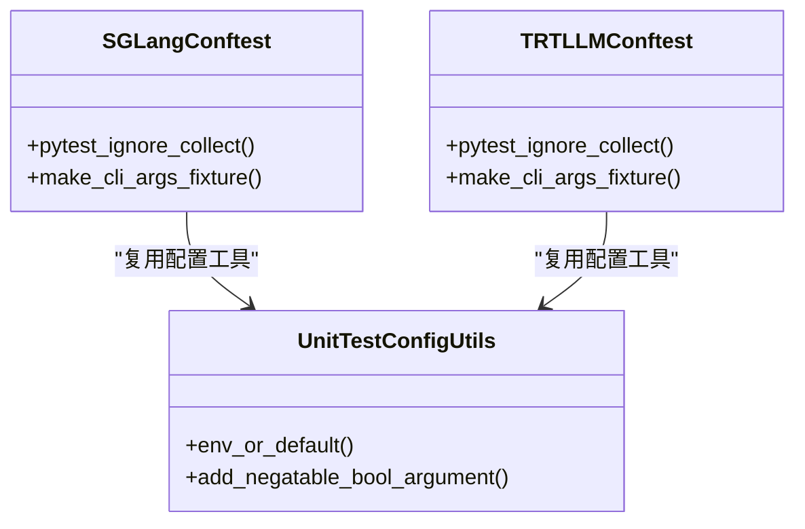
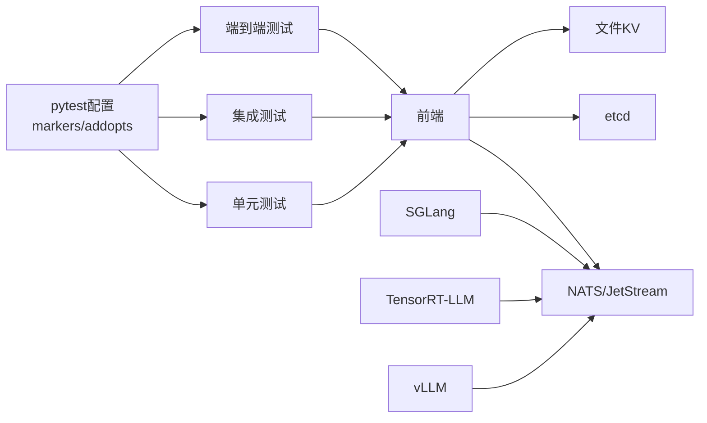

# 测试策略

<cite>
**本文引用的文件**
- [README.md](file://README.md)
- [pyproject.toml](file://pyproject.toml)
- [tests/conftest.py](file://tests/conftest.py)
- [tests/utils/constants.py](file://tests/utils/constants.py)
- [tests/utils/client.py](file://tests/utils/client.py)
- [benchmarks/README.md](file://benchmarks/README.md)
- [components/src/dynamo/common/tests/configuration/test_utils.py](file://components/src/dynamo/common/tests/configuration/test_utils.py)
- [components/src/dynamo/sglang/tests/conftest.py](file://components/src/dynamo/sglang/tests/conftest.py)
- [components/src/dynamo/trtllm/tests/conftest.py](file://components/src/dynamo/trtllm/tests/conftest.py)
</cite>

## 目录
1. [引言](#引言)
2. [项目结构](#项目结构)
3. [核心组件](#核心组件)
4. [架构总览](#架构总览)
5. [详细组件分析](#详细组件分析)
6. [依赖分析](#依赖分析)
7. [性能考虑](#性能考虑)
8. [故障排查指南](#故障排查指南)
9. [结论](#结论)
10. [附录](#附录)

## 引言
本测试策略文档面向Dynamo项目，系统化阐述测试金字塔（单元测试、集成测试、端到端测试）与分层实践，覆盖前端服务、路由器、规划器以及后端引擎（vLLM/SGLang/TensorRT-LLM）的测试方法；提供测试环境搭建指南（含测试数据库、消息中间件、测试数据准备）、测试覆盖率与质量门禁建议、性能与压力测试实施方案、测试自动化与CI/CD集成思路，以及测试数据管理与结果分析方法。

## 项目结构
Dynamo采用多语言混合架构：前端与运行时以Rust实现，Python用于扩展与测试框架；测试体系集中在tests目录，并在components子模块中包含若干单元测试；benchmarks目录提供性能基准工具。整体测试组织遵循“按功能域分层”的原则：单元测试聚焦纯函数与小对象，集成测试验证组件间交互，端到端测试覆盖真实部署场景。

图示来源
- [tests/conftest.py](file://tests/conftest.py#L271-L422)
- [tests/utils/constants.py](file://tests/utils/constants.py#L13-L39)
- [benchmarks/README.md](file://benchmarks/README.md#L16-L75)

章节来源
- [README.md](file://README.md#L343-L398)
- [pyproject.toml](file://pyproject.toml#L143-L261)
- [tests/conftest.py](file://tests/conftest.py#L1-L810)
- [tests/utils/constants.py](file://tests/utils/constants.py#L1-L39)
- [benchmarks/README.md](file://benchmarks/README.md#L1-L75)

## 核心组件
- 单元测试（Unit Tests）
  - 覆盖纯函数、参数解析、配置工具等逻辑，强调可重复性与快速反馈。
  - 示例：配置工具函数测试。
- 集成测试（Integration Tests）
  - 验证组件间接口与协议一致性，如前端与后端引擎、路由器与KV事件、规划器与资源调度等。
  - 示例：KVBM行为与确定性测试、路由端到端测试。
- 端到端测试（End-to-End Tests）
  - 在真实或容器化环境中，从HTTP入口到后端引擎的完整链路验证，包含模型可用性等待、并发与稳定性校验。
  - 示例：多后端端到端测试、故障容忍测试。

章节来源
- [components/src/dynamo/common/tests/configuration/test_utils.py](file://components/src/dynamo/common/tests/configuration/test_utils.py#L1-L201)
- [tests/utils/client.py](file://tests/utils/client.py#L155-L233)

## 架构总览
测试运行时基础设施通过共享/动态端口分配与进程托管，确保并行安全与可重复性。NATS用于请求与KV事件传输，etcd用于服务发现与状态存储，文件KV作为轻量替代方案。测试夹具负责服务生命周期管理与环境变量注入。

图示来源
- [tests/conftest.py](file://tests/conftest.py#L690-L730)
- [tests/conftest.py](file://tests/conftest.py#L732-L757)
- [tests/conftest.py](file://tests/conftest.py#L271-L422)

章节来源
- [tests/conftest.py](file://tests/conftest.py#L271-L422)
- [tests/conftest.py](file://tests/conftest.py#L690-L730)
- [tests/conftest.py](file://tests/conftest.py#L732-L757)

## 详细组件分析

### 前端服务测试
- 测试目标
  - 验证OpenAI兼容HTTP接口的正确性、流式输出、错误处理与超时控制。
  - 验证与NATS/etcd/文件KV的集成与切换。
- 关键夹具
  - 动态端口分配与服务注入：runtime_services_dynamic_ports。
  - 文件KV后端：file_storage_backend。
  - 模型可用性等待：wait_for_model_availability。
- 典型流程
  - 启动NATS/etcd → 启动前端 → 等待模型就绪 → 发送请求 → 断言响应。

图示来源
- [tests/conftest.py](file://tests/conftest.py#L690-L730)
- [tests/utils/client.py](file://tests/utils/client.py#L155-L233)

章节来源
- [tests/conftest.py](file://tests/conftest.py#L690-L730)
- [tests/utils/client.py](file://tests/utils/client.py#L155-L233)

### 路由器测试
- 测试目标
  - 验证请求路由策略、负载均衡、KV前缀感知路由、失败恢复与迁移。
- 测试范围
  - 多后端端到端：SGLang/TRT-LLM/vLLM。
  - 多拓扑：聚合/拆分推理、KV缓存协同。
- 数据与并发
  - 使用统一测试模型集合与并发配置，结合KV事件JetStream或Core模式。

章节来源
- [tests/router/test_router_e2e_with_sglang.py](file://tests/router/test_router_e2e_with_sglang.py)
- [tests/router/test_router_e2e_with_trtllm.py](file://tests/router/test_router_e2e_with_trtllm.py)
- [tests/router/test_router_e2e_with_vllm.py](file://tests/router/test_router_e2e_with_vllm.py)

### 规划器测试
- 测试目标
  - 验证资源规划、副本计算、SLA驱动的部署策略与缩放效果。
- 测试类型
  - 单元测试：规划算法与参数解析。
  - 端到端：与部署流水线与监控指标联动。

章节来源
- [tests/planner/unit/](file://tests/planner/unit/)
- [tests/planner/test_scaling_e2e.py](file://tests/planner/test_scaling_e2e.py)

### 后端集成测试（vLLM/SGLang/TensorRT-LLM）
- 测试目标
  - 验证后端引擎适配、参数传递、多模态输入、性能与稳定性。
- 条件收集
  - 当后端未安装时跳过对应测试文件，避免导入错误。
- 夹具与参数
  - CLI参数模拟、后端特定标志位、模型选择与并发度。

图示来源
- [components/src/dynamo/sglang/tests/conftest.py](file://components/src/dynamo/sglang/tests/conftest.py#L1-L44)
- [components/src/dynamo/trtllm/tests/conftest.py](file://components/src/dynamo/trtllm/tests/conftest.py#L1-L44)
- [components/src/dynamo/common/tests/configuration/test_utils.py](file://components/src/dynamo/common/tests/configuration/test_utils.py#L1-L201)

章节来源
- [components/src/dynamo/sglang/tests/conftest.py](file://components/src/dynamo/sglang/tests/conftest.py#L1-L44)
- [components/src/dynamo/trtllm/tests/conftest.py](file://components/src/dynamo/trtllm/tests/conftest.py#L1-L44)
- [components/src/dynamo/common/tests/configuration/test_utils.py](file://components/src/dynamo/common/tests/configuration/test_utils.py#L1-L201)

### KVBM与确定性测试
- 测试目标
  - 验证KV行为与模型确定性、CUDA图、分块预填充等关键路径。
- 测试类型
  - 单元/集成：KVBM功能与一致性。
  - 端到端：聚合/拆分推理下的确定性对比。

章节来源
- [tests/kvbm_integration/](file://tests/kvbm_integration/)

### 故障容忍测试
- 测试目标
  - 请求取消、GPU睡眠/唤醒、故障注入、迁移与高可用。
- 测试类型
  - 针对vLLM/SGLang/TRT-LLM的取消与迁移测试。

章节来源
- [tests/fault_tolerance/](file://tests/fault_tolerance/)

## 依赖分析
- 测试框架与插件
  - pytest主配置、严格标记、日志、mypy集成、并行执行支持。
- 运行时依赖
  - NATS（JetStream可选）、etcd、文件KV。
- 后端依赖
  - vLLM/SGLang/TensorRT-LLM按需安装，条件收集避免导入异常。
- 并行与隔离
  - 动态端口分配、共享服务文件锁、会话级服务复用。

图示来源
- [pyproject.toml](file://pyproject.toml#L143-L261)
- [tests/conftest.py](file://tests/conftest.py#L271-L422)
- [tests/conftest.py](file://tests/conftest.py#L690-L730)

章节来源
- [pyproject.toml](file://pyproject.toml#L143-L261)
- [tests/conftest.py](file://tests/conftest.py#L271-L422)
- [tests/conftest.py](file://tests/conftest.py#L690-L730)

## 性能考虑
- 基准与可视化
  - 使用benchmarks工具对Dynamo部署进行端到端吞吐/延迟评估，支持并发、序列长度与模型自定义，生成可视化图表。
- 压力测试
  - 结合动态端口与共享服务，构造高并发场景，观察NATS/etcd瓶颈与后端引擎饱和点。
- 指标采集
  - 利用Prometheus客户端与内置指标导出，结合Grafana仪表盘进行趋势分析。

章节来源
- [benchmarks/README.md](file://benchmarks/README.md#L16-L75)

## 故障排查指南
- 日志与输出
  - 测试夹具自动为每个测试用例创建独立日志文件，便于定位问题。
- 模型可用性
  - 使用wait_for_model_availability轮询检测模型就绪状态，支持可调超时与重试间隔。
- 端口冲突
  - 使用动态端口分配与共享服务机制，避免xvfb/UCX等环境差异导致的冲突。
- 环境变量
  - 通过夹具设置NATS_SERVER/ETCD_ENDPOINTS，确保组件连接一致。

章节来源
- [tests/conftest.py](file://tests/conftest.py#L234-L247)
- [tests/utils/client.py](file://tests/utils/client.py#L155-L233)
- [tests/conftest.py](file://tests/conftest.py#L690-L730)

## 结论
Dynamo测试策略以测试金字塔为核心，结合严格的夹具与基础设施管理、条件化的后端测试与完善的性能基准工具，形成从单元到端到端的全链路保障。建议在CI中分层执行：优先运行单元与集成测试，再在专用环境执行端到端与性能测试，并以质量门禁约束失败率与覆盖率阈值。

## 附录

### 测试环境搭建指南
- 容器化运行
  - 使用官方容器镜像快速启动前端与后端引擎，减少本地依赖。
- 本地开发
  - 参考安装与构建步骤，启用所需后端依赖，使用--store-kv file与禁用KV事件以降低外部依赖。
- 基础设施
  - 通过docker-compose或夹具启动NATS与etcd，或在Kubernetes上使用原生服务发现。

章节来源
- [README.md](file://README.md#L87-L197)

### 测试数据与模型管理
- 测试模型
  - 统一常量集中管理，支持按需下载与离线模式。
- 数据准备
  - 使用夹具预下载模型与分词器，避免测试执行期阻塞。

章节来源
- [tests/utils/constants.py](file://tests/utils/constants.py#L13-L39)
- [tests/conftest.py](file://tests/conftest.py#L128-L232)

### 测试自动化与CI/CD集成
- 标记与并行
  - 使用pytest标记区分单元/集成/端到端、GPU需求、慢测试等，配合pytest-xdist并行执行。
- 质量门禁
  - 建议设置失败用例上限、关键测试失败必阻断、覆盖率阈值（如语句/分支/函数）。
- 结果归档
  - 归档测试日志、基准结果与可视化图表，便于回溯与趋势分析。

章节来源
- [pyproject.toml](file://pyproject.toml#L217-L261)
- [benchmarks/README.md](file://benchmarks/README.md#L16-L75)