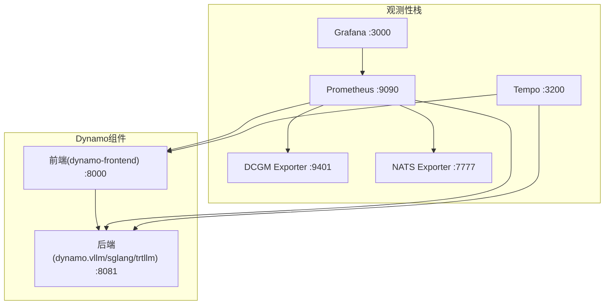
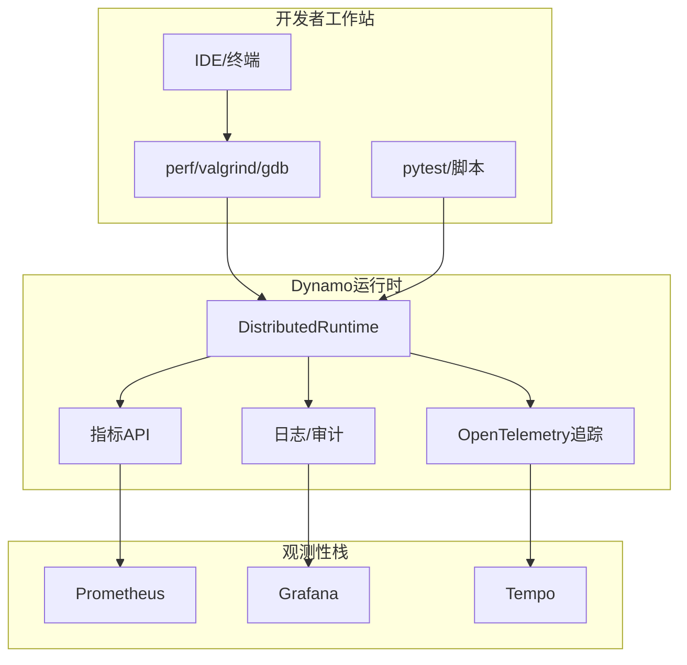
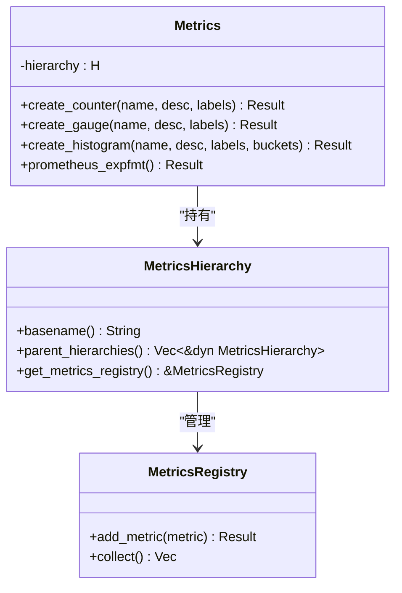
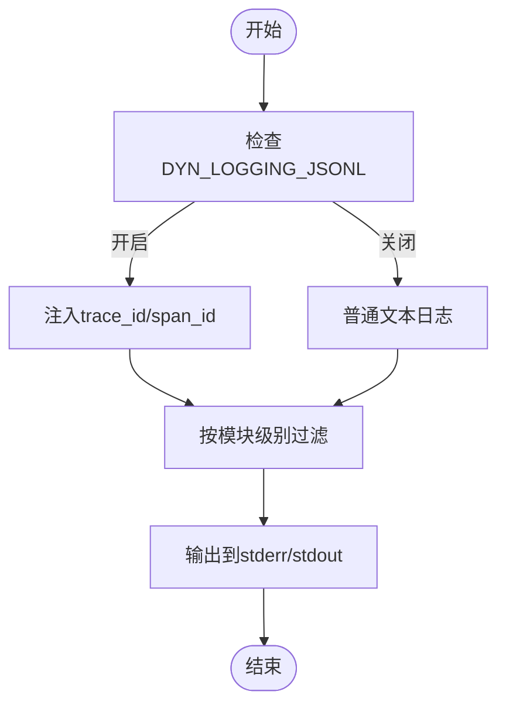
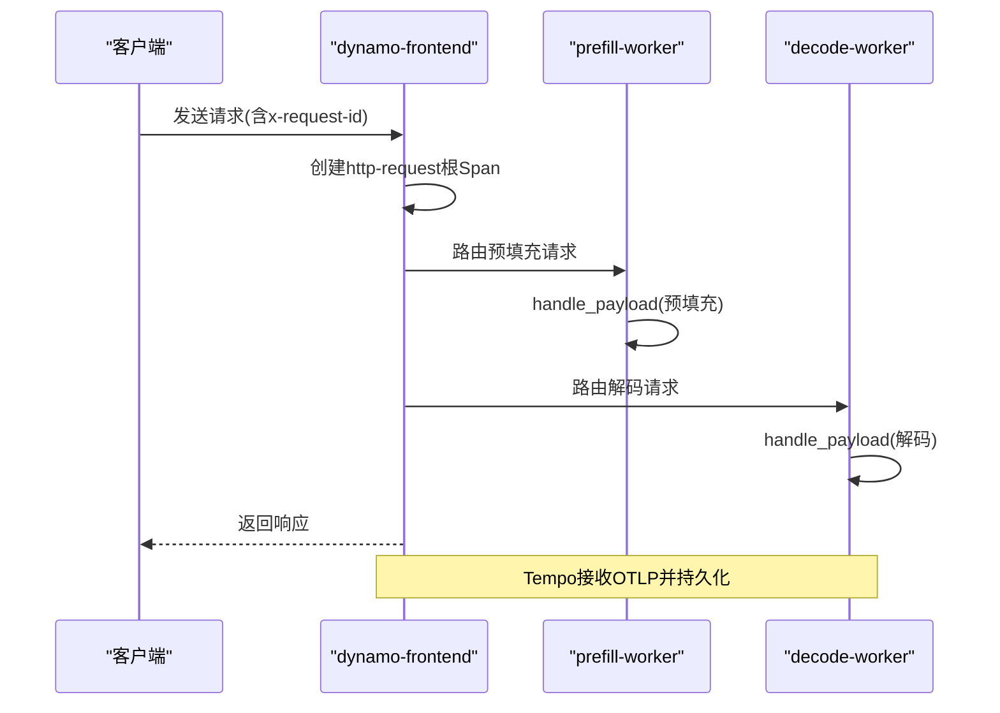
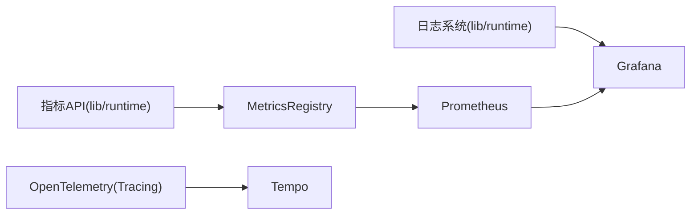

# 调试与性能分析

<cite>
**本文引用的文件**
- [README.md](file://README.md)
- [docs/pages/observability/README.md](file://docs/pages/observability/README.md)
- [docs/pages/observability/metrics.md](file://docs/pages/observability/metrics.md)
- [docs/pages/observability/logging.md](file://docs/pages/observability/logging.md)
- [docs/pages/observability/tracing.md](file://docs/pages/observability/tracing.md)
- [docs/pages/performance/tuning.md](file://docs/pages/performance/tuning.md)
- [benchmarks/README.md](file://benchmarks/README.md)
- [benchmarks/profiler/README.md](file://benchmarks/profiler/README.md)
- [.devcontainer/README.md](file://.devcontainer/README.md)
- [.devcontainer/devcontainer.json.j2](file://.devcontainer/devcontainer.json.j2)
- [lib/runtime/src/metrics.rs](file://lib/runtime/src/metrics.rs)
- [lib/runtime/src/metrics/prometheus_names.rs](file://lib/runtime/src/metrics/prometheus_names.rs)
- [lib/runtime/src/config.rs](file://lib/runtime/src/config.rs)
- [lib/llm/src/audit/bus.rs](file://lib/llm/src/audit/bus.rs)
- [lib/llm/src/audit/config.rs](file://lib/llm/src/audit/config.rs)
- [tests/fault_tolerance/hardware/fault_injection_service/agents/gpu_fault_injector/agent.py](file://tests/fault_tolerance/hardware/fault_injection_service/agents/gpu_fault_injector/agent.py)
- [tests/fault_tolerance/hardware/fault_injection_service/agents/gpu_fault_injector/gpu_xid_injector.py](file://tests/fault_tolerance/hardware/fault_injection_service/agents/gpu_fault_injector/gpu_xid_injector.py)
- [deploy/observability/README.md](file://deploy/observability/README.md)
- [SECURITY.md](file://SECURITY.md)
</cite>

## 目录
1. [简介](#简介)
2. [项目结构](#项目结构)
3. [核心组件](#核心组件)
4. [架构总览](#架构总览)
5. [详细组件分析](#详细组件分析)
6. [依赖关系分析](#依赖关系分析)
7. [性能考量](#性能考量)
8. [故障排查指南](#故障排查指南)
9. [结论](#结论)
10. [附录](#附录)

## 简介
本指南面向Dynamo项目的多语言调试与性能分析场景，覆盖Rust程序调试、Python代码调试与Go服务调试；提供性能分析工具使用（火焰图、内存分析、并发分析）；解释监控指标采集与分析（Prometheus指标、日志分析、链路追踪）；总结常见性能瓶颈识别与优化方法（CPU密集型、I/O等待、内存泄漏）；并给出调试工具链配置建议（GDB、Valgrind、perf等）以及生产环境调试的安全注意事项与最佳实践。

## 项目结构
Dynamo采用分层与模块化组织方式：前端与后端组件通过统一运行时框架暴露系统状态端口与指标；观测性栈由Prometheus、Grafana、Tempo构成；基准测试与剖析工具位于benchmarks目录；开发容器提供一致的调试与构建环境。

图表来源
- [docs/pages/observability/README.md](file://docs/pages/observability/README.md#L62-L87)

章节来源
- [README.md](file://README.md)
- [docs/pages/observability/README.md](file://docs/pages/observability/README.md#L1-L100)

## 核心组件
- 指标体系与命名规范：集中化的指标名称常量与规范化流程，确保跨组件一致性与可解析性。
- 日志与审计：支持结构化日志（文本/JSONL）、可选Span事件记录、审计策略与Sink配置。
- 链路追踪：基于OpenTelemetry的分布式追踪，导出至Tempo并在Grafana中可视化。
- 基准与剖析：封装AIPerf的基准框架，提供部署端点的压测与结果可视化；剖析文档迁移至组件文档页。
- 开发容器：统一的本地开发与调试环境，内置GPU直通、共享内存、ulimit等调试友好的容器参数。

章节来源
- [lib/runtime/src/metrics/prometheus_names.rs](file://lib/runtime/src/metrics/prometheus_names.rs#L1-L50)
- [lib/runtime/src/metrics.rs](file://lib/runtime/src/metrics.rs#L354-L376)
- [lib/runtime/src/config.rs](file://lib/runtime/src/config.rs#L458-L483)
- [lib/llm/src/audit/bus.rs](file://lib/llm/src/audit/bus.rs#L1-L23)
- [lib/llm/src/audit/config.rs](file://lib/llm/src/audit/config.rs#L1-L27)
- [docs/pages/observability/logging.md](file://docs/pages/observability/logging.md#L1-L269)
- [docs/pages/observability/tracing.md](file://docs/pages/observability/tracing.md#L1-L215)
- [benchmarks/README.md](file://benchmarks/README.md#L1-L75)
- [benchmarks/profiler/README.md](file://benchmarks/profiler/README.md#L1-L14)
- [.devcontainer/README.md](file://.devcontainer/README.md#L1-L478)
- [.devcontainer/devcontainer.json.j2](file://.devcontainer/devcontainer.json.j2#L1-L79)

## 架构总览
下图展示Dynamo在调试与性能分析维度的关键交互：前端与后端组件分别暴露系统端口与指标；观测性栈负责采集、存储与可视化；开发容器提供一致的调试环境。

图表来源
- [lib/runtime/src/metrics.rs](file://lib/runtime/src/metrics.rs#L541-L561)
- [docs/pages/observability/metrics.md](file://docs/pages/observability/metrics.md#L1-L224)
- [docs/pages/observability/logging.md](file://docs/pages/observability/logging.md#L1-L269)
- [docs/pages/observability/tracing.md](file://docs/pages/observability/tracing.md#L1-L215)

## 详细组件分析

### 指标系统与Prometheus集成
- 指标层次结构：DistributedRuntime、Namespace、Component、Endpoint四层，便于按域聚合与查询。
- 指标类型与命名：Counter/IntCounter、Gauge/IntGauge、Histogram等，遵循统一前缀与后缀约定，避免歧义。
- 暴露端点：默认后端组件在系统端口（如8081）以Prometheus文本格式输出指标。
- 可视化：Grafana数据源指向Prometheus，结合仪表盘进行聚合分析。

图表来源
- [lib/runtime/src/metrics.rs](file://lib/runtime/src/metrics.rs#L541-L561)
- [lib/runtime/src/metrics.rs](file://lib/runtime/src/metrics.rs#L378-L382)
- [lib/runtime/src/metrics.rs](file://lib/runtime/src/metrics.rs#L354-L376)

章节来源
- [lib/runtime/src/metrics/prometheus_names.rs](file://lib/runtime/src/metrics/prometheus_names.rs#L16-L50)
- [lib/runtime/src/metrics.rs](file://lib/runtime/src/metrics.rs#L974-L988)
- [docs/pages/observability/metrics.md](file://docs/pages/observability/metrics.md#L61-L124)

### 日志与审计
- 结构化日志：支持文本与JSONL两种格式，启用JSONL时自动注入trace_id/span_id，便于与追踪关联。
- 日志级别与过滤：按目标模块设置细粒度日志级别；可选择是否使用本地时区。
- 审计策略：从环境变量初始化审计策略，支持强制日志记录与Sink开关。
- 追踪上下文：在日志中直接呈现Span信息，无需外部追踪后端即可进行短时调试。

图表来源
- [docs/pages/observability/logging.md](file://docs/pages/observability/logging.md#L15-L27)
- [lib/runtime/src/config.rs](file://lib/runtime/src/config.rs#L458-L483)
- [lib/llm/src/audit/config.rs](file://lib/llm/src/audit/config.rs#L15-L27)

章节来源
- [docs/pages/observability/logging.md](file://docs/pages/observability/logging.md#L1-L269)
- [lib/runtime/src/config.rs](file://lib/runtime/src/config.rs#L458-L483)
- [lib/llm/src/audit/bus.rs](file://lib/llm/src/audit/bus.rs#L1-L23)
- [lib/llm/src/audit/config.rs](file://lib/llm/src/audit/config.rs#L1-L27)

### 链路追踪与可视化
- 导出配置：通过环境变量开启JSONL与OTLP导出，指定服务名与端点。
- 组件协作：前端与后端组件分别设置服务名，形成跨服务的根Span与子Span。
- 可视化：在Grafana Explore中选择Tempo数据源，按服务名、Span名或标签检索，查看火焰图与耗时分解。

图表来源
- [docs/pages/observability/tracing.md](file://docs/pages/observability/tracing.md#L18-L26)
- [docs/pages/observability/tracing.md](file://docs/pages/observability/tracing.md#L113-L141)

章节来源
- [docs/pages/observability/tracing.md](file://docs/pages/observability/tracing.md#L1-L215)

### 基准与剖析
- 基准框架：封装AIPerf，支持对DynamoGraphDeployment或任意HTTP端点进行压测，生成结果并可视化。
- 剖析文档：剖析概览与指南迁移到组件文档页，便于按组件深入分析。

章节来源
- [benchmarks/README.md](file://benchmarks/README.md#L1-L75)
- [benchmarks/profiler/README.md](file://benchmarks/profiler/README.md#L1-L14)

### 开发容器与调试环境
- 容器特性：GPU直通、主机网络、共享IPC、提升ulimit、启用ptrace，适配GDB/Valgrind/Perf等调试工具。
- 启动流程：IDE通过Dev Containers扩展打开容器，自动挂载工作区、持久化历史与缓存。
- 本地开发镜像：提供本地用户权限与额外开发者工具，便于快速迭代与调试。

章节来源
- [.devcontainer/README.md](file://.devcontainer/README.md#L119-L210)
- [.devcontainer/devcontainer.json.j2](file://.devcontainer/devcontainer.json.j2#L11-L20)
- [.devcontainer/devcontainer.json.j2](file://.devcontainer/devcontainer.json.j2#L61-L62)

## 依赖关系分析
- 指标依赖：指标API依赖运行时层次结构与注册表，最终以Prometheus文本格式输出。
- 日志与追踪：日志系统与OpenTelemetry库耦合，通过环境变量控制导出；审计模块独立于日志但可协同。
- 观测性栈：Prometheus抓取后端系统端口与DCGM/NATS Exporter；Grafana作为可视化入口；Tempo接收OTLP追踪。

图表来源
- [lib/runtime/src/metrics.rs](file://lib/runtime/src/metrics.rs#L541-L561)
- [docs/pages/observability/README.md](file://docs/pages/observability/README.md#L62-L87)

章节来源
- [lib/runtime/src/metrics.rs](file://lib/runtime/src/metrics.rs#L541-L561)
- [docs/pages/observability/README.md](file://docs/pages/observability/README.md#L1-L100)

## 性能考量
- 性能调优：通过引擎并行映射、路由器配置与预填/解码引擎数量三方面进行调优；结合AIPerf对比SLA确定最优配置。
- 指标解读：区分“在途”与“HTTP队列”两类时延指标，理解排队与处理阶段的占比，定位瓶颈。
- 内存布局验证：通过内存区域地址/大小校验，发现潜在布局错误导致的内存安全问题。

章节来源
- [docs/pages/performance/tuning.md](file://docs/pages/performance/tuning.md#L1-L137)
- [docs/pages/observability/metrics.md](file://docs/pages/observability/metrics.md#L176-L218)
- [lib/llm/src/block_manager/layout/utils.rs](file://lib/llm/src/block_manager/layout/utils.rs#L158-L198)

## 故障排查指南
- 指标不可见或异常
  - 检查系统端口与指标暴露：确认后端组件已启用系统端口并监听。
  - 校验指标前缀与标签：遵循统一命名规范，避免重复或歧义。
- 日志无上下文或过多噪声
  - 控制日志级别与模块过滤；必要时开启Span事件记录以便定位关键节点。
- 追踪缺失或不完整
  - 确认JSONL与OTLP导出已启用；服务名与端点配置正确；Grafana Tempo数据源可用。
- GPU相关故障注入与健康检测
  - 使用GPU故障注入代理模拟XID事件，结合DCGM健康监控验证系统韧性。
- 生产环境安全注意事项
  - 严格限制敏感信息输出；最小化导出范围；遵循漏洞上报流程。

章节来源
- [docs/pages/observability/metrics.md](file://docs/pages/observability/metrics.md#L16-L22)
- [docs/pages/observability/logging.md](file://docs/pages/observability/logging.md#L15-L27)
- [docs/pages/observability/tracing.md](file://docs/pages/observability/tracing.md#L18-L26)
- [tests/fault_tolerance/hardware/fault_injection_service/agents/gpu_fault_injector/agent.py](file://tests/fault_tolerance/hardware/fault_injection_service/agents/gpu_fault_injector/agent.py#L89-L116)
- [tests/fault_tolerance/hardware/fault_injection_service/agents/gpu_fault_injector/gpu_xid_injector.py](file://tests/fault_tolerance/hardware/fault_injection_service/agents/gpu_fault_injector/gpu_xid_injector.py#L32-L76)
- [SECURITY.md](file://SECURITY.md#L18-L31)

## 结论
Dynamo提供了完善的观测性基础设施与开发调试环境：统一的指标命名与层次结构、结构化日志与审计、OpenTelemetry追踪与可视化、基准与剖析工具，以及可复用的开发容器。结合本文提供的工具链配置与最佳实践，可在多语言环境下高效定位性能瓶颈并保障生产安全。

## 附录

### 多语言调试与性能分析要点
- Rust程序调试
  - 使用开发容器中的GDB/LLDB；启用ptrace与适当ulimit；在测试中结合异步与计算负载干扰实验。
- Python代码调试
  - 在开发容器内使用IDE断点与日志；利用JSONL日志与Span ID快速关联请求生命周期。
- Go服务调试
  - 在开发容器中使用Delve；结合perf/火焰图定位热点；通过Prometheus/Grafana观察系统级指标。

章节来源
- [.devcontainer/devcontainer.json.j2](file://.devcontainer/devcontainer.json.j2#L11-L20)
- [lib/runtime/examples/async_vs_compute_interaction.rs](file://lib/runtime/examples/async_vs_compute_interaction.rs#L366-L466)
- [docs/pages/observability/logging.md](file://docs/pages/observability/logging.md#L97-L118)
- [docs/pages/observability/tracing.md](file://docs/pages/observability/tracing.md#L113-L141)