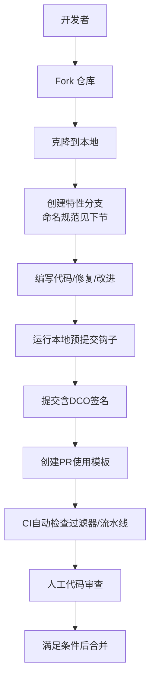
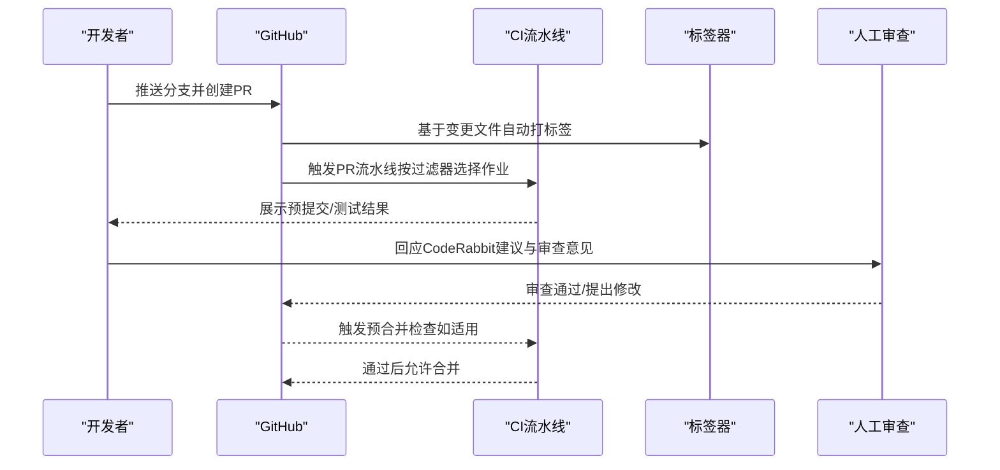

# 贡献流程

<cite>
**本文引用的文件**
- [CONTRIBUTING.md](file://CONTRIBUTING.md)
- [.github/pull_request_template.md](file://.github/pull_request_template.md)
- [.github/ISSUE_TEMPLATE/bug_report.yml](file://.github/ISSUE_TEMPLATE/bug_report.yml)
- [.github/ISSUE_TEMPLATE/feature_request.yml](file://.github/ISSUE_TEMPLATE/feature_request.yml)
- [.github/ISSUE_TEMPLATE/contribution_request.yml](file://.github/ISSUE_TEMPLATE/contribution_request.yml)
- [.github/labeler.yml](file://.github/labeler.yml)
- [.github/FILTERS.md](file://.github/FILTERS.md)
- [.github/workflows/container-validation-dynamo.yml](file://.github/workflows/container-validation-dynamo.yml)
- [.github/workflows/pre-merge.yml](file://.github/workflows/pre-merge.yml)
- [.github/workflows/pr.yaml](file://.github/workflows/pr.yaml)
- [.pre-commit-config.yaml](file://.pre-commit-config.yaml)
- [DCO.md](file://DCO.md)
- [CODE_OF_CONDUCT.md](file://CODE_OF_CONDUCT.md)
</cite>

## 目录
1. [简介](#简介)
2. [项目结构与贡献入口](#项目结构与贡献入口)
3. [核心流程：从Fork到PR合并](#核心流程从fork到pr合并)
4. [Issue 管理流程](#issue-管理流程)
5. [代码审查与CI要求](#代码审查与ci要求)
6. [DCO 签名与许可证合规](#dco-签名与许可证合规)
7. [贡献分类与“good-first-issue”](#贡献分类与good-first-issue)
8. [PR 合并前最终检查清单](#pr-合并前最终检查清单)
9. [常见问题与排障](#常见问题与排障)
10. [结论](#结论)

## 简介
本文件面向所有希望为Dynamo项目做出贡献的外部与内部开发者，系统化说明从Fork仓库到PR合并的完整流程，涵盖分支命名、提交信息格式、PR描述标准；Issue管理（含Bug报告、功能请求、贡献请求模板）；代码审查流程（含CodeRabbit自动化检查、人工审查与CI测试）；DCO签名与许可证合规；贡献分类（如good-first-issue）；以及PR合并前的最终检查清单与常见问题处理。

## 项目结构与贡献入口
- 贡献指南与总流程：参见项目根目录贡献文档，其中包含快速路径、架构概览、工作流与质量要求等。
- Issue 模板与标签：通过GitHub Issue模板标准化Bug、功能请求与贡献请求的填写内容，并配合自动标签器按变更文件自动打标签。
- CI 工作流：包含PR触发的多组件流水线、预合并检查、容器构建与测试、Operator与后端矩阵测试等。

图表来源
- [CONTRIBUTING.md](file://CONTRIBUTING.md#L176-L214)
- [.pre-commit-config.yaml](file://.pre-commit-config.yaml#L16-L102)
- [.github/workflows/container-validation-dynamo.yml](file://.github/workflows/container-validation-dynamo.yml#L1-L153)
- [.github/workflows/pre-merge.yml](file://.github/workflows/pre-merge.yml#L1-L160)

章节来源
- [CONTRIBUTING.md](file://CONTRIBUTING.md#L120-L174)

## 核心流程：从Fork到PR合并
- Fork与克隆：在GitHub上Fork主仓库，克隆到本地并设置上游以同步更新。
- 分支命名规范：建议采用“你的名字/类型-简要描述”的形式，例如“yourname/fix-xxx”或“yourname/feat-xxx”，便于追踪与审查。
- 变更范围判断：
  - 小改动（<100行）且聚焦：可直接提交PR，无需先建Issue。
  - 大改动或需要设计讨论：先开Issue（贡献请求模板），获得批准后再提交PR。
- 提交信息格式：遵循约定式提交风格，例如“type(scope): subject”，并在提交信息末尾包含“Signed-off-by”（DCO签名）。
- PR 描述：使用仓库提供的PR模板，清晰描述变更概述、细节、审查重点与关联的Issue编号。
- 代码审查与CI：
  - 自动化：预提交钩子、CodeRabbit建议、CI流水线按变更文件自动筛选执行。
  - 人工审查：根据变更文件自动打上的标签，匹配相应负责人进行审查。
  - 外部贡献者需由维护者触发完整CI（评论“/ok to test <commit-id>”）。
- 合并：满足所有检查项后，PR被合并。

章节来源
- [CONTRIBUTING.md](file://CONTRIBUTING.md#L24-L31)
- [CONTRIBUTING.md](file://CONTRIBUTING.md#L176-L214)
- [.github/pull_request_template.md](file://.github/pull_request_template.md#L1-L16)
- [.github/labeler.yml](file://.github/labeler.yml#L16-L107)

## Issue 管理流程
- Bug 报告：使用Bug模板，必须包含“问题描述、复现步骤、期望行为、实际行为、环境信息”等字段。
- 功能请求：使用功能请求模板，描述需求、遇到的问题与尝试过的替代方案。
- 贡献请求：使用贡献请求模板，明确变更类型、问题陈述、拟解决方案、估算PR规模与受影响文件/组件。
- 优先级与状态：
  - 优先级：Urgent、P0、P1、P2；由影响度决定。
  - 状态标签：needs-triage、needs-info、approved-for-pr、in-progress、blocked等。
  - 响应预期：新Issue通常在几个工作日内响应；高优先级Issue在一周内完成初步分级。
  - 长期无活动的Issue可能被自动关闭（可重新开启）。
- good-first-issue：为新手准备的入门级任务，通常有明确验收标准与建议做法。

章节来源
- [.github/ISSUE_TEMPLATE/bug_report.yml](file://.github/ISSUE_TEMPLATE/bug_report.yml#L1-L72)
- [.github/ISSUE_TEMPLATE/feature_request.yml](file://.github/ISSUE_TEMPLATE/feature_request.yml#L1-L32)
- [.github/ISSUE_TEMPLATE/contribution_request.yml](file://.github/ISSUE_TEMPLATE/contribution_request.yml#L1-L60)
- [CONTRIBUTING.md](file://CONTRIBUTING.md#L85-L117)

## 代码审查与CI要求
- 预提交钩子（pre-commit）：统一代码风格与基础检查，本地运行以减少CI失败概率。
- 自动标签（labeler）：基于变更文件自动为PR打标签（如backend::vllm、router、planner、deployment::k8s、documentation、multimodal等），用于指引审查与通知。
- CI 过滤（filters）：PR中变更文件会触发对应过滤器，仅运行相关CI作业，避免不必要资源消耗。
- CI 流水线：
  - PR流水线：检测变更并按过滤器分派到Operator、后端矩阵（vLLM/SGLang/TRT-LLM）、通用测试等作业。
  - 预合并流水线：对Rust代码执行格式化、依赖许可证检查、文档与单元测试。
  - 容器验证流水线：构建镜像、启动依赖服务、运行Rust与Python测试并归档报告。
- 外部贡献者触发完整CI：需维护者在PR评论“/ok to test <commit-id>”。

图表来源
- [.github/labeler.yml](file://.github/labeler.yml#L16-L107)
- [.github/FILTERS.md](file://.github/FILTERS.md#L1-L70)
- [.github/workflows/pr.yaml](file://.github/workflows/pr.yaml#L1-L200)
- [.github/workflows/pre-merge.yml](file://.github/workflows/pre-merge.yml#L1-L160)
- [.github/workflows/container-validation-dynamo.yml](file://.github/workflows/container-validation-dynamo.yml#L1-L153)

章节来源
- [.pre-commit-config.yaml](file://.pre-commit-config.yaml#L16-L102)
- [.github/labeler.yml](file://.github/labeler.yml#L16-L107)
- [.github/FILTERS.md](file://.github/FILTERS.md#L1-L70)
- [.github/workflows/pr.yaml](file://.github/workflows/pr.yaml#L1-L200)
- [.github/workflows/pre-merge.yml](file://.github/workflows/pre-merge.yml#L1-L160)
- [.github/workflows/container-validation-dynamo.yml](file://.github/workflows/container-validation-dynamo.yml#L1-L153)

## DCO 签名与许可证合规
- DCO 要求：所有提交必须包含“Signed-off-by”行，表明作者具备相应权利并同意以项目许可发布贡献。
- 签名方式：推荐使用“-s”标志自动添加签名；也可通过Web编辑器、桌面客户端或交互式rebase-amend的方式补签。
- 配置建议：可设置Git用户名与邮箱，或使用提交模板自动注入签名行。
- 许可证：贡献默认以Apache 2.0许可发布。

章节来源
- [CONTRIBUTING.md](file://CONTRIBUTING.md#L255-L282)
- [DCO.md](file://DCO.md#L1-L82)

## 贡献分类与“good-first-issue”
- good-first-issue：专为新手准备的任务，通常具备清晰的验收标准与实施建议，适合首次贡献者参与。
- 其他贡献类别：help-wanted、contribution-request等，鼓励社区协作与能力建设。
- 参与建议：从文档修复、小Bug修复、测试改进入手，逐步深入到复杂功能或架构变更。

章节来源
- [CONTRIBUTING.md](file://CONTRIBUTING.md#L34-L47)
- [CONTRIBUTING.md](file://CONTRIBUTING.md#L114-L117)

## PR 合并前最终检查清单
- 本地已通过预提交钩子（pre-commit）。
- 提交信息符合约定式提交风格并包含DCO签名。
- PR描述完整，包含概述、细节、审查重点与关联Issue。
- CI通过：预提交、Rust检查、相关后端/组件测试均通过。
- 人工审查通过，按审查意见完成修改。
- 外部贡献者已获得维护者触发的完整CI通过确认。
- 无阻塞标签（如blocked）且状态标签合理。

章节来源
- [.pre-commit-config.yaml](file://.pre-commit-config.yaml#L16-L102)
- [CONTRIBUTING.md](file://CONTRIBUTING.md#L216-L252)
- [.github/workflows/pre-merge.yml](file://.github/workflows/pre-merge.yml#L55-L160)
- [.github/workflows/container-validation-dynamo.yml](file://.github/workflows/container-validation-dynamo.yml#L43-L142)

## 常见问题与排障
- DCO检查失败：
  - 使用Web编辑器、桌面客户端或CLI交互式rebase-amend补签。
  - 若分支较乱，可将多次提交压缩为单个带签名的提交，或请维护者代为“Squash and Merge”。
  - 可配置Git提交模板以自动注入签名行。
- “未覆盖文件”错误（CI过滤器）：
  - 新增源文件、示例/配方或文档时，需在过滤器中新增匹配模式，确保每个文件至少匹配一个过滤组。
- 预提交失败：
  - 按pre-commit输出逐项修正（格式化、拼写检查、YAML/JSON校验等）。
- 人工审查反馈：
  - 认真对待CodeRabbit建议与审查意见，逐条回应并补充测试或文档。
- 行为准则：
  - 遵循社区行为准则，保持尊重、包容与专业的沟通。

章节来源
- [DCO.md](file://DCO.md#L1-L82)
- [.github/FILTERS.md](file://.github/FILTERS.md#L22-L70)
- [.pre-commit-config.yaml](file://.pre-commit-config.yaml#L16-L102)
- [CODE_OF_CONDUCT.md](file://CODE_OF_CONDUCT.md#L1-L134)

## 结论
遵循上述流程与规范，可以显著提升贡献效率与质量，缩短审查周期并降低CI失败率。建议新贡献者从文档修复与good-first-issue开始，逐步参与更复杂的改进与功能开发。维护者将持续优化模板与流水线，欢迎通过Issue与讨论区反馈改进建议。